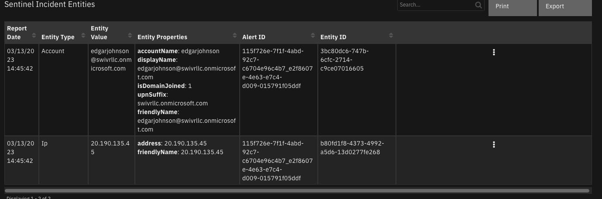

# Microsoft Sentinel

## Table of Contents
- [Release Notes](#release-notes)
- [Overview](#overview)
  - [Key Features](#key-features)
- [Requirements](#requirements)
  - [SOAR platform](#soar-platform)
  - [Cloud Pak for Security](#cloud-pak-for-security)
  - [Proxy Server](#proxy-server)
  - [Python Environment](#python-environment)
- [Sentinel Configuration](#sentinel-configuration)
- [Installation](#installation)
  - [Install](#install)
  - [App Configuration](#app-configuration)
  - [Custom Layouts](#custom-layouts)
- [Function - Sentinel Add Incident Comment](#function---sentinel-add-incident-comment)
- [Function - Sentinel Get Incident Alerts](#function---sentinel-get-incident-alerts)
- [Function - Sentinel Get Incident Comments](#function---sentinel-get-incident-comments)
- [Function - Sentinel Get Incident Entities](#function---sentinel-get-incident-entities)
- [Function - Sentinel Update Incident](#function---sentinel-update-incident)
- [Data Table - Sentinel Incident Alerts](#data-table---sentinel-incident-alerts)
- [Data Table - Sentinel Incident Entities](#data-table---sentinel-incident-entities)
- [Custom Fields](#custom-fields)
- [Playbooks](#playbooks)
- [Custom Templates](#custom-templates)
- [Troubleshooting & Support](#troubleshooting--support)

---

## Release Notes
| 1.2.0 | 7/2023 | Add config setting to not close SOAR case was Sentinel incident is closed |
| 1.1.0 | 4/2023 | Update function 'Sentinel Update Incident' |
| 1.0.4 | 6/2022 | Several template fixes for tags (labels) and severity |
| 1.0.3 | 4/2022 | Support for app.config verify and cert parameters |
| 1.0.2 | 2/2022 | Bug fix in some situations updating Sentinel from SOAR |
| 1.0.1 | 11/2021 | Minor bug fixes and datatable improvements |
| 1.0.0 | 08/2021 | Initial Release |

### v1.0.3

When upgrading from a previous version to v1.0.3, manually update your app.config file to add the `verify` parameter to your `[fn_microsoft_sentinel]` section. The documentation on it's use is in [App Configuration](#app-configuration).

---

## Overview
**SOAR integration for 'fn_microsoft_sentinel'**

 

This app allows bi-directional synchronization between IBM SOAR and Microsoft Sentinel.
Sentinel entities are exposed as artifacts for further investigation.

### Key Features
* Escalate Microsoft Sentinel Incidents to IBM SOAR Cases
* Automatically keep Incidents and Cases synchronized
* Retrieve Sentinel Incident alert entities as artifacts and data table rows
* Sync comments to and from Sentinel Incidents
* Support editable templates for field mapping between the two systems

---

## Requirements
This app supports the IBM Security QRadar SOAR Platform and the IBM Security QRadar SOAR for IBM Cloud Pak for Security.

### SOAR platform
The SOAR platform supports two app deployment mechanisms, Edge Gateway (formerly App Host) and integration server.

If deploying to a SOAR platform with an Edge Gateway, the requirements are:
* SOAR platform >= `45.0.7899`.
* The app is in a container-based format (available from the AppExchange as a `zip` file).

If deploying to a SOAR platform with an integration server, the requirements are:
* SOAR platform >= `45.0.7899`.
* The app is in the older integration format (available from the AppExchange as a `zip` file which contains a `tar.gz` file).
* Integration server is running `resilient_circuits>=46.0.0`.
* If using an API key account, make sure the account provides the following minimum permissions: 
  | Name | Permissions |
  | ---- | ----------- |
  | Org Data | Read |
  | Function | Read |
  | Incident | Read, Edit, Create, Owner, Status |
  | Incident Notes | Edit |

The following SOAR platform guides provide additional information: 
* _Edge Gateway Deployment Guide_ or _App Host Deployment Guide_: provides installation, configuration, and troubleshooting information, including proxy server settings. 
* _Integration Server Guide_: provides installation, configuration, and troubleshooting information, including proxy server settings.
* _System Administrator Guide_: provides the procedure to install, configure and deploy apps. 

The above guides are available on the IBM Documentation website at [ibm.biz/soar-docs](https://ibm.biz/soar-docs). On this web page, select your SOAR platform version. On the follow-on page, you can find the _Edge Gateway Deployment Guide_, _App Host Deployment Guide_, or _Integration Server Guide_ by expanding **Apps** in the Table of Contents pane. The System Administrator Guide is available by expanding **System Administrator**.

### Cloud Pak for Security
If you are deploying to IBM Cloud Pak for Security, the requirements are:
* IBM Cloud Pak for Security >= `1.8`.
* Cloud Pak is configured with an Edge Gateway.
* The app is in a container-based format (available from the AppExchange as a `zip` file).

The following Cloud Pak guides provide additional information: 
* _Edge Gateway Deployment Guide_ or _App Host Deployment Guide_: provides installation, configuration, and troubleshooting information, including proxy server settings. From the Table of Contents, select Case Management and Orchestration & Automation > **Orchestration and Automation Apps**.
* _System Administrator Guide_: provides information to install, configure, and deploy apps. From the IBM Cloud Pak for Security IBM Documentation table of contents, select Case Management and Orchestration & Automation > **System administrator**.

These guides are available on the IBM Documentation website at [ibm.biz/cp4s-docs](https://ibm.biz/cp4s-docs). From this web page, select your IBM Cloud Pak for Security version. From the version-specific IBM Documentation page, select Case Management and Orchestration & Automation.

### Proxy Server
The app **does** support a proxy server.

### Python Environment
Python 3.6 and Python 3.9 are supported.
Additional package dependencies may exist for each of these packages:
* jinja2
* resilient_circuits>=46.0.0
* simplejson

---

## Sentinel Configuration
Several steps are necessary to enable API access to Sentinel. Below is a brief list of steps to complete:

1. Define an App under `App registration`,  for Sentinel access. The Application (client) ID will be used as the app.config `client_id`.

    a. Specify a client secret. This will be used in the app.config file as `api_secret`.

 
 

2. Define a workspace and resource group for the subscription. These names will be defined in the app.config file as `workspace_name` and `resource_groupname`.


3. For your resource group, specify the app with the Sentinel Responder role.


4. Add your tenant_id (Under `Tenant properties`) and subscription_id to the app.config file.

---

## Installation

### Install
* To install or uninstall an App or Integration on the _SOAR platform_, see the documentation at [ibm.biz/soar-docs](https://ibm.biz/soar-docs).
* To install or uninstall an App on _IBM Cloud Pak for Security_, see the documentation at [ibm.biz/cp4s-docs](https://ibm.biz/cp4s-docs) and follow the instructions above to navigate to Orchestration and Automation.

### App Configuration
The following table provides the settings you need to configure the app. These settings are made in the app.config file. See the documentation discussed in the Requirements section for the procedure.

| Config | Required | Example | Description |
| ------ | :------: | ------- | ----------- |
| **azure_url** | Yes | `https://management.azure.com` | *URL for Azure access. This field is typically not changed* |
| **tenant_id** | Yes | `aaa-bbb-ccc` | *Your tenant_id* |
| **client_id** | Yes | `aaa-bbb-ddd` | *Your App Id or client_id* |
| **app_secret** | Yes | `aaa-bbb-eee` | *Your app secret* |
| **polling_lookback** | Yes | `120` | *# of minutes to look back for incident changes. This is used only the first time the app starts* |
| **polling_interval** | Yes | `60` | *# of Seconds to wait until checking for changes in Sentinel. Comment out to disable the poller* |
| **sentinel_profiles** | Yes | `profile_a` | *Comma separated list of profile(s) to access based on subscription id, resource group name and workspace * |
| **https_proxy**| No | `https:/your.proxy.com` | - |
| **http_proxy** | No | `http:/your.proxy.com` | - |
| **verify** | No | `false` | *verify= false or /path/to/client_certificate.pem* |

For each profile:
| Config | Required | Example | Description |
| ------ | :------: | ------- | ----------- |`
| **subscription_id** | Yes | `aaa-bbb-fff` | *subscription_id for incident access * |
| **workspace_name** | Yes | `` | *workspace name for incident access.* |
| **resource_groupname** | Yes | `` | *resource group for incident access.* |
| **new_incident_filters** | Yes | `"status": ["New", "Active"],"severity": ["High", "Medium","Low"]` | *Set of filters to apply when escalating incidents to SOAR SOAR. Incidents not matching the criteria are not synchronized. In this example, both a match of status and severity would be required. * |
| **max_alerts** | Yes | 10 | *limit the number of alerts per sentinel incident to the first n alerts or leave blank for all alerts* |
| **close_soar_case** | No | `True` | Whether the SOAR case should be closed when its linked Sentinel incident is closed. If set to False the linked SOAR case will be updated, but not closed. |
| **create_incident_template** | No | /var/rescircuits/create_incident_template.jinja | Customer supplied template for mapping Sentinel Incident fields to an SOAR incident. If not specified, a default template is used. |
| **update_incident_template** | No | /var/rescircuits/update_incident_template.jinja | Customer supplied template for mapping Sentinel Incident fields to an SOAR incident. If not specified, a default template is used. |
| **close_incident_template** | No | /var/rescircuits/close_incident_template.jinja | Customer supplied template for mapping Sentinel Incident fields to an SOAR incident. If not specified, a default template is used. This is useful when a customer customizes the fields used when closing an incident. |
| **sentinel_update_incident_template** | No | /var/rescircuits/update_sentinel_incident_template.jinja | Customer supplied template for updating a sentinel incident when the SOAR incident is updated |
| **sentinel_close_incident_template** | No | /var/rescircuits/update_sentinel_incident_template.jinja | Customer supplied template for closing a sentinel incident when the SOAR incident is closed |

See the section below for examples of the templates.

### Custom Layouts
* Import the Data Tables and Custom Fields like the screenshot below:

  

  The Sentinel fields are used to capture information specific on a Sentinel Incident, including close incident information (Classification). The datatable, Sentintel Entities, is used to capture specific entity information. Another datatable, Sentinel Comment IDs, is used for tracking purposes and need not be added to a layout.

---

 

## Function - Sentinel Add Incident Comment
Create a comment for a given Sentinel incident. This is used with an rule to automatically sync
SOAR Comments with Sentinel.

<details><summary>Inputs:</summary>
<p>

| Name | Type | Required | Example | Tooltip |
| ---- | :--: | :------: | ------- | ------- |
| `sentinel_incident_comment` | `text` | Yes | `-` | - |
| `sentinel_incident_id` | `text` | Yes | `-` | This is information is captured in a custom incident field. |
| `sentinel_profile` | `text` | Yes | `-` | This is information is captured in a custom incident field. |

</p>
</details>

<details><summary>Outputs:</summary>
<p>

> **NOTE:** This example might be in JSON format, but `results` is a Python Dictionary on the SOAR platform.

```python
results = {
  "content": {
    "id": "/subscriptions/a4b7e24a-xxxx-4d84-xxxx-89e99b336784/resourceGroups/demoassets/providers/Microsoft.OperationalInsights/workspaces/AzureSentinelDemo/providers/Microsoft.SecurityInsights/Incidents/6c98642b-7248-4b4d-994e-32443f100e78/Comments/45cee46a-c1c3-11ed-89ef-fa89897771d7",
    "name": "45cee46a-c1c3-11ed-89ef-fa89897771d7",
    "properties": {
      "author": {
        "email": null,
        "name": "Comment created from external application - MS Sentinel",
        "objectId": "fb5360be-0c6a-4260-ae69-9b07dd735441",
        "userPrincipalName": null
      },
      "createdTimeUtc": "2023-03-13T17:19:57.3027524Z",
      "message": "From IBM SOAR:\nbye"
    },
    "type": "Microsoft.SecurityInsights/Incidents/Comments"
  },
  "inputs": {
    "sentinel_incident_comment": "bye",
    "sentinel_incident_id": "6c98642b-7248-4b4d-994e-32443f100e78",
    "sentinel_profile": "profile_a"
  },
  "metrics": {
    "execution_time_ms": 2222,
    "host": "local",
    "package": "fn-microsoft-sentinel",
    "package_version": "1.1.0",
    "timestamp": "2023-03-13 13:19:57",
    "version": "1.0"
  },
  "raw": null,
  "reason": null,
  "success": true,
  "version": 2.0
}
```

</p>
</details>

<details><summary>Example Pre-Process Script:</summary>
<p>

```python
inputs.sentinel_incident_comment = note.text.content
inputs.sentinel_incident_id = incident.properties.sentinel_incident_number
inputs.sentinel_profile = incident.properties.sentinel_profile
```

</p>
</details>

<details><summary>Example Post-Process Script:</summary>
<p>

```python
# Import Date
import datetime

results = playbook.functions.results.comment_results

if results.get("success"):
  # Get the current time
  dt_now = datetime.datetime.now()
  # note.text = f"<b>Sent to Sentinel at {dt_now}</b><br>{str(note.text.content)}"
```

</p>
</details>

---
## Function - Sentinel Get Incident Alerts
Sentinel Get Incident Alerts

<details><summary>Inputs:</summary>
<p>

| Name | Type | Required | Example | Tooltip |
| ---- | :--: | :------: | ------- | ------- |
| `sentinel_incident_id` | `text` | No | `-` | - |
| `sentinel_profile` | `text` | Yes | `-` | - |

</p>
</details>

<details><summary>Outputs:</summary>
<p>

> **NOTE:** This example might be in JSON format, but `results` is a Python Dictionary on the SOAR platform.

```python
results = {
  "content": {
    "value": [
      {
        "id": "/subscriptions/a4b7e24a-xxxx-4d84-xxxx-89e99b336784/resourceGroups/demoassets/providers/Microsoft.OperationalInsights/workspaces/AzureSentinelDemo/providers/Microsoft.SecurityInsights/Entities/8a2fe554-9e4e-8298-cd70-4159a5494b7e",
        "kind": "SecurityAlert",
        "name": "8a2fe554-9e4e-8298-cd70-4159a5494b7e",
        "properties": {
          "additionalData": {
            "AlertMessageEnqueueTime": "2023-03-12T20:52:26.593Z",
            "OriginalProductComponentName": null,
            "OriginalProductName": "Azure Security Center",
            "StoreAlertPublisher": "{\"Succeeded\":true,\"Reason\":null,\"PublishTime\":\"2023-03-12T20:52:03.3552179Z\"}",
            "effectiveSubscriptionId": "a4b7e24a-xxxx-4d84-xxxx-89e99b336784"
          },
          "alertDisplayName": "Traffic detected from IP addresses recommended for blocking",
          "alertLink": "https://portal.azure.com/#blade/Microsoft_Azure_Security_AzureDefenderForData/AlertBlade/alertId/2517238943999999999_a8f8cc78-9d76-495e-b7b9-dd8fc53e4034/subscriptionId/a4b7e24a-xxxx-4d84-xxxx-89e99b336784/resourceGroup/demoassets/referencedFrom/alertDeepLink/location/centralus",
          "alertType": "Network_TrafficFromUnrecommendedIP",
          "compromisedEntity": "logforwarder",
          "confidenceLevel": "Unknown",
          "description": "Defender for Cloud detected inbound traffic from IP addresses that are recommended to be blocked. This typically occurs when this IP address doesn\u0027t communicate regularly with this resource.\r\nAlternatively, the IP address has been flagged as malicious by Microsoft\u0027s threat intelligence sources.",
          "endTimeUtc": "2023-03-10T00:00:00Z",
          "friendlyName": "Traffic detected from IP addresses recommended for blocking",
          "processingEndTime": "2023-03-12T20:52:01.0089039Z",
          "productName": "Azure Security Center",
          "providerAlertId": "2517238943999999999_a8f8cc78-9d76-495e-b7b9-dd8fc53e4034",
          "remediationSteps": [
            "{\"kind\":\"openBlade\",\"displayValue\":\"Enforce rule\",\"extension\":\"Microsoft_Azure_Security_R3\",\"detailBlade\":\"AdaptiveNetworkControlsResourceBlade\",\"detailBladeInputs\":\"protectedResourceId=/subscriptions/a4b7e24a-xxxx-4d84-xxxx-89e99b336784/resourcegroups/demoassets/providers/microsoft.compute/virtualmachines/logforwarder\"}"
          ],
          "resourceIdentifiers": [
            {
              "resourceId": "/subscriptions/a4b7e24a-xxxx-4d84-xxxx-89e99b336784/resourcegroups/demoassets/providers/microsoft.compute/virtualmachines/logforwarder",
              "subscriptionId": "a4b7e24a-xxxx-4d84-xxxx-89e99b336784",
              "type": "AzureResource"
            },
            {
              "type": "LogAnalytics",
              "workspaceId": "c6c712b0-dc3d-4408-945a-4bde1db6579b"
            }
          ],
          "severity": "Low",
          "startTimeUtc": "2023-03-10T00:00:00Z",
          "status": "New",
          "systemAlertId": "8a2fe554-9e4e-8298-cd70-4159a5494b7e",
          "tactics": [
            "PreAttack"
          ],
          "timeGenerated": "2023-03-12T20:52:26.5903077Z",
          "timeGenerated_ms": 1678654346000,
          "vendorName": "Microsoft"
        },
        "type": "Microsoft.SecurityInsights/Entities"
      }
    ]
  },
  "inputs": {
    "sentinel_incident_id": "6c98642b-7248-4b4d-994e-32443f100e78",
    "sentinel_profile": "profile_a"
  },
  "metrics": {
    "execution_time_ms": 1944,
    "host": "local",
    "package": "fn-microsoft-sentinel",
    "package_version": "1.1.0",
    "timestamp": "2023-03-13 13:05:04",
    "version": "1.0"
  },
  "raw": null,
  "reason": null,
  "success": true,
  "version": 2.0
}
```

</p>
</details>

<details><summary>Example Pre-Process Script:</summary>
<p>

```python
inputs.sentinel_incident_id = incident.properties.sentinel_incident_number
inputs.sentinel_profile = incident.properties.sentinel_profile
```

</p>
</details>

<details><summary>Example Post-Process Script:</summary>
<p>

```python
import datetime

current_dt = datetime.datetime.now()
results = playbook.functions.results.alerts_results

if results.get('success'):
  for alert in results.get('content').get('value'):
    properties = alert.get('properties', {})
    row = incident.addRow("sentinel_incident_alerts")
    row['report_date'] = current_dt
    row['alert_date'] = properties.get('timeGenerated_ms')
    row['alert_name'] = properties.get('alertDisplayName')
    row['alert_description'] = properties.get('description')
    row['alert_type'] = properties.get('alertType')
    row['alert_status'] = properties.get('status')
    row['alert_severity'] = properties.get('severity')
    row['alert_confidence_level'] = properties.get('confidenceLevel')
    row['alert_tactics'] = ",".join(properties.get('tactics', []))
    row['alert_compromised_entity'] = properties.get('compromisedEntity')
    row['alert_remediation_steps'] = helper.createPlainText('\n'.join(properties.get('remediationSteps', [])))
    row['alert_id'] = properties.get('systemAlertId')
    if properties.get('alertLink'):
      row['alert_url'] = helper.createRichText(f"<a target='blank' href='{properties.get('alertLink')}'>Alert Link</a>")
    else:
      row['alert_url'] = helper.createRichText(f"<a target='blank' href='https://security.microsoft.com/alerts/{properties.get('systemAlertId')}'>Alert Link</a>")
```

</p>
</details>

---
## Function - Sentinel Get Incident Comments
Get Comments from a Sentinel Incident

<details><summary>Inputs:</summary>
<p>

| Name | Type | Required | Example | Tooltip |
| ---- | :--: | :------: | ------- | ------- |
| `incident_id` | `number` | No | `SOAR Incident ID` | IncidentID |
| `sentinel_incident_id` | `text` | No | `-` | - |
| `sentinel_profile` | `text` | Yes | `-` | - |

</p>
</details>

<details><summary>Outputs:</summary>
<p>

> **NOTE:** This example might be in JSON format, but `results` is a Python Dictionary on the SOAR platform.

```python
results = {
  "content": {
    "value": [
      {
        "id": "/subscriptions/a4b7e24a-xxxx-4d84-xxxx-89e99b336784/resourceGroups/demoassets/providers/Microsoft.OperationalInsights/workspaces/AzureSentinelDemo/providers/Microsoft.SecurityInsights/Incidents/6c98642b-7248-4b4d-994e-32443f100e78/Comments/cdd41cd8-7d4e-4b7a-976f-f409938fe791",
        "name": "cdd41cd8-7d4e-4b7a-976f-f409938fe791",
        "properties": {
          "author": {
            "email": "admin@example.com",
            "name": "Admin",
            "objectId": "43dd7b73-6a70-475e-88c3-609a9f30b514",
            "userPrincipalName": "admin@example.com"
          },
          "createdTimeUtc": "2023-03-13T17:19:47.2791036Z",
          "message": "bye"
        },
        "type": "Microsoft.SecurityInsights/Incidents/Comments"
      }
    ]
  },
  "inputs": {
    "incident_id": 2178,
    "sentinel_incident_id": "6c98642b-7248-4b4d-994e-32443f100e78",
    "sentinel_profile": "profile_a"
  },
  "metrics": {
    "execution_time_ms": 1426,
    "host": "local",
    "package": "fn-microsoft-sentinel",
    "package_version": "1.1.0",
    "timestamp": "2023-03-13 13:19:53",
    "version": "1.0"
  },
  "raw": null,
  "reason": null,
  "success": true,
  "version": 2.0
}
```

</p>
</details>

<details><summary>Example Pre-Process Script:</summary>
<p>

```python
inputs.sentinel_incident_id = incident.properties.sentinel_incident_number
inputs.incident_id = incident.id
inputs.sentinel_profile = incident.properties.sentinel_profile
```

</p>
</details>

<details><summary>Example Post-Process Script:</summary>
<p>

```python
results = playbook.functions.results.comment_results
if results.get("success"):
  for comment in results.get("content").get('value'):
    incident.addNote(helper.createRichText(comment.get('properties').get('message')))
```

</p>
</details>

---
## Function - Sentinel Get Incident Entities
Get the Entities associated with a Sentinel Incident

<details><summary>Inputs:</summary>
<p>

| Name | Type | Required | Example | Tooltip |
| ---- | :--: | :------: | ------- | ------- |
| `sentinel_incident_id` | `text` | No | `-` | - |
| `sentinel_profile` | `text` | Yes | `-` | - |

</p>
</details>

<details><summary>Outputs:</summary>
<p>

> **NOTE:** This example might be in JSON format, but `results` is a Python Dictionary on the SOAR platform.

```python
results = {
  "content": {
    "6c98642b-7248-4b4d-994e-32443f100e78_8a2fe554-9e4e-8298-cd70-4159a5494b7e": [
      {
        "id": "/subscriptions/a4b7e24a-xxxx-4d84-xxxx-89e99b336784/resourceGroups/demoassets/providers/Microsoft.OperationalInsights/workspaces/AzureSentinelDemo/providers/Microsoft.SecurityInsights/entities/fca87582-43c0-5af8-fdec-dfda212ee53c",
        "kind": "Ip",
        "name": "fca87582-43c0-5af8-fdec-dfda212ee53c",
        "properties": {
          "address": "1.1.1.1",
          "friendlyName": "1.1.1.1"
        },
        "resilient_artifact_value": "1.1.1.1",
        "soar_artifact_type": "IP Address",
        "type": "Microsoft.SecurityInsights/entities"
      },
      {
        "id": "/subscriptions/a4b7e24a-xxxx-4d84-xxxx-89e99b336784/resourceGroups/demoassets/providers/Microsoft.OperationalInsights/workspaces/AzureSentinelDemo/providers/Microsoft.SecurityInsights/entities/fd328c82-310e-6bb5-1d3b-f1c635dd5f20",
        "kind": "AzureResource",
        "name": "fd328c82-310e-6bb5-1d3b-f1c635dd5f20",
        "properties": {
          "friendlyName": "logforwarder",
          "resourceId": "/subscriptions/a4b7e24a-xxxx-4d84-xxxx-89e99b336784/resourcegroups/demoassets/providers/microsoft.compute/virtualmachines/logforwarder",
          "subscriptionId": "a4b7e24a-xxxx-4d84-xxxx-89e99b336784"
        },
        "resilient_artifact_value": "logforwarder",
        "soar_artifact_type": "String",
        "type": "Microsoft.SecurityInsights/entities"
      },
      {
        "id": "/subscriptions/a4b7e24a-xxxx-4d84-xxxx-89e99b336784/resourceGroups/demoassets/providers/Microsoft.OperationalInsights/workspaces/AzureSentinelDemo/providers/Microsoft.SecurityInsights/entities/a41bc108-5e1e-7f62-4294-7412e5319c81",
        "kind": "Host",
        "name": "a41bc108-5e1e-7f62-4294-7412e5319c81",
        "properties": {
          "azureID": "/subscriptions/a4b7e24a-xxxx-4d84-xxxx-89e99b336784/resourcegroups/demoassets/providers/microsoft.compute/virtualmachines/logforwarder",
          "friendlyName": "/subscriptions/a4b7e24a-xxxx-4d84-xxxx-89e99b336784/resourcegroups/demoassets/providers/microsoft.compute/virtualmachines/logforwarder"
        },
        "resilient_artifact_value": "/subscriptions/a4b7e24a-xxxx-4d84-xxxx-89e99b336784/resourcegroups/demoassets/providers/microsoft.compute/virtualmachines/logforwarder",
        "soar_artifact_type": "System Name",
        "type": "Microsoft.SecurityInsights/entities"
      }
    ]
  },
  "inputs": {
    "sentinel_incident_id": "6c98642b-7248-4b4d-994e-32443f100e78",
    "sentinel_profile": "profile_a"
  },
  "metrics": {
    "execution_time_ms": 2254,
    "host": "local",
    "package": "fn-microsoft-sentinel",
    "package_version": "1.1.0",
    "timestamp": "2023-03-13 13:26:31",
    "version": "1.0"
  },
  "raw": null,
  "reason": null,
  "success": true,
  "version": 2.0
}
```

</p>
</details>

<details><summary>Example Pre-Process Script:</summary>
<p>

```python
inputs.sentinel_incident_id = incident.properties.sentinel_incident_number
inputs.sentinel_profile = incident.properties.sentinel_profile
```

</p>
</details>

<details><summary>Example Post-Process Script:</summary>
<p>

```python
import datetime
current_dt = datetime.datetime.now()
results = playbook.functions.results.entities_results

if results.get("success"):
  for alert in results.get("content").keys():
    for entity in results.get("content")[alert]:
      row = incident.addRow("sentinel_incident_entities")
      row['report_date'] = current_dt
      row['alert_id'] = alert
      row['entity_id'] = entity.get('name')
      row['entity_type'] = entity.get('kind')
      row['entity_value'] = entity.get('properties').get('friendlyName')
      row['entity_properties'] = "<br>".join(["<b>{}</b>: {}".format(k, v) for k, v in entity.get('properties').items()])
      # Create an artifact
      desc = [f"created from Sentinel entity: {entity.get('name')}"]
      if entity.get('properties').get('azureID'):
        desc.append(entity.get('properties').get('azureID'))
      if entity.get('resilient_artifact_type'):
        incident.addArtifact(entity.get('resilient_artifact_type'), entity.get('resilient_artifact_value'), "\n".join(desc))
```

</p>
</details>

---
## Function - Sentinel Update Incident
Update / Close a Sentinel incident based on Sentinel field changes in the Resilient Incident

<details><summary>Inputs:</summary>
<p>

| Name | Type | Required | Example | Tooltip |
| ---- | :--: | :------: | ------- | ------- |
| `incident_id` | `number` | No | `SOAR Incident ID` | IncidentID |
| `sentinel_incident_id` | `text` | No | `-` | - |
| `sentinel_profile` | `text` | Yes | `-` | - |

</p>
</details>

<details><summary>Outputs:</summary>
<p>

> **NOTE:** This example might be in JSON format, but `results` is a Python Dictionary on the SOAR platform.

```python
results = {
  "content": {
    "etag": "\"0c01af2a-0000-0100-0000-640f343f0000\"",
    "id": "/subscriptions/a4b7e24a-xxxx-4d84-xxxx-89e99b336784/resourceGroups/demoassets/providers/Microsoft.OperationalInsights/workspaces/AzureSentinelDemo/providers/Microsoft.SecurityInsights/Incidents/29293940-bec6-4549-8d8a-0f6341dc37cc",
    "name": "29293940-bec6-4549-8d8a-0f6341dc37cc",
    "properties": {
      "additionalData": {
        "alertProductNames": [],
        "alertsCount": 0,
        "bookmarksCount": 0,
        "commentsCount": 0,
        "tactics": []
      },
      "createdTimeUtc": "2023-03-10T18:26:47.7370027Z",
      "description": "None",
      "incidentNumber": 1905,
      "incidentUrl": "https://portal.azure.com/#asset/Microsoft_Azure_Security_Insights/Incident/subscriptions/a4b7e24a-xxxx-4d84-xxxx-89e99b336784/resourceGroups/demoassets/providers/Microsoft.OperationalInsights/workspaces/AzureSentinelDemo/providers/Microsoft.SecurityInsights/Incidents/29293940-bec6-4549-8d8a-0f6341dc37cc",
      "labels": [],
      "lastModifiedTimeUtc": "2023-03-13T14:33:35.862704Z",
      "owner": {
        "assignedTo": null,
        "email": null,
        "objectId": null,
        "userPrincipalName": null
      },
      "relatedAnalyticRuleIds": [],
      "severity": "Medium",
      "status": "New",
      "title": "test incident"
    },
    "type": "Microsoft.SecurityInsights/Incidents"
  },
  "inputs": {
    "incident_id": 2176,
    "sentinel_incident_id": "29293940-bec6-4549-8d8a-0f6341dc37cc",
    "sentinel_profile": "profile_a"
  },
  "metrics": {
    "execution_time_ms": 1455,
    "host": "local",
    "package": "fn-microsoft-sentinel",
    "package_version": "1.1.0",
    "timestamp": "2023-03-13 10:33:35",
    "version": "1.0"
  },
  "raw": null,
  "reason": null,
  "success": true,
  "version": 2.0
}
```

</p>
</details>

<details><summary>Example Pre-Process Script:</summary>
<p>

```python
inputs.incident_id = incident.id
inputs.sentinel_incident_id = incident.properties.sentinel_incident_number
inputs.sentinel_profile = incident.properties.sentinel_profile
```

</p>
</details>

<details><summary>Example Post-Process Script:</summary>
<p>

```python
None
```

</p>
</details>

---


## Data Table - Sentinel Incident Alerts

 

#### API Name:
sentinel_incident_alerts

#### Columns:
| Column Name | API Access Name | Type | Tooltip |
| ----------- | --------------- | ---- | ------- |
| Alert Date | `alert_date` | `datetimepicker` | - |
| Alert Id | `alert_id` | `text` | - |
| Alert Name | `alert_name` | `text` | - |
| Alert Type | `alert_type` | `text` | - |
| Compromised Entity | `alert_compromised_entity` | `text` | - |
| Confidence Level | `alert_confidence_level` | `text` | - |
| Description | `alert_description` | `textarea` | - |
| Link | `alert_url` | `textarea` | - |
| Remediation Steps | `alert_remediation_steps` | `textarea` | - |
| Report Date | `report_date` | `datetimepicker` | - |
| Severity | `alert_severity` | `text` | - |
| Status | `alert_status` | `text` | - |
| Tactics | `alert_tactics` | `text` | - |

---
## Data Table - Sentinel Incident Entities

 

#### API Name:
sentinel_incident_entities

#### Columns:
| Column Name | API Access Name | Type | Tooltip |
| ----------- | --------------- | ---- | ------- |
| Alert ID | `alert_id` | `text` | - |
| Entity ID | `entity_id` | `text` | - |
| Entity Properties | `entity_properties` | `textarea` | - |
| Entity Type | `entity_type` | `text` | - |
| Entity Value | `entity_value` | `text` | - |
| Report Date | `report_date` | `datetimepicker` | - |

---

## Custom Fields
| Label | API Access Name | Type | Prefix | Placeholder | Tooltip |
| ----- | --------------- | ---- | ------ | ----------- | ------- |
| Sentinel Incident Assigned To | `sentinel_incident_assigned_to` | `text` | `properties` | - | - |
| Sentinel Incident Classification | `sentinel_incident_classification` | `text` | `properties` | - | - |
| Sentinel Incident Classification Comment | `sentinel_incident_classification_comment` | `text` | `properties` | - | - |
| Sentinel Incident Classification Reason | `sentinel_incident_classification_reason` | `text` | `properties` | - | - |
| Sentinel Incident ID | `sentinel_incident_id` | `text` | `properties` | - | - |
| Sentinel Incident Labels | `sentinel_incident_labels` | `text` | `properties` | - | - |
| Sentinel Incident Number | `sentinel_incident_number` | `text` | `properties` | - | - |
| Sentinel Incident Status | `sentinel_incident_status` | `text` | `properties` | - | - |
| Sentinel Incident Tactics | `sentinel_incident_tactics` | `text` | `properties` | - | - |
| Sentinel Incident URL | `sentinel_incident_url` | `textarea` | `properties` | - | - |
| Sentinel Profile | `sentinel_profile` | `text` | `properties` | - | - |

---


## Playbooks
| Playbook Name | Description | Object | Status |
| ------------- | ----------- | ------ | ------ |
| Sentinel Comment Sync | Sync an Incident note to a Sentinel Incident comment | note | `enabled` |
| Sentinel Get Incident Alerts | Get alerts for a Sentinel Incident | incident | `enabled` |
| Sentinel Get Incident Comments | Get sentinel incident comments | incident | `enabled` |
| Sentinel Get Incident Entities | Get Entities for a Sentinel Incident | incident | `enabled` |
| Sentinel Incident Sync | Sync SOAR incident with linked Sentinel incident | incident | `enabled` |
| Sentinel Update Incident | Update SOAR incident with new information from the Sentinel incident | incident | `enabled` |

---

## Custom Templates
Below are examples of templates for creating, updating, and closing SOAR incidents. Customize these templates and refer to them in our app.config file.

Each template should be reviewed for correctness in your enterprise.
For instance, closing a SOAR incident may include additional custom fields which the default template
does not include. Or, remove the `owner_id` mapping entry entirely.

In addition, the `incident_creation_template` and `incident_update_template` includes the following
mapping:

```
  {# if Sentinel users are different than SOAR users, consider using a mapping table using soar_substitute: #}
  {# {{ properties.owner.assignedTo|soar_substitute('{"sentinel_user1@co.com": "soar_user1@ent.com", "sentinel_user2@co.com": "soar_user2@ent.com"}') }} #}
  "owner_id": "{{ properties.owner.assignedTo }}",
```

If your Sentinel login users differ from SOAR users, modify the `owner_id` mapping to use a substitution map as indicated in the jinja comment.

### incident_create_template.jinja
```
{
  {# JINJA template for creating a new SOAR incident from a Sentinel incident. #}
  "name": "Sentinel Incident {{ properties.incidentNumber|e }} - {{ properties.title|replace('"', '\\"') }}",
  "discovered_date": {{ properties.createdTimeUtc|soar_datetimeformat }},
  "start_date":  {{ properties.firstActivityTimeUtc|soar_datetimeformat }}  {{ properties.createdTimeUtc|soar_datetimeformat }} ,
  "description": {
    "format": "text",
    "content": "{{ properties.description|replace('"', '\\"') }}"
  },
  {# if Sentinel users are different than SOAR users, consider using a mapping table using soar_substitute: #}
  {# "owner_id": "{{ properties.owner.userPrincipalName|soar_substitute('{"sentinel_user1@co.com": "soar_user1@ent.com", "sentinel_user2@co.com": "soar_user2@ent.com", "DEFAULT": "default_user@ent.com" }') }}", #}
  "plan_status": "{{ properties.status|soar_substitute('{"Closed": "C", "Active": "A", "New": "A"}') }}",
  "severity_code": "{{ properties.severity|soar_substitute('{"Informational": "Low"}') }}",
  "properties": {
    "sentinel_incident_number": "{{ name|e }}",
    "sentinel_incident_id": "{{ properties.incidentNumber }}",
    "sentinel_incident_status": "{{ properties.status }}",
    "sentinel_incident_url": "<a target='blank' href='{{ properties.incidentUrl }}'>Sentinel Incident</a>",
    "sentinel_incident_classification": "{{ properties.classification }}",
    "sentinel_incident_classification_reason": "{{ properties.classificationReason }}",
    "sentinel_incident_classification_comment": "{{ properties.classificationComment|replace('"', '\"') }}",
    "sentinel_incident_assigned_to": "{{ properties.owner.assignedTo }}",
    "sentinel_incident_labels": "{{ properties.labels|join(' ') }}",
    "sentinel_incident_tactics": "{{ properties.additionalData.tactics|join(' ') }}",
    "sentinel_profile": "{{ soar_profile }}"
  }
  
  ,
  "resolution_id": "Resolved",
  "resolution_summary": "Closed by Sentinel"
  
}
```

### incident_update_template.jinja
```
{
  {# JINJA template for updating a new SOAR incident from a Sentinel incident. #}
  "description": {
    "format": "text",
    "content": "{{ properties.description|replace('"', '\\"') }}"
  },
  {# if Sentinel users are different than SOAR users, consider using a mapping table using soar_substitute: #}
  {# "owner_id": "{{ properties.owner.userPrincipalName|soar_substitute('{"sentinel_user1@co.com": "soar_user1@ent.com", "sentinel_user2@co.com": "soar_user2@ent.com", "DEFAULT": "default_user@ent.com" }') }}", #}
  "plan_status": "{{ properties.status|soar_substitute('{"Closed": "C", "Active": "A", "New": "A"}') }}",
  "severity_code": "{{ properties.severity|soar_substitute('{"Informational": "Low"}') }}",
  "properties": {
    "sentinel_incident_status": "{{ properties.status }}",
    "sentinel_incident_classification": "{{ properties.classification }}",
    "sentinel_incident_classification_reason": "{{ properties.classificationReason }}",
    "sentinel_incident_classification_comment": "{{ properties.classificationComment|replace('"', '\"') }}",
    "sentinel_incident_assigned_to": "{{ properties.owner.assignedTo }}",
    "sentinel_incident_labels": "{{ properties.labels|join(' ') }}",
    "sentinel_incident_tactics": "{{ properties.additionalData.tactics|join(' ') }}"
  }
}
```

### incident_close_template.jinja
```
{
  {# JINJA template for closing a new SOAR incident from a Sentinel incident. #}
  "plan_status": "C",
  "resolution_id": "Resolved",
  "resolution_summary": "Closed by Sentinel",
  "properties": {
    "sentinel_incident_status": "{{ properties.status }}",
    "sentinel_incident_classification": "{{ properties.classification }}",
    "sentinel_incident_classification_reason": "{{ properties.classificationReason }}",
    "sentinel_incident_classification_comment": "{{ properties.classificationComment|safe }}",
    "sentinel_incident_assigned_to": "{{ properties.owner.assignedTo }}",
    "sentinel_incident_labels": "{{ properties.labels|join(' ') }}",
    "sentinel_incident_tactics": "{{ properties.additionalData.tactics|join(' ') }}"
  }
}
```

### sentinel_close_incident_template.jinja
```
{
    {# JINJA template for closing a new Sentinel incident from a SOAR incident. #}
    "properties": {
        "title": "{{ name|soar_splitpart(1)}}",
        "severity": "{{ severity_code|string|soar_substitute('{"4": "Low", "5": "Medium", "6": "High"}') }}",
        "status": "Closed",
        "classification": "{{ resolution_id|string|soar_substitute('{"7": "Undetermined", "8": "Undetermined", "9": "FalsePositive", "10": "TruePositive", "DEFAULT": "Undetermined"}') }}",
        "classificationComment": "{{ resolution_summary|striptags|safe }}",
        {# modify as necessary #}
        "classificationReason": "{{ resolution_id|string|soar_substitute('{"7": "", "8": "", "9": "InaccurateData", "10": "SuspiciousActivity", "DEFAULT": ""}') }}"
    }
}
```

### sentinel_update_incident_template.jinja
```
{
    {# JINJA template for updating a new Sentinel incident from a SOAR incident. #}
    "properties": {
        "title": "{{ name|soar_splitpart(1)}}",
        "severity": "{{ severity_code|string|soar_substitute('{"4": "Low", "5": "Medium", "6": "High"}') }}",
        "status": "{{ properties.sentinel_incident_status }}",
        "classification": "{{ properties.sentinel_incident_classification }}",
        "classificationComment": "{{ properties.sentinel_incident_classification_comment|safe }}",
        "classificationReason": "{{ properties.sentinel_incident_classification_reason }}",
        "description": "{{ description|striptags|safe }}",
        "labels": "{{ properties.sentinel_incident_labels }}"
    }
}
```
---

## Troubleshooting & Support
Refer to the documentation listed in the Requirements section for troubleshooting information.

### For Support
This is a IBM Community provided App. Please search the Community [ibm.biz/soarcommunity](https://ibm.biz/soarcommunity) for assistance.
