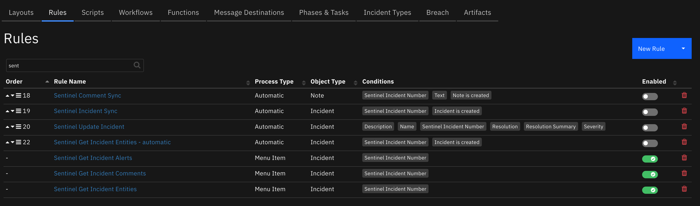
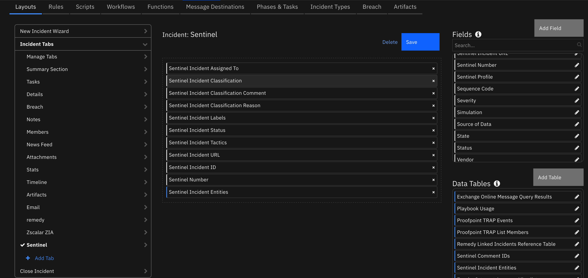

<!--
  This README.md is generated by running:
  "resilient-sdk docgen -p fn_microsoft_sentinel"

  It is best edited using a Text Editor with a Markdown Previewer. VS Code
  is a good example. Checkout https://guides.github.com/features/mastering-markdown/
  for tips on writing with Markdown

  If you make manual edits and run docgen again, a .bak file will be created

  Store any screenshots in the "doc/screenshots" directory and reference them like:
  

  NOTE: If your app is available in the container-format only, there is no need to mention the integration server in this readme.
-->

# Microsoft Sentinel

## Table of Contents
- [Release Notes](#release-notes)
- [Overview](#overview)
  - [Key Features](#key-features)
- [Requirements](#requirements)
  - [Resilient platform](#resilient-platform)
  - [Cloud Pak for Security](#cloud-pak-for-security)
  - [Proxy Server](#proxy-server)
  - [Python Environment](#python-environment)
- [Sentinel Configuration](#sentinel-configuration)
- [Installation](#installation)
  - [Install](#install)
  - [App Configuration](#app-configuration)
  - [Custom Layouts](#custom-layouts)
- [Function - Sentinel Get Incident Entities](#function---sentinel-get-incident-entities)
- [Function - Sentinel Add Incident Comment](#function---sentinel-add-incident-comment)
- [Function - Sentinel Get Incident Comments](#function---sentinel-get-incident-comments)
- [Function - Sentinel Update Incident](#function---sentinel-update-incident)
- [Data Table - Sentinel Comment IDs](#data-table---sentinel-comment-ids)
- [Data Table - Sentinel Incident Entities](#data-table---sentinel-incident-entities)
- [Custom Fields](#custom-fields)
- [Rules](#rules)
- [Custom Templates](#custom-templates)
- [Troubleshooting & Support](#troubleshooting--support)
---

## Release Notes
<!--
  Specify all changes in this release. Do not remove the release
  notes of a previous release
-->
| Version | Date | Notes |
| ------- | ---- | ----- |
| 1.0.1 | 11/2021 | minor bug fixes and datatable improvements |
| 1.0.0 | 08/2021 | Initial Release |

---

## Overview
<!--
  Provide a high-level description of the function itself and its remote software or application.
  The text below is parsed from the "description" and "long_description" attributes in the setup.py file
-->
**Resilient Circuits Components for 'fn_microsoft_sentinel'**

 

This app allows bi-directional synchronization between IBM SOAR and Microsoft Sentinel.
Sentinel entities are exposed as artifacts for further investigation.

### Key Features
<!--
  List the Key Features of the Integration
-->
* Escalate Microsoft Sentinel Incidents to IBM Resilient SOAR Cases
* Automatically keep Incidents and Cases synchronized
* Retrieve Sentinel Incident alert entities as artifacts
* Sync comments to and from Sentinel Incidents
* Support editable templates for field mapping between the two systems

---

## Requirements
<!--
  List any Requirements
-->
This app supports the IBM Resilient SOAR Platform and the IBM Cloud Pak for Security.

### Resilient platform
The Resilient platform supports two app deployment mechanisms, App Host and integration server.

If deploying to a Resilient platform with an App Host, the requirements are:
* Resilient platform >= `39.0`.
* The app is in a container-based format (available from the AppExchange as a `zip` file).

If deploying to a Resilient platform with an integration server, the requirements are:
* Resilient platform >= `39.0`.
* The app is in the older integration format (available from the AppExchange as a `zip` file which contains a `tar.gz` file).
* Integration server is running `resilient_circuits>=30.0.0`.
* If using an API key account, make sure the account provides the following minimum permissions:
  | Name | Permissions |
  | ---- | ----------- |
  | Org Data | Read |
  | Function | Read |
  | Incident | Read, Edit, Create, Owner, Status |
  | Incident Notes | Edit |

The following Resilient platform guides provide additional information:
* _App Host Deployment Guide_: provides installation, configuration, and troubleshooting information, including proxy server settings.
* _Integration Server Guide_: provides installation, configuration, and troubleshooting information, including proxy server settings.
* _System Administrator Guide_: provides the procedure to install, configure and deploy apps.

The above guides are available on the IBM Knowledge Center at [ibm.biz/resilient-docs](https://ibm.biz/resilient-docs). On this web page, select your Resilient platform version. On the follow-on page, you can find the _App Host Deployment Guide_ or _Integration Server Guide_ by expanding **Resilient Apps** in the Table of Contents pane. The System Administrator Guide is available by expanding **System Administrator**.

### Cloud Pak for Security
If you are deploying to IBM Cloud Pak for Security, the requirements are:
* IBM Cloud Pak for Security >= 1.5.
* Cloud Pak is configured with an App Host.
* The app is in a container-based format (available from the AppExchange as a `zip` file).

The following Cloud Pak guides provide additional information:
* _App Host Deployment Guide_: provides installation, configuration, and troubleshooting information, including proxy server settings. From the Table of Contents, select Case Management and Orchestration & Automation > **Orchestration and Automation Apps**.
* _System Administrator Guide_: provides information to install, configure, and deploy apps. From the IBM Cloud Pak for Security Knowledge Center table of contents, select Case Management and Orchestration & Automation > **System administrator**.

These guides are available on the IBM Knowledge Center at [ibm.biz/cp4s-docs](https://ibm.biz/cp4s-docs). From this web page, select your IBM Cloud Pak for Security version. From the version-specific Knowledge Center page, select Case Management and Orchestration & Automation.

### Proxy Server
The app **does** support a proxy server.

### Python Environment
Python 3.6 is supported.
Additional package dependencies may exist for each of these packages:
* jinja2
* resilient-lib
* resilient_circuits>=30.0.0
* simplejson

---

## Sentinel Configuration
Several steps are necessary to enable API access to Sentinel. Below is a brief list of steps to complete:

1. Define an App under `App registration`,  for Sentinel access. The Application (client) ID will be used as the app.config `client_id`.

    a. Specify a client secret. This will be used in the app.config file as `api_secret`.

 
 

2. Define a workspace and resource group for the subscription. These names will be defined in the app.config file as `workspace_name` and `resource_groupname`.


3. For your resource group, specify the app with the Sentinel Responder role.


4. Add your tenant_id (Under `Tenant properties`) and subscription_id to the app.config file.

---

## Installation

### Install
* To install or uninstall an App or Integration on the _Resilient platform_, see the documentation at [ibm.biz/resilient-docs](https://ibm.biz/resilient-docs).
* To install or uninstall an App on _IBM Cloud Pak for Security_, see the documentation at [ibm.biz/cp4s-docs](https://ibm.biz/cp4s-docs) and follow the instructions above to navigate to Orchestration and Automation.

### App Configuration
The following table provides the settings you need to configure the app. These settings are made in the app.config file. See the documentation discussed in the Requirements section for the procedure.

| Config | Required | Example | Description |
| ------ | :------: | ------- | ----------- |
| **azure_url** | Yes | `https://management.azure.com` | *URL for Azure access. This field is typically not changed* |
| **tenant_id** | Yes | `aaa-bbb-ccc` | *Your tenant_id* |
| **client_id** | Yes | `aaa-bbb-ddd` | *Your App Id or client_id* |
| **app_secret** | Yes | `aaa-bbb-eee` | *Your app secret* |
| **polling_lookback** | Yes | `120` | *# of minutes to look back for incident changes. This is used only the first time the app starts* |
| **polling_interval** | Yes | `60` | *# of Seconds to wait until checking for changes in Sentinel. Comment out to disable the poller* |
| **sentinel_profiles** | Yes | `profile_a` | *Comma separated list of profile(s) to access based on subscription id, resource group name and workspace * |
| **https_proxy**| No | `https:/your.proxy.com` | - |
| **http_proxy** | No | `http:/your.proxy.com` | - |

For each profile:
| Config | Required | Example | Description |
| ------ | :------: | ------- | ----------- |
| **subscription_id** | Yes | `aaa-bbb-fff` | *subscription_id for incident access * |
| **workspace_name** | Yes | `` | *workspace name for incident access.* |
| **resource_groupname** | Yes | `` | *resource group for incident access.* |
| **new_incident_filters** | Yes | `"status": ["New", "Active"],"severity": ["High", "Medium","Low"]` | *Set of filters to apply when escalating incidents to Resilient SOAR. Incidents not matching the criteria are not synchronized. In this example, both a match of status and severity would be required. * |
| **max_alerts** | 10 | *limit the number of alerts per sentinel incident to the first n alerts or leave blank for all alerts* |
| **create_incident_template** | /var/rescircuits/create_incident_template.jinja | Customer supplied template for mapping Sentinel Incident fields to an Resilient incident. If not specified, a default template is used. |
| **update_incident_template** | /var/rescircuits/update_incident_template.jinja | Customer supplied template for mapping Sentinel Incident fields to an Resilient incident. If not specified, a default template is used. |
| **close_incident_template** | /var/rescircuits/close_incident_template.jinja | Customer supplied template for mapping Sentinel Incident fields to an Resilient incident. If not specified, a default template is used. This is useful when a customer customizes the fields used when closing an incident. |
| **sentinel_update_incident_template** | /var/rescircuits/update_sentinel_incident_template.jinja | Customer supplied template for updating a sentinel incident when the Resilient SOAR incident is updated |
| **sentinel_close_incident_template** | /var/rescircuits/update_sentinel_incident_template.jinja | Customer supplied template for closing a sentinel incident when the Resilient SOAR incident is closed |

See the section below for examples of the templates.

### Automatic Rules
Several rules are configurated to automatically synchronize a SOAR incident with the Sentinel incident. Those automatic rules are:

| Rule Name | Object | Behavior |
| --------- | ------ | ------------------ |
| Sentinel Comment Sync | note | Synchronize SOAR notes with Sentinel incidents |
| Sentinel Incident Sync | incident | Get Sentinel incident alerts and entities when the SOAR incident is created |
| Sentinel Update Incident | incident | Synchronize SOAR incident changes (changes in status, severity, etc) with Sentinel |

These rules are disabled when the app is first installed. If you wish to use this app to automatically synchronize with Sentinel, enable each rule using the Enable slider found on the Rules tab in Customization Settings.


### Custom Layouts
<!--
  Use this section to provide guidance on where the user should add any custom fields and data tables.
  You may wish to recommend a new incident tab.
  You should save a screenshot "custom_layouts.png" in the doc/screenshots directory and reference it here
-->
* Import the Custom Fields and Data Tables like the screenshot below:

  

  The Sentinel fields are used to capture information specific on a Sentinel Incident, including close incident information (Classification). The datatable, Sentintel Entities, is used to capture specific entity information. Another datatable, Sentinel Comment IDs, is used for tracking purposes and need not be added to a layout.

---

 

## Function - Sentinel Get Incident Entities
Get the Entities associated with a Sentinel Incident

 

<details><summary>Inputs:</summary>
<p>

| Name | Type | Required | Example | Tooltip |
| ---- | :--: | :------: | ------- | ------- |
| `sentinel_incident_id` | `text` | Yes | `-` | This is information is captured in a custom incident field. |
| `sentinel_profile` | `text` | Yes | `-` | This is information is captured in a custom incident field. |

</p>
</details>

<details><summary>Outputs:</summary>
<p>

```python
results = {
  "value": [
      {
          "id": "/subscriptions/##SUBSCRIPTIONID##/resourceGroups/jn-sentineltest/providers/Microsoft.OperationalInsights/workspaces/cybtgmu6sxcvk/providers/Microsoft.SecurityInsights/Incidents/ad7cb03c-37c8-4f98-a34a-c76951b8683e/relations/ad7cb03c-37c8-4f98-a34a-c76951b8683e_fe3ca9f0-0765-b792-cd03-d3aa100571d8",
          "name": "ad7cb03c-37c8-4f98-a34a-c76951b8683e_fe3ca9f0-0765-b792-cd03-d3aa100571d8",
          "type": "Microsoft.SecurityInsights/Incidents/relations",
          "properties": {
              "relatedResourceId": "/subscriptions/a7be6876-1523-4cd2-b50c-75c5d041da61/resourceGroups/jn-sentineltest/providers/Microsoft.OperationalInsights/workspaces/cybtgmu6sxcvk/providers/Microsoft.SecurityInsights/entities/fe3ca9f0-0765-b792-cd03-d3aa100571d8",
              "relatedResourceName": "fe3ca9f0-0765-b792-cd03-d3aa100571d8",
              "relatedResourceType": "Microsoft.SecurityInsights/entities",
              "relatedResourceKind": "SecurityAlert"
          }
      },
      {
          "id": "/subscriptions/##SUBSCRIPTIONID##/resourceGroups/jn-sentineltest/providers/Microsoft.OperationalInsights/workspaces/cybtgmu6sxcvk/providers/Microsoft.SecurityInsights/Incidents/ad7cb03c-37c8-4f98-a34a-c76951b8683e/relations/ad7cb03c-37c8-4f98-a34a-c76951b8683e_fe3ca9f0-0765-b792-cd03-d3aa100571d8",
          "name": "ad7cb03c-37c8-4f98-a34a-c76951b8683e_fe3ca9f0-0765-b792-cd03-d3aa100571d9",
          "type": "Microsoft.SecurityInsights/Incidents/relations",
          "properties": {
              "relatedResourceId": "/subscriptions/a7be6876-1523-4cd2-b50c-75c5d041da61/resourceGroups/jn-sentineltest/providers/Microsoft.OperationalInsights/workspaces/cybtgmu6sxcvk/providers/Microsoft.SecurityInsights/entities/fe3ca9f0-0765-b792-cd03-d3aa100571d8",
              "relatedResourceName": "fe3ca9f0-0765-b792-cd03-d3aa100571d8",
              "relatedResourceType": "Microsoft.SecurityInsights/entities",
              "relatedResourceKind": "SecurityAlert"
          }
      }
  ]
}
```

</p>
</details>

<details><summary>Example Pre-Process Script:</summary>
<p>

```python
inputs.sentinel_incident_id = incident.properties.sentinel_incident_id
inputs.sentinel_profile = incident.properties.sentinel_profile
```

</p>
</details>

<details><summary>Example Post-Process Script:</summary>
<p>

```python
if results.success:
  for alert in results.content.keys():
      for entity in results.content[alert]:
        row = incident.addRow("sentinel_incident_entities")
        row['alert_id'] = alert
        row['entity_id'] = entity['name']
        row['entity_type'] = entity['kind']
        row['entity_value'] = entity['properties']['friendlyName']
        row['entity_properties'] = "<br>".join(["<b>{}</b>: {}".format(k, v) for k, v in entity['properties'].items()])

        # create an artifact
        desc = ["created from Sentinel entity: {}".format(entity['name'])]
        if entity['properties'].get('azureID'):
          desc.append(entity['properties']['azureID'])
        incident.addArtifact(entity['resilient_artifact_type'][0], entity['resilient_artifact_type'][1], "\n".join(desc))

```

</p>
</details>

---
## Function - Sentinel Add Incident Comment
Create a comment for a given Sentinel incident. This is used with an rule to automatically sync
Resilient Comments with Sentinel.

<details><summary>Inputs:</summary>
<p>

| Name | Type | Required | Example | Tooltip |
| ---- | :--: | :------: | ------- | ------- |
| `sentinel_incident_comment` | `text` | Yes | `-` | - |
| `sentinel_incident_id` | `text` | Yes | `-` | This is information is captured in a custom incident field. |
| `sentinel_profile` | `text` | Yes | `-` | This is information is captured in a custom incident field. |

</p>
</details>

<details><summary>Outputs:</summary>
<p>

```python
results = {
  'version': '1.0',
  'success': True,
  'reason': None,
  'content': {
    'id': '/subscriptions/567dddd6-80a5-42a7-b39a-b2ceba0533f4/resourceGroups/Resilient/providers/Microsoft.OperationalInsights/workspaces/Resiliient/providers/Microsoft.SecurityInsights/Incidents/4bb815ba-5b84-11eb-b782-8c8590577e7a/Comments/55b61c46-5c2c-11eb-8466-acde48001122',
    'name': '55b61c46-5c2c-11eb-8466-acde48001122',
    'etag': '"2400312b-0000-0100-0000-6009ec820000"',
    'type': 'Microsoft.SecurityInsights/Incidents/Comments',
    'properties': {
      'message': 'test note',
      'createdTimeUtc': '2021-01-21T21:05:06.0488305Z',
      'author': {
        'objectId': '20f58040-2a0f-4cfc-b18f-39f45f71434f',
        'email': None,
        'name': 'Comment created from external application - sentinelIncident',
        'userPrincipalName': None
      }
    }
  },
  'raw': '',
  'inputs': {
    'sentinel_incident_id': '4bb815ba-5b84-11eb-b782-8c8590577e7a',
    'sentinel_profile': 'profile_a',
    'sentinel_incident_comment': '<div class="rte"><div>test note</div></div>'
  },
  'metrics': {
    'version': '1.0',
    'package': 'fn-microsoft-sentinel',
    'package_version': '1.0.0',
    'host': 'Marks-MacBook-Pro.local',
    'execution_time_ms': 1000,
    'timestamp': '2021-01-21 16:05:06'
  }
}
```

</p>
</details>

<details><summary>Example Pre-Process Script:</summary>
<p>

```python
inputs.sentinel_incident_comment = note.text.content
inputs.sentinel_incident_id = incident.properties.sentinel_incident_id
inputs.sentinel_profile = incident.properties.sentinel_profile
```

</p>
</details>

<details><summary>Example Post-Process Script:</summary>
<p>

```python
if results.success:
  row = incident.addRow("sentinel_comment_ids")
  row['comment_id'] = results.content['name']
```

</p>
</details>

---
## Function - Sentinel Get Incident Comments
Get Comments from a Sentinel Incident. Comments are tracked to only sync new comments.

<details><summary>Inputs:</summary>
<p>

| Name | Type | Required | Example | Tooltip |
| ---- | :--: | :------: | ------- | ------- |
| `incident_id` | `number` | Yes | `-` |  This is information is captured from the Incident. |
| `sentinel_incident_id` | `text` | Yes | `-` |  This is information is captured in a custom incident field. |
| `sentinel_profile` | `text` | Yes | `-` |  This is information is captured in a custom incident field. |

</p>
</details>

<details><summary>Outputs:</summary>
<p>

```python
results = {
  'version': '1.0',
  'success': True,
  'reason': None,
  'content': {
    'value': [
      {
        'id': '/subscriptions/567dddd6-80a5-42a7-b39a-b2ceba0533f4/resourceGroups/Resilient/providers/Microsoft.OperationalInsights/workspaces/Resiliient/providers/Microsoft.SecurityInsights/Incidents/a8e79e8a-5b80-11eb-b397-8c8590577e7a/Comments/b0720338-5c26-11eb-8e31-acde48001122',
        'name': 'b0720338-5c26-11eb-8e31-acde48001122',
        'etag': '"24001709-0000-0100-0000-6009e3090000"',
        'type': 'Microsoft.SecurityInsights/Incidents/Comments',
        'properties': {
          'message': 'new comment  with  rich text. ',
          'createdTimeUtc': '2021-01-21T20:24:41.2237053Z',
          'author': {
            'objectId': '20f58040-2a0f-4cfc-b18f-39f45f71434f',
            'email': None,
            'name': 'Comment created from external application - sentinelIncident',
            'userPrincipalName': None
          }
        }
      },
      {
        'id': '/subscriptions/567dddd6-80a5-42a7-b39a-b2ceba0533f4/resourceGroups/Resilient/providers/Microsoft.OperationalInsights/workspaces/Resiliient/providers/Microsoft.SecurityInsights/Incidents/a8e79e8a-5b80-11eb-b397-8c8590577e7a/Comments/b070610c-5c26-11eb-862b-acde48001122',
        'name': 'b070610c-5c26-11eb-862b-acde48001122',
        'etag': '"24001509-0000-0100-0000-6009e3090000"',
        'type': 'Microsoft.SecurityInsights/Incidents/Comments',
        'properties': {
          'message': 'dddd',
          'createdTimeUtc': '2021-01-21T20:24:41.1717981Z',
          'author': {
            'objectId': '20f58040-2a0f-4cfc-b18f-39f45f71434f',
            'email': None,
            'name': 'Comment created from external application - sentinelIncident',
            'userPrincipalName': None
          }
        }
      }
    ]
  },
  'raw': '',
  'inputs': {
    'sentinel_incident_id': 'a8e79e8a-5b80-11eb-b397-8c8590577e7a',
    'incident_id': 4514,
    'sentinel_profile': 'profile_a'
  },
  'metrics': {
    'version': '1.0',
    'package': 'fn-microsoft-sentinel',
    'package_version': '1.0.0',
    'host': 'Marks-MacBook-Pro.local',
    'execution_time_ms': 766,
    'timestamp': '2021-01-21 15:25:22'
  }
}
```

</p>
</details>

<details><summary>Example Pre-Process Script:</summary>
<p>

```python
inputs.sentinel_incident_id = incident.properties.sentinel_incident_id
inputs.incident_id = incident.id
inputs.sentinel_profile = incident.properties.sentinel_profile
```

</p>
</details>

<details><summary>Example Post-Process Script:</summary>
<p>

```python
if results.success:
  for comment in results.content['value']:
    incident.addNote(helper.createRichText(comment['properties']['message']))

    # remember the comment in our datatable
    row = incident.addRow('sentinel_comment_ids')
    row['comment_id'] = comment['name']

```

</p>
</details>

---
## Function - Sentinel Update Incident
Update / Close a Sentinel incident based on Sentinel field changes in the Resilient Incident

<details><summary>Inputs:</summary>
<p>

| Name | Type | Required | Example | Tooltip |
| ---- | :--: | :------: | ------- | ------- |
| `incident_id` | `number` | Yes | `-` | - |
| `sentinel_incident_id` | `text` | No | `-` | - |
| `sentinel_profile` | `text` | Yes | `-` | - |

</p>
</details>

<details><summary>Outputs:</summary>
<p>

```python
results = {
    # TODO: Copy and paste an example of the Function Output within this code block.
    # To view the output of a Function, run resilient-circuits in DEBUG mode and invoke the Function.
    # The Function results will be printed in the logs: "resilient-circuits run --loglevel=DEBUG"
}
```

</p>
</details>

<details><summary>Example Pre-Process Script:</summary>
<p>

```python
inputs.sentinel_incident_id = incident.properties.sentinel_incident_id
inputs.sentinel_profile = incident.properties.sentinel_profile
```

</p>
</details>

<details><summary>Example Post-Process Script:</summary>
<p>

```python
None
```

</p>
</details>

---
## Data Table - Sentinel Incident Entities

 

This table is used to capture information about an entity in addition to entity information created as artifacts.

#### API Name:
sentinel_incident_entities

#### Columns:
| Column Name | API Access Name | Type | Tooltip |
| ----------- | --------------- | ---- | ------- |
| Alert ID | `alert_id` | `text` | - |
| Entity ID | `entity_id` | `text` | - |
| Entity Properties | `entity_properties` | `textarea` | - |
| Entity Type | `entity_type` | `text` | - |
| Entity Value | `entity_value` | `text` | - |

---

## Custom Fields
| Label | API Access Name | Type | Prefix | Placeholder | Tooltip |
| ----- | --------------- | ---- | ------ | ----------- | ------- |
| Sentinel Incident Classification Comment | `sentinel_incident_classification_comment` | `text` | `properties` | - | Close code information |
| Sentinel Incident Labels | `sentinel_incident_labels` | `text` | `properties` | - | Incident labels applied |
| Sentinel Incident Assigned To | `sentinel_incident_assigned_to` | `text` | `properties` | - | Sentinel Incident assignment |
| Sentinel Incident Classification Reason | `sentinel_incident_classification_reason` | `text` | `properties` | - | Close code information |
| Sentinel Incident Tactics | `sentinel_incident_tactics` | `text` | `properties` | - | Mitre Att@ck tactics |
| Sentinel Incident ID | `sentinel_incident_id` | `text` | `properties` | - | Reference Sentinel Incident ID |
| Sentinel Incident Number | `sentinel_incident_number` | `number` | `properties` | - | Reference Sentinel Incident Number |
| Sentinel Profile | `sentinel_profile` | `text` | `properties` | - | Sentinel profile used for synchronization actions |
| Sentinel Incident Status | `sentinel_incident_status` | `text` | `properties` | - | - |
| Sentinel Incident Classification | `sentinel_incident_classification` | `text` | `properties` | - | Close code information. |
| Sentinel Incident URL | `sentinel_incident_url` | `textarea` | `properties` | - | Clickable link back to Sentinel and the specific incident. |

---

## Rules
| Rule Name | Object | Workflow Triggered |
| --------- | ------ | ------------------ |
| Sentinel Update Incident | incident | `-` |
| Sentinel Comment Sync | note | `sentinel_comment_sync` |
| Sentinel Get Incident Comments | incident | `sentinel_get_incident_comments` |
| Sentinel Incident Entity Sync | incident | `sentinel_get_incident_entities` |
| Sentinel Get Incident Entities | incident | `sentinel_get_incident_entities` |

---

## Custom Templates
Below are examples of templates for creating, updating, and closing Resilient incidents. Customize these templates and refer to them in our app.config file.

Each template should be reviewed for correctness in your enterprise.
For instance, closing a SOAR incident may include additional custom fields which the default template
does not include. Or, remove the `owner_id` mapping entry entirely.

In addition, the `incident_creation_template` and `incident_update_template` includes the following
mapping:

```
  {# if Sentinel users are different than SOAR users, consider using a mapping table using resilient_substitute: #}
  {# {{ properties.owner.assignedTo|resilient_substitute('{"sentinel_user1@co.com": "soar_user1@ent.com", "sentinel_user2@co.com": "soar_user2@ent.com"}') }} #}
  "owner_id": "{{ properties.owner.assignedTo }}",
```

If your Sentinel login users differ from SOAR users, modify the `owner_id` mapping to use a substitution map as indicated in the jinja comment.

### incident_create_template.jinja
```
{
  {# JINJA template for creating a new Resilient incident from a Sentinel incident. #}
  "name": "Sentinel Incident {{ properties.incidentNumber|e }} - {{ properties.title|replace('"', '\\"') }}",
  "discovered_date": {{ properties.createdTimeUtc|resilient_datetimeformat }},
  "start_date":  {{ properties.firstActivityTimeUtc|resilient_datetimeformat }}  {{ properties.createdTimeUtc|resilient_datetimeformat }} ,
  "description": {
    "format": "text",
    "content": "{{ properties.description|replace('"', '\\"') }}"
  },
  {# if Sentinel users are different than SOAR users, consider using a mapping table using resilient_substitute: #}
  {# "owner_id": "{{ properties.owner.userPrincipalName|resilient_substitute('{"sentinel_user1@co.com": "soar_user1@ent.com", "sentinel_user2@co.com": "soar_user2@ent.com", "DEFAULT": "default_user@ent.com" }') }}", #}
  "plan_status": "{{ properties.status|resilient_substitute('{"Closed": "C", "Active": "A", "New": "A"}') }}",
  "severity_code": "{{ properties.severity|resilient_substitute('{"Informational": "Low"}') }}",
  "properties": {
    "sentinel_incident_number": "{{ name|e }}",
    "sentinel_incident_id": "{{ properties.incidentNumber }}",
    "sentinel_incident_status": "{{ properties.status }}",
    "sentinel_incident_url": "<a target='blank' href='{{ properties.incidentUrl }}'>Sentinel Incident</a>",
    "sentinel_incident_classification": "{{ properties.classification }}",
    "sentinel_incident_classification_reason": "{{ properties.classificationReason }}",
    "sentinel_incident_classification_comment": "{{ properties.classificationComment|replace('"', '\"') }}",
    "sentinel_incident_assigned_to": "{{ properties.owner.assignedTo }}",
    "sentinel_incident_labels": "{{ properties.labels|join(' ') }}",
    "sentinel_incident_tactics": "{{ properties.additionalData.tactics|join(' ') }}",
    "sentinel_profile": "{{ resilient_profile }}"
  }
  
  ,
  "resolution_id": "Resolved",
  "resolution_summary": "Closed by Sentinel"
  
}
```

### incident_update_template.jinja
```
{
  {# JINJA template for updating a new Resilient incident from a Sentinel incident. #}
  "description": {
    "format": "text",
    "content": "{{ properties.description|replace('"', '\\"') }}"
  },
  {# if Sentinel users are different than SOAR users, consider using a mapping table using resilient_substitute: #}
  {# "owner_id": "{{ properties.owner.userPrincipalName|resilient_substitute('{"sentinel_user1@co.com": "soar_user1@ent.com", "sentinel_user2@co.com": "soar_user2@ent.com", "DEFAULT": "default_user@ent.com" }') }}", #}
  "plan_status": "{{ properties.status|resilient_substitute('{"Closed": "C", "Active": "A", "New": "A"}') }}",
  "severity_code": "{{ properties.severity|resilient_substitute('{"Informational": "Low"}') }}",
  "properties": {
    "sentinel_incident_status": "{{ properties.status }}",
    "sentinel_incident_classification": "{{ properties.classification }}",
    "sentinel_incident_classification_reason": "{{ properties.classificationReason }}",
    "sentinel_incident_classification_comment": "{{ properties.classificationComment|replace('"', '\"') }}",
    "sentinel_incident_assigned_to": "{{ properties.owner.assignedTo }}",
    "sentinel_incident_labels": "{{ properties.labels|join(' ') }}",
    "sentinel_incident_tactics": "{{ properties.additionalData.tactics|join(' ') }}"
  }
}
```

### incident_close_template.jinja
```
{
  {# JINJA template for closing a new Resilient incident from a Sentinel incident. #}
  "plan_status": "C",
  "resolution_id": "Resolved",
  "resolution_summary": "Closed by Sentinel",
  "properties": {
    "sentinel_incident_status": "{{ properties.status }}",
    "sentinel_incident_classification": "{{ properties.classification }}",
    "sentinel_incident_classification_reason": "{{ properties.classificationReason }}",
    "sentinel_incident_classification_comment": "{{ properties.classificationComment|safe }}",
    "sentinel_incident_assigned_to": "{{ properties.owner.assignedTo }}",
    "sentinel_incident_labels": "{{ properties.labels|join(' ') }}",
    "sentinel_incident_tactics": "{{ properties.additionalData.tactics|join(' ') }}"
  }
}
```

### sentinel_close_incident_template.jinja
```
{
    {# JINJA template for closing a new Sentinel incident from a Resilient incident. #}
    "properties": {
        "title": "{{ name|resilient_splitpart(1)}}",
        "severity": "{{ severity_code|string|resilient_substitute('{"4": "Low", "5": "Medium", "6": "High"}') }}",
        "status": "Closed",
        "classification": "{{ resolution_id|string|resilient_substitute('{"7": "Undetermined", "8": "Undetermined", "9": "FalsePositive", "10": "TruePositive", "DEFAULT": "Undetermined"}') }}",
        "classificationComment": "{{ resolution_summary|striptags|safe }}",
        {# modify as necessary #}
        "classificationReason": "{{ resolution_id|string|resilient_substitute('{"7": "", "8": "", "9": "InaccurateData", "10": "SuspiciousActivity", "DEFAULT": ""}') }}"
    }
}
```

### sentinel_update_incident_template.jinja
```
{
    {# JINJA template for updating a new Sentinel incident from a Resilient incident. #}
    "properties": {
        "title": "{{ name|resilient_splitpart(1)}}",
        "severity": "{{ severity_code|string|resilient_substitute('{"4": "Low", "5": "Medium", "6": "High"}') }}",
        "status": "{{ properties.sentinel_incident_status }}",
        "classification": "{{ properties.sentinel_incident_classification }}",
        "classificationComment": "{{ properties.sentinel_incident_classification_comment|safe }}",
        "classificationReason": "{{ properties.sentinel_incident_classification_reason }}",
        "description": "{{ description|striptags|safe }}",
        "labels": "{{ properties.sentinel_incident_labels }}"
    }
}
```
---

## Troubleshooting & Support
Refer to the documentation listed in the Requirements section for troubleshooting information.

### For Support
This is a IBM Community provided App. Please search the Community https://ibm.biz/resilientcommunity for assistance.
