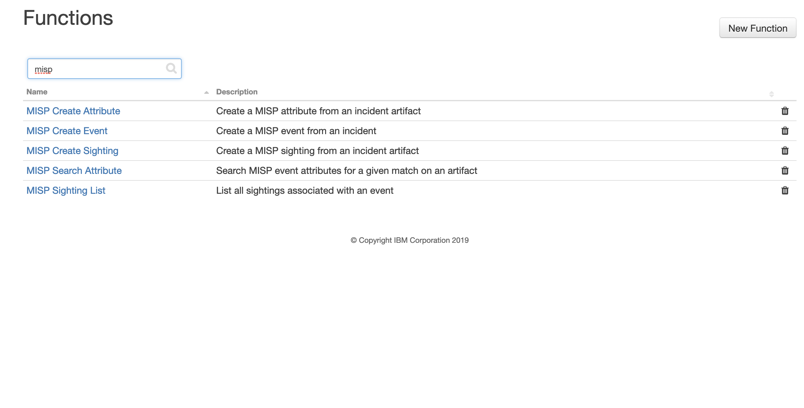
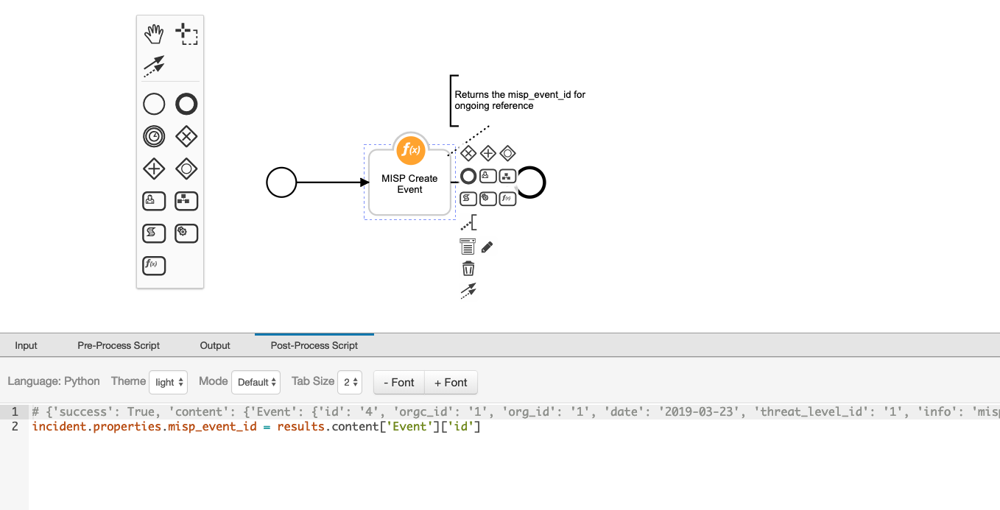

# MISP Functions
_Craig @ Resilient Labs_

The MISP functions allows integration with MISP Threat Intelligence Platform from Resilient.

The following 5 use cases are supported; 

+ Create a MISP "Event" from a Resilient incident
+ Add attributes to the incident "Event" in MISP from incident artifacts incident
+ Mark any artifact in Resilient as "Sighted" if they exist in MISP
+ Search all MISP events for a match on a given attribute
+ Return all MISP sightings for a given event



## Installation 

Install the function package by first unpacking the .zip file exposing the .tar.gz file.

```
pip install fn_misp-<version>.tar.gz
```

You will then need to add the configuration section to your `app.config` file.

```
resilient-circuits config -u [-l fn-misp]
```

This will add the MISP key and url properties. Update the URL for your instance of MISP and add the API key found in "Event Actions -> Automation" 

```
[fn_misp]
misp_url=http://localhost
misp_key=<your key>
# used to bypass cerification validation for self signed instances of MISP
verify_cert=true
```

To add all the configuration settings for functions, workflows, runs, etc. to Resilient,  run the following command:

```
resilient-circuits customize [-l fn-misp]
```

## Configuration

Sample rules and workflows are included to demonstrate how to execute a function and how to parse the returned results. 
For each workflow, edit each function (see the pencil icon) and visit the Post-Process Script for processing hints. Your use of the functions may include datatable creating and different data formatting. 



An incident field `misp_event_id` is used to track event creation. This field can remain hidden or added to your layout through the `Customization Settings` section.


