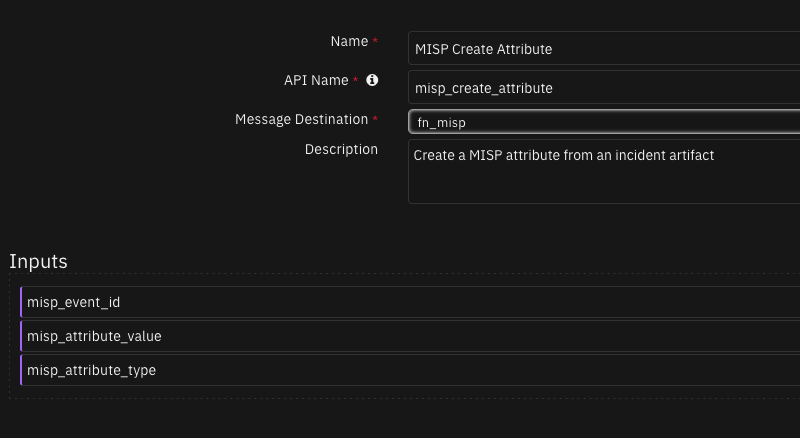
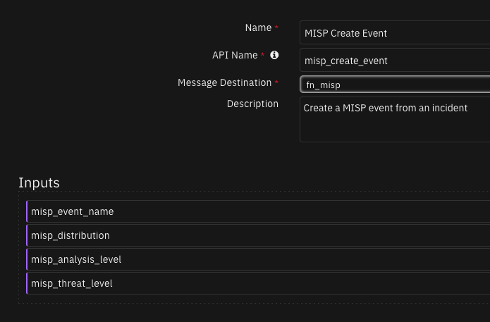
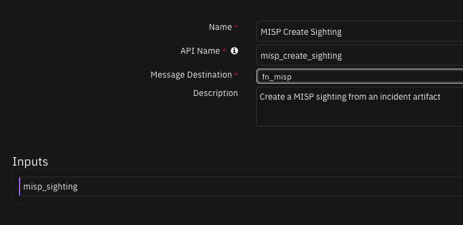
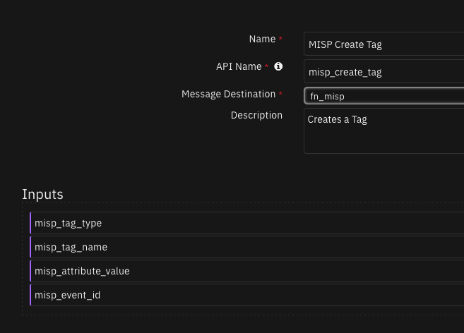
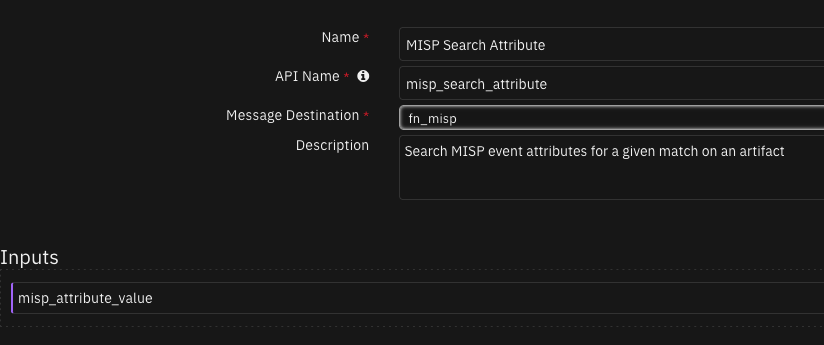
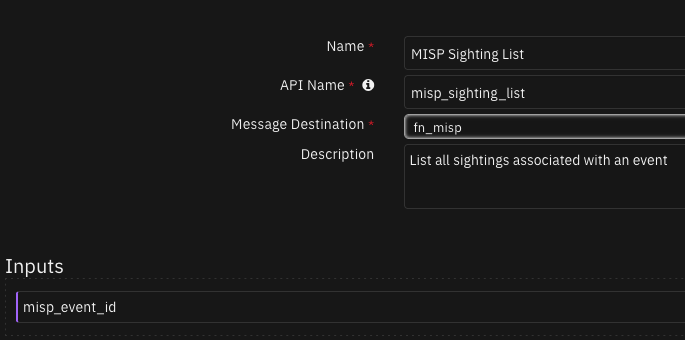

# fn_misp

## Table of Contents
- [Release Notes](#release-notes)
- [Overview](#overview)
  - [Key Features](#key-features)
- [Requirements](#requirements)
  - [SOAR platform](#soar-platform)
  - [Cloud Pak for Security](#cloud-pak-for-security)
  - [Proxy Server](#proxy-server)
  - [Python Environment](#python-environment)
- [Installation](#installation)
  - [Install](#install)
  - [App Configuration](#app-configuration)
- [Function - MISP Create Attribute](#function---misp-create-attribute)
- [Function - MISP Create Event](#function---misp-create-event)
- [Function - MISP Create Sighting](#function---misp-create-sighting)
- [Function - MISP Create Tag](#function---misp-create-tag)
- [Function - MISP Search Attribute](#function---misp-search-attribute)
- [Function - MISP Sighting List](#function---misp-sighting-list)
- [Custom Fields](#custom-fields)
- [Playbooks](#playbooks)
- [Troubleshooting & Support](#troubleshooting--support)

---

## Release Notes
<!--
  Specify all changes in this release. Do not remove the release 
  notes of a previous release
-->
| Version | Date | Notes |
| ------- | ---- | ----- |
| 3.0.2 | 12/2023 | Bug fix for selftest. Update code to use latest format. Remove rules/workflows and add playbooks. |
| 3.0.1 | MM/YYYY | App Host support. Proxy Support |
| 3.0.0 | MM/YYYY | There have been significant changes to the app for version 3, the community built a python3 compatible version of the app. This meant there was 2 different version in circulation. This version of the app is designed to reunify the fn-misp apps. To support both python2 and python3 automatically - using the latest recommended libraries from the MISP community. Finally, the Lookup Att&ck function has been removed, as MISP now stores Att&ck information as Tags - this is returned via the search attribute function, so no special function is required. The old separate apps are packaged inside the app directory, marked as ARCHIVE. They are unsupported and just for code documentation purposes. |
| 1.6.1 | MM/YYYY | Fixed Issue with verify certs. Added support for tags in search attribute. Workflow update to show use of parsing tags, e.g. TLP etc. Packaged as zip for easy install (no unzip required). |
| 1.5.1 | MM/YYYY | Full documentation for Att&ck Support |
| 1.5.0 | MM/YYYY | Added MITRE Att&ck support |
| 1.0.0 | MM/YYYY | Initial Release |

### 3.0.2
In v3.0.2, the existing rules and workflows have been replaced with playbooks. This change is made to support the ongoing, newer capabilities of playbooks. Each playbook has the same functionality as the previous, corresponding rule/workflow.

If upgrading from a previous release, you'll notice that the previous release's rules/workflows remain in place. Both sets of rules and playbooks are active. For manual actions, playbooks have the same name as it's corresponding rule, but with "(PB)" added at the end.

You can continue to use the rules/workflows. But migrating to playbooks provides greater functionality along with future app enhancements and bug fixes.

---

## Overview

**Creates Events, Attributes and Sightings in MISP from incidents and artifacts in SOAR.**

The purpose of this package is to allow the creation of an event in MISP from an incident in SOAR. This could represent a multiple-to-one or a one-to-one relationship. Once the event is created, attributes can be populated to it. For artifacts which have a hit in MISP, one can create a sighting back to MISP to show threat intelligence teams the indicator has been seen in the wild. Additional search functions allow one to search all attributes and return sightings from an event. This package does not replace or supersede the MISP Custom Threat Service, the aim is to supplement it and create a bi-directional connection and integration. The package is built in a flexible way so it can be used with any real rule or workflow configuration. Sample rules and workflows are provided. Custom attribute types can be mapped from the workflow pre-processing script of the function. See the sample workflows for sample payloads returned.

### Key Features

* Create Events in MISP from SOAR Incidents
* Add or list MISP sightings from SOAR
* Create tags and attributes from SOAR Artifacts

---

## Requirements
This app supports the IBM Security QRadar SOAR Platform and the IBM Security QRadar SOAR for IBM Cloud Pak for Security.

### SOAR platform
The SOAR platform supports two app deployment mechanisms, Edge Gateway (also known as App Host) and integration server.

If deploying to a SOAR platform with an App Host, the requirements are:
* SOAR platform >= `49.0.0`.
* The app is in a container-based format (available from the AppExchange as a `zip` file).

If deploying to a SOAR platform with an integration server, the requirements are:
* SOAR platform >= `49.0.0`.
* The app is in the older integration format (available from the AppExchange as a `zip` file which contains a `tar.gz` file).
* Integration server is running `resilient_circuits>=49.0`.
* If using an API key account, make sure the account provides the following minimum permissions:
  | Name | Permissions |
  | ---- | ----------- |
  | Org Data | Read, Edit |
  | Function | Read |

The following SOAR platform guides provide additional information:
* _Edge Gateway Deployment Guide_ or _App Host Deployment Guide_: provides installation, configuration, and troubleshooting information, including proxy server settings. 
* _Integration Server Guide_: provides installation, configuration, and troubleshooting information, including proxy server settings.
* _System Administrator Guide_: provides the procedure to install, configure and deploy apps.

The above guides are available on the IBM Documentation website at [ibm.biz/soar-docs](https://ibm.biz/soar-docs). On this web page, select your SOAR platform version. On the follow-on page, you can find the _Edge Gateway Deployment Guide_, _App Host Deployment Guide_, or _Integration Server Guide_ by expanding **Apps** in the Table of Contents pane. The System Administrator Guide is available by expanding **System Administrator**.

### Cloud Pak for Security
If you are deploying to IBM Cloud Pak for Security, the requirements are:
* IBM Cloud Pak for Security >= `1.10.15`.
* Cloud Pak is configured with an Edge Gateway.
* The app is in a container-based format (available from the AppExchange as a `zip` file).

The following Cloud Pak guides provide additional information:
* _Edge Gateway Deployment Guide_ or _App Host Deployment Guide_: provides installation, configuration, and troubleshooting information, including proxy server settings. From the Table of Contents, select Case Management and Orchestration & Automation > **Orchestration and Automation Apps**.
* _System Administrator Guide_: provides information to install, configure, and deploy apps. From the IBM Cloud Pak for Security IBM Documentation table of contents, select Case Management and Orchestration & Automation > **System administrator**.

These guides are available on the IBM Documentation website at [ibm.biz/cp4s-docs](https://ibm.biz/cp4s-docs). From this web page, select your IBM Cloud Pak for Security version. From the version-specific IBM Documentation page, select Case Management and Orchestration & Automation.

### Proxy Server
The app does support a proxy server.

### Python Environment
Python 3.6 and Python 3.9 are supported.
Additional package dependencies may exist for each of these packages:
* pymisp==2.4.119.1; python_version<"3"
* pymisp>=2.4; python_version>="3"
* resilient_circuits>=49.0

---

## Installation

### Install
* To install or uninstall an App or Integration on the _SOAR platform_, see the documentation at [ibm.biz/soar-docs](https://ibm.biz/soar-docs).
* To install or uninstall an App on _IBM Cloud Pak for Security_, see the documentation at [ibm.biz/cp4s-docs](https://ibm.biz/cp4s-docs) and follow the instructions above to navigate to Orchestration and Automation.

### App Configuration
The following table provides the settings you need to configure the app. These settings are made in the app.config file. See the documentation discussed in the Requirements section for the procedure.

| Config | Required | Example | Description |
| ------ | :------: | ------- | ----------- |
| **misp_url** | Yes | `10.10.10.10:5000` | *IP or URL of the MISP instance along with the http port* |
| **misp_key** | Yes | `someAPIkey` | *API key to access the MISP API* |
| **verify_cert** | No | `True` | *Secure connection. True or False* |
| **https_proxy** | No | `https://your.proxy.com` | *https proxy for connecting to MISP* |
| **http_proxy** | No | `http://your.proxy.com` | *http proxy for connecting to MISP* |

---

## Function - MISP Create Attribute
Create a MISP attribute from an incident artifact

 

<details><summary>Inputs:</summary>
<p>

| Name | Type | Required | Example | Tooltip |
| ---- | :--: | :------: | ------- | ------- |
| `misp_attribute_type` | `text` | No | `-` | - |
| `misp_attribute_value` | `text` | No | `-` | - |
| `misp_event_id` | `number` | No | `-` | - |

</p>
</details>

<details><summary>Outputs:</summary>
<p>

> **NOTE:** This example might be in JSON format, but `results` is a Python Dictionary on the SOAR platform.

```python
results = {
  "content": {
    "Attribute": {
      "category": "Network activity",
      "comment": "",
      "deleted": false,
      "disable_correlation": false,
      "distribution": "5",
      "event_id": "11",
      "first_seen": null,
      "id": "3",
      "last_seen": null,
      "object_id": "0",
      "object_relation": null,
      "sharing_group_id": "0",
      "timestamp": "1701876675",
      "to_ids": true,
      "type": "hostname",
      "uuid": "faf1d0b6-aaaa-aaaa-aaaa-a7c8cfb0b6ba",
      "value": "google.com",
      "value1": "google.com",
      "value2": ""
    },
    "AttributeTag": []
  },
  "inputs": {
    "misp_attribute_type": "hostname",
    "misp_attribute_value": "google.com",
    "misp_event_id": 11
  },
  "metrics": {
    "execution_time_ms": 568,
    "host": "local",
    "package": "fn-misp",
    "package_version": "3.0.2",
    "timestamp": "2023-12-06 10:31:15",
    "version": "1.0"
  },
  "raw": null,
  "reason": null,
  "success": true,
  "version": 2.0
}
```

</p>
</details>

<details><summary>Example Function Input Script:</summary>
<p>

```python
inputs.misp_attribute_value = artifact.value
inputs.misp_event_id = incident.properties.misp_event_id

resilient_to_misp_map = {
  "DNS Name": "domain",
  "Email Attachment": "email-attachment",
  "Email Body": "email-body",
  "Email Recipient": "email-dst",
  "Email Sender": "email-src",
  "Email subject": "email-subject",
  "File Name": "filename",
  "DNS Name": "hostname",
  "MAC Address": "mac-address",
  "Malware MD5 Hash": "md5",
  "Port": "port",
  "Malware SHA-1 Hash": "sha1",
  "Malware SHA-256 Hash": "sha256",
  "URI Path": "uri",
  "URL": "url",
  "Threat CVE ID": "vulnerability",
  "IP Address": "ip-dst"
}

try:
  misp_type = resilient_to_misp_map.get(artifact.type)
  inputs.misp_attribute_type = misp_type
except Exception as e:
  helper.fail("You do not have this artifact type {} mapped to a type in MISP - Ask your Admin".format(artifact.value))
  raise e
```

</p>
</details>

<details><summary>Example Function Post Process Script:</summary>
<p>

```python
results = playbook.functions.results.misp_attribute
if results.get("content", {}).get('errors'):
  incident.addNote(f"MISP failed to create attribute {artifact.value}.\nError: {results.get('content', {}).get('errors', {}).get('value')}")
else:
  incident.addNote(f"MISP created attribute {artifact.value} with category {results.get('content', {}).get('Attribute', {}).get('category')}")
```

</p>
</details>

---
## Function - MISP Create Event
Create a MISP event from an incident

 

<details><summary>Inputs:</summary>
<p>

| Name | Type | Required | Example | Tooltip |
| ---- | :--: | :------: | ------- | ------- |
| `misp_analysis_level` | `number` | No | `-` | initial =0, ongoing=1, complete=2 |
| `misp_distribution` | `number` | No | `-` | Organization only=0 |
| `misp_event_name` | `text` | Yes | `-` | - |
| `misp_threat_level` | `number` | No | `-` | high=1, medium=2, low=3 |

</p>
</details>

<details><summary>Outputs:</summary>
<p>

> **NOTE:** This example might be in JSON format, but `results` is a Python Dictionary on the SOAR platform.

```python
results = {
  "content": {
    "Event": {
      "Attribute": [],
      "CryptographicKey": [],
      "EventReport": [],
      "Galaxy": [],
      "Object": [],
      "Org": {
        "id": "1",
        "local": true,
        "name": "ORGNAME",
        "uuid": "40e5d872-aaaa-aaaa-aaaa-9d234710c5e5"
      },
      "Orgc": {
        "id": "1",
        "local": true,
        "name": "ORGNAME",
        "uuid": "40e5d872-aaaa-aaaa-aaaa-9d234710c5e5"
      },
      "RelatedEvent": [],
      "ShadowAttribute": [],
      "analysis": "2",
      "attribute_count": "0",
      "date": "2023-12-06",
      "disable_correlation": false,
      "distribution": "0",
      "event_creator_email": "admin@admin.test",
      "extends_uuid": "",
      "id": "11",
      "info": "tester",
      "locked": false,
      "org_id": "1",
      "orgc_id": "1",
      "proposal_email_lock": false,
      "protected": null,
      "publish_timestamp": "0",
      "published": false,
      "sharing_group_id": "0",
      "threat_level_id": "1",
      "timestamp": "1701876293",
      "uuid": "f6b6cba4-aaaa-aaaa-aaaa-3b40ace9067c"
    }
  },
  "inputs": {
    "misp_analysis_level": 2,
    "misp_distribution": 0,
    "misp_event_name": "tester",
    "misp_threat_level": 1
  },
  "metrics": {
    "execution_time_ms": 500,
    "host": "local",
    "package": "fn-misp",
    "package_version": "3.0.2",
    "timestamp": "2023-12-06 10:24:53",
    "version": "1.0"
  },
  "raw": null,
  "reason": null,
  "success": true,
  "version": 2.0
}
```

</p>
</details>

<details><summary>Example Function Input Script:</summary>
<p>

```python
inputs.misp_analysis_level = 2
inputs.misp_distribution = 0
inputs.misp_threat_level = 1
inputs.misp_event_name = incident.name
```

</p>
</details>

<details><summary>Example Function Post Process Script:</summary>
<p>

```python
results = playbook.functions.results.misp_event
if results.get("success"):
  event_id = results.get("content", {}).get("Event", {}).get("id")
  incident.properties.misp_event_id = event_id
  incident.addNote(f"Event created on MISP with ID: {event_id}")
```

</p>
</details>

---
## Function - MISP Create Sighting
Create a MISP sighting from an incident artifact

 

<details><summary>Inputs:</summary>
<p>

| Name | Type | Required | Example | Tooltip |
| ---- | :--: | :------: | ------- | ------- |
| `misp_sighting` | `text` | No | `-` | - |

</p>
</details>

<details><summary>Outputs:</summary>
<p>

> **NOTE:** This example might be in JSON format, but `results` is a Python Dictionary on the SOAR platform.

```python
results = {
  "content": {
    "Sighting": {
      "attribute_id": "3",
      "date_sighting": "1701877013",
      "event_id": "11",
      "id": "3",
      "org_id": "1",
      "source": "IBM QRadar SOAR",
      "type": "0",
      "uuid": "fbca0cd6-aaaa-aaaa-aaaa-1e7af7f99e15"
    }
  },
  "inputs": {
    "misp_sighting": "google.com"
  },
  "metrics": {
    "execution_time_ms": 479,
    "host": "local",
    "package": "fn-misp",
    "package_version": "3.0.2",
    "timestamp": "2023-12-06 10:36:53",
    "version": "1.0"
  },
  "raw": null,
  "reason": null,
  "success": true,
  "version": 2.0
}
```

</p>
</details>

<details><summary>Example Function Input Script:</summary>
<p>

```python
inputs.misp_sighting = artifact.value
```

</p>
</details>

<details><summary>Example Function Post Process Script:</summary>
<p>

```python
results = playbook.functions.results.misp_sighting
existing_description = artifact.description.content+'\n' if artifact.description else ""

if results.get("success"):
  incident.addNote(f"MISP Sighting {artifact.value} created with ID {results.get('content', {}).get('Sighting', {}).get('id')}")
```

</p>
</details>

---
## Function - MISP Create Tag
Creates a Tag

 

<details><summary>Inputs:</summary>
<p>

| Name | Type | Required | Example | Tooltip |
| ---- | :--: | :------: | ------- | ------- |
| `misp_attribute_value` | `text` | No | `-` | - |
| `misp_event_id` | `number` | No | `-` | - |
| `misp_tag_name` | `text` | No | `-` | - |
| `misp_tag_type` | `select` | No | `-` | - |

</p>
</details>

<details><summary>Outputs:</summary>
<p>

> **NOTE:** This example might be in JSON format, but `results` is a Python Dictionary on the SOAR platform.

```python
results = {
  "version": 2.0,
  "success": true,
  "reason": null,
  "content": {
    "success": true
  },
  "raw": null,
  "inputs": {
    "misp_attribute_value": "",
    "misp_tag_type": "Event",
    "misp_tag_name": "tlp:white",
    "misp_event_id": 12
  },
  "metrics": {
    "version": "1.0",
    "package": "fn-misp",
    "package_version": "3.0.2",
    "host": "local",
    "execution_time_ms": 558,
    "timestamp": "2023-12-07 10:32:08"
  }
}
```

</p>
</details>

<details><summary>Example Function Input Script:</summary>
<p>

```python
inputs.misp_tag_type = "Event"
inputs.misp_tag_name = "tlp:white"
inputs.misp_event_id = incident.properties.misp_event_id
```

</p>
</details>

<details><summary>Example Function Post Process Script:</summary>
<p>

```python
results = playbook.functions.results.tags
if results.get("success"):
  incident.addNote(f"Tags {results.get('inputs', {}).get('misp_tag_name')} added to the MISP Event.")
```

</p>
</details>

---
## Function - MISP Search Attribute
Search MISP event attributes for a given match on an artifact

 

<details><summary>Inputs:</summary>
<p>

| Name | Type | Required | Example | Tooltip |
| ---- | :--: | :------: | ------- | ------- |
| `misp_attribute_value` | `text` | No | `-` | - |

</p>
</details>

<details><summary>Outputs:</summary>
<p>

> **NOTE:** This example might be in JSON format, but `results` is a Python Dictionary on the SOAR platform.

```python
results = {
  "content": [
    {
      "Event": {
        "Attribute": [
          {
            "Galaxy": [],
            "ShadowAttribute": [],
            "category": "Network activity",
            "comment": "",
            "deleted": false,
            "disable_correlation": false,
            "distribution": "5",
            "event_id": "11",
            "first_seen": null,
            "id": "2",
            "last_seen": null,
            "object_id": "0",
            "object_relation": null,
            "sharing_group_id": "0",
            "timestamp": "1701876329",
            "to_ids": true,
            "type": "ip-dst",
            "uuid": "c8769d55-aaaa-aaaa-aaaa-197ea851916f",
            "value": "1.2.3.4"
          },
          {
            "Galaxy": [],
            "ShadowAttribute": [],
            "Sighting": [
              {
                "Organisation": {
                  "id": "1",
                  "name": "ORGNAME",
                  "uuid": "40e5d872-aaaa-aaaa-aaaa-9d234710c5e5"
                },
                "attribute_id": "3",
                "attribute_uuid": "faf1d0b6-aaaa-aaaa-aaaa-a7c8cfb0b6ba",
                "date_sighting": "1701876712",
                "event_id": "11",
                "id": "2",
                "org_id": "1",
                "source": "IBM QRadar SOAR",
                "type": "0",
                "uuid": "52e6b38b-aaaa-aaaa-aaaa-fb9442f5411f"
              },
              {
                "Organisation": {
                  "id": "1",
                  "name": "ORGNAME",
                  "uuid": "40e5d872-aaaa-aaaa-aaaa-9d234710c5e5"
                },
                "attribute_id": "3",
                "attribute_uuid": "faf1d0b6-aaaa-aaaa-aaaa-a7c8cfb0b6ba",
                "date_sighting": "1701877013",
                "event_id": "11",
                "id": "3",
                "org_id": "1",
                "source": "IBM QRadar SOAR",
                "type": "0",
                "uuid": "fbca0cd6-3a47-40ed-9775-1e7af7f99e15"
              }
            ],
            "category": "Network activity",
            "comment": "",
            "deleted": false,
            "disable_correlation": false,
            "distribution": "5",
            "event_id": "11",
            "first_seen": null,
            "id": "3",
            "last_seen": null,
            "object_id": "0",
            "object_relation": null,
            "sharing_group_id": "0",
            "timestamp": "1701876675",
            "to_ids": true,
            "type": "hostname",
            "uuid": "faf1d0b6-aaaa-aaaa-aaaa-a7c8cfb0b6ba",
            "value": "google.com"
          }
        ],
        "CryptographicKey": [],
        "EventReport": [],
        "Galaxy": [],
        "Object": [],
        "Org": {
          "id": "1",
          "local": true,
          "name": "ORGNAME",
          "uuid": "40e5d872-aaaa-aaaa-aaaa-9d234710c5e5"
        },
        "Orgc": {
          "id": "1",
          "local": true,
          "name": "ORGNAME",
          "uuid": "40e5d872-aaaa-aaaa-aaaa-9d234710c5e5"
        },
        "RelatedEvent": [],
        "ShadowAttribute": [],
        "analysis": "2",
        "attribute_count": "2",
        "date": "2023-12-06",
        "disable_correlation": false,
        "distribution": "0",
        "event_creator_email": "admin@admin.test",
        "extends_uuid": "",
        "id": "11",
        "info": "tester",
        "locked": false,
        "org_id": "1",
        "orgc_id": "1",
        "proposal_email_lock": false,
        "protected": null,
        "publish_timestamp": "0",
        "published": false,
        "sharing_group_id": "0",
        "threat_level_id": "1",
        "timestamp": "1701876675",
        "uuid": "f6b6cba4-aaaa-aaaa-aaaa-3b40ace9067c"
      }
    }
  ],
  "inputs": {
    "misp_attribute_value": "google.com"
  },
  "metrics": {
    "execution_time_ms": 503,
    "host": "local",
    "package": "fn-misp",
    "package_version": "3.0.2",
    "timestamp": "2023-12-06 11:10:08",
    "version": "1.0"
  },
  "raw": null,
  "reason": null,
  "success": true,
  "version": 2.0
}
```

</p>
</details>

<details><summary>Example Function Input Script:</summary>
<p>

```python
inputs.misp_attribute_value = artifact.value
```

</p>
</details>

<details><summary>Example Function Post Process Script:</summary>
<p>

```python
results = playbook.functions.results.misp_attributes

if not results.get("success"):
  incident.addNote(f"No attributes matching {artifact.value} found")
else:
  matched = []
  for match in results.get("content", {}):
    matched.append(f"Event: {match.get('Event', {}).get('info')}, ID: {match.get('Event', {}).get('id')}")
  incident.addNote("Attribute Search Matches:\n {}".format('\n'.join(matched)))
```

</p>
</details>

---
## Function - MISP Sighting List
List all sightings associated with an event

 
<details><summary>Inputs:</summary>
<p>

| Name | Type | Required | Example | Tooltip |
| ---- | :--: | :------: | ------- | ------- |
| `misp_event_id` | `number` | No | `-` | - |

</p>
</details>

<details><summary>Outputs:</summary>
<p>

> **NOTE:** This example might be in JSON format, but `results` is a Python Dictionary on the SOAR platform.

```python
results = {
  "content": [
    {
      "Organisation": {
        "name": "ORGNAME"
      },
      "Sighting": {
        "attribute_id": "1",
        "date_sighting": "1701370203",
        "event_id": "10",
        "id": "1",
        "org_id": "1",
        "source": "IBM QRadar SOAR",
        "type": "0",
        "uuid": "ac38af87-aaaa-aaaa-aaaa-66e54faed53c"
      }
    }
  ],
  "inputs": {
    "misp_event_id": 10
  },
  "metrics": {
    "execution_time_ms": 440,
    "host": "local",
    "package": "fn-misp",
    "package_version": "3.0.2",
    "timestamp": "2023-11-30 13:50:19",
    "version": "1.0"
  },
  "raw": null,
  "reason": null,
  "success": true,
  "version": 2.0
}
```

</p>
</details>

<details><summary>Example Function Input Script:</summary>
<p>

```python
inputs.misp_event_id = incident.properties.misp_event_id
```

</p>
</details>

<details><summary>Example Function Post Process Script:</summary>
<p>

```python
results = playbook.functions.results.misp_sighting
if results.get("success"):
  incident.addNote("Sightings for associated event.\n{}".format(results.get("content", {})))
```

</p>
</details>

---

## Playbooks
| Playbook Name | Description | Activation Type | Object | Status | Condition |
| ------------- | ----------- | --------------- | ------ | ------ | --------- |
| MISP: Create Attribute - Example (PB) | Create an MISP event attribute based on an artifact value. This only works on incidents already submitted to MISP. | Manual | artifact | `enabled` | `artifact.type in ['IP Address', 'DNS Name', 'URL', 'Email Subject', 'Email Body', 'Email Attachment', 'Email Sender', 'Malware MD5 Hash', 'Malware SHA-1 Hash', 'Email Recipient', 'Port', 'File Name', 'Malware SHA-256 Hash', 'MAC Address', 'URI Path', 'Threat CVE ID'] AND incident.properties.misp_event_id has_a_value` |
| MISP: Create Event - Example (PB) | Create a MISP event from an incident | Manual | incident | `enabled` | `incident.properties.misp_event_id not_has_a_value` |
| MISP: Create Sighting - Example (PB) | Create a MISP Sighting from an artifact | Manual | artifact | `enabled` | `-` |
| MISP: Search Attribute - Example (PB) | Identify other MISP events with the same attribute | Manual | artifact | `enabled` | `-` |
| MISP: Sighting List - Example (PB) | Find sightings associated with a given event | Manual | incident | `enabled` | `incident.properties.misp_event_id has_a_value` |

---

## Custom Fields
| Label | API Access Name | Type | Prefix | Placeholder | Tooltip |
| ----- | --------------- | ---- | ------ | ----------- | ------- |
| MISP Event Id | `misp_event_id` | `text` | `properties` | - | - |

---

## Troubleshooting & Support
Refer to the documentation listed in the Requirements section for troubleshooting information.

### For Support
This is a IBM Community provided app. Please search the Community [ibm.biz/soarcommunity](https://ibm.biz/soarcommunity) for assistance.
