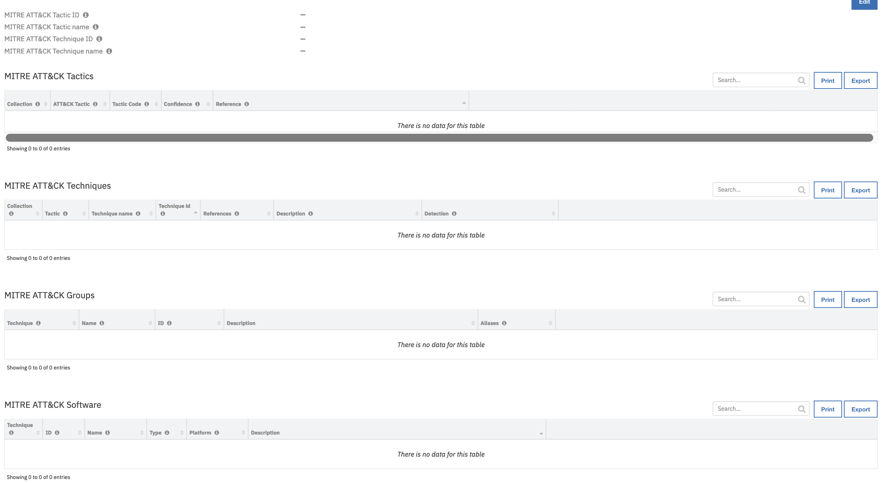

<!--
  This Install README.md is generated by running:
  "resilient-circuits docgen -p fn_mitre_integration --only-install-guide"

  It is best edited using a Text Editor with a Markdown Previewer. VS Code
  is a good example. Checkout https://guides.github.com/features/mastering-markdown/
  for tips on writing with Markdown

  If you make manual edits and run docgen again, a .bak file will be created

  Store any screenshots in the "doc/screenshots" directory and reference them like:
  
-->

# fn-mitre-integration Functions for IBM Resilient

- [Release Notes](#release-notes)
- [Overview](#overview)
- [Requirements](#requirements)
- [Installation](#installation)
- [Uninstall](#uninstall)
- [Troubleshooting](#troubleshooting)
- [Support](#support)

---

## Release Notes
<!--
  Specify all changes in this release. Do not remove the release 
  notes of a previous release
-->
### v2.0
- Added customizations allowing to find groups that use all of the techniques given
- Added customizations allowing to find groups for each of the techniques given
- Added Workflow/Rule/Data table to get software used by a technique/techniques
- Added support for all of the MITRE's collections
- New column `Collection` was added to technique and tactic data tables 
to specify what collection the technique/task comes from.
- Data returned by the functions has a different format - `pre-processing` and `post-processing` scripts
have examples of what the data looks like.
- Added Activity Fields to the Rules

### v1.0
- Initial release

---

## Overview
<!--
  Provide a high-level description of the function itself and its remote software or application.
  The text below is parsed from the "description" and "long_description" attributes in the setup.py file
-->
**Resilient Circuits Components for 'fn_mitre_integration**

 

MITRE’s TAXII<sup>TM</sup> 2.0 Server provides Adversarial Tactics, Techniques, and Common Knowledge (ATT&CK or ATTACK) content. 
This content is critical for cyber security industry in order to make a holistic approach to detection and mitigation of Advanced Persistent Threats (APTs). 
MITRE Integration Function enables Resilient users to gather ATT&CK information on cyber intrusion once a 
tactic or technique has been identified. This information can help security analyst response quickly to a (potential) breach. 

It comes with a set of customizations allowing to query MITRE ATT&CK for
- Techniques
- Tactics
- Software used in techniques
- Groups using techniques
- Groups that use a specific set of techniques
- Mitigations

---

## Requirements
<!--
  List any Requirements 
-->
* Resilient platform >= `v32.3.12`
* An Integration Server running `resilient_circuits>=32.0.0`
  * To set up an Integration Server see: [ibm.biz/res-int-server-guide](https://ibm.biz/res-int-server-guide)

---

## Installation
* Download the `fn_mitre_integration.zip`.
* Copy the `.zip` to your Integration Server and SSH into it.
* **Unzip** the package:
  ```
  $ unzip fn_mitre_integration-x.x.x.zip
  ```
* **Change Directory** into the unzipped directory:
  ```
  $ cd fn_mitre_integration-x.x.x
  ```
* **Install** the package:
  ```
  $ pip install fn_mitre_integration-x.x.x.tar.gz
  ```
* Import the fn_mitre_integration **customizations** into the Resilient platform:
  ```
  $ resilient-circuits customize -y -l fn-mitre-integration
  ```
* [Optional]: Run selftest to test the Integration you configured:
  ```
  $ resilient-circuits selftest -l fn-mitre-integration
  ```
* **Run** resilient-circuits or restart the Service on Windows/Linux:
  ```
  $ resilient-circuits run
  ```

### Custom Layouts
<!--
  Use this section to provide guidance on where the user should add any custom fields and data tables.
  You may wish to recommend a new incident tab.
  You should save a screenshot "custom_layouts.png" in the doc/screenshots directory and reference it here
-->
* Import the Data Tables and Custom Fields like the screenshot below:

  

---

## Uninstall
* SSH into your Integration Server.
* **Uninstall** the package:
  ```
  $ pip uninstall fn-mitre-integration
  ```

---

## Troubleshooting
There are several ways to verify the successful operation of a function.

### Resilient Action Status
* When viewing an incident, use the Actions menu to view **Action Status**.
* By default, pending and errors are displayed.
* Modify the filter for actions to also show Completed actions.
* Clicking on an action displays additional information on the progress made or what error occurred.

### Resilient Scripting Log
* A separate log file is available to review scripting errors.
* This is useful when issues occur in the pre-processing or post-processing scripts.
* The default location for this log file is: `/var/log/resilient-scripting/resilient-scripting.log`.

### Resilient Logs
* By default, Resilient logs are retained at `/usr/share/co3/logs`.
* The `client.log` may contain additional information regarding the execution of functions.

### Resilient-Circuits
* The log is controlled in the `.resilient/app.config` file under the section [resilient] and the property `logdir`.
* The default file name is `app.log`.
* Each function will create progress information.
* Failures will show up as errors and may contain python trace statements.

---

<!--
  If necessary, use this section to describe how to configure your security application to work with the integration.
  Delete this section if the user does not need to perform any configuration procedures on your product.

## Configure <Product_Name>

* Step One
* Step Two
* Step Three

---
-->

## Support
| Name | Version | Author | Support URL |
| ---- | ------- | ------ | ----------- |
| fn_mitre_integration | 2.0.0 | IBM Resilient |  |