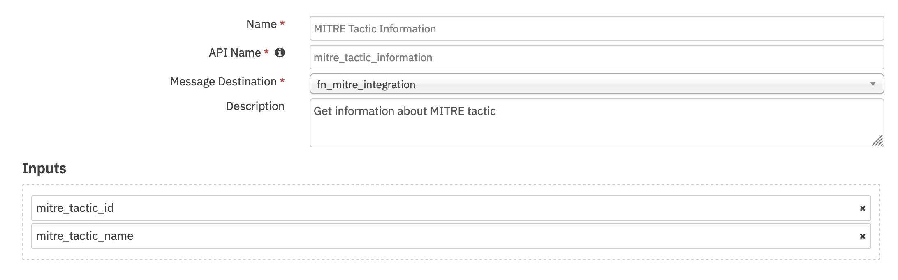
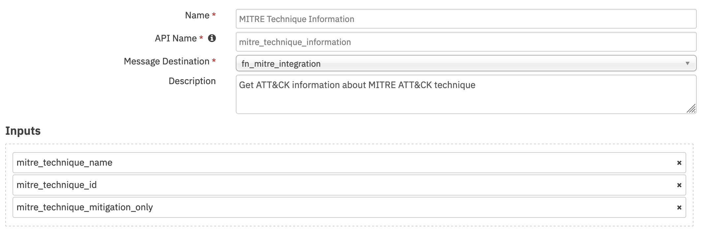
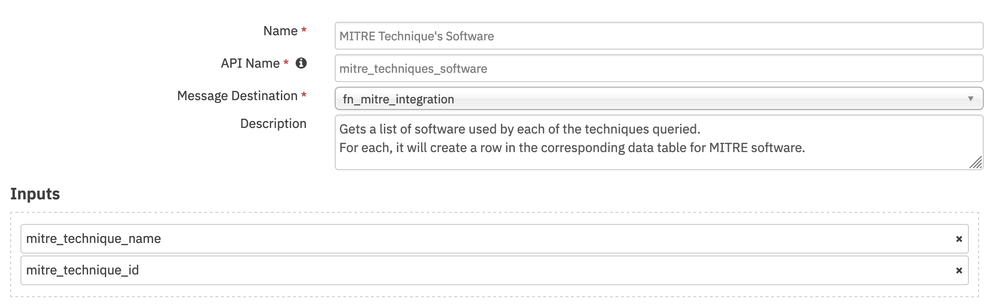
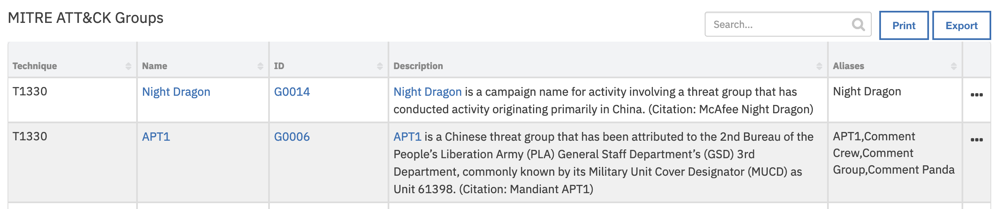
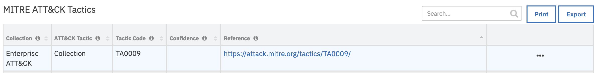

<!--
  This README.md is generated by running:
  "resilient-sdk docgen -p fn_mitre_integration"

  This file was generated with resilient-sdk v51.0.0.1.486

  It is best edited using a Text Editor with a Markdown Previewer. VS Code
  is a good example. Checkout https://guides.github.com/features/mastering-markdown/
  for tips on writing with Markdown

  All fields followed by "::CHANGE_ME::"" should be manually edited

  If you make manual edits and run docgen again, a .bak file will be created

  Store any screenshots in the "doc/screenshots" directory and reference them like:
  

  NOTE: If your app is available in the container-format only, there is no need to mention the integration server in this readme.
-->

# MITRE ATT&CK


## Table of Contents
- [Release Notes](#release-notes)
- [Overview](#overview)
  - [Key Features](#key-features)
- [Requirements](#requirements)
  - [SOAR platform](#soar-platform)
  - [Cloud Pak for Security](#cloud-pak-for-security)
  - [Proxy Server](#proxy-server)
  - [Python Environment](#python-environment)
- [Installation](#installation)
  - [Install](#install)
  - [App Configuration](#app-configuration)
- [Function - MITRE Get Groups Using All Given Techniques](#function---mitre-get-groups-using-all-given-techniques)
- [Function - MITRE Groups Using Given Techniques](#function---mitre-groups-using-given-techniques)
- [Function - MITRE Tactic Information](#function---mitre-tactic-information)
- [Function - MITRE Technique Information](#function---mitre-technique-information)
- [Function - MITRE Technique's Software](#function---mitre-techniques-software)
  - [Custom Layouts](#custom-layouts)
- [Data Table - MITRE ATT&CK Groups](#data-table---mitre-attck-groups)
- [Data Table - MITRE ATT&CK Software](#data-table---mitre-attck-software)
- [Data Table - MITRE ATT&CK Tactics](#data-table---mitre-attck-tactics)
- [Data Table - MITRE ATT&CK Techniques](#data-table---mitre-attck-techniques)
- [Custom Fields](#custom-fields)
- [Rules](#rules)
- [Troubleshooting & Support](#troubleshooting--support)

---

## Release Notes
<!--
  Specify all changes in this release. Do not remove the release
  notes of a previous release
-->
| Version | Date | Notes |
| ------- | ---- | ----- |
| 1.0.0 | 04/2019 | Initial Release |
| 1.0.1 | 04/2019 | Update Document |
| 2.0.0 | 11/2019 | Customizations for group identification, software retrieval, MITRE collection support, and data format changes. |
| 2.0.1 | 04/2020 | Support added for App Host |
| 2.0.2 | 09/2020 | Added proxy support |

---

## Overview
<!--
  Provide a high-level description of the function itself and its remote software or application.
  The text below is parsed from the "description" and "long_description" attributes in the setup.py file
-->
**Resilient Circuits Components for 'fn_mitre_integration'**

MITRE’s TAXII<sup>TM</sup> 2.0 Server provides Adversarial Tactics, Techniques, and Common Knowledge (ATT&CK or ATTACK) content.
This content is critical for cyber security industry in order to make a holistic approach to detection and mitigation of Advanced Persistent Threats (APTs).
MITRE Integration Function enables Resilient users to gather ATT&CK information on cyber intrusion once a
tactic or technique has been identified. This information can help security analysts respond quickly to a (potential) breach.

### Key Features

It comes with a set of customizations that query MITRE ATT&CK for the following:
- Techniques
- Tactics
- Software used in techniques
- Groups using techniques
- Groups that use a specific set of techniques
- Mitigations

---

## Requirements
<!--
  List any Requirements
-->
This app supports the IBM Security QRadar SOAR Platform and the IBM Security QRadar SOAR for IBM Cloud Pak for Security.

### SOAR platform
The SOAR platform supports two app deployment mechanisms, Edge Gateway (also known as App Host) and integration server.

If deploying to a SOAR platform with an App Host, the requirements are:
* SOAR platform >= `32.3.12`.
* The app is in a container-based format (available from the AppExchange as a `zip` file).

If deploying to a SOAR platform with an integration server, the requirements are:
* SOAR platform >= `32.3.12`.
* The app is in the older integration format (available from the AppExchange as a `zip` file which contains a `tar.gz` file).
* Integration server is running `resilient_circuits>=32.0.0`.
* If using an API key account, make sure the account provides the following minimum permissions:
  | Name | Permissions |
  | ---- | ----------- |
  | Org Data | Read |
  | Function | Read |

The following SOAR platform guides provide additional information:
* _Edge Gateway Deployment Guide_ or _App Host Deployment Guide_: provides installation, configuration, and troubleshooting information, including proxy server settings.
* _Integration Server Guide_: provides installation, configuration, and troubleshooting information, including proxy server settings.
* _System Administrator Guide_: provides the procedure to install, configure and deploy apps.

The above guides are available on the IBM Documentation website at [ibm.biz/soar-docs](https://ibm.biz/soar-docs). On this web page, select your SOAR platform version. On the follow-on page, you can find the _Edge Gateway Deployment Guide_, _App Host Deployment Guide_, or _Integration Server Guide_ by expanding **Apps** in the Table of Contents pane. The System Administrator Guide is available by expanding **System Administrator**.

### Cloud Pak for Security
If you are deploying to IBM Cloud Pak for Security, the requirements are:
* IBM Cloud Pak for Security >= `1.10.15`.
* Cloud Pak is configured with an Edge Gateway.
* The app is in a container-based format (available from the AppExchange as a `zip` file).

The following Cloud Pak guides provide additional information:
* _Edge Gateway Deployment Guide_ or _App Host Deployment Guide_: provides installation, configuration, and troubleshooting information, including proxy server settings. From the Table of Contents, select Case Management and Orchestration & Automation > **Orchestration and Automation Apps**.
* _System Administrator Guide_: provides information to install, configure, and deploy apps. From the IBM Cloud Pak for Security IBM Documentation table of contents, select Case Management and Orchestration & Automation > **System administrator**.

These guides are available on the IBM Documentation website at [ibm.biz/cp4s-docs](https://ibm.biz/cp4s-docs). From this web page, select your IBM Cloud Pak for Security version. From the version-specific IBM Documentation page, select Case Management and Orchestration & Automation.

### Proxy Server
The app **does** support a proxy server.

### Python Environment
Python 3.6 and Python 3.9 are supported.
Additional package dependencies may exist for each of these packages:
* resilient_circuits>=32.0.0
* resilient_lib
* stix2
* taxii2-client>=2.0.0

#### Configuration
<!--
List any steps that are needed to configure the endpoint to use this app.
-->
  | Config | Required | Example | Description |
  | ------ | :------: | ------- | ----------- |
  | **http_proxy** or **https_proxy** | No | https://proxyhost:8080 | *Optional settings for access to Mitre via a proxy.* |
---

## Installation

### Install
* To install or uninstall an App or Integration on the _SOAR platform_, see the documentation at [ibm.biz/soar-docs](https://ibm.biz/soar-docs).
* To install or uninstall an App on _IBM Cloud Pak for Security_, see the documentation at [ibm.biz/cp4s-docs](https://ibm.biz/cp4s-docs) and follow the instructions above to navigate to Orchestration and Automation.

## Function - MITRE Get Groups Using All Given Techniques
For given Techniques, return the Groups that are known to use all of them.
Techniques can be specified with a comma separated strings of IDs or Names.
In case both are provided, the ID values take precedence as names are not guaranteed to be unique.

 

<details><summary>Inputs:</summary>
<p>

| Name | Type | Required | Example | Tooltip |
| ---- | :--: | :------: | ------- | ------- |
| `mitre_technique_id` | `text` | No | `-` | - |
| `mitre_technique_name` | `text` | No | `-` | - |

</p>
</details>

<details><summary>Outputs:</summary>
<p>

> **NOTE:** This example might be in JSON format, but `results` is a Python Dictionary on the SOAR platform.


```python
results = {
    # TODO: Generate an example of the Function Output within this code block.
    # To get the output of a Function:
    #   1. Run resilient-circuits in DEBUG mode: $ resilient-circuits run --loglevel=DEBUG
    #   2. Invoke the Function in SOAR
    #   3. Gather the results using: $ resilient-sdk codegen -p fn_mitre_integration --gather-results
    #   4. Run docgen again: $ resilient-sdk docgen -p fn_mitre_integration
    # Or simply paste example outputs manually here. Be sure to remove any personal information
}
```

</p>
</details>

<details><summary>Example Function Input Script:</summary>
<p>

```python
# The priority order of inputs is:
# 1. Values entered in the Activity Field pop-up
# 2. Values in the Input Fields added to the layout
# 3. Inputs in the function's workflow

activity_field_given = rule.properties.mitre_technique_id or rule.properties.mitre_technique_name
incident_properties_given = incident.properties.mitre_technique_name or incident.properties.mitre_technique_id

if activity_field_given:
  inputs.mitre_technique_name = rule.properties.mitre_technique_name
  inputs.mitre_technique_id = rule.properties.mitre_technique_id
elif incident_properties_given:
  inputs.mitre_technique_id = incident.properties.mitre_technique_id
  inputs.mitre_technique_name = incident.properties.mitre_technique_name
```

</p>
</details>

<details><summary>Example Function Post Process Script:</summary>
<p>

```python
"""
Data returned as a part of ResultPayload:
        {
            "technique": "T0042",
            "name": "Wet Bandits",
            "id": "G0032",
            "ref": "url to MITRE",
            "description": "lorem ipsum",
            "aliases": ["name 1", "name 2"]
        }
"""
groups_mitre = results.content["mitre_groups"]

for group in groups_mitre:
  group_row = incident.addRow("mitre_attack_groups")
  group_row["groups_technique"] = group["technique"]

  ref = '<a href="{}">'.format(group["ref"]) +'{}</a> '
  group_row["groups_name"] = helper.createRichText(ref.format(group["name"]))
  group_row["groups_id"]   = helper.createRichText(ref.format(group["id"]))

  group_row["groups_aliases"] = ",".join(group["aliases"])
  group_row["groups_description"] = helper.createRichText(group["description"])
```

</p>
</details>

---
## Function - MITRE Groups Using Given Techniques
For each given Technique, find all of the Groups using it.
Techniques can be specified with a comma separated strings of IDs or Names.
In case both are provided, the ID values take precedence as names are not guaranteed to be unique.

 

<details><summary>Inputs:</summary>
<p>

| Name | Type | Required | Example | Tooltip |
| ---- | :--: | :------: | ------- | ------- |
| `mitre_technique_id` | `text` | No | `-` | - |
| `mitre_technique_name` | `text` | No | `-` | - |

</p>
</details>

<details><summary>Outputs:</summary>
<p>

> **NOTE:** This example might be in JSON format, but `results` is a Python Dictionary on the SOAR platform.


```python
results = {
    # TODO: Generate an example of the Function Output within this code block.
    # To get the output of a Function:
    #   1. Run resilient-circuits in DEBUG mode: $ resilient-circuits run --loglevel=DEBUG
    #   2. Invoke the Function in SOAR
    #   3. Gather the results using: $ resilient-sdk codegen -p fn_mitre_integration --gather-results
    #   4. Run docgen again: $ resilient-sdk docgen -p fn_mitre_integration
    # Or simply paste example outputs manually here. Be sure to remove any personal information
}
```

</p>
</details>

<details><summary>Example Function Input Script:</summary>
<p>

```python
# The priority order of inputs is:
# 1. Values entered in the Activity Field pop-up
# 2. Values in the Input Fields added to the layout
# 3. Inputs in the function's workflow

activity_field_given = rule.properties.mitre_technique_id or rule.properties.mitre_technique_name
incident_properties_given = incident.properties.mitre_technique_name or incident.properties.mitre_technique_id

if activity_field_given:
  inputs.mitre_technique_name = rule.properties.mitre_technique_name
  inputs.mitre_technique_id = rule.properties.mitre_technique_id
elif incident_properties_given:
  inputs.mitre_technique_id = incident.properties.mitre_technique_id
  inputs.mitre_technique_name = incident.properties.mitre_technique_name
```

</p>
</details>

<details><summary>Example Function Post Process Script:</summary>
<p>

```python
"""
Data returned as a part of ResultPayload:
        {
            "technique": "T0042",
            "name": "Wet Bandits",
            "id": "G0032",
            "ref": "url to MITRE",
            "description": "lorem ipsum",
            "aliases": ["name 1", "name 2"]
        }
"""
groups_mitre = results.content["mitre_groups"]

for group in groups_mitre:
  group_row = incident.addRow("mitre_attack_groups")
  group_row["groups_technique"] = group["technique"]

  ref = '<a href="{}">'.format(group["ref"]) +'{}</a> '
  group_row["groups_name"] = helper.createRichText(ref.format(group["name"]))
  group_row["groups_id"]   = helper.createRichText(ref.format(group["id"]))

  group_row["groups_aliases"] = ",".join(group["aliases"])
  group_row["groups_description"] = helper.createRichText(group["description"])
```

</p>
</details>

---
## Function - MITRE Tactic Information
Get information about MITRE tactic.
Tactics can be specified with a comma separated string of IDs or Names.
In case both are provided, the ID values take precedence as names are not guaranteed to be unique.

 

<details><summary>Inputs:</summary>
<p>

| Name | Type | Required | Example | Tooltip |
| ---- | :--: | :------: | ------- | ------- |
| `mitre_tactic_id` | `text` | No | `-` | MITRE ATT&CK Tactic ID |
| `mitre_tactic_name` | `text` | No | `-` | MITRE Tactic Name |

</p>
</details>

<details><summary>Outputs:</summary>
<p>

> **NOTE:** This example might be in JSON format, but `results` is a Python Dictionary on the SOAR platform.

```python
results = {
    # TODO: Generate an example of the Function Output within this code block.
    # To get the output of a Function:
    #   1. Run resilient-circuits in DEBUG mode: $ resilient-circuits run --loglevel=DEBUG
    #   2. Invoke the Function in SOAR
    #   3. Gather the results using: $ resilient-sdk codegen -p fn_mitre_integration --gather-results
    #   4. Run docgen again: $ resilient-sdk docgen -p fn_mitre_integration
    # Or simply paste example outputs manually here. Be sure to remove any personal information
}
```

</p>
</details>

<details><summary>Example Function Input Script:</summary>
<p>

```python
# The priority order of inputs is:
# 1. Values entered in the Activity Field pop-up
# 2. Values in the Input Fields added to the layout
# 3. Inputs in the function's workflow

activity_field_given = rule.properties.mitre_tactic_name or rule.properties.mitre_tactic_id
incident_propery_given = incident.properties.mitre_tactic_id or incident.properties.mitre_tactic_name

if activity_field_given:
  inputs.mitre_tactic_name = rule.properties.mitre_tactic_name
  inputs.mitre_tactic_id = rule.properties.mitre_tactic_id
elif incident_propery_given:
  inputs.mitre_tactic_name = incident.properties.mitre_tactic_name
  inputs.mitre_tactic_id = incident.properties.mitre_tactic_id
```

</p>
</details>

<details><summary>Example Function Post Process Script:</summary>
<p>

```python
""" Example of data returned in ResultPayload's content
{
  "mitre_tactics": [
    {

      "name": String,
      "id": String,
      "ref": "String",
      "collection": "String",
      "mitre_techniques": [
        {
          "name": "String",
          "description": "String",
          "external_references": [{"url": "String"}],
          "x_mitre_detection": "String",
          "id": "String",
          "collection": "String"
        }
      ]
    }
  ]
}
"""

tactics = results.content["mitre_tactics"]

for tactic in tactics:
  #
  # MITRE ATTACK of Incident Datatable
  #
  tactic_row = incident.addRow("mitre_attack_of_incident")
  tactic_row["collection"] = tactic["collection"]
  tactic_row["attack_tactic"] = tactic["name"]
  tactic_row["tactic_code"] = tactic["id"]
  url_html = '<a href="' + tactic["ref"] + '">' + tactic["ref"] + '</a><br>'
  tactic_row["reference"] = helper.createRichText(url_html)
  tactic_row["confidence"] = " "
  #
  # MITRE ATT&CK techniques Datatable
  #
  techs = tactic["mitre_techniques"]
  for att_tech in techs:
    tech_row = incident.addRow("mitre_attack_techniques")
    tech_row["collection"] = tactic["collection"]
    tech_row["tactic"] = tactic["name"]

    tech_row["technique_name"] = att_tech["name"]
    tech_row["technique_description"] = helper.createRichText(att_tech["description"])
    refs = att_tech["external_references"]
    ref_html = ""
    for ref in refs:
      url = ref["url"]

      https_str = "https://"
      http_str = "http://"

      start_pos = url.find(https_str)

      if start_pos != -1:
        start_pos = start_pos + len(https_str)
      else:
        # try http://
        start_pos = url.find(http_str)
        if start_pos != -1:
          start_pos = start_pos + len(http_str)
        else:
          start_pos = 0

      end_pos = url.find('/', start_pos)
      if end_pos == 0:
        # We don't know how to extract
        display_str = url
      elif end_pos == -1:
        display_str = url[start_pos:]
      else:
        display_str = url[start_pos:end_pos]

      ref_html = ref_html + '<a href="' + ref["url"] + '">' + display_str + '</a><br>'
    tech_row["references"] = helper.createRichText(ref_html)
    tech_row["detection"] = helper.createRichText(att_tech["x_mitre_detection"])
    tech_row["technique_id"] = att_tech["id"]


```

</p>
</details>

---
## Function - MITRE Technique Information
Get ATT&CK information about MITRE ATT&CK technique.
In case both ID and name are provided, the ID value takes precedence as names are not guaranteed to be unique.

 

<details><summary>Inputs:</summary>
<p>

| Name | Type | Required | Example | Tooltip |
| ---- | :--: | :------: | ------- | ------- |
| `mitre_technique_id` | `text` | No | `-` | - |
| `mitre_technique_mitigation_only` | `boolean` | No | `-` | Retrieve the mitigation only |
| `mitre_technique_name` | `text` | No | `-` | - |

</p>
</details>

<details><summary>Outputs:</summary>
<p>

> **NOTE:** This example might be in JSON format, but `results` is a Python Dictionary on the SOAR platform.

```python
results = {
    # TODO: Generate an example of the Function Output within this code block.
    # To get the output of a Function:
    #   1. Run resilient-circuits in DEBUG mode: $ resilient-circuits run --loglevel=DEBUG
    #   2. Invoke the Function in SOAR
    #   3. Gather the results using: $ resilient-sdk codegen -p fn_mitre_integration --gather-results
    #   4. Run docgen again: $ resilient-sdk docgen -p fn_mitre_integration
    # Or simply paste example outputs manually here. Be sure to remove any personal information
}
```

</p>
</details>

<details><summary>Example Function Input Script:</summary>
<p>

```python
inputs.mitre_technique_id = row.technique_id
inputs.mitre_technique_name = row.technique_name
```

</p>
</details>

<details><summary>Example Function Post Process Script:</summary>
<p>

```python
""" An example of returned data in ResultPayload. Whether it's queried by id or name a list will be returned.
{
  "mitre_techniques": [
    {
      "name": "String",
      "description": "String",
      "external_references": [{"url": "String"}],
      "x_mitre_detection": "String",
      "id": "String",
      "collection": "String",
      "tactic": "String",
      "mitre_mitigations": [
        {
          "name": "String",
          "description": "String",
          "id": "String",
          "collection": "String"
        }
      ]
    }
  ]
}
"""

techniques = results.content["mitre_techniques"]

if not isinstance(techniques, list):
  techniques = [techniques]

for technique in techniques:
  task_title = "MITRE ATT&CK Technique: " + technique["name"]

  mitigations = technique.get("mitre_mitigations", None)
  if not mitigations:
    mitigation_text = "No mitigations found"
  else:
    mitigation_text = []
    for mitigation in mitigations:
      mitigation_text.append(u"""
      <h3>{0}</h3>
      <p>{1}</p>
      """.format(mitigation["name"], mitigation["description"]))
    mitigation_text = "".join(mitigation_text)

  task_summary=u"""
  <h1> Description </h1>
  {des}
  <h1> Detection </h1>
  {det}
  <h1> Mitigation </h1>
  {miti}
  """.format(des=technique.get("description", ""), det=technique.get("x_mitre_detection", ""), miti=mitigation_text)
  incident.addTask(task_title, "Detect/Analyze", helper.createRichText(task_summary))
```

</p>
</details>

---
## Function - MITRE Technique's Software
Gets a list of Software used by each of the Techniques queried.
Techniques can be specified with comma separated strings of IDs or Names.
In case both are provided, the ID values take precedence as names are not guaranteed to be unique.

 

<details><summary>Inputs:</summary>
<p>

| Name | Type | Required | Example | Tooltip |
| ---- | :--: | :------: | ------- | ------- |
| `mitre_technique_id` | `text` | No | `-` | - |
| `mitre_technique_name` | `text` | No | `-` | - |

</p>
</details>

<details><summary>Outputs:</summary>
<p>

> **NOTE:** This example might be in JSON format, but `results` is a Python Dictionary on the SOAR platform.

```python
results = {
    # TODO: Generate an example of the Function Output within this code block.
    # To get the output of a Function:
    #   1. Run resilient-circuits in DEBUG mode: $ resilient-circuits run --loglevel=DEBUG
    #   2. Invoke the Function in SOAR
    #   3. Gather the results using: $ resilient-sdk codegen -p fn_mitre_integration --gather-results
    #   4. Run docgen again: $ resilient-sdk docgen -p fn_mitre_integration
    # Or simply paste example outputs manually here. Be sure to remove any personal information
}
```

</p>
</details>

<details><summary>Example Function Input Script:</summary>
<p>

```python
# The priority order of inputs is:
# 1. Values entered in the Activity Field pop-up
# 2. Values in the Input Fields added to the layout
# 3. Inputs in the function's workflow

activity_field_given = rule.properties.mitre_technique_id or rule.properties.mitre_technique_name
incident_properties_given = incident.properties.mitre_technique_name or incident.properties.mitre_technique_id

if activity_field_given:
  inputs.mitre_technique_name = rule.properties.mitre_technique_name
  inputs.mitre_technique_id = rule.properties.mitre_technique_id
elif incident_properties_given:
  inputs.mitre_technique_id = incident.properties.mitre_technique_id
  inputs.mitre_technique_name = incident.properties.mitre_technique_name
```

</p>
</details>

<details><summary>Example Function Post Process Script:</summary>
<p>

```python
"""
Data returned as a part of ResultPayload:
        {
            "technique": "STIX ID of the technique",
            "name": "Software's name",
            "id": "Software's id",
            "ref": "URL of software on MITRE's website",
            "description": "description of the website",
            "platforms": "platforms the software runs on",
            "type": "Type - 'malware' or 'tool'"
        }
"""
software = results.content["mitre_software"]

for soft in software:
  soft_row = incident.addRow("mitre_attack_software")
  soft_row["software_technique"] = soft["technique"]

  ref = '<a href="{}">'.format(soft["ref"]) +'{}</a> '
  soft_row["software_name"] = helper.createRichText(ref.format(soft["name"]))
  soft_row["software_id"]   = helper.createRichText(ref.format(soft["id"]))

  soft_row["software_description"] = helper.createRichText(soft["description"])
  soft_row["software_type"] = soft["type"]
  soft_row["software_platform"] = ",".join(soft["platforms"])
  soft_row["software_description"] = helper.createRichText(soft["description"])
```

</p>
</details>

---


## Custom Layouts
<!--
  Use this section to provide guidance on where the user should add any custom fields and data tables.
  You may wish to recommend a new incident tab.
  You should save a screenshot "custom_layouts.png" in the doc/screenshots directory and reference it here
-->
* Import the Data Tables and Custom Fields like the screenshot below:

  


## Data Table - MITRE ATT&CK Groups

 

#### API Name:
mitre_attack_groups

#### Columns:
| Column Name | API Access Name | Type | Tooltip |
| ----------- | --------------- | ---- | ------- |
| Group Aliases | `groups_aliases` | `text` | Known aliases for the Group |
| Group Description | `groups_description` | `textarea` | - |
| Group ID | `groups_id` | `textarea` | MITRE ID for the Group |
| Group Name | `groups_name` | `textarea` | Name of the Group |
| Technique ID | `groups_technique` | `text` | Technique(s) that the group was queried by. |

---
## Data Table - MITRE ATT&CK Software

 

#### API Name:
mitre_attack_software

#### Columns:
| Column Name | API Access Name | Type | Tooltip |
| ----------- | --------------- | ---- | ------- |
| Software Description | `software_description` | `textarea` | - |
| Software ID | `software_id` | `textarea` | Software's ID in MITRE ATT&CK |
| Software Name | `software_name` | `textarea` | Name of the software |
| Software Platform | `software_platform` | `text` | Platform where the software can be used |
| Software Type | `software_type` | `text` | Category for this software in ATT&CK |
| Technique ID | `software_technique` | `text` | MITRE ID of the technique queried for the list of software |

---
## Data Table - MITRE ATT&CK Tactics

 

#### API Name:
mitre_attack_of_incident

#### Columns:
| Column Name | API Access Name | Type | Tooltip |
| ----------- | --------------- | ---- | ------- |
| Confidence | `confidence` | `text` | Confidence of the mapping |
| MITRE Collection | `collection` | `text` | Collection/Domain in MITRE that the Tactic comes from |
| Tactic ID | `tactic_code` | `text` | Tactic's ID in MITRE |
| Tactic Name | `attack_tactic` | `text` | Tactic's name in MITRE |
| Tactic Reference | `reference` | `textarea` | url links for MITRE ATT&CK Tactic |

---
## Data Table - MITRE ATT&CK Techniques

 

#### API Name:
mitre_attack_techniques

#### Columns:
| Column Name | API Access Name | Type | Tooltip |
| ----------- | --------------- | ---- | ------- |
| MITRE Collection | `collection` | `text` | Domain/Collection in MITRE that the Technique comes from |
| Tactic Name | `tactic` | `text` | MITRE ATT&CK Tactic name |
| Technique Description | `technique_description` | `text` | Description of MITRE ATT&CK Technique |
| Technique Detection | `detection` | `text` | Detection of MITRE ATT&CK Technique  |
| Technique ID | `technique_id` | `text` | MITRE ATT&CK Technique ID |
| Technique Name | `technique_name` | `text` | MITRE ATT&CK Technique name |
| Technique References | `references` | `textarea` | url references for MITRE ATT&CK Technique |

---

## Custom Fields
| Label | API Access Name | Type | Prefix | Placeholder | Tooltip |
| ----- | --------------- | ---- | ------ | ----------- | ------- |
| MITRE ATT&CK Tactic ID | `mitre_tactic_id` | `text` | `properties` | - | MITRE ID for Tactic |
| MITRE ATT&CK Tactic name | `mitre_tactic_name` | `text` | `properties` | MITRE tactic name | MITRE ATT&CK Tactic name |
| MITRE ATT&CK Technique ID | `mitre_technique_id` | `text` | `properties` | - | MITRE ID for technique |
| MITRE ATT&CK Technique name | `mitre_technique_name` | `text` | `properties` | MITRE technique name | MITRE ATT&CK Technique name |

---


## Rules
| Rule Name | Object | Workflow Triggered | Condition |
| --------- | ------ | ------------------ | ---------- |
| MITRE: Create Task for ATT&CK Technique | mitre_attack_techniques | `mitre_technique_task` | `-` |
| MITRE: Get Groups per Technique | incident | `mitre_get_groups_using_techniques` | `-` |
| MITRE: Get Groups using all Techniques | incident | `mitre_get_groups_using_all_techniques` | `-` |
| MITRE: Get Tactic information | incident | `mitre_get_tactic_information` | `-` |
| MITRE: Get Technique information | incident | `mitre_get_technique_information` | `-` |
| MITRE: Get Technique's Software | incident | `mitre_get_software_for_a_technique` | `-` |

---


## Troubleshooting & Support
Refer to the documentation listed in the Requirements section for troubleshooting information.

### For Support
This is an IBM supported app. Please search [ibm.com/mysupport](https://ibm.com/mysupport) for assistance.
