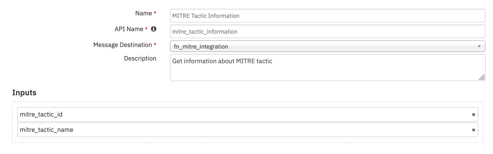
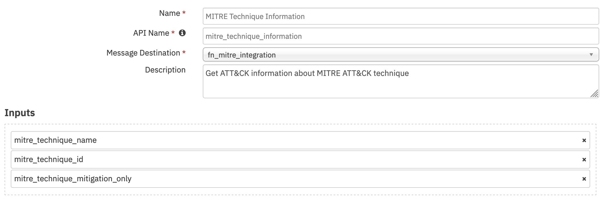
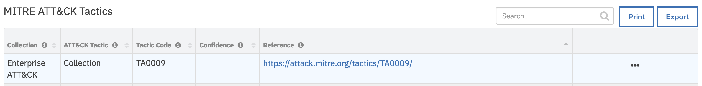
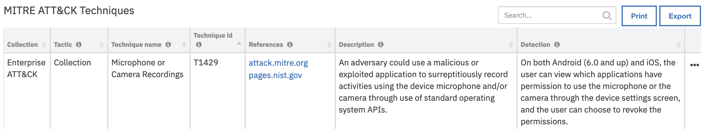

<!--
  This User README.md is generated by running:
  "resilient-circuits docgen -p fn_mitre_integration --only-user-guide"

  It is best edited using a Text Editor with a Markdown Previewer. VS Code
  is a good example. Checkout https://guides.github.com/features/mastering-markdown/
  for tips on writing with Markdown

  If you make manual edits and run docgen again, a .bak file will be created

  Store any screenshots in the "doc/screenshots" directory and reference them like:
  
-->

# **User Guide:** fn_mitre_integration_v1.0.1

## Table of Contents
- [Note](#note)
- [Key Features](#key-features)
- [Function - MITRE Tactic Information](#function---mitre-tactic-information)
- [Function - MITRE Technique Information](#function---mitre-technique-information)
- [Data Table - MITRE ATT&CK Tactics](#data-table---mitre-attck-tactics)
- [Data Table - MITRE ATT&CK Techniques](#data-table---mitre-attck-techniques)
- [Custom Fields](#custom-fields)
- [Rules](#rules)

---

## Note
All functions provide input fields for querying MITRE by both ID and name, however
in case both are provided ID will take priority, and name input will be ignored. 

## Key Features
<!--
  List the Key Features of the Integration
-->
* Query tactics/techniques by name or id
* Queries all of MITRE ATT&CK collections
* Create a task from a queried technique that would include mitigation information

---

## Function - MITRE Tactic Information
Get information about MITRE tactic

 

<details><summary>Inputs:</summary>
<p>

| Name | Type | Required | Example | Tooltip |
| ---- | :--: | :------: | ------- | ------- |
| `mitre_tactic_id` | `text` | No | `TA0002` | MITRE ATT&CK Tactic ID |
| `mitre_tactic_name` | `text` | No | `Execution` | MITRE Tactic Name |

</p>
</details>

<details><summary>Outputs:</summary>
<p>

```python
results = {
  "mitre_tactics": [
    {
      
      "name": String,
      "id": String,
      "ref": "String",
      "collection": "String", 
      "mitre_techniques": [
        {
          "name": "String", 
          "description": "String",
          "external_references": [{"url": "String"}],
          "x_mitre_detection": "String",
          "id": "String",
          "collection": "String"
        }
      ]
    }
  ]
}
```

</p>
</details>

<details><summary>Example Pre-Process Script:</summary>
<p>

```python
# if at least one activity field is given discard the inputs
# this is to avoid situation where rule has name and activity has id for different tactics, which can lead to unexpected output
activity_field_given = rule.properties.mitre_tactic_name or rule.properties.mitre_tactic_id
incident_propery_given = incident.properties.mitre_tactic_id or incident.properties.mitre_tactic_name

if activity_field_given:
  inputs.mitre_tactic_name = rule.properties.mitre_tactic_name
  inputs.mitre_tactic_id = rule.properties.mitre_tactic_id
elif incident_propery_given:
  inputs.mitre_tactic_name = incident.properties.mitre_tactic_name
  inputs.mitre_tactic_id = incident.properties.mitre_tactic_id
# else, just keep the function input
```

</p>
</details>

<details><summary>Example Post-Process Script:</summary>
<p>

```python
tactics = results.mitre_tactics

for tactic in tactics:
  #
  # MITRE ATTACK of Incident Datatable
  #
  tactic_row = incident.addRow("mitre_attack_of_incident")
  tactic_row["collection"] = tactic["collection"]
  tactic_row["attack_tactic"] = tactic["name"]
  tactic_row["tactic_code"] = tactic["id"]
  url_html = '<a href="' + tactic["ref"] + '">' + tactic["ref"] + '</a><br>'
  tactic_row["reference"] = helper.createRichText(url_html)
  tactic_row["confidence"] = " "
  #
  # MITRE ATT&CK techniques Datatable
  #
  techs = tactic["mitre_techniques"]
  for att_tech in techs:
    tech_row = incident.addRow("mitre_attack_techniques")
    tech_row["collection"] = tactic["collection"]
    tech_row["tactic"] = tactic["name"]

    tech_row["technique_name"] = att_tech["name"]
    tech_row["technique_description"] = att_tech["description"]
    refs = att_tech["external_references"]
    ref_html = ""
    for ref in refs:
      url = ref["url"]
      
      https_str = "https://"
      http_str = "http://"

      start_pos = url.find(https_str)

      if start_pos != -1:
        start_pos = start_pos + len(https_str)
      else:
        # try http://
        start_pos = url.find(http_str)
        if start_pos != -1:
          start_pos = start_pos + len(http_str)
        else:
          start_pos = 0 

      end_pos = url.find('/', start_pos)
      if end_pos == 0:
        # We don't know how to extract
        display_str = url
      elif end_pos == -1:
        display_str = url[start_pos:]
      else:
        display_str = url[start_pos:end_pos]
      
      ref_html = ref_html + '<a href="' + ref["url"] + '">' + display_str + '</a><br>'
    tech_row["references"] = helper.createRichText(ref_html)
    tech_row["detection"] = att_tech["x_mitre_detection"]
    tech_row["technique_id"] = att_tech["id"]


```

</p>
</details>

---
## Function - MITRE Technique Information
Get ATT&CK information about MITRE ATT&CK technique

 

<details><summary>Inputs:</summary>
<p>

| Name | Type | Required | Example | Tooltip |
| ---- | :--: | :------: | ------- | ------- |
| `mitre_technique_id` | `text` | No | `T1155` | - |
| `mitre_technique_mitigation_only` | `boolean` | No | `-` | Retrieve the mitigation only |
| `mitre_technique_name` | `text` | No | `AppleScript` | - |

</p>
</details>

<details><summary>Outputs:</summary>
<p>

```python
results = {
  "mitre_techniques": [
    {
      "name": "String", 
      "description": "String",
      "external_references": [{"url": "String"}],
      "x_mitre_detection": "String",
      "id": "String",
      "collection": "String"
    }
  ]
}
```

</p>
</details>

<details><summary>Example Pre-Process Script:</summary>
<p>

```python
inputs.mitre_technique_id = row.technique_id
inputs.mitre_technique_name = row.technique_name
```

</p>
</details>

<details><summary>Example Post-Process Script:</summary>
<p>

```python
techniques = results.mitre_techniques

if not isinstance(techniques, list):
  techniques = [techniques]

for technique in techniques:
  task_title = "MITRE ATT&CK Technique: " + results.name
  task_summary=u"""
  <h1> Description </h1>
  {des}
  <h1> Detection </h1>
  {det}
  <h1> Mitigation </h1>
  {miti}
  """.format(des=row.tech_description, det=row.detection, miti=technique["mitre_mitigation"])
  incident.addTask(task_title, "Detect/Analyze", helper.createRichText(task_summary))
```

</p>
</details>

---

## Data Table - MITRE ATT&CK Tactics

 

#### API Name:
mitre_attack_of_incident

#### Columns:
| Column Name | API Access Name | Type | Tooltip |
| ----------- | --------------- | ---- | ------- |
| ATT&CK Tactic | `attack_tactic` | `text` | Tactic id |
| Collection | `collection` | `text` | Collection that the value was found in |
| Confidence | `confidence` | `text` | confidence of the mapping |
| Reference | `reference` | `textarea` | url links for MITRE ATT&CK Tactic |
| Tactic Code | `tactic_code` | `text` | tactic code |

---
## Data Table - MITRE ATT&CK Techniques

 

#### API Name:
mitre_attack_techniques

#### Columns:
| Column Name | API Access Name | Type | Tooltip |
| ----------- | --------------- | ---- | ------- |
| Collection | `collection` | `text` | - |
| Detection | `detection` | `text` | Detection of MITRE ATT&CK Technique  |
| References | `references` | `textarea` | url references for MITRE ATT&CK Technique |
| Tactic | `tactic` | `text` | MITRE ATT&CK Tactic name |
| Description | `technique_description` | `text` | Description of MITRE ATT&CK Technique |
| Technique id | `technique_id` | `text` | MITRE ATT&CK Technique ID |
| Technique name | `technique_name` | `text` | MITRE ATT&CK Technique name |

---

## Custom Fields
| Label | API Access Name | Type | Prefix | Placeholder | Tooltip |
| ----- | --------------- | ---- | ------ | ----------- | ------- |
| MITRE ATT&CK Technique ID | `mitre_technique_id` | `text` | `properties` | - | MITRE ID for technique |
| MITRE ATT&CK Tactic name | `mitre_tactic_name` | `text` | `properties` | MITRE tactic name | MITRE ATT&CK Tactic name |
| MITRE ATT&CK Technique name | `mitre_technique_name` | `text` | `properties` | MITRE technique name | MITRE ATT&CK Technique name |
| MITRE ATT&CK Tactic ID | `mitre_tactic_id` | `text` | `properties` | - | MITRE ID for Tactic |

---


## Rules
| Rule Name | Object | Workflow Triggered |
| --------- | ------ | ------------------ |
| Create Task for MITRE ATT&CK technique | mitre_attack_techniques | `mitre_technique_task` |
| Get MITRE tactic information | incident | `mitre_get_tactic_information` |
| Get MITRE technique information | incident | `mitre_get_technique_information` |

---

<!--
## Inform Resilient Users
  Use this section to optionally provide additional information so that Resilient playbook 
  designer can get the maximum benefit of your integration.
-->
