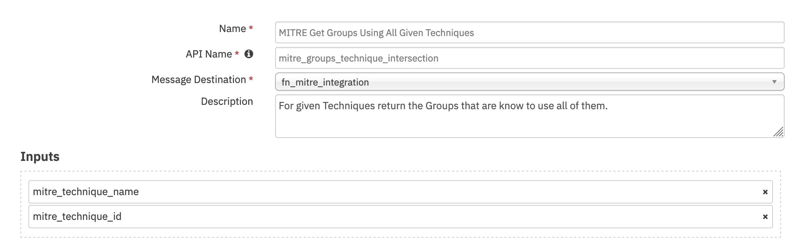
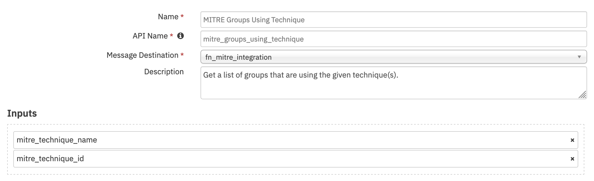
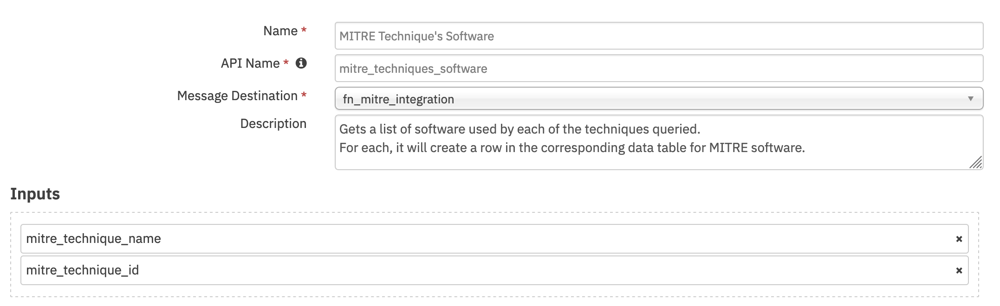
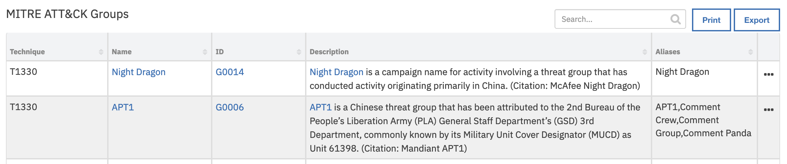
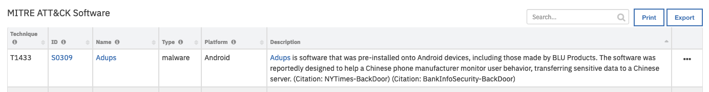

<!--
  This User README.md is generated by running:
  "resilient-circuits docgen -p fn_mitre_integration --only-user-guide"

  It is best edited using a Text Editor with a Markdown Previewer. VS Code
  is a good example. Checkout https://guides.github.com/features/mastering-markdown/
  for tips on writing with Markdown

  If you make manual edits and run docgen again, a .bak file will be created

  Store any screenshots in the "doc/screenshots" directory and reference them like:
  
-->

# **User Guide:** fn_mitre_integration_v2.0.0

## Table of Contents
- [Key Features](#key-features)
- [Function - MITRE Get Groups Using All Given Techniques](#function---mitre-get-groups-using-all-given-techniques)
- [Function - MITRE Groups Using Given Techniques](#function---mitre-groups-using-given-techniques)
- [Function - MITRE Tactic Information](#function---mitre-tactic-information)
- [Function - MITRE Technique Information](#function---mitre-technique-information)
- [Function - MITRE Technique's Software](#function---mitre-techniques-software)
- [Data Table - MITRE ATT&CK Groups](#data-table---mitre-attck-groups)
- [Data Table - MITRE ATT&CK Tactics](#data-table---mitre-attck-tactics)
- [Data Table - MITRE ATT&CK Software](#data-table---mitre-attck-software)
- [Data Table - MITRE ATT&CK Techniques](#data-table---mitre-attck-techniques)
- [Custom Fields](#custom-fields)
- [Rules](#rules)

---

## Key Features
<!--
  List the Key Features of the Integration
-->
* Query tactics/techniques by name or id
* Queries all of MITRE ATT&CK collections
* Create a task from a queried technique that would include mitigation information
* Query groups/software by technique
* Query groups that use a set of techniques

---

## Function - MITRE Get Groups Using All Given Techniques
For given Techniques return the Groups that are known to use all of them.
Techniques can be specified with a comma separated strings of IDs or Names.
In case both are provided, the ID values will take precedence as names aren't guaranteed to be unique.

 

<details><summary>Inputs:</summary>
<p>

| Name | Type | Required | Example | Tooltip |
| ---- | :--: | :------: | ------- | ------- |
| `mitre_technique_id` | `text` | No | `T0042, T0007, T0003` | - |
| `mitre_technique_name` | `text` | No | `Properly capitalized Name of a Technique` | - |

</p>
</details>

<details><summary>Outputs:</summary>
<p>

```json
Content part of ResultPayload:
{
    "mitre_groups": [
        {
            "technique": "T0042, T0007, T0003",
            "name": "Wet Bandits",
            "id": "G0032",
            "ref": "url to MITRE",
            "description": "lorem ipsum",
            "aliases": ["name 1", "name 2"]
        }
    ]
}
```

</p>
</details>

<details><summary>Example Pre-Process Script:</summary>
<p>

```python
# The priority order of inputs is:
# 1. Values entered in the Activity Field pop-up
# 2. Values in the Input Fields added to the layout
# 3. Inputs in the function's workflow

activity_field_given = rule.properties.mitre_technique_id or rule.properties.mitre_technique_name
incident_properties_given = incident.properties.mitre_technique_name or incident.properties.mitre_technique_id

if activity_field_given:
  inputs.mitre_technique_name = rule.properties.mitre_technique_name
  inputs.mitre_technique_id = rule.properties.mitre_technique_id
elif incident_properties_given:
  inputs.mitre_technique_id = incident.properties.mitre_technique_id
  inputs.mitre_technique_name = incident.properties.mitre_technique_name
```

</p>
</details>

<details><summary>Example Post-Process Script:</summary>
<p>

```python
"""
Data returned as a part of ResultPayload:
{
    "mitre_groups": [
        {
            "technique": "T0042",
            "name": "Wet Bandits",
            "id": "G0032",
            "ref": "url to MITRE",
            "description": "lorem ipsum",
            "aliases": ["name 1", "name 2"]
        }
    ]
}
"""
groups_mitre = results.content["mitre_groups"]

for group in groups_mitre:
  group_row = incident.addRow("mitre_attack_groups")
  group_row["groups_technique"] = group["technique"]
  
  ref = '<a href="{}">'.format(group["ref"]) +'{}</a> '
  group_row["groups_name"] = helper.createRichText(ref.format(group["name"]))
  group_row["groups_id"]   = helper.createRichText(ref.format(group["id"]))
  
  group_row["groups_aliases"] = ",".join(group["aliases"])
  group_row["groups_description"] = helper.createRichText(group["description"])
```

</p>
</details>

---
## Function - MITRE Groups Using Given Techniques
For each of the given Techniques finds all of the Groups using it.
Techniques can be specified with a comma separated strings of IDs or Names.
In case both are provided, the ID values will take precedence as names aren't guaranteed to be unique.

 

<details><summary>Inputs:</summary>
<p>

| Name | Type | Required | Example | Tooltip |
| ---- | :--: | :------: | ------- | ------- |
| `mitre_technique_id` | `text` | No | `T0042` | - |
| `mitre_technique_name` | `text` | No | `Properly capitalized Name of a Technique` | - |

</p>
</details>

<details><summary>Outputs:</summary>
<p>

```json
Content of ResultPayload:
{
    "mitre_groups": [
        {
            "technique": "T0042",
            "name": "Wet Bandits",
            "id": "G0032",
            "ref": "url to MITRE",
            "description": "lorem ipsum",
            "aliases": ["name 1", "name 2"]
        }
    ]
}
```

</p>
</details>

<details><summary>Example Pre-Process Script:</summary>
<p>

```python
# The priority order of inputs is:
# 1. Values entered in the Activity Field pop-up
# 2. Values in the Input Fields added to the layout
# 3. Inputs in the function's workflow

activity_field_given = rule.properties.mitre_technique_id or rule.properties.mitre_technique_name
incident_properties_given = incident.properties.mitre_technique_name or incident.properties.mitre_technique_id

if activity_field_given:
  inputs.mitre_technique_name = rule.properties.mitre_technique_name
  inputs.mitre_technique_id = rule.properties.mitre_technique_id
elif incident_properties_given:
  inputs.mitre_technique_id = incident.properties.mitre_technique_id
  inputs.mitre_technique_name = incident.properties.mitre_technique_name
```

</p>
</details>

<details><summary>Example Post-Process Script:</summary>
<p>

```python
"""
Data returned as a part of ResultPayload:
        {
            "technique": "T0042",
            "name": "Wet Bandits",
            "id": "G0032",
            "ref": "url to MITRE",
            "description": "lorem ipsum",
            "aliases": ["name 1", "name 2"]
        }
"""
groups_mitre = results.content["mitre_groups"]

for group in groups_mitre:
  group_row = incident.addRow("mitre_attack_groups")
  group_row["groups_technique"] = group["technique"]
  
  ref = '<a href="{}">'.format(group["ref"]) +'{}</a> '
  group_row["groups_name"] = helper.createRichText(ref.format(group["name"]))
  group_row["groups_id"]   = helper.createRichText(ref.format(group["id"]))
  
  group_row["groups_aliases"] = ",".join(group["aliases"])
  group_row["groups_description"] = helper.createRichText(group["description"])
```

</p>
</details>

---
## Function - MITRE Tactic Information
Get information about MITRE tactic.
Tactics can be specified with a comma separated strings of IDs or Names.
In case both are provided, the ID values will take precedence as names aren't guaranteed to be unique.

 

<details><summary>Inputs:</summary>
<p>

| Name | Type | Required | Example | Tooltip |
| ---- | :--: | :------: | ------- | ------- |
| `mitre_tactic_id` | `text` | No | `TA0002` | MITRE ATT&CK Tactic ID |
| `mitre_tactic_name` | `text` | No | `Execution` | MITRE Tactic Name |

</p>
</details>

<details><summary>Outputs:</summary>
<p>

```python
results = {
  "mitre_tactics": [
    {
      
      "name": String,
      "id": String,
      "ref": "String",
      "collection": "String", 
      "mitre_techniques": [
        {
          "name": "String", 
          "description": "String",
          "external_references": [{"url": "String"}],
          "x_mitre_detection": "String",
          "id": "String",
          "collection": "String"
        }
      ]
    }
  ]
}
```

</p>
</details>

<details><summary>Example Pre-Process Script:</summary>
<p>

```python
# The priority order of inputs is:
# 1. Values entered in the Activity Field pop-up
# 2. Values in the Input Fields added to the layout
# 3. Inputs in the function's workflow

activity_field_given = rule.properties.mitre_tactic_name or rule.properties.mitre_tactic_id
incident_propery_given = incident.properties.mitre_tactic_id or incident.properties.mitre_tactic_name

if activity_field_given:
  inputs.mitre_tactic_name = rule.properties.mitre_tactic_name
  inputs.mitre_tactic_id = rule.properties.mitre_tactic_id
elif incident_propery_given:
  inputs.mitre_tactic_name = incident.properties.mitre_tactic_name
  inputs.mitre_tactic_id = incident.properties.mitre_tactic_id
```

</p>
</details>

<details><summary>Example Post-Process Script:</summary>
<p>

```python
""" Example of data returned in ResultPayload's content
{
  "mitre_tactics": [
    {
      
      "name": String,
      "id": String,
      "ref": "String",
      "collection": "String", 
      "mitre_techniques": [
        {
          "name": "String", 
          "description": "String",
          "external_references": [{"url": "String"}],
          "x_mitre_detection": "String",
          "id": "String",
          "collection": "String"
        }
      ]
    }
  ]
}
"""

tactics = results.content["mitre_tactics"]

for tactic in tactics:
  #
  # MITRE ATTACK of Incident Datatable
  #
  tactic_row = incident.addRow("mitre_attack_of_incident")
  tactic_row["collection"] = tactic["collection"]
  tactic_row["attack_tactic"] = tactic["name"]
  tactic_row["tactic_code"] = tactic["id"]
  url_html = '<a href="' + tactic["ref"] + '">' + tactic["ref"] + '</a><br>'
  tactic_row["reference"] = helper.createRichText(url_html)
  tactic_row["confidence"] = " "
  #
  # MITRE ATT&CK techniques Datatable
  #
  techs = tactic["mitre_techniques"]
  for att_tech in techs:
    tech_row = incident.addRow("mitre_attack_techniques")
    tech_row["collection"] = tactic["collection"]
    tech_row["tactic"] = tactic["name"]

    tech_row["technique_name"] = att_tech["name"]
    tech_row["technique_description"] = helper.createRichText(att_tech["description"])
    refs = att_tech["external_references"]
    ref_html = ""
    for ref in refs:
      url = ref["url"]
      
      https_str = "https://"
      http_str = "http://"

      start_pos = url.find(https_str)

      if start_pos != -1:
        start_pos = start_pos + len(https_str)
      else:
        # try http://
        start_pos = url.find(http_str)
        if start_pos != -1:
          start_pos = start_pos + len(http_str)
        else:
          start_pos = 0 

      end_pos = url.find('/', start_pos)
      if end_pos == 0:
        # We don't know how to extract
        display_str = url
      elif end_pos == -1:
        display_str = url[start_pos:]
      else:
        display_str = url[start_pos:end_pos]
      
      ref_html = ref_html + '<a href="' + ref["url"] + '">' + display_str + '</a><br>'
    tech_row["references"] = helper.createRichText(ref_html)
    tech_row["detection"] = helper.createRichText(att_tech["x_mitre_detection"])
    tech_row["technique_id"] = att_tech["id"]


```

</p>
</details>

---
## Function - MITRE Technique Information
Get ATT&CK information about MITRE ATT&CK technique.
In case both ID and name are provided, the ID value will take precedence as names aren't guaranteed to be unique.

 

<details><summary>Inputs:</summary>
<p>

| Name | Type | Required | Example | Tooltip |
| ---- | :--: | :------: | ------- | ------- |
| `mitre_technique_id` | `text` | No | `T1155` | - |
| `mitre_technique_mitigation_only` | `boolean` | No | `-` | Retrieve the mitigation only |
| `mitre_technique_name` | `text` | No | `AppleScript` | - |

</p>
</details>

<details><summary>Outputs:</summary>
<p>

```json
Content in ResultPayload
{
  "mitre_techniques": [
        {
            "name": "Name of the technique",
            "description": "Description of the technique",
            "external_references": ["url1", "url2"],
            "x_mitre_detection": "Detection procedure",
            "id": :"Technique's ID",
            "collection": "Collection that the technique belongs to",
            "mitre_mitigations": [] or ["mitigations"],
            "tactic": "Tactic Name" or None
        }
  ]
}
```


</p>
</details>

<details><summary>Example Pre-Process Script:</summary>
<p>

```python
# The priority order of inputs is:
# 1. Values entered in the Activity Field pop-up
# 2. Values in the Input Fields added to the layout
# 3. Inputs in the function's workflow

# Except mitre_technique_mitigation_only which checks Activity Field and then Function input

activity_field_given = rule.properties.mitre_technique_id or rule.properties.mitre_technique_name
incident_properties_given = incident.properties.mitre_technique_name or incident.properties.mitre_technique_id

if activity_field_given:
  inputs.mitre_technique_name = rule.properties.mitre_technique_name
  inputs.mitre_technique_id = rule.properties.mitre_technique_id
elif incident_properties_given:
  inputs.mitre_technique_id = incident.properties.mitre_technique_id
  inputs.mitre_technique_name = incident.properties.mitre_technique_name

inputs.mitre_technique_mitigation_only = rule.properties.mitre_technique_mitigation_only if rule.properties.mitre_technique_mitigation_only is not None else inputs.mitre_technique_mitigation_only
```

</p>
</details>

<details><summary>Example Post-Process Script:</summary>
<p>

```python
"""
Content in the ResultPayload:
        {
            "name": "Name of the technique",
            "description": "Description of the technique",
            "external_references": ["url1", "url2"],
            "x_mitre_detection": "Detection procedure",
            "id": :"Technique's ID",
            "collection": "Collection that the technique belongs to",
            "mitre_mitigations": [] or ["mitigations"],
            "tactic": "Tactic Name" or None
        }
"""

att_techs = results.content["mitre_techniques"]

if not isinstance(att_techs, list):
  att_techs = [att_techs]

for att_tech in att_techs:
  tech_row = incident.addRow("mitre_attack_techniques")
  tech_row["collection"] = att_tech.get("collection", "")
  tech_row["tactic"] = att_tech.get("tactic", "")
  tech_row["technique_name"] = att_tech["name"]
  tech_row["technique_description"] = helper.createRichText(att_tech["description"])
  refs = att_tech["external_references"]
  ref_html = ""
  for ref in refs:
    ref_html = ref_html + '<a href="' + ref["url"] + '">' + ref["url"] + '</a><br>'
  tech_row["references"] = helper.createRichText(ref_html)
  tech_row["detection"] = helper.createRichText(att_tech["x_mitre_detection"])
  tech_row["technique_id"] = att_tech["id"]
```

</p>
</details>

---
## Function - MITRE Technique's Software
Gets a list of Software used by each of the Techniques queried.
Techniques can be specified with a comma separated strings of IDs or Names.
In case both are provided, the ID values will take precedence as names aren't guaranteed to be unique.

 

<details><summary>Inputs:</summary>
<p>

| Name | Type | Required | Example | Tooltip |
| ---- | :--: | :------: | ------- | ------- |
| `mitre_technique_id` | `text` | No | `-` | - |
| `mitre_technique_name` | `text` | No | `Properly capitalized Name of Technique` | - |

</p>
</details>

<details><summary>Outputs:</summary>
<p>

```json
{
    "mitre_software": [
        {
            "technique": "STIX ID of the technique",
            "name": "Software's name",
            "id": "Software's id",
            "ref": "URL of software on MITRE's website",
            "description": "description of the website",
            "platforms": "platforms the software runs on",
            "type": "Type - 'malware' or 'tool'"
        }
    ]
}
```

</p>
</details>

<details><summary>Example Pre-Process Script:</summary>
<p>

```python
# The priority order of inputs is:
# 1. Values entered in the Activity Field pop-up
# 2. Values in the Input Fields added to the layout
# 3. Inputs in the function's workflow

activity_field_given = rule.properties.mitre_technique_id or rule.properties.mitre_technique_name
incident_properties_given = incident.properties.mitre_technique_name or incident.properties.mitre_technique_id

if activity_field_given:
  inputs.mitre_technique_name = rule.properties.mitre_technique_name
  inputs.mitre_technique_id = rule.properties.mitre_technique_id
elif incident_properties_given:
  inputs.mitre_technique_id = incident.properties.mitre_technique_id
  inputs.mitre_technique_name = incident.properties.mitre_technique_name
```

</p>
</details>

<details><summary>Example Post-Process Script:</summary>
<p>

```python
"""
Data returned as a part of ResultPayload:
{
    "mitre_software": [
        {
            "technique": "STIX ID of the technique",
            "name": "Software's name",
            "id": "Software's id",
            "ref": "URL of software on MITRE's website",
            "description": "description of the website",
            "platforms": "platforms the software runs on",
            "type": "Type - 'malware' or 'tool'"
        }
    ]
}
"""
software = results.content["mitre_software"]

for soft in software:
  soft_row = incident.addRow("mitre_attack_software")
  soft_row["software_technique"] = soft["technique"]
  
  ref = '<a href="{}">'.format(soft["ref"]) +'{}</a> '
  soft_row["software_name"] = helper.createRichText(ref.format(soft["name"]))
  soft_row["software_id"]   = helper.createRichText(ref.format(soft["id"]))
  
  soft_row["software_description"] = helper.createRichText(soft["description"])
  soft_row["software_type"] = soft["type"]
  soft_row["software_platform"] = ",".join(soft["platforms"])
  soft_row["software_description"] = helper.createRichText(soft["description"])
```

</p>
</details>

---

## Data Table - MITRE ATT&CK Groups

 

#### API Name:
mitre_attack_groups

#### Columns:
| Column Name | API Access Name | Type | Tooltip |
| ----------- | --------------- | ---- | ------- |
| Group Aliases | `groups_aliases` | `text` | Known aliases for the Group |
| Group Description | `groups_description` | `textarea` | - |
| Group ID | `groups_id` | `textarea` | MITRE ID for the Group |
| Group Name | `groups_name` | `textarea` | Name of the Group |
| Technique ID | `groups_technique` | `text` | Technique(s) that the group was queried by. |

---
## Data Table - MITRE ATT&CK Tactics

 

#### API Name:
mitre_attack_of_incident

#### Columns:
| Column Name | API Access Name | Type | Tooltip |
| ----------- | --------------- | ---- | ------- |
| Tactic Name | `attack_tactic` | `text` | Tactic's name in MITRE |
| MITRE Collection | `collection` | `text` | Collection/Domain in MITRE that the Tactic comes from |
| Confidence | `confidence` | `text` | Confidence of the mapping |
| Tactic Reference | `reference` | `textarea` | url links for MITRE ATT&CK Tactic |
| Tactic ID | `tactic_code` | `text` | Tactic's ID in MITRE |

---
## Data Table - MITRE ATT&CK Software

 

#### API Name:
mitre_attack_software

#### Columns:
| Column Name | API Access Name | Type | Tooltip |
| ----------- | --------------- | ---- | ------- |
| Software Description | `software_description` | `textarea` | - |
| Software ID | `software_id` | `textarea` | Software's ID in MITRE ATT&CK |
| Software Name | `software_name` | `textarea` | Name of the software |
| Software Platform | `software_platform` | `text` | Platform where the software can be used |
| Technique ID | `software_technique` | `text` | MITRE ID of the technique queried for the list of software |
| Software Type | `software_type` | `text` | Category for this software in ATT&CK |

---
## Data Table - MITRE ATT&CK Techniques

 

#### API Name:
mitre_attack_techniques

#### Columns:
| Column Name | API Access Name | Type | Tooltip |
| ----------- | --------------- | ---- | ------- |
| MITRE Collection | `collection` | `text` | Domain/Collection in MITRE that the Technique comes from |
| Technique Detection | `detection` | `text` | Detection of MITRE ATT&CK Technique  |
| Technique References | `references` | `textarea` | url references for MITRE ATT&CK Technique |
| Tactic Name | `tactic` | `text` | MITRE ATT&CK Tactic name |
| Technique Description | `technique_description` | `text` | Description of MITRE ATT&CK Technique |
| Technique ID | `technique_id` | `text` | MITRE ATT&CK Technique ID |
| Technique Name | `technique_name` | `text` | MITRE ATT&CK Technique name |

---

## Custom Fields
| Label | API Access Name | Type | Prefix | Placeholder | Tooltip |
| ----- | --------------- | ---- | ------ | ----------- | ------- |
| MITRE ATT&CK Tactic ID | `mitre_tactic_id` | `text` | `properties` | - | MITRE ID for Tactic |
| MITRE ATT&CK Technique ID | `mitre_technique_id` | `text` | `properties` | - | MITRE ID for technique |
| MITRE ATT&CK Tactic name | `mitre_tactic_name` | `text` | `properties` | MITRE tactic name | MITRE ATT&CK Tactic name |
| MITRE ATT&CK Technique name | `mitre_technique_name` | `text` | `properties` | MITRE technique name | MITRE ATT&CK Technique name |

---


## Rules
| Rule Name | Object | Workflow Triggered |
| --------- | ------ | ------------------ |
| MITRE: Create Task for ATT&CK Technique | mitre_attack_techniques | `mitre_technique_task` |
| MITRE: Get Groups per Technique | incident | `mitre_get_groups_using_techniques` |
| MITRE: Get Groups using all Techniques | incident | `mitre_get_groups_using_all_techniques` |
| MITRE: Get Tactic information | incident | `mitre_get_tactic_information` |
| MITRE: Get Technique information | incident | `mitre_get_technique_information` |
| MITRE: Get Technique's Software | incident | `mitre_get_software_for_a_technique` |

---

<!--
## Inform Resilient Users
  Use this section to optionally provide additional information so that Resilient playbook 
  designer can get the maximum benefit of your integration.
-->