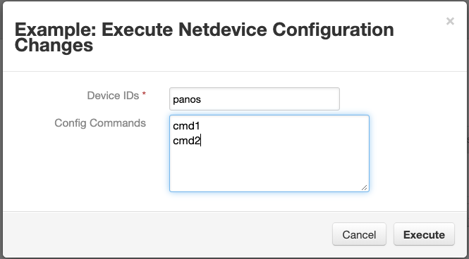
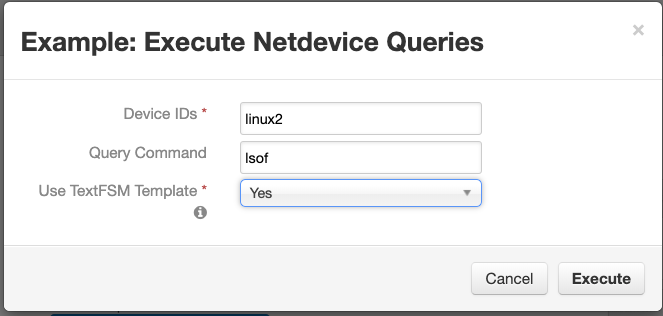

<!--
  This README.md is generated by running:
  "resilient-sdk docgen -p fn_netdevice"

  It is best edited using a Text Editor with a Markdown Previewer. VS Code
  is a good example. Checkout https://guides.github.com/features/mastering-markdown/
  for tips on writing with Markdown

  If you make manual edits and run docgen again, a .bak file will be created

  Store any screenshots in the "doc/screenshots" directory and reference them like:
  

  NOTE: If your app is available in the container-format only, there is no need to mention the integration server in this readme.
-->

# netMiko for SOAR

## Table of Contents
- [Release Notes](#release-notes)
- [Overview](#overview)
  - [Key Features](#key-features)
- [Requirements](#requirements)
  - [Resilient platform](#resilient-platform)
  - [Cloud Pak for Security](#cloud-pak-for-security)
  - [Proxy Server](#proxy-server)
  - [Python Environment](#python-environment)
- [Installation](#installation)
  - [Install](#install)
  - [App Configuration](#app-configuration)
- [Function - fn_netdevice_config](#function---fn_netdevice_config)
- [Function - fn_netdevice_query](#function---fn_netdevice_query)
- [Rules](#rules)
- [Troubleshooting & Support](#troubleshooting--support)
---

## Release Notes
<!--
  Specify all changes in this release. Do not remove the release 
  notes of a previous release
-->
| Version | Date | Notes |
| ------- | ---- | ----- |
| 1.0.0 | 06/2019 | Initial Release |
| 1.1.0 | 10/2021 | Add App Host Support |

---

## Overview
<!--
  Provide a high-level description of the function itself and its remote software or application.
  The text below is parsed from the "description" and "long_description" attributes in the setup.py file
-->
**Resilient Circuits Components for 'fn_netdevice'**


This integration uses netMiko to access network devices, such as firewalls, to run command-line queries and execute firewall configuration settings. SSH is used to access the hosts and results from the operations are returned as a Resilient incident note. 
        
For more information on netMiko, refer to the documentation [here](https://netmiko.readthedocs.io/en/latest/)

    

### Key Features
<!--
  List the Key Features of the Integration
-->
This implementation utilizes all the functionality of netMiko including:

* Multiple host execution
* Configuration setting execution with commits
* Result parsing using TextFSM templates

---

## Requirements
<!--
  List any Requirements 
-->
* resilient_circuits>=30.0.0
<br>
* resilient-lib
<br>
* netmiko>=2.3.3
<br>
This app supports the IBM Resilient SOAR Platform and the IBM Cloud Pak for Security.

### Resilient platform
The Resilient platform supports two app deployment mechanisms, App Host and integration server.

If deploying to a Resilient platform with an App Host, the requirements are:
* Resilient platform >= `40.0.6554`.
* The app is in a container-based format (available from the AppExchange as a `zip` file).

If deploying to a Resilient platform with an integration server, the requirements are:
* Resilient platform >= `40.0.6554`.
* The app is in the older integration format (available from the AppExchange as a `zip` file which contains a `tar.gz` file).
* Integration server is running `resilient_circuits>=30.0.0`.
* If using an API key account, make sure the account provides the following minimum permissions: 
  | Name | Permissions |
  | ---- | ----------- |
  | Org Data | Read |
  | Function | Read |

The following Resilient platform guides provide additional information: 
* _App Host Deployment Guide_: provides installation, configuration, and troubleshooting information, including proxy server settings. 
* _Integration Server Guide_: provides installation, configuration, and troubleshooting information, including proxy server settings.
* _System Administrator Guide_: provides the procedure to install, configure and deploy apps. 

The above guides are available on the IBM Knowledge Center at [ibm.biz/resilient-docs](https://ibm.biz/resilient-docs). On this web page, select your Resilient platform version. On the follow-on page, you can find the _App Host Deployment Guide_ or _Integration Server Guide_ by expanding **Resilient Apps** in the Table of Contents pane. The System Administrator Guide is available by expanding **System Administrator**.

### Cloud Pak for Security
If you are deploying to IBM Cloud Pak for Security, the requirements are:
* IBM Cloud Pak for Security >= 1.4.
* Cloud Pak is configured with an App Host.
* The app is in a container-based format (available from the AppExchange as a `zip` file).

The following Cloud Pak guides provide additional information: 
* _App Host Deployment Guide_: provides installation, configuration, and troubleshooting information, including proxy server settings. From the Table of Contents, select Case Management and Orchestration & Automation > **Orchestration and Automation Apps**.
* _System Administrator Guide_: provides information to install, configure, and deploy apps. From the IBM Cloud Pak for Security Knowledge Center table of contents, select Case Management and Orchestration & Automation > **System administrator**.

These guides are available on the IBM Knowledge Center at [ibm.biz/cp4s-docs](https://ibm.biz/cp4s-docs). From this web page, select your IBM Cloud Pak for Security version. From the version-specific Knowledge Center page, select Case Management and Orchestration & Automation.

### Proxy Server
The app does support a proxy server.

### Python Environment
Only Python 3.6 is supported.
Additional package dependencies may exist for each of these packages:
* netmiko>=2.3.3
* resilient-lib
* resilient_circuits>=30.0.0

---

## Installation

### Install
* To install or uninstall an App or Integration on the _Resilient platform_, see the documentation at [ibm.biz/resilient-docs](https://ibm.biz/resilient-docs).
* To install or uninstall an App on _IBM Cloud Pak for Security_, see the documentation at [ibm.biz/cp4s-docs](https://ibm.biz/cp4s-docs) and follow the instructions above to navigate to Orchestration and Automation.

### App Configuration
The following table provides the settings you need to configure the app. These settings are made in the app.config file. See the documentation discussed in the Requirements section for the procedure.

| Config | Required | Example | Description |
| ------ | :------: | ------- | ----------- |
| **selftest** | Yes | `` | The section name used below for selftest |
| **template_dir** | No | `` | Specify directory if using textFSM templates|
| **device_type** | Yes | linux| https://github.com/ktbyers/netmiko/blob/master/netmiko/ssh_dispatcher.py|
| **ip** | Yes | `` | |
| **username** | Yes | `` | |
| **password** | Yes | `` | |
| **port** | Yes | 22 | |
| **secret** | No | `` | |
| **verbose** | Yes | False | |
| **use_commit** | Yes | False | |


---

## Function - fn_netdevice_config
Use netMiko to attach to devices (such as firewalls) for command line configuration



<details><summary>Inputs:</summary>
<p>

| Name | Type | Required | Example | Tooltip |
| ---- | :--: | :------: | ------- | ------- |
| `netdevice_config_cmd` | `text` | No | `-` | separate multi-line input with commas |
| `netdevice_ids` | `text` | Yes | `-` | Specify device names with commas |

</p>
</details>

<details><summary>Outputs:</summary>
<p>

```python
results = {
    'version': '1.0', 'success': True, 'reason': None, 'content': {'netdevice1': {'config_command': 'ls\npwd', 'config_result': 'ls\nanaconda-ks.cfg\n[root@netdevice1 ~]# pwd\n/root\n[root@netdevice1 ~]# ', 'status': 'success'}}, 'raw': '{"netdevice1": {"config_command": "ls\\npwd", "config_result": "ls\\nanaconda-ks.cfg\\n[root@netdevice1 ~]# pwd\\n/root\\n[root@netdevice1 ~]# ", "status": "success"}}', 'inputs': {'netdevice_ids': 'netdevice1', 'netdevice_config_cmd': 'ls\npwd'}, 'metrics': {'version': '1.0', 'package': 'fn-netdevice', 'package_version': '1.1.0', 'host': 'Christophers-MacBook-Pro.local', 'execution_time_ms': 11954, 'timestamp': '2021-10-13 12:31:23'}
}
```

</p>
</details>

<details><summary>Example Pre-Process Script:</summary>
<p>

```python
inputs.netdevice_config_cmd = rule.properties.config_commands.content
inputs.netdevice_ids = rule.properties.device_ids

```

</p>
</details>

<details><summary>Example Post-Process Script:</summary>
<p>

```python
import re

pp = '(\\x1b\[\w*\d*(;\d*)*m)'

note = u""
for host in results['content']:
  note = note + u"Host: {}\n".format(host)
  note = note + u"Config Cmd: {}\nResult: {}\n".format(results['content'][host]['config_command'], re.sub(pp, '', results['content'][host].get('config_result', '')))
  
  if results['content'][host]['status'] == 'failure':
    note = note + u"Failure: {}\n".format(results['content'][host]['reason'])
    
  note = note + "\n"
    
note_text = helper.createPlainText(note)
incident.addNote(note_text)
```

</p>
</details>

---
## Function - fn_netdevice_query
Use netMiko to attach to devices (such as firewalls) for command line querying

 

<details><summary>Inputs:</summary>
<p>

| Name | Type | Required | Example | Tooltip |
| ---- | :--: | :------: | ------- | ------- |
| `netdevice_ids` | `text` | Yes | `-` | Specify device names with commas |
| `netdevice_send_cmd` | `text` | No | `-` | Specify a command to execute on remote device |
| `netdevice_use_textfsm` | `boolean` | Yes | `-` | Return results based on a textFSM template  |

</p>
</details>

<details><summary>Outputs:</summary>
<p>

```python
results = {
   'version': '1.0', 'success': True, 'reason': None, 'content': {'netdevice1': {'send_command': 'ls', 'send_result': 'anaconda-ks.cfg', 'status': 'success'}}, 'raw': '{"netdevice1": {"send_command": "ls", "send_result": "anaconda-ks.cfg", "status": "success"}}', 'inputs': {'netdevice_ids': 'netdevice1', 'netdevice_use_textfsm': False, 'netdevice_send_cmd': 'ls'}, 'metrics': {'version': '1.0', 'package': 'fn-netdevice', 'package_version': '1.1.0', 'host': 'Christophers-MacBook-Pro.local', 'execution_time_ms': 13474, 'timestamp': '2021-10-13 12:29:57'}
}
```

</p>
</details>

<details><summary>Example Pre-Process Script:</summary>
<p>

```python
inputs.netdevice_ids = rule.properties.device_ids
inputs.netdevice_send_cmd = rule.properties.send_command
inputs.netdevice_use_textfsm = rule.properties.use_textfsm_template
```

</p>
</details>

<details><summary>Example Post-Process Script:</summary>
<p>

```python
import re

pp = '(\\x1b\[\w*\d*(;\d*)*m)'

note = u""
for host in results['content']:
  note = note + u"Host: {}\n".format(host)
  if results['content'][host].get('send_result') and isinstance(results['content'][host]['send_result'], list):
    note = note + u"Cmd: {}\nResult: {}\n".format(results['content'][host]['send_command'], results['content'][host]['send_result'])
  else:
    note = note + u"Cmd: {}\nResult: {}\n".format(results['content'][host]['send_command'], re.sub(pp, '', results['content'][host].get('send_result', '')))
  
  if results['content'][host]['status'] == 'failure':
    note = note + u"Failure: {}\n".format(results['content'][host]['reason'])
    
  note = note + "\n"
    
note_text = helper.createPlainText(note)
incident.addNote(note_text)
```

</p>
</details>

---


## Rules
| Rule Name | Object | Workflow Triggered |
| --------- | ------ | ------------------ |
| Example: Execute Netdevice Configuration Changes | incident | `example_execute_netdevice_configuration_commands` |
| Example: Execute Netdevice Queries | incident | `example_execute_netdevice_command` |

---

## Troubleshooting & Support
Refer to the documentation listed in the Requirements section for troubleshooting information.

### For Support
This is a IBM Community provided App. Please search the Community https://ibm.biz/resilientcommunity for assistance.
