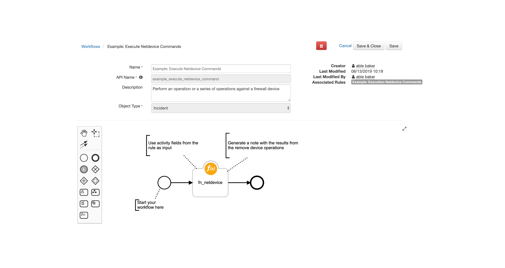
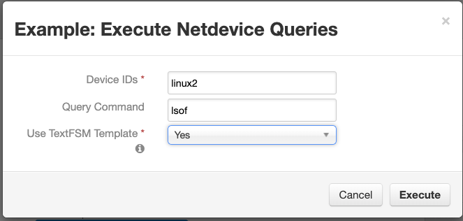
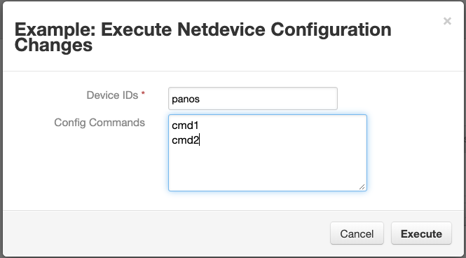
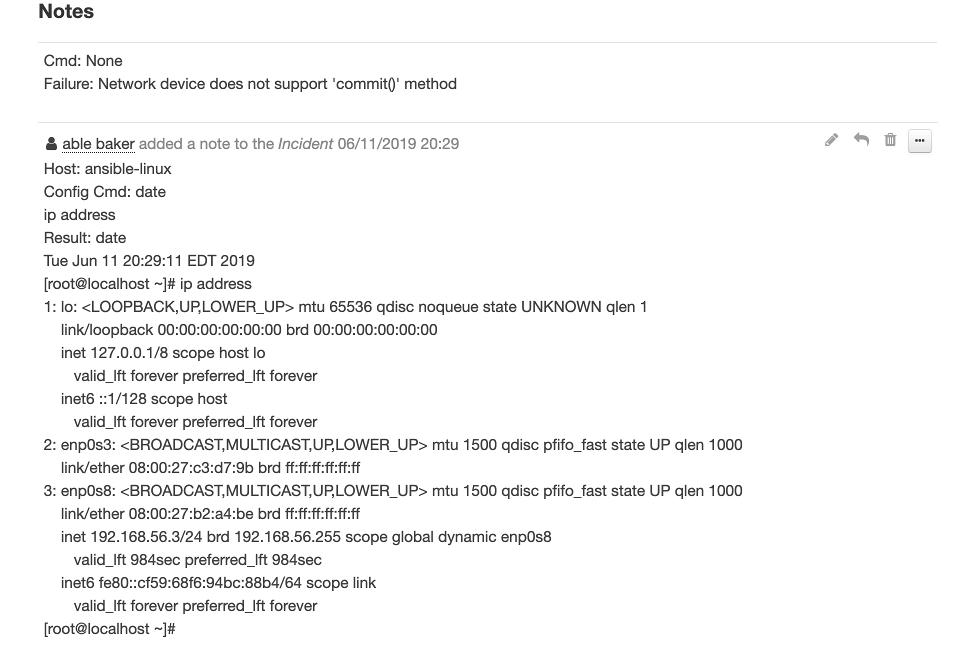

# Overview
This integration uses netMiko to access network devices, such as firewalls, to run command-line queries
and execute firewall configuration settings. SSH is used to access the hosts and results from the operations are returned as a Resilient incident note.

This implementation utilizes all the functionality of netMiko including:

* Multiple host execution
* Configuration setting execution with commits
* Result parsing using TextFSM templates

For more information on netMiko, refer to the documentation [here](https://netmiko.readthedocs.io/en/latest/)

# Components
* Message Destination: fn_netdevice
* Functions: 
  * fn_netdevice_query, 
  * fn_netdevice_config
* Workflow: 
  * Example: Execute Netdevice Commands, 
  * Example: Execute Netdevice Configuration Commands
* Rule: Example: 
  * Execute Netdevice Commands, 
  * Example: Execute Netdevice Configuration Changes


# Installation
To install, unzip the downloaded file from the App Exchange, using the `unzip` command.

Run `[sudo] pip install fn_netdevice-<version>.tar.gz` to add the package to your python libraries

Run `resilient-circuits customize -l fn-netdevice` to add the Resilient components (rules, workflows, functions, etc.)

Run `resilient-circuits codegen -u -l fn-netdevice` to add configuration data to your app.config file. 

These sections are added:

```
[fn_netdevice]
# identify the section names below for selftest, separated by commas
selftest=
# specify the directory if using textFSM templates
#template_dir=

# for each network device to communicate with, define it's section below to match the device_ids field in the function input parameter
#[unique_device_name]
#device_type=<see devices defined here https://github.com/ktbyers/netmiko/blob/master/netmiko/ssh_dispatcher.py>
#ip=
#username=
#password=
#port=22
#secret=<leave commented for default of no secret>
#verbose=False
#use_commit=False
```

Copy, uncomment, rename and configure each [unique_device_name] section one per each device you'll be accessing. Passwords can be stored in your keystore using the ^password convention as documented in the [Integration Server Guide](https://github.com/ibmresilient/resilient-reference/blob/master/developer_guides/Integration%20Server%20Guide.pdf).

After installation, the package will be loaded and ready for execution by invoking `resilient-circuits run`.

To uninstall, run `[sudo] pip uninstall fn-netdevice`

## Self Test

A self test feature exists to ensure connectivity to your network devices is verified. Configure the app.config file with your function settings and devices, and reference your network device sections using the `sefttest=` parameter. From a command line, type `resilient-circuits selftest -l fn-netdevice` which attempts to connect to each network devices. The resulting output will display the overall success or failure of the test.

```
$ resilient-circuits selftest -l fn-netdevice
fn-netdevice: 
SSH connection established to 192.168.56.3:22
Interactive SSH session established
SSH connection established to 192.168.56.4:22
Interactive SSH session established
	selftest: success, Elapsed time: 8.000000 seconds
```

# Function Execution
Two functions are available for performing queries and executing configuration changes.

## Netdevice Queries

When running the sample rule and workflow, a dialog is presented to enter:

* Devices IDs (comma separated)
* Query Command
* Use TextFSM Templates
  - Note: Specify the template directory using the app.config setting `template_dir` when setting this value to `Yes`


## Netdevice Configuration Changes

When running the sample rule and workflow, a dialog is presented to enter:

- Devices IDs (comma separated)
- Configuration Commands 
  - specify mutiple commands on separate lines



## Considerations

In a production environment, it may be practial to use selection lists for the Device IDs and query commands to simplify device selection and limit the commands which can be invoked.  The Rule Activity fields can be configured with these settings under Customization Settings.  

# Result Payload

## Netdevice Query

The payload returned from a query will return similar to the following example. Each host accessed is listed under the 'content' json element.
Reference the `send_command`and `send_results`in your Workflow Post-Process Script. When using `Use TextFSM`, the `send_results` data will reflect the results returned from your matching template in son format.

```
{
  'version': '1.0',
  'success': True,
  'reason': None,
  'content': {
    'ansible-linux': {
      'send_command': 'date',
      'send_result': 'Tue Jun 11 20:43:37 EDT 2019',
      'status': 'success'
    }
  },
  'raw': '{"ansible-linux": {"send_command": "date", "send_result": "Tue Jun 11 20:43:37 EDT 2019", "status": "success"}}',
  'inputs': {
    'netdevice_ids': 'ansible-linux',
    'netdevice_send_cmd': 'date'
  },
  'metrics': {
    'version': '1.0',
    'package': 'fn-netdevice',
    'package_version': '1.0.0',
    'host': 'Marks-MBP.fios-router.home',
    'execution_time_ms': 7137,
    'timestamp': '2019-06-11 20:43:48'
  }
}
```



## Netdevice Configuration

The payload returned from a query will return similar to the following example. Each host accessed is listed under 'content'.
Reference the  `config_command` and `config_results` in your Workflow Post-Process Script. 

```
{
  'version': '1.0',
  'success': True,
  'reason': None,
  'content': {
    'ansible-linux': {
      'config_command': 'ip address\nnetstat',
      'config_result': 'ip address\n1: lo: <LOOPBACK,UP,LOWER_UP> mtu 65536 qdisc noqueue state UNKNOWN qlen 1\n    link/loopback 00:00:00:00:00:00 brd 00:00:00:00:00:00\n    inet 127.0.0.1/8 scope host lo\n       valid_lft forever preferred_lft forever\n    inet6 ::1/128 scope host \n       valid_lft forever preferred_lft forever\n2: enp0s3: <BROADCAST,MULTICAST,UP,LOWER_UP> mtu 1500 qdisc pfifo_fast state UP qlen 1000\n    link/ether 08:00:27:c3:d7:9b brd ff:ff:ff:ff:ff:ff\n3: enp0s8: <BROADCAST,MULTICAST,UP,LOWER_UP> mtu 1500 qdisc pfifo_fast state UP qlen 1000\n    link/ether 08:00:27:b2:a4:be brd ff:ff:ff:ff:ff:ff\n    inet 192.168.56.3/24 brd 192.168.56.255 scope global dynamic enp0s8\n       valid_lft 1187sec preferred_lft 1187sec\n    inet6 fe80::cf59:68f6:94bc:88b4/64 scope link \n       valid_lft forever preferred_lft forever\n[root@localhost ~]# netstat\n-bash: netstat: command not found\n[root@localhost ~]# ',
      'status': 'success'
    }
  },
  'raw': '{"ansible-linux": {"config_command": "ip address\\nnetstat", "config_result": "ip address\\n1: lo: <LOOPBACK,UP,LOWER_UP> mtu 65536 qdisc noqueue state UNKNOWN qlen 1\\n    link/loopback 00:00:00:00:00:00 brd 00:00:00:00:00:00\\n    inet 127.0.0.1/8 scope host lo\\n       valid_lft forever preferred_lft forever\\n    inet6 ::1/128 scope host \\n       valid_lft forever preferred_lft forever\\n2: enp0s3: <BROADCAST,MULTICAST,UP,LOWER_UP> mtu 1500 qdisc pfifo_fast state UP qlen 1000\\n    link/ether 08:00:27:c3:d7:9b brd ff:ff:ff:ff:ff:ff\\n3: enp0s8: <BROADCAST,MULTICAST,UP,LOWER_UP> mtu 1500 qdisc pfifo_fast state UP qlen 1000\\n    link/ether 08:00:27:b2:a4:be brd ff:ff:ff:ff:ff:ff\\n    inet 192.168.56.3/24 brd 192.168.56.255 scope global dynamic enp0s8\\n       valid_lft 1187sec preferred_lft 1187sec\\n    inet6 fe80::cf59:68f6:94bc:88b4/64 scope link \\n       valid_lft forever preferred_lft forever\\n[root@localhost ~]# netstat\\n-bash: netstat: command not found\\n[root@localhost ~]# ", "status": "success"}}',
  'inputs': {
    'netdevice_ids': 'ansible-linux',
    'netdevice_config_cmd': 'ip address\nnetstat'
  },
  'metrics': {
    'version': '1.0',
    'package': 'fn-netdevice',
    'package_version': '1.0.0',
    'host': 'Marks-MBP.fios-router.home',
    'execution_time_ms': 7137,
    'timestamp': '2019-06-11 20:43:48'
  }
}
```

# 

# Development

This template project was generated by

    resilient-circuits codegen -p fn_netdevice -m fn_netdevice --rule 'Example: Execute Netdevice Configuration Changes' 'Example: Execute Netdevice Queries'

To package for distribution,

    python ./fn_netdevice/setup.py sdist
