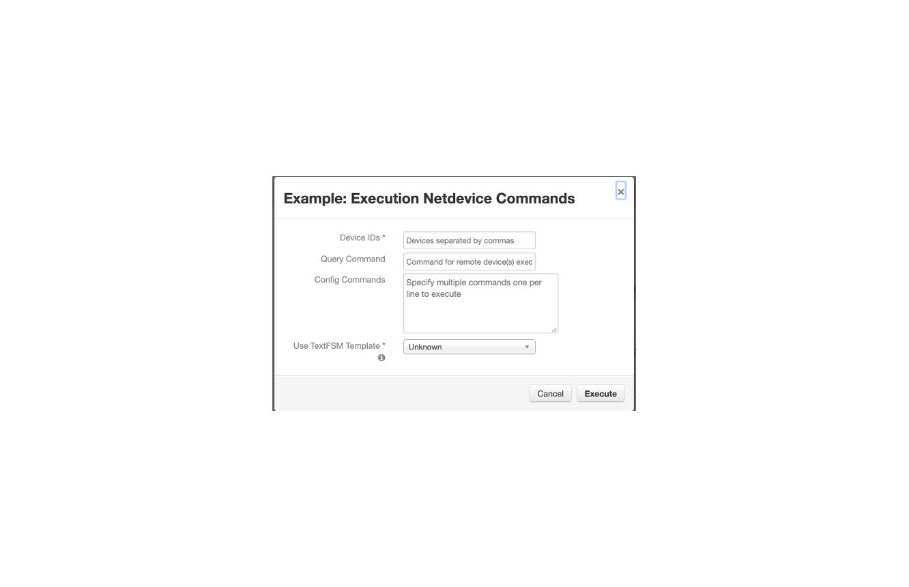

# Overview
This integration uses netMiko to access network devices, such as firewalls, to run command-line queries
and execute firewall configuration settings. SSH is used to access the hosts and results from the operations are returned as an Resilient incident note.

This implementation utilizes all the functionality of netMiko including:

* Multiple host execution
* Configuration setting execution with commits
* TextFSM enablement

# Components
Function: fn_netdevice
Message Destination: fn_netdevice
Workflow: Example: Execute Netdevice Commands
Rule: Example: Execute Netdevice Commands


# Installation
To install, unzip the downloaded file from the App Exchange.

Run `[sudo] pip install fn_netdevice-<version>.tar.gz` to add the package to your python libraries

Run `resilient-circuits customize -l fn-netdevice` to add the Resilient components (rules, workflows, functions, etc.)

Run `resilient-circuits codegen -u -l fn-netdevice` to add configuration data to your app.config file. These sections added are:
```
[fn_netdevice]
# specify the directory if using textFSM templates
#template_dir=

# for each network device to communicate with, define it's section below to match the device_ids field in the function input parameter
#[device_id]
#device_type=<see devices defined here https://github.com/ktbyers/netmiko/blob/master/netmiko/ssh_dispatcher.py>
#ip=
#username=
#password=
#port=22
#secret=<leave commented for default of no secret>
#verbose=False
#use_commit=False
```

Copy, uncomment, rename and configuration each [device_id] section one per each device you'll be accessing. Passwords can be stored in your
keystore using the $password convention as documented in the [Function Developer's Guide](https://github.com/ibmresilient/resilient-reference/blob/master/developer_guides/Resilient%20IRP%20Function%20Developer%20Guide.pdf)

After installation, the package will be loaded and ready for execution by `resilient-circuits run`.

# Function Execution
When running the sample rule and workflow, a dialog is presented to enter:

* Devices IDs (comma separated)
* Query Command (optional)
* Configuration Commands (optional, but specify either one or both prompts)
* Use TextFSM Templates (associated with Query Commands)


# Result Payload
The payload returned from a query will return similar to the following example. Each host accessed is listed under 'content'.

```
{
  'version': '1.0',
  'success': True,
  'reason': None,
  'content': {
    'ansible-linux': {
      'send_command': 'date',
      'send_result': 'Tue Jun 11 20:43:37 EDT 2019',
      'config_command': 'ip address\nnetstat',
      'config_result': 'ip address\n1: lo: <LOOPBACK,UP,LOWER_UP> mtu 65536 qdisc noqueue state UNKNOWN qlen 1\n    link/loopback 00:00:00:00:00:00 brd 00:00:00:00:00:00\n    inet 127.0.0.1/8 scope host lo\n       valid_lft forever preferred_lft forever\n    inet6 ::1/128 scope host \n       valid_lft forever preferred_lft forever\n2: enp0s3: <BROADCAST,MULTICAST,UP,LOWER_UP> mtu 1500 qdisc pfifo_fast state UP qlen 1000\n    link/ether 08:00:27:c3:d7:9b brd ff:ff:ff:ff:ff:ff\n3: enp0s8: <BROADCAST,MULTICAST,UP,LOWER_UP> mtu 1500 qdisc pfifo_fast state UP qlen 1000\n    link/ether 08:00:27:b2:a4:be brd ff:ff:ff:ff:ff:ff\n    inet 192.168.56.3/24 brd 192.168.56.255 scope global dynamic enp0s8\n       valid_lft 1187sec preferred_lft 1187sec\n    inet6 fe80::cf59:68f6:94bc:88b4/64 scope link \n       valid_lft forever preferred_lft forever\n[root@localhost ~]# netstat\n-bash: netstat: command not found\n[root@localhost ~]# ',
      'status': 'success'
    }
  },
  'raw': '{"ansible-linux": {"send_command": "date", "send_result": "Tue Jun 11 20:43:37 EDT 2019", "config_command": "ip address\\nnetstat", "config_result": "ip address\\n1: lo: <LOOPBACK,UP,LOWER_UP> mtu 65536 qdisc noqueue state UNKNOWN qlen 1\\n    link/loopback 00:00:00:00:00:00 brd 00:00:00:00:00:00\\n    inet 127.0.0.1/8 scope host lo\\n       valid_lft forever preferred_lft forever\\n    inet6 ::1/128 scope host \\n       valid_lft forever preferred_lft forever\\n2: enp0s3: <BROADCAST,MULTICAST,UP,LOWER_UP> mtu 1500 qdisc pfifo_fast state UP qlen 1000\\n    link/ether 08:00:27:c3:d7:9b brd ff:ff:ff:ff:ff:ff\\n3: enp0s8: <BROADCAST,MULTICAST,UP,LOWER_UP> mtu 1500 qdisc pfifo_fast state UP qlen 1000\\n    link/ether 08:00:27:b2:a4:be brd ff:ff:ff:ff:ff:ff\\n    inet 192.168.56.3/24 brd 192.168.56.255 scope global dynamic enp0s8\\n       valid_lft 1187sec preferred_lft 1187sec\\n    inet6 fe80::cf59:68f6:94bc:88b4/64 scope link \\n       valid_lft forever preferred_lft forever\\n[root@localhost ~]# netstat\\n-bash: netstat: command not found\\n[root@localhost ~]# ", "status": "success"}}',
  'inputs': {
    'netdevice_ids': 'ansible-linux',
    'netdevice_config_cmd': 'ip address\nnetstat',
    'netdevice_send_cmd': 'date'
  },
  'metrics': {
    'version': '1.0',
    'package': 'fn-netdevice',
    'package_version': '1.0.0',
    'host': 'Marks-MBP.fios-router.home',
    'execution_time_ms': 7137,
    'timestamp': '2019-06-11 20:43:48'
  }
}
```


# Uninstall
To uninstall,

    pip uninstall fn-netdevice

# Development
This template project was generated by

    resilient-circuits codegen -p fn_netdevice [-f fn_netdevice] [-w example_execute_netdevice_command]

To package for distribution,

    python ./fn_netdevice/setup.py sdist
