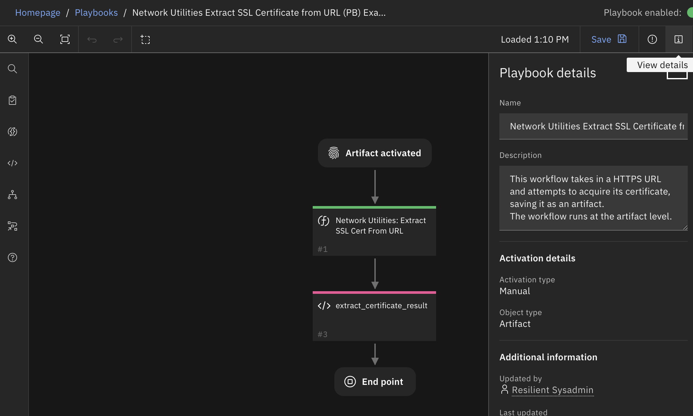

<!--
  This README.md is generated by running:
  "resilient-sdk docgen -p fn_network_utilities"

  It is best edited using a Text Editor with a Markdown Previewer. VS Code
  is a good example. Checkout https://guides.github.com/features/mastering-markdown/
  for tips on writing with Markdown

  All fields followed by "::CHANGE_ME::"" should be manually edited

  If you make manual edits and run docgen again, a .bak file will be created

  Store any screenshots in the "doc/screenshots" directory and reference them like:
  

  NOTE: If your app is available in the container-format only, there is no need to mention the integration server in this readme.
-->

# Network Utilities Function for SOAR

## Table of Contents
- [Release Notes](#release-notes)
- [Overview](#overview)
  - [Key Features](#key-features)
- [Requirements](#requirements)
  - [SOAR platform](#soar-platform)
  - [Cloud Pak for Security](#cloud-pak-for-security)
  - [Proxy Server](#proxy-server)
  - [Python Environment](#python-environment)
- [Installation](#installation)
  - [Install](#install)
  - [App Configuration](#app-configuration)
- [Function - Network Utilities: Domain Distance](#function---network-utilities-domain-distance)
- [Function - Network Utilities: Expand URL](#function---network-utilities-expand-url)
- [Function - Network Utilities: Extract SSL Cert From URL](#function---network-utilities-extract-ssl-cert-from-url)
- [Function - Network Utilities: Linux Shell Command](#function---network-utilities-linux-shell-command)
- [Function - Network Utilities: Local Shell Command](#function---network-utilities-local-shell-command)
- [Function - Network Utilities: Windows Shell Command](#function---network-utilities-windows-shell-command)
- [Troubleshooting & Support](#troubleshooting--support)

---

## Release Notes
<!--
  Specify all changes in this release. Do not remove the release 
  notes of a previous release
-->
| Version | Date | Notes |
| ------- | ---- | ----- |
| 1.0.0 | 02/2023 | Initial Release |
| 1.0.1 | 3/2023 | Add a timeout option for Linux shell command |

---

## Overview
<!--
  Provide a high-level description of the function itself and its remote software or application.
  The text below is parsed from the "description" and "long_description" attributes in the setup.py file
-->
**Useful network related workflow/playbook functions for common automation and integration activities in the SOAR platform.**

 

This app contains useful functions that allows your workflows/playbooks to execute shell-scripts remotely and locally,

     gain information about URLs, and extract SSL certificates from URLs.

### Key Features
<!--
  List the Key Features of the Integration
-->
* Run shell commands remotely and locally via SOAR
* Gain information about URLs
* Extract the SSL certificate from a URL

---

## Requirements
<!--
  List any Requirements 
--> 

This app supports the IBM Security QRadar SOAR Platform and the IBM Security QRadar SOAR for IBM Cloud Pak for Security.

### SOAR platform
The SOAR platform supports two app deployment mechanisms, Edge Gateway (formerly App Host) and integration server.

If deploying to a SOAR platform with an Edge Gateway, the requirements are:
* SOAR platform >= `45.0.7899`.
* The app is in a container-based format (available from the AppExchange as a `zip` file).

If deploying to a SOAR platform with an integration server, the requirements are:
* SOAR platform >= `45.0.7899`.
* The app is in the older integration format (available from the AppExchange as a `zip` file which contains a `tar.gz` file).
* Integration server is running `resilient-circuits>=47.0.0`.
* If using an API key account, make sure the account provides the following minimum permissions: 
  | Name | Permissions |
  | ---- | ----------- |
  | Org Data | Read |
  | Function | Read |

The following SOAR platform guides provide additional information: 
* _Edge Gateway Deployment Guide_ or _App Host Deployment Guide_: provides installation, configuration, and troubleshooting information, including proxy server settings. 
* _Integration Server Guide_: provides installation, configuration, and troubleshooting information, including proxy server settings.
* _System Administrator Guide_: provides the procedure to install, configure and deploy apps. 

The above guides are available on the IBM Documentation website at [ibm.biz/soar-docs](https://ibm.biz/soar-docs). On this web page, select your SOAR platform version. On the follow-on page, you can find the _Edge Gateway Deployment Guide_, _App Host Deployment Guide_, or _Integration Server Guide_ by expanding **Apps** in the Table of Contents pane. The System Administrator Guide is available by expanding **System Administrator**.

### Cloud Pak for Security
If you are deploying to IBM Cloud Pak for Security, the requirements are:
* IBM Cloud Pak for Security >= `1.9`.
* Cloud Pak is configured with an Edge Gateway.
* The app is in a container-based format (available from the AppExchange as a `zip` file).

The following Cloud Pak guides provide additional information: 
* _Edge Gateway Deployment Guide_ or _App Host Deployment Guide_: provides installation, configuration, and troubleshooting information, including proxy server settings. From the Table of Contents, select Case Management and Orchestration & Automation > **Orchestration and Automation Apps**.
* _System Administrator Guide_: provides information to install, configure, and deploy apps. From the IBM Cloud Pak for Security IBM Documentation table of contents, select Case Management and Orchestration & Automation > **System administrator**.

These guides are available on the IBM Documentation website at [ibm.biz/cp4s-docs](https://ibm.biz/cp4s-docs). From this web page, select your IBM Cloud Pak for Security version. From the version-specific IBM Documentation page, select Case Management and Orchestration & Automation.

### Proxy Server
The app does support a proxy server.

### Python Environment
Python 3.6 and Python 3.9 are supported.
Additional package dependencies may exist for each of these packages:
* chardet==4.0.0
* cryptography~=39.0
* paramiko~=2.10
* pyOpenSSL~=23.0
* pywinrm~=0.4
* resilient-circuits>=47.0.0


---

## Installation

### Install
* To install or uninstall an App or Integration on the _SOAR platform_, see the documentation at [ibm.biz/soar-docs](https://ibm.biz/soar-docs).
* To install or uninstall an App on _IBM Cloud Pak for Security_, see the documentation at [ibm.biz/cp4s-docs](https://ibm.biz/cp4s-docs) and follow the instructions above to navigate to Orchestration and Automation.

### App Configuration
The following table provides the settings you need to configure the app. These settings are made in the app.config file. See the documentation discussed in the Requirements section for the procedure.

| Config | Required | Example | Description |
| ------ | :------: | ------- | ----------- |
| **dig** | Yes | `dig "{{shell_param1}}"` | -- |
| **nslookup** | Yes | `nslookup "{{shell_param1}}"` | -- |
| **remote_auth_transport** | Yes | `ntlm` | remote auth transport one of [ntlm, basic] |
| **remote_command_linux** | Yes | `bash command or path to bash script` | -- |
| **remote_command_powershell** | Yes | `powershell command or path to powershell script` | -- |
| **remote_computer** | Yes | `username:password@server` | -- |
| **remote_powershell_extensions** | Yes | `ps1, psm1, etc` | accepted remote powershell extensions in a comma separated list |
| **shell_escaping** | Yes | `sh` | -- |
| **traceroute** | Yes | `traceroute -m 15 "{{shell_param1}}"` | -- |
| **whois** | Yes | `whois "{{shell_param1}}"` | -- |
| **timeout_linux** | no | `20` | time in seconds to timeout, default is 20 seconds |

Important to Note: Linux Shell Command, Windows Shell Command, and Local Shell Command come from Utility Functions for SOAR's Shell Command function. In that version, `remote_computer` was required to be wrapped in parantheses (). This is no longer the case, but is still accepted for backwards compatibility. Additionally, `remote_command_linux` and `remote_command_powershell` were required to be wrapped in parantheses () and brackets [], respectively. Again, this is no longer the case, but is still accepted for backwards compatibility.


---
## Function - Network Utilities: Domain Distance
Identifies similarity between a suspicious domain name and a list of valid domain names.  Low distance result indicates a possible spoof attempt.

 

<details><summary>Inputs:</summary>
<p>

| Name | Type | Required | Example | Tooltip |
| ---- | :--: | :------: | ------- | ------- |
| `network_utilities_domain_list` | `text` | No | `-` | - |
| `network_utilities_domain_name` | `text` | No | `-` | - |

</p>
</details>

<details><summary>Outputs:</summary>
<p>

> **NOTE:** This example might be in JSON format, but `results` is a Python Dictionary on the SOAR platform.

```python
results = {
  "closest": {
    "distance": 1,
    "name": "ibm.com"
  },
  "distances": {
    "bluemix.com": 5,
    "ibm.com": 1,
    "ibmcloud.com": 6,
    "resilientsystems.com": 14
  },
  "domain_name": "1bm.com"
}
```

</p>
</details>

<details><summary>Example Pre-Process Script:</summary>
<p>

```python
# if email address, return only domain portion
if "email" in artifact.type.lower():
  split_email = artifact.value.split("@")
  if len(split_email) > 1:
    inputs.network_utilities_domain_name = split_email[1]
  else:
    inputs.network_utilities_domain_name = artifact.value
else:
  # The domain name being tested
  inputs.network_utilities_domain_name = artifact.value

# The list of domains to test against
inputs.network_utilities_domain_list = "ibm.com, resilientsystems.com, ibmcloud.com, bluemix.com"
```

</p>
</details>

<details><summary>Example Post-Process Script:</summary>
<p>

```python
# The result includes:
#   "domain_name" - the name being tested
#   "distances" - a dicctionary of all the distances
#   "closest" - the closest match from the list.
# If the match distance is only 1 or 0, the domain name is very easily confused with one on the list!

if results.closest.get("distance") <= 1:
  html = u"<div>Warning!  Domain {} is easily confused with {}!</div>".format(results.get("domain_name"), results.closest.get("name"))
  incident.addNote(helper.createRichText(html))

```

</p>
</details>

---
## Function - Network Utilities: Expand URL
Takes a URL (mostly shortened) and follows it through redirects as it expands. The results include each URL, which are added to a new artifact.

 

<details><summary>Inputs:</summary>
<p>

| Name | Type | Required | Example | Tooltip |
| ---- | :--: | :------: | ------- | ------- |
| `network_utilities_resilient_url` | `text` | No | `-` | - |

</p>
</details>

<details><summary>Outputs:</summary>
<p>

> **NOTE:** This example might be in JSON format, but `results` is a Python Dictionary on the SOAR platform.

```python
results = {
  "urllist": [
    "https://www.ibm.com/"
  ]
}
```

</p>
</details>

<details><summary>Example Pre-Process Script:</summary>
<p>

```python
inputs.network_utilities_resilient_url = artifact.value
```

</p>
</details>

<details><summary>Example Post-Process Script:</summary>
<p>

```python
# Results: {'urllist': ['https://community.ibm.com/community/user/security/communities/community-home?CommunityKey=d2f71e8c-108e-4652-b59c-29d61af7163e', 'https://community.ibm.com/community/user/security/communities/community-home']}

# Add the url expansions to the Artifact Description
expansions = results.get("urllist", [])
expansion_list = u"Expansions:\n\n{0}".format("\n\n".join(expansions)) if expansions else "No Expansions"

if artifact.description:
  artifact.description = "{}\n\n{}".format(artifact.description.content, expansion_list)
else:
  artifact.description = expansion_list
  
for url in expansions:
  incident.addArtifact("URL", url, u"expansion from {}".format(artifact.value))

```

</p>
</details>

---
## Function - Network Utilities: Extract SSL Cert From URL
This function takes in a HTTPS URL or DNS input, establishes a connection and then attempts to acquire the SSL certificate. If successful, the function then saves the certificate as an artifact of type ‘X509 Certificate File’. Works on most URLs including those with self-signed or expired certificates.

 

<details><summary>Inputs:</summary>
<p>

| Name | Type | Required | Example | Tooltip |
| ---- | :--: | :------: | ------- | ------- |
| `network_utilities_https_url` | `text` | Yes | `-` | - |

</p>
</details>

<details><summary>Outputs:</summary>
<p>

> **NOTE:** This example might be in JSON format, but `results` is a Python Dictionary on the SOAR platform.

```python
results = {
  "certificate": "\"-----BEGIN CERTIFICATE-----\\nMIIOOzCCDSOgAwIBAgIRAOtktS1T8xbLEmgT/IaWpuEwDQYJKoZIhvcNAQELBQAw\\nRjELMAkGA1UEBhMCVVMxIjAgBgNVBAoTGUdvb2dsZSBUcnVzdCBTZXJ2aWNlcyBM\\nTEMxEzARBgNVBAMTCkdUUyBDQSAxQzMwHhcNMjMwMjA4MDQzNDMwWhcNMjMwNTAz\\nMDQzNDI5WjAXMRUwEwYDVQQDDAwqLmdvb2dsZS5jb20wWTATBgcqhkjOPQIBBggq\\nhkjOPQMBBwNCAATt1Q07sURF52V6U8ASJ0JPgIwyErLwD36WUnuHZDU8MCaNtrEO\\nyPo9zVlTttTx6lUQQ7fm9PMxKANBXF3C4G8Xo4IMHDCCDBgwDgYDVR0PAQH/BAQD\\nAgeAMBMGA1UdJQQMMAoGCCsGAQUFBwMBMAwGA1UdEwEB/wQCMAAwHQYDVR0OBBYE\\nFDRGztOLSrVak9gBPXmAgIEk8vQgMB8GA1UdIwQYMBaAFIp0f6+Fze6VzT2c0OJG\\nFPNxNR0nMGoGCCsGAQUFBwEBBF4wXDAnBggrBgEFBQcwAYYbaHR0cDovL29jc3Au\\ncGtpLmdvb2cvZ3RzMWMzMDEGCCsGAQUFBzAChiVodHRwOi8vcGtpLmdvb2cvcmVw\\nby9jZXJ0cy9ndHMxYzMuZGVyMIIJzQYDVR0RBIIJxDCCCcCCDCouZ29vZ2xlLmNv\\nbYIWKi5hcHBlbmdpbmUuZ29vZ2xlLmNvbYIJKi5iZG4uZGV2ghUqLm9yaWdpbi10\\nZXN0LmJkbi5kZXaCEiouY2xvdWQuZ29vZ2xlLmNvbYIYKi5jcm93ZHNvdXJjZS5n\\nb29nbGUuY29tghgqLmRhdGFjb21wdXRlLmdvb2dsZS5jb22CCyouZ29vZ2xlLmNh\\nggsqLmdvb2dsZS5jbIIOKi5nb29nbGUuY28uaW6CDiouZ29vZ2xlLmNvLmpwgg4q\\nLmdvb2dsZS5jby51a4IPKi5nb29nbGUuY29tLmFygg8qLmdvb2dsZS5jb20uYXWC\\nDyouZ29vZ2xlLmNvbS5icoIPKi5nb29nbGUuY29tLmNvgg8qLmdvb2dsZS5jb20u\\nbXiCDyouZ29vZ2xlLmNvbS50coIPKi5nb29nbGUuY29tLnZuggsqLmdvb2dsZS5k\\nZYILKi5nb29nbGUuZXOCCyouZ29vZ2xlLmZyggsqLmdvb2dsZS5odYILKi5nb29n\\nbGUuaXSCCyouZ29vZ2xlLm5sggsqLmdvb2dsZS5wbIILKi5nb29nbGUucHSCEiou\\nZ29vZ2xlYWRhcGlzLmNvbYIPKi5nb29nbGVhcGlzLmNughEqLmdvb2dsZXZpZGVv\\nLmNvbYIMKi5nc3RhdGljLmNughAqLmdzdGF0aWMtY24uY29tgg9nb29nbGVjbmFw\\ncHMuY26CESouZ29vZ2xlY25hcHBzLmNughFnb29nbGVhcHBzLWNuLmNvbYITKi5n\\nb29nbGVhcHBzLWNuLmNvbYIMZ2tlY25hcHBzLmNugg4qLmdrZWNuYXBwcy5jboIS\\nZ29vZ2xlZG93bmxvYWRzLmNughQqLmdvb2dsZWRvd25sb2Fkcy5jboIQcmVjYXB0\\nY2hhLm5ldC5jboISKi5yZWNhcHRjaGEubmV0LmNughByZWNhcHRjaGEtY24ubmV0\\nghIqLnJlY2FwdGNoYS1jbi5uZXSCC3dpZGV2aW5lLmNugg0qLndpZGV2aW5lLmNu\\nghFhbXBwcm9qZWN0Lm9yZy5jboITKi5hbXBwcm9qZWN0Lm9yZy5jboIRYW1wcHJv\\namVjdC5uZXQuY26CEyouYW1wcHJvamVjdC5uZXQuY26CF2dvb2dsZS1hbmFseXRp\\nY3MtY24uY29tghkqLmdvb2dsZS1hbmFseXRpY3MtY24uY29tghdnb29nbGVhZHNl\\ncnZpY2VzLWNuLmNvbYIZKi5nb29nbGVhZHNlcnZpY2VzLWNuLmNvbYIRZ29vZ2xl\\ndmFkcy1jbi5jb22CEyouZ29vZ2xldmFkcy1jbi5jb22CEWdvb2dsZWFwaXMtY24u\\nY29tghMqLmdvb2dsZWFwaXMtY24uY29tghVnb29nbGVvcHRpbWl6ZS1jbi5jb22C\\nFyouZ29vZ2xlb3B0aW1pemUtY24uY29tghJkb3VibGVjbGljay1jbi5uZXSCFCou\\nZG91YmxlY2xpY2stY24ubmV0ghgqLmZscy5kb3VibGVjbGljay1jbi5uZXSCFiou\\nZy5kb3VibGVjbGljay1jbi5uZXSCDmRvdWJsZWNsaWNrLmNughAqLmRvdWJsZWNs\\naWNrLmNughQqLmZscy5kb3VibGVjbGljay5jboISKi5nLmRvdWJsZWNsaWNrLmNu\\nghFkYXJ0c2VhcmNoLWNuLm5ldIITKi5kYXJ0c2VhcmNoLWNuLm5ldIIdZ29vZ2xl\\ndHJhdmVsYWRzZXJ2aWNlcy1jbi5jb22CHyouZ29vZ2xldHJhdmVsYWRzZXJ2aWNl\\ncy1jbi5jb22CGGdvb2dsZXRhZ3NlcnZpY2VzLWNuLmNvbYIaKi5nb29nbGV0YWdz\\nZXJ2aWNlcy1jbi5jb22CF2dvb2dsZXRhZ21hbmFnZXItY24uY29tghkqLmdvb2ds\\nZXRhZ21hbmFnZXItY24uY29tghhnb29nbGVzeW5kaWNhdGlvbi1jbi5jb22CGiou\\nZ29vZ2xlc3luZGljYXRpb24tY24uY29tgiQqLnNhZmVmcmFtZS5nb29nbGVzeW5k\\naWNhdGlvbi1jbi5jb22CFmFwcC1tZWFzdXJlbWVudC1jbi5jb22CGCouYXBwLW1l\\nYXN1cmVtZW50LWNuLmNvbYILZ3Z0MS1jbi5jb22CDSouZ3Z0MS1jbi5jb22CC2d2\\ndDItY24uY29tgg0qLmd2dDItY24uY29tggsybWRuLWNuLm5ldIINKi4ybWRuLWNu\\nLm5ldIIUZ29vZ2xlZmxpZ2h0cy1jbi5uZXSCFiouZ29vZ2xlZmxpZ2h0cy1jbi5u\\nZXSCDGFkbW9iLWNuLmNvbYIOKi5hZG1vYi1jbi5jb22CFGdvb2dsZXNhbmRib3gt\\nY24uY29tghYqLmdvb2dsZXNhbmRib3gtY24uY29tgh4qLnNhZmVudXAuZ29vZ2xl\\nc2FuZGJveC1jbi5jb22CDSouZ3N0YXRpYy5jb22CFCoubWV0cmljLmdzdGF0aWMu\\nY29tggoqLmd2dDEuY29tghEqLmdjcGNkbi5ndnQxLmNvbYIKKi5ndnQyLmNvbYIO\\nKi5nY3AuZ3Z0Mi5jb22CECoudXJsLmdvb2dsZS5jb22CFioueW91dHViZS1ub2Nv\\nb2tpZS5jb22CCyoueXRpbWcuY29tggthbmRyb2lkLmNvbYINKi5hbmRyb2lkLmNv\\nbYITKi5mbGFzaC5hbmRyb2lkLmNvbYIEZy5jboIGKi5nLmNuggRnLmNvggYqLmcu\\nY2+CBmdvby5nbIIKd3d3Lmdvby5nbIIUZ29vZ2xlLWFuYWx5dGljcy5jb22CFiou\\nZ29vZ2xlLWFuYWx5dGljcy5jb22CCmdvb2dsZS5jb22CEmdvb2dsZWNvbW1lcmNl\\nLmNvbYIUKi5nb29nbGVjb21tZXJjZS5jb22CCGdncGh0LmNuggoqLmdncGh0LmNu\\nggp1cmNoaW4uY29tggwqLnVyY2hpbi5jb22CCHlvdXR1LmJlggt5b3V0dWJlLmNv\\nbYINKi55b3V0dWJlLmNvbYIUeW91dHViZWVkdWNhdGlvbi5jb22CFioueW91dHVi\\nZWVkdWNhdGlvbi5jb22CD3lvdXR1YmVraWRzLmNvbYIRKi55b3V0dWJla2lkcy5j\\nb22CBXl0LmJlggcqLnl0LmJlghphbmRyb2lkLmNsaWVudHMuZ29vZ2xlLmNvbYIb\\nZGV2ZWxvcGVyLmFuZHJvaWQuZ29vZ2xlLmNughxkZXZlbG9wZXJzLmFuZHJvaWQu\\nZ29vZ2xlLmNughhzb3VyY2UuYW5kcm9pZC5nb29nbGUuY24wIQYDVR0gBBowGDAI\\nBgZngQwBAgEwDAYKKwYBBAHWeQIFAzA8BgNVHR8ENTAzMDGgL6AthitodHRwOi8v\\nY3Jscy5wa2kuZ29vZy9ndHMxYzMvZlZKeGJWLUt0bWsuY3JsMIIBAwYKKwYBBAHW\\neQIEAgSB9ASB8QDvAHUA6D7Q2j71BjUy51covIlryQPTy9ERa+zraeF3fW0GvW4A\\nAAGGL4TTZQAABAMARjBEAiBswmmK4qfRedFn3UOA/0R2GB0QDLT1Q3fQxshN0EQU\\nMQIgZp8jeEdbzesoPEAauUhycH4tisuH5jxYbBIVV/bzZ1MAdgCzc3cH4YRQ+GOG\\n1gWp3BEJSnktsWcMC4fc8AMOeTalmgAAAYYvhNN6AAAEAwBHMEUCIAS3+QtyIe7e\\nqJ3MaZ06WKSOiP5oL6q0JYTH11C60kakAiEA38nXUV9Irb6fmWN2fQlLA4DUMNsO\\nvRugCpNY6+H+dwMwDQYJKoZIhvcNAQELBQADggEBAKSUlwf6bi/1PYLTpTmW7F8v\\nk+vp2SO1rbhgCYeoz9nfZbmfROGRYw2mmlC9anePCTQFbNkbiozeHs/cUBI4pm6D\\nZy8aMDhh7ZbOA0/4ZoHXoAq/WElI8vz1g/uZ5DII8MPsSxwwe0eU8jKPzBN5mN0g\\n0ObRYnTFK3odJsj5A7AX/29RaeYOX0gSWv/KeK2Z8ov3UQSBAEqbkDkznsP75n7H\\nfl04q0D/QxxG+wKsf+ZsTb6ILBvcDQcnAjvjfQl+AVeCBnZTtwn0vLsgYzniBoRk\\nwCItyBscNhKgLc7C8Ho1RLa/lfeW8lOGQN5ONUEuW2v6P5d9w2rLGYgSeDAIcsw=\\n-----END CERTIFICATE-----\\n\"",
  "successful": true
}
```

</p>
</details>

<details><summary>Example Pre-Process Script:</summary>
<p>

```python
inputs.network_utilities_https_url = artifact.value
```

</p>
</details>

<details><summary>Example Post-Process Script:</summary>
<p>

```python
incident.addArtifact('X509 Certificate File', results.certificate, 'A certificate file gathered from provided the provided URL')

```

</p>
</details>

---
## Function - Network Utilities: Linux Shell Command
This function allows your workflows/playbooks to execute shell-scripts remotely via a linux machine, and return the result into the workflow/playbook. The results include the `stdout` and `stderr` streams, the return code, and information about the execution time. If the output of the shell script is JSON, it is returned as structured data. Results can then be added to the incident as file attachments, artifacts, data tables, or any other uses.

 

For security, the list of available shell commands must be configured explicitly by the administrator. To do this, edit the [fn_utilities] section of the app.config file.
NOTE: The parameter values {{shell_param1}}, {{shell_param2}}, {{shell_param3}} may contain spaces, dashes and other characters. In your command configuration, they must be surrounded with double-quotes. Failure to properly quote your command parameters creates a security risk, since the parameter values usually come from artifacts and other untrusted data.

### app.config examples:
* Linux Operating Systems basic examples:
  ```
  # Remote Linux and Windows servers:
  remote_computer=(usr1:password@192.168.1.186)
  remote_computer_windows=(usr2:password@192.168.1.184)
  
  # Remote Windows commands:
  traceroute_windows_ps=[\Users\ms\traceroute.ps1]
  traceroute_windows_cmd=[tracert.exe -h 10 {{shell_param1}}]
  
  # Remote Linux command:
  tracepath=(tracepath -m 10 '{{shell_param1}}')
  
  # Local Linux server commands:
  nslookup=nslookup "{{shell_param1}}"
  dig=dig "{{shell_param1}}" 
  traceroute=traceroute -m 15 "{{shell_param1}}"
  ```

* The following examples use the Volatility forensics framework. 
The first parameter is filename of the memory image, assuming $VOLATILITY_LOCATION is set in the environment (such as in the system unit configuration). 
The second parameter is the Volatility profile ("Win7SP0x64" etc).
  ```
  imageinfo=python /path/to/vol.py -f "{{shell_param1}}" imageinfo -- output=json
  kdbgscan=python /path/to/vol.py -f "{{shell_param1}}" -- profile="{{shell_param2}}" kdbgscan --output=json
  psscan=python /pathto/vol.py -f "{{shell_param1}}" -- profile="{{shell_param2}}" psscan --output=json
  dlllist=python /path/to/vol.py -f "{{shell_param1}}" -- profile="{{shell_param2}}" dlllist --output=json
  ```

<details><summary>Inputs:</summary>
<p>

| Name | Type | Required | Example | Tooltip |
| ---- | :--: | :------: | ------- | ------- |
| `network_utilities_remote_computer` | `text` | No | `username:password@server` | Remote computer in place of the value used in the app.config |
| `network_utilities_shell_command` | `text` | Yes | `remote_command:remote_computer` | Use remote_shell_command:remote_computer syntax if network_utilities_remote_computer is left blank. |
| `network_utilities_shell_params` | `text` | No | `0.0.0.0,sample_profile,param3` | Comma separated list |

</p>
</details>

<details><summary>Outputs:</summary>
<p>

> **NOTE:** This example might be in JSON format, but `results` is a Python Dictionary on the SOAR platform.

```python
results = {
  "content": {
    "commandline": "bash /root/test.sh",
    "elapsed": 1497,
    "end": 1677188204773,
    "exitcode": 0,
    "start": 1677188203275,
    "stderr": "",
    "stderr_json": null,
    "stdout": "This is a test\nanaconda-ks.cfg\ntest.sh\nWW-falcon-sensor-6.40.0-13707.el7.x86_64.rpm\n/root\nSuccess!\n",
    "stdout_json": null
  },
  "inputs": {
    "network_utilities_shell_command": "remote_command_linux:remote_computer",
    "network_utilities_shell_params": "0.0.0.0"
  },
  "metrics": {
    "execution_time_ms": 1501,
    "host": "My Host",
    "package": "fn-network-utilities",
    "package_version": "1.0.0",
    "timestamp": "2023-02-23 16:36:44",
    "version": "1.0"
  },
  "raw": null,
  "reason": null,
  "success": true,
  "version": 2.0
}
```

</p>
</details>

<details><summary>Example Pre-Process Script:</summary>
<p>

```python
import re
# You can set the command on the "Input" panel or dynamically
# NOTE: The administrator must configure each command before you can run it!
#inputs..network_utilities_shell_commandshell_command = "traceroute"

inputs.network_utilities_shell_params = artifact.value
```

</p>
</details>

<details><summary>Example Post-Process Script:</summary>
<p>

```python
# Outputs are:
#  - "commandline": the command that ran
#  - "start": timestamp, epoch milliseconds
#  - "end": timestamp, epoch milliseconds
#  - "elapsed": milliseconds
#  - "exitcode": nonzero indicates that the command failed
#  - "stdout": text output from the command
#  - "stderr": error text output from the command
#  - "stdout_json": object parsed from JSON output from the command
#  - "stderr_json": object parsed from JSON error output from the command
content = results.content
if content.get("exitcode") == 0:
  note_text = u"Command succeeded: {}\nStandard Out: {}\nStandard Error: {}".format(content.get("commandline"), content.get("stdout"), content.get("stderr"))
else:
  note_text = u"Command failed: {}\nStandard Out: {}\nStandard Error: {}".format(content.get("commandline"), content.get("stdout"), content.get("stderr"))

incident.addNote(helper.createPlainText(note_text))

```

</p>
</details>

---
## Function - Network Utilities: Local Shell Command
This function allows your workflows/playbooks to execute shell-scripts locally and return the result into the workflow/playbook. The results include the `stdout` and `stderr` streams, the return code, and information about the execution time. If the output of the shell script is JSON, it is returned as structured data. Results can then be added to the incident as file attachments, artifacts, data tables, or any other uses.

This is not reccomended for use in App Host because the base image of the container (registry.access.redhat.com/ubi8/python-39) has limited OS commands available.

Different modes supported:
* Local command execution of Linux commands such as nslookup, dig, traceroute and whois
* Local execution of Windows Powershell commands if resilient-circuits is installed on a Windows platform.

 

For local and remote Windows environments:
* Remote commands must specify a target Windows machine that has Windows Remote Management (WinRM) enabled. This can be done by running `winrm qc` in the remote computer’s command prompt.
* Remote shells have a max memory that may not be sufficient to run your script; to change this value you must set `MaxMemoryPerShellMB`.
* For remote powershell scripts, the `shell_param1`, `shell_param2` and `shell_param3` values map to `$args[0]`, `$args[1]`, and `$args[2]` respectively in the Powershell script.

<details><summary>Inputs:</summary>
<p>

| Name | Type | Required | Example | Tooltip |
| ---- | :--: | :------: | ------- | ------- |
| `network_utilities_shell_command` | `text` | Yes | `remote_command:remote_computer` | Use remote_shell_command:remote_computer syntax if network_utilities_remote_computer is left blank. |
| `network_utilities_shell_params` | `text` | No | `0.0.0.0,sample_profile,param3` | Comma separated list |

</p>
</details>

<details><summary>Outputs:</summary>
<p>

> **NOTE:** This example might be in JSON format, but `results` is a Python Dictionary on the SOAR platform.

```python
results = {
  "content": {
    "commandline": "traceroute -m 15 \"0.0.0.0\"",
    "elapsed": 413,
    "end": 1677190302277,
    "exitcode": -2,
    "start": 1677190301863,
    "stderr": "traceroute to 0.0.0.0 (0.0.0.0), 15 hops max, 52 byte packets\n",
    "stderr_json": null,
    "stdout": "",
    "stdout_json": null
  },
  "inputs": {
    "network_utilities_shell_command": "traceroute",
    "network_utilities_shell_params": "0.0.0.0"
  },
  "metrics": {
    "execution_time_ms": 416,
    "host": "My Host",
    "package": "fn-network-utilities",
    "package_version": "1.0.0",
    "timestamp": "2023-02-23 17:11:42",
    "version": "1.0"
  },
  "raw": null,
  "reason": null,
  "success": true,
  "version": 2.0
}
```

</p>
</details>

<details><summary>Example Pre-Process Script:</summary>
<p>

```python
import re

inputs.network_utilities_shell_params = artifact.value
```

</p>
</details>

<details><summary>Example Post-Process Script:</summary>
<p>

```python
# Outputs are:
#  - "commandline": the command that ran
#  - "start": timestamp, epoch milliseconds
#  - "end": timestamp, epoch milliseconds
#  - "elapsed": milliseconds
#  - "exitcode": nonzero indicates that the command failed
#  - "stdout": text output from the command
#  - "stderr": error text output from the command
#  - "stdout_json": object parsed from JSON output from the command
#  - "stderr_json": object parsed from JSON error output from the command
content = results.content
if content.get("exitcode") == 0:
  note_text = u"Command succeeded: {}\nStandard Out: {}\nStandard Error: {}".format(content.get("commandline"), content.get("stdout"), content.get("stderr"))
else:
  note_text = u"Command failed: {}\nStandard Out: {}\nStandard Error: {}".format(content.get("commandline"), content.get("stdout"), content.get("stderr"))

incident.addNote(helper.createPlainText(note_text))

```

</p>
</details>

---
## Function - Network Utilities: Windows Shell Command
This function allows your workflows/playbooks to execute shell-scripts remotely via a windows machine, and return the result into the workflow/playbook. The results include the `stdout` and `stderr` streams, the return code, and information about the execution time. If the output of the shell script is JSON, it is returned as structured data. Results can then be added to the incident as file attachments, artifacts, data tables, or any other uses.

 

For local and remote Windows environments:
* Remote commands must specify a target Windows machine that has Windows Remote Management (WinRM) enabled. This can be done by running `winrm qc` in the remote computer’s command prompt.
* Remote shells have a max memory that may not be sufficient to run your script; to change this value you must set `MaxMemoryPerShellMB`.
* For remote powershell scripts, the `shell_param1`, `shell_param2` and `shell_param3` values map to `$args[0]`, `$args[1]`, and `$args[2]` respectively in the Powershell script.

### app.config examples:
  # Remote Windows commands:
  ```
  traceroute_windows_ps=\Users\ms\traceroute.ps1
  traceroute_windows_cmd=[tracert.exe -h 10 {{shell_param1}}]
  ```

### Running Powershell Scripts Remotely:
To configure running scripts remotely, the user must make these changes to the config file:
- Specify acceptable powershell compatible extensions of script files, comma separated:
  - `remote_powershell_extensions=ps1,psc1`
- Specify the transport authentication method:
  - `remote_auth_transport=ntlm`

### Examples of remote commands:
```
# Remote commands
remote_command1=C:\scripts\remote_script.ps1
remote_command2=[C:\scripts\another_script.ps1]

# Remote computers
remote_computer1=domain\administrator:password@server1
remote_computer2=(domain\admin:P@ssw0rd@server2)
```

- These remote commands can then be run in the workflow using the syntax `remote_command:remote_computer` as the input for shell_command. Examples:
  - `remote_command1:remote_computer1` runs `remote_command1` remotely on `remote_computer1`
  - `remote_command2:remote_computer1` runs `remote_command2` remotely on `remote_computer1`


<details><summary>Inputs:</summary>
<p>

| Name | Type | Required | Example | Tooltip |
| ---- | :--: | :------: | ------- | ------- |
| `network_utilities_remote_computer` | `text` | No | `username:password@server` | Remote computer in place of the value used in the app.config |
| `network_utilities_shell_command` | `text` | Yes | `remote_command:remote_computer` | Use remote_shell_command:remote_computer syntax if network_utilities_remote_computer is left blank. |
| `network_utilities_shell_params` | `text` | No | `0.0.0.0,sample_profile,param3` | Comma separated list |

</p>
</details>

<details><summary>Outputs:</summary>
<p>

> **NOTE:** This example might be in JSON format, but `results` is a Python Dictionary on the SOAR platform.

```python
results = {
  "content": {
    "commandline": "dir",
    "elapsed": 1644,
    "end": 1677189333668,
    "exitcode": 0,
    "start": 1677189332024,
    "stderr": "",
    "stderr_json": null,
    "stdout": " Volume in drive C has no label.\r\n Volume Serial Number is 1EA9-8239\r\n\r\n Directory of C:\\Users\\Administrator\r\n\r\n07/05/2020  01:35 PM    \u003cDIR\u003e          .\r\n07/05/2020  01:35 PM    \u003cDIR\u003e          ..\r\n02/19/2019  04:39 PM    \u003cDIR\u003e          .ssh\r\n07/05/2020  01:35 PM    \u003cDIR\u003e          3D Objects\r\n07/05/2020  01:35 PM    \u003cDIR\u003e          Contacts\r\n05/20/2022  04:12 PM    \u003cDIR\u003e          Desktop\r\n07/05/2020  01:35 PM    \u003cDIR\u003e          Documents\r\n11/10/2022  05:31 PM    \u003cDIR\u003e          Downloads\r\n07/05/2020  01:35 PM    \u003cDIR\u003e          Favorites\r\n07/05/2020  01:35 PM    \u003cDIR\u003e          Links\r\n07/05/2020  01:35 PM    \u003cDIR\u003e          Music\r\n08/11/2021  03:31 PM    \u003cDIR\u003e          OneDrive\r\n08/11/2022  02:42 PM    \u003cDIR\u003e          Pictures\r\n07/05/2020  01:35 PM    \u003cDIR\u003e          Saved Games\r\n07/05/2020  01:35 PM    \u003cDIR\u003e          Searches\r\n07/05/2020  01:35 PM    \u003cDIR\u003e          Videos\r\n               0 File(s)              0 bytes\r\n              16 Dir(s)  236,822,659,072 bytes free\r\n",
    "stdout_json": null
  },
  "inputs": {
    "network_utilities_shell_command": "pstest:remote_computer",
    "network_utilities_shell_params": "0.0.0.0"
  },
  "metrics": {
    "execution_time_ms": 1648,
    "host": "My Host",
    "package": "fn-network-utilities",
    "package_version": "1.0.0",
    "timestamp": "2023-02-23 16:55:33",
    "version": "1.0"
  },
  "raw": null,
  "reason": null,
  "success": true,
  "version": 2.0
}
```

</p>
</details>

<details><summary>Example Pre-Process Script:</summary>
<p>

```python
import re

inputs.network_utilities_shell_params = artifact.value
```

</p>
</details>

<details><summary>Example Post-Process Script:</summary>
<p>

```python
# Outputs are:
#  - "commandline": the command that ran
#  - "start": timestamp, epoch milliseconds
#  - "end": timestamp, epoch milliseconds
#  - "elapsed": milliseconds
#  - "exitcode": nonzero indicates that the command failed
#  - "stdout": text output from the command
#  - "stderr": error text output from the command
#  - "stdout_json": object parsed from JSON output from the command
#  - "stderr_json": object parsed from JSON error output from the command
content = results.content
if content.get("exitcode") == 0:
  note_text = u"Command succeeded: {}\nStandard Out: {}\nStandard Error: {}".format(content.get("commandline"), content.get("stdout"), content.get("stderr"))
else:
  note_text = u"Command failed: {}\nStandard Out: {}\nStandard Error: {}".format(content.get("commandline"), content.get("stdout"), content.get("stderr"))

incident.addNote(helper.createPlainText(note_text))

```

</p>
</details>

---


## Rules
| Rule Name | Object | Workflow Triggered |
| --------- | ------ | ------------------ |
| Example: Network Utilities Domain Distance | artifact | `example_network_utilities_domain_distance` |
| Example: Network Utilities Expand URL | artifact | `example_network_utilities_expand_url` |
| Example: Network Utilities Extract SSL Certificate from URL | artifact | `example_network_utilities_extract_ssl_cert_from_url` |
| Example: Network Utilities Linux Shell Command | artifact | `example_network_utilities_linux_shell_command` |
| Example: Network Utilities Local Shell Command | artifact | `example_network_utilities_local_command` |
| Example: Network Utilities Windows Shell Command | artifact | `example_network_utilities_windows_shell_command` |

---


## Troubleshooting & Support
Refer to the documentation listed in the Requirements section for troubleshooting information.

### For Support
This is an IBM supported app. Please search [ibm.com/mysupport](https://ibm.com/mysupport) for assistance.
