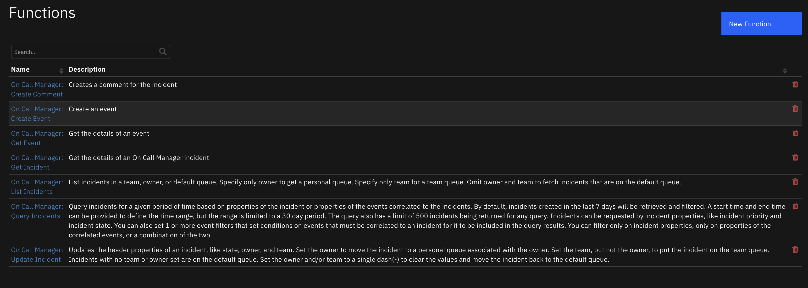
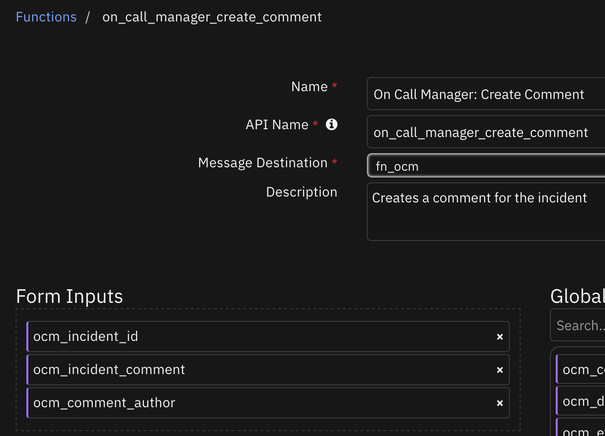
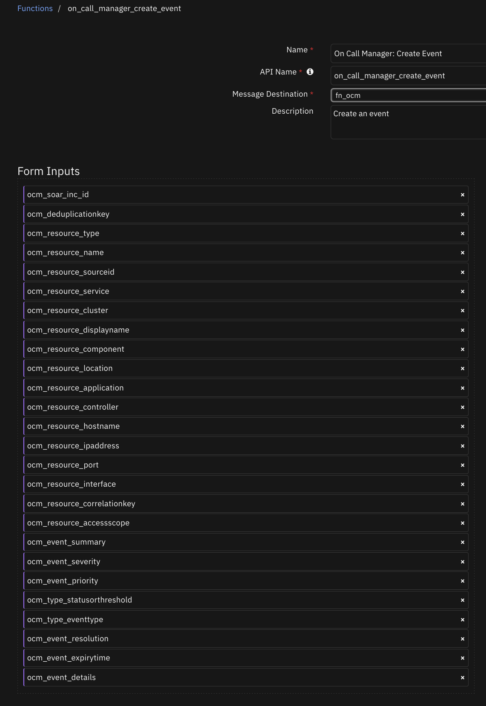
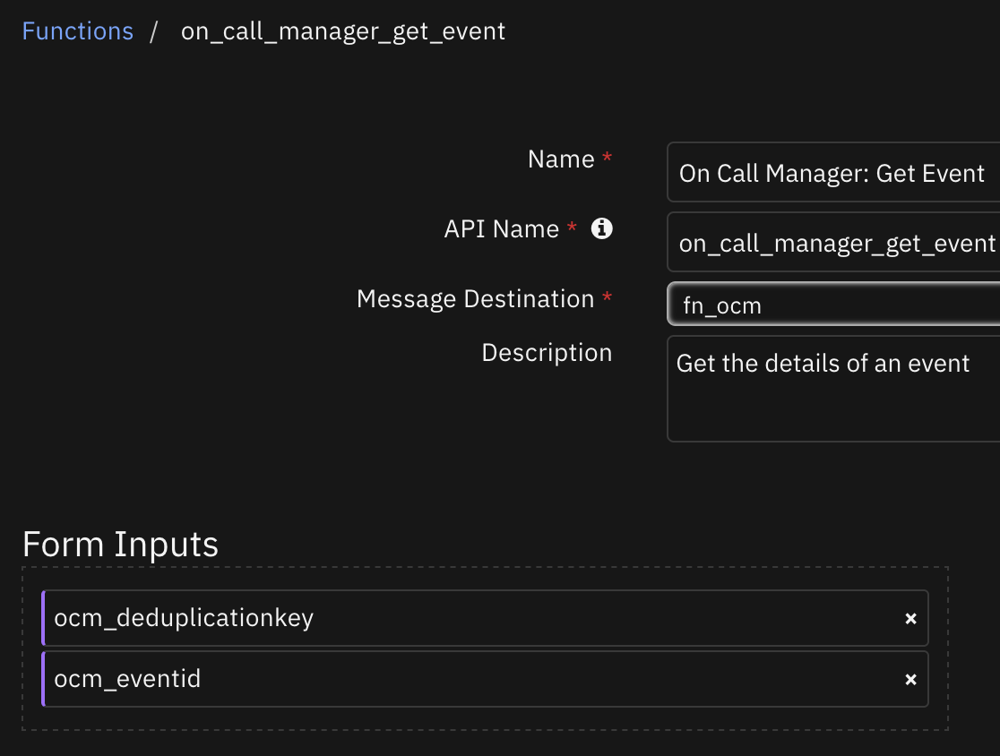
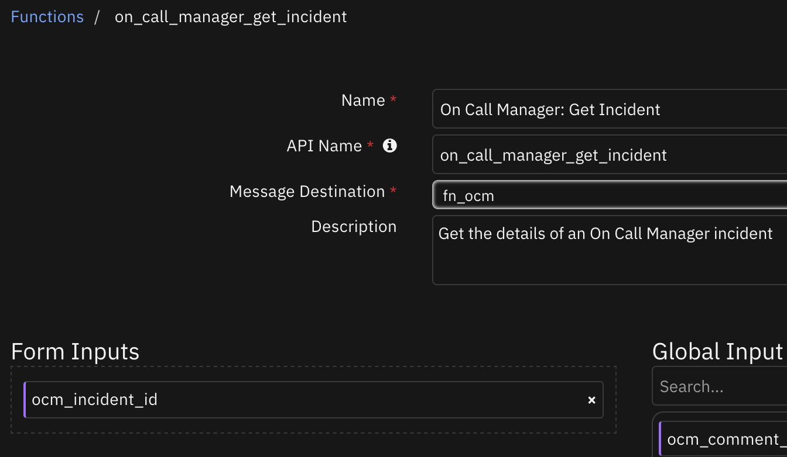
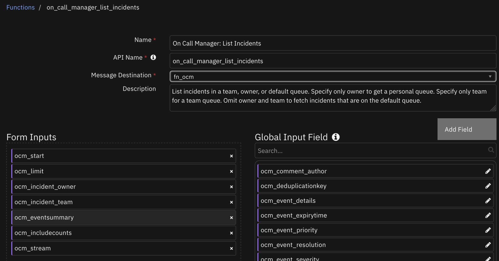
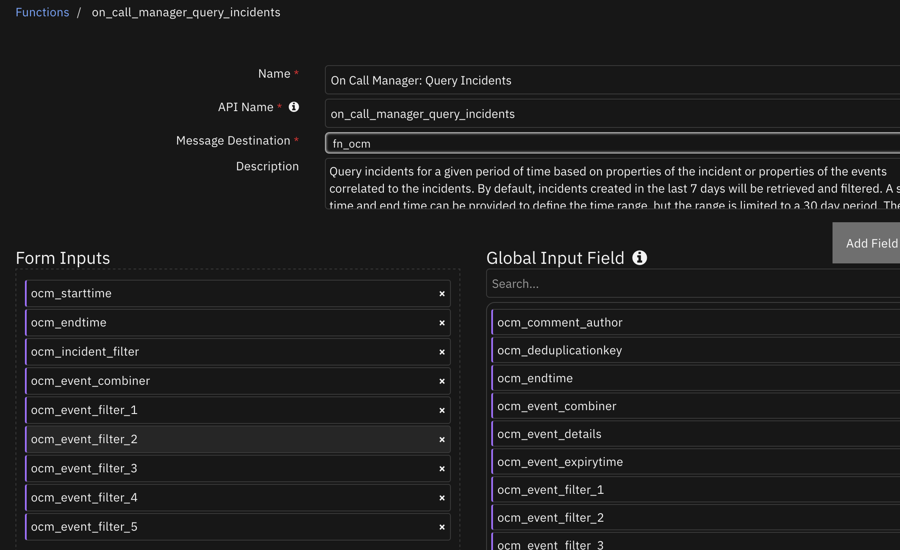
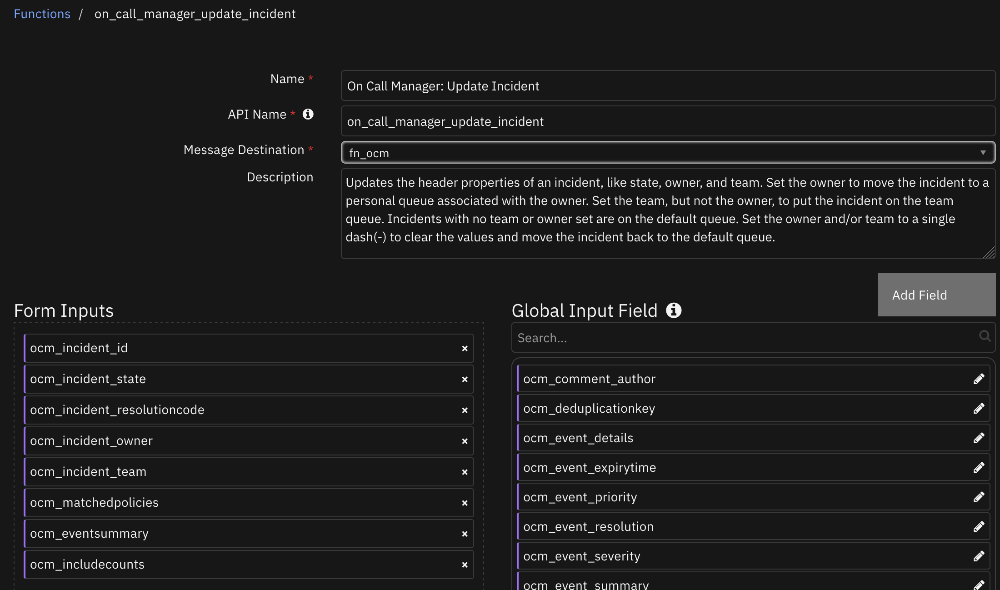
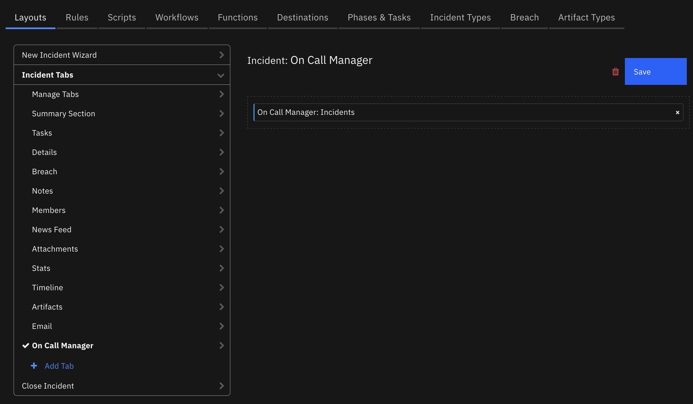
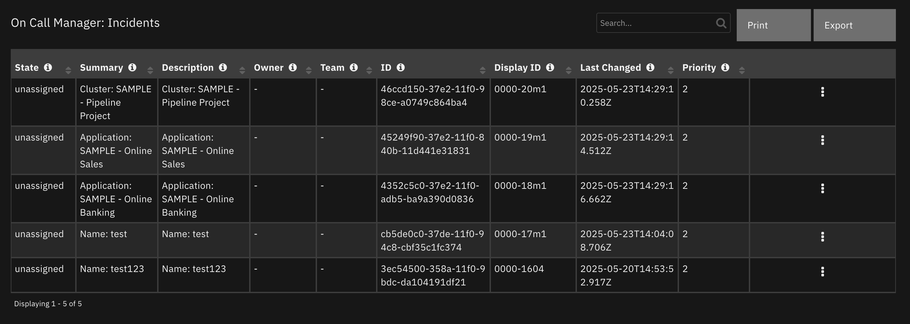

# On Call Manager for IBM SOAR

## Table of Contents
- [Release Notes](#release-notes)
- [Overview](#overview)
  - [Key Features](#key-features)
- [Requirements](#requirements)
  - [SOAR platform](#soar-platform)
  - [Cloud Pak for Security](#cloud-pak-for-security)
  - [Proxy Server](#proxy-server)
  - [Python Environment](#python-environment)
- [Installation](#installation)
  - [Install](#install)
  - [App Configuration](#app-configuration)
- [Function - On Call Manager: Create Comment](#function---on-call-manager-create-comment)
- [Function - On Call Manager: Create Event](#function---on-call-manager-create-event)
- [Function - On Call Manager: Get Event](#function---on-call-manager-get-event)
- [Function - On Call Manager: Get Incident](#function---on-call-manager-get-incident)
- [Function - On Call Manager: List Incidents](#function---on-call-manager-list-incidents)
- [Function - On Call Manager: Query Incidents](#function---on-call-manager-query-incidents)
- [Function - On Call Manager: Update Incident](#function---on-call-manager-update-incident)
  - [Custom Layouts](#custom-layouts)
- [Data Table - On Call Manager: Incidents](#data-table---on-call-manager-incidents)
- [Custom Fields](#custom-fields)
- [Playbooks](#playbooks)
- [Troubleshooting & Support](#troubleshooting--support)

---

## Release Notes
| Version | Date | Notes |
| ------- | ---- | ----- |
| 1.0.0 | 07/2025 | Initial Release |

---

## Overview
<!--
  Provide a high-level description of the function itself and its remote software or application.
  The text below is parsed from the "description" and "long_description" attributes in the setup.py file
-->
**On Call Manager for IBM SOAR**

 

This app allows the creation of Events, updating Incidents, retrieving the details of incidents and the details of events in On Call Manager from SOAR.

Links:
<br><ul><a target='blank' href='https://ibm.com/mysupport'>Support</a></ul>
<br><ul><a target='blank' href='https://ideas.ibm.com/'>Enhancement Requests</a></ul>

### Key Features
<!--
  List the Key Features of the Integration
-->
* Create an event
* Create a comment on an incident
* List incidents
* Update an incident
* Get details of an event
* Get details of an incident
* Query incidents

---

## Requirements
This app supports the IBM Security QRadar SOAR Platform and the IBM Security QRadar SOAR for IBM Cloud Pak for Security.

### SOAR platform
The SOAR platform supports two app deployment mechanisms, Edge Gateway (also known as App Host) and integration server.

If deploying to a SOAR platform with an App Host, the requirements are:
* SOAR platform >= `51.0.0.0.9339`.
* The app is in a container-based format (available from the AppExchange as a `zip` file).

If deploying to a SOAR platform with an integration server, the requirements are:
* SOAR platform >= `51.0.0.0.9339`.
* The app is in the older integration format (available from the AppExchange as a `zip` file which contains a `tar.gz` file).
* Integration server is running `resilient-circuits>=51.0.0.0.0`.
* If using an API key account, make sure the account provides the following minimum permissions:
  | Name | Permissions |
  | ---- | ----------- |
  | Org Data | Read |
  | Function | Read |
  | Layout | Read, Write |
  | Incident.Fields | Write |

The following SOAR platform guides provide additional information:
* _Edge Gateway Deployment Guide_ or _App Host Deployment Guide_: provides installation, configuration, and troubleshooting information, including proxy server settings.
* _Integration Server Guide_: provides installation, configuration, and troubleshooting information, including proxy server settings.
* _System Administrator Guide_: provides the procedure to install, configure and deploy apps.

The above guides are available on the IBM Documentation website at [ibm.biz/soar-docs](https://ibm.biz/soar-docs). On this web page, select your SOAR platform version. On the follow-on page, you can find the _Edge Gateway Deployment Guide_, _App Host Deployment Guide_, or _Integration Server Guide_ by expanding **Apps** in the Table of Contents pane. The System Administrator Guide is available by expanding **System Administrator**.

### Cloud Pak for Security
If you are deploying to IBM Cloud Pak for Security, the requirements are:
* IBM Cloud Pak for Security >= `1.10.15`.
* Cloud Pak is configured with an Edge Gateway.
* The app is in a container-based format (available from the AppExchange as a `zip` file).

The following Cloud Pak guides provide additional information:
* _Edge Gateway Deployment Guide_ or _App Host Deployment Guide_: provides installation, configuration, and troubleshooting information, including proxy server settings. From the Table of Contents, select Case Management and Orchestration & Automation > **Orchestration and Automation Apps**.
* _System Administrator Guide_: provides information to install, configure, and deploy apps. From the IBM Cloud Pak for Security IBM Documentation table of contents, select Case Management and Orchestration & Automation > **System administrator**.

These guides are available on the IBM Documentation website at [ibm.biz/cp4s-docs](https://ibm.biz/cp4s-docs). From this web page, select your IBM Cloud Pak for Security version. From the version-specific IBM Documentation page, select Case Management and Orchestration & Automation.

### Proxy Server
The app **does** support a proxy server.

### Python Environment
Python 3.9, 3.11, and 3.12 are officially supported. When deployed as an app, the app runs on Python 3.11.
Additional package dependencies may exist for each of these packages:
* resilient-circuits>=51.0.0.0.0

### Development Version

This app has been implemented using:
| Product Name | Product Version | API URL | API Version |
| ------------ | --------------- | ------- | ----------- |
| On Call Manager | NA | https://pages.github.ibm.com/cem-notification/swagger-api-document/incidents/ | v1 |

---

## Installation

### Install
* To install or uninstall an App or Integration on the _SOAR platform_, see the documentation at [ibm.biz/soar-docs](https://ibm.biz/soar-docs).
* To install or uninstall an App on _IBM Cloud Pak for Security_, see the documentation at [ibm.biz/cp4s-docs](https://ibm.biz/cp4s-docs) and follow the instructions above to navigate to Orchestration and Automation.

### App Configuration
The following table provides the settings you need to configure the app. These settings are made in the app.config file. See the documentation discussed in the Requirements section for the procedure.

| Config | Required | Example | Description |
| ------ | :------: | ------- | ----------- |
| **client_auth_cert** | No | `<path_to_cert.pem>` | *Client auth certificate*  |
| **client_auth_key** | No | `<path_to_cert_private_key.pem>` | *Client auth keys* |
| **ocm_api_key_name** | Yes | `xxxxxxxx-xxxx-xxxx-xxxx-xxxxxxxxxxxx/qactalrirsin` | *API key name from On Call Manager.* |
| **ocm_api_key_pass** | Yes | `xxxxxxxxxxxxx+x+xxxxxxxxxxxxxxxx` | *API key pass from On Call Manager.* |
| **ocm_url** | Yes | `https://oncallmanager.ibm.com/api/` | *On Call Manager API url.* |
| **verify** | No | `True/False` | *True, Fa lse, or a path the a certificate file.* |
---

## Function - On Call Manager: Create Comment
Creates a comment for the incident

 

<details><summary>Inputs:</summary>
<p>

| Name | Type | Required | Example | Tooltip |
| ---- | :--: | :------: | ------- | ------- |
| `ocm_comment_author` | `text` | No | `-` | The user creating the comment |
| `ocm_incident_comment` | `text` | No | `-` | Comment to add to the incident |
| `ocm_incident_id` | `text` | Yes | `xxxxxxxx-xxxx-xxxx-xxxx-xxxxxxxxxxxx` | Incident id for the incident to be updated |

</p>
</details>

<details><summary>Outputs:</summary>
<p>

> **NOTE:** This example might be in JSON format, but `results` is a Python Dictionary on the SOAR platform.

```python
results = {
  "content": {},
  "inputs": {
    "ocm_comment_author": "me",
    "ocm_incident_comment": "hello",
    "ocm_incident_id": "xxxxxxxx-xxxx-xxxx-xxxx-xxxxxxxxxxxx"
  },
  "metrics": {
    "execution_time_ms": 6816,
    "host": "my.app.host",
    "package": "fn-ocm",
    "package_version": "1.0.0",
    "timestamp": "2025-05-23 11:13:18",
    "version": "1.0"
  },
  "raw": null,
  "reason": null,
  "success": true,
  "version": 2.0
}
```

</p>
</details>

<details><summary>Example Function Input Script:</summary>
<p>

```python
inputs.ocm_comment_author = playbook.inputs.ocm_comment_author
inputs.ocm_incident_comment = playbook.inputs.ocm_incident_comment
inputs.ocm_incident_id = playbook.inputs.ocm_incident_id
```

</p>
</details>

<details><summary>Example Function Post Process Script:</summary>
<p>

```python
results = playbook.functions.results.ocm_create_comment_return
if results.get("success", None):
  incident.addNote("On Call Manager: Create Comment was successful.")
else:
  incident.addNote(f"On Call Manager: Create Comment failed with reason:\n{results.get('reason', None)}")
```

</p>
</details>

---
## Function - On Call Manager: Create Event
Create an event

 

<details><summary>Inputs:</summary>
<p>

| Name | Type | Required | Example | Tooltip |
| ---- | :--: | :------: | ------- | ------- |
| `ocm_deduplicationkey` | `text` | No | `-` | This is the key used to determine if two instances of an event record presented to the system de-duplicate. If present prevents construction of identifier for de-duplication. If not present the Identifier will be constructed from the resource and type fields. |
| `ocm_event_details` | `text` | No | `{"sampleDetails": "value", "example": 4}` | A dictionary. Additional properties for the event, key,value value may be string or integer. |
| `ocm_event_expirytime` | `number` | No | `3900` | The number of seconds after which the event will be cleared, if there have been no further occurrence |
| `ocm_event_priority` | `select` | No | `-` | Priority |
| `ocm_event_resolution` | `boolean` | No | `-` | True if this is a resolution event |
| `ocm_event_severity` | `select` | Yes | `-` | Severity |
| `ocm_event_summary` | `text` | Yes | `-` | Contains text which describes the event condition |
| `ocm_resource_accessscope` | `text` | No | `-` | The project or namespace the resource is part of |
| `ocm_resource_application` | `text` | No | `-` | The application that caused the event |
| `ocm_resource_cluster` | `text` | No | `-` | The cluster that caused the event |
| `ocm_resource_component` | `text` | No | `-` | The component that caused the event |
| `ocm_resource_controller` | `text` | No | `-` | The controller that caused the event |
| `ocm_resource_correlationkey` | `text` | No | `-` | This is the key used to determine if event records presented to the system should be correlated to the same incident. If present, it prevents construction of a corelation key, if not present the corelation will be constructed from the resource. |
| `ocm_resource_displayname` | `text` | No | `-` | The display name for the resource |
| `ocm_resource_hostname` | `text` | No | `-` | The fully qualified hostname |
| `ocm_resource_interface` | `text` | No | `-` | The interface reporting the issue |
| `ocm_resource_ipaddress` | `text` | No | `-` | The IP address of the device |
| `ocm_resource_location` | `text` | No | `-` | Where the event is being reported from |
| `ocm_resource_name` | `text` | Yes | `-` | The name of the resource causing the event. Identifies the primary resource that the event is affecting |
| `ocm_resource_port` | `text` | No | `-` | The port reporting the issue |
| `ocm_resource_service` | `text` | No | `-` | The service that caused the event |
| `ocm_resource_sourceid` | `text` | No | `-` | The id the resource is known by in the source system |
| `ocm_resource_type` | `select` | No | `-` | The type of the resource causing the event. Should be used to identify the primary resource that the event is affecting. The value of the type field can be one of the defined key types for resources, eg Application, Server, Service, Cluster. Or it can be a user defined value. If a defined value is used, then the event processing may make use of it during processing. |
| `ocm_soar_inc_id` | `number` | Yes | `-` | The SOAR incident ID |
| `ocm_type_eventtype` | `text` | No | `Response time threshold breached` | Description of the type of the event. E.g. Utilization, System status, Threshold breach |
| `ocm_type_statusorthreshold` | `text` | No | `> 30 seconds` | The status or the threshold causing the event. E.g. Down, 95%, Unavailable |

</p>
</details>

<details><summary>Outputs:</summary>
<p>

> **NOTE:** This example might be in JSON format, but `results` is a Python Dictionary on the SOAR platform.

```python
results = {
  "content": {
    "deduplicationKey": "abc",
    "eventid": "xxxxxxxx-xxxx-xxxx-xxxx-xxxxxxxxxxxx"
  },
  "inputs": {
    "ocm_event_priority": "3",
    "ocm_event_severity": "Minor",
    "ocm_event_summary": "failure somewhere",
    "ocm_resource_name": "Something failed",
    "ocm_soar_inc_id": 2174,
    "ocm_type_statusorthreshold": "\u003e 1 minute"
  },
  "metrics": {
    "execution_time_ms": 1052,
    "host": "my.app.host",
    "package": "fn-ocm",
    "package_version": "1.0.0",
    "timestamp": "2025-07-08 11:37:32",
    "version": "1.0"
  },
  "raw": null,
  "reason": null,
  "success": true,
  "version": 2.0
}
```

</p>
</details>

<details><summary>Example Function Input Script:</summary>
<p>

```python
inputs.ocm_soar_inc_id = incident.id
inputs.ocm_resource_name = playbook.inputs.ocm_resource_name
inputs.ocm_event_summary = playbook.inputs.ocm_event_summary
inputs.ocm_event_severity = playbook.inputs.ocm_event_severity

if getattr(playbook.inputs, "ocm_event_priority", None):
  inputs.ocm_event_priority = playbook.inputs.ocm_event_priority
if not getattr(playbook.inputs, "ocm_type_statusorthreshold", None) and not getattr(playbook.inputs, "ocm_type_eventtype", None):
  helper.fail("Either ocm_type_statusorthreshold or ocm_type_eventtype must be given.")
if getattr(playbook.inputs, "ocm_type_statusorthreshold", None):
  inputs.ocm_type_statusorthreshold = playbook.inputs.ocm_type_statusorthreshold
if getattr(playbook.inputs, "ocm_type_eventtype", None):
  inputs.ocm_type_eventtype = playbook.inputs.ocm_type_eventtype

# Example input for adding custom properties to the On Call Manager event.
#inputs.ocm_event_details = {"subject":"Example subject", "reason":"something happened", "country":"US", "region":"NA"}
```

</p>
</details>

<details><summary>Example Function Post Process Script:</summary>
<p>

```python
from json import dumps
results = playbook.functions.results.ocm_create_event_return
if results.get("success", None):
  incident.addNote(f"On Call Manager: Create Event was successful and returned:\n{dumps(results.get('content', {}), indent=4)}")
else:
  incident.addNote(f"On Call Manager: Create Event failed with reason:\n{results.get('reason', None)}")
```

</p>
</details>

---
## Function - On Call Manager: Get Event
Get the details of an event

 

<details><summary>Inputs:</summary>
<p>

| Name | Type | Required | Example | Tooltip |
| ---- | :--: | :------: | ------- | ------- |
| `ocm_deduplicationkey` | `text` | No | `-` | This is the key used to determine if two instances of an event record presented to the system de-duplicate. If present prevents construction of identifier for de-duplication. If not present the Identifier will be constructed from the resource and type fields. |
| `ocm_eventid` | `text` | Yes | `-` | ID of the event. |

</p>
</details>

<details><summary>Outputs:</summary>
<p>

> **NOTE:** This example might be in JSON format, but `results` is a Python Dictionary on the SOAR platform.

```python
results = {
  "content": {
    "accessScopes": [],
    "deduplicationKey": "abc",
    "eventSource": "Event API",
    "eventState": "open",
    "eventid": "xxxxxxxx-xxxx-xxxx-xxxx-xxxxxxxxxxxx",
    "firstOccurrence": "2025-07-08T15:37:31.545Z",
    "incidentUuid": "xxxxxxxx-xxxx-xxxx-xxxx-xxxxxxxxxxxx",
    "instanceUuid": "xxxxxxxx-xxxx-xxxx-xxxx-xxxxxxxxxxxx",
    "lastOccurrence": "2025-07-08T15:37:31.545Z",
    "maxSeverity10Seen": 40,
    "postTime": "2025-07-08T15:37:31.570Z",
    "resource": {
      "name": "Something failed",
      "type": "Unknown"
    },
    "severity": 3,
    "severity10": 40,
    "summary": "failure somewhere",
    "suppressed": false,
    "type": {
      "statusOrThreshold": "\u003e 1 minute"
    },
    "urls": [
      {
        "description": "Link to the SOAR incident.",
        "url": "https://example.com"
      }
    ],
    "xInYSuppressed": false
  },
  "inputs": {
    "ocm_deduplicationkey": "***",
    "ocm_eventid": "xxxxxxxx-xxxx-xxxx-xxxx-xxxxxxxxxxxx"
  },
  "metrics": {
    "execution_time_ms": 480,
    "host": "my.app.host",
    "package": "fn-ocm",
    "package_version": "1.0.0",
    "timestamp": "2025-07-08 11:37:36",
    "version": "1.0"
  },
  "raw": null,
  "reason": null,
  "success": true,
  "version": 2.0
}
```

</p>
</details>

<details><summary>Example Function Input Script:</summary>
<p>

```python
# Both eventid and deduplicationKey are required inputs
results = playbook.functions.results.ocm_create_event_return
content = results.get("content", {})
if content:
  inputs.ocm_deduplicationkey = content.get("deduplicationKey", None)
  inputs.ocm_eventid = content.get("eventid", None)
```

</p>
</details>

<details><summary>Example Function Post Process Script:</summary>
<p>

```python
results = playbook.functions.results.ocm_get_event_results
if not results.get("success", None):
  incident.addNote(f"On Call Manager: Get Event failed with reason:\n{results.get('reason', None)}")
```

</p>
</details>

---
## Function - On Call Manager: Get Incident
Get the details of an On Call Manager incident

 

<details><summary>Inputs:</summary>
<p>

| Name | Type | Required | Example | Tooltip |
| ---- | :--: | :------: | ------- | ------- |
| `ocm_incident_id` | `text` | Yes | `xxxxxxxx-xxxx-xxxx-xxxx-xxxxxxxxxxxx` | Incident id for the incident to be updated |

</p>
</details>

<details><summary>Outputs:</summary>
<p>

> **NOTE:** This example might be in JSON format, but `results` is a Python Dictionary on the SOAR platform.

```python
results = {
  "content": {
    "accessScopes": [],
    "closedOwner": "-",
    "closedTeam": "-",
    "correlationDetails": {
      "name": "Something failed"
    },
    "createdTime": "2025-07-08T15:37:31.545Z",
    "description": "Name: Something failed",
    "displayId": "0000-34m1",
    "escalated": false,
    "eventSummary": {
      "events": 1,
      "maxSeverities10Seen": [
        {
          "count": 1,
          "severity": 40
        }
      ],
      "openSeverities10": [
        {
          "count": 1,
          "severity": 40
        }
      ],
      "severities": [
        {
          "count": 1,
          "severity": 3
        }
      ],
      "severities10": [
        {
          "count": 1,
          "severity": 40
        }
      ]
    },
    "firstInProgressTime": "-",
    "id": "xxxxxxxx-xxxx-xxxx-xxxx-xxxxxxxxxxxx",
    "lastChanged": "2025-07-08T15:37:33.436Z",
    "owner": "-",
    "priority": 2,
    "resolvedTime": "-",
    "state": "unassigned",
    "summary": "Name: Something failed",
    "team": "-",
    "wasEscalated": false
  },
  "inputs": {
    "ocm_incident_id": "xxxxxxxx-xxxx-xxxx-xxxx-xxxxxxxxxxxx"
  },
  "metrics": {
    "execution_time_ms": 571,
    "host": "my.app.host",
    "package": "fn-ocm",
    "package_version": "1.0.0",
    "timestamp": "2025-07-08 11:37:38",
    "version": "1.0"
  },
  "raw": null,
  "reason": null,
  "success": true,
  "version": 2.0
}
```

</p>
</details>

<details><summary>Example Function Input Script:</summary>
<p>

```python
inputs.ocm_incident_id = playbook.inputs.ocm_incident_id
```

</p>
</details>

<details><summary>Example Function Post Process Script:</summary>
<p>

```python
from datetime import datetime
results = playbook.functions.results.ocm_get_incident_results
if results.get("success", None):
  incident.properties.ocm_tab_visible = True
  inc = results.get("content", {})
  if incident.properties.ocm_incident_id:
    # If incident property ocm incident id has a value then add the incident data to the data table
    row = incident.addRow("on_call_manager_incidents")
    row['ocm_query_time'] = int(datetime.now().timestamp()*1000)
    row['ocm_incident_state'] = inc.get("state", None)
    row["ocm_incident_summary"] = inc.get("summary", None)
    row['ocm_incident_description'] = inc.get("description", None)
    row['ocm_incident_owner'] = inc.get("owner", None)
    row['ocm_incident_team'] = inc.get("team", None)
    row['ocm_incident_id'] = inc.get("id", "").strip()
    row['ocm_incident_display_id'] = inc.get("displayId", None)
    row['ocm_incident_last_changed'] = int(datetime.strptime(inc.get("lastChanged", None)[:-1], "%Y-%m-%dT%H:%M:%S.%f").timestamp()*1000) if inc.get("lastChanged", None) else None
    row['ocm_incident_priority'] = inc.get("priority", None)
  else: # else add the incident data to the incident properties
    incident.name = inc.get("summary", None)
    incident.description = inc.get("description", None)
    incident.properties.ocm_incident_assigned_owner = inc.get("owner", None)
    incident.properties.ocm_incident_assigned_team = inc.get("team", None)
    incident.properties.ocm_incident_description = inc.get("description", None)
    incident.properties.ocm_incident_display_id = inc.get("displayId", None)
    incident.properties.ocm_incident_id = inc.get("id", None)
    incident.properties.ocm_incident_priority = inc.get("priority", None)
    incident.properties.ocm_incident_state = inc.get("state", None)
    incident.properties.ocm_incident_summary = inc.get("summary", None)
    incident.properties.ocm_incident_last_changed_time = int(datetime.strptime(inc.get("lastChanged", None)[:-1], "%Y-%m-%dT%H:%M:%S.%f").timestamp()*1000) if inc.get("lastChanged", None) else None
else:
  incident.addNote(f"On Call Manager: Get Incident failed with reason:\n{results.get('reason', None)}")
```

</p>
</details>

---
## Function - On Call Manager: List Incidents
List incidents in a team, owner, or default queue. Specify only owner to get a personal queue. Specify only team for a team queue. Omit owner and team to fetch incidents that are on the default queue.

 

<details><summary>Inputs:</summary>
<p>

| Name | Type | Required | Example | Tooltip |
| ---- | :--: | :------: | ------- | ------- |
| `ocm_eventsummary` | `boolean` | No | `-` | Include the event summary for each matching incident. |
| `ocm_incident_owner` | `text` | No | `-` | Fetch only incidents on the queue associated with this owner. This parameter takes precedence over group. If no owner or group is specified, then incidents are retrieved from the default queue. Use a single dash(-) to clear the owner value. |
| `ocm_incident_team` | `text` | No | `-` | Fetch only incidents on the queue associated with this Group. Ignored if owner is specified. If no owner or group is specified, then incidents are retrieved from the default queue. Use a single dash(-) to clear the group value. |
| `ocm_includecounts` | `boolean` | No | `-` | Include the event type and resource property counts for each matching incident. |
| `ocm_limit` | `number` | No | `9999` | Limit the returned matching incidents to the first N incidents starting with _start index. Default value : 9999 |
| `ocm_start` | `number` | No | `1` | Return the matching incidents starting from the specified 1 based index. Default 1 |
| `ocm_stream` | `boolean` | No | `-` | Stream the results |

</p>
</details>

<details><summary>Outputs:</summary>
<p>

> **NOTE:** This example might be in JSON format, but `results` is a Python Dictionary on the SOAR platform.

```python
results = {
  "content": [
    {
      "accessScopes": [],
      "closedOwner": "-",
      "closedTeam": "-",
      "correlationDetails": {
        "cluster": "SAMPLE - Pipeline Project"
      },
      "createdTime": "2025-05-23T14:29:03.698Z",
      "description": "Cluster: SAMPLE - Pipeline Project",
      "displayId": "0000-20m1",
      "escalated": false,
      "firstInProgressTime": "-",
      "id": "xxxxxxxx-xxxx-xxxx-xxxx-xxxxxxxxxxxx",
      "lastChanged": "2025-05-23T14:29:10.258Z",
      "owner": "-",
      "priority": 2,
      "resolvedTime": "-",
      "state": "unassigned",
      "summary": "Cluster: SAMPLE - Pipeline Project",
      "team": "-",
      "wasEscalated": false
    },
    {
      "accessScopes": [],
      "closedOwner": "-",
      "closedTeam": "-",
      "correlationDetails": {
        "application": "SAMPLE - Online Sales"
      },
      "createdTime": "2025-05-23T14:29:00.871Z",
      "description": "Application: SAMPLE - Online Sales",
      "displayId": "0000-19m1",
      "escalated": false,
      "firstInProgressTime": "-",
      "id": "xxxxxxxx-xxxx-xxxx-xxxx-xxxxxxxxxxxx",
      "lastChanged": "2025-05-23T14:29:14.512Z",
      "owner": "-",
      "priority": 2,
      "resolvedTime": "-",
      "state": "unassigned",
      "summary": "Application: SAMPLE - Online Sales",
      "team": "-",
      "wasEscalated": false
    }
  ],
  "inputs": {},
  "metrics": {
    "execution_time_ms": 3845,
    "host": "my.app.host",
    "package": "fn-ocm",
    "package_version": "1.0.0",
    "timestamp": "2025-05-23 10:45:17",
    "version": "1.0"
  },
  "raw": null,
  "reason": null,
  "success": true,
  "version": 2.0
}
```

</p>
</details>

<details><summary>Example Function Input Script:</summary>
<p>

```python
if getattr(playbook.inputs, "ocm_start", None):
  inputs.ocm_start = getattr(playbook.inputs, "ocm_start", None)
if getattr(playbook.inputs, "ocm_limit", None):
  inputs.ocm_limit = getattr(playbook.inputs, "ocm_limit", None)
if getattr(playbook.inputs, "ocm_incident_owner", None):
  inputs.ocm_incident_owner = getattr(playbook.inputs, "ocm_incident_owner", None)
if getattr(playbook.inputs, "ocm_incident_team", None):
  inputs.ocm_incident_team = getattr(playbook.inputs, "ocm_incident_team", None)
```

</p>
</details>

<details><summary>Example Function Post Process Script:</summary>
<p>

```python
from datetime import datetime
results = playbook.functions.results.ocm_list_incidents_return
if results.get("success", None):
  content = results.get("content", [])
  if content:
    incident.properties.ocm_tab_visible = True
    for inc in content:
      row = incident.addRow("on_call_manager_incidents")
      row['ocm_query_time'] = int(datetime.now().timestamp()*1000)
      row['ocm_incident_state'] = inc.get("state", None)
      row["ocm_incident_summary"] = inc.get("summary", None)
      row['ocm_incident_description'] = inc.get("description", None)
      row['ocm_incident_owner'] = inc.get("owner", None)
      row['ocm_incident_team'] = inc.get("team", None)
      row['ocm_incident_id'] = inc.get("id", "").strip()
      row['ocm_incident_display_id'] = inc.get("displayId", None)
      row['ocm_incident_last_changed'] = int(datetime.strptime(inc.get("lastChanged", None)[:-1], "%Y-%m-%dT%H:%M:%S.%f").timestamp()*1000) if inc.get("lastChanged", None) else None
      row['ocm_incident_priority'] = inc.get("priority", None)
else:
  incident.addNote(f"On Call Manager: List Incidents failed with reason:\n{results.get('reason', None)}")
```

</p>
</details>

---
## Function - On Call Manager: Query Incidents
Query incidents for a given period of time based on properties of the incident or properties of the events correlated to the incidents. By default, incidents created in the last 7 days will be retrieved and filtered. A start time and end time can be provided to define the time range, but the range is limited to a 30 day period. The query also has a limit of 500 incidents being returned for any query.
Incidents can be requested by incident properties, like incident priority and incident state. You can also set 1 or more event filters that set conditions on events that must be correlated to an incident for it to be included in the query results. You can filter only on incident properties, only on properties of the correlated events, or a combination of the two.

 

<details><summary>Inputs:</summary>
<p>

| Name | Type | Required | Example | Tooltip |
| ---- | :--: | :------: | ------- | ------- |
| `ocm_endtime` | `datetimepicker` | No | `-` | Ending UTC timestamp (YYYY-MM-DDTHH:mm:SS.sssZ) for range of incidents to query - - will default to current time. This time is compared to the "created" time of an incident to determine if the incident should be included. Example values: 2017-09-14T17:00:00.000Z, 2017-09-14T17:00, 2017-09-14 |
| `ocm_event_combiner` | `select` | No | `-` | Set to "and" or "or" to indicate how the event filters should be combined when filtering by event content. The default is to combine the event filters using the "and" operator, meaning all event filters must be satisfied by any returned incident. Use "or" if only one of the event filters must be satisfied. |
| `ocm_event_filter_1` | `text` | No | ` severity >= "minor"` | A condition filter that specifies expression matches for the properties of a single event on the incident. Examples: severity >= "minor"  |
| `ocm_event_filter_2` | `text` | No | `summary starts with "Failure" and resource.application == "payroll"` | A condition filter that specifies expression matches for the properties of a single event on the incident. Examples: summary starts with "Failure" and resource.application == "payroll" |
| `ocm_event_filter_3` | `text` | No | `type.eventType == 'a1' or type.eventType == 'a2' or type.eventType == 'a3'` | A condition filter that specifies expression matches for the properties of a single event on the incident. Examples: type.eventType == 'a1' or type.eventType == 'a2' or type.eventType == 'a3' |
| `ocm_event_filter_4` | `text` | No | `summary starts with "Failure"` | A condition filter that specifies expression matches for the properties of a single event on the incident. Examples: summary starts with "Failure" |
| `ocm_event_filter_5` | `text` | No | `type.eventType == 'a2'` | A condition filter that specifies expression matches for the properties of a single event on the incident. Examples: type.eventType == 'a2' |
| `ocm_incident_filter` | `text` | No | `lastChanged > "2017-08-01"` | A condition filter that specifies expression matches for incident properties. Examples: 'lastChanged > "2017-08-01"', 'priority == 5 OR priority == 4' |
| `ocm_starttime` | `datetimepicker` | No | `-` | Beginning UTC timestamp (YYYY-MM-DDTHH:mm:SS.sssZ) for range of incidents to query - will default to system configured value of 7 days ago. This time is compared to the "created" time of an incident to determine if the incident should be included. Example values: 2017-09-12T08:00:00.000Z, 2017-09-12T08:00, 2017-09-12 |

</p>
</details>

<details><summary>Outputs:</summary>
<p>

> **NOTE:** This example might be in JSON format, but `results` is a Python Dictionary on the SOAR platform.

```python
results = {
  "content": [
    {
      "accessScopes": [],
      "closedOwner": "-",
      "closedTeam": "-",
      "correlationDetails": {
        "application": "SAMPLE - Online Sales"
      },
      "createdTime": "2025-07-08T15:00:37.538Z",
      "description": "Application: SAMPLE - Online Sales",
      "displayId": "0000-32m1",
      "escalated": false,
      "eventsURL": "https://oncallmanager.ibm.com/api/incidentquery/v1/xxxxxxxx-xxxx-xxxx-xxxx-xxxxxxxxxxxx/events",
      "firstInProgressTime": "-",
      "id": "xxxxxxxx-xxxx-xxxx-xxxx-xxxxxxxxxxxx",
      "incidentURL": "https://oncallmanager.ibm.com/api/incidentquery/v1/xxxxxxxx-xxxx-xxxx-xxxx-xxxxxxxxxxxx",
      "lastChanged": "2025-07-08T15:00:49.937Z",
      "owner": "-",
      "priority": 2,
      "resolvedTime": "-",
      "state": "unassigned",
      "summary": "Application: SAMPLE - Online Sales",
      "team": "-",
      "timelineURL": "https://oncallmanager.ibm.com/api/incidentquery/v1/xxxxxxxx-xxxx-xxxx-xxxx-xxxxxxxxxxxx/timeline",
      "wasEscalated": false
    },
    {
      "accessScopes": [],
      "closedOwner": "-",
      "closedTeam": "-",
      "correlationDetails": {
        "application": "SAMPLE - Online Banking"
      },
      "createdTime": "2025-07-08T15:00:30.658Z",
      "description": "Application: SAMPLE - Online Banking",
      "displayId": "0000-31m1",
      "escalated": false,
      "eventsURL": "https://oncallmanager.ibm.com/api/incidentquery/v1/xxxxxxxx-xxxx-xxxx-xxxx-xxxxxxxxxxxx/events",
      "firstInProgressTime": "-",
      "id": "xxxxxxxx-xxxx-xxxx-xxxx-xxxxxxxxxxxx",
      "incidentURL": "https://oncallmanager.ibm.com/api/incidentquery/v1/xxxxxxxx-xxxx-xxxx-xxxx-xxxxxxxxxxxx",
      "lastChanged": "2025-07-08T15:00:54.943Z",
      "owner": "-",
      "priority": 2,
      "resolvedTime": "-",
      "state": "unassigned",
      "summary": "Application: SAMPLE - Online Banking",
      "team": "-",
      "timelineURL": "https://oncallmanager.ibm.com/api/incidentquery/v1/xxxxxxxx-xxxx-xxxx-xxxx-xxxxxxxxxxxx/timeline",
      "wasEscalated": false
    }
  ],
  "inputs": {
    "ocm_endtime": 1752033600000,
    "ocm_event_combiner": "and",
    "ocm_event_filter_1": "severity \u003e= \"minor\"",
    "ocm_starttime": 1751860800000
  },
  "metrics": {
    "execution_time_ms": 592,
    "host": "my.app.host",
    "package": "fn-ocm",
    "package_version": "1.0.0",
    "timestamp": "2025-07-08 11:11:46",
    "version": "1.0"
  },
  "raw": null,
  "reason": null,
  "success": true,
  "version": 2.0
}
```

</p>
</details>

<details><summary>Example Function Input Script:</summary>
<p>

```python
if getattr(playbook.inputs, "ocm_endtime", None):
  inputs.ocm_endtime = getattr(playbook.inputs, "ocm_endtime", None)
if getattr(playbook.inputs, "ocm_event_combiner", None):
  inputs.ocm_event_combiner = getattr(playbook.inputs, "ocm_event_combiner", None)
if getattr(playbook.inputs, "ocm_event_filter_1", None):
  inputs.ocm_event_filter_1 = getattr(playbook.inputs, "ocm_event_filter_1", None)
if getattr(playbook.inputs, "ocm_event_filter_2", None):
  inputs.ocm_event_filter_2 = getattr(playbook.inputs, "ocm_event_filter_2", None)
if getattr(playbook.inputs, "ocm_event_filter_3", None):
  inputs.ocm_event_filter_3 = getattr(playbook.inputs, "ocm_event_filter_3", None)
if getattr(playbook.inputs, "ocm_event_filter_4", None):
  inputs.ocm_event_filter_4 = getattr(playbook.inputs, "ocm_event_filter_4", None)
if getattr(playbook.inputs, "ocm_event_filter_5", None):
  inputs.ocm_event_filter_5 = getattr(playbook.inputs, "ocm_event_filter_5", None)
if getattr(playbook.inputs, "ocm_incident_filter", None):
  inputs.ocm_incident_filter = getattr(playbook.inputs, "ocm_incident_filter", None)
if getattr(playbook.inputs, "ocm_starttime", None):
  inputs.ocm_starttime = getattr(playbook.inputs, "ocm_starttime", None)
```

</p>
</details>

<details><summary>Example Function Post Process Script:</summary>
<p>

```python
from datetime import datetime
results = playbook.functions.results.ocm_query_incidents_results
if results.get("success", None):
  content = results.get("content", [])
  if content:
    incident.properties.ocm_tab_visible = True
    for inc in content:
      row = incident.addRow("on_call_manager_incidents")
      row['ocm_query_time'] = int(datetime.now().timestamp()*1000)
      row['ocm_incident_state'] = inc.get("state", None)
      row["ocm_incident_summary"] = inc.get("summary", None)
      row['ocm_incident_description'] = inc.get("description", None)
      row['ocm_incident_owner'] = inc.get("owner", None)
      row['ocm_incident_team'] = inc.get("team", None)
      row['ocm_incident_id'] = inc.get("id", None)
      row['ocm_incident_display_id'] = inc.get("displayId", None)
      row['ocm_incident_last_changed'] = int(datetime.strptime(inc.get("lastChanged", None)[:-1], "%Y-%m-%dT%H:%M:%S.%f").timestamp()*1000) if inc.get("lastChanged", None) else None
      row['ocm_incident_priority'] = inc.get("priority", None)
else:
  incident.addNote(f"On Call Manager: Query Incidents failed with reason:\n{results.get('reason', None)}")
```

</p>
</details>

---
## Function - On Call Manager: Update Incident
Updates the header properties of an incident, like state, owner, and team. Set the owner to move the incident to a personal queue associated with the owner. Set the team, but not the owner, to put the incident on the team queue. Incidents with no team or owner set are on the default queue. Set the owner and/or team to a single dash(-) to clear the values and move the incident back to the default queue.

 

<details><summary>Inputs:</summary>
<p>

| Name | Type | Required | Example | Tooltip |
| ---- | :--: | :------: | ------- | ------- |
| `ocm_eventsummary` | `boolean` | No | `-` | Include the event summary for each matching incident. |
| `ocm_incident_id` | `text` | Yes | `xxxxxxxx-xxxx-xxxx-xxxx-xxxxxxxxxxxx` | Incident id for the incident to be updated |
| `ocm_incident_owner` | `text` | No | `-` | Owner to be assigned to the incident. If Owner Given then Group must also be given. |
| `ocm_incident_resolutioncode` | `select` | No | `-` | Reason for incident being moved to the resolved state. Only allowed when state is also specified with a value of resolved or closed. |
| `ocm_incident_state` | `select` | No | `-` | State to be set for the incident. |
| `ocm_incident_team` | `text` | No | `-` | Group to be set as responsible for the incident. |
| `ocm_includecounts` | `boolean` | No | `-` | Include the event type and resource property counts for each matching incident. |
| `ocm_matchedpolicies` | `text` | No | `xxxxxxxxxxxxxxxxxxxxxxxxxxxxxxxx, xxxxxxxxxxxxxxxxxxxxxxxxxxxxxxxx` | Comma separated list of policy ids that have been matched to the incident. |

</p>
</details>

<details><summary>Outputs:</summary>
<p>

> **NOTE:** This example might be in JSON format, but `results` is a Python Dictionary on the SOAR platform.

```python
results = {
  "content": {
    "accessScopes": [],
    "assignedBy": "MANUAL",
    "closedOwner": "-",
    "closedTeam": "-",
    "correlationDetails": {
      "cluster": "SAMPLE - Pipeline Project"
    },
    "createdTime": "2025-05-23T14:29:03.698Z",
    "description": "Cluster: SAMPLE - Pipeline Project",
    "displayId": "0000-20m1",
    "escalated": false,
    "eventTypeCounts": [
      {
        "count": 3,
        "eventType": "Build Status"
      }
    ],
    "firstInProgressTime": "-",
    "id": "xxxxxxxx-xxxx-xxxx-xxxx-xxxxxxxxxxxx",
    "lastChanged": "2025-05-23T15:27:13.602Z",
    "owner": "-",
    "priority": 2,
    "resolvedTime": "-",
    "resourcePropertyCounts": [
      {
        "count": 3,
        "propertyName": "cluster",
        "propertyValue": "SAMPLE - Pipeline Project"
      },
      {
        "count": 3,
        "propertyName": "hostname",
        "propertyValue": "buildbox"
      },
      {
        "count": 3,
        "propertyName": "name",
        "propertyValue": "SAMPLE - Pipeline Project"
      },
      {
        "count": 3,
        "propertyName": "type",
        "propertyValue": "Pipeline"
      }
    ],
    "state": "assignedToTeam",
    "summary": "Cluster: SAMPLE - Pipeline Project",
    "team": "test_1",
    "wasEscalated": false
  },
  "inputs": {
    "ocm_eventsummary": true,
    "ocm_incident_id": "xxxxxxxx-xxxx-xxxx-xxxx-xxxxxxxxxxxx",
    "ocm_incident_state": "assignedToTeam",
    "ocm_incident_team": "test_1",
    "ocm_includecounts": true
  },
  "metrics": {
    "execution_time_ms": 4373,
    "host": "my.app.host",
    "package": "fn-ocm",
    "package_version": "1.0.0",
    "timestamp": "2025-05-23 11:27:17",
    "version": "1.0"
  },
  "raw": null,
  "reason": null,
  "success": true,
  "version": 2.0
}
```

</p>
</details>

<details><summary>Example Function Input Script:</summary>
<p>

```python
inputs.ocm_incident_id = incident.properties.ocm_incident_id
if getattr(playbook.inputs, "ocm_incident_state", None):
  inputs.ocm_incident_state = getattr(playbook.inputs, "ocm_incident_state", None)
else:
  inputs.ocm_incident_state = incident.properties.ocm_incident_state
if getattr(playbook.inputs, "ocm_incident_owner", None):
  inputs.ocm_incident_owner = getattr(playbook.inputs, "ocm_incident_owner", None)
if getattr(playbook.inputs, "ocm_incident_team", None):
  inputs.ocm_incident_team = getattr(playbook.inputs, "ocm_incident_team", None)
if getattr(playbook.inputs, "ocm_incident_resolutioncode", None):
  inputs.ocm_incident_resolutioncode = getattr(playbook.inputs, "ocm_incident_resolutioncode", None)
```

</p>
</details>

<details><summary>Example Function Post Process Script:</summary>
<p>

```python
from datetime import datetime
results = playbook.functions.results.ocm_update_incident_output
if results.get("success", None):
  incident.addNote(f"On Call Manager: Update Incident successfully updated the incident with ID: {incident.properties.ocm_incident_id}")
  inc = results.get("content", {})
  incident.properties.ocm_incident_assigned_owner = inc.get("owner", None)
  incident.properties.ocm_incident_assigned_team = inc.get("team", None)
  incident.properties.ocm_incident_description = inc.get("description", None)
  incident.properties.ocm_incident_display_id = inc.get("displayId", None)
  incident.properties.ocm_incident_id = inc.get("id", None)
  incident.properties.ocm_incident_priority = inc.get("priority", None)
  incident.properties.ocm_incident_state = inc.get("state", None)
  incident.properties.ocm_incident_summary = inc.get("summary", None)
  incident.properties.ocm_incident_last_changed_time = int(datetime.strptime(inc.get("lastChanged", None)[:-1], "%Y-%m-%dT%H:%M:%S.%f").timestamp()*1000) if inc.get("lastChanged", None) else None

else:
  incident.addNote(f"On Call Manager: Update Incident failed with reason:\n{results.get('reason', None)}")
```

</p>
</details>

---


## Playbooks
| Playbook Name | Description | Activation Type | Object | Status | Condition | 
| ------------- | ----------- | --------------- | ------ | ------ | --------- | 
| On Call Manager: Create Comment - Example (PB) | Add a comment to an incident in On Call Manager | Manual | incident | `enabled` | `-` | 
| On Call Manager: Create Event - Example (PB) | Creates an event in On Call Manager | Manual | incident | `enabled` | `incident.properties.ocm_incident_id not_has_a_value` | 
| On Call Manager: Get Incident - Example (PB) | Get the details of an On Call Manager Incident. If the SOAR incident property OCM Incident ID has a value, then the incident data will be added to the OCM Incidents data table. If the SOAR incident property OCM Incident ID does not have a value, then the data will be added to the OCM SOAR incident properties. | Manual | incident | `enabled` | `-` | 
| On Call Manager: List Incidents - Example (PB) | List incidents in a team, owner, or default queue. Specify only owner to get a personal queue. Specify only team for a team queue. Omit owner and team to fetch incidents that are on the default queue. | Manual | incident | `enabled` | `-` | 
| On Call Manager: Query Incidents - Example (PB) | Query incidents for a given period of time based on properties of the incident or properties of the events correlated to the incidents. By default, incidents created in the last 7 days will be retrieved and filtered. A start time and end time can be provided to define the time range, but the range is limited to a 30 day period. The query also has a limit of 500 incidents being returned for any query. Incidents can be requested by incident properties, like incident priority and incident state. You can also set 1 or more event filters that set conditions on events that must be correlated to an incident for it to be included in the query results. You can filter only on incident properties, only on properties of the correlated events, or a combination of the two. | Manual | incident | `enabled` | `-` | 
| On Call Manager: Sync Incident - Example (PB) | Update the OCM SOAR incident properties with the latest data from the OCM incident. | Manual | incident | `enabled` | `incident.properties.ocm_incident_id has_a_value` | 
| On Call Manager: Sync Incident (datatable) - Example (PB) | Sync the OCM incident data | Manual | on_call_manager_incidents | `enabled` | `incident.properties.ocm_incident_id has_a_value` | 
| On Call Manager: Update Incident - Example (PB) | Updates the header properties of an incident, like state, owner, and team. Set the owner to move the incident to a personal queue associated with the owner. Set the team, but not the owner, to put the incident on the team queue. Incidents with no team or owner set are on the default queue. Set the owner and/or team to a single dash(-) to clear the values and move the incident back to the default queue. | Manual | incident | `enabled` | `incident.properties.ocm_incident_id has_a_value` | 

---

## Custom Layouts
* Import the Data Tables and Custom Fields like the screenshot below:

  


## Data Table - On Call Manager: Incidents

 

#### API Name:
on_call_manager_incidents

#### Columns:
| Column Name | API Access Name | Type | Tooltip |
| ----------- | --------------- | ---- | ------- |
| Description | `ocm_incident_description` | `text` | Description of the issue that raised the incident. |
| Display ID | `ocm_incident_display_id` | `text` | Display Id for the incident -- generated by the server from id. |
| Group | `ocm_incident_team` | `text` | Group that is responsible for the incident. |
| ID | `ocm_incident_id` | `text` | Id for the incident -- generated by the server. |
| Last Changed | `ocm_incident_last_changed` | `datetimepicker` | Time at which a change was made to the incident. Changes to the fields in the incident and additional event instances (but not occurrences) are included. |
| Owner | `ocm_incident_owner` | `text` | Assigned owner for the incident. |
| Priority | `ocm_incident_priority` | `number` | The priority assigned to the incident. 1 is the highest |
| Query time | `ocm_query_time` | `datetimepicker` | The time the query was made. |
| State | `ocm_incident_state` | `select` | Current state of the incident. |
| Summary | `ocm_incident_summary` | `text` | Summary of the incident. |

---

## Custom Fields
| Label | API Access Name | Type | Prefix | Placeholder | Tooltip |
| ----- | --------------- | ---- | ------ | ----------- | ------- |
| OCM Incident Assigned Group | `ocm_incident_assigned_team` | `text` | `properties` | - | Group with responsibility for the incident. A single hyphen (-) indicates no group. If the incident has no group it will appear in the default queue. |
| OCM Incident Assigned Owner | `ocm_incident_assigned_owner` | `text` | `properties` | - | Individual with responsibility for the incident. A single hyphen (-) indicates no user. If the incident has no owner it will appear in the group queue. |
| OCM Incident Description | `ocm_incident_description` | `text` | `properties` | - | Description of the issue that raised the incident. |
| OCM Incident Display ID | `ocm_incident_display_id` | `text` | `properties` | #lxr2-6az6 | Display Id for the incident -- generated by the server from id. |
| OCM Incident ID | `ocm_incident_id` | `text` | `properties` | xxxxxxxx-xxxx-xxxx-xxxx-xxxxxxxxxxxx | ID of an On Call Manager incident |
| OCM Incident Last Changed Time | `ocm_incident_last_changed_time` | `datetimepicker` | `properties` | - | Time at which a change was made to the incident. Changes to the fields in the incident and additional event instances (but not occurrences) are included. |
| OCM Incident Priority | `ocm_incident_priority` | `number` | `properties` | 5 | The priority assigned to the incident. 1 is the highest |
| OCM Incident State | `ocm_incident_state` | `select` | `properties` | - | Incident State |
| OCM Incident Summary | `ocm_incident_summary` | `text` | `properties` | - | Summary of the incident. |
| ocm_tab_visible | `ocm_tab_visible` | `boolean` | `properties` | - | This is used to make the OCM SOAR Incident tab visible when Get All Incidents is run. |

---

## Troubleshooting & Support
Refer to the documentation listed in the Requirements section for troubleshooting information.

### For Support
This is an IBM supported app. Please search [ibm.com/mysupport](https://ibm.com/mysupport) for assistance.
