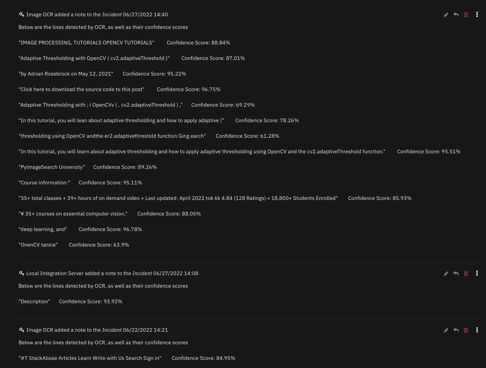
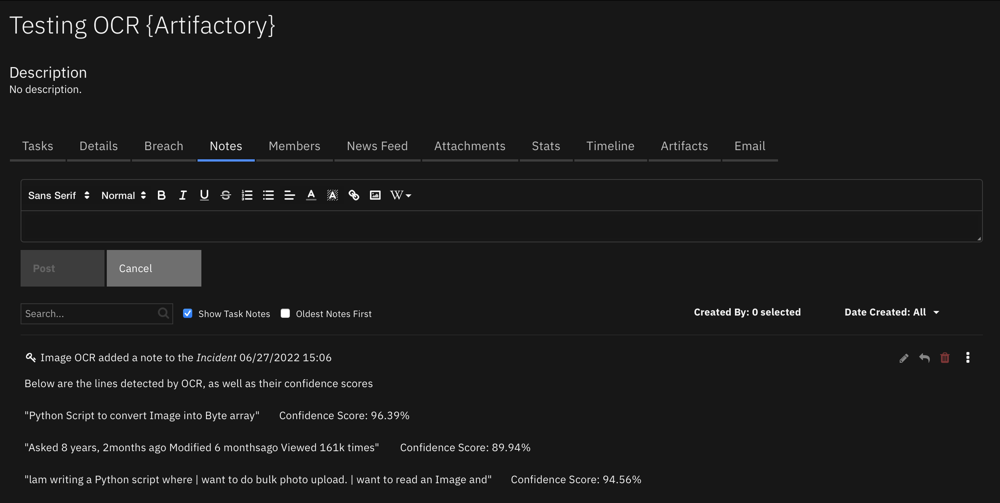

<!--
  This README.md is generated by running:
  "resilient-sdk docgen -p fn_ocr"

  It is best edited using a Text Editor with a Markdown Previewer. VS Code
  is a good example. Checkout https://guides.github.com/features/mastering-markdown/
  for tips on writing with Markdown

  All fields followed by "::CHANGE_ME::"" should be manually edited

  If you make manual edits and run docgen again, a .bak file will be created

  Store any screenshots in the "doc/screenshots" directory and reference them like:
  

  NOTE: If your app is available in the container-format only, there is no need to mention the integration server in this readme.
-->

# Image OCR

## Table of Contents
- [Release Notes](#release-notes)
- [Overview](#overview)
  - [Key Features](#key-features)
- [Requirements](#requirements)
  - [SOAR platform](#soar-platform)
  - [Cloud Pak for Security](#cloud-pak-for-security)
  - [Proxy Server](#proxy-server)
  - [Python Environment](#python-environment)
  - [Endpoint Developed With](#endpoint-developed-with)
- [Installation](#installation)
  - [Install](#install)
  - [App Configuration](#app-configuration)
- [Function - Read Text From Image Bytes](#function---read-text-from-image-bytes)
- [Playbooks](#playbooks)
- [Troubleshooting & Support](#troubleshooting--support)
---

## Release Notes
| Version | Date | Notes |
| ------- | ---- | ----- |
| 1.0.0 | 07/2022 | Initial Release | 

---

## Overview
**Resilient Circuits Components for 'fn_ocr'**

  

An App that introduces OCR functionality to SOAR, which can parse text from images. Uses Tesseract OCR, an open-source package with python bindings, to parse an image and return each line with an attached confidence metric.

### Key Features
* Parse a picture and return lines with associated average confidence, allowing for automated reading of screenshots and other images
* Accepts different languages and can filter based on a minimum confidence score per line 
* Can parse images from artifacts (see playbook) or directly using a Base64 string 

---

## Requirements
This app supports the IBM Security QRadar SOAR Platform and the IBM Security QRadar SOAR for IBM Cloud Pak for Security.
This app uses a custom build process on the backend which compiles tesseract and dependant libraries from source; this may lead to longer than average installation.
Please keep in mind that this app relies on Tesseract 5.0.1, which is popular open-source OCR. Any limitations found in Tesseract 5.0.1 will similary be present in this app e.g. rotated text cannot be detected if it is shorter than 70 characters.

### SOAR platform
The SOAR platform supports two app deployment mechanisms, App Host and integration server.

If deploying to a SOAR platform with an App Host, the requirements are:
* SOAR platform >= `43.1.49`.
* The app is in a container-based format (available from the AppExchange as a `zip` file).

If deploying to a SOAR platform with an integration server, the requirements are:
* SOAR platform >= `43.1.49`.
* The app is in the older integration format (available from the AppExchange as a `zip` file which contains a `tar.gz` file).
* Integration server is running `resilient-circuits>=45.0.0`.
* If using an API key account, make sure the account provides the following minimum permissions: 
  | Name | Permissions |
  | ---- | ----------- |
  | Incidents | Read |
  | Org Data | Read |
  | Function | Read |
  

The following SOAR platform guides provide additional information: 
* _App Host Deployment Guide_: provides installation, configuration, and troubleshooting information, including proxy server settings. 
* _Integration Server Guide_: provides installation, configuration, and troubleshooting information, including proxy server settings.
* _System Administrator Guide_: provides the procedure to install, configure and deploy apps. 

The above guides are available on the IBM Documentation website at [ibm.biz/soar-docs](https://ibm.biz/soar-docs). On this web page, select your SOAR platform version. On the follow-on page, you can find the _App Host Deployment Guide_ or _Integration Server Guide_ by expanding **Apps** in the Table of Contents pane. The System Administrator Guide is available by expanding **System Administrator**.

### Cloud Pak for Security
If you are deploying to IBM Cloud Pak for Security, the requirements are:
* IBM Cloud Pak for Security >= 1.4.
* Cloud Pak is configured with an App Host.
* The app is in a container-based format (available from the AppExchange as a `zip` file).

The following Cloud Pak guides provide additional information: 
* _App Host Deployment Guide_: provides installation, configuration, and troubleshooting information, including proxy server settings. From the Table of Contents, select Case Management and Orchestration & Automation > **Orchestration and Automation Apps**.
* _System Administrator Guide_: provides information to install, configure, and deploy apps. From the IBM Cloud Pak for Security IBM Documentation table of contents, select Case Management and Orchestration & Automation > **System administrator**.

These guides are available on the IBM Documentation website at [ibm.biz/cp4s-docs](https://ibm.biz/cp4s-docs). From this web page, select your IBM Cloud Pak for Security version. From the version-specific IBM Documentation page, select Case Management and Orchestration & Automation.

### Proxy Server
The app **does** support a proxy server.

### Python Environment
Additional package dependencies may exist for each of these packages:

* opencv-python-headless == 4.5.5.64
* resilient-circuits >= 45.0.0
* numpy >= 1.19
* pandas >= 1.1.5
* pytesseract == 0.3.8

### Endpoint Developed With

This app has been implemented using:
| Product Name | Product Version | API URL | API Version |
| ------------ | --------------- | ------- | ----------- |
|Tesseract OCR | 5.0.1 | None | None |

## Installation

### Install
* To install or uninstall an App or Integration on the _SOAR platform_, see the documentation at [ibm.biz/soar-docs](https://ibm.biz/soar-docs).
* To install or uninstall an App on _IBM Cloud Pak for Security_, see the documentation at [ibm.biz/cp4s-docs](https://ibm.biz/cp4s-docs) and follow the instructions above to navigate to Orchestration and Automation.

---

## Function - Read Text From Image Bytes
runs OCR on an image in byte string format and returns the relevant results

  

<details><summary>Inputs:</summary>
<p>

| Name | Type | Required | Example | Tooltip |
| ---- | :--: | :------: | ------- | ------- |
| `ocr_incident_id` | `number` | Yes | `-` | Automatically gathered by SOAR |
| `ocr_artifact_id` | `number` | No | `-` | Automatically gathered by SOAR |
| `ocr_attachment_id` | `number` | No | `-` | Automatically gathered by SOAR |
| `ocr_task_id` | `number` | No | `-` | Automatically gathered by SOAR |
| `ocr_base64` | `text` | No | `ZXhhbXBsZQo=` | When running the function without an artifact or attachment, it is possible to supply an image in base64 format |
| `ocr_confidence_threshold` | `number` | Yes | `50` | This is the minimum confidence considered before returning a line. Confidence of a line is the average confidence across all words in a line. This value defaults to 50, which means the app will return any line with an average confidence of 50% or more. We recommend a value greater than 80 for sensible results |
| `ocr_language` | `select` | Yes | `eng` | This determines what language Tesseract will look for i.e. if the text is in arabic, we would specify 'ara'. See next toggle heading for a table of languages and their corresponding code. This can always be checked [here](https://tesseract-ocr.github.io/tessdoc/Data-Files-in-different-versions.html), and the Dockerfile contains steps on how to install your own language |


</p>
</details>
<details><summary>Language Codes:</summary>
<p>

| Language | Language Code | Info |
| :----: | :----: | :----: |
| English | `eng` | Default in SOAR |
| Arabic | `ara` | `-`|
| Spanish | `spa` | `-` |
| Chinese Simplified | `chi_sim` | Can also be read vertically |
| Chinese Traditional | `chi_tra` | Can also be read vertically |
| French | `fra` | `-`|
| German | `deu` | `-`|
| Korean | `kor` | Can also be read vertically |
| Japanese | `jpn` | Can also be read vertically |

</p>
</details>
<details><summary>Outputs:</summary>
<p>

> **NOTE:** This example might be in JSON format, but `results` is a Python Dictionary on the SOAR platform.

```python
results = {
  "content": [
    {
      "confidence": 93.921173,
      "text": "Description"
    }
  ],
  "inputs": {
    "ocr_artifact_id": 23,
    "ocr_base64": null,
    "ocr_confidence_threshold": 49,
    "ocr_incident_id": 2098,
    "ocr_language": "eng",
    "ocr_task_id": null
  },
  "metrics": {
    "execution_time_ms": 1161,
    "host": "Host",
    "package": "fn-ocr",
    "package_version": "1.0.1",
    "timestamp": "2022-06-27 14:08:28",
    "version": "1.0"
  },
  "raw": null,
  "reason": null,
  "success": true,
  "version": 2.0
}
```

</p>
</details>

<details><summary>Example Pre-Process Script:</summary>
<p>

```python
inputs.ocr_incident_id = incident.id
inputs.ocr_attachment_id = attachment.id if attachment.id else None
inputs.ocr_task_id = task.id if task and task.id else None
inputs.ocr_confidence_threshold = rule.properties.ocr_confidence_threshold
inputs.ocr_language = rule.properties.ocr_language
inputs.ocr_base64 = None
```

</p>
</details>

<details><summary>Example Post-Process Script:</summary>
<p>

```python
content = workflow.properties.ocr_results["content"]

if content is not None:
  output_text = "Below are the lines detected by OCR, as well as their confidence scores\n\n"
  for line in content:
    output_text += '"' + line["text"] + f'" \t\t Confidence Score: {round(line["confidence"],2)}%\n\n'
  
  
  
  incident.addNote(output_text)
```

</p>
</details>

---

## Troubleshooting & Support
Refer to the documentation listed in the Requirements section for troubleshooting information.

### For Support
This is a IBM Community provided App. Please search the Community [ibm.biz/soarcommunity](https://ibm.biz/soarcommunity) for assistance.
