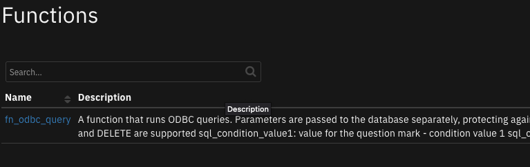
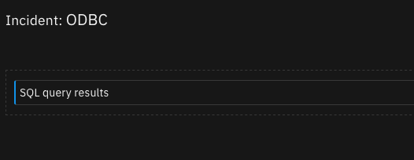
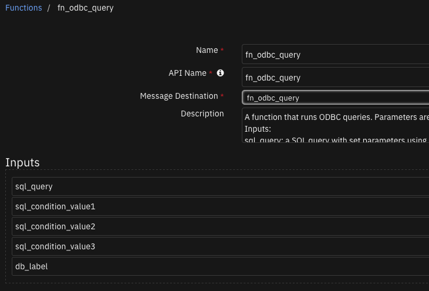

# fn_odbc_query

## Table of Contents
- [Release Notes](#release-notes)
- [Overview](#overview)
  - [Key Features](#key-features)
- [Requirements](#requirements)
  - [SOAR platform](#soar-platform)
  - [Cloud Pak for Security](#cloud-pak-for-security)
  - [Proxy Server](#proxy-server)
  - [Python Environment](#python-environment)
- [Installation](#installation)
  - [Install](#install)
  - [App Configuration](#app-configuration)
  - [Custom Layouts](#custom-layouts)
- [Function - fn_odbc_query](#function---fn_odbc_query)
- [Data Table - SQL query results](#data-table---sql-query-results)
- [Rules](#rules)
- [Troubleshooting & Support](#troubleshooting--support)
---

## Release Notes
| Version | Date | Notes |
| ------- | ---- | ----- |
| 1.1.0 | 09/2022 | Add support for mulit-tenancy |
| 1.0.3 | 07/2020 | App Host Support |
| 1.0.2 | 02/2019 | Added Python 3.6 support |
| 1.0.1 | 12/2019 | Documentation update and "Example ODBC SELECT PostgreSQL Workflow" update |
| 1.0.0 | 06/2018 | Initial Release |

* For customers upgrading from a previous release to 1.1.0 or greater, the app.config file must be manually edited to add new settings required to each server configuration. See [1.1.0 Changes](#1.1.0-changes)


---

## Overview
The ODBC Query Function establishes an OBDC connection to the desired SQL database server and executes SELECT, INSERT, UPDATE or DELETE SQL statements.

**SOAR Components for 'fn_odbc_query'**

 

ODBC Functions for SOAR

### Key Features
* Ability to perform SELECT, INSERT, UPDATE, and DELETE operations on relational databases.
* Support for MySQL/MariaDB, Postgres, oracle, and Microsoft SQL Server.
* Compatible with App Host.
* Supportt for having multiple databases configured in the app.config
* Contains preconfigured drivers if using the container format.

---

## Requirements
This app supports the IBM Security QRadar SOAR Platform and the IBM Security QRadar SOAR for IBM Cloud Pak for Security.

### SOAR platform
The SOAR platform supports two app deployment mechanisms, App Host and integration server.

If deploying to a SOAR platform with an App Host, the requirements are:
* SOAR platform >= `44.0.7585`.
* The app is in a container-based format (available from the AppExchange as a `zip` file).

If deploying to a SOAR platform with an integration server, the requirements are:
* SOAR platform >= `44.0.7585`.
* The app is in the older integration format (available from the AppExchange as a `zip` file which contains a `tar.gz` file).
* Integration server is running `resilient_circuits>=43.0.0`.
* If using an API key account, make sure the account provides the following minimum permissions: 
  | Name | Permissions |
  | ---- | ----------- |
  | Org Data | Read |
  | Function | Read |

The following SOAR platform guides provide additional information: 
* _App Host Deployment Guide_: provides installation, configuration, and troubleshooting information, including proxy server settings. 
* _Integration Server Guide_: provides installation, configuration, and troubleshooting information, including proxy server settings.
* _System Administrator Guide_: provides the procedure to install, configure and deploy apps. 

The above guides are available on the IBM Documentation website at [ibm.biz/soar-docs](https://ibm.biz/soar-docs). On this web page, select your SOAR platform version. On the follow-on page, you can find the _App Host Deployment Guide_ or _Integration Server Guide_ by expanding **Apps** in the Table of Contents pane. The System Administrator Guide is available by expanding **System Administrator**.

### Cloud Pak for Security
If you are deploying to IBM Cloud Pak for Security, the requirements are:
* IBM Cloud Pak for Security >= 1.10.
* Cloud Pak is configured with an App Host.
* The app is in a container-based format (available from the AppExchange as a `zip` file).

The following Cloud Pak guides provide additional information: 
* _App Host Deployment Guide_: provides installation, configuration, and troubleshooting information, including proxy server settings. From the Table of Contents, select Case Management and Orchestration & Automation > **Orchestration and Automation Apps**.
* _System Administrator Guide_: provides information to install, configure, and deploy apps. From the IBM Cloud Pak for Security IBM Documentation table of contents, select Case Management and Orchestration & Automation > **System administrator**.

These guides are available on the IBM Documentation website at [ibm.biz/cp4s-docs](https://ibm.biz/cp4s-docs). From this web page, select your IBM Cloud Pak for Security version. From the version-specific IBM Documentation page, select Case Management and Orchestration & Automation.

### Proxy Server
The app does not support a proxy server.

### Python Environment
Both Python 3.6 and Python 3.9 are supported.
Additional package dependencies may exist for each of these packages:
* pyodbc~=4.0
* resilient_circuits>=43.0.0

---

## Installation

### Install
* To install or uninstall an App or Integration on the _SOAR platform_, see the documentation at [ibm.biz/soar-docs](https://ibm.biz/soar-docs).
* To install or uninstall an App on _IBM Cloud Pak for Security_, see the documentation at [ibm.biz/cp4s-docs](https://ibm.biz/cp4s-docs) and follow the instructions above to navigate to Orchestration and Automation.

### App Configuration
The following table provides the settings you need to configure the app. These settings are made in the app.config file. See the documentation discussed in the Requirements section for the procedure.

| Config | Required | Example | Description |
| ------ | :------: | ------- | ----------- |
| **sql_autocommit** | No | `true` | *Executes commits automatically after every SQL statement* |
| **sql_connection_string** | Yes | `Driver={PostgreSQL};Server=IPAddress;Port=5432;Database=myDataBase;Uid=myUserName;Pwd=myPassword;` | *Connection string* |
| **sql_database_type** | Yes | `PostgreSQL` | *Supported setting to use by using one of the keywords: MariaDB, PostgreSQL, MySQL, SQLServer* |
| **sql_number_of_records_returned** | No | `10` | *Number of rows to fetch* |
| **sql_restricted_sql_statements** | No | `["delete", "insert", "update"]` | *Restricted SQL statements as a list, separated by a comma, using square brackets.* |
| **sql_query_timeout** | No | `30` | *Query timeout in seconds.* |

#### 1.1.0 Changes
Starting in version 1.1.0, more than one ODBC database can be configured for SOAR case data synchronization. For enterprises with only one ODBC database, your app.config file will continue to define the ODBC database under the `[fn_odbc_query]` section header.

For enterprises with more than one ODBC database, each database will have it's own section header, such as `[fn_odbc_query:database_label1]` where `database_label1` represents any label helpful to define your ODBC environment.

Be aware that modifications to the workflows will be needed to correctly pass this label through the `db_label` function input field if the ODBC database/dattabases in the app.config have labels.

If using the app.config from before version 1.1.0 then the `db_label` field can be ignored.

If you have existing custom workflows, see [Creating workflows when database/databases in app.config are labeled](#creating-workflows-when-databasedatabases-in-appconfig-are-labeled) for more information about changing them to reference the `db_label` function input field.

### Custom Layouts
* Import the Data Tables and Custom Fields like the screenshot below:

  


---

## Function - fn_odbc_query
A function that runs ODBC queries. Parameters are passed to the database separately, protecting against SQL injection attacks.
Inputs:
sql_query: a SQL query with set parameters using a question mark as a place holder, SQL statements SELECT, INSERT, UPDATE and DELETE are supported
sql_condition_value1: value for the question mark - condition value 1
sql_condition_value2: value for the question mark - condition value 2
sql_condition_value3: value for the question mark - condition value 3

 

<details><summary>Inputs:</summary>
<p>

| Name | Type | Required | Example | Tooltip |
| ---- | :--: | :------: | ------- | ------- |
| `db_label` | `text` | No | `-` | Label given to the database you wish to use or leave blank when databases are not labeled in the app.config.|
| `sql_condition_value1` | `text` | No | `-` | - |
| `sql_condition_value2` | `text` | No | `-` | - |
| `sql_condition_value3` | `text` | No | `-` | - |
| `sql_query` | `textarea` | Yes | `-` | Predefined SQL statement |

</p>
</details>

<details><summary>Outputs:</summary>
<p>

> **NOTE:** This example might be in JSON format, but `results` is a Python Dictionary on the SOAR platform.

```python
results = {
  "content": {
    "entries": null
  },
  "inputs": {
    "db_label": "database_label1",
    "sql_condition_value1": "9",
    "sql_condition_value2": "Bob",
    "sql_query": "UPDATE mock_data SET id = ? WHERE first_name = ?"
  },
  "metrics": {
    "execution_time_ms": 1107,
    "host": "local",
    "package": "fn-odbc-query",
    "package_version": "1.1.0",
    "timestamp": "2022-09-28 13:19:58",
    "version": "1.0"
  },
  "raw": null,
  "reason": null,
  "success": true,
  "version": 2.0
}
```

</p>
</details>

<details><summary>Example Pre-Process Script:</summary>
<p>

```python
inputs.sql_condition_value1 = artifact.value
inputs.db_label = rule.properties.db_label
```

</p>
</details>

<details><summary>Example Post-Process Script:</summary>
<p>

```python
# This list contains SOAR data table api field names.
# Exclude fist two columns 'sql_artifact_value' and 'sql_timestamp' from this list.
# Modify this list acording to your SOAR data table fields.
DATATABLE_COLUMN_NAMES_LIST = [
  "sql_column_1",
  "sql_column_2",
  "sql_column_3",
  "sql_column_4",
  "sql_column_5"]

# Processing
from java.util import Date

if results.get("content").get("entries"):
  for entry in results['content'].get("entries"):
    table = incident.addRow("sql_query_results_dt")
    table['sql_artifact_value'] = artifact.value
    table['sql_timestamp'] = Date()

    for item in DATATABLE_COLUMN_NAMES_LIST:
      if item in entry:
        try:
          table[item] = entry[item]
        except IndexError:
          table[item] = ""
```

</p>
</details>

---


## Data Table - SQL query results

 

#### API Name:
sql_query_results_dt

#### Columns:
| Column Name | API Access Name | Type | Tooltip |
| ----------- | --------------- | ---- | ------- |
| sql_artifact_value | `sql_artifact_value` | `text` | - |
| sql_column_1 | `sql_column_1` | `text` | - |
| sql_column_2 | `sql_column_2` | `text` | - |
| sql_column_3 | `sql_column_3` | `text` | - |
| sql_column_4 | `sql_column_4` | `text` | - |
| sql_column_5 | `sql_column_5` | `text` | - |
| sql_column_6 | `sql_column_6` | `text` | - |
| sql_timestamp | `sql_timestamp` | `datetimepicker` | - |

---


## Rules
| Rule Name | Object | Workflow Triggered |
| --------- | ------ | ------------------ |
| Example ODBC DELETE PostgreSQL | artifact | `example_odbc_delete_postgresql` |
| Example ODBC INSERT PostgreSQL | artifact | `example_odbc_insert_postgresql` |
| Example ODBC SELECT PostgreSQL | artifact | `example_odbc_select_postgresql` |
| Example ODBC UPDATE PostgreSQL | artifact | `example_odbc_update_postgresql` |

---

## How to configure to use a single ODBC database
To use only a single database there are two ways this can be configured
1. Use the configuration used in ODBC Query versions prior to V1.1.0
```
[fn_odbc_query]
sql_connection_string=Driver={PostgreSQL};Server=IPAddress;Port=5432;Database=myDataBase;Uid=myUserName;Pwd=myPassword;
sql_restricted_sql_statements=["delete", "insert", "update"]
sql_number_of_records_returned=10
sql_autocommit=true
sql_database_type=PostgreSQL
#sql_query_timeout=10
```
2. Specify a ODBC database label meaningful to your environment. The label has no other significance.
```
[fn_odbc_query:database_label1]
sql_connection_string=Driver={PostgreSQL};Server=IPAddress;Port=5432;Database=myDataBase;Uid=myUserName;Pwd=myPassword;
sql_restricted_sql_statements=["delete", "insert", "update"]
sql_number_of_records_returned=10
sql_autocommit=true
sql_database_type=PostgreSQL
#sql_query_timeout=10
```

## Creating workflows when database/databases in app.config are labeled
The function input field `db_label` is required when ODBC database/databases in the app.config are labeled. In the example workflows pre-process scripts the
input field `db_label` is defined the following way,
```python
inputs.db_label = rule.properties.db_label
```
The rule field `db_label` is a text field in which the user enters the label of the database they wish to use.

## Troubleshooting & Support
Refer to the documentation listed in the Requirements section for troubleshooting information.

### For Support
This is a IBM Community provided App. Please search the Community [ibm.biz/soarcommunity](https://ibm.biz/soarcommunity) for assistance.
