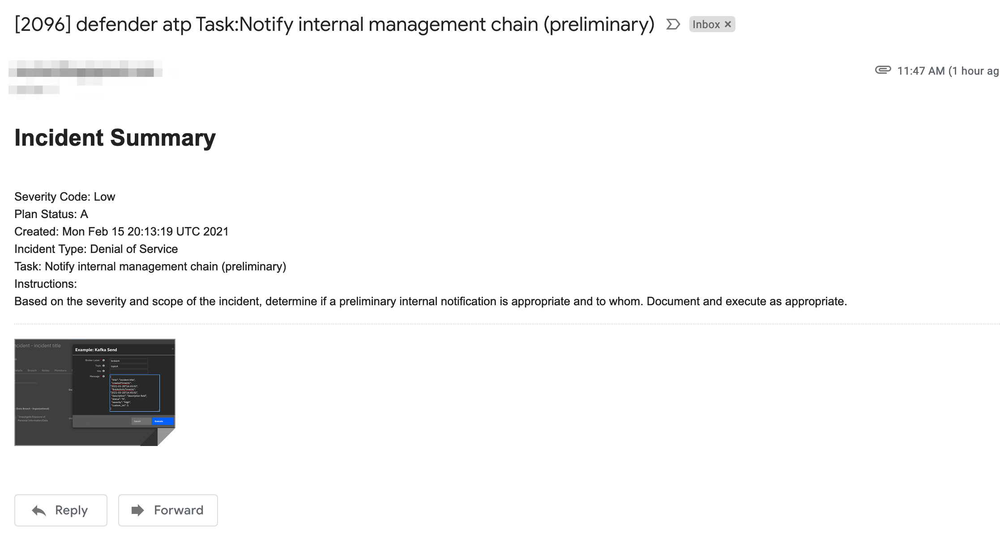
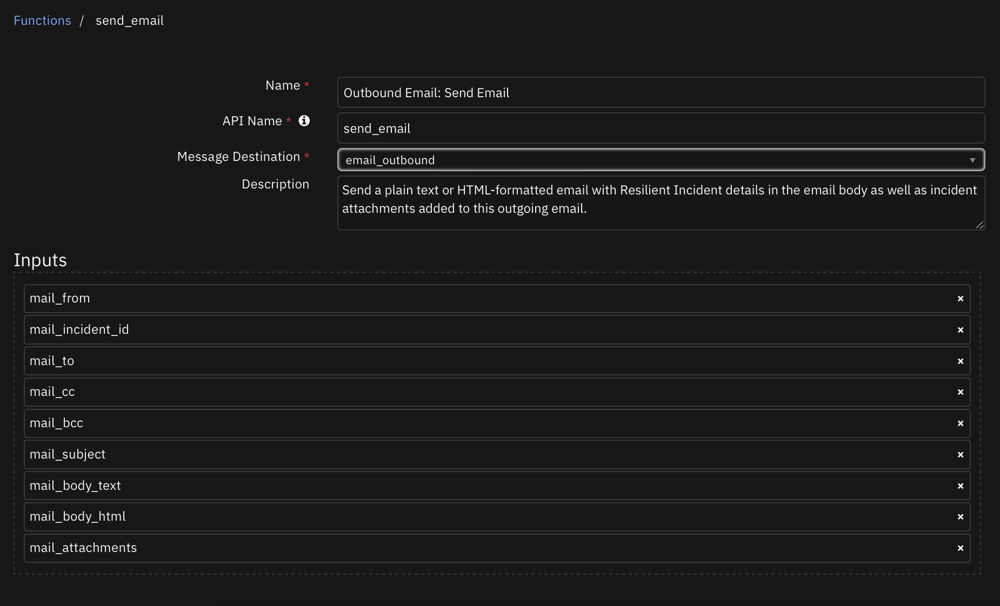

## Table of Contents
- [Release Notes](#release-notes)
- [Overview](#overview)
  - [Key Features](#key-features)
- [Requirements](#requirements)
  - [SOAR platform](#soar-platform)
  - [Cloud Pak for Security](#cloud-pak-for-security)
  - [Proxy Server](#proxy-server)
- [Installation](#installation)
  - [Install](#install)
  - [App Configuration](#app-configuration)
- [Function - Outbound Email: Send Email](#function---outbound-email-send-email)
- [Rules](#rules)
- [Troubleshooting & Support](#troubleshooting--support)
---

## Release Notes
<!--
  Specify all changes in this release. Do not remove the release
  notes of a previous release
-->

| Version | Date | Notes |
| ------- | ---- | ----- |
| v1.3.1 | 1/2022 | Bug fixes for get_datatable function in template_helper.py |
| v1.3.0 | 7/2021 | Username in app.config does not need to be an email |
| v1.2.1 | 5/2021 | Bug fix for python 2 |
| v1.2.0 | 4/2021 | Added capability for task attachments |
| v1.1.1 | 2/2021 | Bug fixes associated with sending attachments |
| v1.1.0 | 10/2020 | Bug fixes and send all or specific attachments |
| v1.0.9 | 5/2020 | App Host compatibility |
| v1.0.8 | 4/2020 | Initial Release after internal development by Professional Services, no prior release notes |
* For customers upgrading from a pervious release, the app.config file must be manually edited.

---

## Overview
<!--
  Provide a high-level description of the function itself and its remote software or application.
  The text below is parsed from the "description" and "long_description" attributes in the setup.py file
-->
**IBM QRadar SOAR app for 'fn_outbound_email'**

 

IBM QRadar SOAR app for 'fn_outbound_email'

### Key Features
<!--
  List the Key Features of the Integration
-->
* Send email to lists of recipients (to, cc, bcc)
* Format email using a predefined html template or specify your own template
* Send attachments with the email at the incident level or task level.
* Example rules included at the incident and task levels
---

## Requirements
<!--
  List any Requirements
-->
This app supports the IBM QRadar SOAR Platform and the IBM Cloud Pak for Security.

### SOAR platform
The SOAR platform supports two app deployment mechanisms, App Host and integration server.

If deploying to a SOAR platform with an App Host, the requirements are:
* SOAR platform >= `41.0.0`.
* The app is in a container-based format (available from the AppExchange as a `zip` file).

If deploying to a SOAR platform with an integration server, the requirements are:
* SOAR platform >= `41.0.0`.
* The app is in the older integration format (available from the AppExchange as a `zip` file which contains a `tar.gz` file).
* Integration server is running `resilient_circuits`.
* If using an API key account, make sure the account provides the following minimum permissions:
    * Org Data: Read and Edit
    * Incident: Read
    * Functions: Read

The following SOAR platform guides provide additional information:
* _App Host Deployment Guide_: provides installation, configuration, and troubleshooting information, including proxy server settings.
* _Integration Server Guide_: provides installation, configuration, and troubleshooting information, including proxy server settings.
* _System Administrator Guide_: provides the procedure to install, configure and deploy apps.

The above guides are available on the IBM Knowledge Center at [ibm.biz/soar-docs](https://ibm.biz/soar-docs). On this web page, select your SOAR platform version. On the follow-on page, you can find the _App Host Deployment Guide_ or _Integration Server Guide_ by expanding **Apps** in the Table of Contents pane. The System Administrator Guide is available by expanding **System Administrator**.

### Cloud Pak for Security
If you are deploying to IBM Cloud Pak for Security, the requirements are:
* IBM Cloud Pak for Security >= 1.4.
* Cloud Pak is configured with an App Host.
* The app is in a container-based format (available from the AppExchange as a `zip` file).

The following Cloud Pak guides provide additional information:
* _App Host Deployment Guide_: provides installation, configuration, and troubleshooting information, including proxy server settings. From the Table of Contents, select Case Management and Orchestration & Automation > **Orchestration and Automation Apps**.
* _System Administrator Guide_: provides information to install, configure, and deploy apps. From the IBM Cloud Pak for Security Knowledge Center table of contents, select Case Management and Orchestration & Automation > **System administrator**.

These guides are available on the IBM Knowledge Center at [ibm.biz/cp4s-docs](https://ibm.biz/cp4s-docs). From this web page, select your IBM Cloud Pak for Security version. From the version-specific Knowledge Center page, select Case Management and Orchestration & Automation.

### Proxy Server
The app **does not** support a proxy server.

---

## Installation

### Install
* To install or uninstall an App or Integration on the _SOAR platform_, see the documentation at [ibm.biz/soar-docs](https://ibm.biz/soar-docs).
* To install or uninstall an App on _IBM Cloud Pak for Security_, see the documentation at [ibm.biz/cp4s-docs](https://ibm.biz/cp4s-docs) and follow the instructions above to navigate to Orchestration and Automation.

### App Configuration
The following table provides the settings you need to configure the app. These settings are made in the app.config file. See the documentation discussed in the Requirements section for the procedure.

| Config | Required | Example | Description |
| ------ | :------: | ------- | ----------- |
| **smtp_server** | Yes | `xxx.xxx.xxx.xxx` | *IP Address or fully qualified domain name for smpt server* |
| **smtp_user** | Yes | `` | *smtp authentication user* |
| **smtp_password** | Yes | `` | *smtp authentication user password* |
| **from_email_address** | No | `a@example.com` | *Introduced in 1.3.0. Email address for use as email sender* |
| **smtp_port** | Yes | `25` | *Defaults to unauthenticated, 587/2525 for TLS* |
| **smtp_conn_timeout** | Yes | `20` | *Timeout value in seconds to wait for a connection* |
| **smtp_ssl_mode** | Yes | `None` | *set to 'starttls' when using smtp_user and smtp_password* |
| **smtp_ssl_cafile** | Yes | `` | *false or /path/to/smtp_certifcate.pem or crt file* |
| **template_file** | Yes | `data/example_send_email.jinja` | */path/to/template.jinja for rendering the email body* |


---

## Function - Outbound Email: Send Email
Send a plain text or HTML-formatted email with SOAR Incident details in the email body as well as incident attachments added to this outgoing email.

 

<details><summary>Inputs:</summary>
<p>

| Name | Type | Required | Example | Tooltip |
| ---- | :--: | :------: | ------- | ------- |
| `mail_attachments` | `text` | No | `-` | comma separated list of attachments or '*' for all |
| `mail_bcc` | `text` | No | `-` | comma separated list of bcc recipients |
| `mail_body_html` | `text` | No | `-` | jinja template file to use to produce html email content from incident data. This content overrides the use of the `template_file` setting in our app.config file |
| `mail_body_text` | `text` | No | `-` | Already rendered email body content |
| `mail_cc` | `text` | No | `-` | comma separated list of cc recipients |
| `mail_from` | `text` | No | `-` | email sender |
| `mail_incident_id` | `number` | No | `-` | incident_id |
| `mail_subject` | `text` | No | `-` | email subject |
| `mail_to` | `text` | No | `-` | comma separated list of email recipients |

</p>
</details>

<details><summary>Outputs:</summary>
<p>

```python
results = {
  "version": "1.0",
  "success": true,
  "reason": null,
  "content": {
    "inputs": [
      "aExample@email.com",
      "Example@email.com",
      "",
      "",
      "[2104] example"
    ],
    "message": null,
    "text": "\n\n<table width=\"100%\" >\n<tr>\n    <td colspan=\"2\">\n        <h3 style=\"color: rgb(68,114,196)\">INCIDENT DETAILS</h3>\n        <hr size=\"1\" width=\"100%\" noshade style=\"color:#FFDF57\" align=\"center\"/>\n    </td>\n</tr>\n    \n\t\n    \n    <tr>\n        <td width=\"100\" style=\"font-family: Calibri; color: rgb(31,73,125); font-weight:bold\">Severity:</td>\n        <td style=\"font-family: Calibri; color: rgb(31,73,125)\">Low</td>\n    </tr>\n    \n    \n\t\n    \n    <tr>\n        <td width=\"100\" style=\"font-family: Calibri; color: rgb(31,73,125); font-weight:bold\">Status:</td>\n        <td style=\"font-family: Calibri; color: rgb(31,73,125)\">A</td>\n    </tr>\n    <br>\n    \n\t\n    \n    <tr>\n        <td width=\"100\" style=\"font-family: Calibri; color: rgb(31,73,125); font-weight:bold\">Created:</td>\n        <td style=\"font-family: Calibri; color: rgb(31,73,125)\">2022-01-25T14:48:32.389000</td>\n    </tr>\n    <br>\n    \n\t\n    \n<tr>\n    <td colspan=\"2\">\n        <br><h3 style=\"color: rgb(68,114,196)\">INCIDENT DESCRIPTION</h3>\n        <hr size=\"1\" width=\"100%\" noshade style=\"color:#FFDF57\" align=\"center\"/>\n    </td>\n    \n\t\n    \n</tr>\n</table>\n<br>",
    "success": false
  },
  "raw": "",
  "inputs": {
    "mail_to": "Example@email.com",
    "mail_incident_id": 2104,
    "mail_attachments": null,
    "mail_subject": "[2104] example",
    "mail_body_html": "\n\n\t\n\t\n    \n    <tr>\n        <td width=\"100\" style=\"{{style}}; font-weight:bold\">{{ label }}</td>\n        <td style=\"{{style}}\">{{ value | striptags }}</td>\n    </tr>\n    \n\n<table width=\"100%\" >\n<tr>\n    <td colspan=\"2\">\n        <h3 style=\"color: rgb(68,114,196)\">INCIDENT DETAILS</h3>\n        <hr size=\"1\" width=\"100%\" noshade style=\"color:#FFDF57\" align=\"center\"/>\n    </td>\n</tr>\n    {{ get_row('Severity:','severity_code') }}\n    {{ get_row('Status:','plan_status') }}<br>\n    {{ get_row('Created:','create_date') }}<br>\n    {{ get_row('Category:','incident_type_ids') }}\n<tr>\n    <td colspan=\"2\">\n        <br><h3 style=\"color: rgb(68,114,196)\">INCIDENT DESCRIPTION</h3>\n        <hr size=\"1\" width=\"100%\" noshade style=\"color:#FFDF57\" align=\"center\"/>\n    </td>\n    {{ get_row('Description:','description') }}\n</tr>\n</table>\n<br>\n",
    "mail_from": "changeme@resilientsystems.com",
    "mail_cc": null
  },
  "metrics": {
    "version": "1.0",
    "package": "fn-outbound-email",
    "package_version": "1.3.1",
    "execution_time_ms": 1977,
    "timestamp": "2022-01-25 09:48:57"
  }
}
```

</p>
</details>

<details><summary>Example Pre-Process Script:</summary>
<p>

```python
inputs.mail_to = rule.properties.mail_to
inputs.mail_cc = rule.properties.mail_cc
inputs.mail_attachments = rule.properties.mail_attachments
inputs.mail_incident_id = incident.id
inputs.mail_from = "changeme@resilientsystems.com"
inputs.mail_subject = u"[{0}] {1}".format(incident.id, incident.name)

inputs.mail_body_html = """

	
	
    
    <tr>
        <td width="100" style="{{style}}; font-weight:bold">{{ label }}</td>
        <td style="{{style}}">{{ value | striptags }}</td>
    </tr>
    

<table width="100%" >
<tr>
    <td colspan="2">
        <h3 style="color: rgb(68,114,196)">INCIDENT DETAILS</h3>
        <hr size="1" width="100%" noshade style="color:#FFDF57" align="center"/>
    </td>
</tr>
    {{ get_row('Severity:','severity_code') }}
    {{ get_row('Status:','plan_status') }}<br>
    {{ get_row('Created:','create_date') }}<br>
    {{ get_row('Category:','incident_type_ids') }}
<tr>
    <td colspan="2">
        <br><h3 style="color: rgb(68,114,196)">INCIDENT DESCRIPTION</h3>
        <hr size="1" width="100%" noshade style="color:#FFDF57" align="center"/>
    </td>
    {{ get_row('Description:','description') }}
</tr>
</table>
<br>
"""
```

</p>
</details>

<details><summary>Example Post-Process Script:</summary>
<p>

```python
if results.success:
  noteText = u"""Email Sent if mail server is valid/authenticated\n
  <br>From: {0}<br> To: {1}<br> CC: {2}<br> BCC: {3}<br> Subject: {4} <br>
  Body: {5} <br>""".format(results.content.inputs[0].strip("u\"[]"), results.content.inputs[1].strip("u\"[]"), results.content.inputs[2].strip("u\"[]"), results.content.inputs[3].strip("u\"[]"), results.content.inputs[4].strip("u\""), results.content.text)
else:
  noteText = u"Email NOT Sent\n From: {0}\n To: {1}".format(results.content.inputs[0].strip("u\"[]"), results.content.inputs[1].strip("u\"[]"))
incident.addNote(helper.createRichText(noteText))
```

</p>
</details>

---

## Rules
| Rule Name | Object | Workflow Triggered |
| --------- | ------ | ------------------ |
| Example: Send Incident Email HTML | incident | `example_send_incident_email_html` |
| Example: Send Incident Email Text | incident | `example_send_incident_email_text` |
| Example: Send Task Email HTML | task | `example_send_task_email_html` |

---

## Troubleshooting & Support

### Common connection issues with TLS and TroubleShooting

Use `resilient-circuits selftest -l fn-outbound-email` to confirm if your connection is successful.
```
fn-outbound-email:
    SMTP AUTH extension not supported by server.
    selftest: failure, Elapsed time: 0.416000 seconds
```

* Email servers are often restrictive on which applications/users that are authorized to send emails, for instance if you have 2FA authentication enabled on a gmail account, you must add a specific application password or allow less secure apps (Not recommended)

    https://hotter.io/docs/email-accounts/app-password-gmail/

   https://hotter.io/docs/email-accounts/secure-app-gmail/

* Occasionally, mailservers may indicate that emails have been sent successfully (including a successful note on the the associated incident) and yet they be blocked by the receiving mailserver due to insecure spam filters. This is a limitation of SMTP authentication mechanism.

* The port of TLS handshakes may also differ between mailservers (587/2525), a short history of port allocation can be found at:
https://pepipost.com/blog/25-465-587-2525-choose-the-right-smtp-port/

* More info on smtp protocol:

  https://pepipost.com/blog/what-is-smtp

* Some mailservers will not work with this level of authentication/protocal.

---

### For Support
This is a IBM Community provided App. Please search the Community https://ibm.biz/soarcommunity for assistance and use the [My Support link](https://ibm.com/mysupport) to open a support case.
