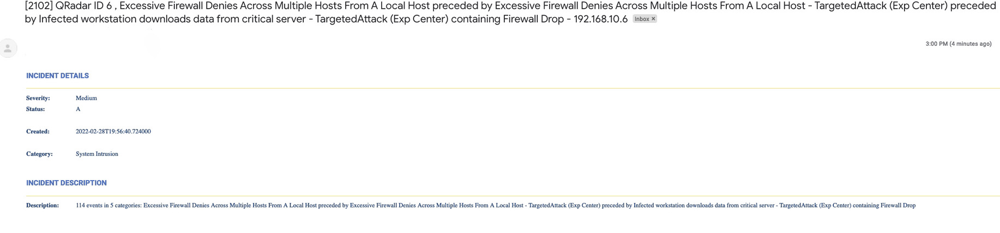

## Table of Contents
- [Release Notes](#release-notes)
  - [v2.0 Changes](#v2_0-changes)
- [Overview](#overview)
  - [Key Features](#key-features)
- [Requirements](#requirements)
  - [SOAR platform](#soar-platform)
  - [Cloud Pak for Security](#cloud-pak-for-security)
  - [Proxy Server](#proxy-server)
  - [Python Environment](#python-environment)
- [Installation](#installation)
  - [Install](#install)
  - [App Configuration](#app-configuration)
  - [2.0 Changes](#2_0-changes)
- [Function - Outbound Email: Send Email](#function---outbound-email-send-email)
- [Function - Outbound Email: Send Email 2](#function---outbound-email-send-email-2)
- [Script - Save Outbound Email Results](#script---save-outbound-email-results)
- [Data Table - Email Conversations](#data-table---email-conversations)
- [Rules](#rules)
- [Enhancements for Multiple Templates and Attachment & Notes Inclusion](#enhancements-for-multiple-templates-and-attachment--notes-inclusion)
- [Troubleshooting & Support](#troubleshooting--support)
---

## Release Notes
<!--
  Specify all changes in this release. Do not remove the release
  notes of a previous release
-->

| Version | Date | Notes |
| ------- | ---- | ----- |
| v2.1.0 | 1/2023 | Added message signing and encryption capabilities |
| v2.0.2 | 12/2022 | Bug fix when specifying your own default template |
| v2.0.1 | 10/2022 | Bug fix |
| v2.0.0 | 10/2022 | Added OAuth 2.0 support for SMTP. Multiple out of box changes |
| v1.3.1 | 1/2022 | Bug fixes for get_datatable function in template_helper.py |
| v1.3.0 | 7/2021 | Username in app.config does not need to be an email |
| v1.2.1 | 5/2021 | Bug fix for python 2 |
| v1.2.0 | 4/2021 | Added capability for task attachments |
| v1.1.1 | 2/2021 | Bug fixes associated with sending attachments |
| v1.1.0 | 10/2020 | Bug fixes and send all or specific attachments |
| v1.0.9 | 5/2020 | Edge Gateway (formerly App Host) compatibility |
| v1.0.8 | 4/2020 | Initial Release |


### v2.0 Changes
Version 2.0 represents a comprehensive set of changes to make the use of outbound email more out-the-box
with inbound mail. This release incorporates many changes which are summarized here:

* Unified display of inbound emails with outbound email through a datatable. See [Script - Outbound Email Results](#script---outbound-email-results) and [Datatable - Email Conversations].(#datatable---email-conversations).
* Auto modification of the Email tab to include email conversations datatable.
* Multiple template support defined in the app.config file.
* Expanded template capability supporting notes, artifacts and links back to SOAR. See [Enhancements for Multiple Templates and Attachment & Notes Inclusion](#enhancements-for-multiple-templates-and-attachment--notes-inclusion).
* Additional header available for outbound email (i.e. message-id, in-reply-to, importance).
* A new function to preserve the original outbound email capability and allow all the new functionality in
v2.0 to be added. See [Function - Outbound Email: Send Email2](#function---outbound-email-send-email2).
* OAuth authenticateion
---

## Overview
<!--
  Provide a high-level description of the function itself and its remote software or application.
  The text below is parsed from the "description" and "long_description" attributes in the setup.py file
-->
**IBM QRadar SOAR app for Outbound Email**

 

The Outbound Email App for IBM SOAR provides a way of sending email from the SOAR platform. The email message contains information about the incident that the email action was performed on.

### Key Features
<!--
  List the Key Features of the Integration
-->
The Outbound Email App provides the following functionality:
* Send email to lists of recipients (to, cc, bcc).
* Format email using a predefined html template or specify your own template.
* Send attachments with the email at the incident level or task level.
* Example rules included at the incident and task levels.

New in version 2.0
* Ability to reference additional email headers: message-id, importance, in-reply-to.
* Define multiple templates from the app.config file.
* Capture outbound email conversations including both inbound and outbound messages.
* Expanded template support to include artifact, notes and SOAR links (case and task).
* Support for OAuth authentication.
---

## Requirements
<!--
  List any Requirements
-->
This app supports the IBM QRadar SOAR Platform and the IBM Cloud Pak for Security.

### SOAR platform
The SOAR platform supports two app deployment mechanisms, Edge Gateway (formerly App Host) and integration server.

If deploying to a SOAR platform with an Edge Gateway, the requirements are:
* SOAR platform >= `45.0.0`.
* The app is in a container-based format (available from the AppExchange as a `zip` file).

If deploying to a SOAR platform with an integration server, the requirements are:
* SOAR platform >= `45.0.0`.
* The app is in the older integration format (available from the AppExchange as a `zip` file which contains a `tar.gz` file).
* Integration server is running `resilient_circuits`.
* If using an API key account, make sure the account provides the following minimum permissions:
    * Org Data: Read and Edit
    * Incident: Read
    * Functions: Read
    * Layout: Read, Update

The following SOAR platform guides provide additional information:
* _App Host Deployment Guide_: provides installation, configuration, and troubleshooting information, including proxy server settings.
* _Integration Server Guide_: provides installation, configuration, and troubleshooting information, including proxy server settings.
* _System Administrator Guide_: provides the procedure to install, configure and deploy apps.

The above guides are available on the IBM Knowledge Center at [ibm.biz/soar-docs](https://ibm.biz/soar-docs). On this web page, select your SOAR platform version. On the follow-on page, you can find the _App Host Deployment Guide_ or _Integration Server Guide_ by expanding **Apps** in the Table of Contents pane. The System Administrator Guide is available by expanding **System Administrator**.

### Cloud Pak for Security
If you are deploying to IBM Cloud Pak for Security, the requirements are:
* IBM Cloud Pak for Security >= 1.9.
* Cloud Pak is configured with an Edge Gateway.
* The app is in a container-based format (available from the AppExchange as a `zip` file).

The following Cloud Pak guides provide additional information:
* _App Host Deployment Guide_: provides installation, configuration, and troubleshooting information, including proxy server settings. From the Table of Contents, select Case Management and Orchestration & Automation > **Orchestration and Automation Apps**.
* _System Administrator Guide_: provides information to install, configure, and deploy apps. From the IBM Cloud Pak for Security Knowledge Center table of contents, select Case Management and Orchestration & Automation > **System administrator**.

These guides are available on the IBM Knowledge Center at [ibm.biz/cp4s-docs](https://ibm.biz/cp4s-docs). From this web page, select your IBM Cloud Pak for Security version. From the version-specific Knowledge Center page, select Case Management and Orchestration & Automation.

### Proxy Server
The app **does not** support a proxy server.

### Python Environment
Python 2.7, 3.6 and 3.9 are supported.
Additional package dependencies may exist for each of these packages:
* Jinja2>=2.9.6
* resilient_circuits>=39.0.0
* resilient_lib>=32.0.0
* six
* BeautifulSoup
* python-smail
* oscrypto

#### Prerequisites
<!--
List any prerequisites that are needed to use with this endpoint solution. Remove any section that is unnecessary.
-->
#####  Basic Authentication
* A password is required for the SMTP server.
#####  OAuth 2.0 Authorization
* You need to setup a web application for an OAuth 2.0 SMTP identity provider service from which you get the required configuration settings to use OAuth 2.0 authorization.
* The required settings are:
```
client_id
client_secret
scope
token_url
auth_url
```
These values are used to generate a refresh_token which is used by the SOAR app to generate an access token.

##### Configuration
<!--
List any steps that are needed to configure the endpoint to use this app.
-->
#####  OAuth 2.0 Authorization
* Setup a web app and note the prerequisite settings above and add them to the `app.config` for the app.
##### Authorize
* Use the settings to create an authorization code URL similar to the following example:

`https://smtpservice.com/oauth2/auth?state=123456abcde&scope=https%3A%2F%2Fmail.smtpservice.com%2F&client_id=123&response_type=code&response_mode=query&redirect_uri=https%3A%2F%2Flocalhost%3A8080%2Fcallback`

* To authorize a token, copy the URL into a browser login as the app user and follow the directions. After the user gets authorized for the web app you will eventually end up with a redirect or callback URL in the browser location window similar to the following.

`https://localhost:8080/callback?state=123456abcde&code=123456&scope=https://mail.smtpservice.com/`

* The user should verify that the state value matches the one it sent to the authorization server to help prevent any malicious attacks.

##### Fetch the tokens
* Exchange the authorization code for an access and refresh token.


The user sends an HTTP POST request to the authorization server's token endpoint with the following values:

```
https://api.authorization-server.com/token
  grant_type=authorization_code
  &code=123456
  &redirect_uri=https://localhost:8080/callback
  &client_id=123
  &client_secret=456
```
* If the authorization code is valid, the authorization generates an access and refresh token and returns them to the client.

For example:

```
{
  'access_token': 'abcdefg1234567',
  'expires_in': 3599,
  'refresh_token': 'hijklmn89123456',
  'scope': 'https://mail.smtpservice.com/',
  'token_type': 'Bearer'
}
```

* Add the refresh token to the app.config for the SOAR app.

##### Using oauth-utils package

Instead of using the manual steps outlined above, the user can simplify the process by using the generate_oauth2_refresh_token utility from the oauth-utils package to generate a refresh token. The oauth-utils package includes setup examples for some popular email providers.

#### Permissions
<!--
List any user permissions that are needed to use this endpoint. For example, list the API key permissions.
-->
* The user must have permission or authorization to send messages using the SMTP protocol.

**_NOTE:_** The SMTP user will use either OAuth 2.0 authorization settings or use a password for basic authentication.

For Google with OAuth2 see: [Setting up OAuth 2.0 with Google Cloud](https://support.google.com/cloud/answer/6158849?hl=en).

For Microsoft with OAuth2 see: [Using OAuth 2.0 with Microsoft for Office 365 users](https://docs.microsoft.com/en-us/exchange/client-developer/legacy-protocols/how-to-authenticate-an-imap-pop-smtp-application-by-using-oauth).

For the oauth-utils package see [IBM Resilient Community](https://github.com/ibmresilient/resilient-community-apps) or [IBM X-Force App Exchange](https://exchange.xforce.ibmcloud.com).

---

## Installation

### Install
* To install or uninstall an App or Integration on the _SOAR platform_, see the documentation at [ibm.biz/soar-docs](https://ibm.biz/soar-docs).
* To install or uninstall an App on _IBM Cloud Pak for Security_, see the documentation at [ibm.biz/cp4s-docs](https://ibm.biz/cp4s-docs) and follow the instructions above to navigate to Orchestration and Automation.

### App Configuration
The following table provides the settings you need to configure the app. These settings are made in the app.config file. See the documentation discussed in the Requirements section for the procedure.

| Config | Required | Example | Description |
| ------ | :------: | ------- | ----------- |
| **smtp_server** | Yes | `xxx.xxx.xxx.xxx` | *IP Address or fully qualified domain name for SMTP server.* |
| **smtp_user** | Yes | `a@mail.smtpservice.com` | *SMTP authentication user.* |
| **smtp_password** | No | `Abcd1234!` | *SMTP basic authentication user password.* |
| **client_id** | No | `1234567a-abc8-90d1-2efa3-123456789abcd` | *SMTP OAuth 2.0 Authorization client ID* |
| **client_secret** | No | `ABCDEF-123456789abcd123456789a_aWX4` | *SMTP OAuth 2.0 Authorization client secret.* |
| **scope** | No | `https://mail.smtpservice.com/` | *SMTP OAuth 2.0 Authorization scope.* |
| **token_url** | No | `https://smtpservice.com/oauth2/token` | *SMTP OAuth 2.0 Authorization token URL.* |
| **auth_url** | No | `https://smtpservice.com/oauth2/auth` | *SMTP OAuth 2.0 Authorization authorization URL.* |
| **refresh_token** | No | `` | *SMTP OAuth 2.0 Authorization refresh token.* |
| **from_email_address** | No | `a@example.com` | *Introduced in 1.3.0. Email address for use as email sender.* |
| **smtp_port** | Yes | `25` | *Defaults to unauthenticated, 587/2525 for TLS.* |
| **smtp_conn_timeout** | Yes | `20` | *Timeout value in seconds to wait for a connection.* |
| **smtp_ssl_mode** | Yes | `None` | *Set to 'starttls' when using smtp_user and smtp_password.* |
| **smtp_ssl_cafile** | No | `false or /path/to/smtp_certifcate.pem or crt file` | *TLS certificate setting. Can be a path to a CA bundle or 'false'.* |
| **template_file** | No | `data/example_send_email.jinja` | *Path to template.jinja for rendering the email body.* |
| **enable_email_conversations** | No | `true/false` | *enhance the 'email' tab with email conversation fields and datatable *  |
| message_signer_private_cert | No | /path/to/private_cert.pem | private key for email signing |
| private_key_password | No | $USE_PRIVATE_SECRET | password, if any, needed to use private key |
| message_signer_public_cert | No | /path/to/public_cert.pem | public certificate included with message for email signing | 
| additional_certs_dir | No | | Directory of additional certificates to be included for message signing (e.g. Intermediate or Root CA certs) |

**_NOTE:_** The SMTP user will use either OAuth2 2.0 authorization settings or use a password for basic authentication.

**_NOTE:_** The auth_url setting is optional and is not used by the SOAR app itself. It can be used by the generate_oauth2_refresh_token utility from the oauth-utils package to generate a refresh token.

**_NOTE:_** For customers upgrading from a pervious release, the app.config file must be manually edited.

For the oauth-utils package see [IBM Resilient Community](https://github.com/ibmresilient/resilient-community-apps)  or [IBM X-Force App Exchange](https://exchange.xforce.ibmcloud.com).


### 2.0 Changes
In v2.0, an additional section, `[fn_outbound_email:templates]`, is added to track the use of multiple templates. These templates are automatically added to the mail_template_select rule activity field used within the example rules. For MSSP environments, this automatic update capability will not work. It's recommended that your playbook or workflow use a `text` activity field instead for template name input.

Below is the section and it's definitions:

```
[fn_outbound_email:templates]
## specify templates for email processing. These templates are added to the mail_template_select activity field
#   choose a label which will identify the template to use
#labelA=/path/to/template.jinja
#labelB=/path/to/another_template.jinja
```

When upgrading from previous outbound email app versions, please add this section information to your app.config file manually.

---

## Function - Outbound Email: Send Email
Send a plain text or HTML-formatted email with SOAR Incident details in the email body as well as incident attachments added to this outgoing email.

 

<details><summary>Inputs:</summary>
<p>

| Name | Type | Required | Example | Tooltip |
| ---- | :--: | :------: | ------- | ------- |
| `mail_attachments` | `text` | No | `-` | Comma separated list of attachments or '*' for all. |
| `mail_bcc` | `text` | No | `-` | Comma separated list of bcc recipients. |
| `mail_body_html` | `text` | No | `-` | JINJA template file to use to produce html email content from incident data. This content overrides the use of the `template_file` setting in our app.config file. |
| `mail_body_text` | `text` | No | `-` | Already rendered email body content. |
| `mail_cc` | `text` | No | `-` | Comma separated list of cc recipients. |
| `mail_from` | `text` | No | `-` | Email sender. |
| `mail_incident_id` | `number` | No | `-` | The SOAR incident_id. |
| `mail_subject` | `text` | No | `-` | Email subject. |
| `mail_to` | `text` | No | `-` | Comma separated list of email recipients. |

</p>
</details>

<details><summary>Outputs:</summary>
<p>

```python
results = {
  "version": "1.0",
  "success": true,
  "reason": null,
  "content": {
    "inputs": [
      "aExample@email.com",
      "Example@email.com",
      "",
      "",
      "[2104] example"
    ],
    "message": null,
    "text": "\n\n<table width=\"100%\" >\n<tr>\n    <td colspan=\"2\">\n        <h3 style=\"color: rgb(68,114,196)\">INCIDENT DETAILS</h3>\n        <hr size=\"1\" width=\"100%\" noshade style=\"color:#FFDF57\" align=\"center\"/>\n    </td>\n</tr>\n    \n\t\n    \n    <tr>\n        <td width=\"100\" style=\"font-family: Calibri; color: rgb(31,73,125); font-weight:bold\">Severity:</td>\n        <td style=\"font-family: Calibri; color: rgb(31,73,125)\">Low</td>\n    </tr>\n    \n    \n\t\n    \n    <tr>\n        <td width=\"100\" style=\"font-family: Calibri; color: rgb(31,73,125); font-weight:bold\">Status:</td>\n        <td style=\"font-family: Calibri; color: rgb(31,73,125)\">A</td>\n    </tr>\n    <br>\n    \n\t\n    \n    <tr>\n        <td width=\"100\" style=\"font-family: Calibri; color: rgb(31,73,125); font-weight:bold\">Created:</td>\n        <td style=\"font-family: Calibri; color: rgb(31,73,125)\">2022-01-25T14:48:32.389000</td>\n    </tr>\n    <br>\n    \n\t\n    \n<tr>\n    <td colspan=\"2\">\n        <br><h3 style=\"color: rgb(68,114,196)\">INCIDENT DESCRIPTION</h3>\n        <hr size=\"1\" width=\"100%\" noshade style=\"color:#FFDF57\" align=\"center\"/>\n    </td>\n    \n\t\n    \n</tr>\n</table>\n<br>",
    "success": false
  },
  "raw": "",
  "inputs": {
    "mail_to": "Example@email.com",
    "mail_incident_id": 2104,
    "mail_attachments": null,
    "mail_subject": "[2104] example",
    "mail_body_html": "\n\n\t\n\t\n    \n    <tr>\n        <td width=\"100\" style=\"{{style}}; font-weight:bold\">{{ label }}</td>\n        <td style=\"{{style}}\">{{ value | striptags }}</td>\n    </tr>\n    \n\n<table width=\"100%\" >\n<tr>\n    <td colspan=\"2\">\n        <h3 style=\"color: rgb(68,114,196)\">INCIDENT DETAILS</h3>\n        <hr size=\"1\" width=\"100%\" noshade style=\"color:#FFDF57\" align=\"center\"/>\n    </td>\n</tr>\n    {{ get_row('Severity:','severity_code') }}\n    {{ get_row('Status:','plan_status') }}<br>\n    {{ get_row('Created:','create_date') }}<br>\n    {{ get_row('Category:','incident_type_ids') }}\n<tr>\n    <td colspan=\"2\">\n        <br><h3 style=\"color: rgb(68,114,196)\">INCIDENT DESCRIPTION</h3>\n        <hr size=\"1\" width=\"100%\" noshade style=\"color:#FFDF57\" align=\"center\"/>\n    </td>\n    {{ get_row('Description:','description') }}\n</tr>\n</table>\n<br>\n",
    "mail_from": "changeme@resilientsystems.com",
    "mail_cc": null
  },
  "metrics": {
    "version": "1.0",
    "package": "fn-outbound-email",
    "package_version": "1.3.1",
    "execution_time_ms": 1977,
    "timestamp": "2022-01-25 09:48:57"
  }
}
```

</p>
</details>

<details><summary>Example Pre-Process Script:</summary>
<p>

```python
inputs.mail_to = rule.properties.mail_to
inputs.mail_cc = rule.properties.mail_cc
inputs.mail_attachments = rule.properties.mail_attachments
inputs.mail_incident_id = incident.id
inputs.mail_from = "changeme@resilientsystems.com"
inputs.mail_subject = u"[{0}] {1}".format(incident.id, incident.name)

inputs.mail_body_html = """

	
	
    
    <tr>
        <td width="100" style="{{style}}; font-weight:bold">{{ label }}</td>
        <td style="{{style}}">{{ value | striptags }}</td>
    </tr>
    

<table width="100%" >
<tr>
    <td colspan="2">
        <h3 style="color: rgb(68,114,196)">INCIDENT DETAILS</h3>
        <hr size="1" width="100%" noshade style="color:#FFDF57" align="center"/>
    </td>
</tr>
    {{ get_row('Severity:','severity_code') }}
    {{ get_row('Status:','plan_status') }}<br>
    {{ get_row('Created:','create_date') }}<br>
    {{ get_row('Category:','incident_type_ids') }}
<tr>
    <td colspan="2">
        <br><h3 style="color: rgb(68,114,196)">INCIDENT DESCRIPTION</h3>
        <hr size="1" width="100%" noshade style="color:#FFDF57" align="center"/>
    </td>
    {{ get_row('Description:','description') }}
</tr>
</table>
<br>
"""
```

</p>
</details>

<details><summary>Example Post-Process Script:</summary>
<p>

```python
if results.success:
  noteText = u"""Email Sent if mail server is valid/authenticated\n
  <br>From: {0}<br> To: {1}<br> CC: {2}<br> BCC: {3}<br> Subject: {4} <br>
  Body: {5} <br>""".format(results.content.inputs[0].strip("u\"[]"), results.content.inputs[1].strip("u\"[]"), results.content.inputs[2].strip("u\"[]"), results.content.inputs[3].strip("u\"[]"), results.content.inputs[4].strip("u\""), results.content.text)
else:
  noteText = u"Email NOT Sent\n From: {0}\n To: {1}".format(results.content.inputs[0].strip("u\"[]"), results.content.inputs[1].strip("u\"[]"))
incident.addNote(helper.createRichText(noteText))
```

</p>
</details>

---

## Function - Outbound Email: Send Email 2
Send a plain text or HTML-formatted email with SOAR incident details in the email body. Additional capability exists to refer to pre-defined templates as well as add contextual email headers. This function replaces the send_email function which remains for legacy use. 

 

<details><summary>Inputs:</summary>
<p>

| Name | Type | Required | Example | Tooltip |
| ---- | :--: | :------: | ------- | ------- |
| `mail_from` | `text` | No | `-` | email address of the email sender. If null, then the app.config from_email_address is used. |
| `mail_to` | `text` | Yes | `-` | comma separated list of recipients |
| `mail_cc` | `text` | No | `-` | comma separated list of cc recipients |
| `mail_bcc` | `text` | No | `-` | comma separated list of blind cc recipients |
| `mail_subject` | `text` | No | `-` | - |
| `mail_body` | `text` | No | `-` | body of message sent asis |
| `mail_attachments` | `text` | No | `-` | comma separated list of incident attachments |
| `mail_importance` | `select` | No | `-` | specify Importance (X-Priority) header to use |
| `mail_in_reply_to` | `text` | No | `-` | specify in-replay-to header to use: ex: 1638585706.2677204.1655401056967@mail.com |
| `mail_incident_id` | `number` | Yes | `-` | - |
| `mail_inline_template` | `text` | No | `jinja formatted document` | inline template as alternative to app.config mail_template_label |
| `mail_message_id` | `text` | No | `-` | message-id header to use: ex: 1638585706.2677204.1655401056967@mail.com. See pre-processor scripts for auto-generation |
| `mail_template_label` | `text` | No | `template_xx` | The label of a specific template as defined in app.config. |
| `mail_merge_body` | `bool` | No | `Yes` | Flag to merge `mail_body` with either the results from `mail_line_template` or `mail_template_label`. This setting is useful when including the original email message in a reply. |
| `mail_encryption_recipients` | `text` | No | -----BEGIN CERTIFICATE----- ... -----END CERTIFICATE----- | Comma separated list of PEM formated public keys used for encrypting the message for the recipients |

NOTE: 
*  When constructing the public certificates for message encryption, ensure to specify it will be used for email signing. Here's an example of generating that certificate using openssl: `openssl x509 -req -days 3650 -in smime_user.csr -CA ca.crt -CAkey ca.key -set_serial 1 -out smime_user.crt -addtrust emailProtection -addreject clientAuth -addreject serverAuth -trustout`.
* Some processes for creating public certificates will use headers and trailers such as `-----BEGIN TRUSTED CERTIFICATE-----`. These will not be recognized by the software and should be edited to remove the 'Trusted' entry.


</p>
</details>

<details><summary>Outputs:</summary>
<p>

> **NOTE:** This example might be in JSON format, but `results` is a Python Dictionary on the SOAR platform.

```python
results = {
  "content": {
    "mail_body": "\n\u003ch2\u003eIncident Summary\u003c/h2\u003e\n    Severity Code: Low\n\u003cbr\u003e\n    Plan Status: A\n\u003cbr\u003e\n    Created: 2022-08-05 14:03:23.441000\n\u003cbr\u003e\n    Incident Type: Lost PC / laptop / tablet\n\u003cbr\u003e\n    Task: \u003ca target=\u0027_blank\u0027 href=\u0027https://9.30.55.116:443/#incidents/2139?orgId=201\u0026amp;taskId=994\u0026amp;tabName=details\u0027\u003eNotify carrier/ISP\u003c/a\u003e\n\u003cbr\u003e\n    Instructions: \n\u003cbr\u003e\nIf the lost or stolen device has cellular access, call the device service provider and notify them of the device loss."
  },
  "inputs": {
    "mail_attachments": "original_msg,.txt",
    "mail_cc": null,
    "mail_from": "userA@example.com",
    "mail_importance": "normal",
    "mail_incident_id": 2139,
    "mail_inline_template": "\n\u003ch2\u003eIncident Summary\u003c/h2\u003e\n    Severity Code: Low\n\u003cbr\u003e\n    Plan Status: A\n\u003cbr\u003e\n    Created: 2022-08-05 14:03:23.441000\n\u003cbr\u003e\n    Incident Type: Lost PC / laptop / tablet\n\u003cbr\u003e\n    Task: \u003ca target=\u0027_blank\u0027 href=\u0027{{ template_helper.generate_task_url(2139,994) }}\u0027\u003eNotify carrier/ISP\u003c/a\u003e\n\u003cbr\u003e\n    Instructions: \n\u003cbr\u003e\nIf the lost or stolen device has cellular access, call the device service provider and notify them of the device loss.\n",
    "mail_subject": "[2139] Incident generated from email \"send -\u003e receive\" via mailbox outlook Task:Notify carrier/ISP",
    "mail_to": "userB@example.com"
  },
  "metrics": {
    "execution_time_ms": 3363,
    "host": "localhost",
    "package": "fn-outbound-email",
    "package_version": "2.0.0",
    "timestamp": "2022-08-08 15:37:59",
    "version": "1.0"
  },
  "raw": null,
  "reason": null,
  "success": true,
  "version": 2.0
}
```

</p>
</details>

<details><summary>Example Pre-Process Script:</summary>
<p>

```python
import hashlib
import time

MESSAGE_ID_DOMAIN = "qradarsoar.ibm.com"

inputs.mail_to = rule.properties.mail_to
inputs.mail_cc = rule.properties.mail_cc
inputs.mail_attachments = rule.properties.mail_attachments
inputs.mail_incident_id = incident.id
inputs.mail_from = rule.properties.mail_from
inputs.mail_subject = "[{0}] {1}".format(incident.id, incident.name) if not rule.properties.get('mail_subject') else rule.properties.mail_subject

if rule.properties.get('mail_message_id'):
  # generate a message-id
  seed_value = str(int(time.time()*1000))
  uuid_hash = hashlib.md5(seed_value.encode()).hexdigest()
  msg_id = "{}-{}-{}-{}-{}".format(uuid_hash[0:8], uuid_hash[8:12], uuid_hash[12:16], uuid_hash[16:20], uuid_hash[20:])
  inputs.mail_message_id = "{}@{}".format(msg_id, MESSAGE_ID_DOMAIN)
  
if rule.properties.get('mail_in_reply_to') and incident.properties.email_message_id:
  inputs.mail_in_reply_to = incident.properties.email_message_id
  
if rule.properties.get('mail_importance'):
  inputs.mail_importance = rule.properties.mail_importance if rule.properties.mail_importance else None
  
if rule.properties.get('mail_body') and rule.properties.get('mail_body').content:
  inputs.mail_body = rule.properties.mail_body.content
elif rule.properties.mail_template_select:
  inputs.mail_template_label=rule.properties.mail_template_select
else:
  inputs.mail_inline_template = """


	
    
    <tr>
        <td width="100" style="{{style}}; font-weight:bold">{{ label }}</td>
        <td style="{{style}}">{{ value | striptags }}</td>
    </tr>
    

<table width="100%" >
<tr>
    <td colspan="2">
        <h3 style="color: rgb(68,114,196)">INCIDENT DETAILS</h3>
        <hr size="1" width="100%" noshade style="color:#FFDF57" align="center"/>
    </td>
</tr>
    {{ get_row('Incident:','severity_code') }}
    {{ get_row('Severity:','severity_code') }}
    {{ get_row('Status:','plan_status') }}<br>
    {{ get_row('Created:','create_date') }}<br>
    {{ get_row('Category:','incident_type_ids') }}
<tr>
    <td colspan="2">
        <br><h3 style="color: rgb(68,114,196)">INCIDENT DESCRIPTION</h3>
        <hr size="1" width="100%" noshade style="color:#FFDF57" align="center"/>
    </td>
</tr>
    {{ get_row('Description:','description') }}
<tr>
    <td width="100" style="{{style}}; font-weight:bold">Incident link</td>
    
    <td style="{{style}}"><a target="_blank" href="{{ inc_url }}">{{ incident.id }}</a></td>
</tr>
</table>
<br>
"""
```

</p>
</details>

<details><summary>Example Post-Process Script:</summary>
<p>

```python
# results managed through the Outbound Email Results script which uses the workflow property `outbound_email_results`.
```

</p>
</details>

---

## Script - Save Outbound Email Results
Save outbound email results in the Email Conversations datatable. This script uses the `outbound_email_results` workflow or playbook property.

**Object:** incident

<details><summary>Script Text:</summary>
<p>

```python
import time

try:
  e_results = workflow.properties.outbound_email_results
except:
  try:
    e_results = playbook.functions.results.outbound_email_results
  except:
    pass

if e_results:
  row = incident.addRow('email_conversations')
  row['status'] = "success" if e_results.get('success') else "failure: {}".format(e_results.get('reason'))
  
  row['date_sent'] = int(time.time()*1000)
  row['source'] = "outbound"
  row['recipients'] = "To: {}\nCC: {}\nBCC: {}".format(e_results.get('inputs', {}).get('mail_to'), e_results.get('inputs', {}).get('mail_cc'), e_results.get('inputs', {}).get('mail_bcc'))
  row['from'] = e_results.get('inputs', {}).get('mail_from')
  row['subject'] = e_results.get('inputs', {}).get('mail_subject')
  row['body'] = e_results.get('content', {}).get("mail_body")
  row['attachments'] = e_results.get('inputs', {}).get('mail_attachments')
  row['importance'] = e_results.get('inputs', {}).get('mail_importance')
  row['in_reply_to'] = e_results.get('inputs', {}).get('mail_in_reply_to')
  row['message_id'] = e_results.get('inputs', {}).get('mail_message_id')
else:
  incident.addNote("workflow.properties.outbound_email_results not found: {}".format(workflow.properties.keys()))
  
```

</p>
</details>

---

## Data Table - Email Conversations

 

#### API Name:
email_conversations

#### Columns:
| Column Name | API Access Name | Type | Tooltip |
| ----------- | --------------- | ---- | ------- |
| Date Sent | `date_sent` | `datetimepicker` | - |
| Status | `status` | `text` | success/failure |
| Source | `source` | `text` | inbound/outbound |
| Id | `inbound_id` | `int` | inbound email id |
| From | `from` | `text` | - |
| Recipients | `recipients` | `textarea` | To/CC/BCC |
| Subject | `subject` | `text` | - |
| Body | `body` | `textarea` | - |
| Attachments | `attachments` | `text` | - |
| Message Id | `message_id` | `text` | - |
| In Reply To | `in_reply_to` | `text` | - |
| Importance | `importance` | `text` | low/normal/high |

---

## Custom Fields
| Label | API Access Name | Type | Prefix | Placeholder | Tooltip |
| ----- | --------------- | ---- | ------ | ----------- | ------- |
| Email Message-ID | `email_message_id` | `text` | `properties` | - | message-id associated with the inbound email message |

---


## Rules
| Rule Name | Object | Workflow Triggered |
| --------- | ------ | ------------------ |
| Example: Send Incident Email HTML | incident | `example_send_incident_email_html` |
| Example: Send Incident Email HTML2 | incident | `example_send_incident_email_html2` |
| Example: Send Incident Email Text | incident | `example_send_incident_email_text` |
| Example: Send Task Email HTML | task | `example_send_task_email_html` |
| Example: Send Task Email HTML2 | task | `example_send_task_email_html2` |
| Outbound Email: Reply to Message | email_conversations | `outbound_email_reply_to_message` |

---
## Enhancements for Multiple Templates and Attachment & Notes Inclusion
In V2.0, you can defined multiple Jinja templates to support different email messages can be created in the AppHost by navigating to the Outbound Email app > Configuration section. Under App Settings, you can select New File. Copy the file path that you save for this template and set the value for `template_file` in app.config to this path.

In the default template packaged with this app, `data/example_send_email.jinja`, there is example logic to include artifact and note data. This logic is commented out in the example template and can be used to:

<details><summary>Include artifact value and description</summary>
<p>

```



	
    
    <tr>
        <td width="100" style="{{style}}; font-weight:bold">{{ label }}</td>
        <td style="{{style}}">{{ value | safe }}</td>
    </tr>
    



    
    
        <tr>
            <td width="200" style="{{style}}">{{ a.get("value") | safe }}</td>
            
            <td width="200" style="{{style}}">{{ descr | safe }}</td>
        </tr>
    



    
    
        
            <tr>
                <td colspan="2" style="{{style}}">{{ n.get("text", "") | safe }}</td>
            </tr>
        
    


<table width="100%" >
<tr>
    <td colspan="2">
        <h3 style="color: rgb(68,114,196)">INCIDENT DETAILS</h3>
        <hr size="1" width="100%" noshade style="color:#FFDF57" align="center"/>
    </td>
</tr>
    {{ get_row('Severity:', 'severity_code') }}<br>
    {{ get_row('Status:', 'plan_status') }}<br>
    {{ get_row('Created:', 'create_date') }}<br>
    {{ get_row('Category:', 'incident_type_ids') }}<br>
<tr>
    <td colspan="2">
        <br><h3 style="color: rgb(68,114,196)">INCIDENT DESCRIPTION</h3>
        <hr size="1" width="100%" noshade style="color:#FFDF57" align="center"/>
    </td>
</tr>
{{ get_row('Description:', 'description') }}

{# UNCOMMENT TO INCLUDE ARTIFACTS #}
{#
<tr>
    <td colspan="2">
        <br><h3 style="color: rgb(68,114,196)">INCIDENT ARTIFACTS</h3>
        <p style="color: rgb(68,114,196)">Note: Artifacts are included in the e-mail if present in the incident.</p>
        <hr size="1" width="100%" noshade style="color:#FFDF57" align="center"/>
    </td>
</tr>
{{ get_artifact(artifact) }}
#}

{# UNCOMMENT TO INCLUDE NOTES #}
{#
<tr>
    <td colspan="2">
        <br><h3 style="color: rgb(68,114,196)">INCIDENT NOTES</h3>
        <p style="color: rgb(68,114,196)">Note: Notes are included in the e-mail if present in the incident.</p>
        <hr size="1" width="100%" noshade style="color:#FFDF57" align="center"/>
    </td>
</tr>
{{ get_note(note, get_children=True) }}
#}

<tr>
    <td colspan="2">
        <h3 style="color: rgb(68,114,196)">INCIDENT LINK</h3>
        <hr size="1" width="100%" noshade style="color:#FFDF57" align="center"/>
    </td>
</tr>
<tr>
    <td colspan="2">
        
        <a target='_blank' href='{{ inc_url }}'>{{ incident.id }}: {{ incident.name }}</a>
    </td>
</tr>
</table>
<br>
```

</p>
</details>


<details><summary>Include note text (by default also includes all child note data; set `get_children = False` if you would like to exclude child note data). </summary>
<p>

```
{# UNCOMMENT TO INCLUDE NOTES #}
{#
 <tr>
    <td colspan="2">
        <br><h3 style="color: rgb(68,114,196)">INCIDENT NOTES</h3>
        <hr size="1" width="100%" noshade style="color:#FFDF57" align="center"/>
    </td>
    {{ get_note(note, get_children=True) }}
</tr> 
#}
```

</p>
</details>

### Incident Links

To include a link back to the SOAR incident, add the following information to your template:

```

<a target='_blank' href='{ inc_url }'>{ incident.id }: { incident.name }</a>
```

### Task Links

To include a link back to the SOAR task, add the following information to your inline template. Unfortunetely, this cannot be added to a template defined in your app.config file.

```
"Task: <a target='_blank' href='{{{{ template_helper.generate_task_url({inc_id}, {task_id}) }}}}'>{task_name}</a>".format(inc_id=incident.id, task_id=task.id, task_name=task.name)

```
---

## Troubleshooting & Support

### Common connection issues with TLS and TroubleShooting

Use `resilient-circuits selftest -l fn-outbound-email` to confirm if your connection is successful.
```
fn-outbound-email:
    SMTP AUTH extension not supported by server.
    selftest: failure, Elapsed time: 0.416000 seconds
```

* Email servers are often restrictive on which applications or users are authorized to send emails. For example, if you have 2FA authentication enabled on a gmail account, you must add a specific application password or allow less secure apps. (Not recommended.)

   https://hotter.io/docs/email-accounts/app-password-gmail/

   https://hotter.io/docs/email-accounts/secure-app-gmail/

* Occasionally, mail servers might indicate that emails have been sent successfully (including a successful note on the the associated incident) but they are blocked by the receiving mail server due to insecure spam filters. This is a limitation of SMTP authentication mechanism.

* The port for TLS handshakes might also differ between mail servers (587/2525). A short history of port allocation can be found at:
https://pepipost.com/blog/25-465-587-2525-choose-the-right-smtp-port/

* More info on SMTP protocol:

  https://pepipost.com/blog/what-is-smtp

* Some mailservers do not work with this level of authentication/protocal.

---

### For Support
This is a IBM Community provided App. Please search the Community https://ibm.biz/soarcommunity for assistance and use the [My Support link](https://ibm.com/mysupport) to open a support case.
