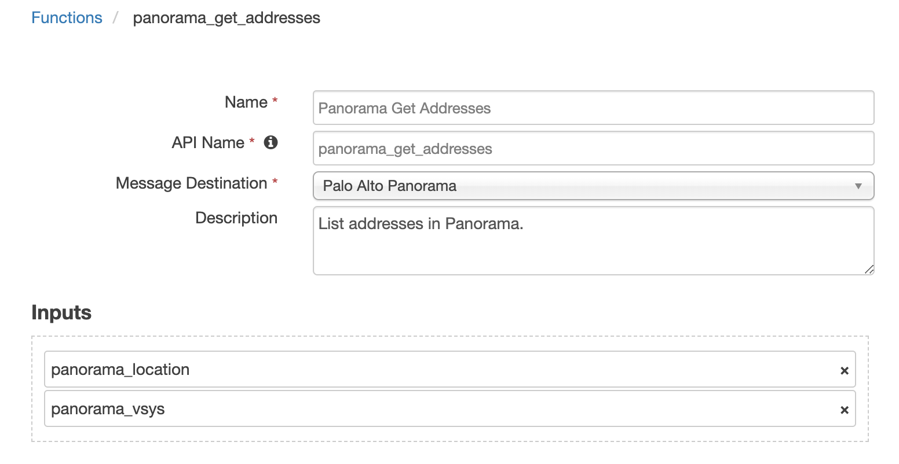
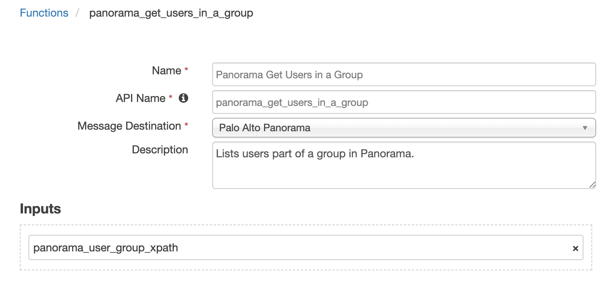

<!--
  This README.md is generated by running:
  "resilient-sdk docgen -p fn_pa_panorama"

  It is best edited using a Text Editor with a Markdown Previewer. VS Code
  is a good example. Checkout https://guides.github.com/features/mastering-markdown/
  for tips on writing with Markdown

  If you make manual edits and run docgen again, a .bak file will be created

  Store any screenshots in the "doc/screenshots" directory and reference them like:
  
-->

# fn-pa-panorama for IBM Resilient

## Table of Contents
- [Release Notes](#release-notes)
- [Overview](#overview)
  - [Key Features](#key-features)
- [Installation](#installation)
  - [Requirements](#requirements)
  - [Install](#install)
  - [App Configuration](#app-configuration)
- [Function - Panorama Get Addresses](#function---panorama-get-addresses)
- [Function - Panorama Edit Users in a Group](#function---panorama-edit-users-in-a-group)
- [Function - Panorama Edit Address Group](#function---panorama-edit-address-group)
- [Function - Panorama Get Users in a Group](#function---panorama-get-users-in-a-group)
- [Function - Panorama Create Address](#function---panorama-create-address)
- [Function - Panorama Get Address Groups](#function---panorama-get-address-groups)
- [Rules](#rules)
- [Troubleshooting & Support](#troubleshooting-&-support)
---

## Release Notes
<!--
  Specify all changes in this release. Do not remove the release 
  notes of a previous release
-->
### v1.0.1
* App Host support

### v1.0.0
* Initial Release

---

## Overview
<!--
  Provide a high-level description of the function itself and its remote software or application.
  The text below is parsed from the "description" and "long_description" attributes in the setup.py file
-->
**Resilient Circuits Components to Integrate with the Panorama Platform**

 

This integration contains Functions to interact with address groups, addresses, and user groups within Palo Alto Panorama.

### Key Features
<!--
  List the Key Features of the Integration
-->
* Edit address groups in Panorama
* Edit user groups in Panorama
* Get addresses and users from Panorama
* Create a new address in Panorama

---

## Installation

### Requirements
<!--
  List any Requirements 
-->
* Resilient platform >= `v35.2.32`
* App Host >= `v1.2.132` (if using App Host)
  * To setup up an App Host see:  [ibm.biz/res-app-host-setup](https://ibm.biz/res-app-host-setup)
* An Integration Server running `resilient_circuits>=30.0.0` (if using an Integration Server)
  * To set up an Integration Server see: [ibm.biz/res-int-server-guide](https://ibm.biz/res-int-server-guide)
  * If using an API key account, minimum required permissions are:
    | Name | Permissions |
    | ---- | ----------- |
    | Org Data | Read, Edit |
    | Function | Read |
* Proxy supported: Yes

---

### Install
* To install or uninstall an App using the App Host see [ibm.biz/res-install-app](https://ibm.biz/res-install-app)

* To install or uninstall an Integration using the Integration Server see the [ibm.biz/res-install-int](https://ibm.biz/res-install-int)
---

### App Configuration
The following table describes the settings you need to configure in the app.config file. If using App Host, see the Resilient System Administrator Guide. If using the integration server, see the Integration Server Guide.

| Config | Required | Example | Description |
| ------ | :------: | ------- | ----------- |
| **panorama_host** | Yes | `<https://0.0.0.0>` | *IP or hostname of the panorama server.* |
| **api_key** | Yes | `<Panorama_api_key>` | *API key generated with permissions to query the Panorama API.* |
| **cert** | Yes | <code>[True &#124; False]</code> | *Validate certificates (True) or allow insecure connections (False).* |
| **http_proxy** | No | `<http://proxy.server:3128>` | *Optional http proxy server.* |
| **https_proxy** | No | `<https://proxy.server:3128>` | *Optional https proxy server.* |

---


## Function - Panorama Get Addresses
List addresses in Panorama.

 

<details><summary>Inputs:</summary>
<p>

| Name | Type | Required | Example | Tooltip |
| ---- | :--: | :------: | ------- | ------- |
| `panorama_location` | `select` | Yes | `-` | The location of the entry |
| `panorama_vsys` | `text` | No | `-` | The name of the vsys when location type is 'vsys' or 'panorama-pushed' |

</p>
</details>

<details><summary>Outputs:</summary>
<p>

```python
results = {
    "version": "1.0",
    "success": true, 
    "reason": null, 
    "content": {
        "@status": "success",
        "@code": "19", 
        "result": {
            "@total-count": "1", 
            "@count": "1", 
            "entry": [{
                "@name": "Blocked Group", 
                "@location": "vsys", 
                "@vsys": "vsys1", 
                "description": "None", 
                "static": {
                    "member": ["208.113.204.14", "8.8.8.8", "10.10.10.10"]
                }
            }]
        }
    },
    "raw": "{\\"@status\\": \\"success\\", \\"@code\\": \\"19\\", \\"result\\": {\\"@total-count\\": \\"1\\", \\"@count\\": \\"1\\", \\"entry\\": [{\\"@name\\": \\"Blocked Group\\", \\"@location\\": \\"vsys\\", \\"@vsys\\": \\"vsys1\\", \\"description\\": \\"None\\", \\"static\\": {\\"member\\": [\\"208.113.204.14\\", \\"8.8.8.8\\", \\"10.10.10.10\\"]}}]}}", "inputs": {"panorama_name_parameter": "Blocked Group", "panorama_location": {"id": 171, "name": "vsys"}, "panorama_vsys": "vsys1"}, "metrics": {"version": "1.0", "package": "fn-pa-panorama", "package_version": "1.0.1", "host": "example.host.domain.net", "execution_time_ms": 8064, "timestamp": "2020-09-29 13:40:46"}
}
```

</p>
</details>

<details><summary>Workflows</summary>

  <details><summary>Example Pre-Process Script:</summary>
  <p>

  ```python
  inputs.panorama_location = "vsys"
inputs.panorama_vsys = "vsys1"
  ```

  </p>
  </details>

  <details><summary>Example Post-Process Script:</summary>
  <p>

  ```python
  """
Example response:

{
  "content": {
    "@code": "19",
    "@status": "success",
    "result": {
      "@count": "3",
      "@total-count": "3",
      "entry": [
        {
          "@location": "vsys",
          "@name": "Test",
          "@vsys": "vsys1",
          "ip-netmask": "1.1.1.1"
        },
        {
          "@location": "vsys",
          "@name": "9.9.9.9",
          "@vsys": "vsys1",
          "description": "9.9.9.9",
          "ip-netmask": "9.9.9.9"
        },
        {
          "@location": "vsys",
          "@name": "google.com",
          "@vsys": "vsys1",
          "description": "google.com",
          "fqdn": "google.com"
        }
      ]
    }
  },
  "inputs": {
    "panorama_location": {
      "id": 801,
      "name": "vsys"
    },
    "panorama_vsys": "vsys1"
  },
  "metrics": {
    "execution_time_ms": 264,
    "host": "",
    "package": "fn-pa-panorama",
    "package_version": "1.0.0",
    "timestamp": "2019-06-25 14:57:42",
    "version": "1.0"
  },
  "raw": "{\"@status\": \"success\", \"@code\": \"19\", \"result\": {\"@total-count\": \"3\", \"entry\": [{\"@vsys\": \"vsys1\", \"@location\": \"vsys\", \"ip-netmask\": \"1.1.1.1\", \"@name\": \"Test\"}, {\"@vsys\": \"vsys1\", \"@location\": \"vsys\", \"ip-netmask\": \"9.9.9.9\", \"@name\": \"9.9.9.9\", \"description\": \"9.9.9.9\"}, {\"@vsys\": \"vsys1\", \"@location\": \"vsys\", \"@name\": \"google.com\", \"description\": \"google.com\", \"fqdn\": \"google.com\"}], \"@count\": \"3\"}}",
  "reason": null,
  "success": true,
  "version": "1.0"
}
"""
  ```

  </p>
  </details>

</details>

---
## Function - Panorama Edit Users in a Group
Edits users in a group in Panorama.

 

<details><summary>Inputs:</summary>
<p>

| Name | Type | Required | Example | Tooltip |
| ---- | :--: | :------: | ------- | ------- |
| `panorama_location` | `select` | Yes | `-` | The location of the entry |
| `panorama_user_group_xml` | `textarea` | No | `-` | xml structure indicating which users are members of the group |
| `panorama_user_group_xpath` | `text` | No | `/config/shared/local-user-database/user-group/entry[@name='Blocked_Users']` | xpath to the user group you want to use |

</p>
</details>

<details><summary>Outputs:</summary>
<p>

```python
results = {
    "content": {
            "response": {
                "@code": "20", 
                "@status": "success", 
                "msg": "command succeeded"
            }, 
            "xml_response": "<response status=\"success\" code=\"20\"><msg>command succeeded</msg></response>"
        }, 
        "inputs": {
            "panorama_user_group_xml": {
                "content": "\n<entry name=\"Blocked_Users\">\n    <user>\n      <member>Blocked_User</member>\n    </user>\n</entry>\n", 
                "format": "text"
            }, 
            "panorama_user_group_xpath": "/config/shared/local-user-database/user-group/entry[@name='Blocked_Users']"
        }, 
        "metrics": {
            "execution_time_ms": 201, 
            "host": "", 
            "package": "fn-pa-panorama", 
            "package_version": "1.0.0", 
            "timestamp": "2019-06-27 10:50:50", 
            "version": "1.0"
        }, 
        "raw": "{\"response\": {\"@status\": \"success\", \"@code\": \"20\", \"msg\": \"command succeeded\"}, \"xml_response\": \"<response status=\\\"success\\\" code=\\\"20\\\"><msg>command succeeded</msg></response>\"}", 
        "reason": null, 
        "success": true, 
        "version": "1.0"
}
```

</p>
</details>

<details><summary>Workflows</summary>

  <details><summary>Example Pre-Process Script:</summary>
  <p>

  ```python
  ###
# Set this to the name of the user group you wish to add a user to
group_name = "Blocked_Users"

# Set this to the xpath of the group you are interested in
inputs.panorama_user_group_xpath = "/config/shared/local-user-database/user-group/entry[@name='{}']".format(group_name)
###

users_list = workflow.properties.panorama_users.content.user_list

# Add new user to the 'users_list' if it is not already in the group
if artifact.value not in users_list:
  users_list.append(artifact.value)

# Build xml which the funciton will send to Panorama
panorama_xml = u'''
<entry name="{}">
    <user>'''.format(unicode(group_name))

# Add member nodes with the username to the xml string
  for user in users_list:
    username = user.get("#text")
    panorama_xml = panorama_xml + u"\n      <member>" + username + "</member>"

# Add the ending of the xml to the string
xml_ending = """
    </user>
</entry>
"""
panorama_xml = panorama_xml + xml_ending

inputs.panorama_user_group_xml = panorama_xml

  ```

  </p>
  </details>

  <details><summary>Example Post-Process Script:</summary>
  <p>

  ```python
  """
Example Response:


{
    "content": {
        "response": {
            "@code": "20", 
            "@status": "success", 
            "msg": "command succeeded"
        }, 
        "xml_response": "<response status=\"success\" code=\"20\"><msg>command succeeded</msg></response>"
    }, 
    "inputs": {
        "panorama_user_group_xml": {
            "content": "\n<entry name=\"Blocked_Users\">\n    <user>\n      <member>Blocked_User</member>\n    </user>\n</entry>\n", 
            "format": "text"
        }, 
        "panorama_user_group_xpath": "/config/shared/local-user-database/user-group/entry[@name='Blocked_Users']"
    }, 
    "metrics": {
        "execution_time_ms": 201, 
        "host": "", 
        "package": "fn-pa-panorama", 
        "package_version": "1.0.0", 
        "timestamp": "2019-06-27 10:50:50", 
        "version": "1.0"
    }, 
    "raw": "{\"response\": {\"@status\": \"success\", \"@code\": \"20\", \"msg\": \"command succeeded\"}, \"xml_response\": \"<response status=\\\"success\\\" code=\\\"20\\\"><msg>command succeeded</msg></response>\"}", 
    "reason": null, 
    "success": true, 
    "version": "1.0"
}
"""
  ```

  </p>
  </details>

</details>

---
## Function - Panorama Edit Address Group
Edits an address group in Panorama.

 

<details><summary>Inputs:</summary>
<p>

| Name | Type | Required | Example | Tooltip |
| ---- | :--: | :------: | ------- | ------- |
| `panorama_location` | `select` | Yes | `-` | The location of the entry |
| `panorama_name_parameter` | `text` | No | `-` | Useful to return back one item, ie: 1 Address Group |
| `panorama_request_body` | `textarea` | No | `-` | - |
| `panorama_vsys` | `text` | No | `-` | The name of the vsys when location type is 'vsys' or 'panorama-pushed' |

</p>
</details>

<details><summary>Outputs:</summary>
<p>

```python
results = {
    'version': '1.0',
    'success': True,
    'reason': None,
    'content': {
        '@status': 'success', '@code': '20', 'msg': 'command succeeded'
        },
    'raw': '{"@status": "success", "@code": "20", "msg": "command succeeded"}', 'inputs': {'panorama_name_parameter': 'Blocked Group', 'panorama_request_body': {'format': 'text', 'content': '{\n  "entry": {\n    "@name": "Blocked Group",\n    "description": "None",\n    "static": {\n      "member": ["208.113.204.14", "8.8.8.8"]\n    }\n    }\n  }'}, 'panorama_location': {'id': 171, 'name': 'vsys'}, 'panorama_vsys': 'vsys1'}, 'metrics': {'version': '1.0', 'package': 'fn-pa-panorama', 'package_version': '1.0.1', 'host': 'Brians-MacBook.hsd1.ma.comcast.net', 'execution_time_ms': 1769, 'timestamp': '2020-09-29 13:47:23'}
}
```

</p>
</details>

<details><summary>Workflows</summary>

  <details><summary>Example Pre-Process Script:</summary>
  <p>

  ```python
  def list_to_json_str(l):
  string_list = "["
  for item in l:
    string_list = string_list + '"' + item + '"'
    if item != l[-1]:
      string_list = string_list + ", "
  return string_list + "]"

inputs.panorama_location = "vsys"
inputs.panorama_vsys = "vsys1"

dns_name = ""
group = workflow.properties.panorama_address_groups.content.result.entry[0]

# If new address was created
if workflow.properties.panorama_create_address is not None:
  dns_name = artifact.value
# Else find it in the list of addresses
else:
  addresses = workflow.properties.panorama_address_list.content.result.entry
  for address in addresses:
    if address["fqdn"] == artifact.value:
      dns_name = address["@name"]
      break

group_name = group["@name"]
des = group["description"]

if group["static"]["member"]:
  member_list = group["static"]["member"]
else:
  member_list = []
if dns_name not in member_list:
  member_list.append(dns_name)

inputs.panorama_name_parameter = group_name

body = '''{{
  "entry": {{
    "@name": "{}",
    "description": "{}",
    "static": {{
      "member": {}
    }}
    }}
  }}'''.format(group_name, des, list_to_json_str(member_list))

inputs.panorama_request_body = body

  ```

  </p>
  </details>

  <details><summary>Example Post-Process Script:</summary>
  <p>

  ```python
  """
Example Response:

{
  "content": {
    "@code": "20",
    "@status": "success",
    "msg": "command succeeded"
  },
  "inputs": {
    "panorama_location": {
      "id": 801,
      "name": "vsys"
    },
    "panorama_name_parameter": "Blocked Group",
    "panorama_request_body": {
      "content": "{\n  \"entry\": {\n    \"@name\": \"Blocked Group\",\n    \"description\": \"None\",\n    \"static\": {\n      \"member\": [\"Test\", \"google.com\"]\n    }\n    }\n  }",
      "format": "text"
    },
    "panorama_vsys": "vsys1"
  },
  "metrics": {
    "execution_time_ms": 182,
    "host": "",
    "package": "fn-pa-panorama",
    "package_version": "1.0.0",
    "timestamp": "2019-06-25 15:19:10",
    "version": "1.0"
  },
  "raw": "{\"msg\": \"command succeeded\", \"@status\": \"success\", \"@code\": \"20\"}",
  "reason": null,
  "success": true,
  "version": "1.0"
}
"""
  ```

  </p>
  </details>

</details>

---
## Function - Panorama Get Users in a Group
Lists users part of a group in Panorama.

 

<details><summary>Inputs:</summary>
<p>

| Name | Type | Required | Example | Tooltip |
| ---- | :--: | :------: | ------- | ------- |
| `panorama_location` | `select` | Yes | `-` | The location of the entry |
| `panorama_user_group_xpath` | `text` | No | `/config/shared/local-user-database/user-group/entry[@name='Blocked_Users']` | xpath to the user group you want to use |

</p>
</details>

<details><summary>Outputs:</summary>
<p>

```python
results = {
    'version': '1.0', 
    'success': True, 
    'reason': None, 
    'content': 
        OrderedDict([('response', 
            OrderedDict([
                ('@status','success'), 
                ('@code', '19'), 
                ('result', 
                    OrderedDict([
                        ('@total-count', '1'), 
                        ('@count', '1'), 
                        ('entry', 
                            OrderedDict([
                                ('@name', 'Blocked_Users'), 
                                ('user', 
                                    OrderedDict([
                                        ('member', ['Blocked_User', 'Blocked_user_2'])
                                    ])
                                )
                            ])
                        )
                    ])
                )
            ])
            ), 
            ('user_list', ['Blocked_User', 'Blocked_user_2']), 
            ('xml_response', '<response status="success" code="19"><result total-count="1" count="1">\n  <entry name="Blocked_Users">\n    <user>\n      <member>Blocked_User</member>\n      <member>Blocked_user_2</member>\n    </user>\n  </entry>\n</result></response>')
        ]),
    'raw': '{"response": {"@status": "success", "@code": "19", "result": {"@total-count": "1", "@count": "1", "entry": {"@name": "Blocked_Users", "user": {"member": ["Blocked_User", "Blocked_user_2"]}}}}, "user_list": ["Blocked_User", "Blocked_user_2"], "xml_response": "<response status=\\"success\\" code=\\"19\\"><result total-count=\\"1\\" count=\\"1\\">\\n  <entry name=\\"Blocked_Users\\">\\n    <user>\\n      <member>Blocked_User</member>\\n      <member>Blocked_user_2</member>\\n    </user>\\n  </entry>\\n</result></response>"}', 'inputs': {'panorama_location': {'id': 171, 'name': 'vsys'}, 'panorama_user_group_xpath': "/config/shared/local-user-database/user-group/entry[@name='Blocked_Users']"}, 'metrics': {'version': '1.0', 'package': 'fn-pa-panorama', 'package_version': '1.0.1', 'host': 'Brians-MacBook.hsd1.ma.comcast.net', 'execution_time_ms': 692544, 'timestamp': '2020-09-29 14:23:02'}
}
```

</p>
</details>

<details><summary>Workflows</summary>

  <details><summary>Example Pre-Process Script:</summary>
  <p>

  ```python
  # Set this to the xpath of the group you are interested in
inputs.panorama_user_group_xpath = "/config/shared/local-user-database/user-group/entry[@name='Blocked_Users']"
  ```

  </p>
  </details>

  <details><summary>Example Post-Process Script:</summary>
  <p>

  ```python
  """
Example Response:


{
    "content": {
        "response": {
            "@code": "19", 
            "@status": "success", 
            "result": {
                "@count": "1", 
                "@total-count": "1", 
                "entry": {
                    "@admin": "admin", 
                    "@dirtyId": "14", 
                    "@name": "Blocked_Users", 
                    "@time": "2019/06/27 07:45:48"
                }
            }
        }, 
        "user_list": [], 
        "xml_response": "<response status=\"success\" code=\"19\"><result total-count=\"1\" count=\"1\">\n  <entry name=\"Blocked_Users\" admin=\"admin\" dirtyId=\"14\" time=\"2019/06/27 07:45:48\"/>\n</result></response>"
    }, 
    "inputs": {
        "panorama_user_group_xpath": "/config/shared/local-user-database/user-group/entry[@name='Blocked_Users']"
    }, 
    "metrics": {
        "execution_time_ms": 200, 
        "host": "", 
        "package": "fn-pa-panorama", 
        "package_version": "1.0.0", 
        "timestamp": "2019-06-27 10:47:52", 
        "version": "1.0"
    }, 
    "raw": "{\"response\": {\"@status\": \"success\", \"@code\": \"19\", \"result\": {\"@total-count\": \"1\", \"@count\": \"1\", \"entry\": {\"@name\": \"Blocked_Users\", \"@admin\": \"admin\", \"@dirtyId\": \"14\", \"@time\": \"2019/06/27 07:45:48\"}}}, \"user_list\": [], \"xml_response\": \"<response status=\\\"success\\\" code=\\\"19\\\"><result total-count=\\\"1\\\" count=\\\"1\\\">\\n  <entry name=\\\"Blocked_Users\\\" admin=\\\"admin\\\" dirtyId=\\\"14\\\" time=\\\"2019/06/27 07:45:48\\\"/>\\n</result></response>\"}", 
    "reason": null, 
    "success": true, 
    "version": "1.0"
}
"""
  ```

  </p>
  </details>

</details>

---
## Function - Panorama Create Address
Creates a new address object in Panorama.

 

<details><summary>Inputs:</summary>
<p>

| Name | Type | Required | Example | Tooltip |
| ---- | :--: | :------: | ------- | ------- |
| `panorama_location` | `select` | Yes | `-` | The location of the entry |
| `panorama_name_parameter` | `text` | No | `-` | Useful to return back one item, ie: 1 Address Group |
| `panorama_request_body` | `textarea` | No | `-` | - |
| `panorama_vsys` | `text` | No | `-` | The name of the vsys when location type is 'vsys' or 'panorama-pushed' |

</p>
</details>

<details><summary>Outputs:</summary>
<p>

```python
results = {
    "content": {
        "@code": "20",
        "@status": "success",
        "msg": "command succeeded"
      },
      "inputs": {
        "panorama_location": {
          "id": 801,
          "name": "vsys"
        },
        "panorama_name_parameter": "8.8.8.8",
        "panorama_request_body": {
          "content": "{\n\"entry\": {\n  \"@name\": \"8.8.8.8\",\n  \"description\": \"8.8.8.8\",\n  \"ip-netmask\": \"8.8.8.8\"\n}\n}",
          "format": "text"
        },
        "panorama_vsys": "vsys1"
      },
      "metrics": {
        "execution_time_ms": 182,
        "host": "",
        "package": "fn-pa-panorama",
        "package_version": "1.0.0",
        "timestamp": "2019-06-25 15:21:23",
        "version": "1.0"
      },
      "raw": "{\"msg\": \"command succeeded\", \"@status\": \"success\", \"@code\": \"20\"}",
      "reason": null,
      "success": true,
      "version": "1.0"
}
```

</p>
</details>

<details><summary>Workflows</summary>

  <details><summary>Example Pre-Process Script:</summary>
  <p>

  ```python
  inputs.panorama_location = "vsys"
inputs.panorama_vsys = "vsys1"
inputs.panorama_name_parameter = artifact.value

body = '''{{
"entry": {{
  "@name": "{}",
  "description": "{}",
  "fqdn": "{}"
}}
}}'''.format(artifact.value, artifact.value, artifact.value)

inputs.panorama_request_body = body
  ```

  </p>
  </details>

  <details><summary>Example Post-Process Script:</summary>
  <p>

  ```python
  """
Example Response:

{
  "content": {
    "@code": "20",
    "@status": "success",
    "msg": "command succeeded"
  },
  "inputs": {
    "panorama_location": {
      "id": 801,
      "name": "vsys"
    },
    "panorama_name_parameter": "8.8.8.8",
    "panorama_request_body": {
      "content": "{\n\"entry\": {\n  \"@name\": \"8.8.8.8\",\n  \"description\": \"8.8.8.8\",\n  \"ip-netmask\": \"8.8.8.8\"\n}\n}",
      "format": "text"
    },
    "panorama_vsys": "vsys1"
  },
  "metrics": {
    "execution_time_ms": 182,
    "host": "",
    "package": "fn-pa-panorama",
    "package_version": "1.0.0",
    "timestamp": "2019-06-25 15:21:23",
    "version": "1.0"
  },
  "raw": "{\"msg\": \"command succeeded\", \"@status\": \"success\", \"@code\": \"20\"}",
  "reason": null,
  "success": true,
  "version": "1.0"
}
"""
  ```

  </p>
  </details>

</details>

---
## Function - Panorama Get Address Groups
List address groups in Panorama.

 

<details><summary>Inputs:</summary>
<p>

| Name | Type | Required | Example | Tooltip |
| ---- | :--: | :------: | ------- | ------- |
| `panorama_location` | `select` | Yes | `-` | The location of the entry |
| `panorama_name_parameter` | `text` | No | `-` | Useful to return back one item, ie: 1 Address Group |
| `panorama_vsys` | `text` | No | `-` | The name of the vsys when location type is 'vsys' or 'panorama-pushed' |

</p>
</details>

<details><summary>Outputs:</summary>
<p>

```python
results = {
    "content": {
        "@code": "19",
        "@status": "success",
        "result": {
          "@count": "1",
          "@total-count": "1",
          "entry": [
            {
              "@location": "vsys",
              "@name": "Blocked Group",
              "@vsys": "vsys1",
              "description": "None",
              "static": {
                "member": [
                  "Test",
                  "google.com"
                ]
              }
            }
          ]
        }
      },
      "inputs": {
        "panorama_location": {
          "id": 801,
          "name": "vsys"
        },
        "panorama_name_parameter": "Blocked Group",
        "panorama_vsys": "vsys1"
      },
      "metrics": {
        "execution_time_ms": 243,
        "host": "",
        "package": "fn-pa-panorama",
        "package_version": "1.0.0",
        "timestamp": "2019-06-25 15:21:21",
        "version": "1.0"
      },
      "raw": "{\"@status\": \"success\", \"@code\": \"19\", \"result\": {\"@total-count\": \"1\", \"entry\": [{\"@vsys\": \"vsys1\", \"@location\": \"vsys\", \"static\": {\"member\": [\"Test\", \"google.com\"]}, \"@name\": \"Blocked Group\", \"description\": \"None\"}], \"@count\": \"1\"}}",
      "reason": null,
      "success": true,
      "version": "1.0"
}
```

</p>
</details>

<details><summary>Workflows</summary>

  <details><summary>Example Pre-Process Script:</summary>
  <p>

  ```python
  inputs.panorama_location = "vsys"
inputs.panorama_vsys = "vsys1"
inputs.panorama_name_parameter = "Blocked Group"
  ```

  </p>
  </details>

  <details><summary>Example Post-Process Script:</summary>
  <p>

  ```python
  """
Example Response:

{
  "content": {
    "@code": "19",
    "@status": "success",
    "result": {
      "@count": "1",
      "@total-count": "1",
      "entry": [
        {
          "@location": "vsys",
          "@name": "Blocked Group",
          "@vsys": "vsys1",
          "description": "None",
          "static": {
            "member": [
              "Test",
              "google.com"
            ]
          }
        }
      ]
    }
  },
  "inputs": {
    "panorama_location": {
      "id": 801,
      "name": "vsys"
    },
    "panorama_name_parameter": "Blocked Group",
    "panorama_vsys": "vsys1"
  },
  "metrics": {
    "execution_time_ms": 243,
    "host": "",
    "package": "fn-pa-panorama",
    "package_version": "1.0.0",
    "timestamp": "2019-06-25 15:21:21",
    "version": "1.0"
  },
  "raw": "{\"@status\": \"success\", \"@code\": \"19\", \"result\": {\"@total-count\": \"1\", \"entry\": [{\"@vsys\": \"vsys1\", \"@location\": \"vsys\", \"static\": {\"member\": [\"Test\", \"google.com\"]}, \"@name\": \"Blocked Group\", \"description\": \"None\"}], \"@count\": \"1\"}}",
  "reason": null,
  "success": true,
  "version": "1.0"
}
"""
  ```

  </p>
  </details>

</details>

---


## Rules
| Rule Name | Object | Workflow Triggered |
| --------- | ------ | ------------------ |
| Example: Panorama Unblock User | artifact | `example_panorama_unblock_user` |
| Example: Panorama Block IP Address | artifact | `example_panorama_block_ip_address` |
| Example: Panorama Block User | artifact | `example_panorama_block_user` |
| Example: Panorama Unblock IP Address | artifact | `example_panorama_unblock_ip_address` |
| Example: Panorama Unblock DNS Name | artifact | `example_panorama_unblock_dns_name` |
| Example: Panorama Block DNS Name | artifact | `example_panorama_block_dns_name` |

---

## Troubleshooting & Support
If using the app with an App Host, see the Resilient System Administrator Guide and the App Host Deployment Guide for troubleshooting procedures. You can find these guides on the [IBM Knowledge Center](https://www.ibm.com/support/knowledgecenter/SSBRUQ), where you can select which version of the Resilient platform you are using.

If using the app with an integration server, see the [Integration Server Guide](https://ibm.biz/res-int-server-guide)

### For Support
This is a IBM Community Provided App. Please search the Community https://ibm.biz/resilientcommunity for assistance.
