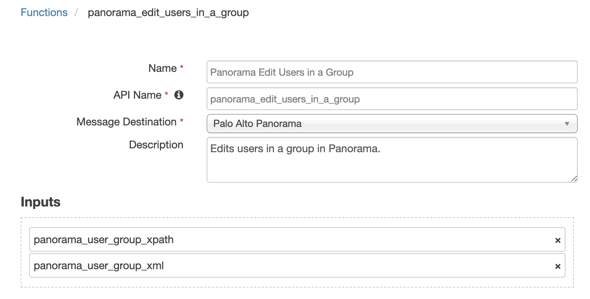

# Palo Alto Networks Panorama Integration for SOAR

## Table of Contents
- [Release Notes](#release-notes)
- [Overview](#overview)
  - [Key Features](#key-features)
- [Requirements](#requirements)
  - [SOAR platform](#soar-platform)
  - [Cloud Pak for Security](#cloud-pak-for-security)
  - [Proxy Server](#proxy-server)
  - [Python Environment](#python-environment)
- [Installation](#installation)
  - [Install](#install)
  - [Panorama API permissions](#panorama-api-permissions)
  - [App Configuration](#app-configuration)
- [Function - Panorama Commit](#function---panorama-commit)
- [Function - Panorama Commit All](#function---panorama-commit-all)
- [Function - Panorama Create Address](#function---panorama-create-address)
- [Function - Panorama Edit Address Group](#function---panorama-edit-address-group)
- [Function - Panorama Edit Users in a Group](#function---panorama-edit-users-in-a-group)
- [Function - Panorama Get Address Groups](#function---panorama-get-address-groups)
- [Function - Panorama Get Addresses](#function---panorama-get-addresses)
- [Function - Panorama Get Job Status](#function---panorama-get-job-status)
- [Function - Panorama Get Users in a Group](#function---panorama-get-users-in-a-group)
- [Playbooks](#playbooks)
- [How to configure to use a single Panorama Server](#How-to-configure-to-use-a-single-Panorama-Server)
- [Creating playbooks when server/servers in app.config are labeled](#Creating-playbooks-when-server/servers-in-app.config-are-labeled)
- [Troubleshooting & Support](#troubleshooting--support)

---

## Release Notes
| Version | Date | Notes |
| ------- | ---- | ----- |
| 1.6.0 | 01/2025 | Add commit-all function. Add function to get status of a job ID. |
| 1.5.0 | 08/2024 | Add function to commit changes. Update example playbooks to auto commit. |
| 1.4.0 | 02/2024 | Add ability to use location=device-group |
| 1.3.0 | 04/2023 | Convert from rules/workflows to playbooks and update Panorama api version to v9.1 |
| 1.2.0 | 10/2022 | Multi-tenancy support added |
| 1.1.0 | 04/2021 | Support for different API versions. See app.config `api_version` setting |
| 1.0.1 | 07/2019 | App Host support |
| 1.0.0 | 10/2020 | Initial release |

* For customers upgrading from a previous release to 1.2.0 or greater, the app.config file must be manually edited to add new settings required to each server configuration. See [1.2.0 Changes](#1.2.0-changes)

---

## 1.4.0 Changes
In v1.4, the setting `sf_device_group` has been added to the app.config settings file. This setting is required to be configured if the setting `sf_location` is configured as `device-group`.

## 1.3.0 Changes
In v1.3, the existing rules and workflows have been replaced with playbooks. This change is made to support the ongoing, newer capabilities of playbooks. Each playbook has the same functionality as the previous, corresponding rule/workflow.

If upgrading from a previous release, you'll noticed that the previous release's rules/workflows remain in place. Both sets of rules and playbooks are active. For manual actions, playbooks will have the same name as it's corresponding rule, but with "(PB)" added at the end. For automatic actions, the playbooks will be disabled by default.

You can continue to use the rules/workflows. But migrating to playbooks will provide greater functionality along with future app enhancements and bug fixes.

## Overview

**SOAR Components to Integrate with the Panorama Platform**

 

This integration contains Functions to interact with address groups, addresses, and user groups within Palo Alto Panorama. This integration can be configured to work with one or multiple Panorama instances.

### Key Features
* Edit address groups in Panorama and PanOS
* Edit user groups in Panorama
* Get addresses from Panorama and PanOS
* Get users from Panorama
* Create a new address in Panorama and PanOS
* Commit changes to Panorama and PanOS
* Commit and push all changes to a device group on Panorama
* Get job status from job ID.

---

## Requirements
This app supports the IBM Security QRadar SOAR Platform and the IBM Security QRadar SOAR for IBM Cloud Pak for Security.

### SOAR platform
The SOAR platform supports two app deployment mechanisms, Edge Gateway (also known as App Host) and integration server.

If deploying to a SOAR platform with an App Host, the requirements are:
* SOAR platform >= `51.0.0.0.9339`.
* The app is in a container-based format (available from the AppExchange as a `zip` file).

If deploying to a SOAR platform with an integration server, the requirements are:
* SOAR platform >= `51.0.0.0.9339`.
* The app is in the older integration format (available from the AppExchange as a `zip` file which contains a `tar.gz` file).
* Integration server is running `resilient_circuits>=51.0.0`.
* If using an API key account, make sure the account provides the following minimum permissions:
  | Name | Permissions |
  | ---- | ----------- |
  | Org Data | Read, Edit |
  | Function | Read |

The following SOAR platform guides provide additional information:
* _Edge Gateway Deployment Guide_ or _App Host Deployment Guide_: provides installation, configuration, and troubleshooting information, including proxy server settings.
* _Integration Server Guide_: provides installation, configuration, and troubleshooting information, including proxy server settings.
* _System Administrator Guide_: provides the procedure to install, configure and deploy apps.

The above guides are available on the IBM Documentation website at [ibm.biz/soar-docs](https://ibm.biz/soar-docs). On this web page, select your SOAR platform version. On the follow-on page, you can find the _Edge Gateway Deployment Guide_, _App Host Deployment Guide_, or _Integration Server Guide_ by expanding **Apps** in the Table of Contents pane. The System Administrator Guide is available by expanding **System Administrator**.

### Cloud Pak for Security
If you are deploying to IBM Cloud Pak for Security, the requirements are:
* IBM Cloud Pak for Security >= `1.10.15`.
* Cloud Pak is configured with an Edge Gateway.
* The app is in a container-based format (available from the AppExchange as a `zip` file).

The following Cloud Pak guides provide additional information:
* _Edge Gateway Deployment Guide_ or _App Host Deployment Guide_: provides installation, configuration, and troubleshooting information, including proxy server settings. From the Table of Contents, select Case Management and Orchestration & Automation > **Orchestration and Automation Apps**.
* _System Administrator Guide_: provides information to install, configure, and deploy apps. From the IBM Cloud Pak for Security IBM Documentation table of contents, select Case Management and Orchestration & Automation > **System administrator**.

These guides are available on the IBM Documentation website at [ibm.biz/cp4s-docs](https://ibm.biz/cp4s-docs). From this web page, select your IBM Cloud Pak for Security version. From the version-specific IBM Documentation page, select Case Management and Orchestration & Automation.

### Proxy Server
The app does support a proxy server.

### Python Environment
Python 3.9, 3.11, and 3.12 are officially supported. When deployed as an app, the app runs on Python 3.11.
Additional package dependencies may exist for each of these packages:
* resilient-lib>=51.0.0
* resilient_circuits>=51.0.0
* xmltodict>=0.12.0

---

## Installation

### Install
* To install or uninstall an App or Integration on the _SOAR platform_, see the documentation at [ibm.biz/soar-docs](https://ibm.biz/soar-docs).
* To install or uninstall an App on _IBM Cloud Pak for Security_, see the documentation at [ibm.biz/cp4s-docs](https://ibm.biz/cp4s-docs) and follow the instructions above to navigate to Orchestration and Automation.

### Panorama API permissions
The following show to permissions needs for the Panorama API key:
 
 

### App Configuration
The following table provides the settings you need to configure the app. These settings are made in the app.config file. See the documentation discussed in the Requirements section for the procedure.

| Config | Required | Example | Description |
| ------ | :------: | ------- | ----------- |
| **panorama_host** | Yes | `<https://0.0.0.0>` | *IP or hostname of the panorama server.* |
| **api_version** | No | `v9.1` | *Specify the api version to use. 'v9.1' is the default.* |
| **api_key** | Yes | `<Panorama_api_key>` | *API key generated with permissions to query the Panorama API. Get the API key via: curl -k -X GET 'https://<panoramaIP>/api/?type=keygen&user=<username>&password=<password>'* |
| **cert** | Yes | <code>[True &#124; False]</code> | *Validate certificates (True) or allow insecure connections (False).* |
| **sf_location** | No | `vsys` | *Set the location on Panorama to run the selftest from. This can be set to any of the following: shared, vsys, panorama-pushed, or device-config.* |
| **sf_vsys** | No | `vsys1` | *The Panorama vsys to use.* |
| **sf_device_group** | No | `group1` | *The Panorama device-group to use.* |
| **http_proxy** | No | `<http://proxy.server:3128>` | *Optional http proxy server.* |
| **https_proxy** | No | `<https://proxy.server:3128>` | *Optional https proxy server.* |

---

## Playbook Prerequisite

All Panorama block/unblock playbooks require a pre-configured address group named **`Blocked Group`** in Panorama.
- Navigate to `Objects > Address Groups` in the Panorama UI.
- Create an address group with:  
  - **Name**: `Blocked Group`  
  - **Type**: Static or Dynamic  
  - **Location**: `shared` or the relevant device group used in your playbooks

If this group is not present, playbooks may fail with errors such as `Object Not Present`.

---

#### 1.2.0 Changes
Starting in version 1.2.0, more than one Panorama instance can be configured for SOAR case data synchronization. For enterprises with only one Panorama instance, your app.config file will continue to define the Panorama instance under the `[fn_pa_panorama]` section header.

For enterprises with more than one Panorama instance, each instance will have it's own section header, such as `[fn_pa_panorama:panorama_label1]` where `panorama_label1` represents any label helpful to define your Panorama environment.

Be aware that modifications to the workflows will be needed to correctly pass this label through the `panorama_label` function input field if the Panorama server/servers in the app.config have labels.

If you have existing custom playbooks, see [Creating playbooks when server/servers in app.config are labeled](#creating-playbooks-when-serverservers-in-appconfig-are-labeled) for more information about changing them to reference the `panorama_label` function input field.

---

## Function - Panorama Commit
Commit changes that have been made on the Panorama server

 

<details><summary>Inputs:</summary>
<p>

| Name | Type | Required | Example | Tooltip |
| ---- | :--: | :------: | ------- | ------- |
| `panorama_label` | `text` | No | `-` | Label of the server to use |
| `panorama_location` | `select` | Yes | `-` | The location of the entry |

</p>
</details>

<details><summary>Outputs:</summary>
<p>

> **NOTE:** This example might be in JSON format, but `results` is a Python Dictionary on the SOAR platform.

```python
results = {
  "content": {
    "@code": "19",
    "@status": "success",
    "result": {
      "job": "8",
      "msg": {
        "line": "Commit job enqueued with jobid 8"
      }
    }
  },
  "inputs": {
    "panorama_label": "panOS",
    "panorama_location": "vsys"
  },
  "metrics": {
    "execution_time_ms": 1245,
    "host": "local",
    "package": "fn-pa-panorama",
    "package_version": "1.5.0",
    "timestamp": "2024-08-09 09:01:22",
    "version": "1.0"
  },
  "raw": null,
  "reason": null,
  "success": true,
  "version": 2.0
}
```

</p>
</details>

<details><summary>Example Function Input Script:</summary>
<p>

```python
if getattr(playbook.inputs, "panorama_label", None):
  inputs.panorama_label = getattr(playbook.inputs, "panorama_label", None)
inputs.panorama_location = "vsys"
```

</p>
</details>

<details><summary>Example Function Post Process Script:</summary>
<p>

```python
note = ""
results = playbook.functions.results.commit_output
edit_addresses = playbook.functions.results.edit_addresses_results
if edit_addresses.get("success"):
  note += f"Panorama DNS name: {artifact.value} was unblocked.\n"
else:
  note += f"Panorama Unblock DNS failed with reason: {edit_addresses.get('reason')}\n"

if results.get("success"):
  note += str(results.get("content", {}).get("result", {}).get("msg", {}).get("line"))

incident.addNote(note)
```

</p>
</details>

---
## Function - Panorama Commit All
Commit and push changes to panorama firewall

 

<details><summary>Inputs:</summary>
<p>

| Name | Type | Required | Example | Tooltip |
| ---- | :--: | :------: | ------- | ------- |
| `panorama_commit_without_default_template` | `boolean` | No | `-` | True - commit all without including default device/network template changes. |
| `panorama_device_group` | `text` | No | `-` | The name of the device-group when location type is 'device-group' |
| `panorama_label` | `text` | No | `-` | Label of the server to use |

</p>
</details>

<details><summary>Outputs:</summary>
<p>

> **NOTE:** This example might be in JSON format, but `results` is a Python Dictionary on the SOAR platform.

```python
results = {
  "content": {
    "@code": "19",
    "@status": "success",
    "result": {
      "job": "576",
      "msg": {
        "line": "Job enqueued with jobid 576"
      }
    }
  },
  "inputs": {
    "panorama_commit_without_default_template": false,
    "panorama_device_group": "group1",
    "panorama_label": "panorama"
  },
  "metrics": {
    "execution_time_ms": 13235,
    "host": "local",
    "package": "fn-pa-panorama",
    "package_version": "1.6.0",
    "timestamp": "2025-01-28 09:54:17",
    "version": "1.0"
  },
  "raw": null,
  "reason": null,
  "success": true,
  "version": 2.0
}
```

</p>
</details>

<details><summary>Example Function Input Script:</summary>
<p>

```python
inputs.panorama_commit_without_default_template = getattr(playbook.inputs, "panorama_commit_without_default_templates", False)
if getattr(playbook.inputs, "panorama_label", None):
  inputs.panorama_label = getattr(playbook.inputs, "panorama_label", None)
inputs.panorama_device_group = getattr(playbook.inputs, "panorama_device_group_name", None)
```

</p>
</details>

<details><summary>Example Function Post Process Script:</summary>
<p>

```python
from json import dumps
results = playbook.functions.results.panorama_commit_all_return
if results.get("success", None):
  incident.addNote(f"Panorama: Commit All returned\n{dumps(results.get('content', {}), indent=4)}")
else:
  incident.addNote(f"Panorama: Commit All failed with reason: {results.get('reason', None)}")
```

</p>
</details>

---
## Function - Panorama Create Address
Creates a new address object in Panorama.

 

<details><summary>Inputs:</summary>
<p>

| Name | Type | Required | Example | Tooltip |
| ---- | :--: | :------: | ------- | ------- |
| `panorama_device_group` | `text` | No | `-` | The name of the device-group when location type is 'device-group' |
| `panorama_label` | `text` | No | `-` | Label of the server to use |
| `panorama_location` | `select` | Yes | `-` | The location of the entry |
| `panorama_name_parameter` | `text` | No | `-` | Useful to return back one item, ie: 1 Address Group |
| `panorama_request_body` | `textarea` | No | `-` | - |
| `panorama_vsys` | `text` | No | `-` | The name of the vsys when location type is 'vsys' or 'panorama-pushed' |

</p>
</details>

<details><summary>Outputs:</summary>
<p>

> **NOTE:** This example might be in JSON format, but `results` is a Python Dictionary on the SOAR platform.

```python
results = {
  "content": {
    "@code": "20",
    "@status": "success",
    "msg": "command succeeded"
  },
  "inputs": {
    "panorama_label": "panorama_label1",
    "panorama_location": "vsys",
    "panorama_name_parameter": "5.6.7.4",
    "panorama_request_body": "{\n  \"entry\": {\n    \"@name\": \"5.6.7.4\",\n    \"description\": \"5.6.7.4\",\n    \"ip-netmask\": \"5.6.7.4\"\n  }\n}",
    "panorama_vsys": "vsys1"
  },
  "metrics": {
    "execution_time_ms": 514,
    "host": "localhost",
    "package": "fn-pa-panorama",
    "package_version": "1.3.0",
    "timestamp": "2023-04-25 08:59:01",
    "version": "1.0"
  },
  "raw": null,
  "reason": null,
  "success": true,
  "version": 2.0
}
```

</p>
</details>

<details><summary>Example Function Input Script:</summary>
<p>

```python
from json import dumps
inputs.panorama_location = "vsys"

if inputs.panorama_location in ["vsys", "panorama-pushed"]:
  inputs.panorama_vsys = "vsys1"
if inputs.panorama_location == "device-group":
  # If `panorama_location` equals 'device-group' then set `panorama_device_group`
  inputs.panorama_device_group = "group1"

inputs.panorama_name_parameter = artifact.value

body = {
  "entry": {
    "@name": artifact.value,
    "description": artifact.value,
    "fqdn": artifact.value
  }
}

inputs.panorama_request_body = dumps(body)
if getattr(playbook.inputs, "panorama_label", None):
  inputs.panorama_label = getattr(playbook.inputs, "panorama_label", None)
```

</p>
</details>

<details><summary>Example Function Post Process Script:</summary>
<p>

```python
None
```

</p>
</details>

---
## Function - Panorama Edit Address Group
Edits an address group in Panorama.

 

<details><summary>Inputs:</summary>
<p>

| Name | Type | Required | Example | Tooltip |
| ---- | :--: | :------: | ------- | ------- |
| `panorama_device_group` | `text` | No | `-` | The name of the device-group when location type is 'device-group' |
| `panorama_label` | `text` | No | `-` | Label of the server to use |
| `panorama_location` | `select` | Yes | `-` | The location of the entry |
| `panorama_name_parameter` | `text` | No | `-` | Useful to return back one item, ie: 1 Address Group |
| `panorama_request_body` | `textarea` | No | `-` | - |
| `panorama_vsys` | `text` | No | `-` | The name of the vsys when location type is 'vsys' or 'panorama-pushed' |

</p>
</details>

<details><summary>Outputs:</summary>
<p>

> **NOTE:** This example might be in JSON format, but `results` is a Python Dictionary on the SOAR platform.

```python
results = {
  "content": {
    "@code": "20",
    "@status": "success",
    "msg": "command succeeded"
  },
  "inputs": {
    "panorama_label": "panOS",
    "panorama_location": "vsys",
    "panorama_name_parameter": "Blocked Group",
    "panorama_request_body": "{\"entry\": {\"@name\": \"Blocked Group\", \"description\": null, \"static\": {\"member\": [\"1.2.3.4\", \"42.36.75.4\", \"test.com\"]}}}",
    "panorama_vsys": "vsys1"
  },
  "metrics": {
    "execution_time_ms": 2028,
    "host": "local",
    "package": "fn-pa-panorama",
    "package_version": "1.5.0",
    "timestamp": "2024-08-09 09:01:19",
    "version": "1.0"
  },
  "raw": null,
  "reason": null,
  "success": true,
  "version": 2.0
}
```

</p>
</details>

<details><summary>Example Function Input Script:</summary>
<p>

```python
from json import dumps

inputs.panorama_location = "vsys"

if inputs.panorama_location in ["vsys", "panorama-pushed"]:
  inputs.panorama_vsys = "vsys1"
if inputs.panorama_location == "device-group":
  # If `panorama_location` equals 'device-group' then set `panorama_device_group`
  inputs.panorama_device_group = "group1"

dns_name = ""
group = playbook.functions.results.get_groups_results.get("content", {}).get("result", {}).get("entry", [])
if group:
  group = group[0]

addresses = playbook.functions.results.get_addresses_results.get("content", {}).get("result", {}).get("entry", [])
for address in addresses:
  if address.get("fqdn") == artifact.value:
    dns_name = address.get("@name")
    break

if not dns_name:
  helper.fail(f"The DNS address {artifact.value} was not found in the specified address group.")

group_name = group.get("@name")
des = group.get("description")
member_list = group.get("static", {}).get("member")

# Remove IP address from list
member_list.remove(dns_name)

inputs.panorama_name_parameter = group_name

# If using api version 9.0 or before uncomment below for the body
# body = {
#   "entry": {
#     "@name": group_name,
#     "description": des,
#     "static": {
#       "member": dumps(member_list)
#     }
#   }
# }

body = {
  "entry": {
    "@name": group_name,
    "description": des,
    "static": {
      "member": member_list
    }
  }
}

inputs.panorama_request_body = dumps(body)
if getattr(playbook.inputs, "panorama_label", None):
  inputs.panorama_label = getattr(playbook.inputs, "panorama_label", None)
```

</p>
</details>

<details><summary>Example Function Post Process Script:</summary>
<p>

```python
results = playbook.functions.results.edit_addresses_results
if results.get("success"):
  incident.addNote(f"Panorama DNS name: {artifact.value} was unblocked.")
else:
  incident.addNote(f"Panorama Unblock DNS failed with reason: {results.get('reason')}")
```

</p>
</details>

---
## Function - Panorama Edit Users in a Group
Edits users in a group in Panorama. This only works with Panorama and does not work with PanOS.

 

<details><summary>Inputs:</summary>
<p>

| Name | Type | Required | Example | Tooltip |
| ---- | :--: | :------: | ------- | ------- |
| `panorama_label` | `text` | No | `-` | Label of the server to use |
| `panorama_location` | `select` | Yes | `-` | The location of the entry |
| `panorama_user_group_name` | `text` | No | `-` | Name of the user group |
| `panorama_user_group_xml` | `textarea` | No | `-` | xml structure indicating which users are members of the group |
| `panorama_user_group_xpath` | `text` | No | `/config/shared/local-user-database/user-group/entry[@name='Blocked_Users']` | xpath to the user group you want to use |
| `panorama_users_list` | `text` | No | `-` | List of panorama users |

</p>
</details>

<details><summary>Outputs:</summary>
<p>

> **NOTE:** This example might be in JSON format, but `results` is a Python Dictionary on the SOAR platform.

```python
results = {
  "content": {
    "response": {
      "@code": "20",
      "@status": "success",
      "msg": "command succeeded"
    },
    "xml_response": "\u003cresponse status=\"success\" code=\"20\"\u003e\u003cmsg\u003ecommand succeeded\u003c/msg\u003e\u003c/response\u003e"
  },
  "inputs": {
    "panorama_label": "panorama_label1",
    "panorama_location": "vsys",
    "panorama_user_group_xml": "\n  \u003centry name=\"Blocked_Users\"\u003e\n      \u003cuser\u003e\n      \u003cmember\u003eBlocked_User\u003c/member\u003e\n      \u003cmember\u003eBlocked_user_2\u003c/member\u003e\n      \u003c/user\u003e\n  \u003c/entry\u003e\n  ",
    "panorama_user_group_xpath": "/config/shared/local-user-database/user-group/entry[@name=\u0027Blocked_Users\u0027]"
  },
  "metrics": {
    "execution_time_ms": 514,
    "host": "localhost",
    "package": "fn-pa-panorama",
    "package_version": "1.3.0",
    "timestamp": "2023-04-25 11:12:20",
    "version": "1.0"
  },
  "raw": null,
  "reason": null,
  "success": true,
  "version": 2.0
}
```

</p>
</details>

<details><summary>Example Function Input Script:</summary>
<p>

```python
inputs.panorama_location = "vsys"
# Set this to the name of the user group you wish to add a user to
group_name = "Blocked_Users"

# Set this to the xpath of the group you are interested in
inputs.panorama_user_group_xpath = f"/config/shared/local-user-database/user-group/entry[@name='{group_name}']"

users_list = playbook.functions.results.get_users_results.get("content", {}).get("user_list", [])

blocked_users = []

if len(users_list) == 1:
  # only one user was returned
  blocked_users.append(users_list[0])
elif len(users_list) > 1:
  # multiple users returned
  for user in users_list:
    blocked_users.append(str(user.get("#text")))

# Remove the user from the blocked list if they are there
if artifact.value in blocked_users:
  blocked_users.remove(artifact.value)
else:
  helper.fail(f"The Panorama user(s): {artifact.value} is not found in the group: {group_name} and can not be removed from it.")

# Updated function creates the xml request body for you
inputs.panorama_users_list = str(blocked_users)
inputs.panorama_user_group_name = group_name
if getattr(playbook.inputs, "panorama_label", None):
  inputs.panorama_label = getattr(playbook.inputs, "panorama_label", None)

# Giving the xml request body as an input still works
# panorama_xml = ""
# # Set xml to empty users if list is empty
# if len(users_list) == 0:
#   panorama_xml = f'<entry name="{group_name}"/>'

# # Multiple members, build xml which the function will send to Panorama
# else:
#   panorama_xml = f"<entry name='{group_name}'><user>"

#   # Add member nodes with the username to the xml string
#   for user in blocked_users:
#     panorama_xml += f"<member>{user}</member>"

#   # Add the ending of the xml to the string
#   panorama_xml += "</user></entry>"

# inputs.panorama_user_group_xml = panorama_xml
```

</p>
</details>

<details><summary>Example Function Post Process Script:</summary>
<p>

```python
results = playbook.functions.results.edit_users_results
if results.get("success"):
  incident.addNote(f"Panorama User account: {artifact.value} was unblocked.")
else:
  incident.addNote(f"Panorama Unblock User failed with reason: {results.get('reason')}")
```

</p>
</details>

---
## Function - Panorama Get Address Groups
List address groups in Panorama.

 

<details><summary>Inputs:</summary>
<p>

| Name | Type | Required | Example | Tooltip |
| ---- | :--: | :------: | ------- | ------- |
| `panorama_device_group` | `text` | No | `-` | The name of the device-group when location type is 'device-group' |
| `panorama_label` | `text` | No | `-` | Label of the server to use |
| `panorama_location` | `select` | Yes | `-` | The location of the entry |
| `panorama_name_parameter` | `text` | No | `-` | Useful to return back one item, ie: 1 Address Group |
| `panorama_vsys` | `text` | No | `-` | The name of the vsys when location type is 'vsys' or 'panorama-pushed' |

</p>
</details>

<details><summary>Outputs:</summary>
<p>

> **NOTE:** This example might be in JSON format, but `results` is a Python Dictionary on the SOAR platform.

```python
results = {
  "content": {
    "@code": "19",
    "@status": "success",
    "result": {
      "@count": "1",
      "@total-count": "1",
      "entry": [
        {
          "@location": "vsys",
          "@name": "Blocked Group",
          "@vsys": "vsys1",
          "static": {
            "member": [
              "1.2.3.4",
              "42.36.75.4",
              "test.com",
              "1.1.1.1"
            ]
          }
        }
      ]
    }
  },
  "inputs": {
    "panorama_label": "panOS",
    "panorama_location": "vsys",
    "panorama_name_parameter": "Blocked Group",
    "panorama_vsys": "vsys1"
  },
  "metrics": {
    "execution_time_ms": 3285,
    "host": "local",
    "package": "fn-pa-panorama",
    "package_version": "1.5.0",
    "timestamp": "2024-08-09 09:01:13",
    "version": "1.0"
  },
  "raw": null,
  "reason": "",
  "success": true,
  "version": 2.0
}
```

</p>
</details>

<details><summary>Example Function Input Script:</summary>
<p>

```python
if getattr(playbook.inputs, "panorama_label", None):
  inputs.panorama_label = getattr(playbook.inputs, "panorama_label", None)
inputs.panorama_location = "vsys"

if inputs.panorama_location in ["vsys", "panorama-pushed"]:
  inputs.panorama_vsys = "vsys1"
if inputs.panorama_location == "device-group":
  # If `panorama_location` equals 'device-group' then set `panorama_device_group`
  inputs.panorama_device_group = "group1"

inputs.panorama_name_parameter = "Blocked Group"
```

</p>
</details>

<details><summary>Example Function Post Process Script:</summary>
<p>

```python
from json import dumps
results = playbook.functions.results.address_groups

if results.get("success"):
  incident.addNote(f'Panorama Get Address Groups\n{dumps(results.get("content", {}), indent=4)}')
else:
  incident.addNote(f"Panorama Get address groups failed with reason: {results.get('reason')}")
```

</p>
</details>

---
## Function - Panorama Get Addresses
List addresses in Panorama.

 

<details><summary>Inputs:</summary>
<p>

| Name | Type | Required | Example | Tooltip |
| ---- | :--: | :------: | ------- | ------- |
| `panorama_device_group` | `text` | No | `-` | The name of the device-group when location type is 'device-group' |
| `panorama_label` | `text` | No | `-` | Label of the server to use |
| `panorama_location` | `select` | Yes | `-` | The location of the entry |
| `panorama_vsys` | `text` | No | `-` | The name of the vsys when location type is 'vsys' or 'panorama-pushed' |

</p>
</details>

<details><summary>Outputs:</summary>
<p>

> **NOTE:** This example might be in JSON format, but `results` is a Python Dictionary on the SOAR platform.

```python
results = {
  "content": {
    "@code": "19",
    "@status": "success",
    "result": {
      "@count": "13",
      "@total-count": "13",
      "entry": [
        {
          "@location": "vsys",
          "@name": "1.1.1.1",
          "@vsys": "vsys1",
          "ip-netmask": "1.1.1.1"
        },
        {
          "@location": "vsys",
          "@name": "google",
          "@vsys": "vsys1",
          "fqdn": "www.google.com"
        },
        {
          "@location": "vsys",
          "@name": "2.2.2.2",
          "@vsys": "vsys1",
          "description": "2.2.2.2",
          "ip-netmask": "2.2.2.2"
        },
        {
          "@location": "vsys",
          "@name": "google.com",
          "@vsys": "vsys1",
          "description": "google.com",
          "fqdn": "google.com"
        },
        {
          "@location": "vsys",
          "@name": "www.ibm.com",
          "@vsys": "vsys1",
          "description": "www.ibm.com",
          "fqdn": "www.ibm.com"
        },
        {
          "@location": "vsys",
          "@name": "3.3.3.3",
          "@vsys": "vsys1",
          "description": "3.3.3.3",
          "ip-netmask": "3.3.3.3"
        },
        {
          "@location": "vsys",
          "@name": "1.2.3.4",
          "@vsys": "vsys1",
          "description": "1.2.3.4",
          "ip-netmask": "1.2.3.4"
        },
        {
          "@location": "vsys",
          "@name": "test.com",
          "@vsys": "vsys1",
          "description": "test.com",
          "fqdn": "test.com"
        },
        {
          "@location": "vsys",
          "@name": "abc.com",
          "@vsys": "vsys1",
          "description": "abc.com",
          "fqdn": "abc.com"
        },
        {
          "@location": "vsys",
          "@name": "def.com",
          "@vsys": "vsys1",
          "description": "def.com",
          "fqdn": "def.com"
        },
        {
          "@location": "vsys",
          "@name": "123.123.123.123",
          "@vsys": "vsys1",
          "description": "123.123.123.123",
          "fqdn": "123.123.123.123"
        },
        {
          "@location": "vsys",
          "@name": "122.122.122.122",
          "@vsys": "vsys1",
          "description": "122.122.122.122",
          "ip-netmask": "122.122.122.122"
        },
        {
          "@location": "vsys",
          "@name": "42.36.75.4",
          "@vsys": "vsys1",
          "description": "42.36.75.4",
          "ip-netmask": "42.36.75.4"
        }
      ]
    }
  },
  "inputs": {
    "panorama_label": "panOS",
    "panorama_location": "vsys",
    "panorama_vsys": "vsys1"
  },
  "metrics": {
    "execution_time_ms": 3280,
    "host": "local",
    "package": "fn-pa-panorama",
    "package_version": "1.5.0",
    "timestamp": "2024-08-09 09:01:13",
    "version": "1.0"
  },
  "raw": null,
  "reason": "",
  "success": true,
  "version": 2.0
}
```

</p>
</details>

<details><summary>Example Function Input Script:</summary>
<p>

```python
inputs.panorama_location = "vsys"

if inputs.panorama_location in ["vsys", "panorama-pushed"]:
  inputs.panorama_vsys = "vsys1"
if inputs.panorama_location == "device-group":
  # If `panorama_location` equals 'device-group' then set `panorama_device_group`
  inputs.panorama_device_group = "group1"

if getattr(playbook.inputs, "panorama_label", None):
  inputs.panorama_label = getattr(playbook.inputs, "panorama_label", None)
```

</p>
</details>

<details><summary>Example Function Post Process Script:</summary>
<p>

```python
None
```

</p>
</details>

---
## Function - Panorama Get Job Status
Get panorama job status from job ID.

 

<details><summary>Inputs:</summary>
<p>

| Name | Type | Required | Example | Tooltip |
| ---- | :--: | :------: | ------- | ------- |
| `panorama_job_id` | `number` | No | `-` | The job ID to get the status of. |
| `panorama_label` | `text` | No | `-` | Label of the server to use |

</p>
</details>

<details><summary>Outputs:</summary>
<p>

> **NOTE:** This example might be in JSON format, but `results` is a Python Dictionary on the SOAR platform.

```python
results = {
  "content": {
    "@status": "success",
    "result": {
      "job": {
        "description": null,
        "devices": {
          "entry": {
            "details": {
              "msg": "device 00000000000 not connected"
            },
            "devicename": null,
            "multi-vsys": "no",
            "result": "FAIL",
            "serial-no": "00000000000",
            "status": "not connected",
            "tfin": "2025/01/28 06:54:04",
            "tstart": "06:54:04",
            "vsys": null
          }
        },
        "dgname": "group1",
        "id": "576",
        "positionInQ": "0",
        "progress": "100",
        "push_type": "shared-policy",
        "queued": "NO",
        "result": "FAIL",
        "sched": "None",
        "status": "FIN",
        "stoppable": "no",
        "tdeq": "06:54:04",
        "tenq": "2025/01/28 06:54:04",
        "tfin": "2025/01/28 06:54:04",
        "type": "CommitAll",
        "user": "admin",
        "warnings": null
      }
    }
  },
  "inputs": {
    "panorama_job_id": 576,
    "panorama_label": "panorama"
  },
  "metrics": {
    "execution_time_ms": 530,
    "host": "local",
    "package": "fn-pa-panorama",
    "package_version": "1.6.0",
    "timestamp": "2025-01-28 10:40:31",
    "version": "1.0"
  },
  "raw": null,
  "reason": null,
  "success": true,
  "version": 2.0
}
```

</p>
</details>

<details><summary>Example Function Input Script:</summary>
<p>

```python
if getattr(playbook.inputs, "panorama_label", None):
  inputs.panorama_label = getattr(playbook.inputs, "panorama_label", None)
inputs.panorama_job_id = getattr(playbook.inputs, "panorama_job_id", None)
```

</p>
</details>

<details><summary>Example Function Post Process Script:</summary>
<p>

```python
from json import dumps
results = playbook.functions.results.panorama_job_status_return
if results.get("success", None):
  incident.addNote(f"Panorama: Get Job Status results:\n{dumps(results.get('content', {}), indent=4)}")
else:
  incident.addNote(f"Panorama: Get Job Status failed with reason:\n{results.get('reason', None)}")
```

</p>
</details>

---
## Function - Panorama Get Users in a Group
Lists users part of a group in Panorama. This only works with Panorama and does not work with PanOS.

 

<details><summary>Inputs:</summary>
<p>

| Name | Type | Required | Example | Tooltip |
| ---- | :--: | :------: | ------- | ------- |
| `panorama_label` | `text` | No | `-` | Label of the server to use |
| `panorama_location` | `select` | Yes | `-` | The location of the entry |
| `panorama_user_group_xpath` | `text` | No | `/config/shared/local-user-database/user-group/entry[@name='Blocked_Users']` | xpath to the user group you want to use |

</p>
</details>

<details><summary>Outputs:</summary>
<p>

> **NOTE:** This example might be in JSON format, but `results` is a Python Dictionary on the SOAR platform.

```python
results = {
  "content": {
    "response": {
      "@code": "19",
      "@status": "success",
      "result": {
        "@count": "1",
        "@total-count": "1",
        "entry": {
          "@admin": "admin",
          "@dirtyId": "2",
          "@name": "Blocked_Users",
          "@time": "2023/04/25 10:34:14",
          "user": {
            "@admin": "admin",
            "@dirtyId": "2",
            "@time": "2023/04/25 10:34:14",
            "member": [
              {
                "#text": "Blocked_User",
                "@admin": "admin",
                "@dirtyId": "2",
                "@time": "2023/04/25 10:34:14"
              },
              {
                "#text": "Blocked_user_2",
                "@admin": "admin",
                "@dirtyId": "2",
                "@time": "2023/04/25 10:34:14"
              },
              {
                "#text": "jeff",
                "@admin": "admin",
                "@dirtyId": "2",
                "@time": "2023/04/25 10:34:14"
              }
            ]
          }
        }
      }
    },
    "user_list": [
      {
        "#text": "Blocked_User",
        "@admin": "admin",
        "@dirtyId": "2",
        "@time": "2023/04/25 10:34:14"
      },
      {
        "#text": "Blocked_user_2",
        "@admin": "admin",
        "@dirtyId": "2",
        "@time": "2023/04/25 10:34:14"
      },
      {
        "#text": "jeff",
        "@admin": "admin",
        "@dirtyId": "2",
        "@time": "2023/04/25 10:34:14"
      }
    ],
    "xml_response": "\u003cresponse status=\"success\" code=\"19\"\u003e\u003cresult total-count=\"1\" count=\"1\"\u003e\n  \u003centry name=\"Blocked_Users\" admin=\"admin\" dirtyId=\"2\" time=\"2023/04/25 10:34:14\"\u003e\n    \u003cuser admin=\"admin\" dirtyId=\"2\" time=\"2023/04/25 10:34:14\"\u003e\n      \u003cmember admin=\"admin\" dirtyId=\"2\" time=\"2023/04/25 10:34:14\"\u003eBlocked_User\u003c/member\u003e\n      \u003cmember admin=\"admin\" dirtyId=\"2\" time=\"2023/04/25 10:34:14\"\u003eBlocked_user_2\u003c/member\u003e\n      \u003cmember admin=\"admin\" dirtyId=\"2\" time=\"2023/04/25 10:34:14\"\u003ejeff\u003c/member\u003e\n    \u003c/user\u003e\n  \u003c/entry\u003e\n\u003c/result\u003e\u003c/response\u003e"
  },
  "inputs": {
    "panorama_label": "panorama_label1",
    "panorama_location": "vsys",
    "panorama_user_group_xpath": "/config/shared/local-user-database/user-group/entry[@name=\u0027Blocked_Users\u0027]"
  },
  "metrics": {
    "execution_time_ms": 504,
    "host": "localhost",
    "package": "fn-pa-panorama",
    "package_version": "1.3.0",
    "timestamp": "2023-04-25 11:12:19",
    "version": "1.0"
  },
  "raw": null,
  "reason": null,
  "success": true,
  "version": 2.0
}
```

</p>
</details>

<details><summary>Example Function Input Script:</summary>
<p>

```python
# Set this to the xpath of the group you are interested in
inputs.panorama_user_group_xpath = "/config/shared/local-user-database/user-group/entry[@name='Blocked_Users']"
if getattr(playbook.inputs, "panorama_label", None):
  inputs.panorama_label = getattr(playbook.inputs, "panorama_label", None)
inputs.panorama_location = "vsys"
```

</p>
</details>

<details><summary>Example Function Post Process Script:</summary>
<p>

```python
None
```

</p>
</details>

---


## Playbooks
| Playbook Name | Description | Activation Type | Object | Status | Condition | 
| ------------- | ----------- | --------------- | ------ | ------ | --------- | 
| Panorama: Block DNS Name - Example (PB) | Given a DNS Name artifact, adds the DNS Name to the "Blocked Group" in Panorama. | Manual | artifact | `enabled` | `artifact.type equals DNS Name` | 
| Panorama: Block IP Address - Example (PB) | Given an IP Address artifact, adds the IP Address to the "Blocked Group" in Panorama. | Manual | artifact | `enabled` | `artifact.type equals IP Address` | 
| Panorama: Block User - Example (PB) | Given a User Account artifact, adds the user to the "Blocked_Users" group in Panorama. This only works with Panorama and does not work with PanOS. | Manual | artifact | `enabled` | `artifact.type equals User Account` | 
| Panorama: Get Address Groups - Example (PB) | Get address groups on the Panorama server | Manual | incident | `enabled` | `-` | 
| Panorama: Unblock DNS Name - Example (PB) | Given a DNS Name artifact, removes the DNS Name from the "Blocked Group" in Panorama. | Manual | artifact | `enabled` | `artifact.type equals DNS Name` | 
| Panorama: Unblock IP Address - Example (PB) | Given an IP Address artifact, removes the IP Address from the "Blocked Group" in Panorama. | Manual | artifact | `enabled` | `artifact.type equals IP Address` | 
| Panorama: Unblock User - Example (PB) | Given a User Account artifact, removes the user from the "Blocked_Users" group in Panorama. This only works with Panorama and does not work with PanOS. | Manual | artifact | `enabled` | `artifact.type equals User Account` | 
| Panorama: Commit All - Example (PB) | Commit all and push | Manual | incident | `enabled` | `-` | 
| Panorama: Get Job Status - Example (PB) | Get status of a Panorama job from the job ID | Manual | incident | `enabled` | `-` | 

---

## How to configure to use a single Panorama Server
To use only a single server there are two ways this can be configured
1. Use the configuration used in Panorama Integration versions prior to V1.2.0
```
[fn_pa_panorama]
# URL/IP of Panorama
panorama_host=<https://0.0.0.0>
# Versions of panorama can be used by changing the api_version to use a different API version
api_version=v9.1
api_key=<Panorama_api_key>
cert=[True|False]
# optional settings to access Panorama via proxies
#http_proxy=http://proxy.domain:3128
#https_proxy=https://proxy.domain:3128
```
2. Specify a panorama system label meaningful to our environment. The label has no other significance.
```
[fn_pa_panorama:panorama_label1]
# URL/IP of Panorama
panorama_host=<https://0.0.0.0>
# Versions of panorama can be used by changing the api_version to use a different API version
api_version=v9.1
api_key=<Panorama_api_key>
cert=[True|False]
# optional settings to access Panorama via proxies
#http_proxy=http://proxy.domain:3128
#https_proxy=https://proxy.domain:3128
```

---

## Creating playbooks when server/servers in app.config are labeled
The function input field `panorama_label` is required when Panorama server/servers in the app.config are labeled. In the example playbook input scripts the
input field `panorama_label` is defined the following way,
```python
inputs.panorama_label = playbook.inputs.panorama_label
```
The activation field `panorama_label` is a text field in which the user enters the label of the server they wish to use.

---

## Troubleshooting & Support
Refer to the documentation listed in the Requirements section for troubleshooting information.
 
### For Support
This is a IBM Community provided app. Please search the Community [ibm.biz/soarcommunity](https://ibm.biz/soarcommunity) for assistance.
