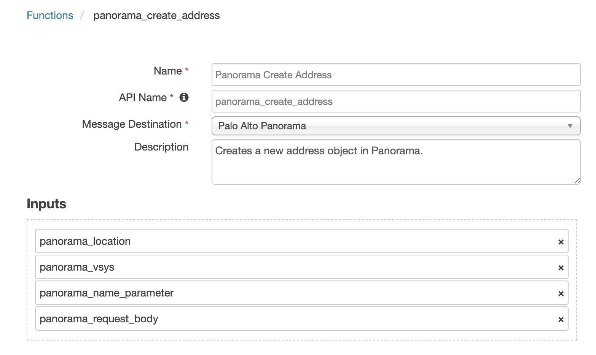
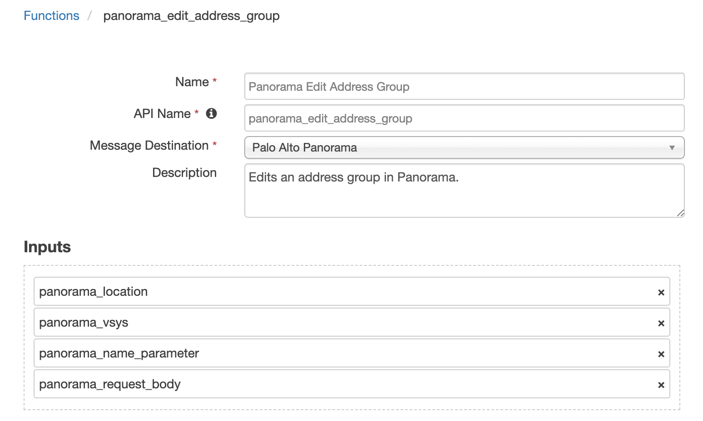
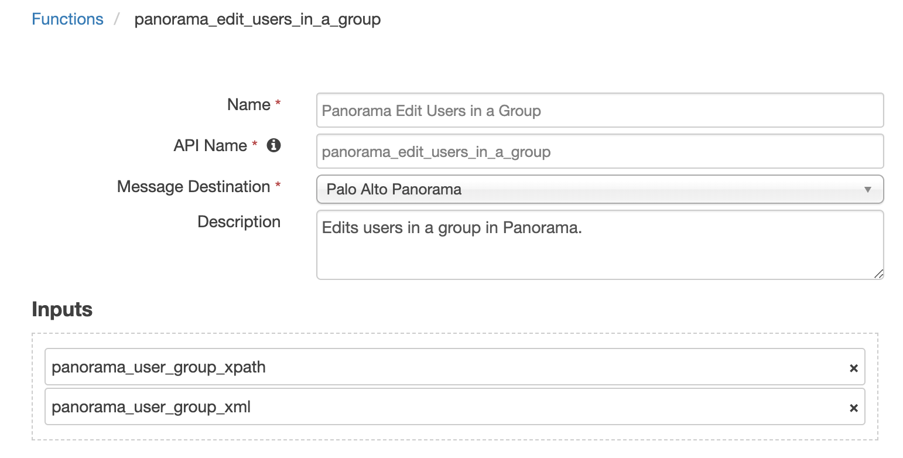
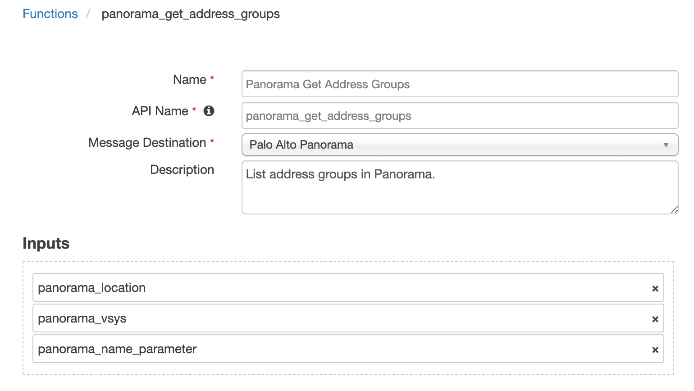
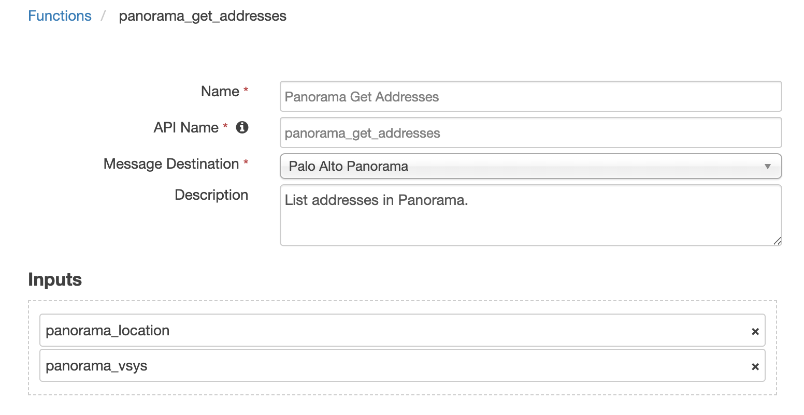
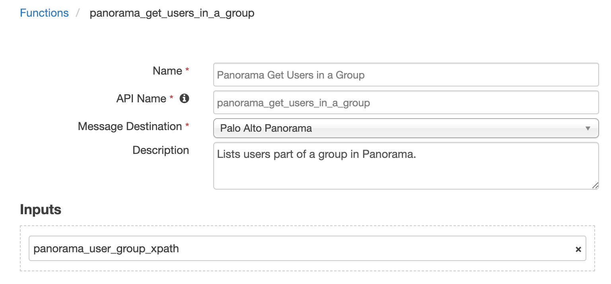

<!--
  This User README.md is generated by running:
  "resilient-circuits docgen -p fn_pa_panorama --only-user-guide"

  It is best edited using a Text Editor with a Markdown Previewer. VS Code
  is a good example. Checkout https://guides.github.com/features/mastering-markdown/
  for tips on writing with Markdown

  If you make manual edits and run docgen again, a .bak file will be created

  Store any screenshots in the "doc/screenshots" directory and reference them like:
  
-->

# **User Guide:** fn\_pa\_panorama\_v1.0.0

## Table of Contents
- [Key Features](#key-features)
- [Function - Panorama Create Address](#function---panorama-create-address)
- [Function - Panorama Edit Address Group](#function---panorama-edit-address-group)
- [Function - Panorama Edit Users in a Group](#function---panorama-edit-users-in-a-group)
- [Function - Panorama Get Address Groups](#function---panorama-get-address-groups)
- [Function - Panorama Get Addresses](#function---panorama-get-addresses)
- [Function - Panorama Get Users in a Group](#function---panorama-get-users-in-a-group)
- [Rules](#rules)

---

## Key Features
<!--
  List the Key Features of the Integration
-->
* Add and remove IP addresses from groups in Panorama
* Add and remove URLs from groups in Panorama
* Add and remove users from groups in Panorama

---

## Function - Panorama Create Address
Creates a new address object in Panorama.

 

<details><summary>Inputs:</summary>
<p>

| Name | Type | Required | Example | Tooltip |
| ---- | :--: | :------: | ------- | ------- |
| `panorama_location` | `select` | Yes | `-` | Location of the entry. |
| `panorama_vsys` | `text` | No | `-` | Name of the vsys when location type is 'vsys' or 'panorama-pushed'. |
| `panorama_name_parameter` | `text` | No | `-` | Useful to return back one item, ie: 1 Address Group. |
| `panorama_request_body` | `textarea` | No | `-` | - |

</p>
</details>

<details><summary>Outputs:</summary>
<p>

```python
results = {
  "content": {
    "@code": "20",
    "@status": "success",
    "msg": "command succeeded"
  },
  "inputs": {
    "panorama_location": {
      "id": 801,
      "name": "vsys"
    },
    "panorama_name_parameter": "8.8.8.8",
    "panorama_request_body": {
      "content": "{\n\"entry\": {\n  \"@name\": \"8.8.8.8\",\n  \"description\": \"8.8.8.8\",\n  \"ip-netmask\": \"8.8.8.8\"\n}\n}",
      "format": "text"
    },
    "panorama_vsys": "vsys1"
  },
  "metrics": {
    "execution_time_ms": 182,
    "host": "",
    "package": "fn-pa-panorama",
    "package_version": "1.0.0",
    "timestamp": "2019-06-25 15:21:23",
    "version": "1.0"
  },
  "raw": "{\"msg\": \"command succeeded\", \"@status\": \"success\", \"@code\": \"20\"}",
  "reason": null,
  "success": true,
  "version": "1.0"
}
```

</p>
</details>

<details><summary>Example Pre-Process Script:</summary>
<p>

```python
inputs.panorama_location = "vsys"
inputs.panorama_vsys = "vsys1"
inputs.panorama_name_parameter = artifact.value

body = '''{{
"entry": {{
  "@name": "{}",
  "description": "{}",
  "fqdn": "{}"
}}
}}'''.format(artifact.value, artifact.value, artifact.value)

inputs.panorama_request_body = body
```

</p>
</details>

---
## Function - Panorama Edit Address Group
Edits an address group in Panorama.

 

<details><summary>Inputs:</summary>
<p>

| Name | Type | Required | Example | Tooltip |
| ---- | :--: | :------: | ------- | ------- |
| `panorama_location` | `select` | Yes | `-` | Location of the entry. |
| `panorama_vsys` | `text` | No | `-` | Name of the vsys when location type is 'vsys' or 'panorama-pushed'. |
| `panorama_name_parameter` | `text` | No | `-` | Useful to return back one item, ie: 1 Address Group. |
| `panorama_request_body` | `textarea` | No | `-` | - |

</p>
</details>

<details><summary>Outputs:</summary>
<p>

```python
results = {
  "content": {
    "@code": "20",
    "@status": "success",
    "msg": "command succeeded"
  },
  "inputs": {
    "panorama_location": {
      "id": 801,
      "name": "vsys"
    },
    "panorama_name_parameter": "Blocked Group",
    "panorama_request_body": {
      "content": "{\n  \"entry\": {\n    \"@name\": \"Blocked Group\",\n    \"description\": \"None\",\n    \"static\": {\n      \"member\": [\"Test\", \"google.com\"]\n    }\n    }\n  }",
      "format": "text"
    },
    "panorama_vsys": "vsys1"
  },
  "metrics": {
    "execution_time_ms": 182,
    "host": "",
    "package": "fn-pa-panorama",
    "package_version": "1.0.0",
    "timestamp": "2019-06-25 15:19:10",
    "version": "1.0"
  },
  "raw": "{\"msg\": \"command succeeded\", \"@status\": \"success\", \"@code\": \"20\"}",
  "reason": null,
  "success": true,
  "version": "1.0"
}
```

</p>
</details>

<details><summary>Example Pre-Process Script:</summary>
<p>

```python
def list_to_json_str(l):
  string_list = "["
  for item in l:
    string_list = string_list + '"' + item + '"'
    if item != l[-1]:
      string_list = string_list + ", "
  return string_list + "]"

inputs.panorama_location = "vsys"
inputs.panorama_vsys = "vsys1"

dns_name = ""
group = workflow.properties.panorama_address_groups.content.result.entry[0]

# If new address was created
if workflow.properties.panorama_create_address is not None:
  dns_name = artifact.value
# Else find it in the list of addresses
else:
  addresses = workflow.properties.panorama_address_list.content.result.entry
  for address in addresses:
    if address["fqdn"] == artifact.value:
      dns_name = address["@name"]
      break

group_name = group["@name"]
des = group["description"]

if group["static"]["member"]:
  member_list = group["static"]["member"]
else:
  member_list = []
if dns_name not in member_list:
  member_list.append(dns_name)

inputs.panorama_name_parameter = group_name

body = '''{{
  "entry": {{
    "@name": "{}",
    "description": "{}",
    "static": {{
      "member": {}
    }}
    }}
  }}'''.format(group_name, des, list_to_json_str(member_list))

inputs.panorama_request_body = body

```

</p>
</details>

---
## Function - Panorama Edit Users in a Group
Edits users in a group in Panorama.

 

<details><summary>Inputs:</summary>
<p>

| Name | Type | Required | Example | Tooltip |
| ---- | :--: | :------: | ------- | ------- |
| `panorama_user_group_xpath` | `text` | No | `/config/shared/local-user-database/user-group/entry[@name='Blocked_Users']` | xpath to the user group you want to use |
| `panorama_user_group_xml` | `textarea` | No | `-` | xml structure indicating which users are members of the group |

</p>
</details>

<details><summary>Outputs:</summary>
<p>

```python
results = {
    "content": {
        "response": {
            "@code": "20", 
            "@status": "success", 
            "msg": "command succeeded"
        }, 
        "xml_response": "<response status=\"success\" code=\"20\"><msg>command succeeded</msg></response>"
    }, 
    "inputs": {
        "panorama_user_group_xml": {
            "content": "\n<entry name=\"Blocked_Users\">\n    <user>\n      <member>Blocked_User</member>\n    </user>\n</entry>\n", 
            "format": "text"
        }, 
        "panorama_user_group_xpath": "/config/shared/local-user-database/user-group/entry[@name='Blocked_Users']"
    }, 
    "metrics": {
        "execution_time_ms": 201, 
        "host": "", 
        "package": "fn-pa-panorama", 
        "package_version": "1.0.0", 
        "timestamp": "2019-06-27 10:50:50", 
        "version": "1.0"
    }, 
    "raw": "{\"response\": {\"@status\": \"success\", \"@code\": \"20\", \"msg\": \"command succeeded\"}, \"xml_response\": \"<response status=\\\"success\\\" code=\\\"20\\\"><msg>command succeeded</msg></response>\"}", 
    "reason": null, 
    "success": true, 
    "version": "1.0"
}
```

</p>
</details>

<details><summary>Example Pre-Process Script:</summary>
<p>

```python
###
# Set this to the name of the user group you wish to add a user to
group_name = "Blocked_Users"

# Set this to the xpath of the group you are interested in
inputs.panorama_user_group_xpath = "/config/shared/local-user-database/user-group/entry[@name='{}']".format(group_name)
###

users_list = workflow.properties.panorama_users.content.user_list

# Add new user to the 'users_list' if it is not already in the group
if artifact.value not in users_list:
  users_list.append(artifact.value)

# Build xml which the funciton will send to Panorama
panorama_xml = '''
<entry name="{}">
    <user>'''.format(group_name)

# Add member nodes with the username to the xml string
for user in users_list:
  panorama_xml = panorama_xml + "\n      <member>" + user + "</member>"

# Add the ending of the xml to the string
xml_ending = """
    </user>
</entry>
"""
panorama_xml = panorama_xml + xml_ending

inputs.panorama_user_group_xml = panorama_xml

```

</p>
</details>

---
## Function - Panorama Get Address Groups
List address groups in Panorama.

 

<details><summary>Inputs:</summary>
<p>

| Name | Type | Required | Example | Tooltip |
| ---- | :--: | :------: | ------- | ------- |
| `panorama_location` | `select` | Yes | `-` | Location of the entry. |
| `panorama_vsys` | `text` | No | `-` | Name of the vsys when location type is 'vsys' or 'panorama-pushed'. |
| `panorama_name_parameter` | `text` | No | `-` | Useful to return back one item, ie: 1 Address Group. |

</p>
</details>

<details><summary>Outputs:</summary>
<p>

```python
results = {
  "content": {
    "@code": "19",
    "@status": "success",
    "result": {
      "@count": "1",
      "@total-count": "1",
      "entry": [
        {
          "@location": "vsys",
          "@name": "Blocked Group",
          "@vsys": "vsys1",
          "description": "None",
          "static": {
            "member": [
              "Test",
              "google.com"
            ]
          }
        }
      ]
    }
  },
  "inputs": {
    "panorama_location": {
      "id": 801,
      "name": "vsys"
    },
    "panorama_name_parameter": "Blocked Group",
    "panorama_vsys": "vsys1"
  },
  "metrics": {
    "execution_time_ms": 243,
    "host": "brians-mbp.cambridge.ibm.com",
    "package": "fn-pa-panorama",
    "package_version": "1.0.0",
    "timestamp": "2019-06-25 15:21:21",
    "version": "1.0"
  },
  "raw": "{\"@status\": \"success\", \"@code\": \"19\", \"result\": {\"@total-count\": \"1\", \"entry\": [{\"@vsys\": \"vsys1\", \"@location\": \"vsys\", \"static\": {\"member\": [\"Test\", \"google.com\"]}, \"@name\": \"Blocked Group\", \"description\": \"None\"}], \"@count\": \"1\"}}",
  "reason": null,
  "success": true,
  "version": "1.0"
}
```

</p>
</details>

<details><summary>Example Pre-Process Script:</summary>
<p>

```python
inputs.panorama_location = "vsys"
inputs.panorama_vsys = "vsys1"
inputs.panorama_name_parameter = "Blocked Group"
```

</p>
</details>

---
## Function - Panorama Get Addresses
List addresses in Panorama.

 

<details><summary>Inputs:</summary>
<p>

| Name | Type | Required | Example | Tooltip |
| ---- | :--: | :------: | ------- | ------- |
| `panorama_location` | `select` | Yes | `-` | Location of the entry. |
| `panorama_vsys` | `text` | No | `-` | Name of the vsys when location type is 'vsys' or 'panorama-pushed'. |

</p>
</details>

<details><summary>Outputs:</summary>
<p>

```python
results = {
  "content": {
    "@code": "19",
    "@status": "success",
    "result": {
      "@count": "3",
      "@total-count": "3",
      "entry": [
        {
          "@location": "vsys",
          "@name": "Test",
          "@vsys": "vsys1",
          "ip-netmask": "1.1.1.1"
        },
        {
          "@location": "vsys",
          "@name": "9.9.9.9",
          "@vsys": "vsys1",
          "description": "9.9.9.9",
          "ip-netmask": "9.9.9.9"
        },
        {
          "@location": "vsys",
          "@name": "google.com",
          "@vsys": "vsys1",
          "description": "google.com",
          "fqdn": "google.com"
        }
      ]
    }
  },
  "inputs": {
    "panorama_location": {
      "id": 801,
      "name": "vsys"
    },
    "panorama_vsys": "vsys1"
  },
  "metrics": {
    "execution_time_ms": 264,
    "host": "",
    "package": "fn-pa-panorama",
    "package_version": "1.0.0",
    "timestamp": "2019-06-25 14:57:42",
    "version": "1.0"
  },
  "raw": "{\"@status\": \"success\", \"@code\": \"19\", \"result\": {\"@total-count\": \"3\", \"entry\": [{\"@vsys\": \"vsys1\", \"@location\": \"vsys\", \"ip-netmask\": \"1.1.1.1\", \"@name\": \"Test\"}, {\"@vsys\": \"vsys1\", \"@location\": \"vsys\", \"ip-netmask\": \"9.9.9.9\", \"@name\": \"9.9.9.9\", \"description\": \"9.9.9.9\"}, {\"@vsys\": \"vsys1\", \"@location\": \"vsys\", \"@name\": \"google.com\", \"description\": \"google.com\", \"fqdn\": \"google.com\"}], \"@count\": \"3\"}}",
  "reason": null,
  "success": true,
  "version": "1.0"
}
```

</p>
</details>

<details><summary>Example Pre-Process Script:</summary>
<p>

```python
inputs.panorama_location = "vsys"
inputs.panorama_vsys = "vsys1"
```

</p>
</details>

---
## Function - Panorama Get Users in a Group
Lists users part of a group in Panorama.

 

<details><summary>Inputs:</summary>
<p>

| Name | Type | Required | Example | Tooltip |
| ---- | :--: | :------: | ------- | ------- |
| `panorama_user_group_xpath` | `text` | No | `/config/shared/local-user-database/user-group/entry[@name='Blocked_Users']` | xpath to the user group you want to use |

</p>
</details>

<details><summary>Outputs:</summary>
<p>

```python
results = {
    "content": {
        "response": {
            "@code": "19", 
            "@status": "success", 
            "result": {
                "@count": "1", 
                "@total-count": "1", 
                "entry": {
                    "@admin": "admin", 
                    "@dirtyId": "14", 
                    "@name": "Blocked_Users", 
                    "@time": "2019/06/27 07:45:48"
                }
            }
        }, 
        "user_list": [], 
        "xml_response": "<response status=\"success\" code=\"19\"><result total-count=\"1\" count=\"1\">\n  <entry name=\"Blocked_Users\" admin=\"admin\" dirtyId=\"14\" time=\"2019/06/27 07:45:48\"/>\n</result></response>"
    }, 
    "inputs": {
        "panorama_user_group_xpath": "/config/shared/local-user-database/user-group/entry[@name='Blocked_Users']"
    }, 
    "metrics": {
        "execution_time_ms": 200, 
        "host": "", 
        "package": "fn-pa-panorama", 
        "package_version": "1.0.0", 
        "timestamp": "2019-06-27 10:47:52", 
        "version": "1.0"
    }, 
    "raw": "{\"response\": {\"@status\": \"success\", \"@code\": \"19\", \"result\": {\"@total-count\": \"1\", \"@count\": \"1\", \"entry\": {\"@name\": \"Blocked_Users\", \"@admin\": \"admin\", \"@dirtyId\": \"14\", \"@time\": \"2019/06/27 07:45:48\"}}}, \"user_list\": [], \"xml_response\": \"<response status=\\\"success\\\" code=\\\"19\\\"><result total-count=\\\"1\\\" count=\\\"1\\\">\\n  <entry name=\\\"Blocked_Users\\\" admin=\\\"admin\\\" dirtyId=\\\"14\\\" time=\\\"2019/06/27 07:45:48\\\"/>\\n</result></response>\"}", 
    "reason": null, 
    "success": true, 
    "version": "1.0"
}
```

</p>
</details>

<details><summary>Example Pre-Process Script:</summary>
<p>

```python
# Set this to the xpath of the group you are interested in
inputs.panorama_user_group_xpath = "/config/shared/local-user-database/user-group/entry[@name='Blocked_Users']"
```

</p>
</details>

---


## Rules
| Rule Name | Object | Workflow Triggered |
| --------- | ------ | ------------------ |
| Example: Panorama Block DNS Name | artifact | `example_panorama_block_dns_name` |
| Example: Panorama Block IP Address | artifact | `example_panorama_block_ip_address` |
| Example: Panorama Block User | artifact | `example_panorama_block_user` |
| Example: Panorama Unblock DNS Name | artifact | `example_panorama_unblock_dns_name` |
| Example: Panorama Unblock IP Address | artifact | `example_panorama_unblock_ip_address` |
| Example: Panorama Unblock User | artifact | `example_panorama_unblock_user` |
---

<!--
## Inform Resilient Users
  Use this section to optionally provide additional information so that Resilient playbook 
  designer can get the maximum benefit of your integration.
-->