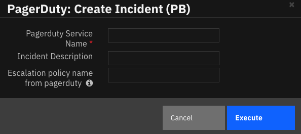
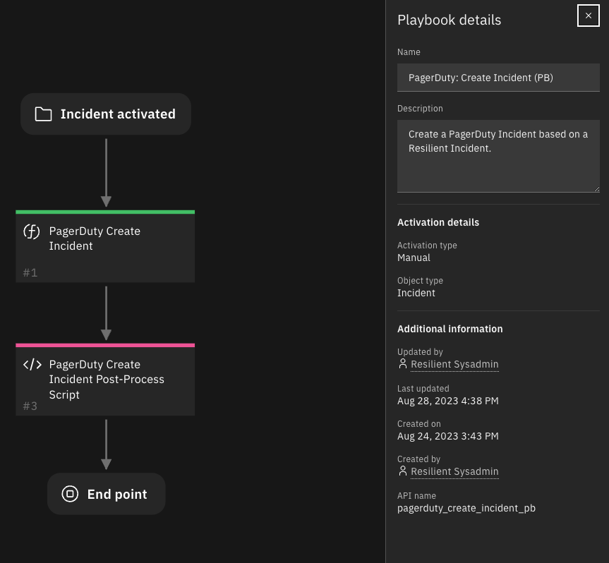
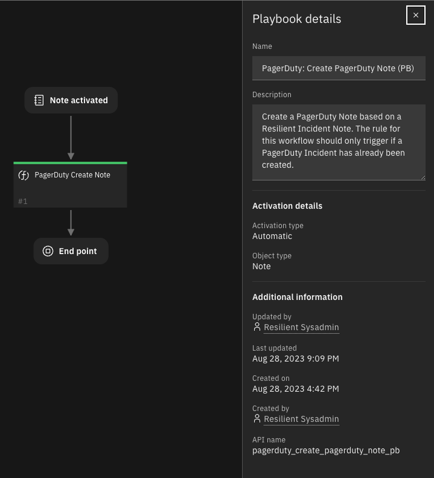
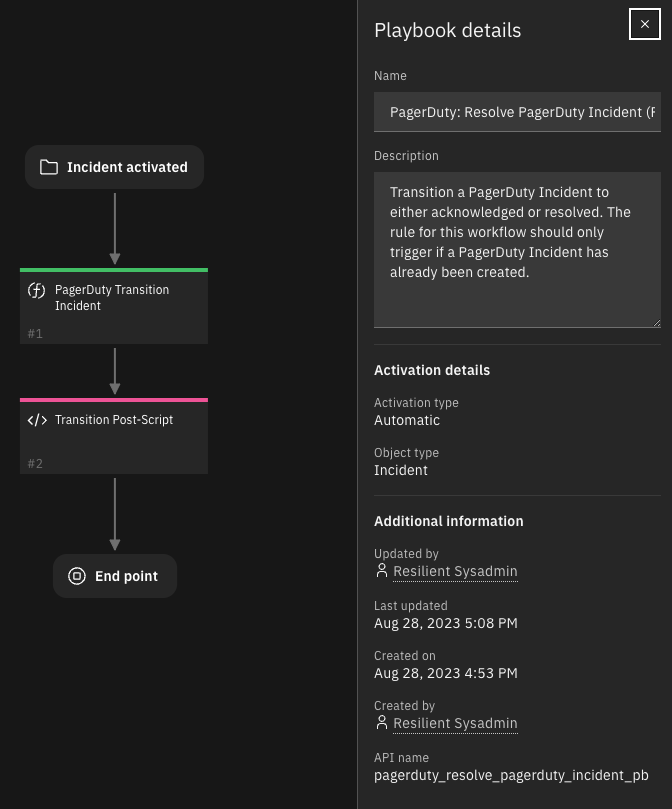

# PagerDuty App 

## Table of Contents
- [Release Notes](#release-notes)
- [Overview](#overview)
  - [Key Features](#key-features)
- [Requirements](#requirements)
  - [SOAR platform](#soar-platform)
  - [Cloud Pak for Security](#cloud-pak-for-security)
  - [Proxy Server](#proxy-server)
  - [Python Environment](#python-environment)
  - [Endpoint Developed With](#endpoint-developed-with)
- [Installation](#installation)
  - [Install](#install)
  - [App Configuration](#app-configuration)
- [Function - PagerDuty Create Incident](#function---pagerduty-create-incident)
- [Function - PagerDuty Create Note](#function---pagerduty-create-note)
- [Function - PagerDuty Transition Incident](#function---pagerduty-transition-incident)
- [Custom Fields](#custom-fields)
- [Playbooks](#Playbooks)
- [Troubleshooting & Support](#troubleshooting--support)
---

## Release Notes
| Version | Date | Notes |
| ------- | ---- | ----- |
| 1.0.0 | 09/2018 | Initial Release |
| 1.0.1 | 05/2020 | Support added for App Host |
| 1.0.2 | 07/2022 | Updated documentation to new format |
| 1.1.0 | 09/2022 | Add Playbooks
---
### fn_pagerduty 2.1.0 Changes
In v1.1.0, the existing rules and workflows have been replaced with playbooks. This change is made to support the ongoing, newer capabilities of playbooks. Each playbook has the same functionality as the previous, corresponding rule/workflow.

If upgrading from a previous release, you'll noticed that the previous release's rules/workflows remain in place. Both sets of rules and playbooks are active. For manual actions, playbooks will have the same name as it's corresponding rule, but with "(PB)" added at the end. For automatic actions, the playbooks will be disabled by default.

You can continue to use the rules/workflows. But migrating to playbooks will provide greater functionality along with future app enhancements and bug fixes.

## Overview

**Resilient Circuits Components for 'fn_pagerduty'**

Resilient Circuits Components for 'fn_pagerduty'. Used to create pagerduty incidents, create notes and transition incidents (acknowledged and resolved)

### Key Features
This Resilient Functions package provides integration with PagerDuty for:
* Incident Creation
* Incident Transitions
* Note Creation

---

## Requirements

This app supports the IBM Security QRadar SOAR Platform and the IBM Security QRadar SOAR for IBM Cloud Pak for Security.

### SOAR platform
The SOAR platform supports two app deployment mechanisms, App Host and integration server.

If deploying to a SOAR platform with an App Host, the requirements are:
* SOAR platform >= `46.0.8131`.
* The app is in a container-based format (available from the AppExchange as a `zip` file).

If deploying to a SOAR platform with an integration server, the requirements are:
* SOAR platform >= `46.0.8131`.
* The app is in the older integration format (available from the AppExchange as a `zip` file which contains a `tar.gz` file).
* Integration server is running `resilient_circuits>=45.0.0`.
* If using an API key account, make sure the account provides the following minimum permissions: 
  | Name | Permissions |
  | ---- | ----------- |
  | Org Data | Read |
  | Function | Read |

The following SOAR platform guides provide additional information: 
* _App Host Deployment Guide_: provides installation, configuration, and troubleshooting information, including proxy server settings. 
* _Integration Server Guide_: provides installation, configuration, and troubleshooting information, including proxy server settings.
* _System Administrator Guide_: provides the procedure to install, configure and deploy apps. 

The above guides are available on the IBM Documentation website at [ibm.biz/soar-docs](https://ibm.biz/soar-docs). On this web page, select your SOAR platform version. On the follow-on page, you can find the _App Host Deployment Guide_ or _Integration Server Guide_ by expanding **Apps** in the Table of Contents pane. The System Administrator Guide is available by expanding **System Administrator**.

### Cloud Pak for Security
If you are deploying to IBM Cloud Pak for Security, the requirements are:
* IBM Cloud Pak for Security >= 1.4.
* Cloud Pak is configured with an App Host.
* The app is in a container-based format (available from the AppExchange as a `zip` file).

The following Cloud Pak guides provide additional information: 
* _App Host Deployment Guide_: provides installation, configuration, and troubleshooting information, including proxy server settings. From the Table of Contents, select Case Management and Orchestration & Automation > **Orchestration and Automation Apps**.
* _System Administrator Guide_: provides information to install, configure, and deploy apps. From the IBM Cloud Pak for Security IBM Documentation table of contents, select Case Management and Orchestration & Automation > **System administrator**.

These guides are available on the IBM Documentation website at [ibm.biz/cp4s-docs](https://ibm.biz/cp4s-docs). From this web page, select your IBM Cloud Pak for Security version. From the version-specific IBM Documentation page, select Case Management and Orchestration & Automation.

### Proxy Server
The app does not support a proxy server.

### Python Environment
Both Python 3.6 and 3.9 are supported

Additional package dependencies may exist for each of these packages:
* beautifulsoup4
* pdpyras
* resilient-lib
* resilient_circuits>=30.0.0


#### Prerequisites
resilient-circuits >=v30.0.0

#### Configuration
Follow the steps to add a pagerduty section to your `app.config` file by running `resilient-circuits config [-u | -c]` and updating the fields:

```
[pagerduty]
api_token=<api_token>
# bypass https certificate validation (only set to False for testing purposes)
verifyFlag=False
resilient_client=IBM Resilient
```


## Installation

### Install
* To install or uninstall an App or Integration on the _SOAR platform_, see the documentation at [ibm.biz/soar-docs](https://ibm.biz/soar-docs).
* To install or uninstall an App on _IBM Cloud Pak for Security_, see the documentation at [ibm.biz/cp4s-docs](https://ibm.biz/cp4s-docs) and follow the instructions above to navigate to Orchestration and Automation.

### App Configuration
The following table provides the settings you need to configure the app. These settings are made in the app.config file. See the documentation discussed in the Requirements section for the procedure.

| Config | Required | Example | Description |
| ------ | :------: | ------- | ----------- |
| **api_token** | Yes | `<api_token>` | API Token from pagerduty |
| **from_email** | Yes | `some@email.com` | for some endpoints (namely creating and modifying incidents), pagerduty requires the "email address of the user to record as having taken the action". In this app, this is passed to the package `pdpyras` as `default_from`. You can read about pdpyras [here](https://pagerduty.github.io/pdpyras/#using-a-basic-rest-api-key), and read about pagerduty's REST API headers (of which is the from_email header) [here](https://developer.pagerduty.com/docs/ZG9jOjExMDI5NTUw-rest-api-v2-overview)|
| **resilient_client** | Yes | `IBM Resilient` | this refers to the name identifier used for logging|
| **verifyflag** | Yes | `False` | True/False flag associated with https client certification (False means no https certification) |


---

## Function - PagerDuty Create Incident
Create a PagerDuty Incident based on a Resilient Incident

  

   


<details><summary>Inputs:</summary>
<p>

| Name | Type | Required | Example | Tooltip |
| ---- | :--: | :------: | ------- | ------- |
| `incidentID` | `number` | No | `-` | incident_id, typically from incident.id |
| `pd_description` | `text` | No | `-` | description from pagerduty |
| `pd_escalation_policy` | `text` | Yes | `-` | escalation policy name from pagerduty |
| `pd_incident_key` | `text` | No | `-` | used during acknowledge and resolve event actions |
| `pd_priority` | `text` | No | `-` | incident priority |
| `pd_service` | `text` | Yes | `-` | service name from pagerduty |
| `pd_title` | `text` | Yes | `-` | title from pagerduty |

</p>
</details>

<details><summary>Outputs:</summary>
<p>

> **NOTE:** This example might be in JSON format, but `results` is a Python Dictionary on the SOAR platform.

```python
results = {
  "pd": {
    "incident": {
      "acknowledgements": [],
      "alert_counts": {
        "all": 0,
        "resolved": 0,
        "triggered": 0
      },
      "alert_grouping": null,
      "assigned_via": "escalation_policy",
      "assignments": [
        {
          "assignee": {
            "html_url": "https://soar-hydra.pagerduty.com/users/PMTNPRV",
            "id": "PMTNPRV",
            "self": "https://api.pagerduty.com/users/PMTNPRV",
            "summary": "Sami Amer",
            "type": "user_reference"
          },
          "at": "2022-07-15T19:47:21Z"
        }
      ],
      "basic_alert_grouping": null,
      "body": {
        "details": "https://murine1.fyre.ibm.com:443/#incidents/2100\n"
      },
      "created_at": "2022-07-15T19:47:21Z",
      "description": "Resilient: pd_test",
      "escalation_policy": {
        "html_url": "https://soar-hydra.pagerduty.com/escalation_policies/PYAMD55",
        "id": "PYAMD55",
        "self": "https://api.pagerduty.com/escalation_policies/PYAMD55",
        "summary": "Default",
        "type": "escalation_policy_reference"
      },
      "first_trigger_log_entry": {
        "html_url": "https://soar-hydra.pagerduty.com/incidents/Q1I8E2P0CJSIIB/log_entries/R5OQSQS81S9AS5KS9FLX770IG4",
        "id": "R5OQSQS81S9AS5KS9FLX770IG4",
        "self": "https://api.pagerduty.com/log_entries/R5OQSQS81S9AS5KS9FLX770IG4",
        "summary": "Triggered through the website.",
        "type": "trigger_log_entry_reference"
      },
      "html_url": "https://soar-hydra.pagerduty.com/incidents/Q1I8E2P0CJSIIB",
      "id": "Q1I8E2P0CJSIIB",
      "impacted_services": [
        {
          "html_url": "https://soar-hydra.pagerduty.com/service-directory/PFA4BVU",
          "id": "PFA4BVU",
          "self": "https://api.pagerduty.com/services/PFA4BVU",
          "summary": "API Service",
          "type": "service_reference"
        }
      ],
      "incident_key": "RES-2100",
      "incident_number": 8,
      "incidents_responders": [],
      "is_mergeable": true,
      "last_status_change_at": "2022-07-15T19:47:21Z",
      "last_status_change_by": {
        "html_url": "https://soar-hydra.pagerduty.com/service-directory/PFA4BVU",
        "id": "PFA4BVU",
        "self": "https://api.pagerduty.com/services/PFA4BVU",
        "summary": "API Service",
        "type": "service_reference"
      },
      "pending_actions": [],
      "responder_requests": [],
      "self": "https://api.pagerduty.com/incidents/Q1I8E2P0CJSIIB",
      "service": {
        "html_url": "https://soar-hydra.pagerduty.com/service-directory/PFA4BVU",
        "id": "PFA4BVU",
        "self": "https://api.pagerduty.com/services/PFA4BVU",
        "summary": "API Service",
        "type": "service_reference"
      },
      "status": "triggered",
      "subscriber_requests": [],
      "summary": "[#8] Resilient: pd_test",
      "teams": [],
      "title": "Resilient: pd_test",
      "type": "incident",
      "urgency": "high"
    }
  }
}
```

</p>
</details>

<details><summary>Example Pre-Process Script:</summary>
<p>

```python
inputs.incidentID = incident.id
inputs.pd_title = "Resilient: {}".format(incident.name)
inputs.pd_incident_key = 'RES-'+str(incident.id)
    
priority = { 'Low': 'p3', 'Medium': 'p2', 'High': 'p1' }
if incident.severity_code in priority:
  inputs.pd_priority = priority.get(incident.severity_code)
else:
  inputs.pd_priority = 'p4' # lowest
    
if not incident.description is None:
  inputs.pd_description = incident.description.content

```

</p>
</details>

<details><summary>Example Post-Process Script:</summary>
<p>

```python
incident.properties.pd_incident_id  = results.pd['incident']['id']
incident.properties.pd_incident_url = "<a href='{}' target='blank'>Link</a>".format(results.pd['incident']['html_url'])
```

</p>
</details>

---
## Function - PagerDuty Create Note
Create a PagerDuty Note based on a Resilient Incident's Note
  

<details><summary>Inputs:</summary>
<p>

| Name | Type | Required | Example | Tooltip |
| ---- | :--: | :------: | ------- | ------- |
| `pd_description` | `text` | No | `-` | description from pagerduty |
| `pd_incident_id` | `text` | Yes | `-` | id of incident |

</p>
</details>

<details><summary>Outputs:</summary>
<p>

> **NOTE:** This example might be in JSON format, but `results` is a Python Dictionary on the SOAR platform.

```python
results = {
  "note": {
    "channel": {
      "summary": "The PagerDuty website or APIs"
    },
    "content": "Test Note",
    "created_at": "2022-07-15T15:48:12-04:00",
    "id": "PNL36C8",
    "user": {
      "html_url": "https://soar-hydra.pagerduty.com/users/PMTNPRV",
      "id": "PMTNPRV",
      "self": "https://api.pagerduty.com/users/PMTNPRV",
      "summary": "Sami Amer",
      "type": "user_reference"
    }
  }
}
```

</p>
</details>

<details><summary>Example Pre-Process Script:</summary>
<p>

```python
inputs.pd_incident_id = incident.properties.pd_incident_id
inputs.pd_description = note.text.content
```

</p>
</details>

<details><summary>Example Post-Process Script:</summary>
<p>

```python
None
```

</p>
</details>

---
## Function - PagerDuty Transition Incident
Transition a PagerDuty Incident based on changes to a Resilient Incident (such as Closing the Incident)

  
 
   

<details><summary>Inputs:</summary>
<p>

| Name | Type | Required | Example | Tooltip |
| ---- | :--: | :------: | ------- | ------- |
| `pd_description` | `text` | No | `-` | descrption from pagerduty |
| `pd_incident_id` | `text` | Yes | `-` | id of incident |
| `pd_priority` | `text` | No | `-` | incident priority |
| `pd_status` | `text` | No | `-` | status of pagerduty incident |

</p>
</details>

<details><summary>Outputs:</summary>
<p>

> **NOTE:** This example might be in JSON format, but `results` is a Python Dictionary on the SOAR platform.

```python
results = {
  "incident": {
    "acknowledgements": [],
    "alert_counts": {
      "all": 0,
      "resolved": 0,
      "triggered": 0
    },
    "alert_grouping": null,
    "assigned_via": "escalation_policy",
    "assignments": [],
    "basic_alert_grouping": null,
    "created_at": "2022-07-15T19:47:21Z",
    "description": "Resilient: pd_test",
    "escalation_policy": {
      "html_url": "https://soar-hydra.pagerduty.com/escalation_policies/PYAMD55",
      "id": "PYAMD55",
      "self": "https://api.pagerduty.com/escalation_policies/PYAMD55",
      "summary": "Default",
      "type": "escalation_policy_reference"
    },
    "first_trigger_log_entry": {
      "html_url": "https://soar-hydra.pagerduty.com/incidents/Q1I8E2P0CJSIIB/log_entries/R5OQSQS81S9AS5KS9FLX770IG4",
      "id": "R5OQSQS81S9AS5KS9FLX770IG4",
      "self": "https://api.pagerduty.com/log_entries/R5OQSQS81S9AS5KS9FLX770IG4",
      "summary": "Triggered through the website.",
      "type": "trigger_log_entry_reference"
    },
    "html_url": "https://soar-hydra.pagerduty.com/incidents/Q1I8E2P0CJSIIB",
    "id": "Q1I8E2P0CJSIIB",
    "impacted_services": [
      {
        "html_url": "https://soar-hydra.pagerduty.com/service-directory/PFA4BVU",
        "id": "PFA4BVU",
        "self": "https://api.pagerduty.com/services/PFA4BVU",
        "summary": "API Service",
        "type": "service_reference"
      }
    ],
    "incident_key": "RES-2100",
    "incident_number": 8,
    "incidents_responders": [],
    "is_mergeable": true,
    "last_status_change_at": "2022-07-15T19:55:22Z",
    "last_status_change_by": {
      "html_url": "https://soar-hydra.pagerduty.com/users/PMTNPRV",
      "id": "PMTNPRV",
      "self": "https://api.pagerduty.com/users/PMTNPRV",
      "summary": "Sami Amer",
      "type": "user_reference"
    },
    "pending_actions": [],
    "resolve_reason": null,
    "responder_requests": [],
    "self": "https://api.pagerduty.com/incidents/Q1I8E2P0CJSIIB",
    "service": {
      "html_url": "https://soar-hydra.pagerduty.com/service-directory/PFA4BVU",
      "id": "PFA4BVU",
      "self": "https://api.pagerduty.com/services/PFA4BVU",
      "summary": "API Service",
      "type": "service_reference"
    },
    "status": "resolved",
    "subscriber_requests": [],
    "summary": "[#8] Resilient: pd_test",
    "teams": [],
    "title": "Resilient: pd_test",
    "type": "incident",
    "urgency": "high"
  }
}
```

</p>
</details>

<details><summary>Example Pre-Process Script:</summary>
<p>

```python
inputs.pd_incident_id = incident.properties.pd_incident_id
if incident.resolution_id:
  inputs.pd_status = 'resolved'
  inputs.pd_description = incident.resolution_summary.content
#else:
#  inputs.pd_status = 'acknowledged'
  
priority = { 'Low': 'p3', 'Medium': 'p2', 'High': 'p1' }
if incident.severity_code in priority:
  inputs.pd_priority = priority.get(incident.severity_code)
```

</p>
</details>

<details><summary>Example Post-Process Script:</summary>
<p>

```python
None
```

</p>
</details>

---


## Custom Fields
| Label | API Access Name | Type | Prefix | Placeholder | Tooltip |
| ----- | --------------- | ---- | ------ | ----------- | ------- |
| PagerDuty Incident ID | `pd_incident_id` | `text` | `properties` | - | field to contain the pagerduty incident Id created |
| PagerDuty Incident URL | `pd_incident_url` | `textarea` | `properties` | - | - |

---


## Playbooks
| Rule Name | Object | Activation type | Status |
| --------- | ------ | ------ | ------------------ |
| PagerDuty: Create Incident (PB) | incident |Manual| `enabled` |
| PagerDuty: Create PagerDuty Note (PB) | note |Automatic| `enabled` |
| PagerDuty: Resolve PagerDuty Incident (PB) | incident | Automatic |`enabled` |
| PagerDuty: Update PagerDuty Incident Severity (PB) | incident | Automatic | `enabled` |

---


## Troubleshooting & Support
Refer to the documentation listed in the Requirements section for troubleshooting information.

### For Support
This is a IBM Community provided App. Please search the Community [ibm.biz/soarcommunity](https://ibm.biz/soarcommunity) for assistance.
