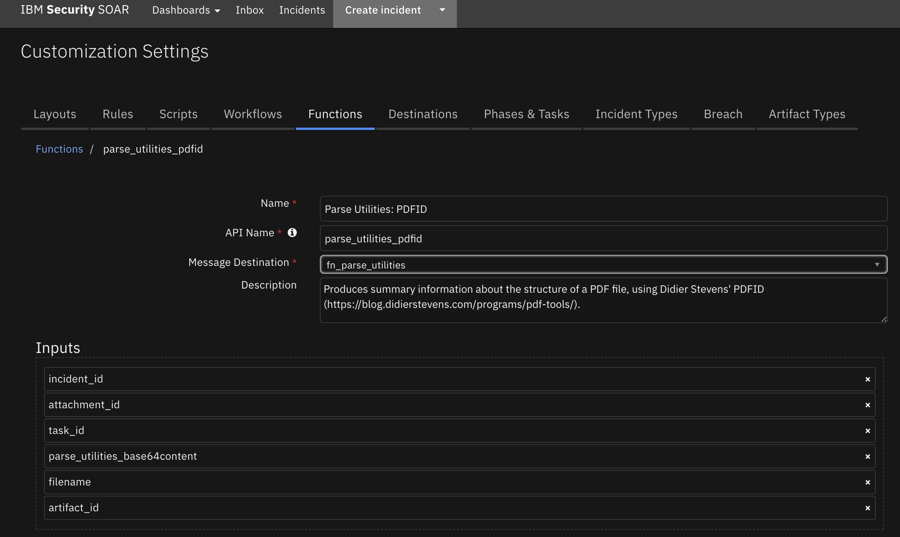

<!--
  This README.md is generated by running:
  "resilient-sdk docgen -p fn_parse_utilities"

  It is best edited using a Text Editor with a Markdown Previewer. VS Code
  is a good example. Checkout https://guides.github.com/features/mastering-markdown/
  for tips on writing with Markdown

  All fields followed by "::CHANGE_ME::"" should be manually edited

  If you make manual edits and run docgen again, a .bak file will be created

  Store any screenshots in the "doc/screenshots" directory and reference them like:
  

  NOTE: If your app is available in the container-format only, there is no need to mention the integration server in this readme.
-->

# Parse Utilities Function for SOAR

## Table of Contents
- [Release Notes](#release-notes)
- [Overview](#overview)
  - [Key Features](#key-features)
- [Requirements](#requirements)
  - [SOAR platform](#soar-platform)
  - [Cloud Pak for Security](#cloud-pak-for-security)
  - [Proxy Server](#proxy-server)
  - [Python Environment](#python-environment)
  - [Endpoint Developed With](#endpoint-developed-with)
- [Installation](#installation)
  - [Install](#install)
  - [App Configuration](#app-configuration)
- [Function - Parse Utilities: Email Parse](#function---parse-utilities-email-parse)
- [Function - Parse Utilities: Parse SSL Certificate](#function---parse-utilities-parse-ssl-certificate)
- [Function - Parse Utilities: PDFID](#function---parse-utilities-pdfid)
- [Function - Parse Utilities: XML Transformation](#function---parse-utilities-xml-transformation)
- [Rules](#rules)
- [Troubleshooting & Support](#troubleshooting--support)
---

## Release Notes
<!--
  Specify all changes in this release. Do not remove the release 
  notes of a previous release
-->
| Version | Date | Notes |
| ------- | ---- | ----- |
| 1.0.0 | 10/2022 | Initial Release |

---

## Overview
<!--
  Provide a high-level description of the function itself and its remote software or application.
  The text below is parsed from the "description" and "long_description" attributes in the setup.py file
-->
**Useful workflow/playbook functions to use for common parsing in the SOAR platform**

 

This package contains functions to parse information from emails, ssl certificates, and PDFs as well as a function to transform an XML document using a preexisting xsl stylesheet.

### Key Features
<!--
  List the Key Features of the Integration
-->
* Parse emails to extract message headers and body parts
* Produces summary info about the structure of a PDF file
* Parses SSL certificates
* Transform an XML document using a preexisting xsl stylesheet

---

This app supports the IBM Security QRadar SOAR Platform and the IBM Security QRadar SOAR for IBM Cloud Pak for Security.

### SOAR platform
The SOAR platform supports two app deployment mechanisms, App Host and integration server.

If deploying to a SOAR platform with an App Host, the requirements are:
* SOAR platform >= `43.1.49`.
* The app is in a container-based format (available from the AppExchange as a `zip` file).

If deploying to a SOAR platform with an integration server, the requirements are:
* SOAR platform >= `43.1.49`.
* The app is in the older integration format (available from the AppExchange as a `zip` file which contains a `tar.gz` file).
* Integration server is running `resilient-circuits>=46.0.0`.
* If using an API key account, make sure the account provides the following minimum permissions: 
  | Name | Permissions |
  | ---- | ----------- |
  | Org Data | Read |
  | Function | Read |

The following SOAR platform guides provide additional information: 
* _App Host Deployment Guide_: provides installation, configuration, and troubleshooting information, including proxy server settings. 
* _Integration Server Guide_: provides installation, configuration, and troubleshooting information, including proxy server settings.
* _System Administrator Guide_: provides the procedure to install, configure and deploy apps. 

The above guides are available on the IBM Documentation website at [ibm.biz/soar-docs](https://ibm.biz/soar-docs). On this web page, select your SOAR platform version. On the follow-on page, you can find the _App Host Deployment Guide_ or _Integration Server Guide_ by expanding **Apps** in the Table of Contents pane. The System Administrator Guide is available by expanding **System Administrator**.

### Cloud Pak for Security
If you are deploying to IBM Cloud Pak for Security, the requirements are:
* IBM Cloud Pak for Security >= 1.7.
* Cloud Pak is configured with an App Host.
* The app is in a container-based format (available from the AppExchange as a `zip` file).

The following Cloud Pak guides provide additional information: 
* _App Host Deployment Guide_: provides installation, configuration, and troubleshooting information, including proxy server settings. From the Table of Contents, select Case Management and Orchestration & Automation > **Orchestration and Automation Apps**.
* _System Administrator Guide_: provides information to install, configure, and deploy apps. From the IBM Cloud Pak for Security IBM Documentation table of contents, select Case Management and Orchestration & Automation > **System administrator**.

These guides are available on the IBM Documentation website at [ibm.biz/cp4s-docs](https://ibm.biz/cp4s-docs). From this web page, select your IBM Cloud Pak for Security version. From the version-specific IBM Documentation page, select Case Management and Orchestration & Automation.

### Proxy Server
The app does support a proxy server.

### Python Environment
This has been tested in both Python 3.6 and Python 3.9, however it suggested to use Python 3.7 or greater.
Additional package dependencies may exist for each of these packages:
* cryptography~=36.0
* defusedxml~=0.7.1
* lxml~=4.8
* mail-parser~=3.15
* pdfid~=1.1
* pyOpenSSL~=22.0
* resilient-circuits>=46.0.0

---

## Installation

### Install
* To install or uninstall an App or Integration on the _SOAR platform_, see the documentation at [ibm.biz/soar-docs](https://ibm.biz/soar-docs).
* To install or uninstall an App on _IBM Cloud Pak for Security_, see the documentation at [ibm.biz/cp4s-docs](https://ibm.biz/cp4s-docs) and follow the instructions above to navigate to Orchestration and Automation.

### App Configuration
The following table provides the settings you need to configure the app. These settings are made in the app.config file. See the documentation discussed in the Requirements section for the procedure.

| Config | Required | Example | Description |
| ------ | :------: | ------- | ----------- |
| **xml_stylesheet_dir** | Yes | /Path/to/stylesheet | Path to stylesheet for transforming XML document |


---

## Function - Parse Utilities: Email Parse
Extracts message headers and body parts from an email message (.eml or .msg).

Any attachments found are added to the incident as artifacts if `parse_utilities_parse_email_attachments` is set to True.

 

<details><summary>Inputs:</summary>
<p>

| Name | Type | Required | Example | Tooltip |
| ---- | :--: | :------: | ------- | ------- |
| `artifact_id` | `number` | No | `-` | - |
| `attachment_id` | `number` | No | `-` | - |
| `incident_id` | `number` | Yes | `-` | - |
| `parse_utilities_base64content` | `text` | No | `-` | - |
| `parse_utilities_email_attachments` | `boolean` | No | `-` | If set to True, attachments found in the email file will be attached as Artifacts |
| `task_id` | `number` | No | `-` | - |

</p>
</details>

<details><summary>Outputs:</summary>
<p>

> **NOTE:** This example might be in JSON format, but `results` is a Python Dictionary on the SOAR platform.

```python
results = {
  "content": {
    "authentication-results": "spf=none (sender IP is 169.55.84.251)\r\n smtp.mailfrom=example1.fyre.ibm.com; dkim=none (message not signed)\r\n header.d=none;dmarc=fail action=none header.from=us.ibm.com;",
    "body": "\u003cmeta http-equiv=\"Content-Type\" content=\"text/html; charset=utf-8\"\u003e\u003ctable cellpadding=\"4\"\u003e\u003ctr\u003e\u003ctd align=\"left\" colspan=\"4\"\u003e \u003cfont face=\"verdana\" size=\"2\"\u003eCongratulations, you\u0027re all ready to go!!\r\n\u003cbr\u003e\u003c/td\u003e\u003c/tr\u003e\u003ctr\u003e\u003ctd align=\"left\" colspan=\"4\"\u003e \u003cfont face=\"verdana\" size=\"2\"\u003eYour cluster \u003cb\u003elead\u003c/b\u003e has been built with the following\r\nconfiguration :\u003c/b\u003e\u003cbr\u003e\u003c/td\u003e\u003c/tr\u003e\u003ctr bgcolor=\"orange\"\u003e\u003cth\u003e\u003cfont face=\"verdana\" size=\"2\"\u003eEmbers\u003c/th\u003e\u003cth\u003e\u003cfont face=\"verdana\" size=\"2\"\u003ePublic\r\nIP\u003c/th\u003e\u003cth\u003e\u003cfont face=\"verdana\" size=\"2\"\u003ePrivate IP \u003c/th\u003e\u003cth\u003e\u003cfont face=\"verdana\" size=\"2\"\u003eAdditional Disks\u003c/th\u003e\u003ctr\u003e\u003ctr\u003e\u003ctd align=\"left\" bgcolor=\"#f0f0f0\"\u003e\u003cfont face=\"verdana\" size=\"2\"\u003e\u003cb\u003elead1\u003c/b\u003e.fyre.ibm.com \u003c/td\u003e\u003ctd bgcolor=\"#f0f0f0\"\u003e\u003cfont face=\"verdana\" size=\"2\"\u003e9.30.211.110\u003c/td\u003e\u003ctd bgcolor=\"#f0f0f0\"\u003e\u003cfont face=\"verdana\" size=\"2\"\u003e10.11.38.164\u003c/td\u003e\u003ctd bgcolor=\"#f0f0f0\"\u003e\u003cfont face=\"verdana\" size=\"2\"\u003e--\u003c/td\u003e\u003ctr\u003e\u003ctr\u003e\u003ctd colspan=\"4\" align=\"left\"\u003e \u003cfont face=\"verdana\" size=\"2\"\u003e\u003cbr\u003e\u003cbr\u003e\u003cb\u003eLogin Credentials:\u003c/b\u003e\u003c/td\u003e\u003c/tr\u003e\u003ctr\u003e\u003ctd colspan=\"4\" align=\"left\"\u003e \u003cfont face=\"verdana\" size=\"2\"\u003e You can now log\r\ninto the node(s) of your cluster with the following credentials:\r\n\u003cbr\u003e\u003c/td\u003e\u003c/tr\u003e\u003ctr\u003e\u003ctd colspan=\"4\" align=\"left\"\u003e \u003cfont face=\"verdana\" size=\"2\"\u003e Username: root\u003c/td\u003e\u003c/tr\u003e\u003ctr\u003e\u003ctd colspan=\"4\" align=\"left\"\u003e \u003cfont face=\"verdana\" size=\"2\"\u003e Password: Your personal root password that you\r\nset on the Fyre webpage. \u003cbr\u003e\u003cbr\u003e\u003c/td\u003e\u003c/tr\u003e\u003ctr\u003e\u003ctd colspan=\"4\" align=\"left\"\u003e \u003cfont face=\"verdana\" size=\"2\"\u003e\u003cbr\u003e\u003cb\u003eSecurity schedule\u003cb\u003e:\r\n\u003c/td\u003e\u003c/tr\u003e\u003ctr\u003e\u003ctd colspan=\"4\" align=\"left\"\u003e \u003cfont face=\"verdana\" size=\"2\"\u003e\r\nYour cluster will be kept compliant automatically and will be patched\r\nand rebooted on the 1st weekend of each month.  You can change this\r\nschedule or disable it on a per-cluster basis from the Fyre\r\nGUI.\u003c/td\u003e\u003c/tr\u003e\u003ctr\u003e\u003ctd colspan=\"4\" align=\"left\"\u003e \u003cfont face=\"verdana\" size=\"2\"\u003e\u003cbr\u003e\u003cb\u003eTerms of Use\u003cb\u003e: \u003c/td\u003e\u003c/tr\u003e\u003ctr\u003e\u003ctd colspan=\"4\" align=\"left\"\u003e \u003cfont face=\"verdana\" size=\"2\"\u003eBy using Fyre and/or Fyre resources\r\n(vms, clusters, etc), you agree to always abide by the Fyre Terms of\r\nUse.  \u003cbr\u003e\r\n\tThese terms can be found here: \u003ca href=\"https://fyre.ibm.com/help#fyre-termsofuse\"\u003ehttps://fyre.ibm.com/help#fyre-termsofuse\u003c/a\u003e\u003c/td\u003e\u003c/tr\u003e\u003ctr\u003e\u003ctd colspan=\"4\" align=\"left\"\u003e \u003cfont face=\"verdana\" size=\"2\"\u003e\r\n\u003cbr\u003e\u003cbr\u003eThanks!\u003c/td\u003e\u003c/tr\u003e\u003ctr\u003e\u003ctd colspan=\"4\" align=\"left\"\u003e \u003cfont face=\"verdana\" size=\"2\"\u003e ~ The Fyre Team\u003c/td\u003e\u003c/tr\u003e\u003c/table\u003e\r\n",
    "content-type": "text/html; charset=\"UTF-8\"",
    "date": "2022-10-10T19:54:18",
    "from": [
      [
        "Fyre Admin",
        "fyre@us.ibm.com"
      ]
    ],
    "has_defects": false,
    "html_body": "[\"\u003cmeta http-equiv=\\\"Content-Type\\\" content=\\\"text/html; charset=utf-8\\\"\u003e\u003ctable cellpadding=\\\"4\\\"\u003e\u003ctr\u003e\u003ctd align=\\\"left\\\" colspan=\\\"4\\\"\u003e \u003cfont face=\\\"verdana\\\" size=\\\"2\\\"\u003eCongratulations, you\u0027re all ready to go!!\\r\\n\u003cbr\u003e\u003c/td\u003e\u003c/tr\u003e\u003ctr\u003e\u003ctd align=\\\"left\\\" colspan=\\\"4\\\"\u003e \u003cfont face=\\\"verdana\\\" size=\\\"2\\\"\u003eYour cluster \u003cb\u003elead\u003c/b\u003e has been built with the following\\r\\nconfiguration :\u003c/b\u003e\u003cbr\u003e\u003c/td\u003e\u003c/tr\u003e\u003ctr bgcolor=\\\"orange\\\"\u003e\u003cth\u003e\u003cfont face=\\\"verdana\\\" size=\\\"2\\\"\u003eEmbers\u003c/th\u003e\u003cth\u003e\u003cfont face=\\\"verdana\\\" size=\\\"2\\\"\u003ePublic\\r\\nIP\u003c/th\u003e\u003cth\u003e\u003cfont face=\\\"verdana\\\" size=\\\"2\\\"\u003ePrivate IP \u003c/th\u003e\u003cth\u003e\u003cfont face=\\\"verdana\\\" size=\\\"2\\\"\u003eAdditional Disks\u003c/th\u003e\u003ctr\u003e\u003ctr\u003e\u003ctd align=\\\"left\\\" bgcolor=\\\"#f0f0f0\\\"\u003e\u003cfont face=\\\"verdana\\\" size=\\\"2\\\"\u003e\u003cb\u003elead1\u003c/b\u003e.fyre.ibm.com \u003c/td\u003e\u003ctd bgcolor=\\\"#f0f0f0\\\"\u003e\u003cfont face=\\\"verdana\\\" size=\\\"2\\\"\u003e9.30.211.110\u003c/td\u003e\u003ctd bgcolor=\\\"#f0f0f0\\\"\u003e\u003cfont face=\\\"verdana\\\" size=\\\"2\\\"\u003e10.11.38.164\u003c/td\u003e\u003ctd bgcolor=\\\"#f0f0f0\\\"\u003e\u003cfont face=\\\"verdana\\\" size=\\\"2\\\"\u003e--\u003c/td\u003e\u003ctr\u003e\u003ctr\u003e\u003ctd colspan=\\\"4\\\" align=\\\"left\\\"\u003e \u003cfont face=\\\"verdana\\\" size=\\\"2\\\"\u003e\u003cbr\u003e\u003cbr\u003e\u003cb\u003eLogin Credentials:\u003c/b\u003e\u003c/td\u003e\u003c/tr\u003e\u003ctr\u003e\u003ctd colspan=\\\"4\\\" align=\\\"left\\\"\u003e \u003cfont face=\\\"verdana\\\" size=\\\"2\\\"\u003e You can now log\\r\\ninto the node(s) of your cluster with the following credentials:\\r\\n\u003cbr\u003e\u003c/td\u003e\u003c/tr\u003e\u003ctr\u003e\u003ctd colspan=\\\"4\\\" align=\\\"left\\\"\u003e \u003cfont face=\\\"verdana\\\" size=\\\"2\\\"\u003e Username: root\u003c/td\u003e\u003c/tr\u003e\u003ctr\u003e\u003ctd colspan=\\\"4\\\" align=\\\"left\\\"\u003e \u003cfont face=\\\"verdana\\\" size=\\\"2\\\"\u003e Password: Your personal root password that you\\r\\nset on the Fyre webpage. \u003cbr\u003e\u003cbr\u003e\u003c/td\u003e\u003c/tr\u003e\u003ctr\u003e\u003ctd colspan=\\\"4\\\" align=\\\"left\\\"\u003e \u003cfont face=\\\"verdana\\\" size=\\\"2\\\"\u003e\u003cbr\u003e\u003cb\u003eSecurity schedule\u003cb\u003e:\\r\\n\u003c/td\u003e\u003c/tr\u003e\u003ctr\u003e\u003ctd colspan=\\\"4\\\" align=\\\"left\\\"\u003e \u003cfont face=\\\"verdana\\\" size=\\\"2\\\"\u003e\\r\\nYour cluster will be kept compliant automatically and will be patched\\r\\nand rebooted on the 1st weekend of each month.  You can change this\\r\\nschedule or disable it on a per-cluster basis from the Fyre\\r\\nGUI.\u003c/td\u003e\u003c/tr\u003e\u003ctr\u003e\u003ctd colspan=\\\"4\\\" align=\\\"left\\\"\u003e \u003cfont face=\\\"verdana\\\" size=\\\"2\\\"\u003e\u003cbr\u003e\u003cb\u003eTerms of Use\u003cb\u003e: \u003c/td\u003e\u003c/tr\u003e\u003ctr\u003e\u003ctd colspan=\\\"4\\\" align=\\\"left\\\"\u003e \u003cfont face=\\\"verdana\\\" size=\\\"2\\\"\u003eBy using Fyre and/or Fyre resources\\r\\n(vms, clusters, etc), you agree to always abide by the Fyre Terms of\\r\\nUse.  \u003cbr\u003e\\r\\n\\tThese terms can be found here: \u003ca href=\\\"https://fyre.ibm.com/help#fyre-termsofuse\\\"\u003ehttps://fyre.ibm.com/help#fyre-termsofuse\u003c/a\u003e\u003c/td\u003e\u003c/tr\u003e\u003ctr\u003e\u003ctd colspan=\\\"4\\\" align=\\\"left\\\"\u003e \u003cfont face=\\\"verdana\\\" size=\\\"2\\\"\u003e\\r\\n\u003cbr\u003e\u003cbr\u003eThanks!\u003c/td\u003e\u003c/tr\u003e\u003ctr\u003e\u003ctd colspan=\\\"4\\\" align=\\\"left\\\"\u003e \u003cfont face=\\\"verdana\\\" size=\\\"2\\\"\u003e ~ The Fyre Team\u003c/td\u003e\u003c/tr\u003e\u003c/table\u003e\\r\\n\"]",
    "message-id": "\u003c202210101954.29AJsIaP1141965@example1.fyre.ibm.com\u003e",
    "mime-version": "1.0",
    "plain_body": "",
    "received": [
      {
        "by": "example1.fyre.ibm.com 8.15.2/8.15.2/Submit",
        "date": "Mon, 10 Oct 2022 12:54:18 -0700",
        "date_utc": "2022-10-10T19:54:18",
        "delay": 0,
        "from": "www-data@localhost",
        "hop": 1,
        "id": "29AJsIaP1141965"
      },
      {
        "by": "example1.fyre.ibm.com 8.15.2/8.15.2/Debian-10",
        "date": "Mon, 10 Oct 2022 12:54:18 -0700",
        "date_utc": "2022-10-10T19:54:18",
        "delay": 0.0,
        "for": "\u003cexample@ibm.com\u003e",
        "from": "example1.fyre.ibm.com localhost 127.0.0.1",
        "hop": 2,
        "id": "29AJsIxo1141966",
        "with": "ESMTP"
      },
      {
        "by": "b01ledav005.gho.pok.ibm.com Postfix",
        "date": "Mon, 10 Oct 2022 19:54:18 +0000 GMT",
        "date_utc": "2022-10-10T19:54:18",
        "delay": 0.0,
        "for": "\u003cexample@ibm.com\u003e",
        "from": "example1.fyre.ibm.com unknown 9.30.166.9",
        "hop": 3,
        "with": "ESMTPS"
      },
      {
        "by": "IMSVA Postfix",
        "date": "Mon, 10 Oct 2022 19:54:18 +0000 GMT",
        "date_utc": "2022-10-10T19:54:18",
        "delay": 0.0,
        "for": "\u003cexample@ibm.com\u003e",
        "from": "b01ledav005.gho.pok.ibm.com unknown 127.0.0.1",
        "hop": 4,
        "id": "F0260AE060",
        "with": "ESMTP"
      },
      {
        "by": "IMSVA Postfix",
        "date": "Mon, 10 Oct 2022 19:54:19 +0000 GMT",
        "date_utc": "2022-10-10T19:54:19",
        "delay": 1.0,
        "for": "\u003cexample@ibm.com\u003e",
        "from": "b01ledav005.gho.pok.ibm.com unknown 127.0.0.1",
        "hop": 5,
        "id": "3203BAE066",
        "with": "ESMTP"
      },
      {
        "by": "b01cxnp23034.gho.pok.ibm.com 8.14.9/8.14.9/NCO v10.0",
        "date": "Mon, 10 Oct 2022 19:54:19 GMT",
        "date_utc": "2022-10-10T19:54:19",
        "delay": 0.0,
        "for": "\u003cexample@ibm.com\u003e",
        "from": "b01ledav005.gho.pok.ibm.com b01ledav005.gho.pok.ibm.com 9.57.199.110",
        "hop": 6,
        "id": "29AJsJhU4784872\r version=TLSv1/SSLv3 cipher=DHE-RSA-AES256-GCM-SHA384 bits=256 verify=OK",
        "with": "ESMTP"
      },
      {
        "by": "m01ex002.gmx.ibm.com 10.148.53.59",
        "date": "Mon, 10 Oct 2022 15:54:19 -0400",
        "date_utc": "2022-10-10T19:54:19",
        "delay": 0.0,
        "from": "b01cxnp23034.gho.pok.ibm.com 9.57.198.29",
        "hop": 7,
        "id": "15.1.2507.12",
        "via": "Frontend Transport",
        "with": "Microsoft SMTP Server\r version=TLS1_2, cipher=TLS_ECDHE_RSA_WITH_AES_128_GCM_SHA256"
      },
      {
        "by": "m01ex004.gmx.ibm.com\r 10.148.53.60",
        "date": "Mon, 10 Oct\r 2022 15:54:19 -0400",
        "date_utc": "2022-10-10T19:54:19",
        "delay": 0.0,
        "from": "m01ex002.gmx.ibm.com 10.148.53.59",
        "hop": 8,
        "id": "15.1.2507.12",
        "with": "Microsoft SMTP Server version=TLS1_2,\r cipher=TLS_ECDHE_RSA_WITH_AES_128_GCM_SHA256"
      },
      {
        "by": "MW2NAM12FT057.mail.protection.outlook.com 10.13.181.5",
        "date": "Mon, 10 Oct 2022 19:54:24 +0000",
        "date_utc": "2022-10-10T19:54:24",
        "delay": 5.0,
        "from": "gmx.mail.ibm.com 169.55.84.251",
        "hop": 9,
        "id": "15.20.5723.11",
        "via": "Frontend Transport",
        "with": "Microsoft SMTP\r Server version=TLS1_2, cipher=TLS_ECDHE_RSA_WITH_AES_128_GCM_SHA256"
      },
      {
        "by": "MW4PR03CA0145.outlook.office365.com\r 2603:10b6:303:8c::30",
        "date": "Mon, 10 Oct 2022 19:54:24 +0000",
        "date_utc": "2022-10-10T19:54:24",
        "delay": 0.0,
        "from": "MW2NAM12FT057.eop-nam12.prod.protection.outlook.com\r 2603:10b6:303:8c:cafe::42",
        "hop": 10,
        "id": "15.20.5709.19",
        "via": "Frontend\r Transport",
        "with": "Microsoft SMTP Server version=TLS1_2,\r cipher=TLS_ECDHE_RSA_WITH_AES_256_GCM_SHA384"
      },
      {
        "by": "MN2PR15MB2877.namprd15.prod.outlook.com 2603:10b6:208:ee::17",
        "date": "Mon, 10 Oct\r 2022 19:54:24 +0000",
        "date_utc": "2022-10-10T19:54:24",
        "delay": 0.0,
        "from": "MW4PR03CA0145.namprd03.prod.outlook.com 2603:10b6:303:8c::30",
        "hop": 11,
        "id": "15.20.5709.15",
        "with": "Microsoft SMTP Server version=TLS1_2,\r cipher=TLS_ECDHE_RSA_WITH_AES_256_GCM_SHA384"
      },
      {
        "by": "BYAPR15MB2296.namprd15.prod.outlook.com",
        "date": "Mon, 10 Oct 2022\r 19:54:38 +0000",
        "date_utc": "2022-10-10T19:54:38",
        "delay": 14.0,
        "from": "MN2PR15MB2877.namprd15.prod.outlook.com 2603:10b6:208:ee::17",
        "hop": 12,
        "with": "HTTPS"
      }
    ],
    "received-spf": "None (protection.outlook.com: example.example.ibm.com does not\r\n designate permitted sender hosts)",
    "return-path": "www-data@example.example.ibm.com",
    "subject": "Example stack : \u0027lead\u0027 ready",
    "timezone": "-7.0",
    "to": [
      [
        "",
        "example@ibm.com"
      ]
    ],
    "to_domains": [
      "ibm.com"
    ],
    "x-crosspremisesheadersfiltered": "MW2NAM12FT057.eop-nam12.prod.protection.outlook.com",
    "x-crosspremisesheaderspromoted": "MW2NAM12FT057.eop-nam12.prod.protection.outlook.com",
    "x-eopattributedmessage": "0",
    "x-forefront-antispam-report": "CIP:169.55.84.251;CTRY:US;LANG:en;SCL:-1;SRV:;IPV:NLI;SFV:NSPM;H:gmx.mail.ibm.com;PTR:fb.54.37a9.ip4.static.sl-reverse.com;CAT:NONE;SFS:;DIR:INB;",
    "x-microsoft-antispam": "BCL:0;",
    "x-microsoft-antispam-mailbox-delivery": "ucf:0;jmr:0;auth:0;dest:I;ENG:(910001)(944506478)(944626604)(920097)(930097);",
    "x-microsoft-antispam-message-info": "FxHn9SLBjgFF4dnkfttJCPKsph9Xn/sEQCFV3yiLJGtgKZtqncl8KfT/dUhKZ0/gsMGuWHSea0qfzrAZ8+JHELx2xhOikG7lgDFxpsHiT9xi6/rannm53Ur5JqbUAGkXzJGXDA/BAUb1pjGogswkrl3NyGAq3+QSJ0XGJfOok63/Pa3ua6sCwzRjdEtzV0wK4YiTcMCMdhedpFPWf01iBcQPezd6aEHOg5EdMEnSFPFjSVfixP3nIqOsMSQLPS72ubUMz8JDhXycm1XennS6cGMb/WwByYS9YhfpFIiJqE3jFFLRnmzucI6msgFHRgQAS7nx2KYUZnnjJZbN1kS6bICVaRh4h2BrRhjb3G4b+HkkoW2Cqrhn4p+VnYIFH/hBPWuuophaKvQt/lJ0gIfR/svy0WBVtx1iRHY+lGgW8temE8vG4CS0oTgbztcMlMTmU5MNMszcSGHgeZZODkyeQPzi84QmpJdmiowkQqYynyv6yoYugLy3iIQfzv3XI0GChyctAVEzL34SAxwn+FCojNM/VYTp9XiZN3GSuqgvgwDpQNJpK6fxxdXhRsF6UG4eJpiQjHpCTYAg1y5njTGekjCqVsLkMeI5XYFdwOXKtceUos0vVCnUNVZxnEVxS2vJQWPZHziRd2tv8n/sMxdnIfXkQIDUSnby6M+X86IIYJYtf6vGPbTFaaYy8d8TVeHeEQNbnkyLuCmpKNek9xHHXBkz/5SSJ2JYb7/P6hzcVAXiIL2zlfLeUygHwl5yIupHY5QgqGOapnypnY4AfJWbIjpUL/EiB3aO0Mu+spvWoGZp3alMeYkvTTMmZcJrPOUJjY8Mgo4nhmJ+SWOo7VbAyoHwuJQrnfokBs3YCfHAHtub8WPcWDmimJ8mXViuT65QrPDc56ygK2NaCX6e++zOI/XKPTTbql4f1lsVoD8BFhmCfXZow1YDjsIwpn9ON5nWW86F7QveWQABZj0dGZb6OR/240k2FreC4u2H0l1X+Sa4H/bPVMwmJF6OEyKXVRWez4qdwfPw92kKLm3wD1kAOx/XTo0nJnrtrnOS+T+6BtLy+3m3u1Hehem6mDete3v3UJAWaZB0ofTJKzlrteo9/UCG3pwwYfLD9NHP0QsPUuD4qQmSee8TZO5XTZ3wkGEglIVs0lA9guRiVYMnX9kEFWrOcIAZYHpUMJDmY9YEc9tzJ9cRPVv/4WR1Gmf96p2s1tc5WkvYUXXotr+uyKp1d82lseuiW0fnVM2cfHD39URVCYJ7Jqmf2pnXRGuldbaWd/RFmyYBDHzeOX0jiZ+1cQLcn5kmOfowBxmDgBNKv4MPPvanY0jEkCqxM6YerTsJGs2fMN8JlUH5ToKMdk87JX8BEHYBuCHiGZWG/Zk6hdTL6QrfVL7gYwXOuhB+mBZYORylMH5SlNbNUzco0P2UwSHndiHBS/alLU9pzKPpCWaotNrvy3u9o0F0bBSHLqFoqjzhcwuY559ScjzUaAC7ASAS9G9Puy7d9PIl1UNH5Po8rvxmlkXlSv+YVHynHOsHo+2w/rkJP21IDz1Y6OT6SDoCBBU6vnuIkcmdKo+c4QyuOmmKnjf1gK3lRUOssWPEglg/2guLzVunyzpiafNeWoQZ6nGGE7pDHT24FzXjvi3X7zJLQiS+dkIjOYPEWABN140mLxbIODzhJ9MpsLMH1mh9ZQq3z3KELEtpXvlltJnf9lgcnZKDxv7R5L7ApHHvcRz3hyoJXc7PoQ1eBdwRi0bCA9aY+Q3m74Rmq+VEGRj7QpJS+fm7ALEdSqJw1f+HHKxtnMzdGSMMkXdOgSM4lW+y7wndHdXrqGXS+52z0Fhd4bzMLDKSSa/6HjdZtEjDQy2J8wLhrXK8e5sPaJgPPOpf+VIW1Xg/Qj968zigOEWb87TDN0NUM+WBF/t4QnebfQCnFCRiA8ZajnnlDa8dZA==",
    "x-ms-exchange-crosstenant-authas": "Anonymous",
    "x-ms-exchange-crosstenant-authsource": "m01ex002.gmx.ibm.com",
    "x-ms-exchange-crosstenant-fromentityheader": "HybridOnPrem",
    "x-ms-exchange-crosstenant-id": "fcf67057-50c9-4ad4-98f3-ffca64add9e9",
    "x-ms-exchange-crosstenant-network-message-id": "467954c2-54fc-491f-6f45-08daaaf93b34",
    "x-ms-exchange-crosstenant-originalarrivaltime": "10 Oct 2022 19:54:24.1967\r\n (UTC)",
    "x-ms-exchange-crosstenant-originalattributedtenantconnectingip": "TenantId=fcf67057-50c9-4ad4-98f3-ffca64add9e9;Ip=[169.55.84.251];Helo=[gmx.mail.ibm.com]",
    "x-ms-exchange-organization-authas": "Anonymous",
    "x-ms-exchange-organization-authsource": "m01ex002.gmx.ibm.com",
    "x-ms-exchange-organization-expirationinterval": "1:00:00:00.0000000",
    "x-ms-exchange-organization-expirationintervalreason": "OriginalSubmit",
    "x-ms-exchange-organization-expirationstarttime": "10 Oct 2022 19:54:24.3217\r\n (UTC)",
    "x-ms-exchange-organization-expirationstarttimereason": "OriginalSubmit",
    "x-ms-exchange-organization-messagedirectionality": "Originating",
    "x-ms-exchange-organization-network-message-id": "467954c2-54fc-491f-6f45-08daaaf93b34",
    "x-ms-exchange-organization-scl": "-1",
    "x-ms-exchange-processed-by-bccfoldering": "15.20.5709.018",
    "x-ms-exchange-transport-crosstenantheadersstamped": "MN2PR15MB2877",
    "x-ms-exchange-transport-endtoendlatency": "00:00:14.1482542",
    "x-ms-office365-filtering-correlation-id": "467954c2-54fc-491f-6f45-08daaaf93b34",
    "x-ms-publictraffictype": "Email",
    "x-ms-traffictypediagnostic": "MW2NAM12FT057:EE_|MN2PR15MB2877:EE_",
    "x-organizationheaderspreserved": "m01ex004.gmx.ibm.com",
    "x-originatororg": "mail.ibm.com",
    "x-tm-as-gconf": "00"
  },
  "inputs": {
    "attachment_id": 88,
    "incident_id": 2125,
    "parse_utilities_email_attachments": true
  },
  "metrics": {
    "execution_time_ms": 1347,
    "host": "My Host",
    "package": "fn-parse-utilities",
    "package_version": "2.1.1",
    "timestamp": "2022-10-13 15:50:56",
    "version": "1.0"
  },
  "raw": "{\"received\": [{\"from\": \"www-data@localhost\", size=\\\\\\\"2\\\\\\\"\u003ePublic\\\\r\\\\nIP\u003c/th\u003e\u003cth\u003e\u003cfont face=\\\\\\\"verdana\\\\\\\" size=\\\\\\\"2\\\\\\\"\u003ePrivate IP \u003c/th\u003e\u003cth\u003e\u003cfont face=\\\\\\\"verdana\\\\\\\" size=\\\\\\\"2\\\\\\\"\u003eAdditional Disks\u003c/th\u003e\u003ctr\u003e\u003ctr\u003e\u003ctd align=\\\\\\\"left\\\\\\\" bgcolor=\\\\\\\"#f0f0f0\\\\\\\"\u003e\u003cfont face=\\\\\\\"verdana\\\\\\\" size=\\\\\\\"2\\\\\\\"\u003e\u003cb\u003elead1\u003c/b\u003e.fyre.ibm.com \u003c/td\u003e\u003ctd bgcolor=\\\\\\\"#f0f0f0\\\\\\\"\u003e\u003cfont face=\\\\\\\"verdana\\\\\\\" size=\\\\\\\"2\\\\\\\"\u003e9.30.211.110\u003c/td\u003e\u003ctd bgcolor=\\\\\\\"#f0f0f0\\\\\\\"\u003e\u003cfont face=\\\\\\\"verdana\\\\\\\" size=\\\\\\\"2\\\\\\\"\u003e10.11.38.164\u003c/td\u003e\u003ctd bgcolor=\\\\\\\"#f0f0f0\\\\\\\"\u003e\u003cfont face=\\\\\\\"verdana\\\\\\\" size=\\\\\\\"2\\\\\\\"\u003e--\u003c/td\u003e\u003ctr\u003e\u003ctr\u003e\u003ctd colspan=\\\\\\\"4\\\\\\\" align=\\\\\\\"left\\\\\\\"\u003e \u003cfont face=\\\\\\\"verdana\\\\\\\" size=\\\\\\\"2\\\\\\\"\u003e\u003cbr\u003e\u003cbr\u003e\u003cb\u003eLogin Credentials:\u003c/b\u003e\u003c/td\u003e\u003c/tr\u003e\u003ctr\u003e\u003ctd colspan=\\\\\\\"4\\\\\\\" align=\\\\\\\"left\\\\\\\"\u003e \u003cfont face=\\\\\\\"verdana\\\\\\\" size=\\\\\\\"2\\\\\\\"\u003e}",
  "reason": null,
  "success": true,
  "version": "1.0"
}
```

</p>
</details>

<details><summary>Example Pre-Process Script:</summary>
<p>

```python
# Define incident_id and artifact_id
inputs.incident_id = incident.id
inputs.artifact_id = artifact.id

# Setting this to True will add any found attachments as an Email Attachment Artifact
inputs.parse_utilities_email_attachments = True
```

</p>
</details>

<details><summary>Example Post-Process Script:</summary>
<p>

```python
import re

if not results.success:
  note_text = u"""Workflow 'Example: Parse Utilities Email Parsing (Artifact)' Failed<br>
                  <b>Reason:</b> {0}""".format(unicode(results.reason))
  
  incident.addNote(helper.createRichText(note_text))

else:
  email = results.content
  
  # Get Email Subject
  eml_subject = email.get("subject", "BLANK SUBJECT LINE")

  #########################################
  # Add Artifacts for Email Recipient: to #
  #########################################
  for eml_addr in email.get("to", []):
    if eml_addr[1]:
      incident.addArtifact("Email Recipient", eml_addr[1], eml_addr[0])
  
  #########################################
  # Add Artifacts for Email Recipient: cc #
  #########################################
  for eml_addr in email.get("cc", []):
    if eml_addr[1]:
      incident.addArtifact("Email Recipient", eml_addr[1], eml_addr[0])
  
  ########################################
  # Add Artifacts for Email Sender: from #
  ########################################
  for eml_addr in email.get("from", []):
    if eml_addr[1]:
      incident.addArtifact("Email Sender", eml_addr[1], eml_addr[0])

  ################################################
  # Add Artifacts for IPs found in Email Headers #
  ################################################
  for eml_header in email.get("received", []):
    
    the_header = eml_header.get("from", None)
    
    if the_header:
      ips = re.findall('(?:(?:25[0-5]|2[0-4][0-9]|[01]?[0-9][0-9]?)\.){3}(?:25[0-5]|2[0-4][0-9]|[01]?[0-9][0-9]?)', the_header)
      unique_ips = set(ips)
  
      for an_ip in unique_ips:
        if an_ip:
          incident.addArtifact("IP Address", an_ip, u"Hop {0} at {1}\n\nHeader: {2}".format(eml_header.get("hop", ""), eml_header.get("date_utc", ""), the_header))

  ##############################################
  # Add Artifacts for URLs found in Email Body #
  ##############################################
  urls = []
  for eml_body_content in [email.get("plain_body", ""), email.get("html_body", "")]:
    urls.extend(re.findall('http[s]?://(?:[a-zA-Z]|[0-9]|[$-_@.&+]|[!*\(\),]|(?:%[0-9a-fA-F][0-9a-fA-F]))+', eml_body_content))

  uniq_urls = set(urls)

  for a_url in uniq_urls:
    # Remove any backslash as regex can add
    a_url = a_url.replace('\\',"")
    if a_url:
      incident.addArtifact("URL", a_url, "Found in parsed Email")
  
  ################################################
  # Add the Email Body as a Note to the Incident #
  ################################################
  if email.get("body"):
    note_text = u"""<b>Parsed Email::</b><br>
                    <b>Subject:</b><br>{0}<br>
                    <b>From:</b><br>{1}<br>
                    <b>To:</b><br>{2}<br>
                    <b>Body:</b><br>{3}""".format(str(eml_subject),
                                  str(email.get("from", "N/A")),
                                  str(email.get("to", "N/A")), 
                                  str(email.get("body", "N/A")))

    incident.addNote(helper.createRichText(note_text))
  
  '''Uncomment this if you would like to add a (safer) plain_text only Note
  if email.get("plain_body"):
    note_text = u"""Parsed Email::\n\nSubject:\n{0}\n\nFrom:\n{1}\n\nTo:\n{2}\n\nBody:\n{3}""".format(str(eml_subject),
      str(email.get("from", "N/A")), unicode(email.get("to", "N/A")), str(email.get("body", "N/A")))

    incident.addNote(helper.createPlainText(note_text))
  '''
```

</p>
</details>

---
## Function - Parse Utilities: Parse SSL Certificate
This function produces the structured data from a provided SSL certificate. Three inputs are accepted by the function. There are 2 defined ways to use this function for parsing certificates.

 

<details><summary>Inputs:</summary>
<p>

| Name | Type | Required | Example | Tooltip |
| ---- | :--: | :------: | ------- | ------- |
| `artifact_id` | `number` | No | `-` | - |
| `incident_id` | `number` | Yes | `-` | - |
| `parse_utilities_certificate` | `text` | No | `-` | - |

</p>
</details>

<details><summary>Outputs:</summary>
<p>

> **NOTE:** This example might be in JSON format, but `results` is a Python Dictionary on the SOAR platform.

```python
results = {
  "expiration_status": "Valid",
  "extensions": {
    "basicConstraints": "false",
    "issuerAltNames": "[]",
    "subjectAltNames": "[\"sni.cloudflaressl.com\", \"*.adamtheautomator.com\", \"adamtheautomator.com\"]"
  },
  "issuer": "\"[(b\u0027C\u0027, b\u0027US\u0027), (b\u0027O\u0027, b\u0027Cloudflare, Inc.\u0027), (b\u0027CN\u0027, b\u0027Cloudflare Inc ECC CA-3\u0027)]\"",
  "notAfter": "2023-03-29 23:59:59",
  "notBefore": "2022-03-29 00:00:00",
  "public_key": "b\u0027-----BEGIN PUBLIC KEY-----\\nMFkwEwYHKoZIzj0CAQYIKoZIzj0DAQcDQgAEXLHljT47vFyTH/0A6YqZhypEhVok\\n6OsRv++OwcB5tcAQmnTF58RgamcQ8rOEiEDhavOcbBeX/xsus397BgBGmQ==\\n-----END PUBLIC KEY-----\\n\u0027",
  "signature_algorithm": "b\u0027ecdsa-with-SHA256\u0027",
  "subject": "\"[(b\u0027C\u0027, b\u0027US\u0027), (b\u0027ST\u0027, b\u0027California\u0027), (b\u0027L\u0027, b\u0027San Francisco\u0027), (b\u0027O\u0027, b\u0027Cloudflare, Inc.\u0027), (b\u0027CN\u0027, b\u0027sni.cloudflaressl.com\u0027)]\"",
  "version": 2
}
```

</p>
</details>

<details><summary>Example Pre-Process Script:</summary>
<p>

```python
inputs.parse_utilities_certificate = artifact.value
inputs.artifact_id = artifact.id
inputs.incident_id = incident.id
```

</p>
</details>

<details><summary>Example Post-Process Script:</summary>
<p>

```python
color = "#45bc27"

if (results.expiration_status != "Valid"):
  color = "#ff402b"
noteText = """<br>Certificate Subject :<b>{0}</b>
              <b>Certificate Expiry After :</b>{1}</a>
              <b>Expiration Status:</b> <b style="color: {2}">{3}</b>
              <br>Issuer Details :<b>{4}</b>""".format(results.subject, results.notAfter, color, results.expiration_status,results.issuer)

incident.addNote(helper.createRichText(noteText))

workflow.addProperty('convert_json_to_rich_text', { 
    "version": 1.0,
    "header": None,
    "padding": 10,
    "separator": u"<br>",
    "json": results,
    "json_omit_list": [],
    "incident_field": None
  })
```

</p>
</details>

---
## Function - Parse Utilities: PDFID
Produces summary information about the structure of a PDF file, using Didier Stevens' PDFID (https://blog.didierstevens.com/programs/pdf-tools/).

This function is useful in initial triage of suspicious email attachments and other files. It allows you to identify PDF documents that contain (for example) JavaScript or that execute an action when opened. PDFiD also handles name obfuscation. The combination of PDF automatic action and JavaScript makes a document very suspicious.

 

<details><summary>Inputs:</summary>
<p>

| Name | Type | Required | Example | Tooltip |
| ---- | :--: | :------: | ------- | ------- |
| `artifact_id` | `number` | No | `-` | - |
| `attachment_id` | `number` | No | `-` | - |
| `filename` | `text` | No | `-` | - |
| `incident_id` | `number` | Yes | `-` | - |
| `parse_utilities_base64content` | `text` | No | `-` | - |
| `task_id` | `number` | No | `-` | - |

</p>
</details>

<details><summary>Outputs:</summary>
<p>

> **NOTE:** This example might be in JSON format, but `results` is a Python Dictionary on the SOAR platform.

```python
results = {
  "/AA": 0,
  "/AcroForm": 0,
  "/Colors \u003e 2^24": 0,
  "/EmbeddedFile": 0,
  "/Encrypt": 0,
  "/JBIG2Decode": 0,
  "/JS": 0,
  "/JavaScript": 0,
  "/Launch": 0,
  "/ObjStm": 0,
  "/OpenAction": 0,
  "/Page": 85,
  "/RichMedia": 0,
  "/XFA": 0,
  "endobj": 570,
  "endstream": 398,
  "filename": "README.pdf",
  "header": "%PDF-1.4",
  "isPdf": "True",
  "obj": 570,
  "startxref": 1,
  "stream": 398,
  "trailer": 1,
  "xref": 1
}
```

</p>
</details>

<details><summary>Example Pre-Process Script:</summary>
<p>

```python
# Required inputs are: incident_id artifact_id
inputs.incident_id = incident.id
inputs.artifact_id = artifact.id
```

</p>
</details>

<details><summary>Example Post-Process Script:</summary>
<p>

```python
# The output of PDFiD is a dictionary with the fundamental elements of the PDF file.
# These include,
#  - "isPdf" (True or False)
#  - "header" (the PDF version header)
#  - "obj", "endobj" and so on: the count of each element.
# More documentation can be found at https://blog.didierstevens.com/programs/pdf-tools/

# Some sections of interest
interesting_sections = [
  'obj', 'endobj', 'stream', 'endstream', 'startxref', 'xref', 'trailer',
  '/AA', '/AcroForm', '/EmbeddedFile', '/Encrypt', '/JBIG2Decode', '/JS', '/JavaScript', '/Launch', '/ObjStm', '/OpenAction', '/Page', '/RichMedia', '/XFA'
  ]

if not results.isPdf:
  incident.addNote(helper.createRichText(u"Not a PDF file: {}".format(results.get("filename"))))
else:
  # In this example we just write them to a note in the incident
  note_data = [u"PDFiD report for {} ({}):".format(results.get("filename"), results.header)]

  for section in interesting_sections:
    value = results.get(section)
    if value is not None:
      note_data.append("{}: {}".format(section, value))

  text = helper.createPlainText("\n".join(note_data))
  incident.addNote(text)
  
  # Maybe extend this to alert if (/JS or /JavaScript) and (/AA or /OpenAction)

```

</p>
</details>

---
## Function - Parse Utilities: XML Transformation
Transforms an XML document using a preexisting `xsl` stylesheet. The resulting content is returned.

  

### For App Host Environments:
Set the app.config xml_stylesheet_dir setting as follows:

xml_stylesheet_dir= /var/rescircuits/xmltransformation

Add your transformation file to the App Configuration tab to refer to the same directory as used in xml_stylesheet_dir.

<details><summary>Inputs:</summary>
<p>

| Name | Type | Required | Example | Tooltip |
| ---- | :--: | :------: | ------- | ------- |
| `parse_utilities_xml_source` | `text` | No | `-` | xml document to transform or empty when using attachments |
| `parse_utilities_xml_stylesheet` | `text` | No | `transform.xslt` | name of stylesheet to use for the transformation |

</p>
</details>

<details><summary>Outputs:</summary>
<p>

> **NOTE:** This example might be in JSON format, but `results` is a Python Dictionary on the SOAR platform.

```python
results = {
  "content": "\u003chtml\u003e\u003cbody\u003e\u003ch2\u003eMy CD Collection\u003c/h2\u003e\u003ctable border=\"1\"\u003e\u003ctr bgcolor=\"#9acd32\"\u003e\u003cth style=\"text-align:left\"\u003eTitle\u003c/th\u003e\u003cth style=\"text-align:left\"\u003eArtist\u003c/th\u003e\u003c/tr\u003e\u003ctr\u003e\u003ctd\u003eEmpire Burlesque\u003c/td\u003e\u003ctd\u003eBob Dylan\u003c/td\u003e\u003c/tr\u003e\u003ctr\u003e\u003ctd\u003eHide your heart\u003c/td\u003e\u003ctd\u003eBonnie Tyler\u003c/td\u003e\u003c/tr\u003e\u003ctr\u003e\u003ctd\u003eGreatest Hits\u003c/td\u003e\u003ctd\u003eDolly Parton\u003c/td\u003e\u003c/tr\u003e\u003ctr\u003e\u003ctd\u003eStill got the blues\u003c/td\u003e\u003ctd\u003eGary Moore\u003c/td\u003e\u003c/tr\u003e\u003c/table\u003e\u003c/body\u003e\u003c/html\u003e"
}
```

</p>
</details>

<details><summary>Example Pre-Process Script:</summary>
<p>

```python
#inputs.xml_stylesheet = "cdcatalog.xslt"
# In most cases, the xml_soure will come from other sources. 
# If need be, use fn_utilities to capture data from attachments
inputs.parse_utilities_xml_source = """
<?xml version="1.0" encoding="UTF-8"?>
<catalog>
  <cd>
    <title>Empire Burlesque</title>
    <artist>Bob Dylan</artist>
    <country>USA</country>
    <company>Columbia</company>
    <price>10.90</price>
    <year>1985</year>
  </cd>
  <cd>
    <title>Hide your heart</title>
    <artist>Bonnie Tyler</artist>
    <country>UK</country>
    <company>CBS Records</company>
    <price>9.90</price>
    <year>1988</year>
  </cd>
  <cd>
    <title>Greatest Hits</title>
    <artist>Dolly Parton</artist>
    <country>USA</country>
    <company>RCA</company>
    <price>9.90</price>
    <year>1982</year>
  </cd>
  <cd>
    <title>Still got the blues</title>
    <artist>Gary Moore</artist>
    <country>UK</country>
    <company>Virgin records</company>
    <price>10.20</price>
    <year>1990</year>
  </cd>
</catalog>
"""
```

</p>
</details>

<details><summary>Example Post-Process Script:</summary>
<p>

```python
# results.content is the string representation of the transformed xml document
content = helper.createPlainText(results.content)
incident.addNote(content)
```

</p>
</details>

---


## Rules
| Rule Name | Object | Workflow Triggered |
| --------- | ------ | ------------------ |
| Example: Parse Utilities Email Parsing (Artifact) | artifact | `example_parse_utilities_email_parsing_artifact` |
| Example: Parse Utilities Email Parsing (Attachment) | attachment | `example_parse_utilities_email_parsing_attachment` |
| Example: Parse Utilities Parse SSL Certificate | artifact | `example_parse_utilities_parse_ssl_certificate` |
| Example: Parse Utilities PDFID (Artifact) | artifact | `example_parse_utilities_pdfid` |
| Example: Parse Utilities XML Transformation | artifact | `example_parse_utilities_xml_transformation` |

---


## Troubleshooting & Support
Refer to the documentation listed in the Requirements section for troubleshooting information.

### For Support
This is a IBM Community provided App. Please search the Community [ibm.biz/soarcommunity](https://ibm.biz/soarcommunity) for assistance.
