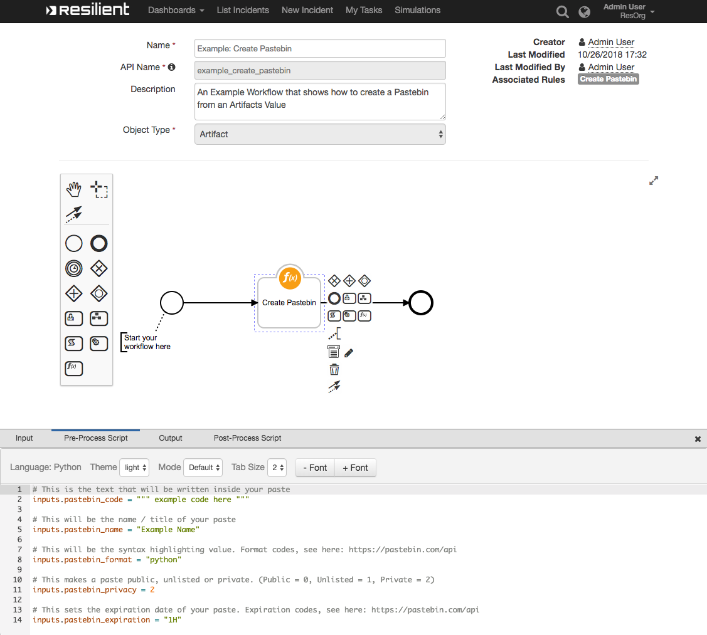

# Resilient Integration with Pastebin
**This package contains one function that creates a Paste on Pastebin and returns a link to that Paste**

 


## app.config settings:
```
[fn_pastebin]
#Required:
pastebin_api_dev_key=FDASFDJHK76876GSHKF

#Optional: (if not provided, cannot create Private Pastes)
pastebin_api_user_name=myusername
pastebin_api_user_password=passw0rd
```

## Function Inputs:
| Function Name | Type | Required | Example | Info |
| ------------- | :--: | :-------:| ------- | ---- |
| `pastebin_code` | `String` | Yes | `"print 'Hello Evil World'"` | N/A |
| `pastebin_name` | `String` | No | `"Output of Malware Sample"` | N/A |
| `pastebin_format` | `String` | No | `"python"` | See [here](https://pastebin.com/api) for more codes |
| `pastebin_privacy` | `Number` | No | `2` | 0 = Public, 1 = Unlisted, 2 = Private |
| `pastebin_expiration` | `String` | No | `"1H"` | See [here](https://pastebin.com/api) for more codes |

## Function Output:
```python

results = {
  success: True,

  inputs: {
    pastebin_code: "example code here",
    pastebin_name: "Example Name",
    pastebin_expiration: '1H',
    pastebin_privacy: '2',
    pastebin_format: "python"
  },

  pastebin_link: "https://pastebin.com/briH6zi2"
}

```

## Pre-Process Script:
This example sets the inputs to create the Paste
```python
# This is the text that will be written inside your paste
inputs.pastebin_code = """ example code here """

# This will be the name / title of your paste
inputs.pastebin_name = "Example Name"

# This will be the syntax highlighting value. Format codes, see here: https://pastebin.com/api
inputs.pastebin_format = "python"

# This makes a paste public, unlisted or private. (Public = 0, Unlisted = 1, Private = 2)
inputs.pastebin_privacy = 2

# This sets the expiration date of your paste. Expiration codes, see here: https://pastebin.com/api
inputs.pastebin_expiration = "1H"
```

## Post-Process Script:
This example **adds a Note to the Incident** with a link to the Paste.
```python
if (results.success):
  noteText = """<br><b>Pastebin Created</b>
                <b>Name:</b> {0}
                <b>Link:</b> <a href='{1}'>{1}</a>""".format(results.inputs.pastebin_name, results.pastebin_link)
  incident.addNote(helper.createRichText(noteText))
```

## Rules
| Rule Name | Object Type | Workflow Triggered |
| --------- | :---------: | ------------------ |
| Create Pastebin | `Incident` | `Example: Create Pastebin` |