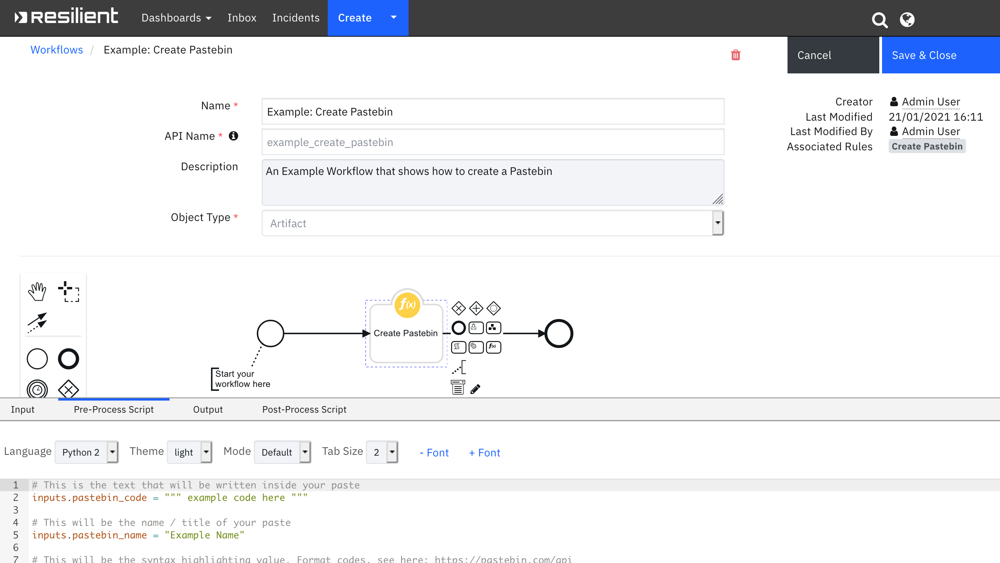

<!--
  This README.md is generated by running:
  "resilient-sdk docgen -p fn_pastebin"

  It is best edited using a Text Editor with a Markdown Previewer. VS Code
  is a good example. Checkout https://guides.github.com/features/mastering-markdown/
  for tips on writing with Markdown

  If you make manual edits and run docgen again, a .bak file will be created

  Store any screenshots in the "doc/screenshots" directory and reference them like:
  

  NOTE: If your app is available in the container-format only, there is no need to mention the integration server in this readme.
-->

# None

## Table of Contents
- [Release Notes](#release-notes)
- [Overview](#overview)
  - [Key Features](#key-features)
- [Requirements](#requirements)
  - [Resilient platform](#resilient-platform)
  - [Cloud Pak for Security](#cloud-pak-for-security)
  - [Proxy Server](#proxy-server)
- [Installation](#installation)
  - [Install](#install)
  - [App Configuration](#app-configuration)
- [Function - Create Pastebin](#function---create-pastebin)
- [Rules](#rules)
- [Troubleshooting & Support](#troubleshooting--support)
---

## Release Notes
<!--
  Specify all changes in this release. Do not remove the release 
  notes of a previous release
-->
| Version | Date | Notes |
| ------- | ---- | ----- |
| 1.0.0 | 12/2018 | Initial Release |
| 1.0.1 | 01/2021 | App Host support |

---

## Overview
<!--
  Provide a high-level description of the function itself and its remote software or application.
  The text below is parsed from the "description" and "long_description" attributes in the setup.py file
-->
**Resilient Circuits Function that dumps any text/code to pastebin.com and returns a link to that Paste**

 

This package contains one function that creates a Paste on Pastebin and returns a link to that Paste

### Key Features
<!--
  List the Key Features of the Integration
-->
* Creates a Paste on Pastebin

---

## Requirements
<!--
  List any Requirements 
-->
This app supports the IBM Resilient SOAR Platform and the IBM Cloud Pak for Security.

### Resilient platform
The Resilient platform supports two app deployment mechanisms, App Host and integration server.

If deploying to a Resilient platform with an App Host, the requirements are:
* Resilient platform >= `36.0.5634`.
* The app is in a container-based format (available from the AppExchange as a `zip` file).

If deploying to a Resilient platform with an integration server, the requirements are:
* Resilient platform >= `36.0.5634`.
* The app is in the older integration format (available from the AppExchange as a `zip` file which contains a `tar.gz` file).
* Integration server is running `resilient_circuits>=30.0.0`.
* If using an API key account, make sure the account provides the following minimum permissions: 
  | Name | Permissions |
  | ---- | ----------- |
  | Org Data | Read |
  | Function | Read |

The following Resilient platform guides provide additional information: 
* _App Host Deployment Guide_: provides installation, configuration, and troubleshooting information, including proxy server settings. 
* _Integration Server Guide_: provides installation, configuration, and troubleshooting information, including proxy server settings.
* _System Administrator Guide_: provides the procedure to install, configure and deploy apps. 

The above guides are available on the IBM Knowledge Center at [ibm.biz/resilient-docs](https://ibm.biz/resilient-docs). On this web page, select your Resilient platform version. On the follow-on page, you can find the _App Host Deployment Guide_ or _Integration Server Guide_ by expanding **Resilient Apps** in the Table of Contents pane. The System Administrator Guide is available by expanding **System Administrator**.

### Cloud Pak for Security
If you are deploying to IBM Cloud Pak for Security, the requirements are:
* IBM Cloud Pak for Security >= 1.4.
* Cloud Pak is configured with an App Host.
* The app is in a container-based format (available from the AppExchange as a `zip` file).

The following Cloud Pak guides provide additional information: 
* _App Host Deployment Guide_: provides installation, configuration, and troubleshooting information, including proxy server settings. From the Table of Contents, select Case Management and Orchestration & Automation > **Orchestration and Automation Apps**.
* _System Administrator Guide_: provides information to install, configure, and deploy apps. From the IBM Cloud Pak for Security Knowledge Center table of contents, select Case Management and Orchestration & Automation > **System administrator**.

These guides are available on the IBM Knowledge Center at [ibm.biz/cp4s-docs](https://ibm.biz/cp4s-docs). From this web page, select your IBM Cloud Pak for Security version. From the version-specific Knowledge Center page, select Case Management and Orchestration & Automation.

### Proxy Server
The app **does/does not** support a proxy server.

---

## Installation

### Install
* To install or uninstall an App or Integration on the _Resilient platform_, see the documentation at [ibm.biz/resilient-docs](https://ibm.biz/resilient-docs).
* To install or uninstall an App on _IBM Cloud Pak for Security_, see the documentation at [ibm.biz/cp4s-docs](https://ibm.biz/cp4s-docs) and follow the instructions above to navigate to Orchestration and Automation.

### App Configuration
The following table provides the settings you need to configure the app. These settings are made in the app.config file. See the documentation discussed in the Requirements section for the procedure.

| Config | Required | Example | Description |
| ------ | :------: | ------- | ----------- |
| **pastebin_api_dev_key** | Yes | `FDASFDJHK76876GSHKF` | *See the [Pastebin documentation](https://pastebin.com/faq) for instructions on how to set.* |
| **pastebin_api_user_name** | No | `myusername` | *See the [Pastebin documentation](https://pastebin.com/faq) for instructions on how to set. If not provided, cannot create Private Pastes* |
| **pastebin_api_user_password** | No | `passw0rd` | *See the [Pastebin documentation](https://pastebin.com/faq) for instructions on how to set. If not provided, cannot create Private Pastes* |


---

## Function - Create Pastebin
Function that dumps any text/code to pastebin.com and returns a link to that paste

 

<details><summary>Inputs:</summary>
<p>

| Name | Type | Required | Example | Tooltip |
| ---- | :--: | :------: | ------- | ------- |
| `pastebin_code` | `print 'Hello World'` | Yes | `-` | This is the text that will be written inside your paste. |
| `pastebin_expiration` | `1H` | No | `-` | This sets the expiration date of your paste. |
| `pastebin_format` | `python` | No | `-` | This will be the syntax highlighting value |
| `pastebin_name` | `Output of Malware Sample` | No | `-` | This will be the name / title of your paste. |
| `pastebin_privacy` | `number` | No | `2` | This makes a paste public, unlisted or private. (Public = 0. Unlisted = 1. Private = 2) |

</p>
</details>

<details><summary>Outputs:</summary>
<p>

```python
results = {
  'success': True,
  'inputs': {
    'pastebin_code': ' example code here ',
    'pastebin_name': 'Example Name',
    'pastebin_format': 'python',
    'pastebin_privacy': 2,
    'pastebin_expiration': '1H'
  },
  'pastebin_link': 'https://pastebin.com/v3LqfKMx'
}
```

</p>
</details>

<details><summary>Example Pre-Process Script:</summary>
<p>

```python
# This is the text that will be written inside your paste
inputs.pastebin_code = """ example code here """

# This will be the name / title of your paste
inputs.pastebin_name = "Example Name"

# This will be the syntax highlighting value. Format codes, see here: https://pastebin.com/api
inputs.pastebin_format = "python"

# This makes a paste public, unlisted or private. (Public = 0, Unlisted = 1, Private = 2)
inputs.pastebin_privacy = 2

# This sets the expiration date of your paste. Expiration codes, see here: https://pastebin.com/api
inputs.pastebin_expiration = "1H"
```

</p>
</details>

<details><summary>Example Post-Process Script:</summary>
<p>

```python
if (results.success):
  noteText = """<br><b>Pastebin Created</b>
                <b>Name:</b> {0}
                <b>Link:</b> <a href='{1}'>{1}</a>""".format(results.inputs.pastebin_name, results.pastebin_link)
  incident.addNote(helper.createRichText(noteText))
```

</p>
</details>

---


## Rules
| Rule Name | Object | Workflow Triggered |
| --------- | ------ | ------------------ |
| Create Pastebin | artifact | `example_create_pastebin` |

---

## Troubleshooting & Support
Refer to the documentation listed in the Requirements section for troubleshooting information.

### For Support
This is a IBM Community provided App. Please search the Community https://ibm.biz/resilientcommunity for assistance.
