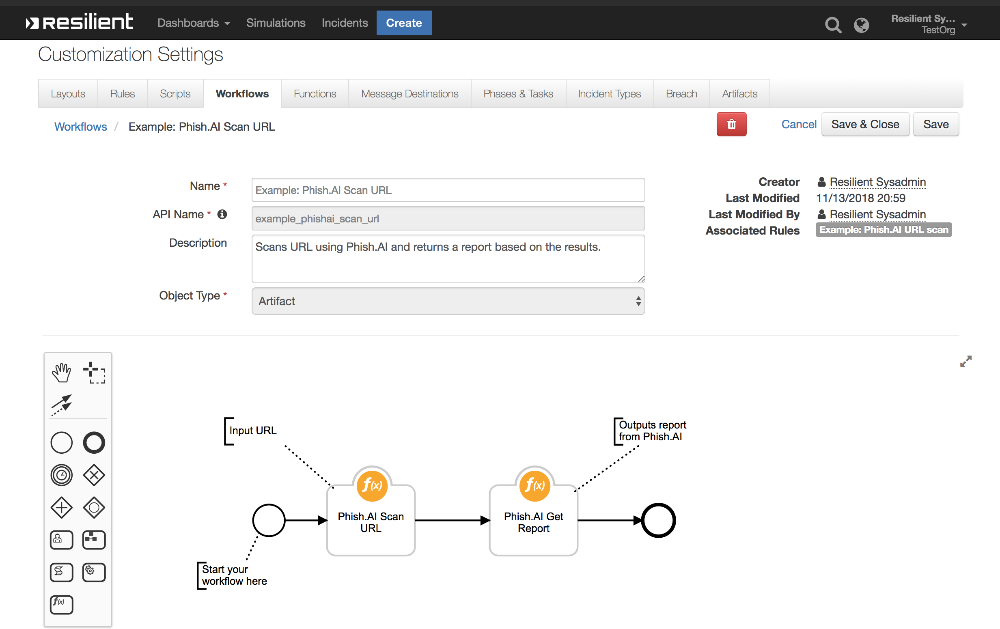

# Resilient Functions with Phish.AI
**This package contains two functions that allows you to scan urls and retrieve reports from Phish.AI

 

## app.config settings:
Set if using a proxy

    [fn_phish_ai]
    phishai_api_key=<phish.ai_api_key>

## Function Inputs:
| Input Name| Type | Required | Example |
| ------------- | :--: | :-------:| ------- |
|`artifact_value ` | `String` | Yes | `"https://google.com"` |
|`phishai_scan_id ` | `String` | Yes | `"ahtiod889297fshj"` |

## Function Outputs:
### Phish.AI Scan URL:
```
{  
   "content":{  
      "url":"https://startup417.gb.net/M3?mes1=asdf@asdf.com",
      "scan_id":"gGBSaVvlN5qc5PcwvnuT"
   },
   "inputs":{  
      "artifact_value":"https://startup417.gb.net/M3?mes1=asdf@asdf.com"
   },
   "run_time":"0.446181058884"
}
```

### Phish.AI Get Report:
```
{  
   "content":{  
      "status":"completed",
      "domain":"startup417.gb.net",
      "user_agent":"Mozilla/5.0 (X11; Linux x86_64) AppleWebKit/537.36 (KHTML, like Gecko) Chrome/64.0.3282.140 Safari/537.36",
      "target":"Microsoft",
      "title":"sign_in_to_your_microsoft_account",
      "url":"https://startup417.gb.net/M3?mes1=asdf@asdf.com",
      "time":"2018-12-06T22:39:34.210Z",
      "verdict":"malicious",
      "plan":"free",
      "tld":"net",
      "iso_code":"US",
      "first_seen":"2018-12-06T19:16:20.825Z",
      "ip_address":"104.24.104.116",
      "asn":13335,
      "user_email":"api",
      "user":"free-api"
   },
   "inputs":{  
      "phishai_scan_id":"gGBSaVvlN5qc5PcwvnuT"
   },
   "run_time":"0.419372797012"
}
```


## Pre-Process Scripts:
These examples sets the input of **Phish.AI Scan URL** to the value of the Incident's Artifact...
```python
inputs.artifact_value = artifact.value
```

and the input of **Phish.AI Get Report** to the scan_id from the output of the Scan URL function.
```python
inputs.phishai_scan_id = workflow.properties.phishai_scan_output["content"]["scan_id"]
```

## Post-Process Script:
This example adds a note to the incident with the verdict of the Phish.AI report and a link to in within Phish.AI

```
if results.content:
	note = "Phish.AI verdict: " + results.content.verdict
	note = note + "<br/><a href=\"https://app.phish.ai/incident/{}\">Phish.AI report link</a>".format(results.inputs.phishai_scan_id)
	incident.addNote(helper.createRichText(note))
```
## Rules
| Rule Name | Object Type | Workflow Triggered | Conditions |
| --------- | :---------: | ------------------ | ---------- |
| Example: Phish.AI URL scan | `Artifact` | `Example: Phish.AI Scan URL` | `Type` is equal to `URL`

To package for distribution,

    python ./fn_phish_ai/setup.py sdist

The resulting .tar.gz file can be installed using

    pip install <filename>.tar.gz

To run the integration:

    resilient-circuits run
