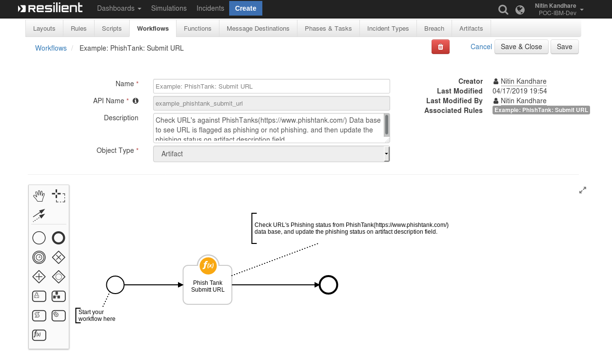
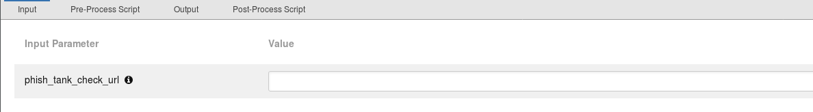
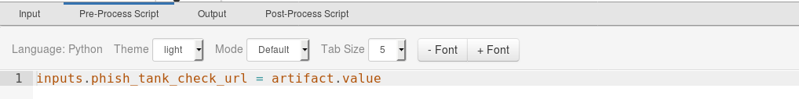
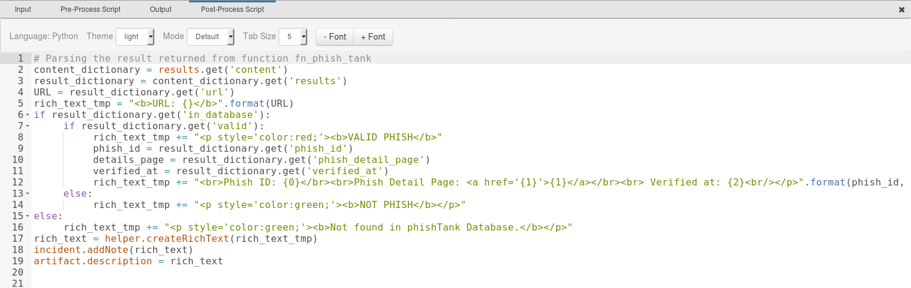

# PhishTank Function for IBM Resilient  
  
## Table of Contents    
- [About This Package](#about-this-package)  
 - [Prerequisites](#prerequisites)  
 - [Installation](#installation)  
 - [Function Inputs](#function-inputs)  
 - [Function Output](#function-output)  
 - [Pre-Process Script](#pre-process-script)  
 - [Post-Process Script](#post-process-script)  
 - [Rules](#rules)  
 ---  
 ## About This Package  
 
**This function checks URLs against [PhishTank](https://www.phishtank.com/) database to see if the URL is flagged as Phishing or not Phishing.**
Provided in this Integration package is an example Rule configured to be ran against URL Artifacts in Resilient :   
   * URL Artifacts of Resilient   

  
After successful completion of checking phishing status on given URL, updates the artifact description field with result status message.
  
### PhishTank Function Layout:  

    
### PhishTank Inputs:  
  
  
### PhishTank Pre-Process Script :
  
  
### PhishTank Post-Process Script :


## Prerequisites
* Resilient Appliance >= v31.0.0  
* Integrations Server running resilient_circuits >= v30.0.0
* python-dateutil >= v2.8.0  
* requests >=  2.21.0

## Installation
This package requires that it is installed on a RHEL or CentOS platform and uses the resilient-circuits framework.  
* Download the `.zip` file from our App Exchange and extract it. You will find a file called: `fn_phish_tank-<version>.tar.gz`  
* Copy this file to your Integrations Server  
 * To install the package, run:     
 `pip install fn_phish_tank-<version>.tar.gz`  
 * To import the function, example rules,data tables and workflows into your Resilient	appliance, run:   
   `resilient-circuits customize -y -l fn-phish-tank`    
 * To uninstall IOC Parser Function from Resilient Run the following:    
    `pip uninstall fn_phish_tank`
    
## Resilient Configuration 

Run the following command to generate the PhishTank  configuration section in the app.config file:    
    
` resilient-circuits config [-u | -c]`   

The following phish tank configuration data is added:    
```                   
[fn_phish_tank]
# PhishTank API Access URL
phish_tank_api_url=http://checkurl.phishtank.com/checkurl/
# PhishTank API Key.
phish_tank_api_key=
# Proxy Server by Default it will be None.
proxy=
```  
  Edit the [fn_phish_tank] properties as follows:  
        
 1. phish_tank_api_key : PhishTank API Key. 
 2. proxy : proxy server address if any 
        
After installation & configuration, the package will be loaded by   
`resilient-circuits run`    

## Function Inputs
|Input Name    |Type          |Required  |Example   | Info |  
|---------------|-----------|-----------|----------|--------| 
|`phish_tank_check_url`|  String|Yes |  https://www.google.com| This is the artifact value to be checked for phishing status.| 

## Function Output  
The payload from integration will wrap the results of the IPhishTank response in the following JSON structure.    
  
```python  
{'version': '1.0', 'success': True, 'reason': None, 'content': {'meta': {'timestamp': 1555500632000, 'serverid': 'e4934a30', 'status': 'success', 'requestid': '172.31.97.117.5cb70e583f6828.49717798'}, 'results': {'url': 'https://efir.pl/admin/js/ID/Update/', 'in_database': True, 'phish_id': '5988936', 'phish_detail_page': 'http://www.phishtank.com/phish_detail.php?phish_id=5988936', 'verified': True, 'verified_at': 1554733701000, 'valid': True}}, 'raw': '{"meta": {"timestamp": 1555500632000, "serverid": "e4934a30", "status": "success", "requestid": "172.31.97.117.5cb70e583f6828.49717798"}, "results": {"url": "https://efir.pl/admin/js/ID/Update/", "in_database": true, "phish_id": "5988936", "phish_detail_page": "http://www.phishtank.com/phish_detail.php?phish_id=5988936", "verified": true, "verified_at": 1554733701000, "valid": true}}', 'inputs': {'function_inputs': ['http://checkurl.phishtank.com/checkurl/', 'https://efir.pl/admin/js/ID/Update/', '39bee7366bdb32c74d9c328a35f33d83594046b61caea69d7dfc4367f6d9b045']}, 'metrics': {'version': '1.0', 'package': 'fn-phish-tank', 'package_version': '1.0.0', 'host': 'oc3777881733.ibm.com', 'execution_time_ms': 584, 'timestamp': '2019-04-17 17:00:32'}}
```  
* To see the output of  of the  Function, we recommend running `resilient-circuits` in `DEBUG` mode.  
* To do this run:  
    ```  
	 $ resilient-circuits run --loglevel=DEBUG 
	```
## Pre-Process Script  
 
This example sets `Example: PhishTank: Submit URL` inputs to the artifact values.  
A Pre-Process script will relay the Resilient artifact value data to function inputs similar to this example:  
```python  
inputs.phish_tank_check_url = artifact.value  
```
## Post-Process Script  
  
This Post-Process script is used to update `artifact description`  & `incident note`fields in the Resilient incidents, based on the returned phishing status data .  
```python
# Parsing the result returned from function fn_phish_tank
content_dictionary = results.get('content')
result_dictionary = content_dictionary.get('results')
URL = result_dictionary.get('url')
rich_text_tmp = "<b>URL: {}</b>".format(URL)
if result_dictionary.get('in_database'):
     if result_dictionary.get('valid'):
          rich_text_tmp += "<p style='color:red;'><b>VALID PHISH</b>"
          phish_id = result_dictionary.get('phish_id')
          details_page = result_dictionary.get('phish_detail_page')
          verified_at = result_dictionary.get('verified_at')
          rich_text_tmp += "<br>Phish ID: {0}</br><br>Phish Detail Page: <a href='{1}'>{1}</a></br><br> Verified at: {2}<br/></p>".format(phish_id, details_page, str(verified_at))
     else:
          rich_text_tmp += "<p style='color:green;'><b>NOT PHISH</b></p>"
else:
     rich_text_tmp += "<p style='color:green;'><b>Not found in phishTank Database.</b></p>"
rich_text = helper.createRichText(rich_text_tmp)
incident.addNote(rich_text)
artifact.description = rich_text
```

## Rules  

This PhishTank rule is configured with condition that it only works on URL Artifacts.


| Rule Name | Object Type | Workflow Triggered |Activity Fields| 
| --------- | :---------: | ------------------ |---------------|
|`Example: PhishTank: Submit URL`| `Artifact` | `Example: PhishTank: Submit URL` |-----|  

:copyright:IBM Corp. 2010, 2019. All Rights Reserved.
