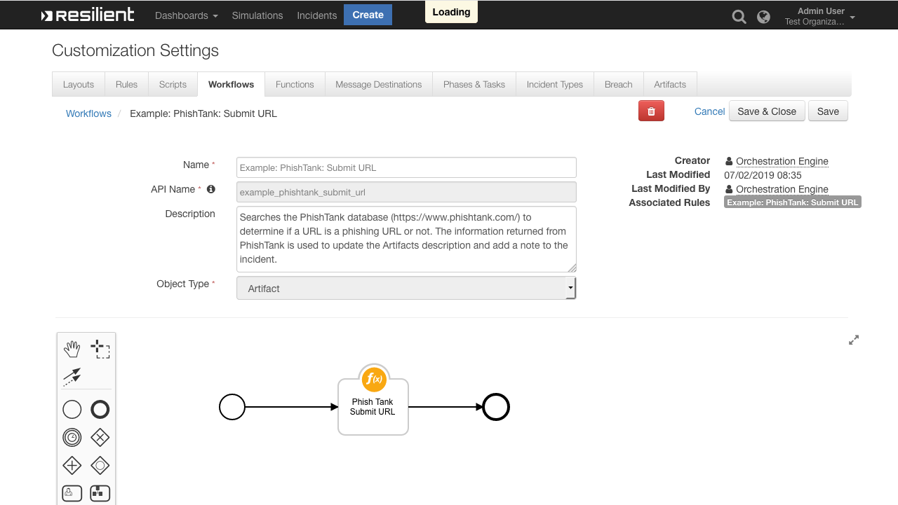

# PhishTank Lookup Function for IBM Resilient

- [Overview](#overview)
- [Note on Partial URL Support](#note-on-partial-url-support)
- [Requirements](#requirements)
- [Installation](#installation)
- [Uninstall](#uninstall)
- [Troubleshooting](#troubleshooting)
- [Support](#support)

---
## Overview
**PhishTank Lookup URL Function for IBM Resilient**

 

Lookup a URL against PhishTank's (https://www.phishtank.com/) Database to verify if the URL is Phishing or not. The Artifacts Description is updated and a Note is added to the Incident, detailing the information returned from PhishTank

### Note on Partial URL Support
Due to the differences in implementation of PhishTank's API and the functionality behind their online User Interface, partial URLs are not supported with this Integration

* The UI matches part of the provided URL
* Whereas the API only matches the full URL

**For example:**

| URL to Check | PhishTank UI Result | PhishTank API Result |
| ------------ | ------------------- | -------------------- |
| `https://safrainternet-br.com/Atualizar.html` | `https://safrainternet-br.com/Atualizar.html is a Valid Phish` | `https://safrainternet-br.com/Atualizar.html is a Valid Phish` |
| `https://safrainternet-br.com/` | `https://safrainternet-br.com/Atualizar.html is a Valid Phish` | `https://safrainternet-br.com/ not found in Database` |

---
## Requirements
<!--
  List any Requirements 
-->
* IBM Resilient >= `v31.0.4254`
* An Integration Server running `resilient_circuits>=30.0.0`
  * To setup an Integration Server see: [ibm.biz/res-int-server-guide](https://ibm.biz/res-int-server-guide)

---
## Installation
* Download the `fn_phish_tank.zip`
* Copy the `.zip` to your Integration Server and SSH into it.
* **Unzip** the package:
  ```
  $ unzip fn_phish_tank-x.x.x.zip
  ```
* **Change Directory** into the unzipped Directory:
  ```
  $ cd fn_phish_tank-x.x.x
  ```
* **Install** the package:
  ```
  $ pip install fn_phish_tank-x.x.x.tar.gz
  ```
* Import the **configurations** into your app.config file:
  ```
  $ resilient-circuits config -u
  ```
* Import the fn_phish_tank **customizations** into the Resilient Appliance:
  ```
  $ resilient-circuits customize -y -l fn-phish-tank
  ```
* Open the config file, scroll to the bottom and edit your fn_phish_tank **configurations**:
  ```
  $ nano ~/.resilient/app.config
  ```
  | Config | Required | Example | Description |
  | ------ | :------: | ------- | ----------- |
  | **phish_tank_api_url** | Yes | `http://checkurl.phishtank.com/checkurl/` | PhishTank API Access URL |
  | **phish_tank_api_key** | Yes | - | PhishTank API Key |
  | **proxy** | Yes | `127.0.0.1` | Proxy Server Address. By default it will be `None` |

* **Save** and **Close** the app.config file.
* [Optional]: Run selftest to test the Integration you configured:
  ```
  $ resilient-circuits selftest -l fn-phish-tank
  ```
* **Run** resilient-circuits or restart the Service on Windows/Linux:
  ```
  $ resilient-circuits run
  ```


---
## Uninstall
* SSH into your Integration Server
* **Uninstall** the package:
  ```
  $ pip uninstall fn-phish-tank
  ```
* Open the config file, scroll to the [fn_phish_tank] section and remove the section or prefix `#` to comment out the section.
* **Save** and **Close** the app.config file.

---
## Troubleshooting
There are several ways to verify the successful operation of a function.

### Resilient Action Status
* When viewing an incident, use the Actions menu to view **Action Status**.
* By default, pending and errors are displayed.
* Modify the filter for actions to also show Completed actions.
* Clicking on an action displays additional information on the progress made or what error occurred.

### Resilient Scripting Log
* A separate log file is available to review scripting errors.
* This is useful when issues occur in the pre-processing or post-processing scripts.
* The default location for this log file is: `/var/log/resilient-scripting/resilient-scripting.log`.

### Resilient Logs
* By default, Resilient logs are retained at `/usr/share/co3/logs`.
* The `client.log` may contain additional information regarding the execution of functions.

### Resilient-Circuits
* The log is controlled in the `.resilient/app.config` file under the section [resilient] and the property `logdir`.
* The default file name is `app.log`.
* Each function will create progress information.
* Failures will show up as errors and may contain python trace statements.
---

## Support
| Name | Version | Author | Support URL |
| ---- | ------- | ------ | ----------- |
| fn_phish_tank | 1.0.0 | Resilient Labs | http://ibm.biz/resilientcommunity |