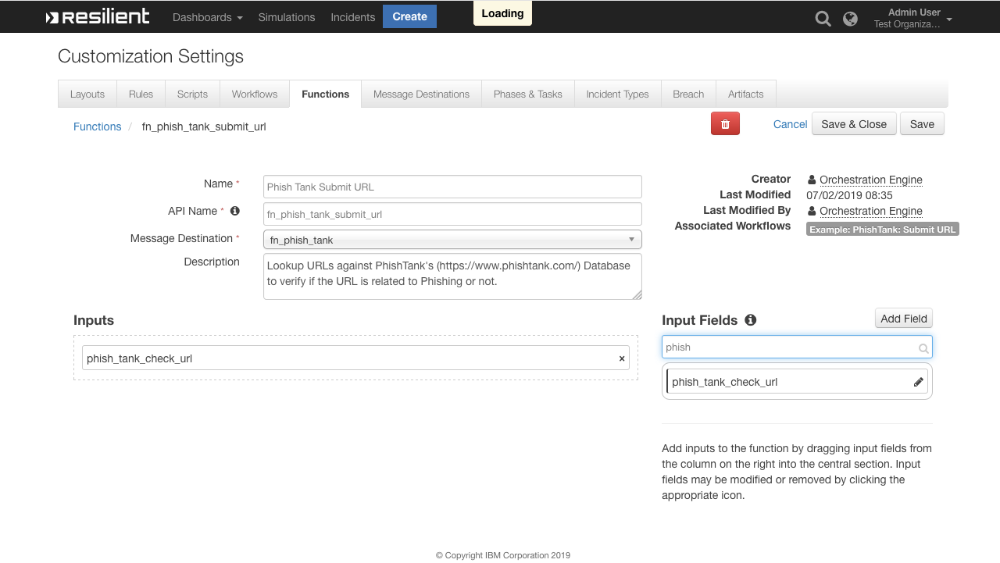

<!--
  This User README.md is generated by running:
  "resilient-circuits docgen -p fn_phish_tank --only-user-guide"

  It is best edited using a Text Editor with a Markdown Previewer. VS Code
  is a good example. Checkout https://guides.github.com/features/mastering-markdown/
  for tips on writing with Markdown

  If you make manual edits and run docgen again, a .bak file will be created

  Store any screenshots in the "doc/screenshots" directory and reference them like:
  
-->

# **User Guide:** fn_phish_tank_v1.0.1

## Table of Contents
- [Key Features](#key-features)
- [Function - Phish Tank Submit URL](#function---phish-tank-submit-url)
- [Rules](#rules)

---

## Key Features
<!--
  List the Key Features of the Integration
-->
* Verify if a URL is related to Phishing using PhishTank's Database
* Add a Note to the Incident and append to the Artifact's Description information detailing the results received from PhishTank

---

## Function - Phish Tank Submit URL
Searches the PhishTank database (https://www.phishtank.com/) to determine if a URL is a phishing URL or not. The information returned from PhishTank is used to update the Artifacts description and add a note to the incident.

 

<details><summary>Inputs:</summary>
<p>

| Name | Type | Required | Example | Tooltip |
| ---- | :--: | :------: | ------- | ------- |
| `phish_tank_check_url` | `text` | Yes | `https://checkurl.phishtank.com/checkurl/` | URL to lookup in PhishTank's Database |

</p>
</details>

<details><summary>Outputs:</summary>
<p>

```python
results = {
    'inputs': {
        u 'phish_tank_check_url': u 'http://barea-v02.ga/df/'
    },
    'metrics': {
        'package': 'fn-phish-tank',
        'timestamp': '2019-06-25 09:53:11',
        'package_version': '1.0.0',
        'host': 'shanes-mbp.galway.ie.ibm.com',
        'version': '1.0',
        'execution_time_ms': 192
    },
    'success': True,
    'content': {
        u 'meta': {
            u 'status': u 'success',
            u 'timestamp': u '2019-06-25T08:53:11+00:00',
            u 'serverid': u 'df0ef05',
            'timestamp_modified': 1561452791000,
            u 'requestid': u '172.31.97.117.5d11e0f7b69ce3.54218678'
        },
        u 'results': {
            u 'verified': True,
            'verified_at_modified': 1561452674000,
            u 'phish_detail_page': u 'http://www.phishtank.com/phish_detail.php?phish_id=6093832',
            u 'url': u 'http://barea-v02.ga/df/',
            u 'verified_at': u '2019-06-25T08:51:14+00:00',
            u 'phish_id': u '6093832',
            u 'valid': True,
            u 'in_database': True
        }
    },
    'raw': '{"meta": {"status": "success", "timestamp": "2019-06-25T08:53:11+00:00", "serverid": "df0ef05", "timestamp_modified": 1561452791000, "requestid": "172.31.97.117.5d11e0f7b69ce3.54218678"}, "results": {"verified": true, "verified_at_modified": 1561452674000, "phish_detail_page": "http://www.phishtank.com/phish_detail.php?phish_id=6093832", "url": "http://barea-v02.ga/df/", "verified_at": "2019-06-25T08:51:14+00:00", "phish_id": "6093832", "valid": true, "in_database": true}}',
    'reason': None,
    'version': '1.0'
}
```

</p>
</details>

<details><summary>Example Pre-Process Script:</summary>
<p>

```python
# Get the url from the Artifact's Value
inputs.phish_tank_check_url = artifact.value
```

</p>
</details>

<details><summary>Example Post-Process Script:</summary>
<p>

```python
def append_artifact_description(the_artifact, the_text):
  """Appends the_text to the_artifact.description safely
  handling unicode"""
  
  new_description = u""
  
  if the_artifact.description is None:
    current_description = None
  else:
    current_description = the_artifact.description.get("content", None)

  if current_description is not None:
    new_description = u"{0}<br>---<br>{1}".format(unicode(current_description), unicode(the_text))

  else:
    new_description = u"{0}".format(unicode(the_text))

  the_artifact.description = helper.createRichText(new_description)


if results.success:
  
  # Get the PhishTank Results
  phish_tank_results = results.content.get("results", {})
  url = phish_tank_results.get("url", u"")
  in_database = phish_tank_results.get("in_database", False)
  is_verified = phish_tank_results.get("verified", False)
  is_valid = phish_tank_results.get("valid", False)
  
  # Define the comment and msg to be appended to the Artifact's Description
  comment = u""
  msg = u"""<b>PhishTank Lookup</b> has complete
            <br><b>URL:</b> {0}</b>
            <br><b>Found in Database:</b> {1}""".format(url, unicode(in_database))

  if not in_database:
    comment = u"Nothing known about this url"
  
  else:
    phish_id = phish_tank_results.get("phish_id")
    phish_detail_page_url = phish_tank_results.get("phish_detail_page")
    
    msg = u"""{0}
          <br><b>Phish ID:</b> {1}
          <br><b>Valid Phish:</b> {2}
          <br><b>Verified:</b> {3}
          <br><b>Link to PhishTank: <a href={4}>{4}</a></b>""".format(msg, phish_id, u"Yes" if is_valid else u"No", u"Yes" if is_verified else "No", phish_detail_page_url)
    
    if is_verified and is_valid:
      comment = u"Verified: Is a phishing site"
  
    elif is_verified and not is_valid:
      comment = u"This site is not a phishing site"
      
    elif not is_verified:
      comment = u"This url has not been verified"
  
  msg = u"""{0}<br><br><b>Comment:</b> {1}""".format(msg, comment)
  
  append_artifact_description(artifact, msg)
  incident.addNote(helper.createRichText(msg))
```

</p>
</details>

---


## Rules
| Rule Name | Object | Workflow Triggered |
| --------- | ------ | ------------------ |
| Example: PhishTank: Submit URL | artifact | `example_phishtank_submit_url` |
---

<!--
## Inform Resilient Users
  Use this section to optionally provide additional information so that Resilient playbook 
  designer can get the maximum benefit of your integration.
-->