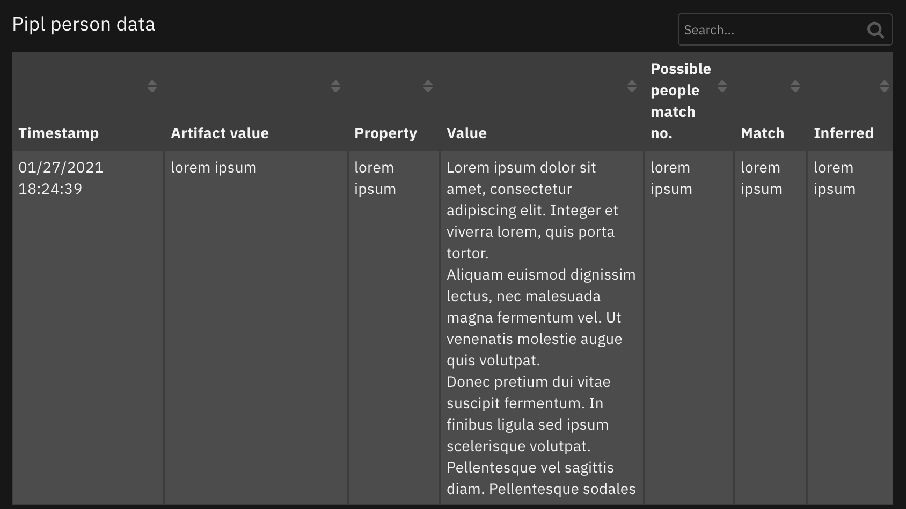

<!--
  This README.md is generated by running:
  "resilient-sdk docgen -p fn_pipl"

  It is best edited using a Text Editor with a Markdown Previewer. VS Code
  is a good example. Checkout https://guides.github.com/features/mastering-markdown/
  for tips on writing with Markdown

  If you make manual edits and run docgen again, a .bak file will be created

  Store any screenshots in the "doc/screenshots" directory and reference them like:
  

  NOTE: If your app is available in the container-format only, there is no need to mention the integration server in this readme.
-->

# Pipl Function for IBM Resilient

## Table of Contents
- [Release Notes](#release-notes)
- [Overview](#overview)
  - [Key Features](#key-features)
- [Requirements](#requirements)
  - [Resilient platform](#resilient-platform)
  - [Cloud Pak for Security](#cloud-pak-for-security)
  - [Proxy Server](#proxy-server)
- [Installation](#installation)
  - [Install](#install)
  - [App Configuration](#app-configuration)
  - [Custom Layouts](#custom-layouts)
- [Function - Pipl search function](#function---pipl-search-function)
- [Script - Create Artifact from Pipl Data](#script---create-artifact-from-pipl-data)
- [Data Table - Pipl person data](#data-table---pipl-person-data)
- [Rules](#rules)
- [Troubleshooting & Support](#troubleshooting--support)
---

## Release Notes
<!--
  Specify all changes in this release. Do not remove the release 
  notes of a previous release
-->
| Version | Date | Notes |
| ------- | ---- | ----- |
| 1.1.0 | 01/2021 | App Host Support | 
| 1.0.0 | 12/2018 | Initial Release |

---

## Overview
<!--
  Provide a high-level description of the function itself and its remote software or application.
  The text below is parsed from the "description" and "long_description" attributes in the setup.py file
-->
**Resilient Circuits Functions to query Pipl Data API**

 

This package contains one function that enriches your leads (name, email address, phone number, or social media username) with Pipl and gets their personal, professional, demographic, and contact information. The response from Pipl is saved in Pipl possible person datatable. The package also contains a script for creating an artifact from a selected row in the datatable.

### Key Features
<!--
  List the Key Features of the Integration
-->
* Query the Pipl API
* Add Pipl data to datatable
* Create artifacts from datatable entries

---

## Requirements
<!--
  List any Requirements 
-->
This app supports the IBM Resilient SOAR Platform and the IBM Cloud Pak for Security.

### Resilient platform
The Resilient platform supports two app deployment mechanisms, App Host and integration server.

If deploying to a Resilient platform with an App Host, the requirements are:
* Resilient platform >= `37.0.0`.
* The app is in a container-based format (available from the AppExchange as a `zip` file).

If deploying to a Resilient platform with an integration server, the requirements are:
* Resilient platform >= `37.0.0`.
* The app is in the older integration format (available from the AppExchange as a `zip` file which contains a `tar.gz` file).
* Integration server is running `resilient_circuits>=30.0.0`.
* If using an API key account, make sure the account provides the following minimum permissions: 
  | Name | Permissions |
  | ---- | ----------- |
  | Org Data | Read |
  | Function | Read |

The following Resilient platform guides provide additional information: 
* _App Host Deployment Guide_: provides installation, configuration, and troubleshooting information, including proxy server settings. 
* _Integration Server Guide_: provides installation, configuration, and troubleshooting information, including proxy server settings.
* _System Administrator Guide_: provides the procedure to install, configure and deploy apps. 

The above guides are available on the IBM Knowledge Center at [ibm.biz/resilient-docs](https://ibm.biz/resilient-docs). On this web page, select your Resilient platform version. On the follow-on page, you can find the _App Host Deployment Guide_ or _Integration Server Guide_ by expanding **Resilient Apps** in the Table of Contents pane. The System Administrator Guide is available by expanding **System Administrator**.

### Cloud Pak for Security
If you are deploying to IBM Cloud Pak for Security, the requirements are:
* IBM Cloud Pak for Security >= 1.4.
* Cloud Pak is configured with an App Host.
* The app is in a container-based format (available from the AppExchange as a `zip` file).

The following Cloud Pak guides provide additional information: 
* _App Host Deployment Guide_: provides installation, configuration, and troubleshooting information, including proxy server settings. From the Table of Contents, select Case Management and Orchestration & Automation > **Orchestration and Automation Apps**.
* _System Administrator Guide_: provides information to install, configure, and deploy apps. From the IBM Cloud Pak for Security Knowledge Center table of contents, select Case Management and Orchestration & Automation > **System administrator**.

These guides are available on the IBM Knowledge Center at [ibm.biz/cp4s-docs](https://ibm.biz/cp4s-docs). From this web page, select your IBM Cloud Pak for Security version. From the version-specific Knowledge Center page, select Case Management and Orchestration & Automation.

### Proxy Server
The app does not support a proxy server.

---

## Installation

### Install
* To install or uninstall an App or Integration on the _Resilient platform_, see the documentation at [ibm.biz/resilient-docs](https://ibm.biz/resilient-docs).
* To install or uninstall an App on _IBM Cloud Pak for Security_, see the documentation at [ibm.biz/cp4s-docs](https://ibm.biz/cp4s-docs) and follow the instructions above to navigate to Orchestration and Automation.

### App Configuration
The following table provides the settings you need to configure the app. These settings are made in the app.config file. See the documentation discussed in the Requirements section for the procedure.

| Config | Required | Example | Description |
| ------ | :------: | ------- | ----------- |
| **pipl_api_key** | Yes | `xxxxx` | *API key for the Pipl API* |
| **pipl_max_no_possible_per_matches** | Yes | `10` | *Max number of persons to return if your query does not match a unique person* |
| **pipl_minimum_match** | No | `0.85` | *Float between 0 and 1. Minimum match score for a person to be returned in the results*
| **pipl_minimum_probability** | No | `0.7` | *Float between 0 and 1. Minimum acceptable probability for inferred data* |
| **pipl_infer_persons** | No | `True` | *Boolean. True if the API should return persons made up solely from data inferred by statistical analysis from your search query.* |

### Custom Layouts
<!--
  Use this section to provide guidance on where the user should add any custom fields and data tables.
  You may wish to recommend a new incident tab.
  You should save a screenshot "custom_layouts.png" in the doc/screenshots directory and reference it here
-->
* Import the Data Tables and Custom Fields like the screenshot below:

  


---

## Function - Pipl search function
Function enriches your leads (name, email address, phone number, or social media username) with Pipl and gets their personal, professional, demographic, and contact information.

 

<details><summary>Inputs:</summary>
<p>

| Name | Type | Required | Example | Tooltip |
| ---- | :--: | :------: | ------- | ------- |
| `pipl_artifact_type` | `text` | Yes | `-` | - |
| `pipl_artifact_value` | `text` | Yes | `-` | - |

</p>
</details>

<details><summary>Outputs:</summary>
<p>

```python
results = 
{
    "version": "1.0",
    "success": true,
    "reason": null,
    "content": {
        "pipl_response": "definite match",
        "person_list": [
            {
                "@id": "a00f861a-5815-41f0-8ec9-a2dbb074cb64",
                "@search_pointer": "bf63b8c7c3585d05dd2358eb52f4a9ca05d02aec8b2ae7a5eaed4d9320bcfbb9940055167dba6bd2d936c8af29efcf70b569cad8e3d3cf55e956ac1fb43bee7476127e1746cd442207d6bff13ed82e4e6c80b8306ff74afbf301fdc93f4e0d3b6c5d8b6b57db7546813506ea2d8f613dbc58de5cab9281ced1def935f7e92b8c1f07441fda6eb534f6e8a39eb687256043aac4a2eb3526ee5e6860b75fed448a4fa2f66f72012593f91a854f6c3b082999dfae3a72b50292c99916c106f233c9d0bb16ac85650b1584e039c4298319045624b53895bf0e7ff6c7fa2196d7302bd6a2239e0855ab36f441ba336fac06bf5a9235cc05479f7262571c5e4961464b3513b543879036e347b5ed780b9a0d9088bcc11632036711f6ebb3815143cb618484939d7e6b527feef4ac7f85ad3aa7f663165cae3cbacf80c81ec6f8203eca62a0edb74a29bda7c5dea39da96d075294e41aaef353db096cddcf224713ee7d3c8b286893121ed84dabc5e9cd7177b7bcf2e03687a1c93cfc89b8b47d002acb52e331ff2a730bcdc72c130b2ab9e20c5da2d46afbc2cf87ff547910de9414bb8ad436cc89fea9bdaca8c2a0fb297b56fc9bf54a561607aa18a5dc966744ee2807c2faa30a92b0e05345fc31e2af240fffecf108c7ce0f8ebc482d84d344cd99668ad3799a1ae28df6b4c06c28f1b3f4744880b959b769efad87b02be9ba567d647142ced2d00ff5b8f47da4c3b4e0fd54347fe4839fb117584eb2c07dfa239b9cd64676ad3a5aff1140e3c2d591ef7da67171afcd1adbef3628ac21cf56d9465212ea01555c736a7d17d3435f68526dc21354f7b70bb768202d3c90e08cc028ed4f97500e3445f7ad9626d3dbe61824dd59c2ac77603ab39ed8e46078c5108205f689e8ede8e0de2fe230247c6f9242fa6ebd77a7e2e629e11acfd08612cc6d88e696aa28d1ccb4210ef0a568b5a54175e6246a2e79225fbbe39e3a8bddc884fd9a2b6760f0f6a76b7fb2d1fdf48d81393374e5e4b8442e5af8ba50cefbcafbb15d65cf5ff22233aedbbe5931de02e1203df2704838cd0e727dc916dcf6f3f2c4fa925f7c1bdc3565133cddd338ef8f2f93d924456fc317d5f4414b815977014bd551aec83c8f60fcbc1d1fed6f996776302ce8324e66ceba93636e942bbbd6eb6bbf4762a2063a1cda838e20b9d551a03c5a6b6613a443f90d7a2d6c8517a1f18202e11c2dee7295bb3cdbe755bb0105d142a9fc0b3220d4615b1b47fd3991514a24156f99c011b8239491b5d70414162811ff60cf0b6d5598743e17bd4cfe9f0f32e8ab02599ca010f75d86c9e60ca8958fa575d04eb20f807352634c53ae285a750cfc6bac6b2836f4ba42b2cc041c37a8529a4e87b99c7e36fd49d318c09188b49ce3ef596f951c93b1af5a099b37f5dc75ed232f10b377b904ec361e764d12f28f2bfc9b8b891140f46f475fedcdeb2cd769994dbed0a6c8bd45d75588bc7de9b6d69ed8592eb3d65c2a4480d0704a484e0904fd7cc6c990ec3911b0fbe35d095ef2674904dbd97ce9b70eb480d1f75a86dda86c02c830ccfe9fe86856756babbb8554e684155d3c3dc9f86fbd12c18b10e0382f38817fbd76fb3f84c4ad4e0c529962e03e77310d5336985e456c26a2f0bf9e2d8f40e6d5f2ad3a3e51b7d1c5a743768211e924d5083bf55aae",
                "@match": 1.0,
                "names": [
                    {
                        "@valid_since": "2011-07-11",
                        "@last_seen": "2018-04-01",
                        "first": "Kal",
                        "last": "El",
                        "display": "Kal El"
                    },
                    {
                        "@valid_since": "2010-05-11",
                        "first": "Clark",
                        "middle": "Joseph",
                        "last": "Kent",
                        "display": "Clark Joseph Kent"
                    },
                    {
                        "display": "The red blue blur"
                    }
                ],
                "addresses": [
                    {
                        "@valid_since": "2005-02-12",
                        "@type": "work",
                        "country": "US",
                        "state": "KS",
                        "city": "Metropolis",
                        "street": "Broadway",
                        "house": "1000",
                        "apartment": "355",
                        "display": "1000-355 Broadway, Metropolis, Kansas"
                    },
                    {
                        "@valid_since": "1999-02-01",
                        "@last_seen": "2018-05-01",
                        "@type": "home",
                        "country": "US",
                        "state": "KS",
                        "city": "Smallville",
                        "zip_code": "66605",
                        "street": "Hickory Lane",
                        "house": "10",
                        "apartment": "1",
                        "display": "10-1 Hickory Lane, Smallville, Kansas"
                    }
                ],
                "phones": [
                    {
                        "@valid_since": "2003-08-18",
                        "@last_seen": "2018-06-01",
                        "@type": "home_phone",
                        "country_code": 1,
                        "number": 9785550145,
                        "display": "978-555-0145",
                        "display_international": "+1 978-555-0145"
                    }
                ],
                "emails": [
                    {
                        "@type": "work",
                        "@email_provider": false,
                        "address": "full.email.available@business.subscription",
                        "address_md5": "eb3e11de3c9cefc2d9d70972350e2b28",
                        "display": "full.email.available@business.subscription"
                    },
                    {
                        "@disposable": true,
                        "@email_provider": false,
                        "address": "full.email.available@business.subscription",
                        "address_md5": "999e509752141a0ee42ff455529c10fc",
                        "display": "full.email.available@business.subscription"
                    },
                    {
                        "@type": "personal",
                        "@email_provider": true,
                        "address": "full.email.available@business.subscription",
                        "address_md5": "501548362894b9a08f071b1565d8aa14",
                        "display": "full.email.available@business.subscription"
                    },
                    {
                        "@disposable": true,
                        "@email_provider": false,
                        "address": "full.email.available@business.subscription",
                        "address_md5": "2610ee49440fe757e3cc4e46e5b40819",
                        "display": "full.email.available@business.subscription"
                    }
                ],
                "jobs": [
                    {
                        "title": "Field Reporter",
                        "organization": "The Daily Planet",
                        "industry": "Journalism",
                        "date_range": {
                            "start": "2000-12-08",
                            "end": "2012-10-09"
                        },
                        "display": "Field Reporter at The Daily Planet (2000-2012)"
                    },
                    {
                        "title": "Junior Reporter",
                        "organization": "The Daily Planet",
                        "industry": "Journalism",
                        "date_range": {
                            "start": "1999-10-10",
                            "end": "2000-10-10"
                        },
                        "display": "Junior Reporter at The Daily Planet (1999-2000)"
                    },
                    {
                        "title": "Top Reporter",
                        "organization": "The Daily Planet",
                        "industry": "Reporting",
                        "display": "Top Reporter at The Daily Planet"
                    }
                ],
                "educations": [
                    {
                        "degree": "B.Sc Advanced Science",
                        "school": "Metropolis University",
                        "date_range": {
                            "start": "2005-09-01",
                            "end": "2008-05-14"
                        },
                        "display": "B.Sc Advanced Science from Metropolis University (2005-2008)"
                    },
                    {
                        "@valid_since": "2015-07-18",
                        "@last_seen": "2018-10-10",
                        "school": "Smallville High",
                        "date_range": {
                            "start": "2001-09-01",
                            "end": "2005-06-01"
                        },
                        "display": "Smallville High (2001-2005)"
                    }
                ],
                "images": [
                    {
                        "url": "http://vignette1.wikia.nocookie.net/smallville/images/e/ea/Buddies_forever.jpg",
                        "thumbnail_token": "AE2861B242686E7BD0CB4D9049298EB7D18FEF66D950E8AB78BCD3F484345CE74536C19A85D0BA3D32DC9E7D1878CD4D341254E7AD129255C6983E6E154C4530A0DAAF665EA325FC0206F8B1D7E0B6B7AD9EBF71AFAC4C88709957ECDD78608B",
                        "display": "http://vignette1.wikia.nocookie.net/smallville/images/e/ea/Buddies_forever.jpg"
                    },
                    {
                        "@valid_since": "2014-08-18",
                        "@last_seen": "2019-05-01",
                        "url": "http://vignette3.wikia.nocookie.net/smallville/images/5/55/S10E18-Booster21.jpg",
                        "thumbnail_token": "AE2861B242686E7BD0CB4D9049298EB5D18FEF66D950E8AB78BCD3F484345CE74536C19A85D0BA3D32DC9E7D1878CD4D341254E7AD12C25596CC3E7F51186468FD84B26F5EA234EF1546E7F5CDF7F7F5BA84B228F4A349812F8C57A1DE7B6388B6",
                        "display": "http://vignette3.wikia.nocookie.net/smallville/images/5/55/S10E18-Booster21.jpg"
                    }
                ],
                "usernames": [
                    {
                        "content": "superman@facebook",
                        "display": "superman@facebook"
                    },
                    {
                        "content": "@ckent",
                        "display": "@ckent"
                    }
                ],
                "user_ids": [
                    {
                        "content": "11231@facebook",
                        "display": "11231@facebook"
                    }
                ],
                "urls": [
                    {
                        "@category": "professional_and_business",
                        "@domain": "linkedin.com",
                        "@name": "LinkedIn",
                        "@source_id": "edc6aa8fa3f211cfad7c12a0ba5b32f4",
                        "url": "http://linkedin.com/clark.kent",
                        "display": "http://linkedin.com/clark.kent"
                    },
                    {
                        "@category": "personal_profiles",
                        "@domain": "facebook.com",
                        "@name": "Facebook",
                        "@source_id": "5d836a4acc55922e49fc709c7a39e233",
                        "url": "http://facebook.com/superman",
                        "display": "http://facebook.com/superman"
                    },
                    {
                        "@category": "professional_and_business",
                        "@domain": "linkedin.com",
                        "url": "https://www.linkedin.com/pub/superman/20/7a/365",
                        "display": "https://www.linkedin.com/pub/superman/20/7a/365"
                    }
                ],
                "relationships": [
                    {
                        "@type": "family",
                        "@subtype": "Adoptive Father",
                        "names": [
                            {
                                "first": "Jonathan",
                                "last": "Kent",
                                "display": "Jonathan Kent"
                            }
                        ],
                        "emails": [
                            {
                                "@email_provider": false,
                                "address": "full.email.available@business.subscription",
                                "address_md5": "428ffee0df26012a5a2c95b65af0025c",
                                "display": "full.email.available@business.subscription"
                            }
                        ]
                    },
                    {
                        "@type": "family",
                        "@subtype": "Father",
                        "names": [
                            {
                                "first": "Jor",
                                "last": "El",
                                "display": "Jor El"
                            }
                        ]
                    },
                    {
                        "@type": "family",
                        "@subtype": "Cousin",
                        "names": [
                            {
                                "first": "Kara",
                                "last": "Kent",
                                "display": "Kara Kent"
                            }
                        ]
                    },
                    {
                        "@type": "other",
                        "@subtype": "Archenemy",
                        "names": [
                            {
                                "first": "Alexander",
                                "middle": "Joseph",
                                "last": "Luthor",
                                "display": "Alexander Joseph Luthor"
                            }
                        ]
                    },
                    {
                        "@type": "work",
                        "@subtype": "Colleague",
                        "names": [
                            {
                                "first": "Ron",
                                "last": "Troupe",
                                "display": "Ron Troupe"
                            }
                        ]
                    },
                    {
                        "@type": "friend",
                        "@subtype": "The real love",
                        "names": [
                            {
                                "first": "Chloe",
                                "middle": "Anne",
                                "last": "Sullivan",
                                "display": "Chloe Anne Sullivan"
                            }
                        ]
                    }
                ],
                "ethnicities": [
                    {
                        "content": "other",
                        "display": "Other"
                    },
                    {
                        "content": "american_indian",
                        "display": "American Indian"
                    },
                    {
                        "content": "white",
                        "display": "White"
                    }
                ],
                "origin_countries": [
                    {
                        "country": "US",
                        "display": "United States"
                    }
                ],
                "languages": [
                    {
                        "language": "en",
                        "region": "US",
                        "display": "en_US"
                    }
                ],
                "gender": {
                    "@valid_since": "2004-05-16",
                    "content": "male",
                    "display": "Male"
                },
                "dob": {
                    "date_range": {
                        "start": "1986-01-01",
                        "end": "1987-05-13"
                    },
                    "display": "34 years old"
                }
            }
        ],
        "raw_data": "[\n    {\n        \"@id\": \"a00f861a-5815-41f0-8ec9-a2dbb074cb64\",\n        \"@match\": 1.0,\n        \"@search_pointer\": \"bf63b8c7c3585d05dd2358eb52f4a9ca05d02aec8b2ae7a5eaed4d9320bcfbb9940055167dba6bd2d936c8af29efcf70b569cad8e3d3cf55e956ac1fb43bee7476127e1746cd442207d6bff13ed82e4e6c80b8306ff74afbf301fdc93f4e0d3b6c5d8b6b57db7546813506ea2d8f613dbc58de5cab9281ced1def935f7e92b8c1f07441fda6eb534f6e8a39eb687256043aac4a2eb3526ee5e6860b75fed448a4fa2f66f72012593f91a854f6c3b082999dfae3a72b50292c99916c106f233c9d0bb16ac85650b1584e039c4298319045624b53895bf0e7ff6c7fa2196d7302bd6a2239e0855ab36f441ba336fac06bf5a9235cc05479f7262571c5e4961464b3513b543879036e347b5ed780b9a0d9088bcc11632036711f6ebb3815143cb618484939d7e6b527feef4ac7f85ad3aa7f663165cae3cbacf80c81ec6f8203eca62a0edb74a29bda7c5dea39da96d075294e41aaef353db096cddcf224713ee7d3c8b286893121ed84dabc5e9cd7177b7bcf2e03687a1c93cfc89b8b47d002acb52e331ff2a730bcdc72c130b2ab9e20c5da2d46afbc2cf87ff547910de9414bb8ad436cc89fea9bdaca8c2a0fb297b56fc9bf54a561607aa18a5dc966744ee2807c2faa30a92b0e05345fc31e2af240fffecf108c7ce0f8ebc482d84d344cd99668ad3799a1ae28df6b4c06c28f1b3f4744880b959b769efad87b02be9ba567d647142ced2d00ff5b8f47da4c3b4e0fd54347fe4839fb117584eb2c07dfa239b9cd64676ad3a5aff1140e3c2d591ef7da67171afcd1adbef3628ac21cf56d9465212ea01555c736a7d17d3435f68526dc21354f7b70bb768202d3c90e08cc028ed4f97500e3445f7ad9626d3dbe61824dd59c2ac77603ab39ed8e46078c5108205f689e8ede8e0de2fe230247c6f9242fa6ebd77a7e2e629e11acfd08612cc6d88e696aa28d1ccb4210ef0a568b5a54175e6246a2e79225fbbe39e3a8bddc884fd9a2b6760f0f6a76b7fb2d1fdf48d81393374e5e4b8442e5af8ba50cefbcafbb15d65cf5ff22233aedbbe5931de02e1203df2704838cd0e727dc916dcf6f3f2c4fa925f7c1bdc3565133cddd338ef8f2f93d924456fc317d5f4414b815977014bd551aec83c8f60fcbc1d1fed6f996776302ce8324e66ceba93636e942bbbd6eb6bbf4762a2063a1cda838e20b9d551a03c5a6b6613a443f90d7a2d6c8517a1f18202e11c2dee7295bb3cdbe755bb0105d142a9fc0b3220d4615b1b47fd3991514a24156f99c011b8239491b5d70414162811ff60cf0b6d5598743e17bd4cfe9f0f32e8ab02599ca010f75d86c9e60ca8958fa575d04eb20f807352634c53ae285a750cfc6bac6b2836f4ba42b2cc041c37a8529a4e87b99c7e36fd49d318c09188b49ce3ef596f951c93b1af5a099b37f5dc75ed232f10b377b904ec361e764d12f28f2bfc9b8b891140f46f475fedcdeb2cd769994dbed0a6c8bd45d75588bc7de9b6d69ed8592eb3d65c2a4480d0704a484e0904fd7cc6c990ec3911b0fbe35d095ef2674904dbd97ce9b70eb480d1f75a86dda86c02c830ccfe9fe86856756babbb8554e684155d3c3dc9f86fbd12c18b10e0382f38817fbd76fb3f84c4ad4e0c529962e03e77310d5336985e456c26a2f0bf9e2d8f40e6d5f2ad3a3e51b7d1c5a743768211e924d5083bf55aae\",\n        \"addresses\": [\n            {\n                \"@type\": \"work\",\n                \"@valid_since\": \"2005-02-12\",\n                \"apartment\": \"355\",\n                \"city\": \"Metropolis\",\n                \"country\": \"US\",\n                \"display\": \"1000-355 Broadway, Metropolis, Kansas\",\n                \"house\": \"1000\",\n                \"state\": \"KS\",\n                \"street\": \"Broadway\"\n            },\n            {\n                \"@last_seen\": \"2018-05-01\",\n                \"@type\": \"home\",\n                \"@valid_since\": \"1999-02-01\",\n                \"apartment\": \"1\",\n                \"city\": \"Smallville\",\n                \"country\": \"US\",\n                \"display\": \"10-1 Hickory Lane, Smallville, Kansas\",\n                \"house\": \"10\",\n                \"state\": \"KS\",\n                \"street\": \"Hickory Lane\",\n                \"zip_code\": \"66605\"\n            }\n        ],\n        \"dob\": {\n            \"date_range\": {\n                \"end\": \"1987-05-13\",\n                \"start\": \"1986-01-01\"\n            },\n            \"display\": \"34 years old\"\n        },\n        \"educations\": [\n            {\n                \"date_range\": {\n                    \"end\": \"2008-05-14\",\n                    \"start\": \"2005-09-01\"\n                },\n                \"degree\": \"B.Sc Advanced Science\",\n                \"display\": \"B.Sc Advanced Science from Metropolis University (2005-2008)\",\n                \"school\": \"Metropolis University\"\n            },\n            {\n                \"@last_seen\": \"2018-10-10\",\n                \"@valid_since\": \"2015-07-18\",\n                \"date_range\": {\n                    \"end\": \"2005-06-01\",\n                    \"start\": \"2001-09-01\"\n                },\n                \"display\": \"Smallville High (2001-2005)\",\n                \"school\": \"Smallville High\"\n            }\n        ],\n        \"emails\": [\n            {\n                \"@email_provider\": false,\n                \"@type\": \"work\",\n                \"address\": \"full.email.available@business.subscription\",\n                \"address_md5\": \"eb3e11de3c9cefc2d9d70972350e2b28\",\n                \"display\": \"full.email.available@business.subscription\"\n            },\n            {\n                \"@disposable\": true,\n                \"@email_provider\": false,\n                \"address\": \"full.email.available@business.subscription\",\n                \"address_md5\": \"999e509752141a0ee42ff455529c10fc\",\n                \"display\": \"full.email.available@business.subscription\"\n            },\n            {\n                \"@email_provider\": true,\n                \"@type\": \"personal\",\n                \"address\": \"full.email.available@business.subscription\",\n                \"address_md5\": \"501548362894b9a08f071b1565d8aa14\",\n                \"display\": \"full.email.available@business.subscription\"\n            },\n            {\n                \"@disposable\": true,\n                \"@email_provider\": false,\n                \"address\": \"full.email.available@business.subscription\",\n                \"address_md5\": \"2610ee49440fe757e3cc4e46e5b40819\",\n                \"display\": \"full.email.available@business.subscription\"\n            }\n        ],\n        \"ethnicities\": [\n            {\n                \"content\": \"other\",\n                \"display\": \"Other\"\n            },\n            {\n                \"content\": \"american_indian\",\n                \"display\": \"American Indian\"\n            },\n            {\n                \"content\": \"white\",\n                \"display\": \"White\"\n            }\n        ],\n        \"gender\": {\n            \"@valid_since\": \"2004-05-16\",\n            \"content\": \"male\",\n            \"display\": \"Male\"\n        },\n        \"images\": [\n            {\n                \"display\": \"http://vignette1.wikia.nocookie.net/smallville/images/e/ea/Buddies_forever.jpg\",\n                \"thumbnail_token\": \"AE2861B242686E7BD0CB4D9049298EB7D18FEF66D950E8AB78BCD3F484345CE74536C19A85D0BA3D32DC9E7D1878CD4D341254E7AD129255C6983E6E154C4530A0DAAF665EA325FC0206F8B1D7E0B6B7AD9EBF71AFAC4C88709957ECDD78608B\",\n                \"url\": \"http://vignette1.wikia.nocookie.net/smallville/images/e/ea/Buddies_forever.jpg\"\n            },\n            {\n                \"@last_seen\": \"2019-05-01\",\n                \"@valid_since\": \"2014-08-18\",\n                \"display\": \"http://vignette3.wikia.nocookie.net/smallville/images/5/55/S10E18-Booster21.jpg\",\n                \"thumbnail_token\": \"AE2861B242686E7BD0CB4D9049298EB5D18FEF66D950E8AB78BCD3F484345CE74536C19A85D0BA3D32DC9E7D1878CD4D341254E7AD12C25596CC3E7F51186468FD84B26F5EA234EF1546E7F5CDF7F7F5BA84B228F4A349812F8C57A1DE7B6388B6\",\n                \"url\": \"http://vignette3.wikia.nocookie.net/smallville/images/5/55/S10E18-Booster21.jpg\"\n            }\n        ],\n        \"jobs\": [\n            {\n                \"date_range\": {\n                    \"end\": \"2012-10-09\",\n                    \"start\": \"2000-12-08\"\n                },\n                \"display\": \"Field Reporter at The Daily Planet (2000-2012)\",\n                \"industry\": \"Journalism\",\n                \"organization\": \"The Daily Planet\",\n                \"title\": \"Field Reporter\"\n            },\n            {\n                \"date_range\": {\n                    \"end\": \"2000-10-10\",\n                    \"start\": \"1999-10-10\"\n                },\n                \"display\": \"Junior Reporter at The Daily Planet (1999-2000)\",\n                \"industry\": \"Journalism\",\n                \"organization\": \"The Daily Planet\",\n                \"title\": \"Junior Reporter\"\n            },\n            {\n                \"display\": \"Top Reporter at The Daily Planet\",\n                \"industry\": \"Reporting\",\n                \"organization\": \"The Daily Planet\",\n                \"title\": \"Top Reporter\"\n            }\n        ],\n        \"languages\": [\n            {\n                \"display\": \"en_US\",\n                \"language\": \"en\",\n                \"region\": \"US\"\n            }\n        ],\n        \"names\": [\n            {\n                \"@last_seen\": \"2018-04-01\",\n                \"@valid_since\": \"2011-07-11\",\n                \"display\": \"Kal El\",\n                \"first\": \"Kal\",\n                \"last\": \"El\"\n            },\n            {\n                \"@valid_since\": \"2010-05-11\",\n                \"display\": \"Clark Joseph Kent\",\n                \"first\": \"Clark\",\n                \"last\": \"Kent\",\n                \"middle\": \"Joseph\"\n            },\n            {\n                \"display\": \"The red blue blur\"\n            }\n        ],\n        \"origin_countries\": [\n            {\n                \"country\": \"US\",\n                \"display\": \"United States\"\n            }\n        ],\n        \"phones\": [\n            {\n                \"@last_seen\": \"2018-06-01\",\n                \"@type\": \"home_phone\",\n                \"@valid_since\": \"2003-08-18\",\n                \"country_code\": 1,\n                \"display\": \"978-555-0145\",\n                \"display_international\": \"+1 978-555-0145\",\n                \"number\": 9785550145\n            }\n        ],\n        \"relationships\": [\n            {\n                \"@subtype\": \"Adoptive Father\",\n                \"@type\": \"family\",\n                \"emails\": [\n                    {\n                        \"@email_provider\": false,\n                        \"address\": \"full.email.available@business.subscription\",\n                        \"address_md5\": \"428ffee0df26012a5a2c95b65af0025c\",\n                        \"display\": \"full.email.available@business.subscription\"\n                    }\n                ],\n                \"names\": [\n                    {\n                        \"display\": \"Jonathan Kent\",\n                        \"first\": \"Jonathan\",\n                        \"last\": \"Kent\"\n                    }\n                ]\n            },\n            {\n                \"@subtype\": \"Father\",\n                \"@type\": \"family\",\n                \"names\": [\n                    {\n                        \"display\": \"Jor El\",\n                        \"first\": \"Jor\",\n                        \"last\": \"El\"\n                    }\n                ]\n            },\n            {\n                \"@subtype\": \"Cousin\",\n                \"@type\": \"family\",\n                \"names\": [\n                    {\n                        \"display\": \"Kara Kent\",\n                        \"first\": \"Kara\",\n                        \"last\": \"Kent\"\n                    }\n                ]\n            },\n            {\n                \"@subtype\": \"Archenemy\",\n                \"@type\": \"other\",\n                \"names\": [\n                    {\n                        \"display\": \"Alexander Joseph Luthor\",\n                        \"first\": \"Alexander\",\n                        \"last\": \"Luthor\",\n                        \"middle\": \"Joseph\"\n                    }\n                ]\n            },\n            {\n                \"@subtype\": \"Colleague\",\n                \"@type\": \"work\",\n                \"names\": [\n                    {\n                        \"display\": \"Ron Troupe\",\n                        \"first\": \"Ron\",\n                        \"last\": \"Troupe\"\n                    }\n                ]\n            },\n            {\n                \"@subtype\": \"The real love\",\n                \"@type\": \"friend\",\n                \"names\": [\n                    {\n                        \"display\": \"Chloe Anne Sullivan\",\n                        \"first\": \"Chloe\",\n                        \"last\": \"Sullivan\",\n                        \"middle\": \"Anne\"\n                    }\n                ]\n            }\n        ],\n        \"urls\": [\n            {\n                \"@category\": \"professional_and_business\",\n                \"@domain\": \"linkedin.com\",\n                \"@name\": \"LinkedIn\",\n                \"@source_id\": \"edc6aa8fa3f211cfad7c12a0ba5b32f4\",\n                \"display\": \"http://linkedin.com/clark.kent\",\n                \"url\": \"http://linkedin.com/clark.kent\"\n            },\n            {\n                \"@category\": \"personal_profiles\",\n                \"@domain\": \"facebook.com\",\n                \"@name\": \"Facebook\",\n                \"@source_id\": \"5d836a4acc55922e49fc709c7a39e233\",\n                \"display\": \"http://facebook.com/superman\",\n                \"url\": \"http://facebook.com/superman\"\n            },\n            {\n                \"@category\": \"professional_and_business\",\n                \"@domain\": \"linkedin.com\",\n                \"display\": \"https://www.linkedin.com/pub/superman/20/7a/365\",\n                \"url\": \"https://www.linkedin.com/pub/superman/20/7a/365\"\n            }\n        ],\n        \"user_ids\": [\n            {\n                \"content\": \"11231@facebook\",\n                \"display\": \"11231@facebook\"\n            }\n        ],\n        \"usernames\": [\n            {\n                \"content\": \"superman@facebook\",\n                \"display\": \"superman@facebook\"\n            },\n            {\n                \"content\": \"@ckent\",\n                \"display\": \"@ckent\"\n            }\n        ]\n    }\n]"
    },
    "raw": "{\"pipl_response\": \"definite match\", \"person_list\": [{\"@id\": \"a00f861a-5815-41f0-8ec9-a2dbb074cb64\", \"@search_pointer\": \"bf63b8c7c3585d05dd2358eb52f4a9ca05d02aec8b2ae7a5eaed4d9320bcfbb9940055167dba6bd2d936c8af29efcf70b569cad8e3d3cf55e956ac1fb43bee7476127e1746cd442207d6bff13ed82e4e6c80b8306ff74afbf301fdc93f4e0d3b6c5d8b6b57db7546813506ea2d8f613dbc58de5cab9281ced1def935f7e92b8c1f07441fda6eb534f6e8a39eb687256043aac4a2eb3526ee5e6860b75fed448a4fa2f66f72012593f91a854f6c3b082999dfae3a72b50292c99916c106f233c9d0bb16ac85650b1584e039c4298319045624b53895bf0e7ff6c7fa2196d7302bd6a2239e0855ab36f441ba336fac06bf5a9235cc05479f7262571c5e4961464b3513b543879036e347b5ed780b9a0d9088bcc11632036711f6ebb3815143cb618484939d7e6b527feef4ac7f85ad3aa7f663165cae3cbacf80c81ec6f8203eca62a0edb74a29bda7c5dea39da96d075294e41aaef353db096cddcf224713ee7d3c8b286893121ed84dabc5e9cd7177b7bcf2e03687a1c93cfc89b8b47d002acb52e331ff2a730bcdc72c130b2ab9e20c5da2d46afbc2cf87ff547910de9414bb8ad436cc89fea9bdaca8c2a0fb297b56fc9bf54a561607aa18a5dc966744ee2807c2faa30a92b0e05345fc31e2af240fffecf108c7ce0f8ebc482d84d344cd99668ad3799a1ae28df6b4c06c28f1b3f4744880b959b769efad87b02be9ba567d647142ced2d00ff5b8f47da4c3b4e0fd54347fe4839fb117584eb2c07dfa239b9cd64676ad3a5aff1140e3c2d591ef7da67171afcd1adbef3628ac21cf56d9465212ea01555c736a7d17d3435f68526dc21354f7b70bb768202d3c90e08cc028ed4f97500e3445f7ad9626d3dbe61824dd59c2ac77603ab39ed8e46078c5108205f689e8ede8e0de2fe230247c6f9242fa6ebd77a7e2e629e11acfd08612cc6d88e696aa28d1ccb4210ef0a568b5a54175e6246a2e79225fbbe39e3a8bddc884fd9a2b6760f0f6a76b7fb2d1fdf48d81393374e5e4b8442e5af8ba50cefbcafbb15d65cf5ff22233aedbbe5931de02e1203df2704838cd0e727dc916dcf6f3f2c4fa925f7c1bdc3565133cddd338ef8f2f93d924456fc317d5f4414b815977014bd551aec83c8f60fcbc1d1fed6f996776302ce8324e66ceba93636e942bbbd6eb6bbf4762a2063a1cda838e20b9d551a03c5a6b6613a443f90d7a2d6c8517a1f18202e11c2dee7295bb3cdbe755bb0105d142a9fc0b3220d4615b1b47fd3991514a24156f99c011b8239491b5d70414162811ff60cf0b6d5598743e17bd4cfe9f0f32e8ab02599ca010f75d86c9e60ca8958fa575d04eb20f807352634c53ae285a750cfc6bac6b2836f4ba42b2cc041c37a8529a4e87b99c7e36fd49d318c09188b49ce3ef596f951c93b1af5a099b37f5dc75ed232f10b377b904ec361e764d12f28f2bfc9b8b891140f46f475fedcdeb2cd769994dbed0a6c8bd45d75588bc7de9b6d69ed8592eb3d65c2a4480d0704a484e0904fd7cc6c990ec3911b0fbe35d095ef2674904dbd97ce9b70eb480d1f75a86dda86c02c830ccfe9fe86856756babbb8554e684155d3c3dc9f86fbd12c18b10e0382f38817fbd76fb3f84c4ad4e0c529962e03e77310d5336985e456c26a2f0bf9e2d8f40e6d5f2ad3a3e51b7d1c5a743768211e924d5083bf55aae\", \"@match\": 1.0, \"names\": [{\"@valid_since\": \"2011-07-11\", \"@last_seen\": \"2018-04-01\", \"first\": \"Kal\", \"last\": \"El\", \"display\": \"Kal El\"}, {\"@valid_since\": \"2010-05-11\", \"first\": \"Clark\", \"middle\": \"Joseph\", \"last\": \"Kent\", \"display\": \"Clark Joseph Kent\"}, {\"display\": \"The red blue blur\"}], \"addresses\": [{\"@valid_since\": \"2005-02-12\", \"@type\": \"work\", \"country\": \"US\", \"state\": \"KS\", \"city\": \"Metropolis\", \"street\": \"Broadway\", \"house\": \"1000\", \"apartment\": \"355\", \"display\": \"1000-355 Broadway, Metropolis, Kansas\"}, {\"@valid_since\": \"1999-02-01\", \"@last_seen\": \"2018-05-01\", \"@type\": \"home\", \"country\": \"US\", \"state\": \"KS\", \"city\": \"Smallville\", \"zip_code\": \"66605\", \"street\": \"Hickory Lane\", \"house\": \"10\", \"apartment\": \"1\", \"display\": \"10-1 Hickory Lane, Smallville, Kansas\"}], \"phones\": [{\"@valid_since\": \"2003-08-18\", \"@last_seen\": \"2018-06-01\", \"@type\": \"home_phone\", \"country_code\": 1, \"number\": 9785550145, \"display\": \"978-555-0145\", \"display_international\": \"+1 978-555-0145\"}], \"emails\": [{\"@type\": \"work\", \"@email_provider\": false, \"address\": \"full.email.available@business.subscription\", \"address_md5\": \"eb3e11de3c9cefc2d9d70972350e2b28\", \"display\": \"full.email.available@business.subscription\"}, {\"@disposable\": true, \"@email_provider\": false, \"address\": \"full.email.available@business.subscription\", \"address_md5\": \"999e509752141a0ee42ff455529c10fc\", \"display\": \"full.email.available@business.subscription\"}, {\"@type\": \"personal\", \"@email_provider\": true, \"address\": \"full.email.available@business.subscription\", \"address_md5\": \"501548362894b9a08f071b1565d8aa14\", \"display\": \"full.email.available@business.subscription\"}, {\"@disposable\": true, \"@email_provider\": false, \"address\": \"full.email.available@business.subscription\", \"address_md5\": \"2610ee49440fe757e3cc4e46e5b40819\", \"display\": \"full.email.available@business.subscription\"}], \"jobs\": [{\"title\": \"Field Reporter\", \"organization\": \"The Daily Planet\", \"industry\": \"Journalism\", \"date_range\": {\"start\": \"2000-12-08\", \"end\": \"2012-10-09\"}, \"display\": \"Field Reporter at The Daily Planet (2000-2012)\"}, {\"title\": \"Junior Reporter\", \"organization\": \"The Daily Planet\", \"industry\": \"Journalism\", \"date_range\": {\"start\": \"1999-10-10\", \"end\": \"2000-10-10\"}, \"display\": \"Junior Reporter at The Daily Planet (1999-2000)\"}, {\"title\": \"Top Reporter\", \"organization\": \"The Daily Planet\", \"industry\": \"Reporting\", \"display\": \"Top Reporter at The Daily Planet\"}], \"educations\": [{\"degree\": \"B.Sc Advanced Science\", \"school\": \"Metropolis University\", \"date_range\": {\"start\": \"2005-09-01\", \"end\": \"2008-05-14\"}, \"display\": \"B.Sc Advanced Science from Metropolis University (2005-2008)\"}, {\"@valid_since\": \"2015-07-18\", \"@last_seen\": \"2018-10-10\", \"school\": \"Smallville High\", \"date_range\": {\"start\": \"2001-09-01\", \"end\": \"2005-06-01\"}, \"display\": \"Smallville High (2001-2005)\"}], \"images\": [{\"url\": \"http://vignette1.wikia.nocookie.net/smallville/images/e/ea/Buddies_forever.jpg\", \"thumbnail_token\": \"AE2861B242686E7BD0CB4D9049298EB7D18FEF66D950E8AB78BCD3F484345CE74536C19A85D0BA3D32DC9E7D1878CD4D341254E7AD129255C6983E6E154C4530A0DAAF665EA325FC0206F8B1D7E0B6B7AD9EBF71AFAC4C88709957ECDD78608B\", \"display\": \"http://vignette1.wikia.nocookie.net/smallville/images/e/ea/Buddies_forever.jpg\"}, {\"@valid_since\": \"2014-08-18\", \"@last_seen\": \"2019-05-01\", \"url\": \"http://vignette3.wikia.nocookie.net/smallville/images/5/55/S10E18-Booster21.jpg\", \"thumbnail_token\": \"AE2861B242686E7BD0CB4D9049298EB5D18FEF66D950E8AB78BCD3F484345CE74536C19A85D0BA3D32DC9E7D1878CD4D341254E7AD12C25596CC3E7F51186468FD84B26F5EA234EF1546E7F5CDF7F7F5BA84B228F4A349812F8C57A1DE7B6388B6\", \"display\": \"http://vignette3.wikia.nocookie.net/smallville/images/5/55/S10E18-Booster21.jpg\"}], \"usernames\": [{\"content\": \"superman@facebook\", \"display\": \"superman@facebook\"}, {\"content\": \"@ckent\", \"display\": \"@ckent\"}], \"user_ids\": [{\"content\": \"11231@facebook\", \"display\": \"11231@facebook\"}], \"urls\": [{\"@category\": \"professional_and_business\", \"@domain\": \"linkedin.com\", \"@name\": \"LinkedIn\", \"@source_id\": \"edc6aa8fa3f211cfad7c12a0ba5b32f4\", \"url\": \"http://linkedin.com/clark.kent\", \"display\": \"http://linkedin.com/clark.kent\"}, {\"@category\": \"personal_profiles\", \"@domain\": \"facebook.com\", \"@name\": \"Facebook\", \"@source_id\": \"5d836a4acc55922e49fc709c7a39e233\", \"url\": \"http://facebook.com/superman\", \"display\": \"http://facebook.com/superman\"}, {\"@category\": \"professional_and_business\", \"@domain\": \"linkedin.com\", \"url\": \"https://www.linkedin.com/pub/superman/20/7a/365\", \"display\": \"https://www.linkedin.com/pub/superman/20/7a/365\"}], \"relationships\": [{\"@type\": \"family\", \"@subtype\": \"Adoptive Father\", \"names\": [{\"first\": \"Jonathan\", \"last\": \"Kent\", \"display\": \"Jonathan Kent\"}], \"emails\": [{\"@email_provider\": false, \"address\": \"full.email.available@business.subscription\", \"address_md5\": \"428ffee0df26012a5a2c95b65af0025c\", \"display\": \"full.email.available@business.subscription\"}]}, {\"@type\": \"family\", \"@subtype\": \"Father\", \"names\": [{\"first\": \"Jor\", \"last\": \"El\", \"display\": \"Jor El\"}]}, {\"@type\": \"family\", \"@subtype\": \"Cousin\", \"names\": [{\"first\": \"Kara\", \"last\": \"Kent\", \"display\": \"Kara Kent\"}]}, {\"@type\": \"other\", \"@subtype\": \"Archenemy\", \"names\": [{\"first\": \"Alexander\", \"middle\": \"Joseph\", \"last\": \"Luthor\", \"display\": \"Alexander Joseph Luthor\"}]}, {\"@type\": \"work\", \"@subtype\": \"Colleague\", \"names\": [{\"first\": \"Ron\", \"last\": \"Troupe\", \"display\": \"Ron Troupe\"}]}, {\"@type\": \"friend\", \"@subtype\": \"The real love\", \"names\": [{\"first\": \"Chloe\", \"middle\": \"Anne\", \"last\": \"Sullivan\", \"display\": \"Chloe Anne Sullivan\"}]}], \"ethnicities\": [{\"content\": \"other\", \"display\": \"Other\"}, {\"content\": \"american_indian\", \"display\": \"American Indian\"}, {\"content\": \"white\", \"display\": \"White\"}], \"origin_countries\": [{\"country\": \"US\", \"display\": \"United States\"}], \"languages\": [{\"language\": \"en\", \"region\": \"US\", \"display\": \"en_US\"}], \"gender\": {\"@valid_since\": \"2004-05-16\", \"content\": \"male\", \"display\": \"Male\"}, \"dob\": {\"date_range\": {\"start\": \"1986-01-01\", \"end\": \"1987-05-13\"}, \"display\": \"34 years old\"}}], \"raw_data\": \"[\\n    {\\n        \\\"@id\\\": \\\"a00f861a-5815-41f0-8ec9-a2dbb074cb64\\\",\\n        \\\"@match\\\": 1.0,\\n        \\\"@search_pointer\\\": \\\"bf63b8c7c3585d05dd2358eb52f4a9ca05d02aec8b2ae7a5eaed4d9320bcfbb9940055167dba6bd2d936c8af29efcf70b569cad8e3d3cf55e956ac1fb43bee7476127e1746cd442207d6bff13ed82e4e6c80b8306ff74afbf301fdc93f4e0d3b6c5d8b6b57db7546813506ea2d8f613dbc58de5cab9281ced1def935f7e92b8c1f07441fda6eb534f6e8a39eb687256043aac4a2eb3526ee5e6860b75fed448a4fa2f66f72012593f91a854f6c3b082999dfae3a72b50292c99916c106f233c9d0bb16ac85650b1584e039c4298319045624b53895bf0e7ff6c7fa2196d7302bd6a2239e0855ab36f441ba336fac06bf5a9235cc05479f7262571c5e4961464b3513b543879036e347b5ed780b9a0d9088bcc11632036711f6ebb3815143cb618484939d7e6b527feef4ac7f85ad3aa7f663165cae3cbacf80c81ec6f8203eca62a0edb74a29bda7c5dea39da96d075294e41aaef353db096cddcf224713ee7d3c8b286893121ed84dabc5e9cd7177b7bcf2e03687a1c93cfc89b8b47d002acb52e331ff2a730bcdc72c130b2ab9e20c5da2d46afbc2cf87ff547910de9414bb8ad436cc89fea9bdaca8c2a0fb297b56fc9bf54a561607aa18a5dc966744ee2807c2faa30a92b0e05345fc31e2af240fffecf108c7ce0f8ebc482d84d344cd99668ad3799a1ae28df6b4c06c28f1b3f4744880b959b769efad87b02be9ba567d647142ced2d00ff5b8f47da4c3b4e0fd54347fe4839fb117584eb2c07dfa239b9cd64676ad3a5aff1140e3c2d591ef7da67171afcd1adbef3628ac21cf56d9465212ea01555c736a7d17d3435f68526dc21354f7b70bb768202d3c90e08cc028ed4f97500e3445f7ad9626d3dbe61824dd59c2ac77603ab39ed8e46078c5108205f689e8ede8e0de2fe230247c6f9242fa6ebd77a7e2e629e11acfd08612cc6d88e696aa28d1ccb4210ef0a568b5a54175e6246a2e79225fbbe39e3a8bddc884fd9a2b6760f0f6a76b7fb2d1fdf48d81393374e5e4b8442e5af8ba50cefbcafbb15d65cf5ff22233aedbbe5931de02e1203df2704838cd0e727dc916dcf6f3f2c4fa925f7c1bdc3565133cddd338ef8f2f93d924456fc317d5f4414b815977014bd551aec83c8f60fcbc1d1fed6f996776302ce8324e66ceba93636e942bbbd6eb6bbf4762a2063a1cda838e20b9d551a03c5a6b6613a443f90d7a2d6c8517a1f18202e11c2dee7295bb3cdbe755bb0105d142a9fc0b3220d4615b1b47fd3991514a24156f99c011b8239491b5d70414162811ff60cf0b6d5598743e17bd4cfe9f0f32e8ab02599ca010f75d86c9e60ca8958fa575d04eb20f807352634c53ae285a750cfc6bac6b2836f4ba42b2cc041c37a8529a4e87b99c7e36fd49d318c09188b49ce3ef596f951c93b1af5a099b37f5dc75ed232f10b377b904ec361e764d12f28f2bfc9b8b891140f46f475fedcdeb2cd769994dbed0a6c8bd45d75588bc7de9b6d69ed8592eb3d65c2a4480d0704a484e0904fd7cc6c990ec3911b0fbe35d095ef2674904dbd97ce9b70eb480d1f75a86dda86c02c830ccfe9fe86856756babbb8554e684155d3c3dc9f86fbd12c18b10e0382f38817fbd76fb3f84c4ad4e0c529962e03e77310d5336985e456c26a2f0bf9e2d8f40e6d5f2ad3a3e51b7d1c5a743768211e924d5083bf55aae\\\",\\n        \\\"addresses\\\": [\\n            {\\n                \\\"@type\\\": \\\"work\\\",\\n                \\\"@valid_since\\\": \\\"2005-02-12\\\",\\n                \\\"apartment\\\": \\\"355\\\",\\n                \\\"city\\\": \\\"Metropolis\\\",\\n                \\\"country\\\": \\\"US\\\",\\n                \\\"display\\\": \\\"1000-355 Broadway, Metropolis, Kansas\\\",\\n                \\\"house\\\": \\\"1000\\\",\\n                \\\"state\\\": \\\"KS\\\",\\n                \\\"street\\\": \\\"Broadway\\\"\\n            },\\n            {\\n                \\\"@last_seen\\\": \\\"2018-05-01\\\",\\n                \\\"@type\\\": \\\"home\\\",\\n                \\\"@valid_since\\\": \\\"1999-02-01\\\",\\n                \\\"apartment\\\": \\\"1\\\",\\n                \\\"city\\\": \\\"Smallville\\\",\\n                \\\"country\\\": \\\"US\\\",\\n                \\\"display\\\": \\\"10-1 Hickory Lane, Smallville, Kansas\\\",\\n                \\\"house\\\": \\\"10\\\",\\n                \\\"state\\\": \\\"KS\\\",\\n                \\\"street\\\": \\\"Hickory Lane\\\",\\n                \\\"zip_code\\\": \\\"66605\\\"\\n            }\\n        ],\\n        \\\"dob\\\": {\\n            \\\"date_range\\\": {\\n                \\\"end\\\": \\\"1987-05-13\\\",\\n                \\\"start\\\": \\\"1986-01-01\\\"\\n            },\\n            \\\"display\\\": \\\"34 years old\\\"\\n        },\\n        \\\"educations\\\": [\\n            {\\n                \\\"date_range\\\": {\\n                    \\\"end\\\": \\\"2008-05-14\\\",\\n                    \\\"start\\\": \\\"2005-09-01\\\"\\n                },\\n                \\\"degree\\\": \\\"B.Sc Advanced Science\\\",\\n                \\\"display\\\": \\\"B.Sc Advanced Science from Metropolis University (2005-2008)\\\",\\n                \\\"school\\\": \\\"Metropolis University\\\"\\n            },\\n            {\\n                \\\"@last_seen\\\": \\\"2018-10-10\\\",\\n                \\\"@valid_since\\\": \\\"2015-07-18\\\",\\n                \\\"date_range\\\": {\\n                    \\\"end\\\": \\\"2005-06-01\\\",\\n                    \\\"start\\\": \\\"2001-09-01\\\"\\n                },\\n                \\\"display\\\": \\\"Smallville High (2001-2005)\\\",\\n                \\\"school\\\": \\\"Smallville High\\\"\\n            }\\n        ],\\n        \\\"emails\\\": [\\n            {\\n                \\\"@email_provider\\\": false,\\n                \\\"@type\\\": \\\"work\\\",\\n                \\\"address\\\": \\\"full.email.available@business.subscription\\\",\\n                \\\"address_md5\\\": \\\"eb3e11de3c9cefc2d9d70972350e2b28\\\",\\n                \\\"display\\\": \\\"full.email.available@business.subscription\\\"\\n            },\\n            {\\n                \\\"@disposable\\\": true,\\n                \\\"@email_provider\\\": false,\\n                \\\"address\\\": \\\"full.email.available@business.subscription\\\",\\n                \\\"address_md5\\\": \\\"999e509752141a0ee42ff455529c10fc\\\",\\n                \\\"display\\\": \\\"full.email.available@business.subscription\\\"\\n            },\\n            {\\n                \\\"@email_provider\\\": true,\\n                \\\"@type\\\": \\\"personal\\\",\\n                \\\"address\\\": \\\"full.email.available@business.subscription\\\",\\n                \\\"address_md5\\\": \\\"501548362894b9a08f071b1565d8aa14\\\",\\n                \\\"display\\\": \\\"full.email.available@business.subscription\\\"\\n            },\\n            {\\n                \\\"@disposable\\\": true,\\n                \\\"@email_provider\\\": false,\\n                \\\"address\\\": \\\"full.email.available@business.subscription\\\",\\n                \\\"address_md5\\\": \\\"2610ee49440fe757e3cc4e46e5b40819\\\",\\n                \\\"display\\\": \\\"full.email.available@business.subscription\\\"\\n            }\\n        ],\\n        \\\"ethnicities\\\": [\\n            {\\n                \\\"content\\\": \\\"other\\\",\\n                \\\"display\\\": \\\"Other\\\"\\n            },\\n            {\\n                \\\"content\\\": \\\"american_indian\\\",\\n                \\\"display\\\": \\\"American Indian\\\"\\n            },\\n            {\\n                \\\"content\\\": \\\"white\\\",\\n                \\\"display\\\": \\\"White\\\"\\n            }\\n        ],\\n        \\\"gender\\\": {\\n            \\\"@valid_since\\\": \\\"2004-05-16\\\",\\n            \\\"content\\\": \\\"male\\\",\\n            \\\"display\\\": \\\"Male\\\"\\n        },\\n        \\\"images\\\": [\\n            {\\n                \\\"display\\\": \\\"http://vignette1.wikia.nocookie.net/smallville/images/e/ea/Buddies_forever.jpg\\\",\\n                \\\"thumbnail_token\\\": \\\"AE2861B242686E7BD0CB4D9049298EB7D18FEF66D950E8AB78BCD3F484345CE74536C19A85D0BA3D32DC9E7D1878CD4D341254E7AD129255C6983E6E154C4530A0DAAF665EA325FC0206F8B1D7E0B6B7AD9EBF71AFAC4C88709957ECDD78608B\\\",\\n                \\\"url\\\": \\\"http://vignette1.wikia.nocookie.net/smallville/images/e/ea/Buddies_forever.jpg\\\"\\n            },\\n            {\\n                \\\"@last_seen\\\": \\\"2019-05-01\\\",\\n                \\\"@valid_since\\\": \\\"2014-08-18\\\",\\n                \\\"display\\\": \\\"http://vignette3.wikia.nocookie.net/smallville/images/5/55/S10E18-Booster21.jpg\\\",\\n                \\\"thumbnail_token\\\": \\\"AE2861B242686E7BD0CB4D9049298EB5D18FEF66D950E8AB78BCD3F484345CE74536C19A85D0BA3D32DC9E7D1878CD4D341254E7AD12C25596CC3E7F51186468FD84B26F5EA234EF1546E7F5CDF7F7F5BA84B228F4A349812F8C57A1DE7B6388B6\\\",\\n                \\\"url\\\": \\\"http://vignette3.wikia.nocookie.net/smallville/images/5/55/S10E18-Booster21.jpg\\\"\\n            }\\n        ],\\n        \\\"jobs\\\": [\\n            {\\n                \\\"date_range\\\": {\\n                    \\\"end\\\": \\\"2012-10-09\\\",\\n                    \\\"start\\\": \\\"2000-12-08\\\"\\n                },\\n                \\\"display\\\": \\\"Field Reporter at The Daily Planet (2000-2012)\\\",\\n                \\\"industry\\\": \\\"Journalism\\\",\\n                \\\"organization\\\": \\\"The Daily Planet\\\",\\n                \\\"title\\\": \\\"Field Reporter\\\"\\n            },\\n            {\\n                \\\"date_range\\\": {\\n                    \\\"end\\\": \\\"2000-10-10\\\",\\n                    \\\"start\\\": \\\"1999-10-10\\\"\\n                },\\n                \\\"display\\\": \\\"Junior Reporter at The Daily Planet (1999-2000)\\\",\\n                \\\"industry\\\": \\\"Journalism\\\",\\n                \\\"organization\\\": \\\"The Daily Planet\\\",\\n                \\\"title\\\": \\\"Junior Reporter\\\"\\n            },\\n            {\\n                \\\"display\\\": \\\"Top Reporter at The Daily Planet\\\",\\n                \\\"industry\\\": \\\"Reporting\\\",\\n                \\\"organization\\\": \\\"The Daily Planet\\\",\\n                \\\"title\\\": \\\"Top Reporter\\\"\\n            }\\n        ],\\n        \\\"languages\\\": [\\n            {\\n                \\\"display\\\": \\\"en_US\\\",\\n                \\\"language\\\": \\\"en\\\",\\n                \\\"region\\\": \\\"US\\\"\\n            }\\n        ],\\n        \\\"names\\\": [\\n            {\\n                \\\"@last_seen\\\": \\\"2018-04-01\\\",\\n                \\\"@valid_since\\\": \\\"2011-07-11\\\",\\n                \\\"display\\\": \\\"Kal El\\\",\\n                \\\"first\\\": \\\"Kal\\\",\\n                \\\"last\\\": \\\"El\\\"\\n            },\\n            {\\n                \\\"@valid_since\\\": \\\"2010-05-11\\\",\\n                \\\"display\\\": \\\"Clark Joseph Kent\\\",\\n                \\\"first\\\": \\\"Clark\\\",\\n                \\\"last\\\": \\\"Kent\\\",\\n                \\\"middle\\\": \\\"Joseph\\\"\\n            },\\n            {\\n                \\\"display\\\": \\\"The red blue blur\\\"\\n            }\\n        ],\\n        \\\"origin_countries\\\": [\\n            {\\n                \\\"country\\\": \\\"US\\\",\\n                \\\"display\\\": \\\"United States\\\"\\n            }\\n        ],\\n        \\\"phones\\\": [\\n            {\\n                \\\"@last_seen\\\": \\\"2018-06-01\\\",\\n                \\\"@type\\\": \\\"home_phone\\\",\\n                \\\"@valid_since\\\": \\\"2003-08-18\\\",\\n                \\\"country_code\\\": 1,\\n                \\\"display\\\": \\\"978-555-0145\\\",\\n                \\\"display_international\\\": \\\"+1 978-555-0145\\\",\\n                \\\"number\\\": 9785550145\\n            }\\n        ],\\n        \\\"relationships\\\": [\\n            {\\n                \\\"@subtype\\\": \\\"Adoptive Father\\\",\\n                \\\"@type\\\": \\\"family\\\",\\n                \\\"emails\\\": [\\n                    {\\n                        \\\"@email_provider\\\": false,\\n                        \\\"address\\\": \\\"full.email.available@business.subscription\\\",\\n                        \\\"address_md5\\\": \\\"428ffee0df26012a5a2c95b65af0025c\\\",\\n                        \\\"display\\\": \\\"full.email.available@business.subscription\\\"\\n                    }\\n                ],\\n                \\\"names\\\": [\\n                    {\\n                        \\\"display\\\": \\\"Jonathan Kent\\\",\\n                        \\\"first\\\": \\\"Jonathan\\\",\\n                        \\\"last\\\": \\\"Kent\\\"\\n                    }\\n                ]\\n            },\\n            {\\n                \\\"@subtype\\\": \\\"Father\\\",\\n                \\\"@type\\\": \\\"family\\\",\\n                \\\"names\\\": [\\n                    {\\n                        \\\"display\\\": \\\"Jor El\\\",\\n                        \\\"first\\\": \\\"Jor\\\",\\n                        \\\"last\\\": \\\"El\\\"\\n                    }\\n                ]\\n            },\\n            {\\n                \\\"@subtype\\\": \\\"Cousin\\\",\\n                \\\"@type\\\": \\\"family\\\",\\n                \\\"names\\\": [\\n                    {\\n                        \\\"display\\\": \\\"Kara Kent\\\",\\n                        \\\"first\\\": \\\"Kara\\\",\\n                        \\\"last\\\": \\\"Kent\\\"\\n                    }\\n                ]\\n            },\\n            {\\n                \\\"@subtype\\\": \\\"Archenemy\\\",\\n                \\\"@type\\\": \\\"other\\\",\\n                \\\"names\\\": [\\n                    {\\n                        \\\"display\\\": \\\"Alexander Joseph Luthor\\\",\\n                        \\\"first\\\": \\\"Alexander\\\",\\n                        \\\"last\\\": \\\"Luthor\\\",\\n                        \\\"middle\\\": \\\"Joseph\\\"\\n                    }\\n                ]\\n            },\\n            {\\n                \\\"@subtype\\\": \\\"Colleague\\\",\\n                \\\"@type\\\": \\\"work\\\",\\n                \\\"names\\\": [\\n                    {\\n                        \\\"display\\\": \\\"Ron Troupe\\\",\\n                        \\\"first\\\": \\\"Ron\\\",\\n                        \\\"last\\\": \\\"Troupe\\\"\\n                    }\\n                ]\\n            },\\n            {\\n                \\\"@subtype\\\": \\\"The real love\\\",\\n                \\\"@type\\\": \\\"friend\\\",\\n                \\\"names\\\": [\\n                    {\\n                        \\\"display\\\": \\\"Chloe Anne Sullivan\\\",\\n                        \\\"first\\\": \\\"Chloe\\\",\\n                        \\\"last\\\": \\\"Sullivan\\\",\\n                        \\\"middle\\\": \\\"Anne\\\"\\n                    }\\n                ]\\n            }\\n        ],\\n        \\\"urls\\\": [\\n            {\\n                \\\"@category\\\": \\\"professional_and_business\\\",\\n                \\\"@domain\\\": \\\"linkedin.com\\\",\\n                \\\"@name\\\": \\\"LinkedIn\\\",\\n                \\\"@source_id\\\": \\\"edc6aa8fa3f211cfad7c12a0ba5b32f4\\\",\\n                \\\"display\\\": \\\"http://linkedin.com/clark.kent\\\",\\n                \\\"url\\\": \\\"http://linkedin.com/clark.kent\\\"\\n            },\\n            {\\n                \\\"@category\\\": \\\"personal_profiles\\\",\\n                \\\"@domain\\\": \\\"facebook.com\\\",\\n                \\\"@name\\\": \\\"Facebook\\\",\\n                \\\"@source_id\\\": \\\"5d836a4acc55922e49fc709c7a39e233\\\",\\n                \\\"display\\\": \\\"http://facebook.com/superman\\\",\\n                \\\"url\\\": \\\"http://facebook.com/superman\\\"\\n            },\\n            {\\n                \\\"@category\\\": \\\"professional_and_business\\\",\\n                \\\"@domain\\\": \\\"linkedin.com\\\",\\n                \\\"display\\\": \\\"https://www.linkedin.com/pub/superman/20/7a/365\\\",\\n                \\\"url\\\": \\\"https://www.linkedin.com/pub/superman/20/7a/365\\\"\\n            }\\n        ],\\n        \\\"user_ids\\\": [\\n            {\\n                \\\"content\\\": \\\"11231@facebook\\\",\\n                \\\"display\\\": \\\"11231@facebook\\\"\\n            }\\n        ],\\n        \\\"usernames\\\": [\\n            {\\n                \\\"content\\\": \\\"superman@facebook\\\",\\n                \\\"display\\\": \\\"superman@facebook\\\"\\n            },\\n            {\\n                \\\"content\\\": \\\"@ckent\\\",\\n                \\\"display\\\": \\\"@ckent\\\"\\n            }\\n        ]\\n    }\\n]\"}",
    "inputs": {
        "pipl_artifact_value": "clark.kent@example.com",
        "pipl_artifact_type": "Email Sender"
    },
    "metrics": {
        "version": "1.0",
        "package": "fn-pipl",
        "package_version": "1.1.0",
        "host": "Brians-MacBook.hsd1.ma.comcast.net",
        "execution_time_ms": 2,
        "timestamp": "2021-01-27 18:17:34"
    },
    "person_list": [
        {
            "@id": "a00f861a-5815-41f0-8ec9-a2dbb074cb64",
            "@search_pointer": "bf63b8c7c3585d05dd2358eb52f4a9ca05d02aec8b2ae7a5eaed4d9320bcfbb9940055167dba6bd2d936c8af29efcf70b569cad8e3d3cf55e956ac1fb43bee7476127e1746cd442207d6bff13ed82e4e6c80b8306ff74afbf301fdc93f4e0d3b6c5d8b6b57db7546813506ea2d8f613dbc58de5cab9281ced1def935f7e92b8c1f07441fda6eb534f6e8a39eb687256043aac4a2eb3526ee5e6860b75fed448a4fa2f66f72012593f91a854f6c3b082999dfae3a72b50292c99916c106f233c9d0bb16ac85650b1584e039c4298319045624b53895bf0e7ff6c7fa2196d7302bd6a2239e0855ab36f441ba336fac06bf5a9235cc05479f7262571c5e4961464b3513b543879036e347b5ed780b9a0d9088bcc11632036711f6ebb3815143cb618484939d7e6b527feef4ac7f85ad3aa7f663165cae3cbacf80c81ec6f8203eca62a0edb74a29bda7c5dea39da96d075294e41aaef353db096cddcf224713ee7d3c8b286893121ed84dabc5e9cd7177b7bcf2e03687a1c93cfc89b8b47d002acb52e331ff2a730bcdc72c130b2ab9e20c5da2d46afbc2cf87ff547910de9414bb8ad436cc89fea9bdaca8c2a0fb297b56fc9bf54a561607aa18a5dc966744ee2807c2faa30a92b0e05345fc31e2af240fffecf108c7ce0f8ebc482d84d344cd99668ad3799a1ae28df6b4c06c28f1b3f4744880b959b769efad87b02be9ba567d647142ced2d00ff5b8f47da4c3b4e0fd54347fe4839fb117584eb2c07dfa239b9cd64676ad3a5aff1140e3c2d591ef7da67171afcd1adbef3628ac21cf56d9465212ea01555c736a7d17d3435f68526dc21354f7b70bb768202d3c90e08cc028ed4f97500e3445f7ad9626d3dbe61824dd59c2ac77603ab39ed8e46078c5108205f689e8ede8e0de2fe230247c6f9242fa6ebd77a7e2e629e11acfd08612cc6d88e696aa28d1ccb4210ef0a568b5a54175e6246a2e79225fbbe39e3a8bddc884fd9a2b6760f0f6a76b7fb2d1fdf48d81393374e5e4b8442e5af8ba50cefbcafbb15d65cf5ff22233aedbbe5931de02e1203df2704838cd0e727dc916dcf6f3f2c4fa925f7c1bdc3565133cddd338ef8f2f93d924456fc317d5f4414b815977014bd551aec83c8f60fcbc1d1fed6f996776302ce8324e66ceba93636e942bbbd6eb6bbf4762a2063a1cda838e20b9d551a03c5a6b6613a443f90d7a2d6c8517a1f18202e11c2dee7295bb3cdbe755bb0105d142a9fc0b3220d4615b1b47fd3991514a24156f99c011b8239491b5d70414162811ff60cf0b6d5598743e17bd4cfe9f0f32e8ab02599ca010f75d86c9e60ca8958fa575d04eb20f807352634c53ae285a750cfc6bac6b2836f4ba42b2cc041c37a8529a4e87b99c7e36fd49d318c09188b49ce3ef596f951c93b1af5a099b37f5dc75ed232f10b377b904ec361e764d12f28f2bfc9b8b891140f46f475fedcdeb2cd769994dbed0a6c8bd45d75588bc7de9b6d69ed8592eb3d65c2a4480d0704a484e0904fd7cc6c990ec3911b0fbe35d095ef2674904dbd97ce9b70eb480d1f75a86dda86c02c830ccfe9fe86856756babbb8554e684155d3c3dc9f86fbd12c18b10e0382f38817fbd76fb3f84c4ad4e0c529962e03e77310d5336985e456c26a2f0bf9e2d8f40e6d5f2ad3a3e51b7d1c5a743768211e924d5083bf55aae",
            "@match": 1.0,
            "names": [
                {
                    "@valid_since": "2011-07-11",
                    "@last_seen": "2018-04-01",
                    "first": "Kal",
                    "last": "El",
                    "display": "Kal El"
                },
                {
                    "@valid_since": "2010-05-11",
                    "first": "Clark",
                    "middle": "Joseph",
                    "last": "Kent",
                    "display": "Clark Joseph Kent"
                },
                {
                    "display": "The red blue blur"
                }
            ],
            "addresses": [
                {
                    "@valid_since": "2005-02-12",
                    "@type": "work",
                    "country": "US",
                    "state": "KS",
                    "city": "Metropolis",
                    "street": "Broadway",
                    "house": "1000",
                    "apartment": "355",
                    "display": "1000-355 Broadway, Metropolis, Kansas"
                },
                {
                    "@valid_since": "1999-02-01",
                    "@last_seen": "2018-05-01",
                    "@type": "home",
                    "country": "US",
                    "state": "KS",
                    "city": "Smallville",
                    "zip_code": "66605",
                    "street": "Hickory Lane",
                    "house": "10",
                    "apartment": "1",
                    "display": "10-1 Hickory Lane, Smallville, Kansas"
                }
            ],
            "phones": [
                {
                    "@valid_since": "2003-08-18",
                    "@last_seen": "2018-06-01",
                    "@type": "home_phone",
                    "country_code": 1,
                    "number": 9785550145,
                    "display": "978-555-0145",
                    "display_international": "+1 978-555-0145"
                }
            ],
            "emails": [
                {
                    "@type": "work",
                    "@email_provider": false,
                    "address": "full.email.available@business.subscription",
                    "address_md5": "eb3e11de3c9cefc2d9d70972350e2b28",
                    "display": "full.email.available@business.subscription"
                },
                {
                    "@disposable": true,
                    "@email_provider": false,
                    "address": "full.email.available@business.subscription",
                    "address_md5": "999e509752141a0ee42ff455529c10fc",
                    "display": "full.email.available@business.subscription"
                },
                {
                    "@type": "personal",
                    "@email_provider": true,
                    "address": "full.email.available@business.subscription",
                    "address_md5": "501548362894b9a08f071b1565d8aa14",
                    "display": "full.email.available@business.subscription"
                },
                {
                    "@disposable": true,
                    "@email_provider": false,
                    "address": "full.email.available@business.subscription",
                    "address_md5": "2610ee49440fe757e3cc4e46e5b40819",
                    "display": "full.email.available@business.subscription"
                }
            ],
            "jobs": [
                {
                    "title": "Field Reporter",
                    "organization": "The Daily Planet",
                    "industry": "Journalism",
                    "date_range": {
                        "start": "2000-12-08",
                        "end": "2012-10-09"
                    },
                    "display": "Field Reporter at The Daily Planet (2000-2012)"
                },
                {
                    "title": "Junior Reporter",
                    "organization": "The Daily Planet",
                    "industry": "Journalism",
                    "date_range": {
                        "start": "1999-10-10",
                        "end": "2000-10-10"
                    },
                    "display": "Junior Reporter at The Daily Planet (1999-2000)"
                },
                {
                    "title": "Top Reporter",
                    "organization": "The Daily Planet",
                    "industry": "Reporting",
                    "display": "Top Reporter at The Daily Planet"
                }
            ],
            "educations": [
                {
                    "degree": "B.Sc Advanced Science",
                    "school": "Metropolis University",
                    "date_range": {
                        "start": "2005-09-01",
                        "end": "2008-05-14"
                    },
                    "display": "B.Sc Advanced Science from Metropolis University (2005-2008)"
                },
                {
                    "@valid_since": "2015-07-18",
                    "@last_seen": "2018-10-10",
                    "school": "Smallville High",
                    "date_range": {
                        "start": "2001-09-01",
                        "end": "2005-06-01"
                    },
                    "display": "Smallville High (2001-2005)"
                }
            ],
            "images": [
                {
                    "url": "http://vignette1.wikia.nocookie.net/smallville/images/e/ea/Buddies_forever.jpg",
                    "thumbnail_token": "AE2861B242686E7BD0CB4D9049298EB7D18FEF66D950E8AB78BCD3F484345CE74536C19A85D0BA3D32DC9E7D1878CD4D341254E7AD129255C6983E6E154C4530A0DAAF665EA325FC0206F8B1D7E0B6B7AD9EBF71AFAC4C88709957ECDD78608B",
                    "display": "http://vignette1.wikia.nocookie.net/smallville/images/e/ea/Buddies_forever.jpg"
                },
                {
                    "@valid_since": "2014-08-18",
                    "@last_seen": "2019-05-01",
                    "url": "http://vignette3.wikia.nocookie.net/smallville/images/5/55/S10E18-Booster21.jpg",
                    "thumbnail_token": "AE2861B242686E7BD0CB4D9049298EB5D18FEF66D950E8AB78BCD3F484345CE74536C19A85D0BA3D32DC9E7D1878CD4D341254E7AD12C25596CC3E7F51186468FD84B26F5EA234EF1546E7F5CDF7F7F5BA84B228F4A349812F8C57A1DE7B6388B6",
                    "display": "http://vignette3.wikia.nocookie.net/smallville/images/5/55/S10E18-Booster21.jpg"
                }
            ],
            "usernames": [
                {
                    "content": "superman@facebook",
                    "display": "superman@facebook"
                },
                {
                    "content": "@ckent",
                    "display": "@ckent"
                }
            ],
            "user_ids": [
                {
                    "content": "11231@facebook",
                    "display": "11231@facebook"
                }
            ],
            "urls": [
                {
                    "@category": "professional_and_business",
                    "@domain": "linkedin.com",
                    "@name": "LinkedIn",
                    "@source_id": "edc6aa8fa3f211cfad7c12a0ba5b32f4",
                    "url": "http://linkedin.com/clark.kent",
                    "display": "http://linkedin.com/clark.kent"
                },
                {
                    "@category": "personal_profiles",
                    "@domain": "facebook.com",
                    "@name": "Facebook",
                    "@source_id": "5d836a4acc55922e49fc709c7a39e233",
                    "url": "http://facebook.com/superman",
                    "display": "http://facebook.com/superman"
                },
                {
                    "@category": "professional_and_business",
                    "@domain": "linkedin.com",
                    "url": "https://www.linkedin.com/pub/superman/20/7a/365",
                    "display": "https://www.linkedin.com/pub/superman/20/7a/365"
                }
            ],
            "relationships": [
                {
                    "@type": "family",
                    "@subtype": "Adoptive Father",
                    "names": [
                        {
                            "first": "Jonathan",
                            "last": "Kent",
                            "display": "Jonathan Kent"
                        }
                    ],
                    "emails": [
                        {
                            "@email_provider": false,
                            "address": "full.email.available@business.subscription",
                            "address_md5": "428ffee0df26012a5a2c95b65af0025c",
                            "display": "full.email.available@business.subscription"
                        }
                    ]
                },
                {
                    "@type": "family",
                    "@subtype": "Father",
                    "names": [
                        {
                            "first": "Jor",
                            "last": "El",
                            "display": "Jor El"
                        }
                    ]
                },
                {
                    "@type": "family",
                    "@subtype": "Cousin",
                    "names": [
                        {
                            "first": "Kara",
                            "last": "Kent",
                            "display": "Kara Kent"
                        }
                    ]
                },
                {
                    "@type": "other",
                    "@subtype": "Archenemy",
                    "names": [
                        {
                            "first": "Alexander",
                            "middle": "Joseph",
                            "last": "Luthor",
                            "display": "Alexander Joseph Luthor"
                        }
                    ]
                },
                {
                    "@type": "work",
                    "@subtype": "Colleague",
                    "names": [
                        {
                            "first": "Ron",
                            "last": "Troupe",
                            "display": "Ron Troupe"
                        }
                    ]
                },
                {
                    "@type": "friend",
                    "@subtype": "The real love",
                    "names": [
                        {
                            "first": "Chloe",
                            "middle": "Anne",
                            "last": "Sullivan",
                            "display": "Chloe Anne Sullivan"
                        }
                    ]
                }
            ],
            "ethnicities": [
                {
                    "content": "other",
                    "display": "Other"
                },
                {
                    "content": "american_indian",
                    "display": "American Indian"
                },
                {
                    "content": "white",
                    "display": "White"
                }
            ],
            "origin_countries": [
                {
                    "country": "US",
                    "display": "United States"
                }
            ],
            "languages": [
                {
                    "language": "en",
                    "region": "US",
                    "display": "en_US"
                }
            ],
            "gender": {
                "@valid_since": "2004-05-16",
                "content": "male",
                "display": "Male"
            },
            "dob": {
                "date_range": {
                    "start": "1986-01-01",
                    "end": "1987-05-13"
                },
                "display": "34 years old"
            }
        }
    ],
    "pipl_response": "definite match",
    "raw_data": "[\n    {\n        \"@id\": \"a00f861a-5815-41f0-8ec9-a2dbb074cb64\",\n        \"@match\": 1.0,\n        \"@search_pointer\": \"bf63b8c7c3585d05dd2358eb52f4a9ca05d02aec8b2ae7a5eaed4d9320bcfbb9940055167dba6bd2d936c8af29efcf70b569cad8e3d3cf55e956ac1fb43bee7476127e1746cd442207d6bff13ed82e4e6c80b8306ff74afbf301fdc93f4e0d3b6c5d8b6b57db7546813506ea2d8f613dbc58de5cab9281ced1def935f7e92b8c1f07441fda6eb534f6e8a39eb687256043aac4a2eb3526ee5e6860b75fed448a4fa2f66f72012593f91a854f6c3b082999dfae3a72b50292c99916c106f233c9d0bb16ac85650b1584e039c4298319045624b53895bf0e7ff6c7fa2196d7302bd6a2239e0855ab36f441ba336fac06bf5a9235cc05479f7262571c5e4961464b3513b543879036e347b5ed780b9a0d9088bcc11632036711f6ebb3815143cb618484939d7e6b527feef4ac7f85ad3aa7f663165cae3cbacf80c81ec6f8203eca62a0edb74a29bda7c5dea39da96d075294e41aaef353db096cddcf224713ee7d3c8b286893121ed84dabc5e9cd7177b7bcf2e03687a1c93cfc89b8b47d002acb52e331ff2a730bcdc72c130b2ab9e20c5da2d46afbc2cf87ff547910de9414bb8ad436cc89fea9bdaca8c2a0fb297b56fc9bf54a561607aa18a5dc966744ee2807c2faa30a92b0e05345fc31e2af240fffecf108c7ce0f8ebc482d84d344cd99668ad3799a1ae28df6b4c06c28f1b3f4744880b959b769efad87b02be9ba567d647142ced2d00ff5b8f47da4c3b4e0fd54347fe4839fb117584eb2c07dfa239b9cd64676ad3a5aff1140e3c2d591ef7da67171afcd1adbef3628ac21cf56d9465212ea01555c736a7d17d3435f68526dc21354f7b70bb768202d3c90e08cc028ed4f97500e3445f7ad9626d3dbe61824dd59c2ac77603ab39ed8e46078c5108205f689e8ede8e0de2fe230247c6f9242fa6ebd77a7e2e629e11acfd08612cc6d88e696aa28d1ccb4210ef0a568b5a54175e6246a2e79225fbbe39e3a8bddc884fd9a2b6760f0f6a76b7fb2d1fdf48d81393374e5e4b8442e5af8ba50cefbcafbb15d65cf5ff22233aedbbe5931de02e1203df2704838cd0e727dc916dcf6f3f2c4fa925f7c1bdc3565133cddd338ef8f2f93d924456fc317d5f4414b815977014bd551aec83c8f60fcbc1d1fed6f996776302ce8324e66ceba93636e942bbbd6eb6bbf4762a2063a1cda838e20b9d551a03c5a6b6613a443f90d7a2d6c8517a1f18202e11c2dee7295bb3cdbe755bb0105d142a9fc0b3220d4615b1b47fd3991514a24156f99c011b8239491b5d70414162811ff60cf0b6d5598743e17bd4cfe9f0f32e8ab02599ca010f75d86c9e60ca8958fa575d04eb20f807352634c53ae285a750cfc6bac6b2836f4ba42b2cc041c37a8529a4e87b99c7e36fd49d318c09188b49ce3ef596f951c93b1af5a099b37f5dc75ed232f10b377b904ec361e764d12f28f2bfc9b8b891140f46f475fedcdeb2cd769994dbed0a6c8bd45d75588bc7de9b6d69ed8592eb3d65c2a4480d0704a484e0904fd7cc6c990ec3911b0fbe35d095ef2674904dbd97ce9b70eb480d1f75a86dda86c02c830ccfe9fe86856756babbb8554e684155d3c3dc9f86fbd12c18b10e0382f38817fbd76fb3f84c4ad4e0c529962e03e77310d5336985e456c26a2f0bf9e2d8f40e6d5f2ad3a3e51b7d1c5a743768211e924d5083bf55aae\",\n        \"addresses\": [\n            {\n                \"@type\": \"work\",\n                \"@valid_since\": \"2005-02-12\",\n                \"apartment\": \"355\",\n                \"city\": \"Metropolis\",\n                \"country\": \"US\",\n                \"display\": \"1000-355 Broadway, Metropolis, Kansas\",\n                \"house\": \"1000\",\n                \"state\": \"KS\",\n                \"street\": \"Broadway\"\n            },\n            {\n                \"@last_seen\": \"2018-05-01\",\n                \"@type\": \"home\",\n                \"@valid_since\": \"1999-02-01\",\n                \"apartment\": \"1\",\n                \"city\": \"Smallville\",\n                \"country\": \"US\",\n                \"display\": \"10-1 Hickory Lane, Smallville, Kansas\",\n                \"house\": \"10\",\n                \"state\": \"KS\",\n                \"street\": \"Hickory Lane\",\n                \"zip_code\": \"66605\"\n            }\n        ],\n        \"dob\": {\n            \"date_range\": {\n                \"end\": \"1987-05-13\",\n                \"start\": \"1986-01-01\"\n            },\n            \"display\": \"34 years old\"\n        },\n        \"educations\": [\n            {\n                \"date_range\": {\n                    \"end\": \"2008-05-14\",\n                    \"start\": \"2005-09-01\"\n                },\n                \"degree\": \"B.Sc Advanced Science\",\n                \"display\": \"B.Sc Advanced Science from Metropolis University (2005-2008)\",\n                \"school\": \"Metropolis University\"\n            },\n            {\n                \"@last_seen\": \"2018-10-10\",\n                \"@valid_since\": \"2015-07-18\",\n                \"date_range\": {\n                    \"end\": \"2005-06-01\",\n                    \"start\": \"2001-09-01\"\n                },\n                \"display\": \"Smallville High (2001-2005)\",\n                \"school\": \"Smallville High\"\n            }\n        ],\n        \"emails\": [\n            {\n                \"@email_provider\": false,\n                \"@type\": \"work\",\n                \"address\": \"full.email.available@business.subscription\",\n                \"address_md5\": \"eb3e11de3c9cefc2d9d70972350e2b28\",\n                \"display\": \"full.email.available@business.subscription\"\n            },\n            {\n                \"@disposable\": true,\n                \"@email_provider\": false,\n                \"address\": \"full.email.available@business.subscription\",\n                \"address_md5\": \"999e509752141a0ee42ff455529c10fc\",\n                \"display\": \"full.email.available@business.subscription\"\n            },\n            {\n                \"@email_provider\": true,\n                \"@type\": \"personal\",\n                \"address\": \"full.email.available@business.subscription\",\n                \"address_md5\": \"501548362894b9a08f071b1565d8aa14\",\n                \"display\": \"full.email.available@business.subscription\"\n            },\n            {\n                \"@disposable\": true,\n                \"@email_provider\": false,\n                \"address\": \"full.email.available@business.subscription\",\n                \"address_md5\": \"2610ee49440fe757e3cc4e46e5b40819\",\n                \"display\": \"full.email.available@business.subscription\"\n            }\n        ],\n        \"ethnicities\": [\n            {\n                \"content\": \"other\",\n                \"display\": \"Other\"\n            },\n            {\n                \"content\": \"american_indian\",\n                \"display\": \"American Indian\"\n            },\n            {\n                \"content\": \"white\",\n                \"display\": \"White\"\n            }\n        ],\n        \"gender\": {\n            \"@valid_since\": \"2004-05-16\",\n            \"content\": \"male\",\n            \"display\": \"Male\"\n        },\n        \"images\": [\n            {\n                \"display\": \"http://vignette1.wikia.nocookie.net/smallville/images/e/ea/Buddies_forever.jpg\",\n                \"thumbnail_token\": \"AE2861B242686E7BD0CB4D9049298EB7D18FEF66D950E8AB78BCD3F484345CE74536C19A85D0BA3D32DC9E7D1878CD4D341254E7AD129255C6983E6E154C4530A0DAAF665EA325FC0206F8B1D7E0B6B7AD9EBF71AFAC4C88709957ECDD78608B\",\n                \"url\": \"http://vignette1.wikia.nocookie.net/smallville/images/e/ea/Buddies_forever.jpg\"\n            },\n            {\n                \"@last_seen\": \"2019-05-01\",\n                \"@valid_since\": \"2014-08-18\",\n                \"display\": \"http://vignette3.wikia.nocookie.net/smallville/images/5/55/S10E18-Booster21.jpg\",\n                \"thumbnail_token\": \"AE2861B242686E7BD0CB4D9049298EB5D18FEF66D950E8AB78BCD3F484345CE74536C19A85D0BA3D32DC9E7D1878CD4D341254E7AD12C25596CC3E7F51186468FD84B26F5EA234EF1546E7F5CDF7F7F5BA84B228F4A349812F8C57A1DE7B6388B6\",\n                \"url\": \"http://vignette3.wikia.nocookie.net/smallville/images/5/55/S10E18-Booster21.jpg\"\n            }\n        ],\n        \"jobs\": [\n            {\n                \"date_range\": {\n                    \"end\": \"2012-10-09\",\n                    \"start\": \"2000-12-08\"\n                },\n                \"display\": \"Field Reporter at The Daily Planet (2000-2012)\",\n                \"industry\": \"Journalism\",\n                \"organization\": \"The Daily Planet\",\n                \"title\": \"Field Reporter\"\n            },\n            {\n                \"date_range\": {\n                    \"end\": \"2000-10-10\",\n                    \"start\": \"1999-10-10\"\n                },\n                \"display\": \"Junior Reporter at The Daily Planet (1999-2000)\",\n                \"industry\": \"Journalism\",\n                \"organization\": \"The Daily Planet\",\n                \"title\": \"Junior Reporter\"\n            },\n            {\n                \"display\": \"Top Reporter at The Daily Planet\",\n                \"industry\": \"Reporting\",\n                \"organization\": \"The Daily Planet\",\n                \"title\": \"Top Reporter\"\n            }\n        ],\n        \"languages\": [\n            {\n                \"display\": \"en_US\",\n                \"language\": \"en\",\n                \"region\": \"US\"\n            }\n        ],\n        \"names\": [\n            {\n                \"@last_seen\": \"2018-04-01\",\n                \"@valid_since\": \"2011-07-11\",\n                \"display\": \"Kal El\",\n                \"first\": \"Kal\",\n                \"last\": \"El\"\n            },\n            {\n                \"@valid_since\": \"2010-05-11\",\n                \"display\": \"Clark Joseph Kent\",\n                \"first\": \"Clark\",\n                \"last\": \"Kent\",\n                \"middle\": \"Joseph\"\n            },\n            {\n                \"display\": \"The red blue blur\"\n            }\n        ],\n        \"origin_countries\": [\n            {\n                \"country\": \"US\",\n                \"display\": \"United States\"\n            }\n        ],\n        \"phones\": [\n            {\n                \"@last_seen\": \"2018-06-01\",\n                \"@type\": \"home_phone\",\n                \"@valid_since\": \"2003-08-18\",\n                \"country_code\": 1,\n                \"display\": \"978-555-0145\",\n                \"display_international\": \"+1 978-555-0145\",\n                \"number\": 9785550145\n            }\n        ],\n        \"relationships\": [\n            {\n                \"@subtype\": \"Adoptive Father\",\n                \"@type\": \"family\",\n                \"emails\": [\n                    {\n                        \"@email_provider\": false,\n                        \"address\": \"full.email.available@business.subscription\",\n                        \"address_md5\": \"428ffee0df26012a5a2c95b65af0025c\",\n                        \"display\": \"full.email.available@business.subscription\"\n                    }\n                ],\n                \"names\": [\n                    {\n                        \"display\": \"Jonathan Kent\",\n                        \"first\": \"Jonathan\",\n                        \"last\": \"Kent\"\n                    }\n                ]\n            },\n            {\n                \"@subtype\": \"Father\",\n                \"@type\": \"family\",\n                \"names\": [\n                    {\n                        \"display\": \"Jor El\",\n                        \"first\": \"Jor\",\n                        \"last\": \"El\"\n                    }\n                ]\n            },\n            {\n                \"@subtype\": \"Cousin\",\n                \"@type\": \"family\",\n                \"names\": [\n                    {\n                        \"display\": \"Kara Kent\",\n                        \"first\": \"Kara\",\n                        \"last\": \"Kent\"\n                    }\n                ]\n            },\n            {\n                \"@subtype\": \"Archenemy\",\n                \"@type\": \"other\",\n                \"names\": [\n                    {\n                        \"display\": \"Alexander Joseph Luthor\",\n                        \"first\": \"Alexander\",\n                        \"last\": \"Luthor\",\n                        \"middle\": \"Joseph\"\n                    }\n                ]\n            },\n            {\n                \"@subtype\": \"Colleague\",\n                \"@type\": \"work\",\n                \"names\": [\n                    {\n                        \"display\": \"Ron Troupe\",\n                        \"first\": \"Ron\",\n                        \"last\": \"Troupe\"\n                    }\n                ]\n            },\n            {\n                \"@subtype\": \"The real love\",\n                \"@type\": \"friend\",\n                \"names\": [\n                    {\n                        \"display\": \"Chloe Anne Sullivan\",\n                        \"first\": \"Chloe\",\n                        \"last\": \"Sullivan\",\n                        \"middle\": \"Anne\"\n                    }\n                ]\n            }\n        ],\n        \"urls\": [\n            {\n                \"@category\": \"professional_and_business\",\n                \"@domain\": \"linkedin.com\",\n                \"@name\": \"LinkedIn\",\n                \"@source_id\": \"edc6aa8fa3f211cfad7c12a0ba5b32f4\",\n                \"display\": \"http://linkedin.com/clark.kent\",\n                \"url\": \"http://linkedin.com/clark.kent\"\n            },\n            {\n                \"@category\": \"personal_profiles\",\n                \"@domain\": \"facebook.com\",\n                \"@name\": \"Facebook\",\n                \"@source_id\": \"5d836a4acc55922e49fc709c7a39e233\",\n                \"display\": \"http://facebook.com/superman\",\n                \"url\": \"http://facebook.com/superman\"\n            },\n            {\n                \"@category\": \"professional_and_business\",\n                \"@domain\": \"linkedin.com\",\n                \"display\": \"https://www.linkedin.com/pub/superman/20/7a/365\",\n                \"url\": \"https://www.linkedin.com/pub/superman/20/7a/365\"\n            }\n        ],\n        \"user_ids\": [\n            {\n                \"content\": \"11231@facebook\",\n                \"display\": \"11231@facebook\"\n            }\n        ],\n        \"usernames\": [\n            {\n                \"content\": \"superman@facebook\",\n                \"display\": \"superman@facebook\"\n            },\n            {\n                \"content\": \"@ckent\",\n                \"display\": \"@ckent\"\n            }\n        ]\n    }\n]"
}
```

</p>
</details>

<details><summary>Example Pre-Process Script:</summary>
<p>

```python
# Required inputs are: the artifact_type and artifact_value
inputs.pipl_artifact_type = artifact.type
inputs.pipl_artifact_value = artifact.value
```

</p>
</details>

<details><summary>Example Post-Process Script:</summary>
<p>

```python
from java.util import Date

def add_row_to_pipl_datatable(db_timestamp, db_artifact_value, db_match_no, db_property, db_value, db_match, db_inferred):
  pipl_person_data = incident.addRow("pipl_person_data")
  pipl_person_data.pipl_timestamp = db_timestamp
  pipl_person_data.pipl_artifact_value = db_artifact_value
  pipl_person_data.pipl_possible_match_no = db_match_no
  pipl_person_data.pipl_property = db_property
  pipl_person_data.pipl_value = db_value
  pipl_person_data.pipl_match = db_match
  pipl_person_data.pipl_inferred = db_inferred

if results.success:

  # Create a datatable from pipl response
  possible_person_counter = 0
  for person in results.person_list:
    
    # generate result_id and timestamp
    possible_person_counter += 1
    now = Date()
    
    # 0-1. The level of confidence we have that this is the person you’re looking for.
    match = str(person.get("@match", ""))
    
    # Whether this person is made up solely from data inferred by statistical analysis from your search query. 
    # You can control inference using the minimum_probability parameter, and inference of persons using the infer_persons parameter.
    inferred = str(person.get("@inferred", ""))
    
    # Person data
    names = person.get("names", [])
    for name in names:
      add_row_to_pipl_datatable(now, artifact.value, possible_person_counter, "name", name.get("display", ""), match, inferred)
    
    emails = person.get("emails", [])
    for email in emails:
      add_row_to_pipl_datatable(now, artifact.value, possible_person_counter, "email address", email.get("address", ""), match, inferred)
      add_row_to_pipl_datatable(now, artifact.value, possible_person_counter, "address_md5", email.get("address_md5", ""), match, inferred)
    
    usernames = person.get("usernames", [])
    for usrname in usernames:
      add_row_to_pipl_datatable(now, artifact.value, possible_person_counter, "username", usrname.get("content", ""), match, inferred)
      
    phones = person.get("phones", [])
    for phone in phones:
      add_row_to_pipl_datatable(now, artifact.value, possible_person_counter, "phone", phone.get("display_international", ""), match, inferred)
      
    gender = person.get("gender")
    if gender:
      add_row_to_pipl_datatable(now, artifact.value, possible_person_counter, "gender", gender.get("content", ""), match, inferred)
    
    dob = person.get("dob")
    if dob:
      add_row_to_pipl_datatable(now, artifact.value, possible_person_counter, "dob", dob.get("display", ""), match, inferred)
    
    addresses = person.get("addresses", [])
    for address in addresses:
      add_row_to_pipl_datatable(now, artifact.value, possible_person_counter, "address", address.get("display", ""), match, inferred)
      
    jobs = person.get("jobs", [])
    for job in jobs:
      add_row_to_pipl_datatable(now, artifact.value, possible_person_counter, "job", job.get("display", ""), match, inferred)
    
    educations = person.get("educations", [])
    for edu in educations:
      add_row_to_pipl_datatable(now, artifact.value, possible_person_counter, "education", edu.get("display", ""), match, inferred)
      
    user_ids = person.get("user_ids", [])
    for usr_id in user_ids:
      add_row_to_pipl_datatable(now, artifact.value, possible_person_counter, "user_id", usr_id.get("content", ""), match, inferred)
      
    images = person.get("images", [])
    for image in images:
      image_url = """<a href='{0}'>{0}</a>""".format(image.get("url", "")) if image.get("url", "") else ""
      add_row_to_pipl_datatable(now, artifact.value, possible_person_counter, "image", image_url, match, inferred)
      
    urls = person.get("urls", [])
    for url in urls:
      url_url = """<a href='{0}'>{0}</a>""".format(url.get("url", "")) if url.get("url", "") else ""
      add_row_to_pipl_datatable(now, artifact.value, possible_person_counter, "url", url_url, match, inferred)
      
  # Save the json result as an Note
  raw_data = results.raw_data if results.raw_data else ""
  counter = possible_person_counter if possible_person_counter > 0 else ""
  noteText = u"""Pipl Data API response for artifact_value {} returned {} {}: \n{}""".format(artifact.value, counter, results.pipl_response, raw_data)
  incident.addNote(noteText)
```

</p>
</details>

---

## Script - Create Artifact from Pipl Data
Script creates an artifact based from a selected row in Pipl possible person data.

**Object:** pipl_person_data

<details><summary>Script Text:</summary>
<p>

```python
# Create an artifact based from a selected row in Pipl possible person data.

# artifact description
artifact_description = u"""Created by Pipl Data results generated for artifact_value {}""".format(row.pipl_artifact_value)

# artifact type - read it from the menu item's activity field
artifact_type = rule.properties.pipl_artifact_type

# artifact value
# pipl_value column in Pip possible person data is in this format {u'format': u'html', u'content': u'your api data'} 
rich_text_pipl_value = row.pipl_value
artifact_value = rich_text_pipl_value.get("content")

# create an artifact
if artifact_value:
  incident.addArtifact(artifact_type, artifact_value, artifact_description)
```

</p>
</details>

---

## Data Table - Pipl person data

 

#### API Name:
pipl_person_data

#### Columns:
| Column Name | API Access Name | Type | Tooltip |
| ----------- | --------------- | ---- | ------- |
| Artifact value | `pipl_artifact_value` | `text` | - |
| Inferred | `pipl_inferred` | `text` | - |
| Match | `pipl_match` | `text` | - |
| Possible people match no. | `pipl_possible_match_no` | `text` | - |
| Property | `pipl_property` | `text` | - |
| Timestamp | `pipl_timestamp` | `datetimepicker` | - |
| Value | `pipl_value` | `textarea` | - |

---


## Rules
| Rule Name | Object | Workflow Triggered |
| --------- | ------ | ------------------ |
| Example: Create an Artifact from Pipl data | pipl_person_data | `-` |
| Example: Pipl search function | artifact | `example_pipl_search_function` |

---

## Troubleshooting & Support
Refer to the documentation listed in the Requirements section for troubleshooting information.

### For Support
This is a IBM Community provided App. Please search the Community https://ibm.biz/resilientcommunity for assistance.
