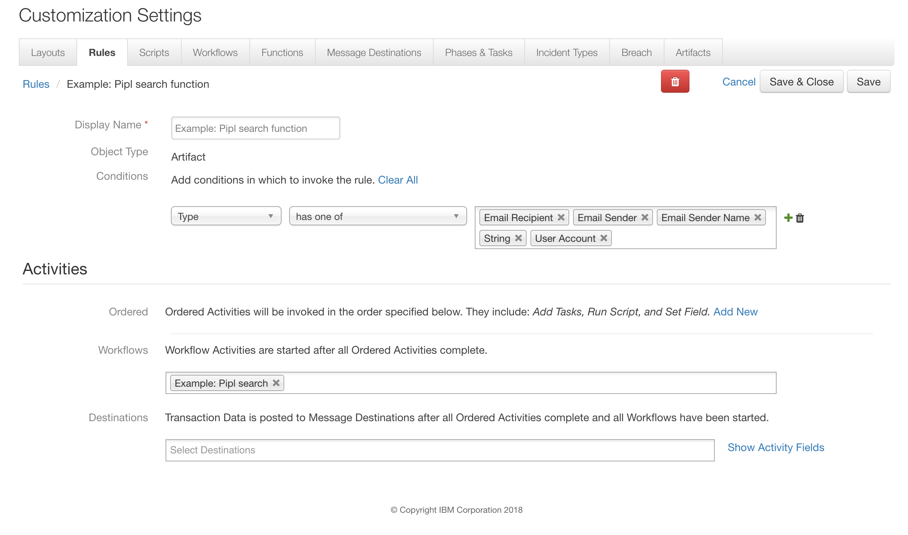
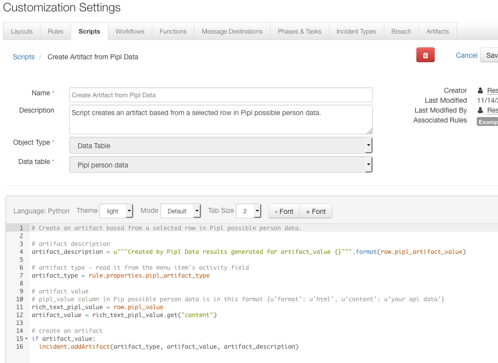

# Resilient Integration with Pipl
This package contains one function that enriches your leads (name, email address, phone number, or social media username) 
with Pipl and gets their personal, professional, demographic, and contact information.
The response from Pipl is saved in Pipl possible person datatable.
The package also contains a script for creating an artifact from a selected row in the datatable.

To query Pipl Data API user needs to provide API key from [Pipl](https://pipl.com/api/).


 
## Installation

Prerequisites:

    resilient-circuits >=v30.0.0
    
To install in "development mode"

    pip install -e ./fn_pipl/

After installation, the package will be loaded by `resilient-circuits run`.

To uninstall,

    pip uninstall fn_pipl

To package for distribution,

    python ./fn_pipl/setup.py sdist

The resulting .tar.gz file can be installed using

    pip install fn_slack<version>.tar.gz

## Configuration
1. Import the package's customization data into the Resilient Platform through the command:

    resilient-circuits customize

	This will create the following custom components:        
	* Message Destinations: `fn_pipl`
	* Functions: `pipl_search_function`
	* Function Params": `artifact_id`, `incident_id`
	* Action Fields: `pipl_artifact_type`
	* Custom Datatables: `pipl_person_data`
	* Workflows: `example_pipl_search_function`
	* Rules: `Example: Create an Artifact from Pipl data`, `Example: Pipl search function`
	* Scripts: `pipl_create_artifact`

2. Update and edit `app.config` by first running:

		resilient-circuits config [-u | -c]. 
		
Then edit the [fn_pipl]:

```
[fn_pipl]
pipl_api_key=xxxxx

# Optional
# 0 – 1 (float value) The minimum required match score for possible persons to be returned.
# minimum_match 1 will return the information for the chosen person only - the definite match
# other values will return a possible persons list
#pipl_minimum_match=1

# Optional
# 0 – 1 (float value) The minimum acceptable probability for inferred data
# Minimum probability lets you decide if your matches should only include source-validated data 
(data found in one of our data sources) or can include inferred data (data we infer based on statistical analysis).
# Setting your minimum probability to 1 means no inferred data will be used to determine a match or be included in matches.
#pipl_minimum_probability=1

# Optional
# True or False, default value is False
# whether the API should return persons made up solely from data inferred by statistical analysis from your search query.
#pipl_infer_persons=True
```

## Function Inputs:
Function can be invoked only on certain type of artifacts:



## Function Output:
```python

results = {
  success: True,

  possible_persons: [
  {
    "@id": "e3317300-8868-4f2d-a696-b54756586cb3",
    "@match": 1.0,
    "@search_pointer": "43bf014e0a517a1f47af759d43255fdeee25ee03da3df1028499aa7099d1428beb52dda70391b52c26bb9837bc714f3af308889aba2ca8d9deb670336f844c9c5f50b887713a1d4ea8301bc032be768e0799caee050fcf2ad8470e919fb11007b6c61f34c2da3b0d695f9da7210e2d1ed32a5a33dffe28d8e5d50e04a98bfbf5872aafdbcb40bf119bdecd05ff56997ef034665e09cb4198dd6730bf6ea6381a89dec63291aec66b3e661f7cb0d85f7cd900bbb538081d0f31d479a806b88e7a1e56b454f274b4948e7511524d6f8b909bae09ad1cf6c14afb9ec0675fca78ddf013bd2d2d35852c5fb0a44600a1a12cafc0658d40bceb48617afef71898b44d5cb075e5a932a8a9008d0c3327f40b62a69bc124f670a9734480dffe4159620627cc46ef875d63264a09a4ff05de6f0dbc72e04fe00464762904eed41f6875655543f8e2f69793130918ee1f1317437a91b51554aa2ef2fe38d330de7217f8b21a05183cf47a15fd3034711c52d7c986dcea79591e6cbcf673bb4244872bdbaaea14004e8f5daf9682b681dc03f8cd5d4c9a2a3523ef3c6bb441c308a706203fe3cb4395a2c3f914d11f86bf3d1d0f34eb9f1b34014299dcc6d1ab7fba27e1baf627b2bd48d034ae7820eb1919f59330b23b00c2d9ac7c1245fe07520a5792f49f543cb8ab887c64c6f4417f5056359302322f125c393bc93cac47ef4058066ebe4592c9e61993c9ff2c72cd1f4516ce870daeee9bbf6931cf4944804d5dcb7a668dd4257d377bcb9ca1bb3adf8633c2e18cc27c507f90ad8ff1eba8f5704b59fc4a1838e13c98ede8a00ed561187c47bda078a9942e8a371bbdbfdc9c5a869e40b1c2de0847dd16af1b5adab5f5355eb67cd1929a3620fb101333971967b5bb6812e01c2b9dfd7219f681c059bc2d9f42667f0fdf10c3a7fb8ac23ee7f85a4ee9f6709e695f91dfddfda35c06acfe4ad5981fcd67ba0126f383e2e17ca25be6d75482c2b3060978f14d9f9cf3b61d077958e87c57960d152593d77df99c15b100cfcf4bc337c0d26d61070048d7d37b2fc6b3d33797990668fde2e3bf8d5f41f9bbdd2be3f62fbfb7222f524f81704e83382735742416419020d17b2b9f8a16ab5bbc73e3eda94276588d325811b79d9461ffb869bdbe1140ce4cfc2bc4dcdffb7e26fd474abfa2eb38a36c3bc37afbefb84e7f68d8cc0a982b530ee0151e7ab2440828de00480baa9fbf6d1586522805dcab7772c5b8ef09b1817a644bcfc500b0ebdb090b39a9651e376eddb853e619eb7e803bed462af4703e0c09493ddd6167f8e1cde5dff03c41c600eb4066d6ad0d186f0c04aaa6984a3b02dc74dc389dfab0fbc76f2850c81a8772ccc8d65d06344089157d340d52d48ede80daa534b0cbaac245e4b8eea5e1733a8db4de877c14c37e7d346f67db588a7594862b09c6b05d3622995fcb3cd834fcd9a8174a91fd8fb4a537d044d47ca834bb48da41779281865d3fc1022a718e6cc096c2d4320c52472055711593d74b2efe708bb6d49c880b8f722d32a296b75451257e26bdbe897885dae33a6e7d63bd375085996e9307659f2fb6d1a1ad817b58579dcb51e5658e467ba2ca48032d9addae06b0",
    "names": [
        {
            "first": "Kal",
            "last": "El",
            "display": "Kal El"
        },
        {
            "first": "Clark",
            "middle": "Joseph",
            "last": "Kent",
            "display": "Clark Joseph Kent"
        },
        {
            "display": "The red blue blur"
        }
    ],
    "emails": [
        {
            "@type": "work",
            "@email_provider": false,
            "address": "full.email.available@business.subscription",
            "address_md5": "eb3e11de3c9cefc2d9d70972350e2b28"
        },
        {
            "@disposable": true,
            "@email_provider": false,
            "address": "full.email.available@business.subscription",
            "address_md5": "999e509752141a0ee42ff455529c10fc"
        },
        {
            "@type": "personal",
            "@email_provider": true,
            "address": "full.email.available@business.subscription",
            "address_md5": "501548362894b9a08f071b1565d8aa14"
        },
        {
            "@disposable": true,
            "@email_provider": false,
            "address": "full.email.available@business.subscription",
            "address_md5": "2610ee49440fe757e3cc4e46e5b40819"
        }
    ],
    "usernames": [
        {
            "content": "superman@facebook"
        },
        {
            "content": "@ckent"
        }
    ],
    "phones": [
        {
            "@type": "home_phone",
            "country_code": 1,
            "number": 9785550145,
            "display": "978-555-0145",
            "display_international": "+1 978-555-0145"
        }
    ],
    "gender": {
        "content": "male"
    },
    "dob": {
        "date_range": {
            "start": "1986-01-01",
            "end": "1987-05-13"
        },
        "display": "32 years old"
    },
    "languages": [
        {
            "region": "US",
            "language": "en",
            "display": "en_US"
        }
    ],
    "ethnicities": [
        {
            "content": "other"
        },
        {
            "content": "american_indian"
        },
        {
            "content": "white"
        }
    ],
    "origin_countries": [
        {
            "country": "US"
        }
    ],
    "addresses": [
        {
            "@valid_since": "2005-02-12",
            "@type": "work",
            "country": "US",
            "state": "KS",
            "city": "Metropolis",
            "street": "Broadway",
            "house": "1000",
            "apartment": "355",
            "display": "1000-355 Broadway, Metropolis, Kansas"
        },
        {
            "@valid_since": "1999-02-01",
            "@type": "home",
            "country": "US",
            "state": "KS",
            "city": "Smallville",
            "street": "Hickory Lane",
            "house": "10",
            "apartment": "1",
            "zip_code": "66605",
            "display": "10-1 Hickory Lane, Smallville, Kansas"
        }
    ],
    "jobs": [
        {
            "title": "Field Reporter",
            "organization": "The Daily Planet",
            "industry": "Journalism",
            "date_range": {
                "start": "2000-12-08",
                "end": "2012-10-09"
            },
            "display": "Field Reporter at The Daily Planet (2000-2012)"
        },
        {
            "title": "Junior Reporter",
            "organization": "The Daily Planet",
            "industry": "Journalism",
            "date_range": {
                "start": "1999-10-10",
                "end": "2000-10-10"
            },
            "display": "Junior Reporter at The Daily Planet (1999-2000)"
        },
        {
            "title": "Top Reporter",
            "organization": "The Daily Planet",
            "industry": "Reporting",
            "display": "Top Reporter at The Daily Planet"
        }
    ],
    "educations": [
        {
            "degree": "B.Sc Advanced Science",
            "school": "Metropolis University",
            "date_range": {
                "start": "2005-09-01",
                "end": "2008-05-14"
            },
            "display": "B.Sc Advanced Science from Metropolis University (2005-2008)"
        },
        {
            "school": "Smallville High",
            "date_range": {
                "start": "2001-09-01",
                "end": "2005-06-01"
            },
            "display": "Smallville High (2001-2005)"
        }
    ],
    "relationships": [
        {
            "@type": "family",
            "@subtype": "Adoptive Father",
            "names": [
                {
                    "first": "Jonathan",
                    "last": "Kent",
                    "display": "Jonathan Kent"
                }
            ],
            "emails": [
                {
                    "@email_provider": false,
                    "address": "full.email.available@business.subscription",
                    "address_md5": "428ffee0df26012a5a2c95b65af0025c"
                }
            ]
        },
        {
            "@type": "family",
            "@subtype": "Father",
            "names": [
                {
                    "first": "Jor",
                    "last": "El",
                    "display": "Jor El"
                }
            ]
        },
        {
            "@type": "family",
            "@subtype": "Cousin",
            "names": [
                {
                    "first": "Kara",
                    "last": "Kent",
                    "display": "Kara Kent"
                }
            ]
        },
        {
            "@type": "other",
            "@subtype": "Archenemy",
            "names": [
                {
                    "first": "Alexander",
                    "middle": "Joseph",
                    "last": "Luthor",
                    "display": "Alexander Joseph Luthor"
                }
            ]
        },
        {
            "@type": "work",
            "@subtype": "Colleague",
            "names": [
                {
                    "first": "Ron",
                    "last": "Troupe",
                    "display": "Ron Troupe"
                }
            ]
        },
        {
            "@type": "friend",
            "@subtype": "The real love",
            "names": [
                {
                    "first": "Chloe",
                    "middle": "Anne",
                    "last": "Sullivan",
                    "display": "Chloe Anne Sullivan"
                }
            ]
        }
    ],
    "user_ids": [
        {
            "content": "11231@facebook"
        }
    ],
    "images": [
        {
            "url": "http://vignette1.wikia.nocookie.net/smallville/images/e/ea/Buddies_forever.jpg"
        },
        {
            "url": "http://vignette3.wikia.nocookie.net/smallville/images/5/55/S10E18-Booster21.jpg"
        }
    ],
    "urls": [
        {
            "@source_id": "edc6aa8fa3f211cfad7c12a0ba5b32f4",
            "@domain": "linkedin.com",
            "@name": "LinkedIn",ß
            "@category": "professional_and_business",
            "url": "http://linkedin.com/clark.kent"
        },
        {
            "@source_id": "5d836a4acc55922e49fc709c7a39e233",
            "@domain": "facebook.com",
            "@name": "Facebook",
            "@category": "personal_profiles",
            "url": "http://facebook.com/superman"
        },
        {
            "@domain": "linkedin.com",
            "@category": "professional_and_business",
            "url": "https://www.linkedin.com/pub/superman/20/7a/365"
        }
    ]
  }],
  
  raw_data: JSON output
}
```

## Pre-Process Script:
This example sets the inputs
```python
# Required inputs are: the incident id and artifact id
inputs.incident_id = incident.id
inputs.artifact_id = artifact.id
```

## Post-Process Script:
This example creates a row in Pipl possible person datatable for certain types of Pipl data.
```python
from java.util import Date

def add_row_to_pipl_datatable(db_timestamp, db_artifact_value, db_result_id, db_property, db_value, db_match, db_inferred):
  pipl_person_data = incident.addRow("pipl_person_data")
  pipl_person_data.pipl_timestamp = db_timestamp
  pipl_person_data.pipl_artifact_value = db_artifact_value
  pipl_person_data.pipl_result_id = db_result_id
  pipl_person_data.pipl_property = db_property
  pipl_person_data.pipl_value = db_value
  pipl_person_data.pipl_match = db_match
  pipl_person_data.pipl_inferred = db_inferred

if results.success:
  # Save the json results to an artifact
  artifact.description = results.raw_data
  
  # Create a datatable with results
  result_id = 0
  for person in results.possible_persons:
    # generate result_id and timestamp
    result_id += 1
    now = Date()
    
    # 0-1. The level of confidence we have that this is the person you’re looking for.
    match = str(person.get("@match", ""))
    
    # Whether this person is made up solely from data inferred by statistical analysis from your search query. 
    # You can control inference using the minimum_probability parameter, and inference of persons using the infer_persons parameter.
    inferred = str(person.get("@inferred", ""))
    
    # Person data
    names = person.get("names", [])
    for name in names:
      add_row_to_pipl_datatable(now, artifact.value, result_id, "name", name.get("display", ""), match, inferred)
    
    emails = person.get("emails", [])
    for email in emails:
      add_row_to_pipl_datatable(now, artifact.value, result_id, "email address", email.get("address", ""), match, inferred)
      add_row_to_pipl_datatable(now, artifact.value, result_id, "address_md5", email.get("address_md5", ""), match, inferred)
    
    usernames = person.get("usernames", [])
    for usrname in usernames:
      add_row_to_pipl_datatable(now, artifact.value, result_id, "username", usrname.get("content", ""), match, inferred)
      
    phones = person.get("phones", [])
    for phone in phones:
      add_row_to_pipl_datatable(now, artifact.value, result_id, "phone", phone.get("display_international", ""), match, inferred)
      
    gender = person.get("gender")
    if gender:
      add_row_to_pipl_datatable(now, artifact.value, result_id, "gender", gender.get("content", ""), match, inferred)
    
    dob = person.get("dob")
    if dob:
      add_row_to_pipl_datatable(now, artifact.value, result_id, "dob", dob.get("display", ""), match, inferred)
    
    addresses = person.get("addresses", [])
    for address in addresses:
      add_row_to_pipl_datatable(now, artifact.value, result_id, "address", address.get("display", ""), match, inferred)
      
    jobs = person.get("jobs", [])
    for job in jobs:
      add_row_to_pipl_datatable(now, artifact.value, result_id, "job", job.get("display", ""), match, inferred)
    
    educations = person.get("educations", [])
    for edu in educations:
      add_row_to_pipl_datatable(now, artifact.value, result_id, "education", edu.get("display", ""), match, inferred)
      
    user_ids = person.get("user_ids", [])
    for usr_id in user_ids:
      add_row_to_pipl_datatable(now, artifact.value, result_id, "user_id", usr_id.get("content", ""), match, inferred)
      
    images = person.get("images", [])
    for image in images:
      image_url = """<a href='{0}'>{0}</a>""".format(image.get("url", "")) if image.get("url", "") else ""
      add_row_to_pipl_datatable(now, artifact.value, result_id, "image", image_url, match, inferred)
      
    urls = person.get("urls", [])
    for url in urls:
      url_url = """<a href='{0}'>{0}</a>""".format(url.get("url", "")) if url.get("url", "") else ""
      add_row_to_pipl_datatable(now, artifact.value, result_id, "url", url_url, match, inferred)
```


## Rules
| Rule Name | Object Type | Workflow or Script Triggered |
| --------- | :---------: | ---------------------------- |
| Example: Pipl search function | `Artifact` | `Example: Pipl search workflow` |
| Example: Create an Artifact from Pipl data | `Data Table` | `pipl_create_artifact script` |

## Script
