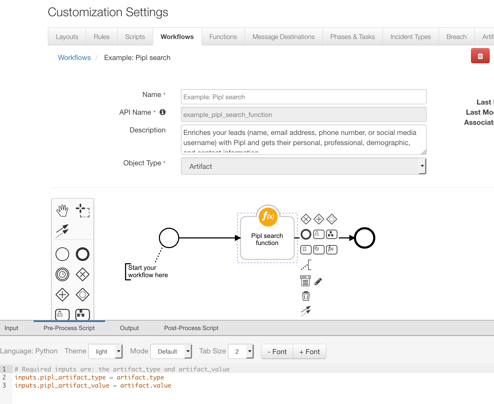
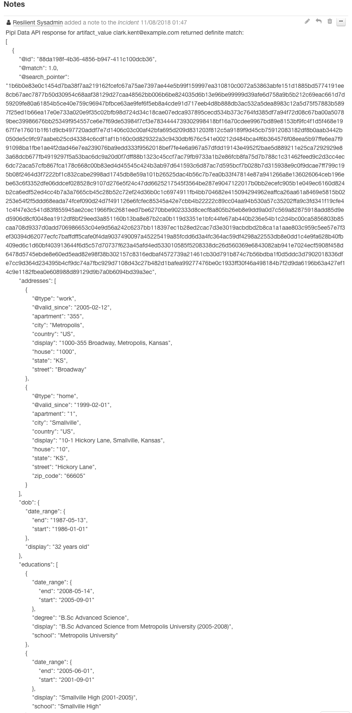

# Resilient Integration with Pipl

This package contains a function that enriches your leads (name, email address, phone number, or social media username) 
with Pipl and gets their personal, professional, demographic, and contact information.
The response from Pipl is saved in Pipl person datatable.
The package also contains a script for creating an artifact from a selected row in the datatable.

To query Pipl Data API user needs to provide API key from [Pipl](https://pipl.com/api/).


 
## Installation

Prerequisites:

    resilient-circuits >=v30.0.0
    
To install in "development mode"

    pip install -e ./fn_pipl/

After installation, the package will be loaded by `resilient-circuits run`.

To uninstall,

    pip uninstall fn_pipl

To package for distribution,

    python ./fn_pipl/setup.py sdist

The resulting .tar.gz file can be installed using

    pip install fn_pipl<version>.tar.gz

## Configuration
1. Import the package's customization data into the Resilient Platform through the command:

    resilient-circuits customize

	This will create the following custom components:        
	* Message Destinations: `fn_pipl`
	* Functions: `pipl_search_function`
	* Function Params": `artifact_type`, `artifact_value`
	* Action Fields: `pipl_artifact_type`
	* Custom Datatables: `pipl_person_data`
	* Workflows: ` Example: Pipl search`
	* Rules: `Example: Create an Artifact from Pipl data`, `Example: Pipl search function`
	* Scripts: `Create Artifact from Pipl Data`

2. Update and edit `app.config` by first running:

		resilient-circuits config [-u | -c]. 
		
Then edit the [fn_pipl]:

```
[fn_pipl]
pipl_api_key=xxxxx

# Number of possible person matches to include in the results.
# A possible persons response returns possible persons in descending order based on their match rate 
# (whether you can see the match rate or not). 
# The most probable person will always appear as the first possible person at the top of the results 
# and the least probable person will appear at the bottom of the list.
pipl_max_no_possible_per_matches=10

# Optional
# Value between 0 and 1 (float value) The minimum required match score for possible persons to be returned.
# minimum_match 1 will return the information for the chosen person only - the definite match.
# A definite match is best when you need someone’s contact information or for identity verification.
# Values other than 1 will return a possible persons list.
#pipl_minimum_match=1

# Optional
# Value between 0 and 1 (float value) The minimum acceptable probability for inferred data
# Minimum probability lets you decide if your matches should only include source-validated data 
# (data found in one of pipl data sources) or can include inferred data (data pipl infers based on statistical analysis).
# Setting your minimum probability to 1 means no inferred data will be used to determine a match or be included in matches.
# Setting your minimum probability to 0.7 will include inferred data that has a 70% confidence level or higher.
#pipl_minimum_probability=0.7

# Optional
# True or False, default value is False
# whether the API should return persons made up solely from data inferred by statistical analysis from your search query.
#pipl_infer_persons=True
```
## Example: Pipl search workflow Pre-Process Script
This example sets the inputs

```python
# Required inputs are: the artifact_type and artifact_value
inputs.pipl_artifact_type = artifact.type
inputs.pipl_artifact_value = artifact.value
```

## Example: Pipl search workflow Post-Process Script:
This example creates a row in Pipl person datatable for certain types of Pipl data.

```python
from java.util import Date

def add_row_to_pipl_datatable(db_timestamp, db_artifact_value, db_match_no, db_property, db_value, db_match, db_inferred):
  pipl_person_data = incident.addRow("pipl_person_data")
  pipl_person_data.pipl_timestamp = db_timestamp
  pipl_person_data.pipl_artifact_value = db_artifact_value
  pipl_person_data.pipl_possible_match_no = db_match_no
  pipl_person_data.pipl_property = db_property
  pipl_person_data.pipl_value = db_value
  pipl_person_data.pipl_match = db_match
  pipl_person_data.pipl_inferred = db_inferred

if results.success:

  # Create a datatable from pipl response
  possible_person_counter = 0
  for person in results.person_list:
    
    # generate result_id and timestamp
    possible_person_counter += 1
    now = Date()
    
    # 0-1. The level of confidence we have that this is the person you’re looking for.
    match = str(person.get("@match", ""))
    
    # Whether this person is made up solely from data inferred by statistical analysis from your search query. 
    # You can control inference using the minimum_probability parameter, and inference of persons using the infer_persons parameter.
    inferred = str(person.get("@inferred", ""))
    
    # Person data
    names = person.get("names", [])
    for name in names:
      add_row_to_pipl_datatable(now, artifact.value, possible_person_counter, "name", name.get("display", ""), match, inferred)
    
    emails = person.get("emails", [])
    for email in emails:
      add_row_to_pipl_datatable(now, artifact.value, possible_person_counter, "email address", email.get("address", ""), match, inferred)
      add_row_to_pipl_datatable(now, artifact.value, possible_person_counter, "address_md5", email.get("address_md5", ""), match, inferred)
    
    usernames = person.get("usernames", [])
    for usrname in usernames:
      add_row_to_pipl_datatable(now, artifact.value, possible_person_counter, "username", usrname.get("content", ""), match, inferred)
      
    phones = person.get("phones", [])
    for phone in phones:
      add_row_to_pipl_datatable(now, artifact.value, possible_person_counter, "phone", phone.get("display_international", ""), match, inferred)
      
    gender = person.get("gender")
    if gender:
      add_row_to_pipl_datatable(now, artifact.value, possible_person_counter, "gender", gender.get("content", ""), match, inferred)
    
    dob = person.get("dob")
    if dob:
      add_row_to_pipl_datatable(now, artifact.value, possible_person_counter, "dob", dob.get("display", ""), match, inferred)
    
    addresses = person.get("addresses", [])
    for address in addresses:
      add_row_to_pipl_datatable(now, artifact.value, possible_person_counter, "address", address.get("display", ""), match, inferred)
      
    jobs = person.get("jobs", [])
    for job in jobs:
      add_row_to_pipl_datatable(now, artifact.value, possible_person_counter, "job", job.get("display", ""), match, inferred)
    
    educations = person.get("educations", [])
    for edu in educations:
      add_row_to_pipl_datatable(now, artifact.value, possible_person_counter, "education", edu.get("display", ""), match, inferred)
      
    user_ids = person.get("user_ids", [])
    for usr_id in user_ids:
      add_row_to_pipl_datatable(now, artifact.value, possible_person_counter, "user_id", usr_id.get("content", ""), match, inferred)
      
    images = person.get("images", [])
    for image in images:
      image_url = """<a href='{0}'>{0}</a>""".format(image.get("url", "")) if image.get("url", "") else ""
      add_row_to_pipl_datatable(now, artifact.value, possible_person_counter, "image", image_url, match, inferred)
      
    urls = person.get("urls", [])
    for url in urls:
      url_url = """<a href='{0}'>{0}</a>""".format(url.get("url", "")) if url.get("url", "") else ""
      add_row_to_pipl_datatable(now, artifact.value, possible_person_counter, "url", url_url, match, inferred)
      
  # Save the json result as an Note
  raw_data = results.raw_data if results.raw_data else ""
  counter = possible_person_counter if possible_person_counter > 0 else ""
  noteText = u"""Pipl Data API response for artifact_value {} returned {} {}: \n{}""".format(artifact.value, counter, results.pipl_response, raw_data)
  incident.addNote(noteText)
```

## Example Rules

| Rule Name | Object Type | Workflow or Script Triggered |
| --------- | :---------: | ---------------------------- |
| Example: Pipl search function | `Artifact` | `Example: Pipl search workflow` |
| Example: Create an Artifact from Pipl data | `Data Table` | `Create Artifact from Pipl Data` |

Example: Pipl search function rule only works on certain types of artifacts:


When clicking on Example: Create an Artifact from Pipl data rule user is prompt for an artifact type he or she 
wishes to create:


If users wish to use custom artifact types they will need to edit the activity filed on "Example: Create an Artifact 
from Pipl data" rule:


## Function Call


## Function Results

A note is created with JSON output:



A row is also created in Pipl person datatable:


To display Pipl person datatable, users need to manually add it to a new or existing layout.
1. Navigate to the Customization Settings and select or create a new Incident tab in the Layouts tab.
2. Drag the “Pipl person datatable” datatable to your Incident tab.
3. Click Save.

## Create Artifact from Pipl Data

User can invoke the Script on the datatable:


The result is a new artifact:


Script:


## Example Output:
```python

results = {
  success: True,
  
  pipl_response: "definite match/possible person matches/no match",

  possible_persons: [
  {
    "@id": "e3317300-8868-4f2d-a696-b54756586cb3",
    "@match": 1.0,
    "@search_pointer": "43bf014e0a517a1f47af759d43255fdeee2...",
    "names": [
        {
            "first": "Kal",
            "last": "El",
            "display": "Kal El"
        },
        {
            "first": "Clark",
            "middle": "Joseph",
            "last": "Kent",
            "display": "Clark Joseph Kent"
        }
    ],
    "emails": [
        {
            "@type": "work",
            "@email_provider": false,
            "address": "full.email.available@business.subscription",
            "address_md5": "eb3e11de3c9cefc2d9d70972350e2b28"
        },
        {
            "@disposable": true,
            "@email_provider": false,
            "address": "full.email.available@business.subscription",
            "address_md5": "999e509752141a0ee42ff455529c10fc"
        }
    ],
    "usernames": [
        {
            "content": "superman@facebook"
        },
        {
            "content": "@ckent"
        }
    ],
    "phones": [
        {
            "@type": "home_phone",
            "country_code": 1,
            "number": 9785550145,
            "display": "978-555-0145",
            "display_international": "+1 978-555-0145"
        }
    ],
    "gender": {
        "content": "male"
    },
    "dob": {
        "date_range": {
            "start": "1986-01-01",
            "end": "1987-05-13"
        },
        "display": "32 years old"
    },
    "languages": [
        {
            "region": "US",
            "language": "en",
            "display": "en_US"
        }
    ],
    "ethnicities": [
        {
            "content": "other"
        },
        {
            "content": "american_indian"
        }
    ],
    "origin_countries": [
        {
            "country": "US"
        }
    ],
    "addresses": [
        {
            "@valid_since": "2005-02-12",
            "@type": "work",
            "country": "US",
            "state": "KS",
            "city": "Metropolis",
            "street": "Broadway",
            "house": "1000",
            "apartment": "355",
            "display": "1000-355 Broadway, Metropolis, Kansas"
        },
        {
            "@valid_since": "1999-02-01",
            "@type": "home",
            "country": "US",
            "state": "KS",
            "city": "Smallville",
            "street": "Hickory Lane",
            "house": "10",
            "apartment": "1",
            "zip_code": "66605",
            "display": "10-1 Hickory Lane, Smallville, Kansas"
        }
    ],
    "jobs": [
        {
            "title": "Field Reporter",
            "organization": "The Daily Planet",
            "industry": "Journalism",
            "date_range": {
                "start": "2000-12-08",
                "end": "2012-10-09"
            },
            "display": "Field Reporter at The Daily Planet (2000-2012)"
        },
        {
            "title": "Junior Reporter",
            "organization": "The Daily Planet",
            "industry": "Journalism",
            "date_range": {
                "start": "1999-10-10",
                "end": "2000-10-10"
            },
            "display": "Junior Reporter at The Daily Planet (1999-2000)"
        }
    ],
    "educations": [
        {
            "degree": "B.Sc Advanced Science",
            "school": "Metropolis University",
            "date_range": {
                "start": "2005-09-01",
                "end": "2008-05-14"
            },
            "display": "B.Sc Advanced Science from Metropolis University (2005-2008)"
        },
        {
            "school": "Smallville High",
            "date_range": {
                "start": "2001-09-01",
                "end": "2005-06-01"
        }
    ],
    "relationships": [
        {
            "@type": "family",
            "@subtype": "Adoptive Father",
            "names": [
                {
                    "first": "Jonathan",
                    "last": "Kent",
                    "display": "Jonathan Kent"
                }
            ],
            "emails": [
                {
                    "@email_provider": false,
                    "address": "full.email.available@business.subscription",
                    "address_md5": "428ffee0df26012a5a2c95b65af0025c"
                }
            ]
        },
        {
            "@type": "family",
            "@subtype": "Father",
            "names": [
                {
                    "first": "Jor",
                    "last": "El",
                    "display": "Jor El"
                }
            ]
        }   
    ],
    "user_ids": [
        {
            "content": "11231@facebook"
        }
    ],
    "images": [
        {
            "url": "http://vignette1.wikia.nocookie.net/smallville/images/e/ea/Buddies_forever.jpg"
        },
        {
            "url": "http://vignette3.wikia.nocookie.net/smallville/images/5/55/S10E18-Booster21.jpg"
        }
    ],
    "urls": [
        {
            "@source_id": "edc6aa8fa3f211cfad7c12a0ba5b32f4",
            "@domain": "linkedin.com",
            "@name": "LinkedIn",ß
            "@category": "professional_and_business",
            "url": "http://linkedin.com/clark.kent"
        },
        {
            "@source_id": "5d836a4acc55922e49fc709c7a39e233",
            "@domain": "facebook.com",
            "@name": "Facebook",
            "@category": "personal_profiles",
            "url": "http://facebook.com/superman"
        }
    ]
  }],
  
  raw_data: JSON output
}
```