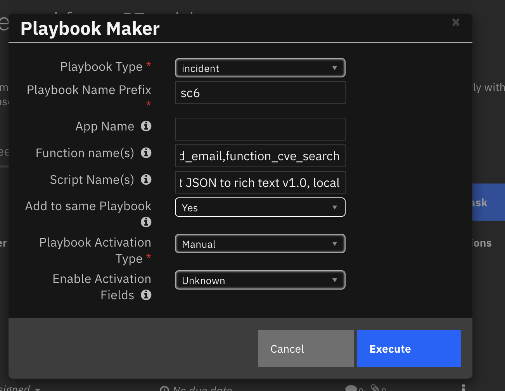
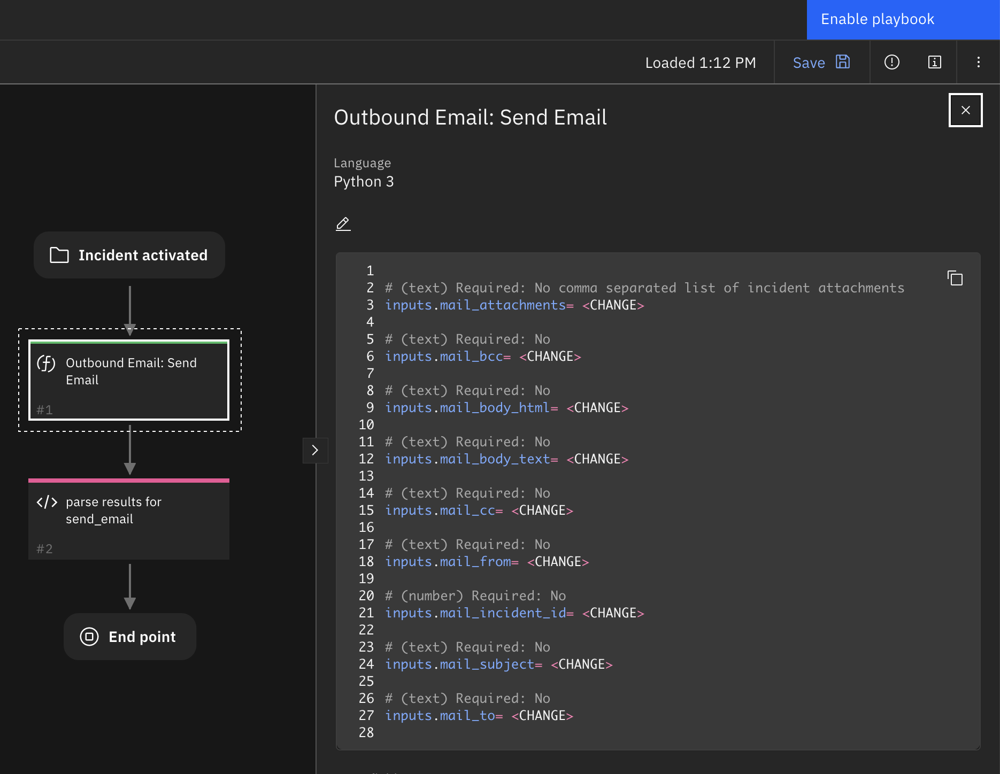
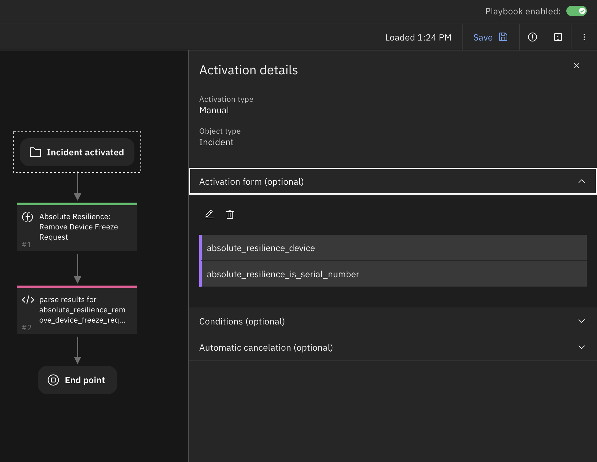
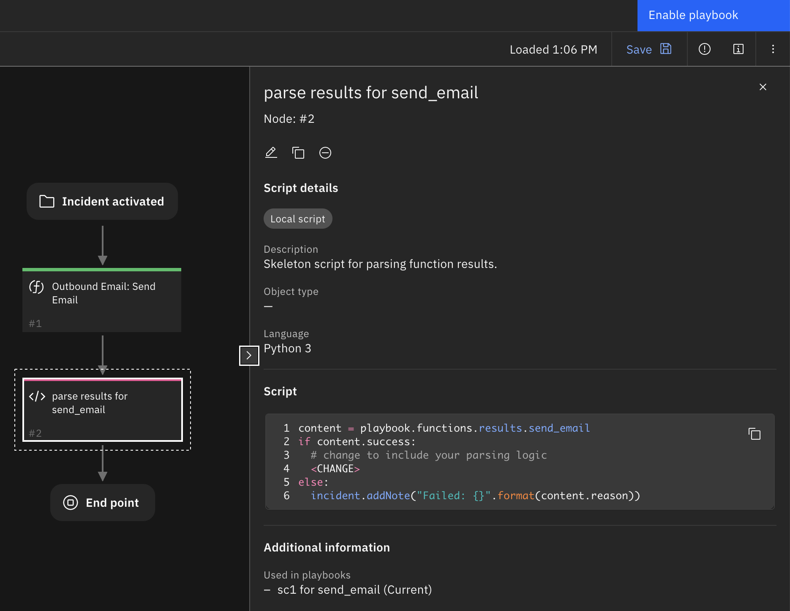

<!--
  This README.md is generated by running:
  "resilient-sdk docgen -p fn_playbook_maker"

  It is best edited using a Text Editor with a Markdown Previewer. VS Code
  is a good example. Checkout https://guides.github.com/features/mastering-markdown/
  for tips on writing with Markdown

  All fields followed by "::CHANGE_ME::"" should be manually edited

  If you make manual edits and run docgen again, a .bak file will be created

  Store any screenshots in the "doc/screenshots" directory and reference them like:
  

  NOTE: If your app is available in the container-format only, there is no need to mention the integration server in this readme.
-->

# Playbook Maker

## Table of Contents
- [Release Notes](#release-notes)
- [Overview](#overview)
  - [Key Features](#key-features)
- [Requirements](#requirements)
  - [SOAR platform](#soar-platform)
  - [Cloud Pak for Security](#cloud-pak-for-security)
  - [Proxy Server](#proxy-server)
  - [Python Environment](#python-environment)
- [Installation](#installation)
  - [Install](#install)
  - [App Configuration](#app-configuration)
- [Function - Make Playbook](#function---make-playbook)
- [Rules](#rules)
- [Troubleshooting & Support](#troubleshooting--support)
---

## Release Notes
<!--
  Specify all changes in this release. Do not remove the release
  notes of a previous release
-->
| Version | Date | Notes |
| ------- | ---- | ----- |
| 1.0.0 | 07/22022 | Initial Release |

---

## Overview
<!--
  Provide a high-level description of the function itself and its remote software or application.
  The text below is parsed from the "description" and "long_description" attributes in the setup.py file
-->
**Generate playbooks from function definitions for fast prototyping or business processing **

 

This app gives you the ability quickly generate a complete playbook from functions to use in your business processing or to quickly prototype playbook access.
Given that many apps are not distributed with example rules/workflows or playbooks, this capability is a fast way to get started with the use of a function.

Specify an app to include all it's functions in playbooks, or name the functions individually to create playbooks as a starting point for playbook creation. The resulting playbooks have the necessary 'bones' to execute a function and process it's output. Some work remains to fill out the logic to process the function's output.

### Key Features
<!--
  List the Key Features of the Integration
-->
* Generate one playbook with all functions or separate each function in it's own playbook.
* Specify whether the playbook is used automatically or manually.
* Specify whether the playbook should include activation fields for manual playbooks.
* Auto generate a processing script for function output or use existing global scripts.

All playbooks are generated in `Draft` mode, so that additional changes can be made. Once complete (such as adding execution conditions or output script parsing logic), enable the playbook for use with incidents, artifacts, attachments, etc.

---

## Requirements
<!--
  List any Requirements
-->
<!-- ::CHANGE_ME:: -->
This app supports the IBM Security QRadar SOAR Platform and the IBM Security QRadar SOAR for IBM Cloud Pak for Security.

### SOAR platform
The SOAR platform supports two app deployment mechanisms, App Host and integration server.

If deploying to a SOAR platform with an App Host, the requirements are:
* SOAR platform >= `45.0`.
* The app is in a container-based format (available from the AppExchange as a `zip` file).

If deploying to a SOAR platform with an integration server, the requirements are:
* SOAR platform >= `45.0`.
* The app is in the older integration format (available from the AppExchange as a `zip` file which contains a `tar.gz` file).
* Integration server is running `resilient-circuits>=44.0.0`.
* If using an API key account, make sure the account provides the following minimum permissions:
  | Name | Permissions |
  | ---- | ----------- |
  | Org Data | Read, Edit |
  | Function | Read |
  | Playbook | Read, Create |
  | Apps | Manage |

The following SOAR platform guides provide additional information:
* _App Host Deployment Guide_: provides installation, configuration, and troubleshooting information, including proxy server settings.
* _Integration Server Guide_: provides installation, configuration, and troubleshooting information, including proxy server settings.
* _System Administrator Guide_: provides the procedure to install, configure and deploy apps.

The above guides are available on the IBM Documentation website at [ibm.biz/soar-docs](https://ibm.biz/soar-docs). On this web page, select your SOAR platform version. On the follow-on page, you can find the _App Host Deployment Guide_ or _Integration Server Guide_ by expanding **Apps** in the Table of Contents pane. The System Administrator Guide is available by expanding **System Administrator**.

### Cloud Pak for Security
If you are deploying to IBM Cloud Pak for Security, the requirements are:
* IBM Cloud Pak for Security >= 1.9.
* Cloud Pak is configured with an App Host.
* The app is in a container-based format (available from the AppExchange as a `zip` file).

The following Cloud Pak guides provide additional information:
* _App Host Deployment Guide_: provides installation, configuration, and troubleshooting information, including proxy server settings. From the Table of Contents, select Case Management and Orchestration & Automation > **Orchestration and Automation Apps**.
* _System Administrator Guide_: provides information to install, configure, and deploy apps. From the IBM Cloud Pak for Security IBM Documentation table of contents, select Case Management and Orchestration & Automation > **System administrator**.

These guides are available on the IBM Documentation website at [ibm.biz/cp4s-docs](https://ibm.biz/cp4s-docs). From this web page, select your IBM Cloud Pak for Security version. From the version-specific IBM Documentation page, select Case Management and Orchestration & Automation.

### Proxy Server
The app does not require proxy support.

### Python Environment
Python 3.6 is supported. Python 3.9 is suggested.
Additional package dependencies may exist for each of these packages:
* resilient-circuits>=44.0.0
* retry2

#### Configuration
* IBM QRadar SOAR v43 can be used for generating automatic rules and manual rules without activation input fields.
* IBM QRadar SOAR v45 can be used for generating automatic rules and manual rules with no restrictions.

---

## Installation

### Install
* To install or uninstall an App or Integration on the _SOAR platform_, see the documentation at [ibm.biz/soar-docs](https://ibm.biz/soar-docs).
* To install or uninstall an App on _IBM Cloud Pak for Security_, see the documentation at [ibm.biz/cp4s-docs](https://ibm.biz/cp4s-docs) and follow the instructions above to navigate to Orchestration and Automation.

### App Configuration
No configuration settings are required for this app.

---

## Function - Make Playbook
Create playbook(s) based on specific apps and functions.

 

<details><summary>Inputs:</summary>
<p>

| Name | Type | Required | Example | Tooltip |
| ---- | :--: | :------: | ------- | ------- |
| `pbm_playbook_type` | `text` | Yes | `-` | incident, artifact, attachment, comment, <datatable name>. Note: In order to specify datatable names, edit the Rule Activity Field: `pbm_playbook_type` to include your datatable name(s) |
| `pbm_playbook_name` | `text` | Yes | `Playbook for <function>` | Name of playbook to create. `pbm_add_to_same_playbook` = Yes, then this will become the playbook name. If `pbm_add_to_same_playbook` = No, it will become a prefix appended with the associated function included. Names should be contain alphanumberic, blank and dash or underscore characters |
| `pbm_app_name` | `text` | No | `-` | Name of app to associate to playbook(s). Either specify `pbm_app_name` or `pbm_function_names` but not both. |
| `pbm_function_names` | `text` | No | `fuction1,function2` | Comma separated names of functions or blank for all functions when using `pbm_app_name`  |
| `pbm_script_names` | `text` | No | `script1,script2` | Comma separated list of scripts to apply. Use 'local' to generate a local script. If this field is empty, local script(s) are added to all function(s). |
| `pbm_add_to_same_playbook` | `boolean` | No | `-` | If Yes, all function(s) are added to one playbook. |
| `pbm_activation_type` | `select` | Yes | `-` | 'Automatic' or 'Manual' |
| `pbm_activation_fields` | `boolean` | Yes | `-` | Create activation fields for data input. This is only valid when  `pbm_activation_type` = "Manual". |


Notes: When selecting `pbm_add_to_same_playbook=Yes` and `pbm_activation_fields=Yes`, only the first function will use activation fields. This restriction is due to overlapping activation fields which becomes confusing for the functions specified after the first.
</p>
</details>

<details><summary>Outputs:</summary>
<p>

> **NOTE:** This example might be in JSON format, but `results` is a Python Dictionary on the SOAR platform.

```python
results = {
  "content": [
    {
      "id": 85,
      "playbook_name": "make-7 for make_playbook",
      "success": true
    }
  ],
  "inputs": {
    "pbm_activation_fields": false,
    "pbm_activation_type": "Manual",
    "pbm_add_to_same_playbook": false,
    "pbm_app_name": null,
    "pbm_function_names": "make_playbook",
    "pbm_playbook_name": "make-7",
    "pbm_playbook_type": "incident"
  },
  "metrics": {
    "execution_time_ms": 5732,
    "host": "local",
    "package": "fn-playbook-maker",
    "package_version": "1.0.0",
    "timestamp": "2022-06-09 15:12:28",
    "version": "1.0"
  },
  "raw": null,
  "reason": null,
  "success": true,
  "version": 2.0
}
```

</p>
</details>

<details><summary>Example Pre-Process Script:</summary>
<p>

```python
inputs.pbm_playbook_type = rule.properties.pbm_type
inputs.pbm_playbook_name = rule.properties.pbm_name_prefix
inputs.pbm_app_name = rule.properties.pbm_app_name
inputs.pbm_function_names = rule.properties.pbm_function_names
inputs.pbm_script_names = rule.properties.pbm_script_names
inputs.pbm_activation_type = rule.properties.pbm_activation_type
inputs.pbm_activation_fields = rule.properties.pbm_activation_fields if rule.properties.pbm_activation_fields else False
inputs.pbm_add_to_same_playbook = rule.properties.pbm_add_to_same_playbook if rule.properties.pbm_add_to_same_playbook else False

```

</p>
</details>

<details><summary>Example Post-Process Script:</summary>
<p>

```python
if not results.success:
  incident.addNote("Playbook Maker failed: {} for playbook name prefix: {}".format(results.reason, rule.properties.pbm_name_prefix))
else:
  msg_list = []
  for pbk in results.content:
    msg = "{}: {}".format(pbk.get('playbook_name'), "Success" if pbk.get('success', False) else "Failure")
    if pbk.get('success', False):
      msg = "{} <a target='blank' href='#playbooks/designer/{}'>Playbook link</a>".format(msg, pbk.get('id'))
    msg_list.append(msg)

  incident.addNote(helper.createRichText("Playbook Maker results:<br>{}".format("<br>".join(msg_list))))
```

</p>
</details>

---

### Function Inputs without Activation Fields
If activation fields are not created with the playbook, a skeleton of the input field assignments is created. You will need to make the assignments necessary by changing the `<CHANGE>` references. Below is a snippet of what the skeleton script looks like:

  


Sample Input script:
```
# (text) Required: No. Comma separated list of incident attachments
inputs.mail_attachments= <CHANGE>

# (text) Required: No
inputs.mail_bcc= <CHANGE>

# (text) Required: No
inputs.mail_body_html= <CHANGE>
```

### Function Inputs with Activation Fields
When activation fields are created, the function's input script will create an activation field for each function input field. Then, each activation field is associated with the corresponding function input field as follow:

```
# (text) Required: Yes. The unique identifiers of devices included in the request
inputs.absolute_resilience_device= playbook.inputs.absolute_resilience_device

# (boolean) Required: Yes. Specifies if the list of devices are serial numbers (default is ESN's) Can be omitted if using ESN
inputs.absolute_resilience_is_serial_number= playbook.inputs.absolute_resilience_is_serial_number
```

You're use of this playbook may source function data differently, such as from the incident (incident.properties.<custom field>) or from the artifact (artifact.value). Feel free to remove unnecessary activation fields and modify the input script to reference the appropriate data assignments.

  

### Local Post-processing Script
When a local post-processing script is generated. It's just a shell of the logic needed to parse the function's results. The script collects the properties of the function output (ie playbook.functions.results.<function name>). You will need to edit the script to parse the function's results by replacing the content at `<CHANGE>`. Here's the content of the script:

```
content = playbook.functions.results.send_email
if content.success:
  # change to include your parsing logic
  <CHANGE>
else:
  incident.addNote("Failed: {}".format(content.reason))
```

  

### Using Global Scripts
Global scripts can be used when referenced in the `pbm_script_names` function input field.  When specified, they are added into a playbook for function output processing.
Be aware that you'll need to modify the script to access the function's output located at `playbook.functions.results.<function_api_name>`.
You can clone a script if you wish a private copy with this function output location.


---

## Rules
| Rule Name | Object | Workflow Triggered |
| --------- | ------ | ------------------ |
| Playbook Maker | incident | `playbook_maker` |

Note: In order to create playbooks for datatables, edit the rule `Playbook Maker` with the `pbm_playbook_type` activity field and change the reference `<change for datatables>` to your custom datatable API name(s).


---

## Troubleshooting & Support
Refer to the documentation listed in the Requirements section for troubleshooting information.

### For Support
This is a IBM Community provided App. Please search the Community [ibm.biz/soarcommunity](https://ibm.biz/soarcommunity) for assistance.
