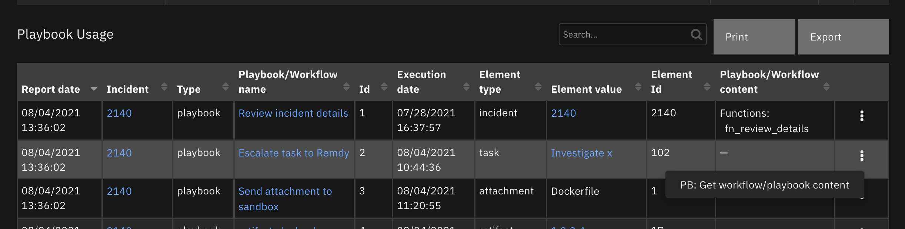

<!--
  This README.md is generated by running:
  "resilient-sdk docgen -p fn_playbook_utils"

  It is best edited using a Text Editor with a Markdown Previewer. VS Code
  is a good example. Checkout https://guides.github.com/features/mastering-markdown/
  for tips on writing with Markdown

  If you make manual edits and run docgen again, a .bak file will be created

  Store any screenshots in the "doc/screenshots" directory and reference them like:
  

  NOTE: If your app is available in the container-format only, there is no need to mention the integration server in this readme.
-->

# Playbook Utils

## Table of Contents
- [Release Notes](#release-notes)
- [Overview](#overview)
  - [Key Features](#key-features)
- [Requirements](#requirements)
  - [IBM SOAR platform](#ibm-soar-platform)
  - [Cloud Pak for Security](#cloud-pak-for-security)
  - [Proxy Server](#proxy-server)
  - [Python Environment](#python-environment)
- [Installation](#installation)
  - [Install](#install)
  - [App Configuration](#app-configuration)
  - [Custom Layouts](#custom-layouts)
- [Function - PB: Get Workflow content](#function---wf-get-workflow-content)
- [Function - PB: Get workflow data](#function---wf-get-workflow-data)
- [Data Table - Playbook Usage](#data-table---playbook-usage)
- [Rules](#rules)
- [Troubleshooting & Support](#troubleshooting--support)
---

## Release Notes
<!--
  Specify all changes in this release. Do not remove the release
  notes of a previous release
-->
| Version | Date | Notes |
| ------- | ---- | ----- |
| 1.0.0 | 08/2021 | Initial Release |

---

## Overview
<!--
  Provide a high-level description of the function itself and its remote software or application.
  The text below is parsed from the "description" and "long_description" attributes in the setup.py file
-->
This app includes functions to mine information about workflow and playbook usage across incidents so that an enterprise can learn the best practices on past threat intelligence and actions performed.

 

Resilient Circuits Components for 'fn_playbook_utils'

### Key Features
<!--
  List the Key Features of the Integration
-->
* Capture workflow usage for a given incident or a range.
* Capture workflow statistics runs over incidents, artifacts, attachments and tasks.
* Capture workflow usage for an incident which can be searchable.

---

## Requirements
<!--
  List any Requirements
-->
This app supports the IBM Resilient SOAR Platform and the IBM Cloud Pak for Security.

### IBM SOAR platform
The IBM SOAR platform supports two app deployment mechanisms, App Host and integration server.

If deploying to a IBM SOAR platform with an App Host, the requirements are:
* IBM SOAR platform >= `39.0.6328`.
* The app is in a container-based format (available from the AppExchange as a `zip` file).

If deploying to a IBM SOAR platform with an integration server, the requirements are:
* IBM SOAR platform >= `39.0.6328`.
* The app is in the older integration format (available from the AppExchange as a `zip` file which contains a `tar.gz` file).
* Integration server is running `resilient-circuits>=41.0.0`.
* If using an API key account, make sure the account provides the following minimum permissions:
  | Name | Permissions |
  | ---- | ----------- |
  | Org Data | Read |
  | Functions | Read |
  | Incidents | Read |
  | Workflows | Read |

The following IBM SOAR platform guides provide additional information:
* _App Host Deployment Guide_: provides installation, configuration, and troubleshooting information, including proxy server settings.
* _Integration Server Guide_: provides installation, configuration, and troubleshooting information, including proxy server settings.
* _System Administrator Guide_: provides the procedure to install, configure and deploy apps.

The above guides are available on the IBM Knowledge Center at [ibm.biz/resilient-docs](https://ibm.biz/resilient-docs). On this web page, select your IBM SOAR platform version. On the follow-on page, you can find the _App Host Deployment Guide_ or _Integration Server Guide_ by expanding **SOAR Apps** in the Table of Contents pane. The System Administrator Guide is available by expanding **System Administrator**.

### Cloud Pak for Security
If you are deploying to IBM Cloud Pak for Security, the requirements are:
* IBM Cloud Pak for Security >= 1.4.
* Cloud Pak is configured with an App Host.
* The app is in a container-based format (available from the AppExchange as a `zip` file).

The following Cloud Pak guides provide additional information:
* _App Host Deployment Guide_: provides installation, configuration, and troubleshooting information, including proxy server settings. From the Table of Contents, select Case Management and Orchestration & Automation > **Orchestration and Automation Apps**.
* _System Administrator Guide_: provides information to install, configure, and deploy apps. From the IBM Cloud Pak for Security Knowledge Center table of contents, select Case Management and Orchestration & Automation > **System administrator**.

These guides are available on the IBM Knowledge Center at [ibm.biz/cp4s-docs](https://ibm.biz/cp4s-docs). From this web page, select your IBM Cloud Pak for Security version. From the version-specific Knowledge Center page, select Case Management and Orchestration & Automation.

### Proxy Server
The app does support a proxy server but only for access back to the IBM SOAR Platform.

### Python Environment
Python 3.6 is supported. Post-processing scripts support Python 3.
Additional package dependencies may exist for each of these packages:
* cachetools
* resilient-circuits>=41.0.0

---

## Installation

### Install
* To install or uninstall an App or Integration on the IBM SOAR platform_, see the documentation at [ibm.biz/resilient-docs](https://ibm.biz/resilient-docs).
* To install or uninstall an App on _IBM Cloud Pak for Security_, see the documentation at [ibm.biz/cp4s-docs](https://ibm.biz/cp4s-docs) and follow the instructions above to navigate to Orchestration and Automation.

### App Configuration
No application specific configuration settings are required.

### Custom Layouts
<!--
  Use this section to provide guidance on where the user should add any custom fields and data tables.
  You may wish to recommend a new incident tab.
  You should save a screenshot "custom_layouts.png" in the doc/screenshots directory and reference it here
-->
* Import the 'Playbook Usage' datatable to the tab of your choice. Here's an example of adding to your artifact tab:

  


---
## Functions


### Function - PB: Get workflow data
Get information on workflows run on a given incident or for a range of incidents. The results populate the 'Playbook usage' datatable.

 

 This function is used in several rules and workflows:
 | Rule | Level | Note |
 | ---: | ----: | :--- |
 | PB: Get workflow usage at incident close | Incident | Enable this rule if you want to capture workflow stats when an incident closes. |
 | PB: Get workflows by artifact value for last 30 days | Artifact | Enable this rule if you want to review workflows for a given artifact over the last 30 days |
 | PB: Get workflow frequency | Incident | List the frequency of workflows used at the incident, artifact, attachment and task level. |
 | PB: Get workflows by artifact value | Artifact | |
 | PB: Get workflows by attachment name | Attachment | |
 | PB: Get workflows by task name | Task | |
 | PB: Get workflow usage | Incident | Get all workflows run across the range of incidents specified. |

 NOTE: This function makes an API for every incident the analysis is performed on. If you have a large number of incidents, it's best to limit the range of incidents specified to reduce performance and the API counts incurred.

<details><summary>Inputs:</summary>
<p>

| Name | Type | Required | Example | Tooltip |
| ---- | :--: | :------: | ------- | ------- |
| `pb_min_incident_id` | `number` | No | `-` | Min incident to review. If None, the IBM SOAR playform min incident is used or `pb_min_incident_data`. |
| `pb_max_incident_id` | `number` | No | `-` | Max incident to review. If None, the IBM SOAR playform max incident is used or `pb_max_incident_data`. |
| `pb_min_incident_data` | `number` | `-` | Timestamp (in milliseonds) of minimum incident to use. |
| `pb_max_incident_data` | `number` | `-` | Timestamp (in milliseonds) of maximum incident to use. |


</p>
</details>

<details><summary>Outputs:</summary>
<p>

```python
results = {
  'version': 2.0,
  'success': True,
  'reason': None,
  'content': {
    'org_id': 201,
    'workflow_content': {
      2100: {
        'entities': [ ]
      },
      2101: {
        'entities': [
          {
            'workflow_instance_id': 44,
            'workflow': {
              'workflow_id': 36,
              'name': 'Create a Remedy Incident from Task',
              'programmatic_name': 'create_a_remedy_incident_from_task',
              'object_type': 1,
              'description': None,
              'uuid': None,
              'actions': [

              ],
              'tags': [
                {
                  'tag_handle': 1,
                  'value': None
                }
              ]
            },
            'status': 'completed',
            'start_date': 1620136029037,
            'end_date': 1620136030991,
            'object': {
              'parent': {
                'parent': None,
                'object_id': 2101,
                'object_name': 'Kakfa Incident - incident shreya',
                'type_id': 0,
                'type_name': 'incident'
              },
              'object_id': 154,
              'object_name': 'Notify internal management chain (resolution)',
              'type_id': 1,
              'type_name': 'task'
            },
            'terminator': {
              'id': 0,
              'type': 'system',
              'name': 'System User',
              'display_name': 'System User'
            }
          },
          {
            'workflow_instance_id': 43,
            'workflow': {
              'workflow_id': 36,
              'name': 'Create a Remedy Incident from Task',
              'programmatic_name': 'create_a_remedy_incident_from_task',
              'object_type': 1,
              'description': None,
              'uuid': None,
              'actions': [

              ],
              'tags': [
                {
                  'tag_handle': 1,
                  'value': None
                }
              ]
            },
            'status': 'completed',
            'start_date': 1620135639049,
            'end_date': 1620135756543,
            'object': {
              'parent': {
                'parent': None,
                'object_id': 2101,
                'object_name': 'Kakfa Incident - incident shreya',
                'type_id': 0,
                'type_name': 'incident'
              },
              'object_id': 203,
              'object_name': 'remedy',
              'type_id': 1,
              'type_name': 'task'
            },
            'terminator': {
              'id': 0,
              'type': 'system',
              'name': 'System User',
              'display_name': 'System User'
            }
          }
        ]
      }
    }
  },
  'raw': None,
  'inputs': {
    'pb_min_incident_id': 2100,
    'pb_max_incident_id': 2111
  },
  'metrics': {
    'version': '1.0',
    'package': 'fn-playbook-utils',
    'package_version': '1.0.0',
    'host': 'Marks-MacBook-Pro.local',
    'execution_time_ms': 141,
    'timestamp': '2021-07-22 11:06:22'
  }
}
```

</p>
</details>

<details><summary>Example Pre-Process Script:</summary>
<p>

```python
inputs.pb_max_incident_id = rule.properties.pb_max_incident_id
inputs.pb_min_incident_id = rule.properties.pb_min_incident_id
```

</p>
</details>

<details><summary>Example Post-Process Script:</summary>
<p>

```python
INCIDENT_URL = "<a href='/#incidents/{0}'>{0}</a>"
OBJECT_TYPES = ['incident', 'task', 'artifact', 'attachment']
pb_stats = {}
object_stats = { object: {} for object in OBJECT_TYPES }


def update_workflow_stats(workflow_name, workflow_id, workflow_type):
  """[tracking frequency of workflows by workflow id]

  Args:
    workflow_name ([str]): [workflow name]
    workflow_id ([int]): [id of workflow]
    workflow_type ([str]): [artifact, incident, task, or attachment]
  """
  if workflow_id not in pb_stats:
    pb_stats[workflow_id] = {
      "name": workflow_name,
      "type": workflow_type,
      "workflows": 0
    }

  pb_stats[workflow_id]['workflows'] += 1

def update_object_stats(workflow_name, object_name, object_type):
  """[track what workflows are run on a given attachment, task or artifact]

  Args:
    workflow_name ([str]): [workflow name]
    object_name ([str]): [value of artifact or name to attachment/task]
    object_type ([str]): [artifact, incident, task, or attachment]
  """
  if object_name not in object_stats[object_type]:
    object_stats[object_type][object_name] = []

  object_stats[object_type][object_name].append(workflow_name)

def sort_pb_stats(pb_stats):
  """[sort worflow stats by most frequent]

  Args:
    pb_stats ([dict]): [dictionary of workflows keyed by id]

  Returns:
    [list]: [list of workflows sorted by most frequent]
  """
  pb_list = []
  for _, wf in pb_stats.items():
    pb_list.append((wf['name'], wf['type'], wf['workflows']))

  return sorted(pb_list, key=lambda PB: wf[2], reverse=True)

def count_items_in_tuple_list(tuple_list, ndx):
  """[count the repeat items in the workflow list and dedup the list]
  """
  # count the list
  counted_objects = []
  for items in tuple_list:
    counted_wfs = []
    for wf in items[ndx]:
      counted_wfs.append("{1}- {0}".format(wf, items[ndx].count(wf)))

    new_tuple = items[:ndx]
    new_tuple += tuple([list(set(counted_wfs))])

    counted_objects.append(new_tuple)

  return counted_objects

def sort_object_stats(object_list):
  """[sort workflow frequency by specific artifact, task, incident, attachment]

  Args:
    object_list ([dict]): [dictionary of object types and the workflows used within each object]

  Returns:
    [list]: [description]
  """
  sort_list = []
  for k, v in object_list.items():
    sort_list.append((k, len(v), v))

  sorted_objects = sorted(sort_list, key=lambda obj: obj[1], reverse=True)
  # count the list
  return count_items_in_tuple_list(sorted_objects, 2)

# MAIN
if results['success']:
  msg = []
  # get all workflows grouped by incident
  for inc_id, entities in results['content']['workflow_content'].items():
    for entity in entities['entities']:
      # filter out these workflows to get content
      if "PB: Get workflow" not in entity.get('workflow', {}).get('name'):
        update_workflow_stats(entity.get('workflow', {}).get('name'), entity.get('workflow', {}).get('workflow_id'), entity.get('object', {}).get('type_name'))
        update_object_stats(entity.get('workflow', {}).get('name'), entity.get('object', {}).get('object_name'), entity.get('object', {}).get('type_name'))

  # make tuples so we can sort
  pb_list = sort_pb_stats(pb_stats)
  msg.append("Top 10 Workflows for incidents: {} to {}".format(results['inputs']['pb_min_incident_id'], results['inputs']['pb_max_incident_id']))
  msg.extend(["  {2}: {0} ({1})".format(pb_list[x][0], pb_list[x][1], pb_list[x][2]) for x in range(0, 10) if x < len(pb_list)])

  for obj in OBJECT_TYPES:
    msg.append("\nTop 10 Workflows for {}s".format(obj))
    obj_list = sort_object_stats(object_stats[obj])
    if obj_list:
      msg.extend(["  {1}: {0}\n  {2}".format(obj_list[x][0], obj_list[x][1], obj_list[x][2])  for x in range(0, 10) if x < len(obj_list)])
    else:
      msg.append("  None")

  incident.addNote(helper.createPlainText("\n".join(msg)))
else:
  incident.addNote("PB: Get workflow frequency failed: {}".format(results.reason))

```

</p>
</details>

---

### Function - PB: Get Workflow content
Get a list of functions, scripts, tasks and sub-workflows used within a workflow. The results populate the 'Workflow content' datatable column in the 'Playbook usage' datatable.

 

<details><summary>Inputs:</summary>
<p>

| Name | Type | Required | Example | Tooltip |
| ---- | :--: | :------: | ------- | ------- |
| `pb_id` | `number` | No | `-` |  workflow id from the datatable populated by any WF function. |

</p>
</details>

<details><summary>Outputs:</summary>
<p>

```python
results = {
  'version': 2.0,
  'success': True,
  'reason': None,
  'content': {
    'Functions': [
      'DNSDB Flex',
      'DNSDB Pivot',
      'DNSDB RData',
      'DNSDB Rate Limit'
    ],
    'Scripts': [
      'Convert JSON to rich text v1.1'
    ],
    'Tasks': [
      'Initial Triage'
    ],
    'Workflows': [
      'Example: Kafka Send'
    ]
  },
  'raw': None,
  'inputs': {
    'pb_id': 98
  },
  'metrics': {
    'version': '1.0',
    'package': 'fn-playbook-utils',
    'package_version': '1.0.0',
    'host': '2719e63c-5beb-4d88-8e97-83b4cbf637a5-667b94c68b-8p8z5',
    'execution_time_ms': 225,
    'timestamp': '2021-07-27 20:09:32'
  }
}
```

</p>
</details>

<details><summary>Example Pre-Process Script:</summary>
<p>

```python
inputs.pb_id = row['workflow_id']
```

</p>
</details>

<details><summary>Example Post-Process Script:</summary>
<p>

```python
if results.success:
  content = []
  for k in sorted(results.content.keys()):
    lizt = [v for v in results.content[k]]
    content.append("{}:<br>&nbsp;&nbsp;{}".format(k, "<br>&nbsp;&nbsp;".join(lizt)))

  row['workflow_content'] = helper.createRichText("<br><br>".join(content))
else:
  incident.addNote("PB: Get workflow content failed: {}".format(results.reason))

```

</p>
</details>

---

## Data Table - Playbook usage

 

#### API Name:
workflow_usage

#### Columns:
| Column Name | API Access Name | Type | Tooltip |
| ----------- | --------------- | ---- | ------- |
| Element Id | `element_id` | `number` | - |
| Element type | `element_type` | `text` | - |
| Element value | `element_value` | `textarea` | - |
| Execution date | `execution_date` | `datetimepicker` | - |
| Incident | `incident` | `textarea` | - |
| Report date | `report_date` | `datetimepicker` | - |
| Workflow/Playbook | `workflow` | `textarea` | - |
| Workflow/Playbook content | `workflow_content` | `textarea` | - |
| Id | `workflow_id` | `number` | - |

---


## Rules
| Rule Name | Object | Workflow/Playbook Triggered |
| --------- | ------ | ------------------ |
| PB: Get workflow usage | incident | `pb_get_workflow_data` |
| PB: Get workflow usage at incident close | incident | `pb_get_workflow_usage_at_incident_close` |
| PB: Get workflows by attachment name | attachment | `pb_get_workflows_by_attachment_filename` |
| PB: Get workflow content | workflow_usage | `pb_get_workflow_content` |
| PB: Get workflows by task name | task | `pb_get_workflows_by_task_name` |
| PB: Get workflow frequency | incident | `pb_get_workflow_frequency` |
| PB: Get workflows by artifact value | artifact | `pb_get_workflows_by_artifact_value` |
| PB: Get workflows by artifact value for last 30 days | artifact | 'pb_get_workflows_by_artifact_value_for_last_30_days |

---

## Troubleshooting & Support
Refer to the documentation listed in the Requirements section for troubleshooting information.

### For Support
This is a IBM Community provided App. Please search the Community https://ibm.biz/resilientcommunity for assistance.
