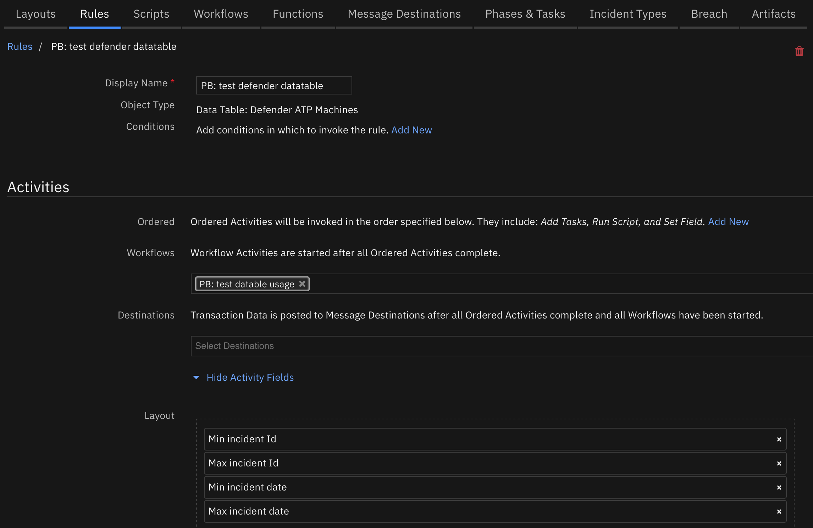
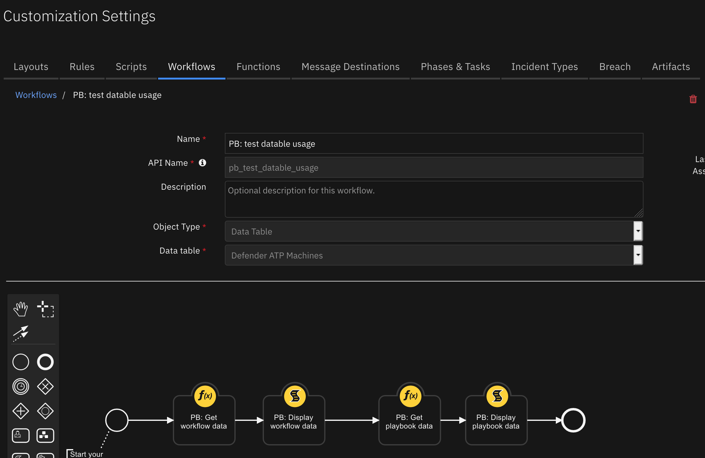
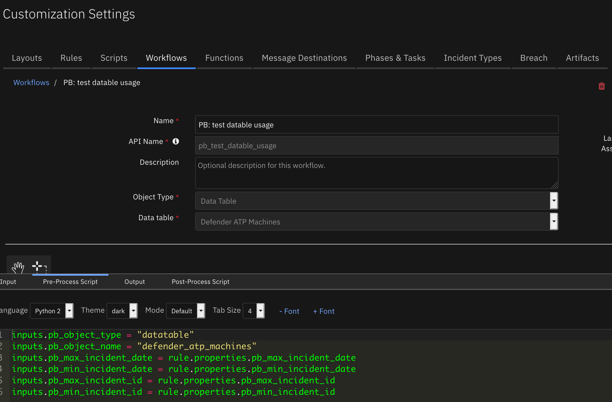
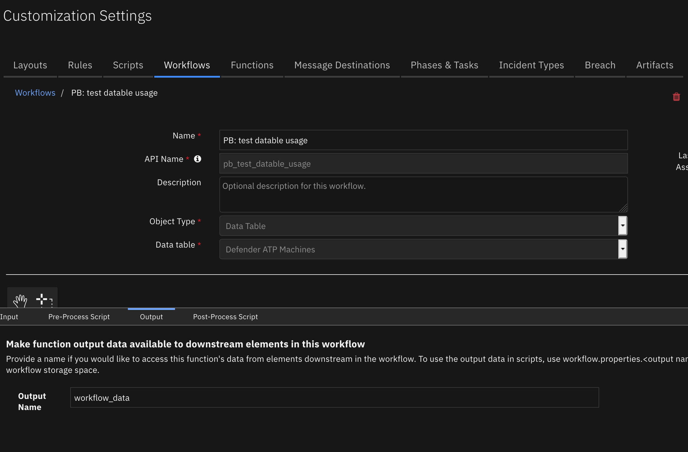

<!--
  This README.md is generated by running:
  "resilient-sdk docgen -p fn_playbook_utils"

  It is best edited using a Text Editor with a Markdown Previewer. VS Code
  is a good example. Checkout https://guides.github.com/features/mastering-markdown/
  for tips on writing with Markdown

  If you make manual edits and run docgen again, a .bak file will be created

  Store any screenshots in the "doc/screenshots" directory and reference them like:
  

  NOTE: If your app is available in the container-format only, there is no need to mention the integration server in this readme.
-->

# Playbook Utils

## Table of Contents
- [Release Notes](#release-notes)
- [Overview](#overview)
  - [Key Features](#key-features)
- [Requirements](#requirements)
  - [IBM SOAR platform](#ibm-soar-platform)
  - [Cloud Pak for Security](#cloud-pak-for-security)
  - [Proxy Server](#proxy-server)
  - [Python Environment](#python-environment)
- [Installation](#installation)
  - [Install](#install)
  - [App Configuration](#app-configuration)
  - [Custom Layouts](#custom-layouts)
- [Function - PB: Export Playbook](#function---pb-export-playbook)
- [Function - PB: Get Playbook Data](#function---pb-get-playbook-data)
- [Function - PB: Get Playbooks](#function---pb-get-playbooks)
- [Function - PB: Get Workflow Content](#function---pb-get-workflow-content)
- [Function - PB: Get Workflow Data](#function---pb-get-workflow-data)
- [Function - PB: Import Playbook](#function---pb-import-playbook)
- [Script - PB: Display playbook data](#script---pb-display-playbook-data)
- [Script - PB: Display workflow data](#script---pb-display-workflow-data)
- [Adding Usage Data for Datatables](#adding-usage-data-for-datatables)
- [Data Table - Playbook/Workflow Usage](#data-table---Playbook/Workflow-usage)
- [Playbooks](#Playbooks)
- [Troubleshooting & Support](#troubleshooting--support)
---

## Release Notes
<!--
  Specify all changes in this release. Do not remove the release
  notes of a previous release
-->
| Version | Date | Notes |
| ------- | ---- | ----- |
| 1.2.0 | 07/2023 | Example rules/workflows converted to Playbooks |
| 1.1.0 | 12/2022 | Playbook import/export |
| 1.0.1 | 09/2021 | Datatable presentation fixes |
| 1.0.0 | 08/2021 | Initial Release |

---

## Overview
<!--
  Provide a high-level description of the function itself and its remote software or application.
  The text below is parsed from the "description" and "long_description" attributes in the setup.py file
-->
This app includes functions to mine information about workflow and playbook usage across incidents so that an enterprise can learn the best practices on past threat intelligence and actions performed.

 

Resilient Circuits Components for 'fn_playbook_utils'

### Key Features
<!--
  List the Key Features of the Integration
-->
* Capture workflow usage for a given incident or a range.
* Capture workflow statistics runs over incidents, artifacts, attachments and tasks.
* Capture workflow usage for an incident which can be searchable.

---

## Requirements
<!--
  List any Requirements
-->
This app supports the IBM Resilient SOAR Platform and the IBM Cloud Pak for Security.

### IBM SOAR platform
The IBM SOAR platform supports two app deployment mechanisms, App Host and integration server.

If deploying to a IBM SOAR platform with an App Host, the requirements are:
* IBM SOAR platform >= `45.0`.
* The app is in a container-based format (available from the AppExchange as a `zip` file).

If deploying to a IBM SOAR platform with an integration server, the requirements are:
* IBM SOAR platform >= `45.0`.
* The app is in the older integration format (available from the AppExchange as a `zip` file which contains a `tar.gz` file).
* Integration server is running `resilient-circuits>=46.0.0`.
* If using an API key account, make sure the account provides the following minimum permissions:
  | Name | Permissions |
  | ---- | ----------- |
  | Org Data | Read |
  | Functions | Read |
  | Incidents | Read |
  | Workflows | Read |

  Note: If using with IBM SOAR 40.0+, add the following permission to the app's apikey to read playbook data. This is necessary when using the App Host environment:

  | Name | Permissions |
  | ---- | ----------- |
  | Playbooks | Read, Edit, Create |

The following IBM SOAR platform guides provide additional information:
* _App Host Deployment Guide_: provides installation, configuration, and troubleshooting information, including proxy server settings.
* _Integration Server Guide_: provides installation, configuration, and troubleshooting information, including proxy server settings.
* _System Administrator Guide_: provides the procedure to install, configure and deploy apps.

The above guides are available on the IBM Knowledge Center at [ibm.biz/resilient-docs](https://ibm.biz/resilient-docs). On this web page, select your IBM SOAR platform version. On the follow-on page, you can find the _App Host Deployment Guide_ or _Integration Server Guide_ by expanding **SOAR Apps** in the Table of Contents pane. The System Administrator Guide is available by expanding **System Administrator**.

### Cloud Pak for Security
If you are deploying to IBM Cloud Pak for Security, the requirements are:
* IBM Cloud Pak for Security >= 1.4.
* Cloud Pak is configured with an App Host.
* The app is in a container-based format (available from the AppExchange as a `zip` file).

The following Cloud Pak guides provide additional information:
* _App Host Deployment Guide_: provides installation, configuration, and troubleshooting information, including proxy server settings. From the Table of Contents, select Case Management and Orchestration & Automation > **Orchestration and Automation Apps**.
* _System Administrator Guide_: provides information to install, configure, and deploy apps. From the IBM Cloud Pak for Security Knowledge Center table of contents, select Case Management and Orchestration & Automation > **System administrator**.

These guides are available on the IBM Knowledge Center at [ibm.biz/cp4s-docs](https://ibm.biz/cp4s-docs). From this web page, select your IBM Cloud Pak for Security version. From the version-specific Knowledge Center page, select Case Management and Orchestration & Automation.

### Proxy Server
The app does support a proxy server but only for access back to the IBM SOAR Platform.

### Python Environment
Python 3.6 is supported. Post-processing scripts support Python 3.
Additional package dependencies may exist for each of these packages:
* cachetools
* resilient-circuits>=46.0.0

---

## Installation

### Install
* To install or uninstall an App or Integration on the IBM SOAR platform_, see the documentation at [ibm.biz/resilient-docs](https://ibm.biz/resilient-docs).
* To install or uninstall an App on _IBM Cloud Pak for Security_, see the documentation at [ibm.biz/cp4s-docs](https://ibm.biz/cp4s-docs) and follow the instructions above to navigate to Orchestration and Automation.

### App Configuration
The following table provides the settings you need to configure the app. These settings are made in the app.config file. See the documentation discussed in the Requirements section for the procedure.

| Config | Required | Example | Description |
| ------ | :------: | ------- | ----------- |
| **request_max_retries** | Yes | `1` | *The maximum number of attempts to retry a request to SOAR Platform before exiting.* |
| **request_retry_delay** | Yes | `1` | *The number of seconds to wait between repeated attempts to connect to the SOAR Platform.* |
| **request_retry_backof** | Yes | `1` | *The multiplier that is applied to delay between repeated attempts to connect to the SOAR Platform.* |
---

### Custom Layouts
<!--
  Use this section to provide guidance on where the user should add any custom fields and data tables.
  You may wish to recommend a new incident tab.
  You should save a screenshot "custom_layouts.png" in the doc/screenshots directory and reference it here
-->
* Import the 'Playbook usage' datatable to the tab of your choice. Here's an example of adding to your artifact tab:

  


---
## Functions


## Function - PB: Export Playbook
Extract a playbook in .resz format. Use either the id or name to specify the playbook to export


<details><summary>Inputs:</summary>
<p>

| Name | Type | Required | Example | Tooltip |
| ---- | :--: | :------: | ------- | ------- |
| `pbm_id` | `number` | No | `12` | Playbook Id |
| `pbm_name` | `text` | No | `Playbook Example` | Playbook Name |

</p>
</details>

<details><summary>Outputs:</summary>
<p>

> **NOTE:** This example might be in JSON format, but `results` is a Python Dictionary on the SOAR platform.

```python
results = {
  "content": {
    "contents": "UEsDBBQACAgIABOWiFUAAAAAAAAAAAAAAAAKAAAAZXhwb3J0LnJlc80Z227bOPZ9v4Lwc2TrastBNrPtJgWK7Q2TDrCLzUCgRMpmK4kaUUpiFPPve0jqRslJnXSA7Usbk+d+59G3vyG0wEnNeCEW6Bz9F/1+po7K0vzd1DzHNUuiGouv7dU3uJF3QvCE4ZqSaESpaLLsTAMkcLfj1SFiZHJD4CYSvKkSGu1xQTIqARasSBihRb0kTCT8jlZAWoIuOjSaUWAnYVOcCdodN1SBRTxNBa3ltT29agpWT+WjBY4zTa6umo4afSh5VUdf6aGVidUMZ1FdMbzrJUl5lU+oaSU7xqwQQHMwy+L6gSZNTREuUEsSaZKIp6jeU9Qrj97wpBGIF4iAtlUO4MUOriVPLAki0SR7hMU5ui0umuwS/s3YJRNABv4BBuCOBuh3FBGvtL0QznCVn6GLFcBrLMkZbF1KwQhieQm4BgASB1HTXAC1O57dUSLJZg2RMkG0ZCxRMokzBEQq+BvOW5QzRTNuBCuoEOpHTZN9ASgZ4vcFrcTZiJNSYLADEjXLAK7YcaBpyLTHAiW8SBWctCQoCMwFL+BvcDdGJReCxdkBxZQWSLpUgOQARh9SltWVjNoZSeBeUY0BnOkOiMnAvmP1wYDFAEXzMuMHSge7TMjdUXSAAAc587wpWiv1xlRM4KqseM5AtGWPvFIOfUUIKngN5Guu3SrzDyW4rJtKmV6aJtUsWiEZ1TbuwitlhfSSWKJX5EsjatO6NcU5ymkeg932rJR8tGOpgitoAj7D1QFJKneMQEBp8hhEg8DELGuFGxElVCQVK5WqQ5hkfMfAmQngV7wBEhXdNRCJ4B6R7ClpIAlBFCpjpw0awcHxSzBHXKHVpf73tvgAFjlHb1METCAttOPh/xLMWFayFPV+6T2H2NhFYC8k9rzJiAwgAVJDSBRC27TeY20kg+CdVC2hAA8xoRJaSVhWVNDqTrsVwBPQo5IegOBIAZTfg1e7clHgXFe4t61vPhvVhCuL4Wxa2EqIStpWz8V1sRuhAMddhXNdm3vyx4tVjXdG5dZH48JbZvgQc/41CgnZ+E6AozT2vMh3fD+KceBE/tbxgjVcre1NSxao3OGs0QQ+tQTQZ7xbqOs/dQdRvMTXCO55U49aC1w0TauaS9y1g0NsOX7iWX5qpxZ2vY21SdZ4s47T0I0dSbWl2ZVo1RoA31lv7MANPGfjh/YYQFfMCBqJAPtKUHd8XR/KVvp3r/7z+uPHfynNFimjGTG6YNoU81a5o9xoKIsdBHdpHpmND9wTy/iPIE0g1vGMZHefQ3LF/IFOiLVZFuGqZinEt1JgQqAFOXJDoARUbEJTu2VyxqE+a8PQQpskl7VgRx8VHEoVS7tOYBCTXbwCmcxTFdjmNHFSMzZzwOy4fRKYQLyCHFdR0mUOtNTpJPB/zpA+ESixA4962HLJmlj+hjpW6Pq2Ffo+JVuP+OHWGydCJ9VkMJOlT/liCPEcF1DBO6NA7ashTORNr3B7Ns4Wp9fjIVfFaXHxC/yFWpC/3y6cpX27gAqacFnp4eC3z2+s8Hbxy+UFoakqRxARCJAKAbf7ui7PV6v7+/slz3dLXu1WoqTJ6vWn9x9Wru3YkMf+6v3Hq+t3QFZhncdlDh3oZOSrtz0mQJHkCcSrqxHaPw20p/gZaAM3KP4sY2DBAbU/WrI4X0K7X0lleowHQUw2957i4tq2s/r3+3c30BxzPAJnJ4BbcvLE0LAAr8bVjtYfIDEEzHXUxE4wzCUEKxIwaNS3i8sL1cdgVGNSsGeFPHBjQs+4Mo8BXWYxnMq0fD4xCB8YgnMwnYpjGAFAqaq+vpNThpLupv8dOUGAxUMusaCYqXHx8g004Mj+gxRhuL1Y9ccXq4HO5UUDHfyznKsUxd/aX5EziG32a8mBPkCWyOi/zqiUT1xe9G4+759Liuq4R3/Q9MwGDXxk6sP5KR3wdgFmWB3hD1UfpsiZ0v3x1CoJhXrSGFbpLAF2VgPcYJWb/nfkDnb59PocXTEhvYo616rJ+7sm0vQ7vVNMYjt1PUvGhOXb7tbCge1aQeAmSRy4nm27p+rdqfWY3s5+E7h0M9ZbC3Op/4PY0D+7P1qD0D8aOQBKGtokY3ZgEv2O/ZWm0xjS6acvTDOCQrQgo2i+LsgnEKmOPMAbjGUkgQaDpw3ASTOb6vfaDeqvOh6PKtEiTZSYuHysxljO1eO20SE4JXskYw3iY+NJl7fVCMZ/1QLOZaG/gryBnNLMRgcSxwCEflvAYw4O2oB5SUXrmChiMxbXZDflMAmNWbhEhKkyJVvM+T0+KGeiB4DauNLWB1kLfB0hTwNtQ22kiTwnCTi4fRYKpwjohScI6Pv+ywUcAmgWVKcI6Dib7wvoBCdY8GaPy6mERo5POsdIuuT8tRzmBdpTtttLxBAsgu4ZqfeS/XYtOzv8tXb9J0RSEnxXpknKzir3j8l1LNhOk8uoa5NK96RMgTuWyXOXrhNugk6yYP1ElJ1osWPV6JHJ4hmShpvlWFA3bAVdB0rOkVDvcEyzx4jaI5pbu6PmdGrD9DlTu6V3xBKraVk0j9oKCoejkf2yfaN0D4aKyi3q+MXtBWHob7aOOwbhVVRW8hVa6m1G/7ogelgYVhW/dk0O3RwEJtCxhleTfg2F/e8eCf+DPuC8zKgcpgf4/pUjxxhTcELlPkj6vNujvOQltxgttgy19IZB0a1hQhlEGr2w5DvTlGlqixulE+qeiIvjj1+hoKJyAqXWFeqh96Pv1Xbz0T8aey3nHwqeo8dckxc+pofFzLfOltoF4+8Po/1Ze5k0AqbyaMCeg8z2F3OQe159TaEPHbmeft6QD3NcTdYwi2jw3MiGctFIq7rdy3QWVx9Pikhn3YxheyuXMRU/HLtWAu9567D2fDCZjuWZP4ctyO9GarWZ44bmae/2F7qz33rA88bxME3gtZPElp+EBB4BYWJRhwRpiG2SuJ6Z1XssIrlVTuApRauKV1OvtD5xnW7rw0T0yNcjJkklX+cXGRZ1lHMCkUHJT1bWTNlqlptlOQw23VpMbfOiYx5vd0KRoLXavM9Svt0hQSkjrM+McYgaF6OoUWx38qNhpwHOssUsDO8YvY+Y/B4yDtROxd46j9Q9Hn+hyWiJ2+0+u3t46NeN/vZGKpzWo2340y78NA1nS4azJcPZkuFsHQ/nNuICe+7fFyZIr1o5K6h97mxcmgbUsS0vDreWT4hnxa5HrTghW9sNA5qsYzN0Zlk+8IH+j5ust1TP5BmGWIzWh95oU6k/+dRtpvaL4Ipn5p56HqgL+ZmFVuO9ZLvnjBsGna9o5DcsebwJt9s+tL9wdeYH3Qkr9Ik9F3ThB0t7KdHVclVxna6E2xGIGHkWuOFk/PkpqsNfEtJ/RdOeJsWkbsWHn8Jc3ymm600fVj+U0Y/m8zOzeR6/zijRpPhpJVe+RqLNPggZ88z4UK2K+4r85/8AUEsHCFnhbpsNCgAAKiIAAFBLAQIUABQACAgIABOWiFVZ4W6bDQoAACoiAAAKAAAAAAAAAAAAAAAAAAAAAABleHBvcnQucmVzUEsFBgAAAAABAAEAOAAAAEUKAAAAAA=="
  },
  "inputs": {
    "pbm_id": null,
    "pbm_name": "Sample Playbook"
  },
  "metrics": {
    "execution_time_ms": 1403,
    "host": "localhost",
    "package": "fn-playbook-utils",
    "package_version": "1.1.0",
    "timestamp": "2022-12-08 13:48:38",
    "version": "1.0"
  },
  "raw": null,
  "reason": null,
  "success": true,
  "version": 2.0
}
```

</p>
</details>


---

### Function - PB: Get workflow data
Get information on workflows run on a given incident or for a range of incidents. The results populate the 'Playbook usage' datatable.

 

 This function is used in several rules and workflows:
 | Rule | Level | Note |
 | ---: | ----: | :--- |
 | PB: Get workflow/playbook usage at incident close | Incident | `Enable` this rule if you want to capture workflow and playbook stats when an incident closes. |
 | PB: Get workflows/playbooks by artifact value for last 30 days | Artifact | `Enable` this rule if you want to review workflows and playbooks for a given artifact over the last 30 days |
 | PB: Get workflow/playbook frequency | Incident | List the frequency of workflows and playbooks used at the incident, artifact, attachment and task level. |
 | PB: Get workflows/playbooks by artifact value | Artifact | Get all workflows and playbooks run on a given artifact |
 | PB: Get workflows/playbooks by attachment name | Attachment | Get all workflows and playbooks run on a given attachment |
 | PB: Get workflows/playbooks by task name | Task | Get all workflows and playbooks run on a given task |
 | PB: Get workflow/playbooks usage | Incident | Get all workflows and playbooks run across the range of incidents specified. |

 NOTE: This function makes a workflow API call for every incident the analysis is performed on. If you have a large number of incidents, it's best to limit the range of incidents specified to reduce performance and the API counts incurred.

<details><summary>Inputs:</summary>
<p>

| Name | Type | Required | Example | Tooltip |
| ---- | :--: | :------: | ------- | ------- |
| `pb_min_incident_id` | `number` | No | `-` | Min incident to review. If None, the IBM SOAR platform min incident is used or `pb_min_incident_data`. |
| `pb_max_incident_id` | `number` | No | `-` | Max incident to review. If None, the IBM SOAR platform max incident is used or `pb_max_incident_data`. |
| `pb_min_incident_data` | `number` | `-` | Timestamp (in milliseonds) of minimum incident to use. |
| `pb_max_incident_data` | `number` | `-` | Timestamp (in milliseonds) of maximum incident to use. |
| `pb_object_type` | `string` | `-` | type of object which the analysis is performed: 'artifact', 'attachment' and 'task'. |
| `pb_object_name` | `string` | `-` | name of object which the analysis is performed. |

Notes:
* pb_min_incident_data and pb_max_incient_data are in GMT time and comparisons to an incident's create date are also performed using GMT timestamps.

</p>
</details>

<details><summary>Outputs:</summary>
<p>

```python
results = {
  'version': 2.0,
  'success': True,
  'reason': None,
  'content': {
    'org_id': 201,
    'workflow_content': {
      2100: {
        'entities': [ ]
      },
      2101: {
        'entities': [
          {
            'workflow_instance_id': 44,
            'workflow': {
              'workflow_id': 36,
              'name': 'Create a Remedy Incident from Task',
              'programmatic_name': 'create_a_remedy_incident_from_task',
              'object_type': 1,
              'description': None,
              'uuid': None,
              'actions': [

              ],
              'tags': [
                {
                  'tag_handle': 1,
                  'value': None
                }
              ]
            },
            'status': 'completed',
            'start_date': 1620136029037,
            'end_date': 1620136030991,
            'object': {
              'parent': {
                'parent': None,
                'object_id': 2101,
                'object_name': 'Kakfa Incident - incident shreya',
                'type_id': 0,
                'type_name': 'incident'
              },
              'object_id': 154,
              'object_name': 'Notify internal management chain (resolution)',
              'type_id': 1,
              'type_name': 'task'
            },
            'terminator': {
              'id': 0,
              'type': 'system',
              'name': 'System User',
              'display_name': 'System User'
            }
          },
          {
            'workflow_instance_id': 43,
            'workflow': {
              'workflow_id': 36,
              'name': 'Create a Remedy Incident from Task',
              'programmatic_name': 'create_a_remedy_incident_from_task',
              'object_type': 1,
              'description': None,
              'uuid': None,
              'actions': [

              ],
              'tags': [
                {
                  'tag_handle': 1,
                  'value': None
                }
              ]
            },
            'status': 'completed',
            'start_date': 1620135639049,
            'end_date': 1620135756543,
            'object': {
              'parent': {
                'parent': None,
                'object_id': 2101,
                'object_name': 'Kakfa Incident - incident shreya',
                'type_id': 0,
                'type_name': 'incident'
              },
              'object_id': 203,
              'object_name': 'remedy',
              'type_id': 1,
              'type_name': 'task'
            },
            'terminator': {
              'id': 0,
              'type': 'system',
              'name': 'System User',
              'display_name': 'System User'
            }
          }
        ]
      }
    }
  },
  'raw': None,
  'inputs': {
    'pb_min_incident_id': 2100,
    'pb_max_incident_id': 2111
  },
  'metrics': {
    'version': '1.0',
    'package': 'fn-playbook-utils',
    'package_version': '1.0.0',
    'host': 'Marks-MacBook-Pro.local',
    'execution_time_ms': 141,
    'timestamp': '2021-07-22 11:06:22'
  }
}
```

</p>
</details>

<details><summary>Example Pre-Process Script:</summary>
<p>

```python
inputs.pb_max_incident_id = rule.properties.pb_max_incident_id
inputs.pb_min_incident_id = rule.properties.pb_min_incident_id
```

</p>
</details>

<details><summary>Example Post-Process Script:</summary>
<p>

See the `PB: Display workflow data` script.

</p>
</details>

---

### Function - PB: Get playbook data
Get information on playbooks run on a given incident or for a range of incidents. The results populate the 'Playbook usage' datatable.

 

 This function is used in several rules and workflows:
 | Rule | Level | Note |
 | ---: | ----: | :--- |
 | PB: Get workflow/playbook usage at incident close | Incident | `Enable` this rule if you want to capture workflow and playbook stats when an incident closes. |
 | PB: Get workflows/playbooks by artifact value for last 30 days | Artifact | `Enable` this rule if you want to review workflows and playbooks for a given artifact over the last 30 days |
 | PB: Get workflow/playbook frequency | Incident | List the frequency of workflows and playbooks used at the incident, artifact, attachment and task level. |
 | PB: Get workflows/playbooks by artifact value | Artifact | Get all workflows and playbooks run on a given artifact |
 | PB: Get workflows/playbooks by attachment name | Attachment | Get all workflows and playbooks run on a given attachment |
 | PB: Get workflows/playbooks by task name | Task | Get all workflows and playbooks run on a given task |
 | PB: Get workflow/playbooks usage | Incident | Get all workflows and playbooks run across the range of incidents specified. |

 NOTE: This function makes a simple API call for all incidents which the analysis is performed on.

<details><summary>Inputs:</summary>
<p>

| Name | Type | Required | Example | Tooltip |
| ---- | :--: | :------: | ------- | ------- |
| `pb_min_incident_id` | `number` | No | `-` | Min incident to review. If None, the IBM SOAR platform min incident is used or `pb_min_incident_data`. |
| `pb_max_incident_id` | `number` | No | `-` | Max incident to review. If None, the IBM SOAR platform max incident is used or `pb_max_incident_data`. |
| `pb_min_incident_data` | `number` | `-` | Timestamp (in milliseonds) of minimum incident to use. |
| `pb_max_incident_data` | `number` | `-` | Timestamp (in milliseonds) of maximum incident to use. |
| `pb_object_type` | `string` | `-` | type of object which the analysis is performed: 'artifact', 'attachment' and 'task'. |
| `pb_object_name` | `string` | `-` | name of object which the analysis is performed. |


</p>
</details>

<details><summary>Outputs:</summary>
<p>

```python
results = {
  'version': 2.0,
  'success': True,
  'reason': None,
  'content': {
    'org_id': 201,
    'min_id': 2095,
    'max_id': 2140,
    'playbook_content': {
      2140: [
        {
          'id': 2,
          'playbook': {
            'id': 1,
            'display_name': 'my first playbook',
            'activation_type': 'automatic',
            'description': None,
            'creator_principal': {
              'id': 3,
              'type': 'user',
              'name': 'a@example.com',
              'display_name': 'Resilient Sysadmin'
            },
            'is_deleted': False,
            'version': 5
          },
          'start_time': 1627504677387,
          'last_activity_time': 1628089162522,
          'last_activity_by': {
            'id': 3,
            'type': 'user',
            'name': 'a@example.com',
            'display_name': 'Resilient Sysadmin'
          },
          'elapsed_time': 584485135,
          'status': 'canceled',
          'object': {
            'parent': None,
            'object_id': 2140,
            'object_name': '2nd inc',
            'type_id': 0,
            'type_name': 'incident'
          },
          'object_is_deleted': False,
          'incident_id': 2140,
          'detail_msg': 'd'
        },
        {
          'id': 3,
          'playbook': {
            'id': 2,
            'display_name': 'playbook for task',
            'activation_type': 'automatic',
            'description': None,
            'creator_principal': {
              'id': 3,
              'type': 'user',
              'name': 'a@example.com',
              'display_name': 'Resilient Sysadmin'
            },
            'is_deleted': False,
            'version': 4
          },
          'start_time': 1628088276589,
          'last_activity_time': 1628088276613,
          'last_activity_by': {
            'id': 3,
            'type': 'user',
            'name': 'a@example.com',
            'display_name': 'Resilient Sysadmin'
          },
          'elapsed_time': 24,
          'status': 'completed',
          'object': {
            'parent': {
              'parent': None,
              'object_id': 2140,
              'object_name': None,
              'type_id': 0,
              'type_name': None
            },
            'object_id': 102,
            'object_name': 'Investigate x',
            'type_id': 1,
            'type_name': 'task'
          },
          'object_is_deleted': False,
          'incident_id': 2140,
          'detail_msg': None
        }
      ]
    }
  },
  'raw': None,
  'inputs': {
    'pb_object_type': 'task',
    'pb_max_incident_id': None,
    'pb_min_incident_date': None,
    'pb_object_name': 'Investigate x',
    'pb_max_incident_date': None,
    'pb_min_incident_id': None
  },
  'metrics': {
    'version': '1.0',
    'package': 'fn-playbook-utils',
    'package_version': '1.0.0',
    'host': 'Marks-MacBook-Pro.local',
    'execution_time_ms': 84,
    'timestamp': '2021-08-04 12:55:28'
  }
}
```

</p>
</details>

<details><summary>Example Pre-Process Script:</summary>
<p>

```python
inputs.pb_max_incident_id = rule.properties.pb_max_incident_id
inputs.pb_min_incident_id = rule.properties.pb_min_incident_id
```

</p>
</details>

<details><summary>Example Post-Process Script:</summary>
<p>

See the `PB: Display playbook data` script.

</p>
</details>

---
## Function - PB: Get Playbooks
Get playbooks which match the type and optionally name criteria


<details><summary>Inputs:</summary>
<p>

| Name | Type | Required | Example | Tooltip |
| ---- | :--: | :------: | ------- | ------- |
| `pbm_name_contains` | `text` | No | `-` | portion of playbook name to use as filter. Do not specify wildcards |
| `pbm_type` | `select` | Yes | `-` | all, enabled, disabled, draft |

</p>
</details>

<details><summary>Outputs:</summary>
<p>

> **NOTE:** This example might be in JSON format, but `results` is a Python Dictionary on the SOAR platform.

```python
results = {
  "content": {
    "data": [
      {
        "activation_type": "manual",
        "content": {
          "content_version": 3,
          "xml": "\u003c?xml version=\"1.0\" encoding=\"UTF-8\"?\u003e\u003cdefinitions xmlns=\"http://www.omg.org/spec/BPMN/20100524/MODEL\" xmlns:bpmndi=\"http://www.omg.org/spec/BPMN/20100524/DI\" xmlns:omgdc=\"http://www.omg.org/spec/DD/20100524/DC\" xmlns:omgdi=\"http://www.omg.org/spec/DD/20100524/DI\" xmlns:resilient=\"http://resilient.ibm.com/bpmn\" xmlns:xsd=\"http://www.w3.org/2001/XMLSchema\" xmlns:xsi=\"http://www.w3.org/2001/XMLSchema-instance\" targetNamespace=\"http://www.camunda.org/test\"\u003e\u003cprocess id=\"playbook_9d1969c7_8f69_494d_b720_f09a9e37d125\" isExecutable=\"true\" name=\"playbook_9d1969c7_8f69_494d_b720_f09a9e37d125\"\u003e\u003cdocumentation/\u003e\u003cstartEvent id=\"StartEvent_aqhlb25\"\u003e\u003coutgoing\u003eFlow_9af41ea\u003c/outgoing\u003e\u003c/startEvent\u003e\u003cserviceTask id=\"ServiceTask_1\" name=\"Outbound Email: Send Email\" resilient:type=\"function\"\u003e\u003cextensionElements\u003e\u003cresilient:function uuid=\"c80cd55d-6ab8-4673-8273-1b8a0bf3b456\"\u003e{ \"inputs\": {}, \"pre_processing_script\": \"\\n# (text) Required: No comma separated list of incident attachments \\ninputs.mail_attachments= playbook.inputs.mail_attachments\\n\\n# (text) Required: No  \\ninputs.mail_bcc= playbook.inputs.mail_bcc\\n\\n# (text) Required: No  \\ninputs.mail_body_html= playbook.inputs.mail_body_html\\n\\n# (text) Required: No  \\ninputs.mail_body_text= playbook.inputs.mail_body_text\\n\\n# (text) Required: No  \\ninputs.mail_cc= playbook.inputs.mail_cc\\n\\n# (text) Required: No  \\ninputs.mail_from= playbook.inputs.mail_from\\n\\n# (number) Required: No  \\ninputs.mail_incident_id= playbook.inputs.mail_incident_id\\n\\n# (text) Required: No  \\ninputs.mail_subject= playbook.inputs.mail_subject\\n\\n# (text) Required: No  \\ninputs.mail_to= playbook.inputs.mail_to\\n\", \"pre_processing_script_language\": \"python3\", \"result_name\": \"send_email\" }\u003c/resilient:function\u003e\u003c/extensionElements\u003e\u003cincoming\u003eFlow_9af41ea\u003c/incoming\u003e\u003coutgoing\u003eFlow_6b7udwv\u003c/outgoing\u003e\u003c/serviceTask\u003e\u003cscriptTask id=\"ScriptTask_2\" name=\"parse results for send_email\"\u003e\u003cextensionElements\u003e\u003cresilient:script uuid=\"f4241202-77bb-4bd9-bd7e-2081b9f668d8\"/\u003e\u003c/extensionElements\u003e\u003cincoming\u003eFlow_6b7udwv\u003c/incoming\u003e\u003coutgoing\u003eFlow_y10ymbl\u003c/outgoing\u003e\u003cscript\u003escript\u003c/script\u003e\u003c/scriptTask\u003e\u003cendEvent id=\"EndPoint_3\" resilient:documentation=\"End point\"\u003e\u003cincoming\u003eFlow_y10ymbl\u003c/incoming\u003e\u003c/endEvent\u003e\u003csequenceFlow id=\"Flow_9af41ea\" sourceRef=\"StartEvent_aqhlb25\" targetRef=\"ServiceTask_1\"/\u003e\u003csequenceFlow id=\"Flow_6b7udwv\" sourceRef=\"ServiceTask_1\" targetRef=\"ScriptTask_2\"/\u003e\u003csequenceFlow id=\"Flow_y10ymbl\" sourceRef=\"ScriptTask_2\" targetRef=\"EndPoint_3\"/\u003e\u003c/process\u003e\u003cbpmndi:BPMNDiagram id=\"BPMNDiagram_1\"\u003e\u003cbpmndi:BPMNPlane bpmnElement=\"playbook_9d1969c7_8f69_494d_b720_f09a9e37d125\" id=\"BPMNPlane_1\"\u003e\u003cbpmndi:BPMNEdge bpmnElement=\"Flow_y10ymbl\" id=\"Flow_y10ymbl_di\"\u003e\u003comgdi:waypoint x=\"721\" y=\"362\"/\u003e\u003comgdi:waypoint x=\"721\" y=\"404\"/\u003e\u003c/bpmndi:BPMNEdge\u003e\u003cbpmndi:BPMNEdge bpmnElement=\"Flow_6b7udwv\" id=\"Flow_6b7udwv_di\"\u003e\u003comgdi:waypoint x=\"721\" y=\"232\"/\u003e\u003comgdi:waypoint x=\"721\" y=\"278\"/\u003e\u003c/bpmndi:BPMNEdge\u003e\u003cbpmndi:BPMNEdge bpmnElement=\"Flow_9af41ea\" id=\"Flow_9af41ea_di\"\u003e\u003comgdi:waypoint x=\"721\" y=\"117\"/\u003e\u003comgdi:waypoint x=\"721\" y=\"148\"/\u003e\u003c/bpmndi:BPMNEdge\u003e\u003cbpmndi:BPMNShape bpmnElement=\"StartEvent_aqhlb25\" id=\"StartEvent_aqhlb25_di\"\u003e\u003comgdc:Bounds height=\"52\" width=\"187.083\" x=\"627\" y=\"65\"/\u003e\u003cbpmndi:BPMNLabel\u003e\u003comgdc:Bounds height=\"0\" width=\"90\" x=\"616\" y=\"100\"/\u003e\u003c/bpmndi:BPMNLabel\u003e\u003c/bpmndi:BPMNShape\u003e\u003cbpmndi:BPMNShape bpmnElement=\"ServiceTask_1\" id=\"ServiceTask_1_di\"\u003e\u003comgdc:Bounds height=\"84\" width=\"196\" x=\"623\" y=\"148\"/\u003e\u003c/bpmndi:BPMNShape\u003e\u003cbpmndi:BPMNShape bpmnElement=\"ScriptTask_2\" id=\"ScriptTask_2_di\"\u003e\u003comgdc:Bounds height=\"84\" width=\"196\" x=\"623\" y=\"278\"/\u003e\u003c/bpmndi:BPMNShape\u003e\u003cbpmndi:BPMNShape bpmnElement=\"EndPoint_3\" id=\"EndPoint_3_di\"\u003e\u003comgdc:Bounds height=\"52\" width=\"132.15\" x=\"655\" y=\"404\"/\u003e\u003c/bpmndi:BPMNShape\u003e\u003c/bpmndi:BPMNPlane\u003e\u003c/bpmndi:BPMNDiagram\u003e\u003c/definitions\u003e"
        },
        "create_date": 1654449209109,
        "creator_principal": {
          "display_name": "Resilient Sysadmin",
          "id": 8,
          "name": "a@example.com",
          "type": "user"
        },
        "deployment_id": "playbook_9d1969c7_8f69_494d_b720_f09a9e37d125",
        "description": "function, script and playbook inputs",
        "display_name": "test for send_email",
        "field_type_handle": 1025,
        "has_logical_errors": false,
        "id": 24,
        "is_deleted": false,
        "is_locked": false,
        "last_modified_principal": {
          "display_name": "Resilient Sysadmin",
          "id": 8,
          "name": "a@example.com",
          "type": "user"
        },
        "last_modified_time": 1654449307735,
        "manual_settings": {
          "activation_conditions": {
            "conditions": [],
            "logic_type": "all"
          },
          "view_items": [
            {
              "content": "5d85c5e9-2af5-71c9-d717-db5f6228a066",
              "element": "field_uuid",
              "field_type": "playbook_9d1969c7_8f69_494d_b720_f09a9e37d125",
              "show_if": null,
              "show_link_header": false,
              "step_label": null
            },
            {
              "content": "fdadb5a8-83b1-323a-dd20-49a2a269271a",
              "element": "field_uuid",
              "field_type": "playbook_9d1969c7_8f69_494d_b720_f09a9e37d125",
              "show_if": null,
              "show_link_header": false,
              "step_label": null
            },
            {
              "content": "bf7fe476-8927-b5a1-b211-bc5a499d6ae2",
              "element": "field_uuid",
              "field_type": "playbook_9d1969c7_8f69_494d_b720_f09a9e37d125",
              "show_if": null,
              "show_link_header": false,
              "step_label": null
            },
            {
              "content": "c79839fc-8c4e-5438-02c4-1367e54d71eb",
              "element": "field_uuid",
              "field_type": "playbook_9d1969c7_8f69_494d_b720_f09a9e37d125",
              "show_if": null,
              "show_link_header": false,
              "step_label": null
            },
            {
              "content": "52c2ba8d-2253-3d2e-35eb-8e2aaa7770fb",
              "element": "field_uuid",
              "field_type": "playbook_9d1969c7_8f69_494d_b720_f09a9e37d125",
              "show_if": null,
              "show_link_header": false,
              "step_label": null
            },
            {
              "content": "b77de9b4-242a-62b1-8c2c-663b833f6fc0",
              "element": "field_uuid",
              "field_type": "playbook_9d1969c7_8f69_494d_b720_f09a9e37d125",
              "show_if": null,
              "show_link_header": false,
              "step_label": null
            },
            {
              "content": "b86e3a85-46d2-82f6-63b8-adb5d27282c0",
              "element": "field_uuid",
              "field_type": "playbook_9d1969c7_8f69_494d_b720_f09a9e37d125",
              "show_if": null,
              "show_link_header": false,
              "step_label": null
            },
            {
              "content": "1b769c6a-25e4-40c2-b733-c1c063ec9b69",
              "element": "field_uuid",
              "field_type": "playbook_9d1969c7_8f69_494d_b720_f09a9e37d125",
              "show_if": null,
              "show_link_header": false,
              "step_label": null
            },
            {
              "content": "52b41acc-5968-a9c6-6576-7e639ad8ffb3",
              "element": "field_uuid",
              "field_type": "playbook_9d1969c7_8f69_494d_b720_f09a9e37d125",
              "show_if": null,
              "show_link_header": false,
              "step_label": null
            }
          ]
        },
        "name": "test_for_send_email",
        "object_type": 0,
        "status": "enabled",
        "tag": {
          "display_name": "Playbook_9d1969c7-8f69-494d-b720-f09a9e37d125",
          "id": 27,
          "name": "playbook_9d1969c7_8f69_494d_b720_f09a9e37d125",
          "type": "playbook",
          "uuid": "098f6bcd-4621-d373-cade-4e832627b4f6"
        },
        "tags": [],
        "type": "default",
        "uuid": "9d1969c7-8f69-494d-b720-f09a9e37d125",
        "version": 7
      },
      {
        "activation_type": "manual",
        "content": {
          "content_version": 2,
          "xml": "\u003c?xml version=\"1.0\" encoding=\"UTF-8\"?\u003e\u003cdefinitions xmlns=\"http://www.omg.org/spec/BPMN/20100524/MODEL\" xmlns:bpmndi=\"http://www.omg.org/spec/BPMN/20100524/DI\" xmlns:omgdc=\"http://www.omg.org/spec/DD/20100524/DC\" xmlns:omgdi=\"http://www.omg.org/spec/DD/20100524/DI\" xmlns:resilient=\"http://resilient.ibm.com/bpmn\" xmlns:xsd=\"http://www.w3.org/2001/XMLSchema\" xmlns:xsi=\"http://www.w3.org/2001/XMLSchema-instance\" targetNamespace=\"http://www.camunda.org/test\"\u003e  \u003cprocess id=\"playbook_3072ad5a_2848_4c47_9667_acc5c44e941d\" isExecutable=\"true\" name=\"playbook_3072ad5a_2848_4c47_9667_acc5c44e941d\"\u003e   \u003cdocumentation/\u003e      \u003cstartEvent id=\"StartEvent_xkqtume\"\u003e      \u003coutgoing\u003eFlow_qgvwubw\u003c/outgoing\u003e     \u003c/startEvent\u003e    \u003cserviceTask id=\"ServiceTask_1\" name=\"Absolute Resilience: List Devices By Local Ip\" resilient:type=\"function\"\u003e     \u003cextensionElements\u003e      \u003cresilient:function uuid=\"ee70ea8c-7b54-4fbb-8344-16bd57d07f5f\"\u003e{ \"inputs\": {}, \"pre_processing_script\": \"\\n# (text) Required: Yes Get basic info for active devices. By default  locaIp \\ninputs.absolute_resilience_local_ip= playbook.inputs.absolute_resilience_local_ip\\n\\n# (text) Required: No Sorts the resulting list according to the properties that you provide  \\ninputs.absolute_resilience_order= playbook.inputs.absolute_resilience_order\\n\\n# (select) Required: No Use ASC or DESC to specify whether the values in the specified column should be sorted in ascending or descending order Values: asc, desc\\ninputs.absolute_resilience_order_by_value= playbook.inputs.absolute_resilience_order_by_value\\n\\n# (number) Required: No Excludes the number of specified results from the search  provided by value  \\ninputs.absolute_resilience_skip= playbook.inputs.absolute_resilience_skip\\n\\n# (number) Required: No Returns the first \u0026lt;n\u0026gt; elements from the search, where \u0026lt;n\u0026gt; is an integer that is equal to zero or greater \\ninputs.absolute_resilience_top= playbook.inputs.absolute_resilience_top\\n\", \"pre_processing_script_language\": \"python3\", \"result_name\": \"absolute_resilience_list_devices_by_local_ip\" }\u003c/resilient:function\u003e     \u003c/extensionElements\u003e     \u003cincoming\u003eFlow_qgvwubw\u003c/incoming\u003e     \u003coutgoing\u003eFlow_hbegkz1\u003c/outgoing\u003e    \u003c/serviceTask\u003e    \u003cscriptTask id=\"ScriptTask_2\" name=\"parse results for Absolute Resilience: List Devices By Local Ip\"\u003e     \u003cextensionElements\u003e      \u003cresilient:script uuid=\"d1419415-9a05-41d9-a849-77d4a35822f0\"/\u003e     \u003c/extensionElements\u003e     \u003cincoming\u003eFlow_hbegkz1\u003c/incoming\u003e     \u003coutgoing\u003eFlow_gvkozkt\u003c/outgoing\u003e     \u003cscript\u003escript\u003c/script\u003e    \u003c/scriptTask\u003e    \u003csequenceFlow id=\"Flow_qgvwubw\" sourceRef=\"StartEvent_xkqtume\" targetRef=\"ServiceTask_1\"/\u003e    \u003csequenceFlow id=\"Flow_hbegkz1\" sourceRef=\"ServiceTask_1\" targetRef=\"ScriptTask_2\"/\u003e       \u003cendEvent id=\"EndPoint_3\" resilient:documentation=\"End point\"\u003e    \u003cincoming\u003eFlow_gvkozkt\u003c/incoming\u003e   \u003c/endEvent\u003e   \u003csequenceFlow id=\"Flow_gvkozkt\" sourceRef=\"ScriptTask_2\" targetRef=\"EndPoint_3\"/\u003e  \u003c/process\u003e  \u003cbpmndi:BPMNDiagram id=\"BPMNDiagram_1\"\u003e   \u003cbpmndi:BPMNPlane bpmnElement=\"playbook_3072ad5a_2848_4c47_9667_acc5c44e941d\" id=\"BPMNPlane_1\"\u003e                \u003cbpmndi:BPMNShape bpmnElement=\"StartEvent_xkqtume\" id=\"StartEvent_xkqtume_di\"\u003e     \u003comgdc:Bounds height=\"52\" width=\"187.083\" x=\"627\" y=\"75\"/\u003e     \u003cbpmndi:BPMNLabel\u003e      \u003comgdc:Bounds height=\"0\" width=\"90\" x=\"616\" y=\"100\"/\u003e     \u003c/bpmndi:BPMNLabel\u003e    \u003c/bpmndi:BPMNShape\u003e         \u003cbpmndi:BPMNEdge bpmnElement=\"Flow_qgvwubw\" id=\"Flow_qgvwubw_di\"\u003e      \u003comgdi:waypoint x=\"721\" y=\"130\"/\u003e      \u003comgdi:waypoint x=\"721\" y=\"176\"/\u003e     \u003c/bpmndi:BPMNEdge\u003e     \u003cbpmndi:BPMNShape bpmnElement=\"ServiceTask_1\" id=\"ServiceTask_1_di\"\u003e      \u003comgdc:Bounds height=\"84\" width=\"196\" x=\"623\" y=\"176\"/\u003e     \u003c/bpmndi:BPMNShape\u003e          \u003cbpmndi:BPMNEdge bpmnElement=\"Flow_hbegkz1\" id=\"Flow_hbegkz1_di\"\u003e      \u003comgdi:waypoint x=\"721\" y=\"260\"/\u003e      \u003comgdi:waypoint x=\"721\" y=\"306\"/\u003e     \u003c/bpmndi:BPMNEdge\u003e     \u003cbpmndi:BPMNShape bpmnElement=\"ScriptTask_2\" id=\"ScriptTask_2_di\"\u003e      \u003comgdc:Bounds height=\"84\" width=\"196\" x=\"623\" y=\"306\"/\u003e     \u003c/bpmndi:BPMNShape\u003e        \u003cbpmndi:BPMNEdge bpmnElement=\"Flow_gvkozkt\" id=\"Flow_gvkozkt_di\"\u003e     \u003comgdi:waypoint x=\"721\" y=\"390\"/\u003e     \u003comgdi:waypoint x=\"721\" y=\"432\"/\u003e    \u003c/bpmndi:BPMNEdge\u003e    \u003cbpmndi:BPMNShape bpmnElement=\"EndPoint_3\" id=\"EndPoint_3_di\"\u003e     \u003comgdc:Bounds height=\"52\" width=\"132.15\" x=\"655\" y=\"432\"/\u003e    \u003c/bpmndi:BPMNShape\u003e   \u003c/bpmndi:BPMNPlane\u003e  \u003c/bpmndi:BPMNDiagram\u003e \u003c/definitions\u003e"
        },
        "create_date": 1654784513368,
        "creator_principal": {
          "display_name": "Playbook Maker",
          "id": 9,
          "name": "99185ba4-5ba8-45a5-880d-c0bb86dc6104",
          "type": "apikey"
        },
        "deployment_id": "playbook_3072ad5a_2848_4c47_9667_acc5c44e941d",
        "description": "function, script and playbook inputs",
        "display_name": "sb01 for absolute_resilience_list_devices_by_local_ip",
        "field_type_handle": 1077,
        "id": 75,
        "is_deleted": false,
        "is_locked": false,
        "last_modified_principal": {
          "display_name": "Resilient Sysadmin",
          "id": 8,
          "name": "a@example.com",
          "type": "user"
        },
        "last_modified_time": 1654784551755,
        "manual_settings": {
          "activation_conditions": {
            "conditions": [],
            "logic_type": "all"
          },
          "view_items": [
            {
              "content": "850e0b0b-a069-f9d2-6a2d-9ba82fd36919",
              "element": "field_uuid",
              "field_type": "playbook_3072ad5a_2848_4c47_9667_acc5c44e941d",
              "show_if": null,
              "show_link_header": false,
              "step_label": null
            },
            {
              "content": "5da9bceb-0e50-7c10-d42a-7d51bd774f20",
              "element": "field_uuid",
              "field_type": "playbook_3072ad5a_2848_4c47_9667_acc5c44e941d",
              "show_if": null,
              "show_link_header": false,
              "step_label": null
            },
            {
              "content": "7707565e-3191-bde8-dff2-8bea5e5453c4",
              "element": "field_uuid",
              "field_type": "playbook_3072ad5a_2848_4c47_9667_acc5c44e941d",
              "show_if": null,
              "show_link_header": false,
              "step_label": null
            },
            {
              "content": "fd046ede-e5b1-37da-bb05-a776161a9ff8",
              "element": "field_uuid",
              "field_type": "playbook_3072ad5a_2848_4c47_9667_acc5c44e941d",
              "show_if": null,
              "show_link_header": false,
              "step_label": null
            },
            {
              "content": "87b8e8c7-0343-b5c1-51c0-94aee176e311",
              "element": "field_uuid",
              "field_type": "playbook_3072ad5a_2848_4c47_9667_acc5c44e941d",
              "show_if": null,
              "show_link_header": false,
              "step_label": null
            }
          ]
        },
        "name": "sb01_for_absolute_resilience_list_devices_by_local_ip",
        "object_type": 0,
        "status": "enabled",
        "tag": {
          "display_name": "Playbook_3072ad5a-2848-4c47-9667-acc5c44e941d",
          "id": 78,
          "name": "playbook_3072ad5a_2848_4c47_9667_acc5c44e941d",
          "type": "playbook",
          "uuid": "400f72f8-619a-ce35-bf74-95c7f1040af1"
        },
        "tags": [],
        "type": "default",
        "uuid": "3072ad5a-2848-4c47-9667-acc5c44e941d",
        "version": 5
      }
    ],
    "recordsFiltered": 2,
    "recordsTotal": 2
  },
  "inputs": {
    "pbm_name_contains": null,
    "pbm_type": "enabled"
  },
  "metrics": {
    "execution_time_ms": 360,
    "host": "localhost",
    "package": "fn-playbook-utils",
    "package_version": "1.1.0",
    "timestamp": "2022-12-08 13:48:57",
    "version": "1.0"
  },
  "raw": null,
  "reason": null,
  "success": true,
  "version": 2.0
}
```

</p>
</details>

---
## Function - PB: Get Workflow Content
Get information about a workflow instance, such as it's run state

<details><summary>Inputs:</summary>
<p>

| Name | Type | Required | Example | Tooltip |
| ---- | :--: | :------: | ------- | ------- |
| `pb_id` | `number` | Yes | `-` | Workflow Id |

</p>
</details>

<details><summary>Outputs:</summary>
<p>

> **NOTE:** This example might be in JSON format, but `results` is a Python Dictionary on the SOAR platform.

```python
results = {
  "content": {
    "Functions": [
      "PB: Get workflow data",
      "PB: Get playbook data"
    ]
  },
  "inputs": {
    "pb_id": 358
  },
  "metrics": {
    "execution_time_ms": 1320,
    "host": "localhost",
    "package": "fn-playbook-utils",
    "package_version": "1.1.0",
    "timestamp": "2022-12-08 15:45:50",
    "version": "1.0"
  },
  "raw": null,
  "reason": null,
  "success": true,
  "version": 2.0
}
```

</p>
</details>

---
## Function - PB: Get Workflow Data
Get information on workflows run for a given incident or for a range of incidents.
Specify the workflow incident id range or date range

<details><summary>Inputs:</summary>
<p>

| Name | Type | Required | Example | Tooltip |
| ---- | :--: | :------: | ------- | ------- |
| `pb_min_incident_id` | `number` | No | `-` | Min incident to review. If None, the IBM SOAR platform min incident is used or `pb_min_incident_data`. |
| `pb_max_incident_id` | `number` | No | `-` | Max incident to review. If None, the IBM SOAR platform max incident is used or `pb_max_incident_data`. |
| `pb_min_incident_data` | `number` | `-` | Timestamp (in milliseonds) of minimum incident to use. |
| `pb_max_incident_data` | `number` | `-` | Timestamp (in milliseonds) of maximum incident to use. |
| `pb_object_type` | `string` | `-` | type of object which the analysis is performed: 'artifact', 'attachment' and 'task'. |
| `pb_object_name` | `string` | `-` | name of object which the analysis is performed. |

</p>
</details>

<details><summary>Outputs:</summary>
<p>

> **NOTE:** This example might be in JSON format, but `results` is a Python Dictionary on the SOAR platform.

```python
results = {
  "content": {
    "max_id": 2176,
    "min_id": 2176,
    "org_id": 202,
    "workflow_content": {
      "2176": {
        "entities": [
          {
            "object": {
              "object_id": 2176,
              "object_name": "test odbc",
              "parent": null,
              "type_id": 0,
              "type_name": "incident"
            },
            "start_date": 1670532061516,
            "status": "running",
            "workflow": {
              "actions": [],
              "description": null,
              "name": "PB: Get workflow/playbooks frequency",
              "object_type": 0,
              "programmatic_name": "wf_get_workflow_frequency",
              "tags": [
                {
                  "tag_handle": 215,
                  "value": null
                }
              ],
              "uuid": null,
              "workflow_id": 358
            },
            "workflow_instance_id": 1543
          },
          {
            "end_date": 1670527044772,
            "object": {
              "object_id": 2176,
              "object_name": "test odbc",
              "parent": null,
              "type_id": 0,
              "type_name": "incident"
            },
            "start_date": 1670527039368,
            "status": "completed",
            "terminator": {
              "display_name": "System User",
              "id": 0,
              "name": "System User",
              "type": "system"
            },
            "workflow": {
              "actions": [],
              "description": null,
              "name": "PB: Get workflow/playbooks frequency",
              "object_type": 0,
              "programmatic_name": "wf_get_workflow_frequency",
              "tags": [
                {
                  "tag_handle": 215,
                  "value": null
                }
              ],
              "uuid": null,
              "workflow_id": 358
            },
            "workflow_instance_id": 1539
          },
          {
            "end_date": 1670526109555,
            "object": {
              "object_id": 2176,
              "object_name": "test odbc",
              "parent": null,
              "type_id": 0,
              "type_name": "incident"
            },
            "start_date": 1670526072229,
            "status": "completed",
            "terminator": {
              "display_name": "System User",
              "id": 0,
              "name": "System User",
              "type": "system"
            },
            "workflow": {
              "actions": [],
              "description": null,
              "name": "PB: Get workflow/playbooks frequency",
              "object_type": 0,
              "programmatic_name": "wf_get_workflow_frequency",
              "tags": [
                {
                  "tag_handle": 215,
                  "value": null
                }
              ],
              "uuid": null,
              "workflow_id": 358
            },
            "workflow_instance_id": 1538
          },
          {
            "end_date": 1670525439544,
            "object": {
              "object_id": 2176,
              "object_name": "test odbc",
              "parent": null,
              "type_id": 0,
              "type_name": "incident"
            },
            "start_date": 1670525432909,
            "status": "completed",
            "terminator": {
              "display_name": "System User",
              "id": 0,
              "name": "System User",
              "type": "system"
            },
            "workflow": {
              "actions": [],
              "description": null,
              "name": "PB: Get workflow/playbook usage",
              "object_type": 0,
              "programmatic_name": "wf_get_workflow_data",
              "tags": [
                {
                  "tag_handle": 215,
                  "value": null
                }
              ],
              "uuid": null,
              "workflow_id": 353
            },
            "workflow_instance_id": 1536
          },
          {
            "end_date": 1670525394754,
            "object": {
              "object_id": 2176,
              "object_name": "test odbc",
              "parent": null,
              "type_id": 0,
              "type_name": "incident"
            },
            "start_date": 1670525357163,
            "status": "completed",
            "terminator": {
              "display_name": "System User",
              "id": 0,
              "name": "System User",
              "type": "system"
            },
            "workflow": {
              "actions": [],
              "description": null,
              "name": "PB: Get workflow/playbooks frequency",
              "object_type": 0,
              "programmatic_name": "wf_get_workflow_frequency",
              "tags": [
                {
                  "tag_handle": 215,
                  "value": null
                }
              ],
              "uuid": null,
              "workflow_id": 358
            },
            "workflow_instance_id": 1535
          }
        ]
      }
    }
  },
  "inputs": {
    "pb_max_incident_date": null,
    "pb_max_incident_id": 2176,
    "pb_min_incident_date": null,
    "pb_min_incident_id": 2176
  },
  "metrics": {
    "execution_time_ms": 539,
    "host": "localhost",
    "package": "fn-playbook-utils",
    "package_version": "1.1.0",
    "timestamp": "2022-12-08 15:41:03",
    "version": "1.0"
  },
  "raw": null,
  "reason": null,
  "success": true,
  "version": 2.0
}
```

</p>
</details>

<details><summary>Example Pre-Process Script:</summary>
<p>

```python
inputs.pb_max_incident_id = rule.properties.pb_max_incident_id
inputs.pb_min_incident_id = rule.properties.pb_min_incident_id

inputs.pb_min_incident_date = rule.properties.pb_min_incident_date
inputs.pb_max_incident_date = rule.properties.pb_max_incident_date

inputs.pb_object_name = inputs.pb_object_type = None
```

</p>
</details>

<details><summary>Example Post-Process Script:</summary>
<p>

```python
INCIDENT_URL = "<a href='/#incidents/{0}'>{0}</a>"
OBJECT_TYPES = ['incident', 'task', 'artifact', 'attachment', 'note', 'milestone']
wf_stats = {}
object_stats = { object: {} for object in OBJECT_TYPES }


def update_workflow_stats(workflow_name, workflow_id, workflow_type):
  """[tracking frequency of workflows by workflow id]

  Args:
    workflow_name ([str]): [workflow name]
    workflow_id ([int]): [id of workflow]
    workflow_type ([str]): [artifact, incident, task, or attachment]
  """
  if workflow_id not in wf_stats:
    wf_stats[workflow_id] = {
      "name": workflow_name,
      "type": workflow_type,
      "workflows": 0
    }

  wf_stats[workflow_id]['workflows'] += 1

def update_object_stats(workflow_name, object_name, object_type):
  """[track what workflows are run on a given attachment, task or artifact]

  Args:
    workflow_name ([str]): [workflow name]
    object_name ([str]): [value of artifact or name to attachment/task]
    object_type ([str]): [artifact, incident, task, or attachment]
  """
  if object_name not in object_stats.get(object_type, []):
    if object_type not in object_stats:
      object_stats[object_type] = {}
    object_stats[object_type][object_name] = []

  object_stats[object_type][object_name].append(workflow_name)

def sort_wf_stats(wf_stats):
  """[sort worflow stats by most frequent]

  Args:
    wf_stats ([dict]): [dictionary of workflows keyed by id]

  Returns:
    [list]: [list of workflows sorted by most frequent]
  """
  wf_list = []
  for _, wf in wf_stats.items():
    wf_list.append((wf['name'], wf['type'], wf['workflows']))

  return sorted(wf_list, key=lambda wf: wf[2], reverse=True)

def count_items_in_tuple_list(tuple_list, ndx):
  """[count the repeat items in the workflow list and dedup the list]
  """
  # count the list
  counted_objects = []
  for items in tuple_list:
    counted_wfs = []
    for wf in items[ndx]:
      counted_wfs.append("{1}- {0}".format(wf, items[ndx].count(wf)))
      
    new_tuple = items[:ndx]
    new_tuple += tuple([list(set(counted_wfs))])
    
    counted_objects.append(new_tuple)
    
  return counted_objects

def sort_object_stats(object_list):
  """[sort workflow frequency by specific artifact, task, incident, attachment]

  Args:
    object_list ([dict]): [dictionary of object types and the workflows used within each object]

  Returns:
    [list]: [description]
  """
  sort_list = []
  for k, v in object_list.items():
    sort_list.append((k, len(v), v))

  sorted_objects = sorted(sort_list, key=lambda obj: obj[1], reverse=True)
  # count the list
  return count_items_in_tuple_list(sorted_objects, 2)

# MAIN
if results['success']:
  msg = []
  # get all workflows grouped by incident
  for inc_id, entities in results['content']['workflow_content'].items():
    for entity in entities['entities']:
      # filter out these workflows to get content
      if "PB: Get" not in entity.get('workflow', {}).get('name'):
        update_workflow_stats(entity.get('workflow', {}).get('name'), entity.get('workflow', {}).get('workflow_id'), entity.get('object', {}).get('type_name'))
        update_object_stats(entity.get('workflow', {}).get('name'), entity.get('object', {}).get('object_name'), entity.get('object', {}).get('type_name'))

  # make tuples so we can sort
  wf_list = sort_wf_stats(wf_stats)
  msg.append("Top 10 workflows. Incidents {} to {}".format(results['content']['min_id'], results['content']['max_id']))
  msg.extend(["  {2}: {0} ({1})".format(wf_list[x][0], wf_list[x][1], wf_list[x][2]) for x in range(0, 10) if x < len(wf_list)])

  for obj in OBJECT_TYPES:
    msg.append("\nTop 10 workflows by {}".format(obj))
    obj_list = sort_object_stats(object_stats[obj])
    if obj_list:
      msg.extend(["  {1}: {0}\n  {2}".format(obj_list[x][0], obj_list[x][1], obj_list[x][2])  for x in range(0, 10) if x < len(obj_list)])
    else:
      msg.append("  None")

  incident.addNote(helper.createPlainText("\n".join(msg)))
else:
  incident.addNote("PB: Get workflow frequency failed: {}".format(results.reason))

```

</p>
</details>

---

## Function - PB: Import Playbook
Import a playbook, converting the content from base64 if necessary. The imported file needs to be in (base64) .resz format.

<details><summary>Inputs:</summary>
<p>

| Name | Type | Required | Example | Tooltip |
| ---- | :--: | :------: | ------- | ------- |
| `pbm_base64_content` | `boolean` | No | `-` | True if pbm_body is in base64 format |
| `pbm_body` | `text` | Yes | `-` | Content of the originally exported playbook |

</p>
</details>

<details><summary>Outputs:</summary>
<p>

> **NOTE:** This example might be in JSON format, but `results` is a Python Dictionary on the SOAR platform.

```python
results = {
  "content": {
    "app_installations": [],
    "create_date": 1670531754434,
    "filename": "export.resz",
    "id": 29,
    "install_date": 1670531755495,
    "install_principal": {
      "display_name": "Resilient Sysadmin",
      "id": 8,
      "name": "a@example.com",
      "type": "user"
    },
    "items": [],
    "messages": [
      {
        "text": "The following objects do not contain any data and, therefore, can be safely deleted. Object Type: Incident Fields. Objects: \u0027ReaQta Alert ID\u0027, \u0027ReaQta Alert Link\u0027, \u0027ReaQta Endpoint ID\u0027, \u0027ReaQta Groups\u0027, \u0027ReaQta Hive\u0027, \u0027ReaQta Impact\u0027, \u0027ReaQta Machine Info\u0027, \u0027ReaQta Tags\u0027, \u0027ReaQta Trigger Condition\u0027, \u0027Reaqta Endpoint Link\u0027. Any reference to these objects, as when used in a Condition, will also be removed.",
        "type": "WARN"
      },
      {
        "text": "The following objects do not contain any data and, therefore, can be safely deleted. Object Type: Data Tables. Objects: \u0027CVE Searched Data\u0027, \u0027Defender Indicators\u0027, \u0027LDAP Query results\u0027, \u0027Playbook Usage\u0027, \u0027QR Assets\u0027, \u0027QR Categories\u0027, \u0027QR Destination IPs (First 10)\u0027, \u0027QR Events (First 10 Events)\u0027, \u0027QR Flows\u0027, \u0027QR Source IPs (First 10)\u0027, \u0027QR Triggered Rules\u0027, \u0027QRadar Advisor analysis results\u0027, \u0027QRadar Offense Events\u0027, \u0027QRadar Reference Sets\u0027, \u0027QRadar Reference Table Queried Rows\u0027, \u0027QRadar Reference Tables\u0027, \u0027ReaQta Process List\u0027, \u0027ReaQta Trigger Events\u0027, \u0027SQL query results\u0027, \u0027Slack Conversations\u0027, \u0027Symantec SEP - EOC scan results\u0027, \u0027Symantec SEP - Endpoint details\u0027, \u0027Symantec SEP - Endpoint status summary\u0027, \u0027Symantec SEP - Fingerprint lists\u0027, \u0027Symantec SEP - Groups\u0027, \u0027Symantec SEP - Non-compliant Endpoints status details\u0027, \u0027Watson Search with Local Context results\u0027. Any reference to these objects, as when used in a Condition, will also be removed.",
        "type": "WARN"
      },
      {
        "text": "The following objects do not contain any data and, therefore, can be safely deleted. Object Type: Phases. Objects: \u0027Custom\u0027. Any reference to these objects, as when used in a Condition, will also be removed.",
        "type": "WARN"
      }
    ],
    "playbook": {
      "activation_type": "manual",
      "create_date": 1670358847912,
      "creator_principal": {
        "display_name": "Resilient Sysadmin",
        "id": 8,
        "name": "a@example.com",
        "type": "user"
      },
      "deployment_id": "playbook_8dd7415a_fb33_4144_ba51_491356741607",
      "description": {
        "content": null,
        "format": "text"
      },
      "display_name": "Sample Playbook",
      "has_logical_errors": false,
      "id": 211,
      "is_deleted": false,
      "is_locked": false,
      "last_modified_principal": {
        "display_name": "Resilient Sysadmin",
        "id": 8,
        "name": "a@example.com",
        "type": "user"
      },
      "last_modified_time": 1670358848570,
      "name": "sample_playbook",
      "object_type": "incident",
      "status": "draft",
      "tag": {
        "display_name": "Playbook_8dd7415a-fb33-4144-ba51-491356741607",
        "id": 250,
        "name": "playbook_8dd7415a_fb33_4144_ba51_491356741607",
        "type": "playbook",
        "uuid": "72ef5e10-3b89-4dd3-b23e-bcd90285ec6b"
      },
      "tags": [],
      "type": "default",
      "uuid": "8dd7415a-fb33-4144-ba51-491356741607",
      "version": 3
    },
    "playbook_display_name": "Sample Playbook",
    "playbook_name": "sample_playbook",
    "status": "ACCEPTED"
  },
  "inputs": {
    "pbm_base64_content": true,
    "pbm_body": "UEsDBBQACAgIABakiFUAAAAAAAAAAAAAAAAKAAAAZXhwb3J0LnJlc80Z227bOPZ9v4Lwc2RLsmzLQTaz7SYFiu0Nkw6wi81AoETKZiuJGlJKYhTz73tI6kbJSZ10gO1LG5PnfufRt78hNMNJxXghZ+gc/Rf9fqaPytL+XVc8xxVLogrLr83VN7hRd1LyhOGKkmhAqaiz7MwAJHC34+IQMTK6IXATSV6LhEZ7XJCMKoAZKxJGaFHNCZMJv6MCSCvQWYtGMwrsFGyKM0nb45pqsIinqaSVunbHV3XBqrF8tMBxZshVom6p0YeSiyr6Sg+NTKxiOIsqwfCukyTlIh9RM0q2jFkhgWZvltn1A03qiiJcoIYkMiQRT1G1p6hTHr3hSS0RLxABbUUO4MUOrhVPrAgiWSd7hOU5ui0u6uwS/s3YJZNABv4BBuCOGui3FBEXxl4IZ1jkZ+hiAfAGS3EGW5dKMIJYXgKuBYDkQVY0l0Dtjmd3lCiyWU2UTBAtGUu0TPIMAREBf8N5g3Kmaca1ZAWVUv+oaLIvACVD/L6gQp4NOGkFejsgWbEM4IodB5qWTHssUcKLVMMpS4KCwFzyAv4Gd2NUcilZnB1QTGmBlEslSA5g9CFlWSVU1E5IAndBDQZwpjsgpgL7jlUHCxYDFM3LjB8o7e0yIndH0QECHOTM87porNQZUzOBq1LwnIFo8w55oR36ihBU8ArIV9y4VeUfSnBZ1UKbXpkmNSwaIRk1Nm7DK2WF8pKco1fkSy0r27oVxTnKaR6D3fasVHyMY6mGK2gCPsPigBSVO0YgoAx5DKJBYGKWNcINiBIqE8FKrWofJhnfMXBmAviC10BC0F0NkQjukcmekhqSEEShKnaaoJEcHD8Hc8QCLS7Nv7fFB7DIOXqbImACaWEcD/+XYMZSqFLU+aXzHGJDF4G9kNzzOiMqgCRIDSFRSGPTao+NkSyCd0q1hAI8xIROaC1hKaik4s64FcAT0EMoD0BwpADK78GrbbkocG4q3NvGN5+tasK1xXA2LmwlRCVtqufsutgNUIDjTuDc1OaO/PFiVeGdVbnN0bDwlhk+xJx/jUJCNoG3wlEaL5dR4AVBFOOVFwVbb7law9Xa3TRkgcodzmpD4FNDAH3Gu5m+/tN0EM1Lfo3gntfVoLXARV03qvnEX3s4xI4XJEsnSN3Uwf5y42ySNd6s4zT0Y09RbWi2JVq3BsD31ht3tfRWK98LVkMAUzEjaCQS7KtA/eF1dSgb6d+9+s/rjx//pTWbpYxmxOqCaV1MW+WOcquhzHYQ3KV9ZDc+cE+s4j+CNIFYxxOS7X0OyRXzBzoi1mRZhEXFUohvrcCIQANy5IZACRBsRNO4ZXTGoT4bw9DCmCRXtWBHHxUcShVL205gEVNdXIBM9qkObHuaOKkZ2zlgd9wuCWwgLiDHdZS0mQMtdTwJ/J8zpEsESiCQ6RI7PlkTJ9hQzwn9wHXCIKBkuyRBuF0OE6GVajSYqdKnfdGHeI4LqOCtUaD2VRAm6qZTuDkbZovX6fGQ6+I0u/gF/kINyN9vZ97cvZ1BBU24qvRw8NvnN054O/vl8oLQVJcjiAgESIWE231VleeLxf39/ZznuzkXu4UsabJ4/en9h4Xveq678oPF+49X1++ArMY6j8scOtDJyFdvO0yAIskTiFdXA7R/WmhP8bPQem5Q/FnGwII9anc0Z3E+h3a/UMp0GA+S2Gzul5qL77re4t/v391Ac8zxAJydAO6oyRNDwwK8CosdrT5AYkiY66iNnWCYSwjWJGDQqG5nlxe6j8GoxpRgzwp54MakmXFVHgO6ymI4VWn5fGIQPjAE52A6HccwAoBSorq+U1OGlu6m+x1B5cfyIVdYUMz0uHj5Bhpw5P5BijDcXiy644tFT+fyooYO/lnNVZrib82vyOvFtvu14kAfIEtU9F9nVMknLy86N593zyVNddijPxh6doMGPir14fyUDng7AzMsjvCHqg9T5ETp7nhslYRCPaktq7SWADvrAa63yk33O/J7u3x6fY6umFReRa1r9eT9XRMZ+q3eKSaxm/pLR8WEE7j+1sEr13eglydJvPKXruufqner1mN6e/vNyqebod5GmEvzH8SG+dn+0RiE/lGrAVDRMCYZsgOTmHfsrzQdx5BJP3NhmxEUogUZRPN1QT6BSFW0BLzeWFYSGDB42gCcMrOtfqddr/6i5fGoEg3SSImRy4dqDOVcPG4bE4Jjskcy1iI+NJ5yeVONYPzXLeBcFforyBvIKcNscKBwLEDotwU85uCgCZiXVLSWiSY2YXFNdmMOo9CYhEtEmC5TqsWc3+ODdiZ6AKiNr2x9ULUgMBHyNNA2NEYayXOSgL3bJ6FwioDL8AQBgyB4uYB9AE2C6hQBPW/zfQG91QkWvNnjciyhleOjzjGQLjl/rYZ5ifaU7fYKMQSLoHtGqr1iv12rzg5/rf3gCZG0BN+VaZSyk8r9Y3IdC7bT5LLq2qjSPSnTyh/KtPTnvhduVq1kq/UTUXaixY5Vo0cmi2dIGm7mQ0H9sBF0vdJyDoR6h2OaPUbUHdDcui01r1Ubps+J2g29I5ZYjMuifdRUUDgcjOyXzRulfTAIqraowxf3chWGwWbr+UMQLqJSqFdoabYZ3euCmGGhX1X82jY5dHOQmEDH6l9N5jUUdr87JPwP+oDzMqNqmO7hu1eOGmNswQlV+yDl83aP8pKX3Gyw2LLUMhsGTbeCCaUXafDCUu9MW6axLW60Tqh9Is6OP36lhorKEZReV+iH3o++V5vNR/do7LScfih4jh5TTV74mO4XM99aWxoXDL8/DPZnzWVSS5jKox57CjLZX0xB7rn4mkIfOnI9/ryhHuZYjNYws6j33MCGatFIRdXsZVqL648nRWSybsKwuVXLGMEPx661wHveOKw5701mYnniz34L8ruVWk3m+KF92rn9he7sth7wvPGWmCbw2kliJ0hCAo+AMHGoR1ZpiF2S+Es7q/dYRmqrnMBTigrBxdgrjU98r936MBk98vWIKVLJ1+lFhmUV5ZxAZFDyk5U1W7aK5XZZDlebdi2mt3nRMY83O6FI0kpv3icp3+yQoJQR1mXGMESti0HUaLY79dGw1QBn2WwShneM3kdMfQ8ZBmqrYmedR+oej7/QZLDEbXef7T089KvafHsjAqfVYBv+tAs/jcPZUeHsqHB2VDg7x8O5ibiVO/XvCxOkU62cFNQudzY+TVfUc51lHG6dgJClE/tL6sQJ2bp+uKLJOrZDZ5LlPR/o/7jOOkt1TJ5hiNlgfbgcbCrNJ5+qydRuESx4Zu+pp4E6U59ZqBjuJZs9Z1wz6HxFrb5hqeNNuN12of2F6zPzQUCdsMKcuFNBZ8Fq7s4Vul6uaq7jlXAzAhErz1Z+OBp/forq8JeE9F/RtMdJMapb8eGnMNd3iul604XVD2X0o/n8zGyexq83SDQlfirUytdKtMkHIWueGR7qVXFXkf/8H1BLBwjMeDmGDgoAACoiAABQSwECFAAUAAgICAAWpIhVzHg5hg4KAAAqIgAACgAAAAAAAAAAAAAAAAAAAAAAZXhwb3J0LnJlc1BLBQYAAAAAAQABADgAAABGCgAAAAA="
  },
  "metrics": {
    "execution_time_ms": 5522,
    "host": "localhost",
    "package": "fn-playbook-utils",
    "package_version": "1.1.0",
    "timestamp": "2022-12-08 15:35:59",
    "version": "1.0"
  },
  "raw": null,
  "reason": null,
  "success": true,
  "version": 2.0
}
```

</p>
</details>

---
## Script - PB: Display playbook data
Display usage data for playbooks
This script relies on the workflow property: playbook_data

**Object:** incident

<details><summary>Script Text:</summary>
<p>

```python
from java.util import Date

current_dt = Date().getTime()

URL_MAP  = {
  'incident': u"<a href='/#incidents/{0}'>{3}</a>",
  'incident_element': u"<a href='/#incidents/{0}'>{0}</a>",
  'task': u"<a href='/#incidents/{0}?taskId={1}&tabName=details&org_id={2}'>{3}</a>",
  'artifact': u"<a href='/#incidents/{0}/artifact/{1}?org_id={2}'>{3}</a>",
  'workflow': u"<a href='/#customize?tab=workflows&workflow={1}'>{3}</a>",
  'playbook': u"<a href='/#playbooks/designer/{1}'>{3}</a>"
}

def make_url(org_id, inc_id, element_type, element_id, element_name):
  if element_type in URL_MAP:
    return URL_MAP[element_type].format(inc_id, element_id, org_id, element_name)

  return str(element_name)

# --- S T A R T
results = workflow.properties.playbook_data

if results.success:
  org_id = results.content['org_id']
  data_flg = None
  for key_incident, value_playbooks in results.content['playbook_content'].items():
    data_flg = False
    for entity in value_playbooks:
      # skip these workflows/playbooks
      if "PB: Get" in entity.get("playbook", {}).get("display_name"):
        continue

      if (results.inputs.get('pb_object_name') and results.inputs['pb_object_name'] == entity.get("object", {}).get("object_name")) or not results.inputs.get('pb_object_name'):
        row = incident.addRow('workflow_usage')
        incident_name = entity.get("object", {}).get("parent", {}).get("object_name") if entity.get("object", {}).get("parent", {}) else entity.get("object", {}).get("object_name")
        incident_id = entity.get("object", {}).get("parent", {}).get("object_id") if entity.get("object", {}).get("parent", {}) else entity.get("object", {}).get("object_id")
        row['report_date'] = current_dt
        row['incident'] = helper.createRichText(make_url(org_id, key_incident, 'incident', incident_id, incident_name))
        row['type'] = 'playbook'
        row['workflow'] = helper.createRichText(make_url(org_id, key_incident, 'playbook', entity.get("playbook", {}).get("id"), entity.get("playbook", {}).get("display_name")))
        row['workflow_id'] = entity.get("playbook", {}).get("id")
        row['execution_date'] = entity.get("start_time")
        row['element_type'] = entity.get("object", {}).get("type_name")
        if entity.get("object", {}).get("type_name") == 'incident':
            row['element_value'] = helper.createRichText(make_url(org_id, key_incident, 'incident_element', entity.get("object", {}).get("object_id"), entity.get("object", {}).get("object_id")))
        else:
            row['element_value'] = helper.createRichText(make_url(org_id, key_incident, entity.get("object", {}).get("type_name"), entity.get("object", {}).get("object_id"), entity.get("object", {}).get("object_name")))
        data_flg = True
  
  if data_flg == False:
    incident.addNote("PB: Get playbook usage ({}) returned no results for incident range: {}-{}".format(results.inputs.get('pb_object_name'), results.content['min_id'], results.content['max_id']))
else:
  incident.addNote("PB: Get playbook usage ({}) failed: {}".format(results.inputs.get('pb_object_name'), results.reason))

```

</p>
</details>

---
## Script - PB: Display workflow data
Display usage data for workflows
This script relies on the workflow property: workflow_data

**Object:** incident

<details><summary>Script Text:</summary>
<p>

```python
from java.util import Date

current_dt = Date().getTime()

URL_MAP  = {
  'incident': u"<a href='/#incidents/{0}'>{3}</a>",
  'incident_element': u"<a href='/#incidents/{0}'>{0}</a>",
  'task': u"<a href='/#incidents/{0}?taskId={1}&tabName=details&org_id={2}'>{3}</a>",
  'artifact': u"<a href='/#incidents/{0}/artifact/{1}?org_id={2}'>{3}</a>",
  'workflow': u"<a href='/#customize?tab=workflows&workflow={1}'>{3}</a>",
  'playbook': u"<a href='/#playbooks/designer/{1}'>{3}</a>"
}

def make_url(org_id, inc_id, element_type, element_id, element_name):
  if element_type in URL_MAP:
    return URL_MAP[element_type].format(inc_id, element_id, org_id, element_name)

  return str(element_name)

# --- S T A R T
results = workflow.properties.workflow_data

if results.success:
  org_id = results.content['org_id']
  data_flg = False
  for key_incident, value_workflow in results.content['workflow_content'].items():
    for entity in value_workflow['entities']:
      # skip these workflows/playbooks
      if "PB: Get" in entity.get("workflow", {}).get("name"):
        continue

      if (results.inputs.get('pb_object_name') and results.inputs['pb_object_name'] == entity.get("object", {}).get("object_name")) or not results.inputs.get('pb_object_name'):
        row = incident.addRow('workflow_usage')
        incident_name = entity.get("object", {}).get("parent", {}).get("object_name") if entity.get("object", {}).get("parent", {}) else entity.get("object", {}).get("object_name")
        incident_id = entity.get("object", {}).get("parent", {}).get("object_id") if entity.get("object", {}).get("parent", {}) else entity.get("object", {}).get("object_id")
        row['report_date'] = current_dt
        row['incident'] = helper.createRichText(make_url(org_id, key_incident, 'incident', incident_id, incident_name))
        row['type'] = 'workflow'
        row['workflow'] = helper.createRichText(make_url(org_id, key_incident, 'workflow', entity.get("workflow", {}).get("workflow_id"), entity.get("workflow", {}).get("name")))
        row['workflow_id'] = entity.get("workflow", {}).get("workflow_id")
        row['execution_date'] = entity.get("start_date")
        row['element_type'] = entity.get("object", {}).get("type_name")
        if entity.get("object", {}).get("type_name") == 'incident':
            row['element_value'] = helper.createRichText(make_url(org_id, key_incident, 'incident_element', entity.get("object", {}).get("object_id"), entity.get("object", {}).get("object_id")))
        else:
            row['element_value'] = helper.createRichText(make_url(org_id, key_incident, entity.get("object", {}).get("type_name"), entity.get("object", {}).get("object_id"), entity.get("object", {}).get("object_name")))
        data_flg = True
  
  if not data_flg:
    incident.addNote("PB: Get workflow usage ({}) returned no results for incident range: {}-{}".format(results.inputs.get('pb_object_name'), results.content['min_id'], results.content['max_id']))
else:
  incident.addNote("PB: Get workflow usage ({}) failed: {}".format(results.inputs.get('pb_object_name'), results.reason))

```

</p>
</details>

---

## Adding Usage Data for Datatables

It's possible to create rules to get usage data on your custom datatables following these steps:
1. Create a rule for your datatable. It can run from incident actions or from the referenced datable. If run from the datatable, the rule's  `Object type` and `Data table` will reflect which datatable.
2. Add the rule properties for min/max incident id and min/max incident data, as necessary.

3. Create a workflow to collect the workflow and playbook usage information. See the screenshot of the functions and scripts to add. For the pre-processor script in each function, refer to the datatable API name in the `inputs.pb_object_name` field. Finally, the `Output` tab will retain the function results in a workflow properties field called `workflow_data` and `playbook_data` for the respective `PB: Get Workflow Data` and `PB: Get Playbook Data` functions.



4. Make sure to reference your completed workflow in the rule created in step 1.
---

## Data Table - Playbook/Workflow Usage

 

#### API Name:
workflow_usage

#### Columns:
| Column Name | API Access Name | Type | Tooltip |
| ----------- | --------------- | ---- | ------- |
| Report date | `report_date` | `datetimepicker` | - |
| Incident | `incident` | `textarea` | - |
| Type | `type` | `text` | `'workflow' or 'playbook'`  |
| Workflow/Playbook name | `workflow` | `textarea` | `name of workflow or playbook` |
| Id | `workflow_id` | `number` | - |
| Execution date | `execution_date` | `datetimepicker` | `date when the workflow or playbook was run` |
| Element type | `element_type` | `text` | - |
| Element value | `element_value` | `textarea` | - |

---

## Playbooks
| Playbook Name | Object | Activation Type | Status |
| --------- | ------ | --------- | ------ |
| PBUtil: Get workflow/playbooks frequency (PB) | incident | Manual | `enabled`
| PBUtil: Get workflow/playbook usage at incident close (PB) | incident | Automatic | `disabled`
| PBUtil: Get workflow/playbook usage (PB) | incident | Manual | `enabled`
| PBUtil: Get workflows/playbooks by artifact value for last 30 days (PB) | Artifact | Automatic | `disabled`
| PBUtil: Get workflows/playbooks by artifact value (PB) | Artifact | Manual | `enabled`
| PBUtil: Get workflows/playbooks by attachment filename (PB) | Attachment | Manual | `enabled`
| PBUtil: Get workflows/playbooks by task name (PB) | Task | Manual | `enabled`

Notes:
1. The playbook, PBUtil: Get workflows/playbooks by artifact value for last 30 days (PB), is an automatic rule which can be used to get workflow and playbook insights when an artifact is created. This playbook is disabled by default and can be enabled by going to the Playbooks and the Status tab.

2. The playbook, PPBUtil: Get workflow/playbook usage at incident close (PB), is an automatic rule which can be used to preserve a searchable record of the workflows and playbooks associated with an incident. This playbook is disabled by default and can be enabled by going to the Playbooks and the Status tab.
---

## Troubleshooting & Support
Refer to the documentation listed in the Requirements section for troubleshooting information.

### For Support
This is a IBM Community provided App. Please search the Community https://ibm.biz/resilientcommunity for assistance.
