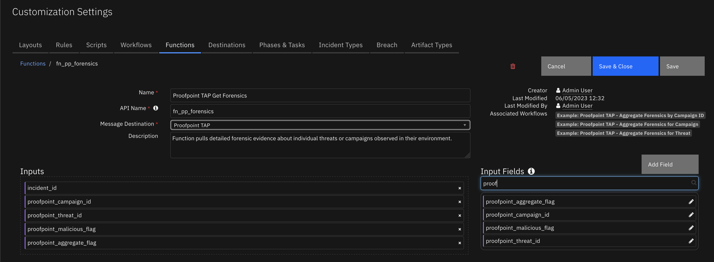

<!--
  This README.md is generated by running:
  "resilient-sdk docgen -p fn_proofpoint_tap"

  This file was generated with resilient-sdk v49.0.4423

  It is best edited using a Text Editor with a Markdown Previewer. VS Code
  is a good example. Checkout https://guides.github.com/features/mastering-markdown/
  for tips on writing with Markdown

  All fields followed by "::CHANGE_ME::"" should be manually edited

  If you make manual edits and run docgen again, a .bak file will be created

  Store any screenshots in the "doc/screenshots" directory and reference them like:
  

  NOTE: If your app is available in the container-format only, there is no need to mention the integration server in this readme.
-->

# Proofpoint Targeted Attack Protection (TAP)

## Table of Contents
- [Release Notes](#release-notes)
- [Overview](#overview)
  - [Key Features](#key-features)
- [Requirements](#requirements)
  - [SOAR platform](#soar-platform)
  - [Cloud Pak for Security](#cloud-pak-for-security)
  - [Proxy Server](#proxy-server)
  - [Python Environment](#python-environment)
- [Installation](#installation)
  - [Install](#install)
  - [App Configuration](#app-configuration)
  - [Custom Layouts](#custom-layouts)
- [Function - Proofpoint TAP Get Campaign](#function---proofpoint-tap-get-campaign)
- [Function - Proofpoint TAP Get Forensics](#function---proofpoint-tap-get-forensics)
- [Script - Example: Proofpoint TAP - Create Artifact for Campaign Object Name or Threat](#script---example-proofpoint-tap---create-artifact-for-campaign-object-name-or-threat)
- [Data Table - Proofpoint TAP Campaign Object Details](#data-table---proofpoint-tap-campaign-object-details)
- [Custom Fields](#custom-fields)
- [Custom Artifact Types](#custom-artifact-types)
- [Playbooks](#playbooks)
- [Troubleshooting & Support](#troubleshooting--support)

---

## Release Notes
<!--
  Specify all changes in this release. Do not remove the release 
  notes of a previous release
-->
| Version | Date | Notes |
| ------- | ---- | ----- |
| 1.1.0 | 6/2023 | Playbook support; custom filtering on polling /siem endpoint |
| 1.0.3 | 8/2020 | Fix for event filtering |
| 1.0.2 | 5/2020 | Fix for Poller |
| 1.0.1 | 4/2020 | Bugfix |
| 1.0.0 | 12/2019 | Initial release |
---

## Overview
<!--
  Provide a high-level description of the function itself and its remote software or application.
  The text below is parsed from the "description" and "long_description" attributes in the setup.py file
-->
Proofpoint Targeted Attack Protection (TAP) helps you stay ahead of attackers with an innovative approach that detects, analyzes and blocks advanced threats before they reach your inbox. This includes ransomware and other advanced email threats delivered through malicious attachments and URLs.


 

### Key Features
<!--
  List the Key Features of the Integration
-->

The Proofpoint TAP function package provides the following features:

* Poll detailed information from several types of TAP events in a SIEM-compatible, vendor-neutral format. This includes Blocked or permitted clicks to threats recognized by URL Defense and Blocked, and delivered messages containing threats recognized by URL Defense or Attachment Defense. Create SOAR cases from polled threat data.
* Get detailed forensic evidences about individual threats or campaigns observed in their environment. These evidences could be used as indicators of compromise to confirm infection on a host, as supplementary data to enrich and correlate against other security intelligence sources, or to orchestrate updates to security endpoints to prevent exposure and infection.
* Pull specific details about campaigns, including their description, the actor, malware family, and techniques associated with the campaign and the threat variants which have been associated with the campaign.

---

## Requirements
<!--
  List any Requirements 
--> 
This app supports the IBM Security QRadar SOAR Platform and the IBM Security QRadar SOAR for IBM Cloud Pak for Security.

### SOAR platform
The SOAR platform supports two app deployment mechanisms, Edge Gateway (formerly App Host) and integration server.

If deploying to a SOAR platform with an Edge Gateway, the requirements are:
* SOAR platform >= `45.2.0`.
* The app is in a container-based format (available from the AppExchange as a `zip` file).

If deploying to a SOAR platform with an integration server, the requirements are:
* SOAR platform >= `45.2.0`.
* The app is in the older integration format (available from the AppExchange as a `zip` file which contains a `tar.gz` file).
* Integration server is running `resilient_circuits>=49.0.4423`.
* If using an API key account, make sure the account provides the following minimum permissions: 
  | Name | Permissions |
  | ---- | ----------- |
  | Org Data | Read |
  | Function | Read |
  | Incidents | Read, Create |


The following SOAR platform guides provide additional information: 
* _Edge Gateway Deployment Guide_ or _App Host Deployment Guide_: provides installation, configuration, and troubleshooting information, including proxy server settings. 
* _Integration Server Guide_: provides installation, configuration, and troubleshooting information, including proxy server settings.
* _System Administrator Guide_: provides the procedure to install, configure and deploy apps. 

The above guides are available on the IBM Documentation website at [ibm.biz/soar-docs](https://ibm.biz/soar-docs). On this web page, select your SOAR platform version. On the follow-on page, you can find the _Edge Gateway Deployment Guide_, _App Host Deployment Guide_, or _Integration Server Guide_ by expanding **Apps** in the Table of Contents pane. The System Administrator Guide is available by expanding **System Administrator**.

### Cloud Pak for Security
If you are deploying to IBM Cloud Pak for Security, the requirements are:
* IBM Cloud Pak for Security >= `1.8`.
* Cloud Pak is configured with an Edge Gateway.
* The app is in a container-based format (available from the AppExchange as a `zip` file).

The following Cloud Pak guides provide additional information: 
* _Edge Gateway Deployment Guide_ or _App Host Deployment Guide_: provides installation, configuration, and troubleshooting information, including proxy server settings. From the Table of Contents, select Case Management and Orchestration & Automation > **Orchestration and Automation Apps**.
* _System Administrator Guide_: provides information to install, configure, and deploy apps. From the IBM Cloud Pak for Security IBM Documentation table of contents, select Case Management and Orchestration & Automation > **System administrator**.

These guides are available on the IBM Documentation website at [ibm.biz/cp4s-docs](https://ibm.biz/cp4s-docs). From this web page, select your IBM Cloud Pak for Security version. From the version-specific IBM Documentation page, select Case Management and Orchestration & Automation.

### Proxy Server
The app **doest** support a proxy server.

### Python Environment
Python 3.6 and Python 3.9 are supported.
Additional package dependencies may exist for each of these packages:
* resilient-lib
* resilient_circuits>=49.0.4423

### Development Version

This app has been implemented using:
| Product Name | Product Version | API URL | API Version |
| ------------ | --------------- | ------- | ----------- |
| Proofpoint TAP | N/A | https://tap-api-v2.proofpoint.com/v2 | v2 |

#### Prerequisites
<!--
List any prerequisites that are needed to use with this endpoint solution. Remove any section that is unnecessary.
-->
* Prereq A <!-- ::CHANGE_ME:: -->
* Prereq B <!-- ::CHANGE_ME:: -->
* Prereq C <!-- ::CHANGE_ME:: -->

#### Configuration
<!--
List any steps that are needed to configure the endpoint to use this app.
-->
* Config A <!-- ::CHANGE_ME:: -->
* Config B <!-- ::CHANGE_ME:: -->
* Config C <!-- ::CHANGE_ME:: -->

#### Permissions
<!--
List any user permissions that are needed to use this endpoint. For example, list the API key permissions.
-->
* Permission A <!-- ::CHANGE_ME:: -->
* Permission B <!-- ::CHANGE_ME:: -->
* Permission C <!-- ::CHANGE_ME:: -->


---

## Installation

### Install
* To install or uninstall an App or Integration on the _SOAR platform_, see the documentation at [ibm.biz/soar-docs](https://ibm.biz/soar-docs).
* To install or uninstall an App on _IBM Cloud Pak for Security_, see the documentation at [ibm.biz/cp4s-docs](https://ibm.biz/cp4s-docs) and follow the instructions above to navigate to Orchestration and Automation.

### App Configuration
The following table provides the settings you need to configure the app. These settings are made in the app.config file. See the documentation discussed in the Requirements section for the procedure.

| Config | Required | Example | Description |
| ------ | :------: | ------- | ----------- |
| **base_url** | Yes | `https://tap-api-v2.proofpoint.com/v2` | *Base URL for Proofpoint TAP REST API calls*  |
| **cafile** | Yes | `` | *Certificate file if required by Proofpoint* |
| **forensics_template** | Yes | `` | *inja template to override default forensic format* |
| **password** | Yes | `xxxx` | *Credentials used to authenticate to Proofpoint TAP: password or API secret* |
| **polling_interval** | Yes | `10` | *Time interval, in minutes, to check for new events. Enter 0 to disable*  |
| **score_threshold** | Yes | `50` | *Classification for the type of event to import based on the respective threat score* |
| **startup_interval** | Yes | `10` | *Time interval, in minutes, to check for previous events at startup. Maximum is 60* |
| **threat_template** | Yes | `` | *Jinja template to override default threat description format* |
| **type_filter** | Yes | `malware, phish, spam, impostor, all` | *Filter used to determine which comma-separated list of types of events to import into the Resilient platform.* |
| **username** | Yes | `12345678-abcd-abe1-0123-e1234567890` | *Credentials used to authenticate to Proofpoint TAP: username or API key* |

### Custom Layouts
<!--
  Use this section to provide guidance on where the user should add any custom fields and data tables.
  You may wish to recommend a new incident tab.
  You should save a screenshot "custom_layouts.png" in the doc/screenshots directory and reference it here
-->
Create a Proofpoint TAP custom layout and drag the custom fields and the data table like the screenshot below:

  


---

## Function - Proofpoint TAP Get Campaign
Function pulls specific details about campaigns including description, the actor, malware family, techniques and the threat variants associated with the campaign.

 

<details><summary>Inputs:</summary>
<p>

| Name | Type | Required | Example | Tooltip |
| ---- | :--: | :------: | ------- | ------- |
| `proofpoint_campaign_id` | `text` | No | `-` | - |

</p>
</details>

<details><summary>Outputs:</summary>
<p>

> **NOTE:** This example might be in JSON format, but `results` is a Python Dictionary on the SOAR platform.

<!-- ::CHANGE_ME:: -->
```python
results = {
    # TODO: Generate an example of the Function Output within this code block.
    # To get the output of a Function:
    #   1. Run resilient-circuits in DEBUG mode: $ resilient-circuits run --loglevel=DEBUG
    #   2. Invoke the Function in SOAR
    #   3. Gather the results using: $ resilient-sdk codegen -p fn_proofpoint_tap --gather-results
    #   4. Run docgen again: $ resilient-sdk docgen -p fn_proofpoint_tap
} 
```

</p>
</details>

<details><summary>Example Pre-Process Script:</summary>
<p>

```python
None
```

</p>
</details>

<details><summary>Example Post-Process Script:</summary>
<p>

```python
None
```

</p>
</details>

---
## Function - Proofpoint TAP Get Forensics
Function pulls detailed forensic evidence about individual threats or campaigns observed in their environment.

 

<details><summary>Inputs:</summary>
<p>

| Name | Type | Required | Example | Tooltip |
| ---- | :--: | :------: | ------- | ------- |
| `incident_id` | `number` | Yes | `-` | - |
| `proofpoint_aggregate_flag` | `boolean` | No | `-` | - |
| `proofpoint_campaign_id` | `text` | No | `-` | - |
| `proofpoint_malicious_flag` | `boolean` | No | `-` | - |
| `proofpoint_threat_id` | `text` | No | `-` | - |

</p>
</details>

<details><summary>Outputs:</summary>
<p>

> **NOTE:** This example might be in JSON format, but `results` is a Python Dictionary on the SOAR platform.

```python
results = {
  "inputs": {
    "incident_id": 2862,
    "campaign_id": null,
    "threat_id": "7cbbf08ebb723e7986f2369fc6b7e6fec773ff511484da8b643141e8b1aa221c",
    "aggregate_flag": null,
    "malicious_flag": true
  },
  "success": true,
  "num_reports": 1
}
```

</p>
</details>

<details><summary>Example Pre-Process Script:</summary>
<p>

```python
None
```

</p>
</details>

<details><summary>Example Post-Process Script:</summary>
<p>

```python
None
```

</p>
</details>

---

## Script - Example: Proofpoint TAP - Create Artifact for Campaign Object Name or Threat
Script creates an Artifact for Proofpoint TAP Campaign Object Name or Threat based on the selected datatable row.

**Object:** proofpoint_tap_campaign_object_dt

<details><summary>Script Text:</summary>
<p>

```python
# Script creates an artifact for Proofpoint TAP Campaign Object Name or Threat based on the selected datatable row.
# Artifact description
artifact_description = u"""Created by Proofpoint TAP Get Campaign results for Campaign ID '{}', Type of Campaign Object '{}', Object ID '{}'""".format(
  row.proofpoint_tap_campaign_id,
  row.proofpoint_tap_object_type,
  row.proofpoint_tap_object_id)

# Artifact type
artifact_type = "String"

# Artifact value
object_name = row.proofpoint_tap_object_name
object_threat = row.proofpoint_tap_object_threat
if object_name is not None:
  artifact_value = object_name 
else: 
  artifact_value = object_threat

# Create an Artifact
if artifact_value:
  incident.addArtifact(artifact_type, artifact_value, artifact_description)

```

</p>
</details>

---

## Data Table - Proofpoint TAP Campaign Object Details

 

#### API Name:
proofpoint_tap_campaign_object_dt

#### Columns:
| Column Name | API Access Name | Type | Tooltip |
| ----------- | --------------- | ---- | ------- |
| Campaign ID | `proofpoint_tap_campaign_id` | `text` | - |
| Name | `proofpoint_tap_object_name` | `text` | - |
| Object Id | `proofpoint_tap_object_id` | `text` | - |
| Subtype of Threat | `proofpoint_tap_object_subtype_of_threat` | `text` | - |
| Threat | `proofpoint_tap_object_threat` | `text` | - |
| Threat Time | `proofpoint_tap_object_threat_time` | `text` | - |
| Timestamp | `proofpoint_tap_object_timestamp` | `datetimepicker` | - |
| Type of Campaign Object | `proofpoint_tap_object_type` | `text` | - |
| Type of Threat | `proofpoint_tap_object_type_of_threat` | `text` | - |

---

## Custom Fields
| Label | API Access Name | Type | Prefix | Placeholder | Tooltip |
| ----- | --------------- | ---- | ------ | ----------- | ------- |
| Proofpoint Campaign ID | `campaignId` | `text` | `properties` | - | - |
| Proofpoint Message ID | `messageID` | `text` | `properties` | - | - |

---

## Custom Artifact Types
| Display Name | API Access Name | Description |
| ------------ | --------------- | ----------- |
| Proofpoint Campaign ID | `proofpoint_campaign_id` | An identifier for the campaign |
| Proofpoint Threat ID | `proofpoint_threat_id` | The unique identifier associated with threat |

---


## Playbooks
| Playbook Name | Description | Object | Status |
| ------------- | ----------- | ------ | ------ |
| Example: Proofpoint TAP - Aggregate Forensics by Campaign ID (PB) | Returns aggregate forensics for an entire campaign based on the given campaign identifier. Results are saved in a note and attachment. | artifact | `enabled` |
| Example: Proofpoint TAP - Aggregate Malicious Forensics by Threat ID (PB) | Imports additional forensic information based on the given threat identifier. It returns aggregate forensics for the given threat identifier, which is filtered to include malicious results only. Results are saved in a note and attachment. | artifact | `enabled` |
| Example: Proofpoint TAP - Aggregate Malicious Forensics for Entire Campaign Associated with Threat ID (PB) | Imports additional forensic information based on the given threat identifier. If the threat has been associated with a campaign, it returns aggregate forensics for the entire campaign. Otherwise, it returns aggregate forensics for the individual threat. The returned forensics are filtered to include malicious results only. Results are saved in a note and attachment. | artifact | `enabled` |
| Example: Proofpoint TAP - Create Artifact for Campaign Object Name or Threat (PB) | None | proofpoint_tap_campaign_object_dt | `enabled` |
| Example: Proofpoint TAP - Get Campaign Information by Campaign ID (PB) | Imports detailed information for given campaign identifier, including description, the actor, malware family, techniques and the threat variants associated with the campaign. Results are saved in a note and data table. | artifact | `enabled` |

---

## Troubleshooting & Support
Refer to the documentation listed in the Requirements section for troubleshooting information.

### For Support
This is an IBM supported app. Please search [ibm.com/mysupport](https://ibm.com/mysupport) for assistance.
