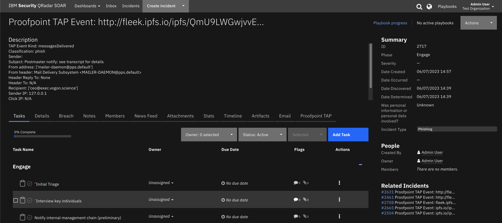
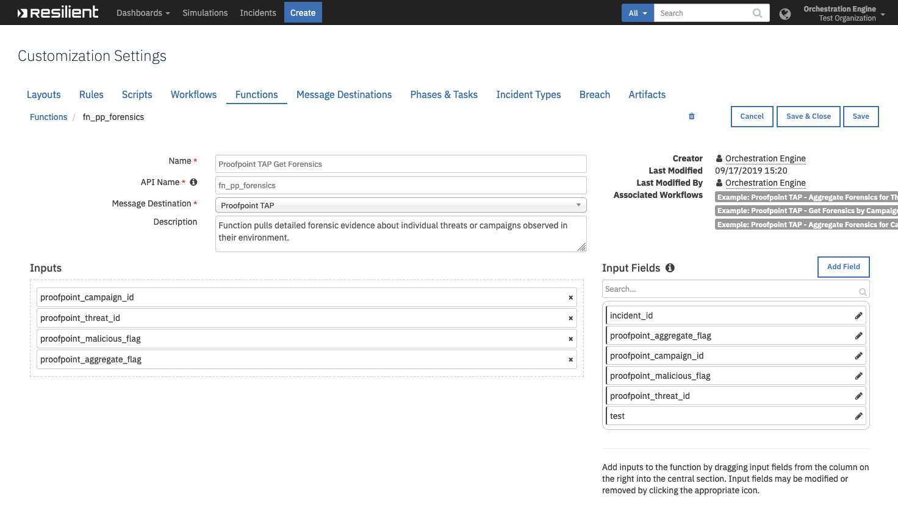
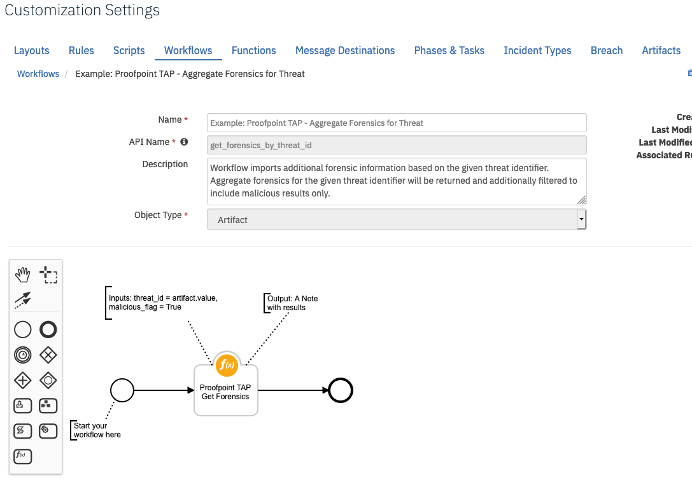
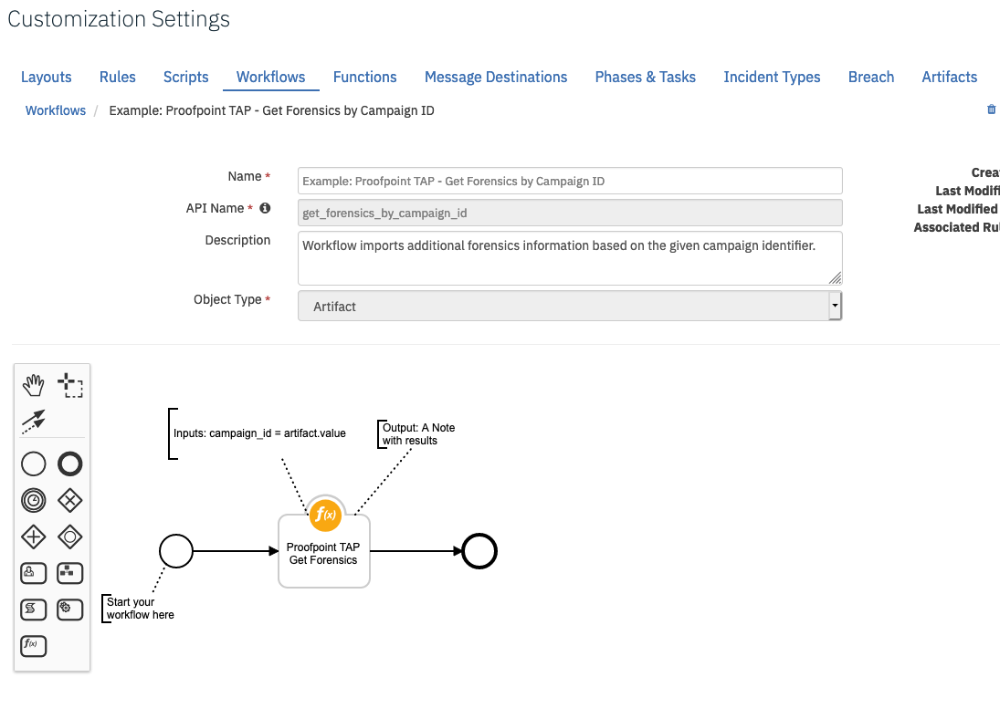
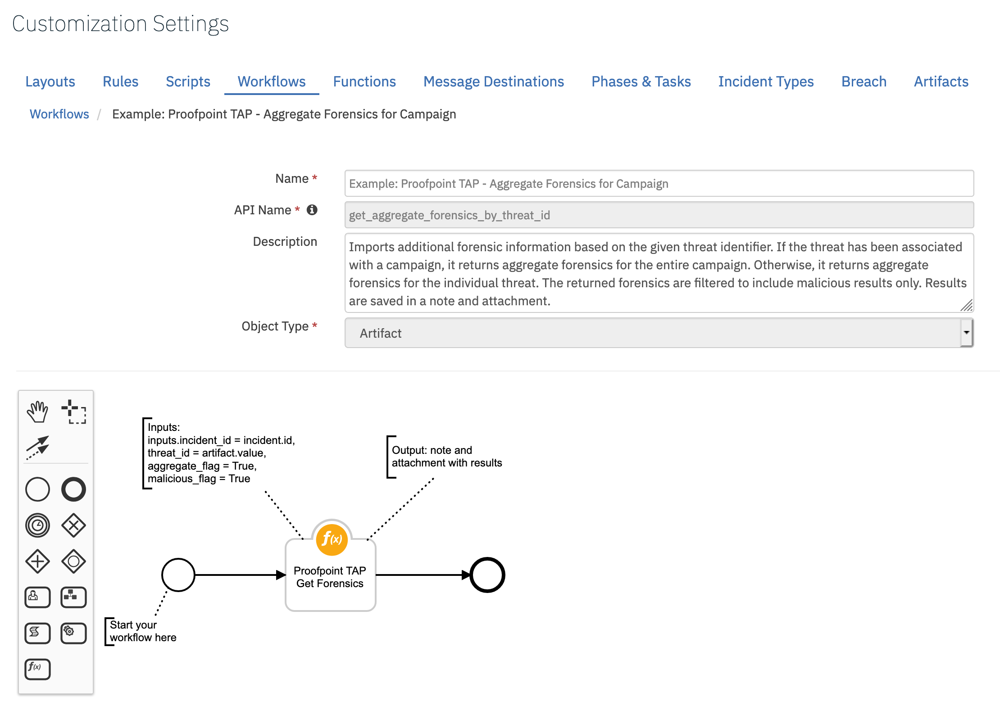

<!--
  This User README.md is generated by running:
  "resilient-circuits docgen -p fn_proofpoint_tap --only-user-guide"

  It is best edited using a Text Editor with a Markdown Previewer. VS Code
  is a good example. Checkout https://guides.github.com/features/mastering-markdown/
  for tips on writing with Markdown

  If you make manual edits and run docgen again, a .bak file will be created

  Store any screenshots in the "doc/screenshots" directory and reference them like:
  
-->

# **User Guide:** fn_proofpoint_tap_v1.0.0

## Table of Contents
- [Key Features](#key-features)
- [Function - Proofpoint TAP Get Campaign](#function---proofpoint-tap-get-campaign)
- [Function - Proofpoint TAP Get Forensics](#function---proofpoint-tap-get-forensics)
- [Custom Fields](#custom-fields)
- [Rules](#rules)

---

## Key Features
<!--
  List the Key Features of the Integration
-->
* Poller
* Get Forensics
* Get Campaign

---

## Poller

Threaded Poller which runs continuously while the integration is running.

* Polls Proofpoint TAP events for all clicks and messages relating to known threats within the specified time period.
* Filters the events based on their classification threat type such as malware, phish, spam, and impostor. The chosen type_filter is defined in the app.config file. 
* Filters the type of events to import based on the respective threat score that is configured in the app.config file.
* Creates Incidents in the Resilient platform based on the events.
* Adds artifacts to incidents in the Resilient platform corresponding to Proofpoint TRAP Campaign ID and Threat ID.

  
---

## Function - Proofpoint TAP Get Forensics
Function pulls detailed forensic evidence about individual threats or campaigns observed in their environment. The results are saved in a Note.

 

<details><summary>Inputs:</summary>
<p>

| Name | Type | Required | Example | Tooltip |
| ---- | :--: | :------: | ------- | ------- |
| `proofpoint_aggregate_flag` | `boolean` | No | `-` | A boolean value, defaulting to false. May optionally be used with the threatId parameter. It cannot be used with the campaignId parameter. If false, aggregate forensics for that specific threat identifier will be returned. If true AND if the threat has been associated with a campaign, aggregate forensics for the entire campaign are returned. Otherwise, aggregate forensics for the individual threat are returned. |
| `proofpoint_campaign_id` | `text` | No | `-` | A string containing a campaign identifier. |
| `proofpoint_malicious_flag` | `boolean` | No | `-` | Show malicious results only |
| `proofpoint_threat_id` | `text` | No | `-` | A string containing a threat identifier. |

</p>
</details>

<details><summary>Workflows:</summary>
<p>

There are three Workflows for this function:

* Example: Proofpoint TAP - Aggregate Forensics for Threat 

Workflow imports additional forensic information based on the given threat identifier. Aggregate forensics for the given threat identifier are returned and additionally filtered to include malicious results only.



* Example: Proofpoint TAP - Get Forensics by Campaign ID 

Workflow imports additional forensics information based on the given campaign identifier.



* Example: Proofpoint TAP - Aggregate Forensics for Campaign 

Workflow imports additional forensic information based on the given threat identifier. If the threat has been associated with a campaign, aggregate forensics for the entire campaign are returned. Otherwise aggregate forensics for the individual threat are returned.



</p>
</details>

<details><summary>Outputs:</summary>
<p>

```python
results {
  "inputs": {
    "campaign_id": None,
    "threat_id": "355e7ff321fc141e057c2ad6a593a9a264ed910065fe6c099f5cd0e097824474",
    "aggregate_flag": None,
    "malicious_flag": True
  },
  "success": True,
  "data": [
    "Malicious content dropped during execution\nType: behavior\nMalicious: True\nNote: Malicious content dropped during execution\nOS: Win7\nURL: ",
    "Malicious content dropped during execution\nType: behavior\nMalicious: True\nNote: Malicious content dropped during execution\nOS: Win7\nURL: ",
    "Malicious attachment with url: http://skilleducators.com\nType: url\nMalicious: True\nNote: \nOS: Win7\nURL: http://skilleducators.com",
    "Malicious attachment with url: http://skilleducators.com\nType: url\nMalicious: True\nNote: \nOS: Win7\nURL: http://skilleducators.com"
  ]
}

```

</p>
</details>

<details><summary>Example Pre-Process Script:</summary>
<p>

```python
inputs.proofpoint_threat_id = artifact.value
inputs.proofpoint_malicious_flag = True
```

</p>
</details>

<details><summary>Example Post-Process Script:</summary>
<p>

```python
# results is a Dictionary and data is a List
if results and results.get("data"):
  incident.addNote("\n\n".join(results.get("data")))
else:
  incident.addNote("No malicious Forensics information found for artifact {}.".format(artifact.value))
```

</p>
</details>

---

## Function - Proofpoint TAP Get Campaign
Function pulls specific details about campaigns including description, the actor, malware family, techniques and the threat variants associated with the campaign. The results are saved in a Note.

 

<details><summary>Inputs:</summary>
<p>

| Name | Type | Required | Example | Tooltip |
| ---- | :--: | :------: | ------- | ------- |
| `proofpoint_campaign_id` | `text` | No | `-` | A string containing a campaign identifier. |

</p>
</details>

<details><summary>Workflows:</summary>
<p>

There is one Workflow for this function:

* Example: Proofpoint TAP - Get Campaign  

Workflow imports detailed information for given campaign identifier, including description, the actor, malware family, techniques and the threat variants associated with the campaign.


</p>
</details>

<details><summary>Example Pre-Process Script:</summary>
<p>

```python
inputs.proofpoint_campaign_id = artifact.value
```

</p>
</details>

<details><summary>Example Post-Process Script:</summary>
<p>

```python
# results and results.data are both a Dictionary
if results and results.get("data"):
  incident.addNote(str(results.get("data")))
else:
  incident.addNote("No Campaign information found for artifact {}.".format(artifact.value))
```

</p>
</details>

---

## Custom Fields
| Label | API Access Name | Type | Prefix | Placeholder | Tooltip |
| ----- | --------------- | ---- | ------ | ----------- | ------- |
| Proofpoint Campaign ID | `campaignId` | `text` | `properties` | - | A string containing a campaign identifier. |
| Proofpoint Message ID | `messageID` | `text` | `properties` | - | A string containing a threat identifier. |

---


## Rules
| Rule Name | Object | Workflow Triggered |
| --------- | ------ | ------------------ |
| Example: Proofpoint TAP - Aggregate Forensics by Threat ID and Show Malicious Results Only | artifact | `get_forensics_by_threat_id` |
| Example: Proofpoint TAP - Get Campaign Information by Campaign ID | artifact | `get_campaign_flow` |
| Example: Proofpoint TAP - Get Forensics by Campaign ID | artifact | `get_forensics_by_campaign_id` |
| Example: Proofpoint TAP - Aggregate Forensics for Entire Campaign Associated with Threat ID | artifact | `get_aggregate_forensics_by_threat_id` |

---

<!--
## Inform Resilient Users
  Use this section to optionally provide additional information so that Resilient playbook 
  designer can get the maximum benefit of your integration.
-->