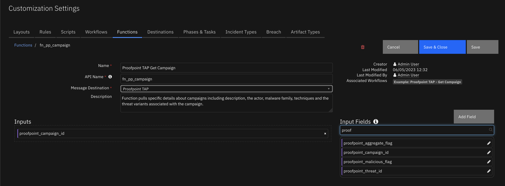
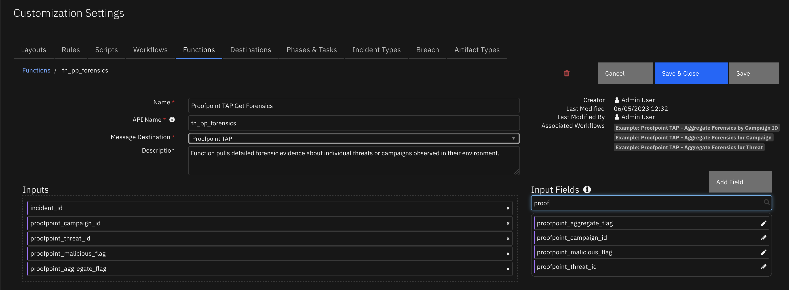

<!--
  This User README.md is generated by running:
  "resilient-circuits docgen -p fn_proofpoint_tap --only-user-guide"

  It is best edited using a Text Editor with a Markdown Previewer. VS Code
  is a good example. Checkout https://guides.github.com/features/mastering-markdown/
  for tips on writing with Markdown

  If you make manual edits and run docgen again, a .bak file will be created

  Store any screenshots in the "doc/screenshots" directory and reference them like:
  
-->

# **User Guide:** fn_proofpoint_tap_v1.0.0

## Table of Contents
- [Key Features](#key-features)
- [Function - Proofpoint TAP Get Campaign](#function---proofpoint-tap-get-campaign)
- [Function - Proofpoint TAP Get Forensics](#function---proofpoint-tap-get-forensics)
- [Custom Fields](#custom-fields)
- [Rules](#rules)

---

## Key Features
<!--
  List the Key Features of the Integration
-->
* Escalate threats to Resilient as new Incidents
* Enrich Incident data with TAP campaign information
* Collect detailed forensic data on individual threats or campaigns

---

## Function - Proofpoint TAP Get Campaign


 

<details><summary>Inputs:</summary>
<p>

| Name | Type | Required | Example | Tooltip |
| ---- | :--: | :------: | ------- | ------- |
| `proofpoint_campaign_id` | `text` | No | `-` | - |

</p>
</details>

<details><summary>Outputs:</summary>
<p>

```python
results = {
    # TODO: Copy and paste an example of the Function Output within this code block.
    # To see view the output of a Function, run resilient-circuits in DEBUG mode and invoke the Function. 
    # The Function results will be printed in the logs: "resilient-circuits run --loglevel=DEBUG"
}
```

</p>
</details>

<details><summary>Example Pre-Process Script:</summary>
<p>

```python
inputs.proofpoint_campaign_id = artifact.value
```

</p>
</details>

<details><summary>Example Post-Process Script:</summary>
<p>

```python
incident.addNote(results.data)

```

</p>
</details>

---
## Function - Proofpoint TAP Get Forensics


 

<details><summary>Inputs:</summary>
<p>

| Name | Type | Required | Example | Tooltip |
| ---- | :--: | :------: | ------- | ------- |
| `incident_id` | `number` | No | `-` | - |
| `proofpoint_aggregate_flag` | `boolean` | No | `-` | - |
| `proofpoint_campaign_id` | `text` | No | `-` | - |
| `proofpoint_malicious_flag` | `boolean` | No | `-` | - |
| `proofpoint_threat_id` | `text` | No | `-` | - |

</p>
</details>

<details><summary>Outputs:</summary>
<p>

```python
results = {
    # TODO: Copy and paste an example of the Function Output within this code block.
    # To see view the output of a Function, run resilient-circuits in DEBUG mode and invoke the Function. 
    # The Function results will be printed in the logs: "resilient-circuits run --loglevel=DEBUG"
}
```

</p>
</details>

<details><summary>Example Pre-Process Script:</summary>
<p>

```python
inputs.proofpoint_threat_id = artifact.value
inputs.proofpoint_aggregate_flag = True
```

</p>
</details>

<details><summary>Example Post-Process Script:</summary>
<p>

```python
incident.addNote(results.data)
```

</p>
</details>

---


## Custom Fields
| Label | API Access Name | Type | Prefix | Placeholder | Tooltip |
| ----- | --------------- | ---- | ------ | ----------- | ------- |
| Proofpoint Message ID | `messageID` | `text` | `properties` | - | - |

---


## Rules
| Rule Name | Object | Workflow Triggered |
| --------- | ------ | ------------------ |
| Example: Proofpoint TAP - Get Aggregate Forensics by Threat ID | artifact | `get_aggregate_forensics_by_threat_id` |
| Example: Proofpoint TAP - Get Campaign | artifact | `get_campaign_flow` |
| Example: Proofpoint TAP - Get Forensics by Campaign ID | artifact | `get_forensics_by_campaign_id` |
| Example: Proofpoint TAP - Get Forensics by Threat ID | artifact | `get_forensics_by_threat_id` |

---

<!--
## Inform Resilient Users
  Use this section to optionally provide additional information so that Resilient playbook 
  designer can get the maximum benefit of your integration.
-->