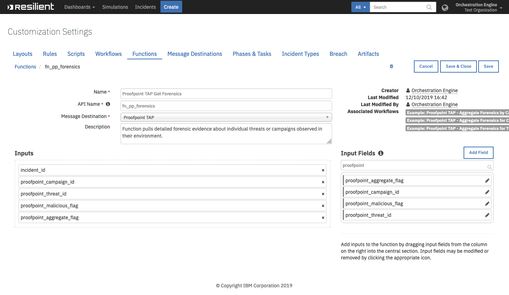
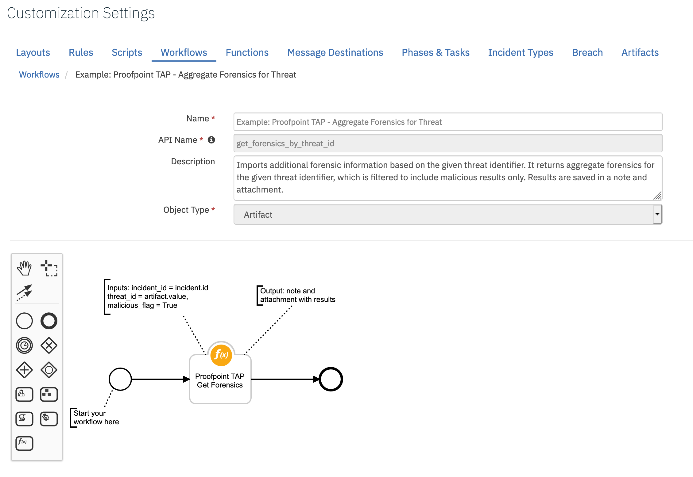
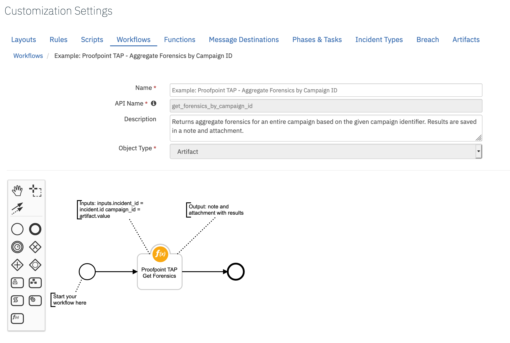
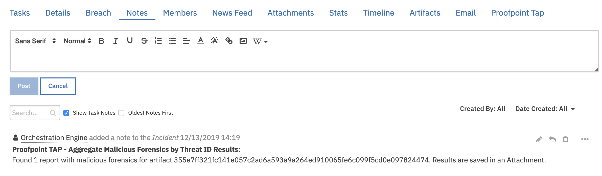
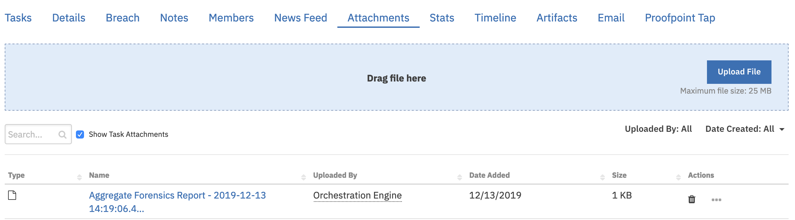
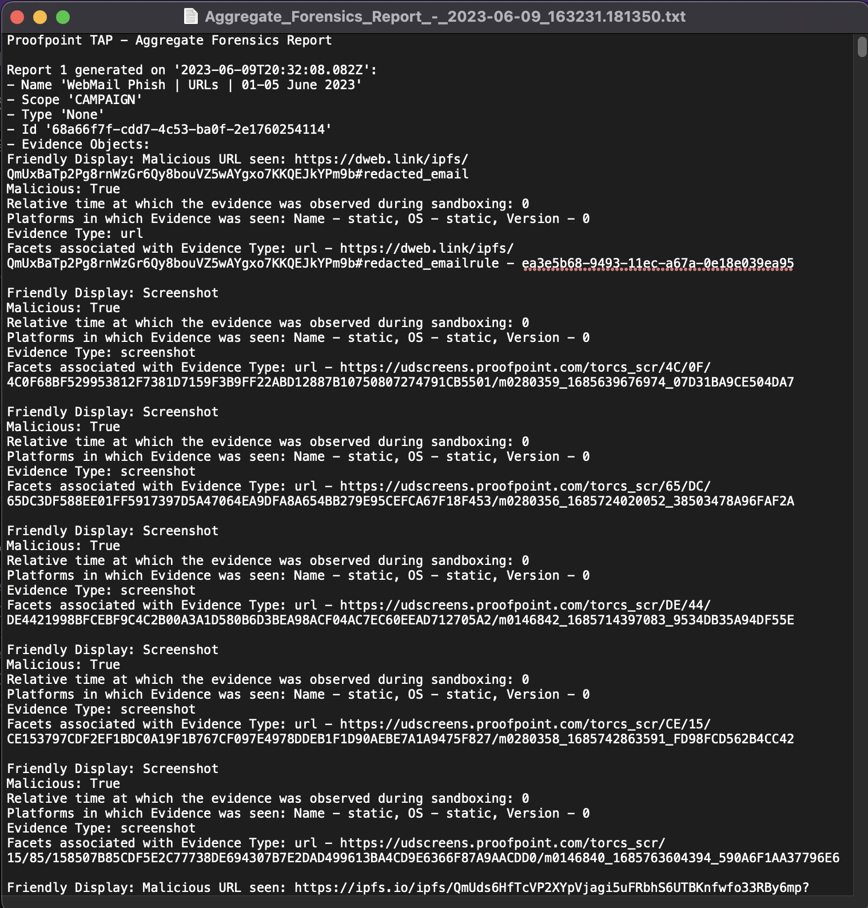
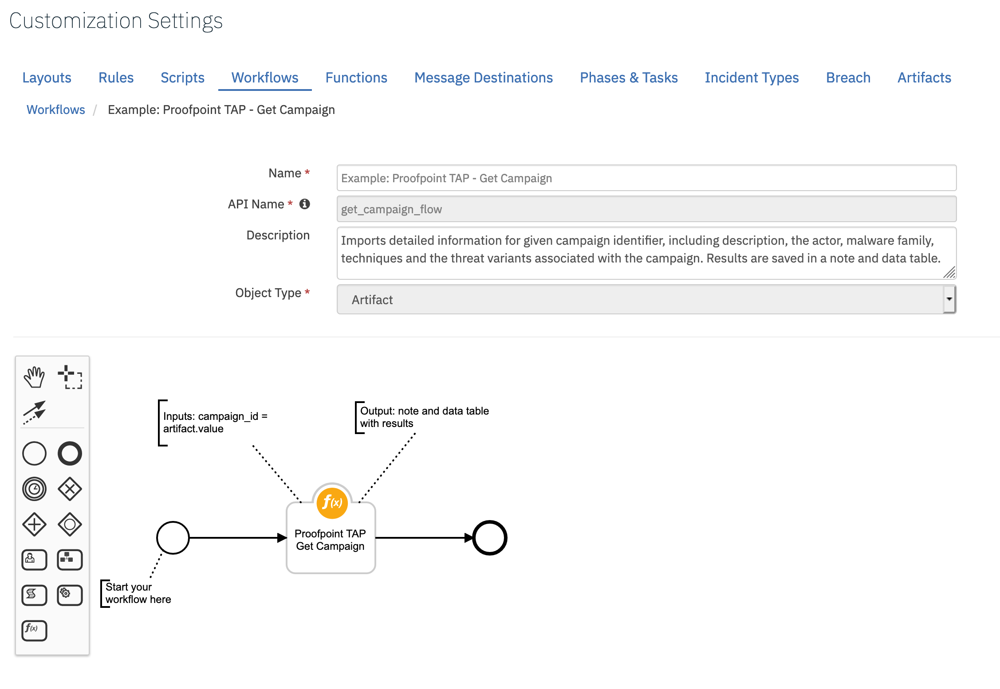
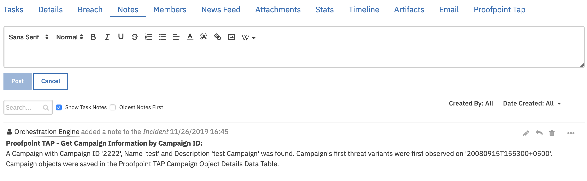
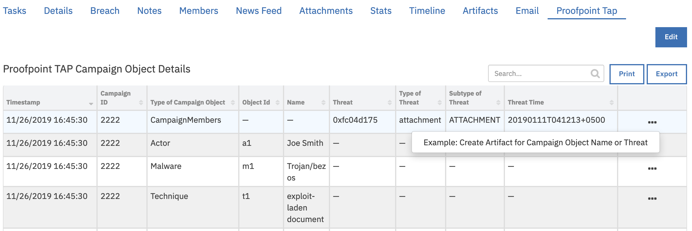

<!--
  This User README.md is generated by running:
  "resilient-circuits docgen -p fn_proofpoint_tap --only-user-guide"

  It is best edited using a Text Editor with a Markdown Previewer. VS Code
  is a good example. Checkout https://guides.github.com/features/mastering-markdown/
  for tips on writing with Markdown

  If you make manual edits and run docgen again, a .bak file will be created

  Store any screenshots in the "doc/screenshots" directory and reference them like:
  
-->

# **User Guide:** fn_proofpoint_tap_v1.0.0

## Table of Contents
- [Key Features](#key-features)
- [Function - Proofpoint TAP Get Campaign](#function---proofpoint-tap-get-campaign)
- [Function - Proofpoint TAP Get Forensics](#function---proofpoint-tap-get-forensics)
- [Custom Fields](#custom-fields)
- [Rules](#rules)
- [Scripts](#scripts)

---

## Key Features
<!--
  List the Key Features of the Integration
-->
* Poller
* Get Forensics
* Get Campaign
NOTE: If using both Proofpoint TAP and TRAP integrations, TAP polls events and TRAP polls incidents. One could be more granular than the other; therefore, you might not need to use both pollers at the same time.

---

## Poller

Threaded Poller which runs continuously while the integration is running.

* Polls Proofpoint TAP events for all clicks and messages relating to known threats within the specified time period.
* Filters the events based on their classification threat type such as malware, phish, spam, and impostor. The chosen type_filter is defined in the app.config file. 
* Filters the type of events to import based on the respective threat score that is configured in the app.config file.
* Creates incidents in the Resilient platform based on the events.
* Adds artifacts to incidents in the Resilient platform corresponding to Proofpoint TRAP Campaign ID and Threat ID.

The following is an example of an incident created by the Poller.
  
---

## Function - Proofpoint TAP Get Forensics
This function pulls detailed forensic evidence about individual threats or campaigns observed in their environment.

 

<details><summary>Inputs:</summary>
<p>

| Name | Type | Required | Example | Tooltip |
| ---- | :--: | :------: | ------- | ------- |
| `incident_id` | `number` | Yes | `-` | Incident ID |
| `proofpoint_aggregate_flag` | `boolean` | No | `-` | A boolean value, which is false by default. Can optionally be used with the threatId parameter. It cannot be used with the campaignId parameter. If false, returns the aggregate forensics for that specific threat identifier. If true AND the threat has been associated with a campaign, returns the aggregate forensics for the entire campaign. Otherwise, returns the aggregate forensics for the individual threat. |
| `proofpoint_campaign_id` | `text` | No | `-` | A string containing a campaign identifier. |
| `proofpoint_malicious_flag` | `boolean` | No | `-` | Show malicious results only. |
| `proofpoint_threat_id` | `text` | No | `-` | A string containing a threat identifier. |

</p>
</details>

<details><summary>Workflows:</summary>
<p>

There are three workflows for this function:

* Example: Proofpoint TAP - Aggregate Forensics for Threat 

Imports additional forensic information based on the given threat identifier. It returns aggregate forensics for the given threat identifier, which is filtered to include malicious results only. Results are saved in a note and attachment.



*  Example: Proofpoint TAP - Aggregate Forensics by Campaign ID 

Returns aggregate forensics for an entire campaign based on the given campaign identifier. Results are saved in a note and attachment.



* Example: Proofpoint TAP - Aggregate Forensics for Campaign 

Imports additional forensic information based on the given threat identifier. If the threat has been associated with a campaign, it returns aggregate forensics for the entire campaign. Otherwise, it returns aggregate forensics for the individual threat. The returned forensics are filtered to include malicious results only. Results are saved in a note and attachment.


The results of all three workflows are saved in a note and an attachment.


Additionally a script is available for the data table to create an artifact based on chosen row.





</p>
</details>

<details><summary>Outputs:</summary>
<p>

```python
results {
    "inputs": {
        "incident_id": 2106,
        "campaign_id": None,
        "threat_id": "355e7ff321fc141e057c2ad6a593a9a264ed910065fe6c099f5cd0e097824474",
        "aggregate_flag": None,
        "malicious_flag": True
      },
      "success": True,
      "num_reports": 1
    }
```

</p>
</details>

<details><summary>Example Pre-Process Script:</summary>
<p>

```python
inputs.incident_id = incident.id
inputs.proofpoint_threat_id = artifact.value
inputs.proofpoint_malicious_flag = True
```

</p>
</details>

<details><summary>Example Post-Process Script:</summary>
<p>

```python
from java.util import Date

# results is a Dictionary and reports is a List
if results is not None:
  noteText = "<b>Proofpoint TAP - Aggregate Malicious Forensics by Threat ID Results:</b>"
  
  if results.get("success") is True:
    num_reports = results.get("num_reports", 0)
    
    noteText = u"""{}
    <br>Found {} {} with malicious forensics for artifact {}. {}""".format(
      noteText,
      num_reports,
      "report" if num_reports == 1 else "reports",
      artifact.value,
      "Results are saved in an attachment." if num_reports > 0 else "")
  
  elif results.get("success") is False and results.get("note_err_text", None) is not None:
    noteText = u"""{} 
    <br>No Forensics found for Threat ID '{}'. 
    <br>Error: {}.""".format(noteText, artifact.value, results.get("note_err_text"))
  
  else:
    noteText = u"""{} <br>No Forensics found for Threat ID '{}'.""".format(noteText, artifact.value)
  
  incident.addNote(helper.createRichText(noteText))
```

</p>
</details>

---

## Function - Proofpoint TAP Get Campaign
Function pulls specific details about campaigns including description, the actor, malware family, techniques and the threat variants associated with the campaign. 

 

<details><summary>Inputs:</summary>
<p>

| Name | Type | Required | Example | Tooltip |
| ---- | :--: | :------: | ------- | ------- |
| `proofpoint_campaign_id` | `text` | No | `-` | A string containing a campaign identifier. |

</p>
</details>

<details><summary>Workflows:</summary>
<p>

There is one workflow for this function:

* Example: Proofpoint TAP - Get Campaign

Imports detailed information for given campaign identifier, including description, the actor, malware family, techniques and the threat variants associated with the campaign.



The results are saved in a note and Proofpoint TAP Campaign Object Details Data Table.


Additionally a script is available for the data table to create an artifact based on chosen row.


</p>
</details>

<details><summary>Example Pre-Process Script:</summary>
<p>

```python
inputs.proofpoint_campaign_id = artifact.value
```

</p>
</details>

<details><summary>Example Post-Process Script:</summary>
<p>

```python
from java.util import Date

def add_row_to_campaign_object_dt(object_type, object_id, object_name=None, threat=None, type_of_threat=None, subtype_of_threat=None, threat_time=None):
  object_dt = incident.addRow("proofpoint_tap_campaign_object_dt")
  object_dt.proofpoint_tap_object_timestamp = Date()
  object_dt.proofpoint_tap_campaign_id = artifact.value
  object_dt.proofpoint_tap_object_type = object_type
  object_dt.proofpoint_tap_object_id = object_id
  object_dt.proofpoint_tap_object_name = object_name
  object_dt.proofpoint_tap_object_threat = threat
  object_dt.proofpoint_tap_object_type_of_threat = type_of_threat
  object_dt.proofpoint_tap_object_subtype_of_threat = subtype_of_threat
  object_dt.proofpoint_tap_object_threat_time = threat_time
  
########################
# Mainline starts here #
########################

# results and results.data are both a Dictionary
if results is not None:
  noteText = "<b>Proofpoint TAP - Get Campaign Information by Campaign ID:</b>"
  
  if results.get("success") is True and results.get("data", None) is not None:
    data = results.get("data")
    campaign_name = data.get("name", None)
    campaign_description = data.get("description", None)
    campaign_start_date = data.get("startDate", None)
    
    noteText = u"""{}<br>Campaign was found:
    <br>- Campaign ID '{}'
    <br>- Name '{}'
    <br>- Description '{}'
    <br>- Campaign's first threat variants were first observed on '{}'
    <br>Campaign objects are saved in the Proofpoint TAP Campaign Object Details Data Table.""".format(noteText, artifact.value, campaign_name, campaign_description, campaign_start_date)
    
    campaign_members_list = data.get("campaignMembers", None)
    map(lambda member: add_row_to_campaign_object_dt("CampaignMembers", member.get("id"), threat=member.get("threat"), \
      type_of_threat=member.get("type"), subtype_of_threat=member.get("subType"), threat_time=member.get("threatTime")), campaign_members_list)
    
    families_list = data.get("families", [])
    map(lambda family: add_row_to_campaign_object_dt("CampaignFamily", family.get("id"), family.get("name")), families_list)
    
    actors_list = data.get("actors", [])
    map(lambda actor: add_row_to_campaign_object_dt("Actor", actor.get("id"), object_name=actor.get("name")), actors_list)
    
    malware_list = data.get("malware", [])
    map(lambda malware: add_row_to_campaign_object_dt("Malware", malware.get("id"), object_name=malware.get("name")), malware_list)
    
    techniques_list = data.get("techniques", [])
    map(lambda technique: add_row_to_campaign_object_dt("Technique", technique.get("id"), object_name=technique.get("name")), techniques_list)

  elif results.get("success") is False and results.get("note_err_text", None) is not None:
    noteText = u"""{} 
    <br>No Campaign information found for campaign ID '{}'. 
    <br>Error: {}.""".format(noteText, artifact.value, results.get("note_err_text"))
  else:
    noteText = u"""{} <br>No Campaign information found for campaign ID '{}'.""".format(noteText, artifact.value)
  
  incident.addNote(helper.createRichText(noteText))
```

</p>
</details>

---

## Custom Fields
| Label | API Access Name | Type | Prefix | Placeholder | Tooltip |
| ----- | --------------- | ---- | ------ | ----------- | ------- |
| Proofpoint Campaign ID | `campaignId` | `text` | `properties` | - | A string containing a campaign identifier. |
| Proofpoint Message ID | `messageID` | `text` | `properties` | - | A string containing a threat identifier. |

---


## Rules
| Rule Name | Object | Workflow/Script Triggered |
| --------- | ------ | ------------------ |
| Example: Proofpoint TAP - Aggregate Malicious Forensics by Threat ID | Artifact | `get_forensics_by_threat_id Workflow` |
| Example: Proofpoint TAP - Get Campaign Information by Campaign ID | Artifact | `get_campaign_flow Workflow` |
| Example: Proofpoint TAP - Aggregate Forensics by Campaign ID | Artifact | `get_forensics_by_campaign_id Workflow` |
| Example: Proofpoint TAP - Aggregate Malicious Forensics for Entire Campaign Associated with Threat ID | Artifact | `get_aggregate_forensics_by_threat_id Workflow` |
| Example: Proofpoint TAP - Create Artifact for Campaign Object Name or Threat | Data Table | `Example: Proofpoint TAP - Create Artifact for Campaign Object Name or Threat` |

---

## Scripts

<details><summary>Example: Proofpoint TAP - Create Artifact for Campaign Object Name or Threat</summary>
<p>

```python
# Script creates an artifact for Proofpoint TAP Campaign Object Name or Threat based on the selected datatable row.
# Artifact description
artifact_description = u"""Created by Proofpoint TAP Get Campaign results for Campaign ID '{}', Type of Campaign Object '{}', Object ID '{}'""".format(
  row.proofpoint_tap_campaign_id,
  row.proofpoint_tap_object_type,
  row.proofpoint_tap_object_id)

# Artifact type
artifact_type = "String"

# Artifact value
object_name = row.proofpoint_tap_object_name
object_threat = row.proofpoint_tap_object_threat
if object_name is not None:
  artifact_value = object_name 
else: 
  artifact_value = object_threat

# Create an Artifact
if artifact_value:
  incident.addArtifact(artifact_type, artifact_value, artifact_description)
```

</p>
</details>

<!--
## Inform Resilient Users
  Use this section to optionally provide additional information so that Resilient playbook 
  designer can get the maximum benefit of your integration.
-->