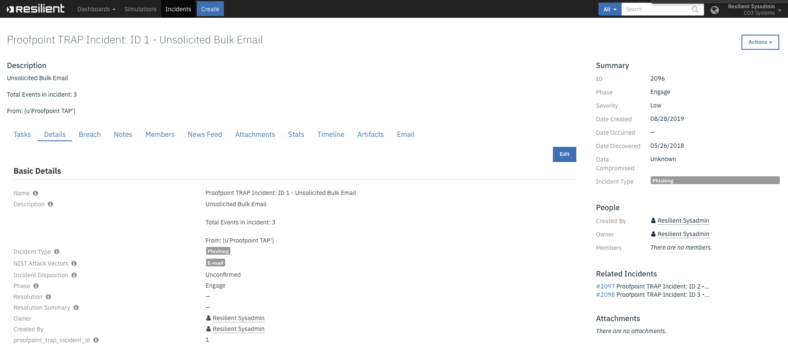
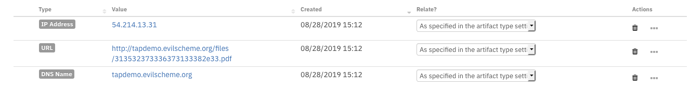
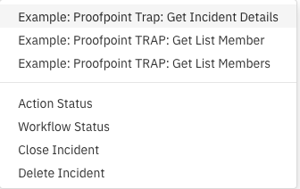
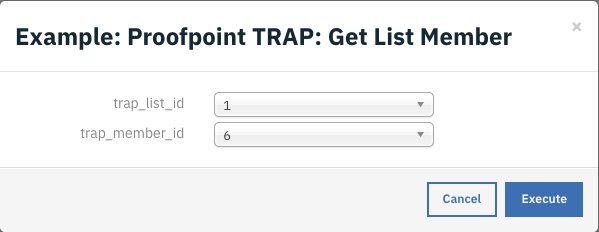
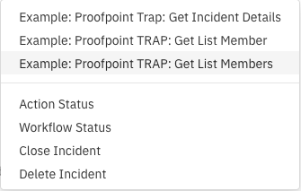
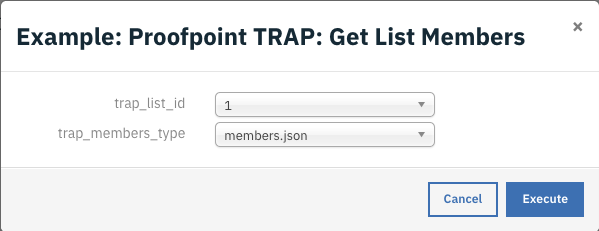
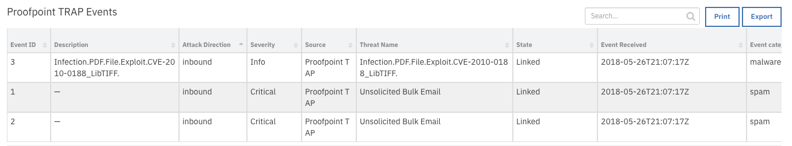
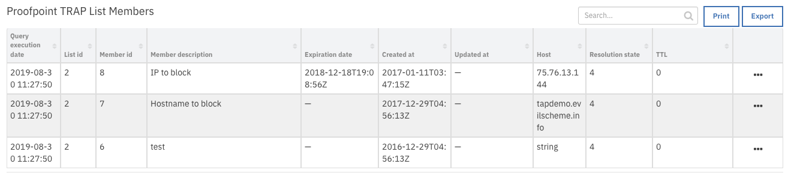

<!--
  This Install README.md is generated by running:
  "resilient-circuits docgen -p fn_proofpoint_trap --only-install-guide"

  It is best edited using a Text Editor with a Markdown Previewer. VS Code
  is a good example. Checkout https://guides.github.com/features/mastering-markdown/
  for tips on writing with Markdown

  If you make manual edits and run docgen again, a .bak file will be created

  Store any screenshots in the "doc/screenshots" directory and reference them like:
  
-->

# fn-proofpoint-trap Functions for IBM Resilient

- [Release Notes](#release-notes)
- [Overview](#overview)
- [Requirements](#requirements)
- [Installation](#installation)
- [Uninstall](#uninstall)
- [Troubleshooting](#troubleshooting)
- [Support](#support)
- [Poller](#poller)
- [Functions](#functions)

---

## Release Notes
<!--
  Specify all changes in this release. Do not remove the release 
  notes of a previous release
-->
### v1.0.0
* Initial Release

---

## Overview
<!--
  Provide a high-level description of the function itself and its remote software or application.
  The text below is parsed from the "description" and "long_description" attributes in the setup.py file
-->
**Resilient integration for Proofpoint TRAP**

Proofpoint Threat Response Auto-Pull (TRAP) enables messaging and security administrators to analyze emails and move malicious or unwanted emails to quarantine, after delivery. It follows forwarded mail and distribution lists and creates an auditable activity trail.

The ProofPoint Trap function package provides the following features:
* Poll a Proofpoint TRAP server for incidents and create corresponding incidents in Resilient.
* Get Proofpoint TRAP incident details.

The following new features have also been proposed:
* Get a Proofpoint Trap list member or members.
* Add a member to a Proofpoint Trap list for artifacts of type host, IP address, or URL to a list.
* Update a member of a Proofpoint Trap list. 
* Delete a member from of a Proofpoint Trap list.  

---

## Requirements
<!--
  List any Requirements 
-->
* Resilient platform >= `v30.0.3476`
* An Integration Server running `resilient_circuits>=30.0.0`
  * To set up an Integration Server see: [ibm.biz/res-int-server-guide](https://ibm.biz/res-int-server-guide)

---

## Installation
* Download the `fn_proofpoint_trap-x.x.x.zip`.
* Copy the `.zip` to your Integration Server and SSH into it.
* **Unzip** the package:
  ```
  $ unzip fn_proofpoint_trap-x.x.x.zip
  ```
* **Install** the package:
  ```
  $ pip install fn_proofpoint_trap-x.x.x.tar.gz
  ```
* Import the **configurations** into your app.config file:
  ```
  $ resilient-circuits config -u -l fn-proofpoint-trap
  ```
* Import the fn_proofpoint_trap **customizations** into the Resilient platform:
  ```
  $ resilient-circuits customize -y -l fn-proofpoint-trap
  ```
* Open the config file, scroll to the bottom and edit your fn_proofpoint_trap configurations:
  ```
  $ nano ~/.resilient/app.config
  ```
  | Config | Required | Example | Description |
  | ------ | :------: | ------- | ----------- |
  | **base_url** | Yes | https://192.168.1.1/api | *Base URL of Proofpoint TRAP API* |
  | **api_key** | Yes | abcd1234-a123-123a-123a-123456abcdef | *API Key for Proofpoint TRAP* |
  | **polling_interval** | Yes | `2` | *Interval to poll TRAP in Minutes* |
  | **startup_interval** | Yes | `20160` | *Initial Import Look-back Interval in minutes (default: 2 weeks)* |
  | **state** | Yes | `open` | *State of Incidents to Query* |
  | **host_categories** | Yes | `attacker,cnc,forensics,url` | *Comma separated list of 'host' categories to check for artifacts. The default is forensics.* |

* **Save** and **Close** the app.config file.
* [Optional]: Run selftest to test the Integration you configured:
  ```
  $ resilient-circuits selftest -l fn-proofpoint-trap
  ```
* **Run** resilient-circuits or restart the Service on Windows/Linux:
  ```
  $ resilient-circuits run
  ```
* **Run** resilient-circuits with extra logging:
  ```
  $ resilient-circuits run --loglevel=DEBUG
  ```
 
### Custom Layouts
<!--
  Use this section to provide guidance on where the user should add any custom fields and data tables.
  You may wish to recommend a new incident tab.
  You should save a screenshot "custom_layouts.png" in the doc/screenshots directory and reference it here
-->
* The package customizations includes the following Data Table and Custom Field:

  
 
 
* Add the data table to the Incident->Artifacts tab and save:
     
* Add the custom field to the Incident->Details tab and save:
   
---

## Uninstall
* SSH into your Integration Server.
* **Uninstall** the package:
  ```
  $ pip uninstall fn-proofpoint-trap
  ```
* Open the config file, scroll to the [fn_proofpoint_trap] section and remove the section or prefix `#` to comment out the section.
* **Save** and **Close** the app.config file.

---

## Troubleshooting
There are several ways to verify the successful operation of a function.

### Resilient Action Status
* When viewing an incident, use the Actions menu to view **Action Status**.
* By default, pending and errors are displayed.
* Modify the filter for actions to also show Completed actions.
* Clicking on an action displays additional information on the progress made or what error occurred.

### Resilient Scripting Log
* A separate log file is available to review scripting errors.
* This is useful when issues occur in the pre-processing or post-processing scripts.
* The default location for this log file is: `/var/log/resilient-scripting/resilient-scripting.log`.

### Resilient Logs
* By default, Resilient logs are retained at `/usr/share/co3/logs`.
* The `client.log` may contain additional information regarding the execution of functions.

### Resilient-Circuits
* The log is controlled in the `.resilient/app.config` file under the section [resilient] and the property `logdir`.
* The default file name is `app.log`.
* Each function will create progress information.
* Failures will show up as errors and may contain python trace statements.

# Poller:

Threaded Poller which runs continuously while the integration is running.
* Polls a Proofpoint Trap server for incidents and create corresponding incidents in Resilient.
* Adds Proofpoint Trap events to incident data table `Proofpoint TRAP Events` in Resilient.
* Adds artifacts to incidents in Resilient corresponding to hosts arifacts in Proofpoint TRAP incident events. The actual artifacts added are determined by the `host_categories` configuration option. 
* Adds note with Proofpoint Trap events details to incident in Resilient.

#### Example incident created by the poller:

 

#### Examples of incident artifacts created by the poller:

 

---

# Functions:
## Function - Proofpoint TRAP: Get Incident Details
Fetch Incident Details from Proofpoint Trap
* Adds a note to the Resilient incident with ProofPoint Trap incident details.
* An example workflow which uses this Resilient Function includes `Example: Proofpoint Trap: Get Incident Details`.

The workflow is initiated by the incident rule, `Example: Proofpoint Trap: Get Incident Details`.
1.	Open an incident and select `Example: Proofpoint Trap: Get Incident Details` from Actions.
 
2.	Click Actions-> `Example: Proofpoint Trap: Get Incident Details`.  

This invokes the `Example: Proofpoint Trap: Get Incident Details` workflow, which calls the `Proofpoint TRAP: Get Incident Details` function.


<details><summary>Inputs:</summary>
<p>
</p>
</details>

| Config | Type | Required |Example | Description |
| ------ | :---: | :------: |------- | ----------- |
| `trap_incident_id` | `number` | Yes | `1` | Proofpoint TRAP Incident ID |


<details><summary>Outputs:</summary>
<p>

```python
results = {
    # TODO: Copy and paste an example of the Function Output within this code block.
    # To see view the output of a Function, run resilient-circuits in DEBUG mode and invoke the Function. 
    # The Function results will be printed in the logs: "resilient-circuits run --loglevel=DEBUG"
}
```

</p>
</details>

<details><summary>Example Pre-Process Script:</summary>
<p>

```python

inputs.trap_incident_id = incident.properties.proofpoint_trap_incident_id

```

</p>
</details>

<details><summary>Example Post-Process Script:</summary>
<p>

```python
note = "{}".format(unicode(results.data))
incident.addNote(helper.createRichText(note))
```

</p>
</details>

---

## Proofpoint TRAP: Get List Members
Get member or members of a Proofpoint Trap list.
* Adds Proofpoint Trap list members to incident datatable `Proofpoint TRAP List Members` in Resilient.
* Example workflows which use this Resilient Function include `Example: Proofpoint TRAP: Get List Member` and `Example: Proofpoint TRAP: Get List Members`.

The workflow is initiated by the incident rules, `Example: Proofpoint TRAP: Get List Member` or `Example: Proofpoint TRAP: Get List Members`.

1.	Open an incident and select `Example: Proofpoint TRAP: Get List Member` from Actions.
 
 

2.	Click Actions-> `Example: Proofpoint TRAP: Get List Member.  

The user is presented with a drop-down list of user defined inputs. In the example, trap_list_id `1` and trap_member_id `6` is selected in the example.
 
  

This invokes the `Example: Proofpoint TRAP: Get List Member` workflow, which calls the `Proofpoint TRAP: Get List Members` function.

or

1.	Open an incident and select `Example: Proofpoint TRAP: Get List Members` from Actions.
 
 

2.	Click Actions-> `Example: Proofpoint TRAP: Get List Members`.  

The user is presented with a drop-down list of user defined inputs. In the example, trap_list_id `1` and trap_member_type `members.json` is selected in the example.
 
  

This invokes the `Example: Proofpoint TRAP: Get List Members` workflow, which calls the `Proofpoint TRAP: Get List Members` function.


<details><summary>Inputs:</summary>
<p>
</p>
</details>

| Config | Type | Required |Example | Description |
| ------ | :---: | :------: |------- | ----------- |
| `trap_list_id` | `number` | `number` | `1` | Proofpoint TRAP List ID |
| `trap_member_id` | `number` | `text` | `1` | Proofpoint TRAP List member ID. |
| `trap_members_type` | `number` | `text` | `members.json` | The Proofpoint TRAP information format to get in result for list membership. Default is members.json. |

<details><summary>Outputs:</summary>
<p>

```python
results = { 'inputs': {u'trap_list_id': 1, u'trap_members_type': u'members.json'},
          'metrics': {'package': 'fn-proofpoint-trap', 'timestamp': '2019-08-29 14:02:01', 'package_version': '1.0.0',
                      'host': 'myhost.com', 'version': '1.0', 'execution_time_ms': 27}, 'success': True,
          'content': [{u'user_id': None, u'description': u'IP to block', u'deleted': False, u'created_at': u'2017-01-11T03:47:15Z',
                       u'enabled': True, u'updated_at': u'2017-01-11T03:47:15Z',
                       u'host': {u'created_at': u'2017-01-11T03:47:15Z', u'updated_at': u'2017-01-11T03:47:15Z',
                                 u'host': u'75.76.13.144', u'ttl': 0, u'resolution_state': 4, u'id': 20
                                 },
                       u'response_id': None, u'expiration': u'2018-12-18T19:08:56Z', u'list_id': 2, u'host_id': 20,
                       u'hash_reputation_id': None, u'id': 8, u'reverse_user_id': None
                      },
                      {u'user_id': None, u'description': u'test', u'deleted': False, u'created_at': u'2017-01-11T03:43:54Z',
                       u'enabled': True, u'updated_at': u'2017-01-11T03:43:54Z',
                       u'host': {u'created_at': u'2016-12-29T04:56:13Z', u'updated_at': u'2017-01-13T00:45:16Z',
                                 u'host': u'string', u'ttl': 0, u'resolution_state': 4, u'id': 6
                                },
                       u'response_id': None, u'expiration': None, u'list_id': 2, u'host_id': 6, u'hash_reputation_id': None,
                       u'id': 6, u'reverse_user_id': None
                       }],
          'raw': '[{"user_id": null, "description": "IP to block", "deleted": false, "created_at": "2017-01-11T03:47:15Z", '
                 '"enabled": true, "updated_at": "2017-01-11T03:47:15Z", "host": {"created_at": "2017-01-11T03:47:15Z", '
                 '"updated_at": "2017-01-11T03:47:15Z", "host": "75.76.13.144", "ttl": 0, "resolution_state": 4, "id": 20}, '
                 '"response_id": null, "expiration": "2018-12-18T19:08:56Z", "list_id": 2, "host_id": 20, '
                 '"hash_reputation_id": null, "id": 8, "reverse_user_id": null}, {"user_id": null, "description": "test", '
                 '"deleted": false, "created_at": "2017-01-11T03:43:54Z", "enabled": true, "updated_at": "2017-01-11T03:43:54Z", '
                 '"host": {"created_at": "2016-12-29T04:56:13Z", "updated_at": "2017-01-13T00:45:16Z", "host": "string", '
                 '"ttl": 0, "resolution_state": 4, "id": 6}, "response_id": null, "expiration": null, "list_id": 2, '
                 '"host_id": 6, "hash_reputation_id": null, "id": 6, "reverse_user_id": null}]', 
          'reason': None,
          'version': '1.0'
}
```

</p>
</details>

<details><summary>Example Pre-Process Script:</summary>
<p>

```python
inputs.trap_list_id = rule.properties.trap_list_id
inputs.trap_member_id = rule.properties.trap_member_id
```

</p>
</details>

<details><summary>Example Post-Process Script:</summary>
<p>

```python
##  ProofPoint Trap - fn_proofpoint_trap_get_list_member ##
#  Globals
# List of fields in datatable fn_proofpoint_trap_get_list_members script
DATA_TBL_FIELDS = ["member_list_id", "member_id", "member_description", "expiration", "created_at", "updated_at"]
DATA_TBL_FIELDS_HOST = ["created_at", "host", "resolution_state", "ttl"]
FN_NAME = "fn_proofpoint_trap_get_list_member"
WF_NAME = "Example: Proofpoint TRAP: Get List Member"
MEMBER = results.content
INPUTS = results.inputs
QUERY_EXECUTION_DATE = results["metrics"]["timestamp"]

# Processing


def main():
    note_text = ''
    if MEMBER is not None:
        note_text = "ProofPoint Trap Integration Integration: Workflow <b>{0}</b>: There was a result returned for Resilient function " \
                   "<b>{1}</b>".format(WF_NAME, FN_NAME)
        newrow = incident.addRow("trap_list_members")
        newrow.query_execution_date = QUERY_EXECUTION_DATE
        for f in DATA_TBL_FIELDS:
            f_base = '_'.join(f.split('_')[1:])
            if not f_base:
                f_base = f
            if f == "query_execution_time":
                continue
            if MEMBER[f_base] is not None:
                  newrow[f] = MEMBER[f_base]

        host = MEMBER["host"]
        if host is not None:
            for d in DATA_TBL_FIELDS_HOST:
                newrow[d] = host[d]

            
    else:
        noteText += "ProofPoint Trap Integration: Workflow <b>{0}</b>: There were <b>no</b> results returned  for " \
                    "list id <b>{1}</b> for Resilient function <b>{3}</b>".format(WF_NAME, INPUTS["trap_list_id"], FN_NAME)

    incident.addNote(helper.createRichText(note_text))

if __name__ == "__main__":
    main()
```

</p>
</details>
---

## Proofpoint TRAP: Add Members to list 
Add member or members to list in Proofpoint Trap
* TODO
---

## Proofpoint TRAP: Update list members
Update member or members of list in Proofpoint Trap
* TODO
---

## Proofpoint TRAP: Delete members from list
Delete a member or members to list in Proofpoint Trap
* TODO
---

# Data tables:
## Data Table - Proofpoint TRAP Events
This data table is populated by the `poller` for each Resilient incident and has an entry for each event detected in the corresponding Proofpoint incident.
 
 

#### API Name:
proofpoint_trap_events

#### Columns:
| Column Name | API Access Name | Type | Tooltip |
| ----------- | --------------- | ---- | ------- |
| Attack Direction | `event_attackdirection` | `text` | - |
| Event category | `event_category` | `text` | - |
| Description | `event_description` | `text` | - |
| Event ID | `event_id` | `number` | - |
| Event Received | `event_received` | `text` | - |
| Severity | `event_severity` | `text` | - |
| Source | `event_source` | `text` | - |
| State | `event_state` | `text` | - |
| Threat Name | `event_threatname` | `text` | - |

---
## Data Table - Proofpoint TRAP List Members
This data table is populated by a workflow using the Function `Proofpoint TRAP: Get List Members`. An entry is created for all members selected in the workflow.

 

#### API Name:
trap_list_members

#### Columns:
| Column Name | API Access Name | Type | Tooltip |
| ----------- | --------------- | ---- | ------- |
| Created at | `created_at` | `text` | - |
| Expiration date | `expiration` | `text` | - |
| Host | `host` | `text` | - |
| Member description | `member_description` | `text` | - |
| Member id | `member_id` | `number` | - |
| List id | `member_list_id` | `number` | - |
| Query execution date | `query_execution_date` | `text` | - |
| Resolution state | `resolution_state` | `text` | - |
| TTL | `ttl` | `text` | - |
| Updated at | `updated_at` | `text` | - |

---

## Custom Fields
| Label | API Access Name | Type | Prefix | Placeholder | Tooltip |
| ----- | --------------- | ---- | ------ | ----------- | ------- |
| proofpoint_trap_incident_id | `proofpoint_trap_incident_id` | `number` | `properties` | - | Proofpoint TRAP incidet id. |

---


## Rules
| Rule Name | Object | Workflow Triggered |
| --------- | ------ | ------------------ |
| Example: Proofpoint Trap: Get Incident Details | incident | `wf_proofpoint_trap_get_incident_details` |
| Example: Proofpoint TRAP: Get List Member | incident | `wf_proofpoint_trap_get_list_member` |
| Example: Proofpoint TRAP: Get List Members | incident | `wf_proofpoint_trap_get_list_members` |

---

<!--
## Inform Resilient Users
  Use this section to optionally provide additional information so that Resilient playbook 
  designer can get the maximum benefit of your integration.
-->