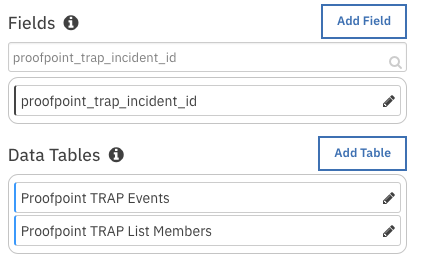
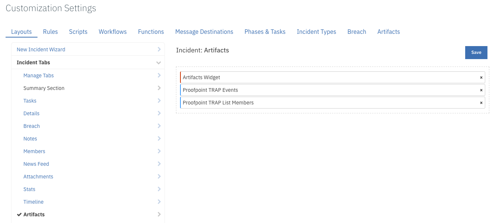
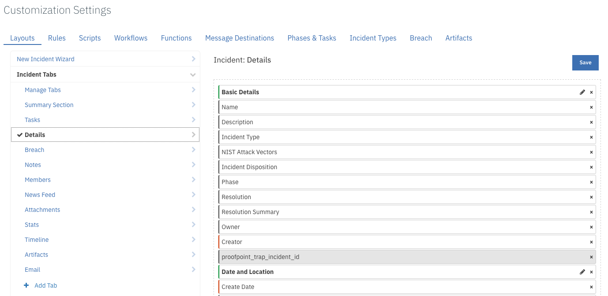

<!--
  This Install README.md is generated by running:
  "resilient-circuits docgen -p fn_proofpoint_trap --only-install-guide"

  It is best edited using a Text Editor with a Markdown Previewer. VS Code
  is a good example. Checkout https://guides.github.com/features/mastering-markdown/
  for tips on writing with Markdown

  If you make manual edits and run docgen again, a .bak file will be created

  Store any screenshots in the "doc/screenshots" directory and reference them like:
  
-->

# fn-proofpoint-trap Functions for IBM Resilient

- [Release Notes](#release-notes)
- [Overview](#overview)
- [Requirements](#requirements)
- [Installation](#installation)
- [Uninstall](#uninstall)
- [Troubleshooting](#troubleshooting)
- [Support](#support)

---

## Release Notes
<!--
  Specify all changes in this release. Do not remove the release 
  notes of a previous release
-->
### v1.0.0
* Initial Release

---

## Overview
<!--
  Provide a high-level description of the function itself and its remote software or application.
  The text below is parsed from the "description" and "long_description" attributes in the setup.py file
-->

Proofpoint Threat Response Auto-Pull (TRAP) enables messaging and security administrators to analyze emails and move malicious or unwanted emails to quarantine, after delivery. It follows forwarded mail and distribution lists, and creates an auditable activity trail.

The ProofPoint TRAP function package provides the following features:
* Poll a Proofpoint TRAP server for incidents and create corresponding incidents in the Resilient platform.
* Get Proofpoint TRAP incident details.
* Get a Proofpoint TRAP list member or members.
* Add a member to a Proofpoint TRAP list for artifacts of type host, IP address, or URL.
* Update a member of a Proofpoint TRAP list. 
* Delete a member from a Proofpoint TRAP list.  

---

## Requirements
<!--
  List any Requirements 
-->
* Resilient platform >= `v30.0.3476`
* An Integration Server running `resilient_circuits>=30.0.0`
  * To set up an Integration Server see: [ibm.biz/res-int-server-guide](https://ibm.biz/res-int-server-guide)

---

## Installation
* Download the `fn_proofpoint_trap-x.x.x.zip` from the app exchange.
* Copy the `.zip` to your Integration Server and SSH into it.
* **Unzip** the package:
  ```
  $ unzip fn_proofpoint_trap-x.x.x.zip
  ```
* **Install** the package:
  ```
  $ pip install fn_proofpoint_trap-x.x.x.tar.gz
  ```
* Import the **configurations** into your app.config file:
  ```
  $ resilient-circuits config -u -l fn-proofpoint-trap
  ```
* Import the fn_proofpoint_trap **customizations** into the Resilient platform:
  ```
  $ resilient-circuits customize -y -l fn-proofpoint-trap
  ```
* Open the config file, scroll to the bottom and edit your fn_proofpoint_trap configurations:
  ```
  $ nano ~/.resilient/app.config
  ```
  | Config | Required | Example | Description |
  | ------ | :------: | ------- | ----------- |
  | **base_url** | Yes | https://192.168.1.1/api | *Base URL of Proofpoint TRAP API* |
  | **api_key** | Yes | abcd1234-a123-123a-123a-123456abcdef | *API Key for Proofpoint TRAP* |
  | **polling_interval** | Yes | 2 | *Interval to poll TRAP in Minutes* |
  | **startup_interval** | Yes | 60 | *Initial Import Look-back Interval in minutes (default: 1 hour)* |
  | **state** | Yes | open | *State of Incidents to Query* |
  | **host_categories** | Yes | attacker,cnc,forensics,url | *Comma separated list of 'host' categories to check for artifacts. The default is forensics.* |
  | **cafile** | No | cafile=~/.resilient/trap/cert.cer | *Optional setting to use a ca certificate to access Proofpoint TRAP* |                            |                                    |
  | **http_proxy** or **https_proxy** | No | https://proxyhost:8080 | *Optional settings for access to Proofpoint TRAP via a proxy* |                                   |

* **Save** and **Close** the app.config file.
* [Optional]: Run selftest to test the Integration you configured:
  ```
  $ resilient-circuits selftest -l fn-proofpoint-trap
  ```
* **Run** resilient-circuits as follows, or restart the resilient-circuits service:
  ```
  $ resilient-circuits run
  ```
* **Run** resilient-circuits with extra logging:
  ```
  $ resilient-circuits run --loglevel=DEBUG
  ```
 
### Custom Layouts
<!--
  Use this section to provide guidance on where the user should add any custom fields and data tables.
  You may wish to recommend a new incident tab.
  You should save a screenshot "custom_layouts.png" in the doc/screenshots directory and reference it here
-->
* The package customizations includes the following custom field and data tables:
  
 
* In the Layouts tab, add the data table to the Artifacts tab and save:
     
   
* In the Layouts tab, add the custom field to the Details tab and save: 
   
---

## Uninstall
* SSH into your Integration Server.
* **Uninstall** the package:
  ```
  $ pip uninstall fn-proofpoint-trap
  ```
* Open the config file, scroll to the [fn_proofpoint_trap] section and remove the section or prefix `#` to comment out the section.
* **Save** and **Close** the app.config file.

---

## Troubleshooting
There are several ways to verify the successful operation of a function.

### Resilient Action Status
* When viewing an incident, use the Actions menu to view Action Status. By default, pending and errors are displayed.
* Modify the filter for actions to a®lso show Completed actions. Clicking on an action displays additional information on the progress made or what error occurred.

### Resilient Scripting Log
* A separate log file is available to review scripting errors. This is useful when issues occur in the pre-processing or post-processing scripts.
* The default location for this log file is: `/var/log/resilient-scripting/resilient-scripting.log`. 

### Resilient Logs
* By default, Resilient logs are retained at `/usr/share/co3/logs`.
* The `client.log` may contain additional information regarding the execution of functions.

### Resilient-Circuits
* Each function will create progress information.
* Failures will show up as errors and may contain python trace statements.

## Support
| Name | Version | Author | Support URL |
| ---- | ------- | ------ | ----------- |
| fn_proofpoint_trap | 1.0.0 | IBM Resilient Support | support@resilientsystems.com |