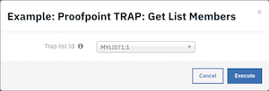
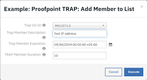

<!--
  This Install README.md is generated by running:
  "resilient-circuits docgen -p fn_proofpoint_trap --only-install-guide"

  It is best edited using a Text Editor with a Markdown Previewer. VS Code
  is a good example. Checkout https://guides.github.com/features/mastering-markdown/
  for tips on writing with Markdown

  If you make manual edits and run docgen again, a .bak file will be created

  Store any screenshots in the "doc/screenshots" directory and reference them like:
  
-->

- [Key Features](#key-features)
- [Poller](#poller)
- [Function - Proofpoint TRAP Get Incident Details](#function---proofpoint-trap-get-incident-details)
- [Function - Proofpoint TRAP Get List Members](#function---proofpoint-trap-get-list-members)
- [Function - Proofpoint TRAP Add Members to List](#function---proofpoint-trap-add-members-to-list)
- [Function - Proofpoint TRAP Update List Member](#function---proofpoint-trap-update-list-member)
- [Function - Proofpoint TRAP Delete List Member](#function---proofpoint-trap-delete-list-member)
- [Data Table - Proofpoint TRAP Events](#data-table---proofpoint-trap-events)
- [Data Table - Proofpoint TRAP List Members](#data-table---proofpoint-trap-list-members)
- [Custom Fields](#custom-fields)
- [Rules](#rules)

---

## Key Features
<!--
  Provide a high-level description of the function itself and its remote software or application.
  The text below is parsed from the "description" and "long_description" attributes in the setup.py file
-->

The ProofPoint TRAP function package provides the following features:
* Poll a Proofpoint TRAP server for incidents and create corresponding incidents in the Resilient platform.
* Get Proofpoint TRAP incident details.
* Get a Proofpoint TRAP list member or members.
* Add a member to a Proofpoint TRAP list for artifacts of type host, IP address, or URL.
* Update a member of a Proofpoint TRAP list. 
* Delete a member from a Proofpoint TRAP list.  

---

# Poller:

Threaded Poller which runs continuously while the integration is running.
* Polls a Proofpoint TRAP server for incidents and creates corresponding incidents in the Resilient platform.
* Adds Proofpoint TRAP events to incident data table `Proofpoint TRAP Events` in the Resilient platform.
* Adds artifacts to incidents in the Resilient platform corresponding to hosts artifacts in Proofpoint TRAP incident events. The actual artifacts added are determined by the `host_categories` configuration option. 
* Adds a note with Proofpoint TRAP events details to an incident in the Resilient platform.

#### Example incident created by the poller:

   

#### Examples of incident artifacts created by the poller:

   

---

# Functions:
## Function - Proofpoint TRAP: Get Incident Details
Fetch Incident Details from Proofpoint TRAP.
* Adds a note to the Resilient incident with ProofPoint TRAP incident details.
* Provides an example workflow which uses this Resilient Function, `Example: Proofpoint TRAP: Get Incident Details`. 

The workflow is initiated by the incident rule, `Example: Proofpoint TRAP: Get Incident Details`.

1. Open an incident and select `Example: Proofpoint TRAP: Get Incident Details` from Actions.

   

2. Click Action-> Example: Proofpoint TRAP: Get Incident Details. A note is added to the incident with the incident details in JSON format.
 

This invokes the `Example: Proofpoint TRAP: Get Incident Details` workflow, which calls the `Proofpoint TRAP: Get Incident Details` function.


<details><summary>Inputs:</summary>
<p>
</p>
</details>

| Config | Type | Required |Example | Description |
| ------ | :---: | :------: |------- | ----------- |
| `trap_incident_id` | `number` | Yes | `1` | Proofpoint TRAP Incident ID |


<details><summary>Outputs:</summary>
<p>

```python
results = {
    # TODO: Copy and paste an example of the Function Output within this code block.
    # To see view the output of a Function, run resilient-circuits in DEBUG mode and invoke the Function. 
    # The Function results will be printed in the logs: "resilient-circuits run --loglevel=DEBUG"
}
```

</p>
</details>

<details><summary>Example Pre-Process Script:</summary>
<p>

```python

inputs.trap_incident_id = incident.properties.proofpoint_trap_incident_id

```

</p>
</details>

<details><summary>Example Post-Process Script:</summary>
<p>

```python
note = "{}".format(unicode(results.data))
incident.addNote(helper.createRichText(note))
```

</p>
</details>

---

## Function - Proofpoint TRAP: Get List Members
Get member or members of a Proofpoint TRAP list.
* Retrives all the members of a Proofpoint TRAP list. Lists can be host list, url list, user list, or file list.
* Adds Proofpoint TRAP list members to incident data table `Proofpoint TRAP List Members` in the Resilient platform.
* Example workflows which use this Resilient Function include `Example: Proofpoint TRAP: Get List Members`.

The workflow is initiated by the incident rule, `Example: Proofpoint TRAP: Get List Members`.


1. Open an incident and select `Example: Proofpoint TRAP: Get List Members` from Actions.

   

2. Select a list ID from the displayed drop-down list and click Execute.  

    
    
    Note: The drop-down for list ID selection uses the format '&lt;list description&gt;:&lt;list id&gt;'.

This invokes the `Example: Proofpoint TRAP: Get List Members` workflow, which calls the `Proofpoint TRAP: Get List Members` function.
The data table `Proofpoint TRAP List Members` will be updated in the Resilient platform with the member details for the selected list.  

   

<details><summary>Inputs:</summary>
<p>
</p>
</details>

| Config | Type | Required |Example | Description |
| ------ | :---: | :------: |------- | ----------- |
| `trap_list_id` | `number` | Yes | `1` | Proofpoint TRAP List ID. |
| `trap_member_id` | `number` | No | `1` | Proofpoint TRAP List member ID. |
| `trap_members_type` | `number` | Yes | `members.json` | The Proofpoint TRAP information format to get in result for list membership. Default is members.json. |

<details><summary>Outputs:</summary>
<p>

```python
results = { 'inputs': {u'trap_list_id': 1, u'trap_members_type': u'members.json'},
          'metrics': {'package': 'fn-proofpoint-trap', 'timestamp': '2019-08-29 14:02:01', 'package_version': '1.0.0',
                      'host': 'myhost.com', 'version': '1.0', 'execution_time_ms': 27}, 'success': True,
          'content': [{u'user_id': None, u'description': u'IP to block', u'deleted': False, u'created_at': u'2017-01-11T03:47:15Z',
                       u'enabled': True, u'updated_at': u'2017-01-11T03:47:15Z',
                       u'host': {u'created_at': u'2017-01-11T03:47:15Z', u'updated_at': u'2017-01-11T03:47:15Z',
                                 u'host': u'75.76.13.144', u'ttl': 0, u'resolution_state': 4, u'id': 20
                                 },
                       u'response_id': None, u'expiration': u'2018-12-18T19:08:56Z', u'list_id': 2, u'host_id': 20,
                       u'hash_reputation_id': None, u'id': 8, u'reverse_user_id': None
                      },
                      {u'user_id': None, u'description': u'test', u'deleted': False, u'created_at': u'2017-01-11T03:43:54Z',
                       u'enabled': True, u'updated_at': u'2017-01-11T03:43:54Z',
                       u'host': {u'created_at': u'2016-12-29T04:56:13Z', u'updated_at': u'2017-01-13T00:45:16Z',
                                 u'host': u'string', u'ttl': 0, u'resolution_state': 4, u'id': 6
                                },
                       u'response_id': None, u'expiration': None, u'list_id': 2, u'host_id': 6, u'hash_reputation_id': None,
                       u'id': 6, u'reverse_user_id': None
                       }],
          'raw': '[{"user_id": null, "description": "IP to block", "deleted": false, "created_at": "2017-01-11T03:47:15Z", '
                 '"enabled": true, "updated_at": "2017-01-11T03:47:15Z", "host": {"created_at": "2017-01-11T03:47:15Z", '
                 '"updated_at": "2017-01-11T03:47:15Z", "host": "75.76.13.144", "ttl": 0, "resolution_state": 4, "id": 20}, '
                 '"response_id": null, "expiration": "2018-12-18T19:08:56Z", "list_id": 2, "host_id": 20, '
                 '"hash_reputation_id": null, "id": 8, "reverse_user_id": null}, {"user_id": null, "description": "test", '
                 '"deleted": false, "created_at": "2017-01-11T03:43:54Z", "enabled": true, "updated_at": "2017-01-11T03:43:54Z", '
                 '"host": {"created_at": "2016-12-29T04:56:13Z", "updated_at": "2017-01-13T00:45:16Z", "host": "string", '
                 '"ttl": 0, "resolution_state": 4, "id": 6}, "response_id": null, "expiration": null, "list_id": 2, '
                 '"host_id": 6, "hash_reputation_id": null, "id": 6, "reverse_user_id": null}]', 
          'reason': None,
          'version': '1.0'
}
```

</p>
</details>

<details><summary>Example Pre-Process Script:</summary>
<p>

```python
import re
if re.match("^.*:\d+$", rule.properties.trap_list_id):
    inputs.trap_list_id = rule.properties.trap_list_id.split(":")[1]
else:
    raise ValueError("Required field: '{0}' with value: '{1}' is in an incorrect format.".format("rule.properties.trap_list_id", rule.properties.trap_list_id))
inputs.trap_list_id = rule.properties.trap_list_id.split(":")[1]
inputs.trap_members_type = "members.json"
```

</p>
</details>

<details><summary>Example Post-Process Script:</summary>
<p>

```python
##  ProofPoint Trap - fn_proofpoint_trap_get_list_members ##
# Example result:
"""
Result: { 'inputs': {u'trap_list_id': 1, u'trap_members_type': u'members.json'},
          'metrics': {'package': 'fn-proofpoint-trap', 'timestamp': '2019-08-29 14:02:01', 'package_version': '1.0.0',
                      'host': 'myhost.com', 'version': '1.0', 'execution_time_ms': 27}, 'success': True,
          'content': [{u'user_id': None, u'description': u'IP to block', u'deleted': False, u'created_at': u'2017-01-11T03:47:15Z',
                       u'enabled': True, u'updated_at': u'2017-01-11T03:47:15Z',
                       u'host': {u'created_at': u'2017-01-11T03:47:15Z', u'updated_at': u'2017-01-11T03:47:15Z',
                                 u'host': u'75.76.13.144', u'ttl': 0, u'resolution_state': 4, u'id': 20
                                 },
                       u'response_id': None, u'expiration': u'2018-12-18T19:08:56Z', u'list_id': 2, u'host_id': 20,
                       u'hash_reputation_id': None, u'id': 8, u'reverse_user_id': None
                      },
                      {u'user_id': None, u'description': u'test', u'deleted': False, u'created_at': u'2017-01-11T03:43:54Z',
                       u'enabled': True, u'updated_at': u'2017-01-11T03:43:54Z',
                       u'host': {u'created_at': u'2016-12-29T04:56:13Z', u'updated_at': u'2017-01-13T00:45:16Z',
                                 u'host': u'string', u'ttl': 0, u'resolution_state': 4, u'id': 6
                                },
                       u'response_id': None, u'expiration': None, u'list_id': 2, u'host_id': 6, u'hash_reputation_id': None,
                       u'id': 6, u'reverse_user_id': None
                       }],
          'raw': '[{"user_id": null, "description": "IP to block", "deleted": false, "created_at": "2017-01-11T03:47:15Z", '
                 '"enabled": true, "updated_at": "2017-01-11T03:47:15Z", "host": {"created_at": "2017-01-11T03:47:15Z", '
                 '"updated_at": "2017-01-11T03:47:15Z", "host": "75.76.13.144", "ttl": 0, "resolution_state": 4, "id": 20}, '
                 '"response_id": null, "expiration": "2018-12-18T19:08:56Z", "list_id": 2, "host_id": 20, '
                 '"hash_reputation_id": null, "id": 8, "reverse_user_id": null}, {"user_id": null, "description": "test", '
                 '"deleted": false, "created_at": "2017-01-11T03:43:54Z", "enabled": true, "updated_at": "2017-01-11T03:43:54Z", '
                 '"host": {"created_at": "2016-12-29T04:56:13Z", "updated_at": "2017-01-13T00:45:16Z", "host": "string", '
                 '"ttl": 0, "resolution_state": 4, "id": 6}, "response_id": null, "expiration": null, "list_id": 2, '
                 '"host_id": 6, "hash_reputation_id": null, "id": 6, "reverse_user_id": null}]', 
          'reason': None,
          'version': '1.0'
}
"""
#  Globals
# List of fields in datatable fn_proofpoint_trap_get_list_members script
DATA_TBL_FIELDS = ["query_execution_time", "member_id", "list_id", "member_description", "expiration", "created_at", "status"]
DATA_TBL_FIELDS_HOST = ["created_at", "updated_at", "host", "resolution_state", "ttl"]
FN_NAME = "fn_proofpoint_trap_get_list_members"
WF_NAME = "Example: Proofpoint TRAP: Get List Members"
MEMBERS = results.content
INPUTS = results.inputs
QUERY_EXECUTION_DATE = results["metrics"]["timestamp"]

# Processing


def main():
    note_text = ''
    if MEMBERS is not None:
        note_text = "ProofPoint Trap Integration Integration: Workflow <b>{0}</b>: There were <b>{1}</b> results returned for Resilient function " \
                   "<b>{2}</b>".format(WF_NAME, len(MEMBERS), FN_NAME)
        for i in range(len(MEMBERS)):
            newrow = incident.addRow("trap_list_members")
            newrow.query_execution_date = QUERY_EXECUTION_DATE
            newrow.member_id = MEMBERS[i]["id"]
            newrow.member_description = MEMBERS[i]["description"]
            for f in DATA_TBL_FIELDS:
                if f in ["query_execution_time", "member_id", "member_description", "status"]:
                    continue
                if MEMBERS[i][f] is not None:
                    newrow[f] = MEMBERS[i][f]
                if MEMBERS[i]["enabled"]:
                    newrow.status = "Enabled"
                host = MEMBERS[i]["host"]
                if host is not None:
                    for d in DATA_TBL_FIELDS_HOST:
                        newrow[d] = host[d]
    else:
        noteText += "ProofPoint Trap Integration: Workflow <b>{0}</b>: There were <b>no</b> results returned  for " \
                    "list id <b>{1}</b> for Resilient function <b>{3}</b>".format(WF_NAME, INPUTS["trap_list_id"], FN_NAME)

    incident.addNote(helper.createRichText(note_text))

if __name__ == "__main__":
    main()
```

</p>
</details>
---

## Function - Proofpoint TRAP: Add Members to List
Add a member or members to a Proofpoint TRAP list.
* Adds a new host, IP address, URL, user account or hash member to a Proofpoint TRAP list. List can be host list, URL list, user list, or file list.
* Adds the new Proofpoint TRAP list member details to the incident data table `Proofpoint TRAP List Members` in the Resilient platform.
* An example workflow that uses this Resilient Function includes `Example: Proofpoint TRAP: Add Member to List`. The workflow is applicable for Resilient artifact types: 'URL', 'User Account', 'DNS Name', 'IP Address', System Name', 'Malware SHA-256 Hash', 'Malware SHA-1 Hash' and 'Malware MD5 Hash'. 

The workflow is initiated by the incident rule, `Example: Proofpoint TRAP: Add Member to List`.

1. Open an incident and select the 'Artifacts' tab.
2. For a Resilient artifact of an applicable type, such as 'IP Address,’ click Action-> `Example: Proofpoint TRAP: Add Member to List`.

   

3. Select an input from a list of user defined inputs.  For example, select Proofpoint TRAP list ID 1 from the drop-down. 

   
   
   Note: The drop-down for list ID selection uses the format '&lt;list description&gt;:&lt;list id&gt;'.
 
4.  Input values for the remainder of the fields and click Execute.  This invokes the `Example: Proofpoint TRAP: Add Member to List` workflow, which calls the `Proofpoint 
TRAP: Add Members to List` function. 


The data table `Proofpoint TRAP List Members`, is updated in the Resilient platform with the member details for the selected list.

   

<details><summary>Inputs:</summary>
<p>

| Name | Type | Required | Example | Tooltip |
| ---- | :--: | :------: | ------- | ------- |
| `trap_description` | `text` | No | `-` | Short description of Proofpoint TRAP list member. |
| `trap_duration` | `number` | No | `-` | Number of minutes after which to expire Proofpoint TRAP list membership.  |
| `trap_expiration` | `datetimepicker` | No | `-` | Timestamp to expire Proofpoint TRAP list member. |
| `trap_list_id` | `number` | Yes | `-` | Proofpoint TRAP List ID. |
| `trap_member` | `text` | Yes | `-` | Proofpoint TRAP List member to add. Can be of type host, IP address, or URL. |

</p>
</details>

<details><summary>Outputs:</summary>
<p>

```python
results = {
    # TODO: Copy and paste an example of the Function Output within this code block.
    # To see view the output of a Function, run resilient-circuits in DEBUG mode and invoke the Function. 
    # The Function results will be printed in the logs: "resilient-circuits run --loglevel=DEBUG"
}
```

</p>
</details>

<details><summary>Example Pre-Process Script:</summary>
<p>

```python
import re
inputs.trap_member = artifact.value
inputs.trap_description = rule.properties.trap_description
if re.match("^.*:\d+$", rule.properties.trap_list_id):
    inputs.trap_list_id = rule.properties.trap_list_id.split(":")[1]
else:
    raise ValueError("Required field: '{0}' with value: '{1}' is in an incorrect format.".format("rule.properties.trap_list_id", rule.properties.trap_list_id))
inputs.trap_expiration =  rule.properties.trap_expiration
inputs.trap_duration =  rule.properties.trap_duration
```

</p>
</details>

<details><summary>Example Post-Process Script:</summary>
<p>

```python
##  ProofPoint Trap - fn_proofpoint_trap_add_members_to_list ##
# Example result:
"""
Result: {'inputs': {u'trap_list_id': 1, u'trap_member': u'75.76.13.144', u'trap_description': u'A test',
                    u'trap_expiration': 1567526694000, u'trap_duration': 10},
         'metrics': {'package': 'fn-proofpoint-trap', 'timestamp': '2019-09-03 17:05:06', 'package_version': '1.0.0',
                     'host': 'myhost.ibm.com', 'version': '1.0', 'execution_time_ms': 3512},
         'success': True,
         'content': {u'user_id': None, u'description': u'IP to block', u'deleted': False,
                     u'created_at': u'2017-01-11T03:47:15Z', u'enabled': True, u'updated_at': u'2017-01-11T03:47:15Z',
                     u'host': {u'created_at': u'2017-01-11T03:47:15Z', u'updated_at': u'2017-01-11T03:47:15Z',
                               u'host': u'75.76.13.144', u'ttl': 0, u'resolution_state': 4, u'id': 20
                               },
                     u'response_id': None, u'expiration': u'2018-12-18T19:08:56Z', u'list_id': 1, u'host_id': 20,
                     u'hash_reputation_id': None, u'id': 8, u'reverse_user_id': None},
         'raw': '{"user_id": null, "description": "IP to block", "deleted": false, "created_at": "2017-01-11T03:47:15Z", '
                '"enabled": true, "updated_at": "2017-01-11T03:47:15Z", "host": {"created_at": "2017-01-11T03:47:15Z", '
                '"updated_at": "2017-01-11T03:47:15Z", "host": "75.76.13.144", "ttl": 0, "resolution_state": 4, "id": 20}, '
                '"response_id": null, "expiration": "2018-12-18T19:08:56Z", "list_id": 1, "host_id": 20, '
                '"hash_reputation_id": null, "id": 8, "reverse_user_id": null}',
         'reason': None,
         'version': '1.0'
}
"""
#  Globals
# List of fields in datatable fn_proofpoint_trap_add_members_to_list script
DATA_TBL_FIELDS = ["query_execution_time", "member_id", "list_id", "member_description", "expiration", "created_at", "status"]
DATA_TBL_FIELDS_HOST = ["created_at", "updated_at", "host", "resolution_state", "ttl"]
FN_NAME = "fn_proofpoint_trap_add_members_to_list"
WF_NAME = "Example: Proofpoint TRAP: Get List Members"
MEMBER = results.content
INPUTS = results.inputs
QUERY_EXECUTION_DATE = results["metrics"]["timestamp"]

# Processing


def main():
    note_text = ''
    if MEMBER is not None:
        note_text = "ProofPoint Trap Integration Integration: Workflow <b>{0}</b>: There was a valid result returned for Resilient function " \
                   "<b>{1}</b>".format(WF_NAME, FN_NAME)

        newrow = incident.addRow("trap_list_members")
        newrow.query_execution_date = QUERY_EXECUTION_DATE
        newrow.member_id = MEMBER["id"]
        newrow.member_description = MEMBER["description"]
        for f in DATA_TBL_FIELDS:
            if f in ["query_execution_time", "member_id", "member_description", "status"]:
                continue
            if MEMBER[f] is not None:
                  newrow[f] = MEMBER[f]
        if MEMBER["enabled"]:
            newrow.status = "Enabled"
        host = MEMBER["host"]
        if host is not None:
            for d in DATA_TBL_FIELDS_HOST:
                newrow[d] = host[d]


    else:
        noteText += "ProofPoint Trap Integration: Workflow <b>{0}</b>: There were <b>no</b> results returned  for " \
                    "list id <b>{1}</b> for Resilient function <b>{3}</b>".format(WF_NAME, INPUTS["trap_list_id"], FN_NAME)

    incident.addNote(helper.createRichText(note_text))

if __name__ == "__main__":
    main()
```

</p>
</details>

---
## Function - Proofpoint TRAP: Update List Member
Update a member of a Proofpoint TRAP list.
* Updates an existing member of a Proofpoint TRAP list by specifying the list and the member to update.
* Refreshes Proofpoint TRAP list member details for the incident data table `Proofpoint TRAP List Members` in the Resilient platform.
* An example workflow that uses this Resilient Function includes `Example: Proofpoint TRAP: Update List Member`.
* The workflow is applicable for populated rows of incident data table `Proofpoint TRAP List Members` in the Resilient platform.

The workflow is initiated by the data table rule, `Example: Proofpoint TRAP: Update List Member`.

1. Open an incident and select the row of data table `Proofpoint TRAP List Members`corresponding to the list member to update.
2. From the selected row’s actions menu, select `Example: Proofpoint TRAP: Update List Member`.

   

3. In the list of user defined inputs, enter values for the displayed fields and click Execute.

   

This invokes the `Example: Proofpoint TRAP: Update List Member` workflow, which calls the `Proofpoint TRAP: Update List Member` function.
The data table `Proofpoint TRAP List Members` is refreshed in the Resilient platform with the updated member details for the selected list.

   

<details><summary>Inputs:</summary>
<p>

| Name | Type | Required | Example | Tooltip |
| ---- | :--: | :------: | ------- | ------- |
| `trap_description` | `text` | No | `-` | Short description of Proofpoint TRAP list member. |
| `trap_duration` | `number` | No | `-` | Number of minutes after which to expire Proofpoint TRAP list membership. |
| `trap_expiration` | `datetimepicker` | No | `-` | Timestamp to expire Proofpoint TRAP list member. |
| `trap_list_id` | `number` | Yes | `-` | Proofpoint TRAP List ID. |
| `trap_member_id` | `number` | Yes | `-` | Proofpoint TRAP List member ID. |

</p>
</details>

<details><summary>Outputs:</summary>
<p>

```python
results = {
    # TODO: Copy and paste an example of the Function Output within this code block.
    # To see view the output of a Function, run resilient-circuits in DEBUG mode and invoke the Function. 
    # The Function results will be printed in the logs: "resilient-circuits run --loglevel=DEBUG"
}
```

</p>
</details>

<details><summary>Example Pre-Process Script:</summary>
<p>

```python
inputs.trap_list_id = row.list_id
inputs.trap_member_id = row.member_id
inputs.trap_description = rule.properties.trap_description
inputs.trap_expiration =  rule.properties.trap_expiration
inputs.trap_duration =  rule.properties.trap_duration
```

</p>
</details>

<details><summary>Example Post-Process Script:</summary>
<p>

```python
##  ProofPoint Trap - fn_proofpoint_trap_update_list_member ##
# Example result:

"""
Results {'inputs': {u'trap_list_id': 2, u'trap_expiration': 1567527591000, u'trap_description': u'Test',
                    u'trap_member_id': 8, u'trap_duration': 10},
         'metrics': {'package': 'fn-proofpoint-trap', 'timestamp': '2019-09-03 17:19:57', 'package_version': '1.0.0',
                     'host': 'myhost.ibm.com', 'version': '1.0', 'execution_time_ms': 33
                     }, 'success': True,
         'content': {u'user_id': None, u'description': u'Updated IP to block', u'deleted': False,
                     u'created_at': u'2017-01-11T03:47:15Z', u'enabled': True, u'updated_at': u'2017-01-11T03:47:15Z',
                     u'host': {u'created_at': u'2017-01-11T03:47:15Z', u'updated_at': u'2017-01-11T03:47:15Z',
                               u'host': u'75.76.13.144', u'ttl': 0, u'resolution_state': 4, u'id': 20
                               },
                     u'response_id': None, u'expiration': u'2018-12-18T19:08:56Z', u'list_id': 2, u'host_id': 20,
                     u'hash_reputation_id': None, u'id': 8, u'reverse_user_id': None
                     },
         'raw': '{"user_id": null, "description": "Updated IP to block", "deleted": false, "created_at": "2017-01-11T03:47:15Z", '
                '"enabled": true, "updated_at": "2017-01-11T03:47:15Z", "host": {"created_at": "2017-01-11T03:47:15Z", '
                '"updated_at": "2017-01-11T03:47:15Z", "host": "75.76.13.144", "ttl": 0, "resolution_state": 4, "id": 20}, '
                '"response_id": null, "expiration": "2018-12-18T19:08:56Z", "list_id": 2, "host_id": 20, "hash_reputation_id": null, '
                '"id": 8, "reverse_user_id": null}',
         'reason': None,
         'version': '1.0'
}
"""

#  Globals
# List of fields in datatable "Proofpoint TRAP List Members" for fn_proofpoint_trap_get_list_members script
DATA_TBL_FIELDS = ["query_execution_time", "member_id", "list_id", "member_description", "expiration", "created_at", "status"]
DATA_TBL_FIELDS_HOST = ["created_at", "updated_at", "host", "resolution_state", "ttl"]
FN_NAME = "fn_proofpoint_trap_update_list_member"
WF_NAME = "Example: Proofpoint TRAP: Update List Member"
MEMBER = results.content
QUERY_EXECUTION_DATE = results["metrics"]["timestamp"]

# Processing


def main():
    note_text = ''
    if MEMBER is not None:
        note_text = "ProofPoint Trap Integration Integration: Workflow <b>{0}</b>: There was a valid result returned for Resilient function " \
                   "<b>{1}</b>".format(WF_NAME, FN_NAME)

        row.query_execution_date = QUERY_EXECUTION_DATE
        row.member_id = MEMBER["id"]
        row.member_description = MEMBER["description"]
        for f in DATA_TBL_FIELDS:
            if f in ["query_execution_time", "member_id", "member_description", "status"]:
                continue
            if MEMBER[f] is not None:
                  row[f] = MEMBER[f]
        if MEMBER["enabled"]:
            row.status = "Enabled"
        host = MEMBER["host"]
        if host is not None:
            for d in DATA_TBL_FIELDS_HOST:
                row[d] = host[d]
    else:
        noteText += "ProofPoint Trap Integration: Workflow <b>{0}</b>: There were <b>no</b> results returned  for " \
                    "list id <b>{1}</b> for Resilient function <b>{3}</b>".format(WF_NAME, INPUTS["trap_list_id"], FN_NAME)

    incident.addNote(helper.createRichText(note_text))

if __name__ == "__main__":
    main()
```

</p>
</details>

---
## Function - Proofpoint TRAP: Delete List Member
Delete the member of a Proofpoint TRAP list.
* Deletes a member of a Proofpoint TRAP list by specifying the list and the member to update.
* Updates the deleted Proofpoint TRAP list member details for the selected incident data table `Proofpoint TRAP List Members` row in the Resilient platform.
* An example workflow that uses this Resilient Function includes `Example: Proofpoint TRAP: Delete List Member`.
* The workflow is applicable for incident data table `Proofpoint TRAP List Members` populated rows in the Resilient platform.

The workflow is initiated by the data table rule, `Example: Proofpoint TRAP: Delete List Member`.

1. Open an incident and select the row of data table `Proofpoint TRAP List Members`corresponding to the list member to delete.
2. From the selected row’s actions menu, select `Example: Proofpoint TRAP: Delete List Member`.

   

3. Click on the action to execute. This invokes the `Example: Proofpoint TRAP: Delete List Member` workflow, which calls the `Proofpoint TRAP: Delete List Member` function.

The data table `Proofpoint TRAP List Members` will be refreshed in the Resilient platform for the deleted member with `Status` set to `Deleted`.
   
   

<details><summary>Inputs:</summary>
<p>

| Name | Type | Required | Example | Tooltip |
| ---- | :--: | :------: | ------- | ------- |
| `trap_list_id` | `number` | Yes | `-` | Proofpoint TRAP List ID. |
| `trap_member_id` | `number` | Yes | `-` | Proofpoint TRAP List member ID. |

</p>
</details>

<details><summary>Outputs:</summary>
<p>

```python
results = {
    # TODO: Copy and paste an example of the Function Output within this code block.
    # To see view the output of a Function, run resilient-circuits in DEBUG mode and invoke the Function. 
    # The Function results will be printed in the logs: "resilient-circuits run --loglevel=DEBUG"
}
```

</p>
</details>

<details><summary>Example Pre-Process Script:</summary>
<p>

```python
inputs.trap_list_id = row.list_id
inputs.trap_member_id = row.member_id
```

</p>
</details>

<details><summary>Example Post-Process Script:</summary>
<p>

```python
##  ProofPoint Trap - fn_proofpoint_trap_delete_list_member##
# Example result:

"""
Results {'inputs': {u'trap_list_id': 1, u'trap_member_id': 8},
         'metrics': {'package': 'fn-proofpoint-trap', 'timestamp': '2019-09-04 17:06:02', 'package_version': '1.0.0',
                     'host': 'myhost.ibm.com', 'version': '1.0', 'execution_time_ms': 39
                     },
         'success': True,
         'content': 'OK',
         'raw': '"OK"',
         'reason': None,
         'version': '1.0'
}
"""
#  Globals
# List of fields in datatable "Proofpoint TRAP List Members" for fn_proofpoint_trap_delete_list_member script
DATA_TBL_FIELDS = ["query_execution_time", "status"]
FN_NAME = "fn_proofpoint_trap_delete_list_member"
WF_NAME = "Example: Proofpoint TRAP: Delete List Member"
STATUS = results.content
INPUTS = results.inputs
QUERY_EXECUTION_DATE = results["metrics"]["timestamp"]

# Processing


def main():
    note_text = ''
    if STATUS is not None:
        note_text = "ProofPoint Trap Integration Integration: Workflow <b>{0}</b>: There was a valid result returned for Resilient function " \
                   "<b>{1}</b>".format(WF_NAME, FN_NAME)

        row.query_execution_date = QUERY_EXECUTION_DATE
        if STATUS.lower() == "ok":
            row.status = "Deleted"

    else:
        noteText += "ProofPoint Trap Integration: Workflow <b>{0}</b>: There were <b>no</b> results returned  for " \
                    "list id <b>{1}</b> for Resilient function <b>{3}</b>".format(WF_NAME, INPUTS["trap_list_id"], FN_NAME)

    incident.addNote(helper.createRichText(note_text))

if __name__ == "__main__":
    main()
```

</p>
</details>
---

# Data tables:
## Data Table - Proofpoint TRAP Events
This data table is populated by the `poller` for each Resilient incident and has an entry for each event detected in the corresponding Proofpoint incident.
 
   

#### API Name:
proofpoint_trap_events

#### Columns:
| Column Name | API Access Name | Type | Tooltip |
| ----------- | --------------- | ---- | ------- |
| Attack Direction | `event_attackdirection` | `text` | - |
| Event Category | `event_category` | `text` | - |
| Description | `event_description` | `text` | - |
| Event Id | `event_id` | `number` | - |
| Event Received | `event_received` | `text` | - |
| Severity | `event_severity` | `text` | - |
| Source | `event_source` | `text` | - |
| State | `event_state` | `text` | - |
| Threat Name | `event_threatname` | `text` | - |

---
## Data Table - Proofpoint TRAP List Members
This data table is typically initiallly populated by a workflow using the Function `Proofpoint TRAP: Get List Members`. An entry is created for all members selected in the workflow. 

The data table is also updated by functions `Proofpoint TRAP: Add Members to List`, `Proofpoint TRAP: Update List Member` and `Proofpoint TRAP: Delete List Member`.

   

#### API Name:
trap_list_members

#### Columns:
| Column Name | API Access Name | Type | Tooltip |
| ----------- | --------------- | ---- | ------- |
| Created At | `created_at` | `text` | - |
| Expiration Date | `expiration` | `text` | - |
| Host | `host` | `text` | - |
| List Id | `list_id` | `number` | - |
| Member Description | `member_description` | `text` | - |
| Member Id | `member_id` | `number` | - |
| Query Execution Date | `query_execution_date` | `text` | - |
| Resolution State | `resolution_state` | `text` | - |
| Status | `status` | `text` | - |
| TTL | `ttl` | `number` | - |
| Updated At | `updated_at` | `text` | - |
---

## Custom Fields
| Label | API Access Name | Type | Prefix | Placeholder | Tooltip |
| ----- | --------------- | ---- | ------ | ----------- | ------- |
| proofpoint_trap_incident_id | `proofpoint_trap_incident_id` | `number` | `properties` | - | Proofpoint TRAP incident ID. |

---


## Rules
| Rule Name | Object | Workflow Triggered |
| --------- | ------ | ------------------ |
| Example: Proofpoint TRAP: Get Incident Details | incident | `wf_proofpoint_trap_get_incident_details` |
| Example: Proofpoint TRAP: Get List Members | incident | `wf_proofpoint_trap_get_list_members` |
| Example: Proofpoint TRAP: Add Member to List | artifact | `wf_proofpoint_trap_add_member_to_list` |
| Example: Proofpoint TRAP: Update List Member | trap_list_members | `wf_proofpoint_trap_update_list_member` |
| Example: Proofpoint TRAP: Delete List Member | trap_list_members| `wf_proofpoint_trap_delete_list_member` |

---

<!--
## Inform Resilient Users
  Use this section to optionally provide additional information so that Resilient playbook 
  designer can get the maximum benefit of your integration.
-->