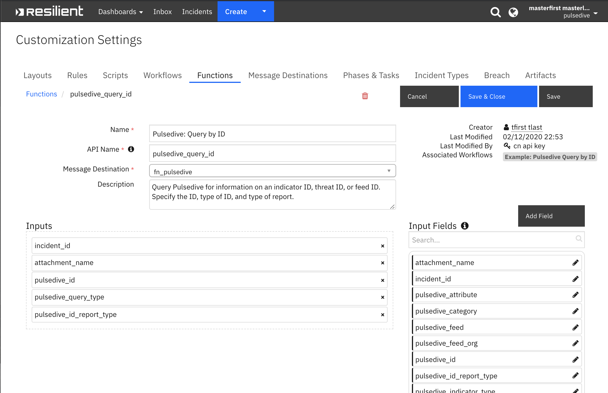
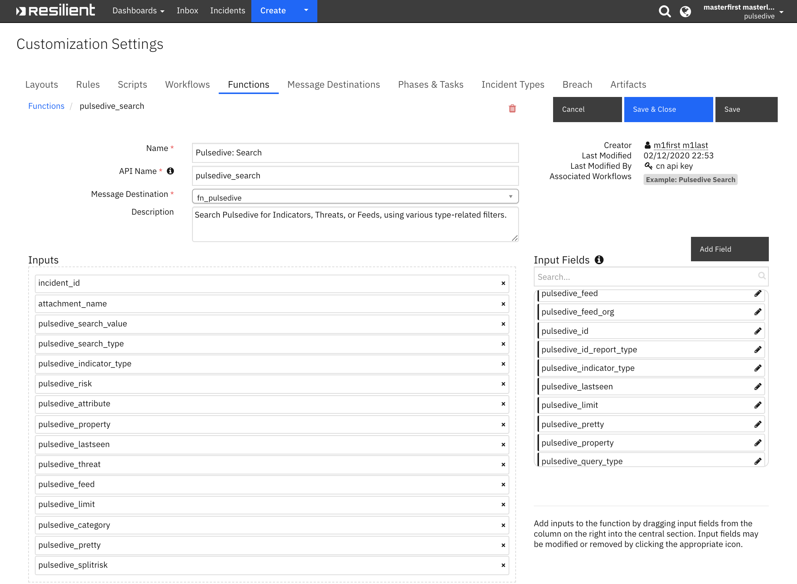
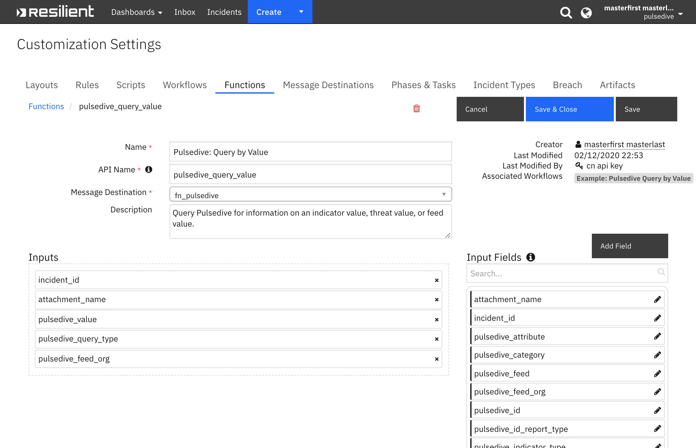

<!--
  This User README.md is generated by running:
  "resilient-sdk docgen -p fn_pulsedive --user-guide"

  It is best edited using a Text Editor with a Markdown Previewer. VS Code
  is a good example. Checkout https://guides.github.com/features/mastering-markdown/
  for tips on writing with Markdown

  If you make manual edits and run docgen again, a .bak file will be created

  Store any screenshots in the "doc/screenshots" directory and reference them like:
  
-->

# **User Guide:** fn_pulsedive_v1.0.0

## Table of Contents
- [Key Features](#key-features)
- [Function - Pulsedive: Query by ID](#function---pulsedive-query-by-id)
- [Function - Pulsedive: Query by Value](#function---pulsedive-query-by-value)
- [Function - Pulsedive: Search](#function---pulsedive-search)
- [Custom Artifact Types](#custom-artifact-types)
- [Rules](#rules)

---

## Key Features
The Resilient integration with Pulsedive provides the capability to access Pulsedive's
IOC data collection, from the IBM Resilient Soar Platform. Key features of this integration:
* Query Pulsedive by ID of an indicator, threat, or feed and get information such as linked indicators, 
properties, summary
* Query Pulsedive by an IP address, a DNS, a threat name or alias, or a feed name and organization
* Search Pulsedive for all indicators, threats, or feeds, using a variety of search filters

Result summaries will be written to an Incident Note and details will be written to an Incident Attachment.

---

## Function - Pulsedive: Query by ID
Query Pulsedive for information on an indicator ID, threat ID, or feed ID. Specify the ID, type of ID, and type of report.

 

<details><summary>Inputs:</summary>
<p>

| Name | Type | Required | Example | Tooltip |
| ---- | :--: | :------: | ------- | ------- |
| `pulsedive_query_type` | `select` | Yes | `Indicator` | Specify the type of ID or Value: Indicator, Threat, or Feed |
| `pulsedive_id` | `number` | Yes | `12345` | Enter a Pulsedive Indicator ID, Threat ID, or Feed ID |
| `pulsedive_id_report_type` | `select` | Yes | `By ID` | Select the report desired, based on the Indicator ID, Threat ID, or Feed ID |
| `attachment_name` | `text` | No | `e.g., pulsedive_ind_12345_byid.txt` | Name of attachment: full api response will be written to this file |

</p>
</details>

<details><summary>Outputs:</summary>
<p>


```python
results = {
    "iid": 2,
    "type": "domain",
    "indicator": "alvoportas.com.br",
    "risk": "low",
    "risk_recommended": "low",
    "manualrisk": 0,
    "retired": "No recent activity",
    "stamp_added": "2017-09-27 18:11:38",
    "stamp_updated": "2019-11-11 20:47:04",
    "stamp_seen": "2019-06-30 17:29:31",
    "stamp_probed": "2019-06-30 17:29:33",
    "stamp_retired": "2019-10-03 01:39:22",
    "recent": 0,
    "riskfactors": [
        {
            "rfid": 2,
            "description": "found in third-party feeds",
            "risk": "medium"
        },
        ...
    ]
    ...    
}
```

</p>
</details>

<details><summary>Workflows</summary>

  <details><summary>Example Pre-Process Script:</summary>
  <p>

  ```python
  inputs.incident_id = incident.id

# custom artifact of type integer
inputs.pulsedive_id = artifact.value

# id type: indicator, threat, or feed
inputs.pulsedive_query_type = rule.properties.pulsedive_query_type

# report type: recent info, links, summary, history 
inputs.pulsedive_id_report_type = rule.properties.pulsedive_id_report_type
  ```

  </p>
  </details>

  <details><summary>Example Post-Process Script:</summary>
  <p>

  ```python
  # Get the results and post a summary to an incident note
summary = {}
for x in results["content"].keys():
  if x in ["iid", "tid", "fid", "indicator", "threat", "feed", "organization", "type", "risk", "stamp_updated"]:
    summary[x] = results["content"][x]

# create text for summary counts
count_text = ""
for y in results["counts"].keys():
  count_text += "{} count: {} \n".format(y, results["counts"][y])

note_text = u"Pulsedive {} query results on ID '{}': \n \
GET url: {} \n \
=== Summary: \n{}\n \
counts: \n{}\n \
For full dataset, see attachment '{}'".format(
results["fn_inputs"]["query_type"], results["fn_inputs"]["query_id"], 
results["url"], summary, count_text, results["fn_inputs"]["attachment_name"]
)

# Create note text
note = helper.createPlainText(note_text)

# Create incident note
incident.addNote(note)

  ```

  </p>
  </details>

</details>

---
## Function - Pulsedive: Search
Search Pulsedive for Indicators, Threats, or Feeds, using various type-related filters.

 

<details><summary>Inputs:</summary>
<p>

| Name | Type | Required | Example | Tooltip |
| ---- | :--: | :------: | ------- | ------- |
| `attachment_name` | `text` | No | `e.g., my_pulsedive_attachment.txt` | Name of attachment: full api response will be written to this file |
| `incident_id` | `number` | Yes | `-` | - |
| `pulsedive_attribute` | `text` | No | `e.g., http, https, 443, jQuery UI, Java, Google Analytics, Subdomain, Name Server` | For Pulsedive Search on Indicators or Threats, enter comma-separated values for ports, protocols, and technology. |
| `pulsedive_category` | `multiselect` | No | `-` | For Pulsedive Search on Threats or Feeds, filter by one or more categories. |
| `pulsedive_export` | `select` | No | `-` | Exports Indicator search results to a CSV file |
| `pulsedive_feed` | `text` | No | `e.g., zeus bad domains, zeus bad ips` | For Pulsedive Search on Indicators, enter comma-separated values for feed names. |
| `pulsedive_indicator_type` | `multiselect` | No | `-` | For Pulsedive Search on Indicators, choose any of the indicator types. |
| `pulsedive_lastseen` | `select` | No | `-` | For Pulsedive Search on Indicators, "lastseen" can be "day", "week", "month", or left empty for all-time. |
| `pulsedive_limit` | `select` | No | `-` | For Pulsedive Search on Indicators, results "limit" can be "hundred", "thousand", "tenthousand".  |
| `pulsedive_pretty` | `select` | No | `-` | Option to pretty-print json output in attachment |
| `pulsedive_property` | `text` | No | `-` | - |
| `pulsedive_risk` | `multiselect` | No | `-` | For Pulsedive Search on Indicators or Threats, filter by risk type(s). |
| `pulsedive_search_type` | `select` | No | `-` | Select the type of search to perform on Pulsedive. |
| `pulsedive_search_value` | `text` | No | `-` | Enter a string to search on |
| `pulsedive_splitrisk` | `select` | No | `-` | Option to split out indicator counts by risk |
| `pulsedive_threat` | `text` | No | `e.g., zeus, banjori` | For Pulsedive Search on Indicators, enter comma-separated values of threat names. |

</p>
</details>

<details><summary>Outputs:</summary>
<p>

```python
results = {
    ...
    {
        "iid": 1446,
        "indicator": "156.67.106.30",
        "type": "ip",
        "risk": "low",
        "stamp_updated": "2020-03-19 14:23:00",
        "stamp_seen": "2020-03-19 14:22:59",
        "summary": {
            "properties": {
                "geo": {
                    "country": "Poland",
                    "city": "Krapkowice",
                    "org": "Krapkowickie Sieci Internetowe sc",
                    "region": "Opole Voivodeship",
                    "countrycode": "PL"
                }
            }
        }
    },
    ...
}
```

</p>
</details>

<details><summary>Workflows</summary>

  <details><summary>Example Pre-Process Script:</summary>
  <p>

  ```python
  
inputs.incident_id = incident.id
inputs.attachment_name = rule.properties.attachment_name
inputs.pulsedive_attribute = rule.properties.pulsedive_attribute
inputs.pulsedive_indicator_type = rule.properties.pulsedive_indicator_type
inputs.pulsedive_category = rule.properties.pulsedive_category
inputs.pulsedive_feed = rule.properties.pulsedive_feed
inputs.pulsedive_limit = rule.properties.pulsedive_limit
inputs.pulsedive_lastseen = rule.properties.pulsedive_lastseen
inputs.pulsedive_pretty = rule.properties.pulsedive_pretty
inputs.pulsedive_property = rule.properties.pulsedive_property
inputs.pulsedive_risk = rule.properties.pulsedive_risk
inputs.pulsedive_search_type = rule.properties.pulsedive_search_type
inputs.pulsedive_search_value = rule.properties.pulsedive_search_value
inputs.pulsedive_splitrisk = rule.properties.pulsedive_splitrisk
inputs.pulsedive_threat = rule.properties.pulsedive_threat

  ```

  </p>
  </details>

  <details><summary>Example Post-Process Script:</summary>
  <p>

  ```python
# get results and post summary to incident note
search_type = results.get("resp_json")["inputs"]["pulsedive_search_type"]["name"] if not None else "n/a"
return_limit = results.get("resp_json")["inputs"]["pulsedive_limit"]["name"] if not None else "n/a"
time_frame = results.get("resp_json")["inputs"]["pulsedive_lastseen"]["name"] if not None else "n/a"
risk_filter = [str(x["name"]) for x in results.get("resp_json")["inputs"]["pulsedive_risk"]]
categories = [str(x["name"]) for x in results.get("resp_json")["inputs"]["pulsedive_category"]]

count = len(results.get("resp_json")["content"]["results"])

# create text for summary results
note_text = u"<p>Pulsedive <b>{}</b> search results:</p> \
<p><b>time frame:</b> {}</p> \
<p><b>risk filter</b> {}</p> \
<p><b>categories</b> {}</p> \
<p><b>max # of returned data</b> {}</p> \
<p><b>Results count:</b> {}</p> \n \
<p>See attachment <b>'{}'</b> for full dataset</p> \n \
".format(str(search_type), str(time_frame), risk_filter, categories, str(return_limit), count, 
results.get("att_name"))

# append link for exporting results to CSV (for Indicator search only)
if results["search_type"] == "Indicator":
  export_url = u"""<a href='{}{}' target='blank'>here</a>""".format(results["request_url"], "&export=1")
  note_text += "Click {} to export results to CSV".format(export_url)

# Create note text
note = helper.createRichText(note_text)

# Create incident note
incident.addNote(note)
  ```

  </p>
  </details>

</details>

---
## Function - Pulsedive: Query by Value
Query Pulsedive for information on an indicator value, threat value, or feed value.

 

<details><summary>Inputs:</summary>
<p>

| Name | Type | Required | Example | Tooltip |
| ---- | :--: | :------: | ------- | ------- |
| `attachment_name` | `text` | No | `e.g., my_pulsedive_attachment.txt` | Name of attachment: full api response will be written to this file |
| `incident_id` | `number` | Yes | `-` | - |
| `pulsedive_feed_org` | `text` | No | `(for Feed ID only)` | For queries by Feed ID, provide the feed organization. |
| `pulsedive_query_type` | `select` | Yes | `-` | Specify the type of ID or Value: Indicator, Threat, or Feed |
| `pulsedive_value` | `text` | Yes | `e.g.: "someDNS.com", "someThreatName", "known feed"` | Enter an Indicator DNS or ip address, Threat Name, or Feed Name and Organization |

</p>
</details>

<details><summary>Outputs:</summary>
<p>

```python
results = {
    {
        "iid": 2,
        "type": "domain",
        "indicator": "alvoportas.com.br",
        "risk": "low",
        "risk_recommended": "low",
        "manualrisk": 0,
        "retired": "No recent activity",
        "stamp_added": "2017-09-27 18:11:38",
        "stamp_updated": "2019-11-11 20:47:04",
        "stamp_seen": "2019-06-30 17:29:31",
        "stamp_probed": "2019-06-30 17:29:33",
        "stamp_retired": "2019-10-03 01:39:22",
        "recent": 0,
        "riskfactors": [
            {
                "rfid": 2,
                "description": "found in third-party feeds",
                "risk": "medium"
            },
            ...
        ],
        ...
    },   
    ...
}
```

</p>
</details>

<details><summary>Workflows</summary>

  <details><summary>Example Pre-Process Script:</summary>
  <p>

  ```python
  # artifact value = Indicator ip address or DNS, Threat name (string), or Feed name and organization
inputs.incident_id = incident.id
inputs.attachment_name = rule.properties.attachment_name
inputs.pulsedive_value = artifact.value
inputs.pulsedive_query_type = rule.properties.pulsedive_query_type
inputs.pulsedive_feed_org = rule.properties.pulsedive_feed_organization
  ```

  </p>
  </details>

  <details><summary>Example Post-Process Script:</summary>
  <p>

  ```python
  # Get results and post to an incident note
summary = {}
for x in results["content"].keys():
  if x in ["iid", "tid", "fid", "indicator", "threat", "feed", "organization", "type", "risk", "stamp_updated"]:
    summary[x] = results["content"][x]
  
note_text = u"Pulsedive {} query results on '{}': \n \
GET url: {} \n \
request params: {} \n \
=== Summary: \n{}\n \
For full dataset, see attachment '{}'".format(
results["fn_inputs"]["query_type"], results["fn_inputs"]["value"], 
results["url"], results["request_parameters"], summary, results["fn_inputs"]["attachment_name"])

# Create note text
note = helper.createPlainText(note_text)

# Create incident note
incident.addNote(note)


  ```

  </p>
  </details>

</details>

---


## Custom Artifact Types
| Display Name | API Access Name | Description |
| ------------ | --------------- | ----------- |
| Pulsedive ID | `pulsedive_id` | ID of a Pulsedive indicator, threat, or feed |

---

## Rules
| Rule Name | Object | Workflow Triggered |
| --------- | ------ | ------------------ |
| Pulsedive Search | incident | `example_pulsedive_search` |
| Pulsedive Query by ID | artifact | `example_pulsedive_query_by_id` |
| Pulsedive Query by Value | artifact | `example_pulsedive_query_by_value` |

---

<!--
## Inform Resilient Users
  Use this section to optionally provide additional information so that Resilient playbook 
  designer can get the maximum benefit of your integration.
-->