<!--
  This README.md is generated by running:
  "resilient-sdk docgen -p fn_qradar_advisor"

  It is best edited using a Text Editor with a Markdown Previewer. VS Code
  is a good example. Checkout https://guides.github.com/features/mastering-markdown/
  for tips on writing with Markdown

  All fields followed by "::CHANGE_ME::"" should be manually edited

  If you make manual edits and run docgen again, a .bak file will be created

  Store any screenshots in the "doc/screenshots" directory and reference them like:
  

  NOTE: If your app is available in the container-format only, there is no need to mention the integration server in this readme.
-->

# QRadar Advisor Functions

## Table of Contents
- [Release Notes](#release-notes)
- [Overview](#overview)
  - [Key Features](#key-features)
- [Requirements](#requirements)
  - [SOAR platform](#soar-platform)
  - [Cloud Pak for Security](#cloud-pak-for-security)
  - [Proxy Server](#proxy-server)
  - [Python Environment](#python-environment)
  - [Endpoint Developed With](#endpoint-developed-with)
- [Installation](#installation)
  - [Install](#install)
  - [App Configuration](#app-configuration)
  - [Custom Layouts](#custom-layouts)
- [Function - QRadar Advisor Map Rule](#function---qradar-advisor-map-rule)
- [Function - QRadar Advisor Offense Analysis](#function---qradar-advisor-offense-analysis)
- [Function - Watson Search](#function---watson-search)
- [Function - Watson Search with Local Context](#function---watson-search-with-local-context)
- [Script - Create Artifact for QRadar Advisor Analysis Observable](#script---create-artifact-for-qradar-advisor-analysis-observable)
- [Script - Create Artifact for Watson Search with Local Context](#script---create-artifact-for-watson-search-with-local-context)
- [Data Table - QRadar Advisor analysis results](#data-table---qradar-advisor-analysis-results)
- [Data Table - Watson Search with Local Context results](#data-table---watson-search-with-local-context-results)
- [Custom Fields](#custom-fields)
- [Rules](#rules)
- [Troubleshooting & Support](#troubleshooting--support)
---

## Release Notes
<!--
  Specify all changes in this release. Do not remove the release 
  notes of a previous release
-->
| Version | Date | Notes |
| ------- | ---- | ----- |
| 2.1.0 | 9/2022 | QRadar Use Case Manager support. CAFM deprecated. Payload samples. |
| 2.0.2 | 9/2020 | App Host & proxy support. Updated deprecated API endpoints. |
| 2.0.1 | 2019 | Python 3 bug fix |
| 2.0.0 | 2019 | Support for 2.0  |
| 1.0.1 | 8/2018 | Watson Search fixed version compatibility with search that returns no data |
| 1.0.0 | 2018 | Initial Release |

---

## Overview
<!--
  Provide a high-level description of the function itself and its remote software or application.
  The text below is parsed from the "description" and "long_description" attributes in the setup.py file
-->
**IBM SOAR QRadar Advisor Functions**

 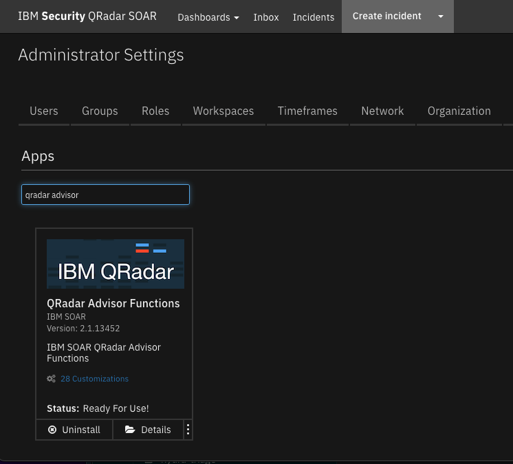

The QRadar Advisor integration with IBM QRadar SOAR enables SOAR users to gather Cyber MITRE ATT&CK information from QRadar Advisor. The integration supports QRadar Advisor quick search, full search, map a rule, and retrieve offense insights and analysis.

### Key Features
<!--
  List the Key Features of the Integration
-->
Backed by IBM Watson, QRadar Advisor applies artificial intelligence to automatically investigate indicators of compromise (IOC), utilizes cognitive reasoning to provide critical insights, and ultimately accelerates the response cycle. It can augment a security analyst to gain a head start in assessing incidents and reduce the risk of missing threats.

QRadar Advisor Integration Function enables Qradar SOAR users to gather Cyber Threat Intelligence(CTI) data from IBM Watson and QRadar. This information is critical for effective identification of potential IOC and quick response to incidents. In addition, this integration receives MITRE ATT&CK information from QRadar Advisor. As a result, an example workflow of this integration depends on the MITRE ATTACK function integration.

QRadar Advisor integration includes four functions:

* Perform a Watson Search on an indicator and retrieve suspicious observables related to it.
* Perform a Watson Search with Local Context on an indicator and retrieve a cyber threat intelligence (CTI) report on it in Structured Threat Information eXpression (STIX2) format.
* Perform an analysis on a QRadar offense, and retrieve CTI data from QRadar Advisor and IBM Watson in STIX format.
* Map a given QRadar rule to MITRE ATT&CK tactics. 

The package also includes workflow examples to demonstrate the usage of the above functions. 
---

## Requirements
<!--
  List any Requirements 
--> 
This app supports the IBM Security QRadar SOAR Platform and the IBM Security QRadar SOAR for IBM Cloud Pak for Security.

### SOAR platform
The SOAR platform supports two app deployment mechanisms, App Host and integration server.

If deploying to a SOAR platform with an App Host, the requirements are:
* SOAR platform >= `44.0.7583`.
* The app is in a container-based format (available from the AppExchange as a `zip` file).

If deploying to a SOAR platform with an integration server, the requirements are:
* SOAR platform >= `44.0.7583`.
* The app is in the older integration format (available from the AppExchange as a `zip` file which contains a `tar.gz` file).
* Integration server is running `resilient_circuits>=46.0.0`.
* If using an API key account, make sure the account provides the following minimum permissions: 
  | Name | Permissions |
  | ---- | ----------- |
  | Org Data | Read |
  | Function | Read |


The following SOAR platform guides provide additional information: 
* _App Host Deployment Guide_: provides installation, configuration, and troubleshooting information, including proxy server settings. 
* _Integration Server Guide_: provides installation, configuration, and troubleshooting information, including proxy server settings.
* _System Administrator Guide_: provides the procedure to install, configure and deploy apps. 

The above guides are available on the IBM Documentation website at [ibm.biz/soar-docs](https://ibm.biz/soar-docs). On this web page, select your SOAR platform version. On the follow-on page, you can find the _App Host Deployment Guide_ or _Integration Server Guide_ by expanding **Apps** in the Table of Contents pane. The System Administrator Guide is available by expanding **System Administrator**.

### Cloud Pak for Security
If you are deploying to IBM Cloud Pak for Security, the requirements are:
* IBM Cloud Pak for Security >= 1.4.
* Cloud Pak is configured with an App Host.
* The app is in a container-based format (available from the AppExchange as a `zip` file).

The following Cloud Pak guides provide additional information: 
* _App Host Deployment Guide_: provides installation, configuration, and troubleshooting information, including proxy server settings. From the Table of Contents, select Case Management and Orchestration & Automation > **Orchestration and Automation Apps**.
* _System Administrator Guide_: provides information to install, configure, and deploy apps. From the IBM Cloud Pak for Security IBM Documentation table of contents, select Case Management and Orchestration & Automation > **System administrator**.

These guides are available on the IBM Documentation website at [ibm.biz/cp4s-docs](https://ibm.biz/cp4s-docs). From this web page, select your IBM Cloud Pak for Security version. From the version-specific IBM Documentation page, select Case Management and Orchestration & Automation.

### Proxy Server
The app **does** support a proxy server.

### Python Environment
Both Python 3.6 are 3.9 are supported.
Additional package dependencies may exist for each of these packages:
* resilient_circuits>=46.0.0

### Endpoint Developed With

This app has been implemented using:
| Product Name | Product Version |
| ------------ | --------------- |
| QRadar Advisor with Watson | 2.6.3 |
| QRadar Use Case Manager | 3.5.0 |

#### Prerequisites
<!--
List any prerequisites that are needed to use with this endpoint solution. Remove any section that is unnecessary.
-->
* QRadar 7.3.0 or later
* Qradar Advisor with Watson 
* QRadar Use Case Manager 3.1.0 or greater

#### Configuration
<!--
List any steps that are needed to configure the endpoint to use this app.
-->
* Config A <!-- ::CHANGE_ME:: -->
* Config B <!-- ::CHANGE_ME:: -->
* Config C <!-- ::CHANGE_ME:: -->

#### Permissions
<!--
List any user permissions that are needed to use this endpoint. For example, list the API key permissions.
-->
* Permission A <!-- ::CHANGE_ME:: -->
* Permission B <!-- ::CHANGE_ME:: -->
* Permission C <!-- ::CHANGE_ME:: -->


---

## Installation

### Install
* To install or uninstall an App or Integration on the _SOAR platform_, see the documentation at [ibm.biz/soar-docs](https://ibm.biz/soar-docs).
* To install or uninstall an App on _IBM Cloud Pak for Security_, see the documentation at [ibm.biz/cp4s-docs](https://ibm.biz/cp4s-docs) and follow the instructions above to navigate to Orchestration and Automation.

### App Configuration
The following table provides the settings you need to configure the app. These settings are made in the app.config file. See the documentation discussed in the Requirements section for the procedure.

| Config | Required | Example | Description |
| ------ | :------: | ------- | ----------- |
| **qradar_advisor_app_id** | Yes | `` | *QRadar Advisor App Id.* |
| **qradar_advisor_token** | Yes | `` | *QRadar Advisor token.* |
| **qradar_host** | Yes | `myhost` | *QRadar host.* |
| **qradar_ucm_token** | Yes | `` | *QRadar Use Case Manager token.* |
| **verify_cert** | Yes | `` | *Boolean indicating whether to validate the QRadar server certificate.* |

### Configure QRadar Advisor With Watson
You need to have QRadar Advisor With Watson installed on a QRadar server, and fully configured, as shown in the following configuration page. 

 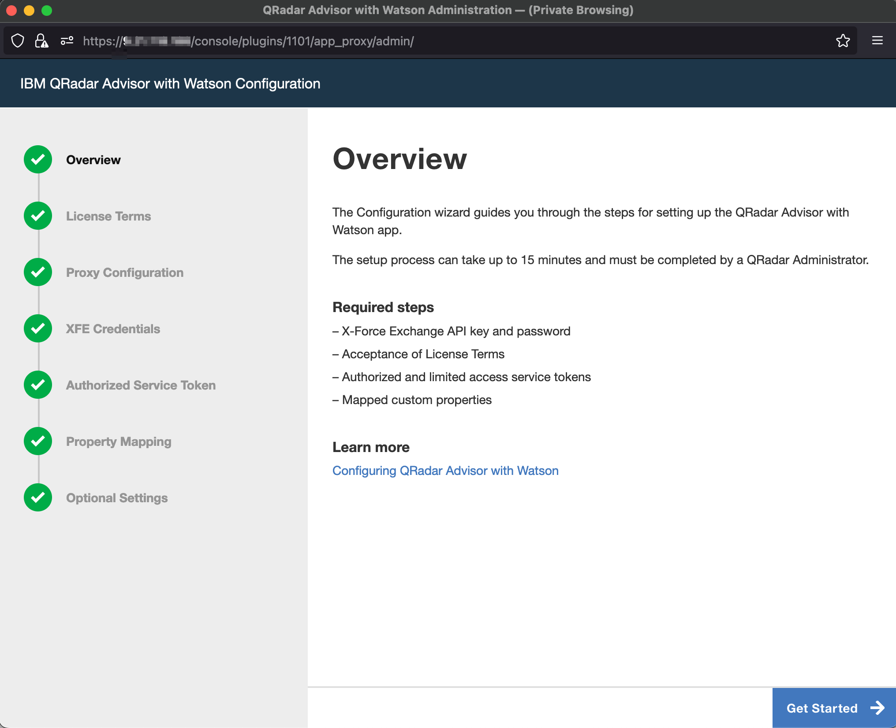

To access the QRadar Advisor REST API, you need to know its app_id, which you can access by clicking the QRadar Advisor’s Configuration icon. 

For example, in the URL address shown in the configuration page screenshot, the app_id is 1101 for this QRadar Advisor instance.
You also need an access token to use the REST API. You can obtain access tokens from the Authorized Service Token section of the Admin page.

### Configure QRadar Use Case MAnager
You need to have QRadar Use Case Manager installed on a QRadar server and fully configured, as shown in the following configuration page.  


 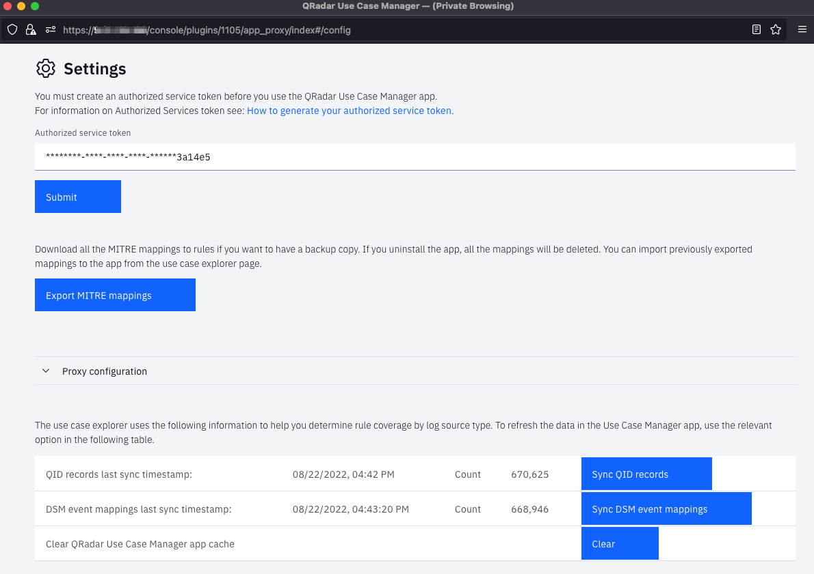

You also need an access token to use the REST API. You can obtain access tokens from the Authorized Service Token section of the Admin page.
This token can be the same as the authorization token used for QRadar Advisor above. 


### Custom Layouts
<!--
  Use this section to provide guidance on where the user should add any custom fields and data tables.
  You may wish to recommend a new incident tab.
  You should save a screenshot "custom_layouts.png" in the doc/screenshots directory and reference it here
-->
* Import the Data Tables and Custom Fields like the screenshot below:

  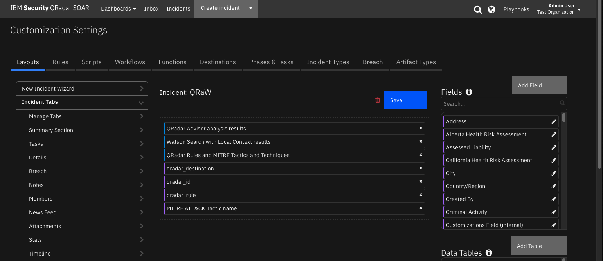


---

## Function - QRadar Advisor Map Rule
Map rule to MITRE ATT&CK tactic.

 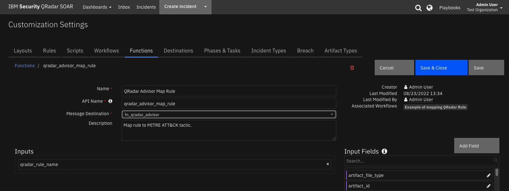

<details><summary>Inputs:</summary>
<p>

| Name | Type | Required | Example | Tooltip |
| ---- | :--: | :------: | ------- | ------- |
| `qradar_rule_name` | `text` | No | `-` | Name of QRadar rule |

</p>
</details>

<details><summary>Outputs:</summary>
<p>

> **NOTE:** This example might be in JSON format, but `results` is a Python Dictionary on the SOAR platform.

```python
results = {
  "tactics": {
    "has_ibm_default": true,
    "id": "c0dfacf7-235e-416c-9b2b-c250ef8f3919",
    "last_updated": 1607611408002,
    "mapping": {
      "Initial Access": {
        "confidence": "high",
        "enabled": true,
        "ibm_default": true,
        "id": "TA0001",
        "techniques": {
          "Valid Accounts": {
            "confidence": "high",
            "enabled": true,
            "id": "T1078"
          }
        },
        "user_override": false
      }
    },
    "min-mitre-version": 7
  }
}
```

</p>
</details>

<details><summary>Example Pre-Process Script:</summary>
<p>

```python
inputs.qradar_rule_name = incident.properties.qradar_rule
```

</p>
</details>

<details><summary>Example Post-Process Script:</summary>
<p>

```python
tactics = results.tactics
mapping = tactics["mapping"]
att_tactics = ", ".join(mapping.keys())
incident.properties.mitre_tactic_name = att_tactics

```

</p>
</details>

---
## Function - QRadar Advisor Offense Analysis
Given a SOAR artifact, this function performs a QRadar Advisor analysis and returns Local, Watson enriched, or Expanded local context (default) results.

 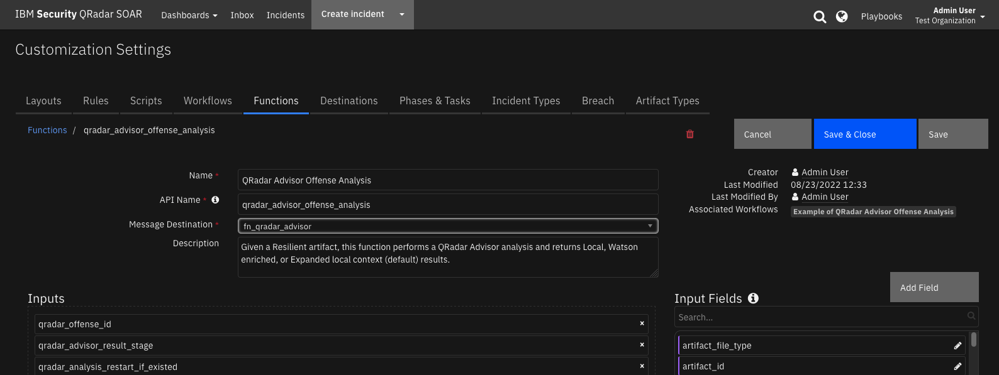

<details><summary>Inputs:</summary>
<p>

| Name | Type | Required | Example | Tooltip |
| ---- | :--: | :------: | ------- | ------- |
| `qradar_advisor_result_stage` | `select` | No | `-` | stage1(Local), stage2(Watson enriched), stage3(Expanded local context) |
| `qradar_analysis_restart_if_existed` | `boolean` | No | `-` | restart the analysis if there is an existing result |
| `qradar_offense_id` | `text` | No | `-` | QRadar Offense ID |

</p>
</details>

<details><summary>Outputs:</summary>
<p>

> **NOTE:** This example might be in JSON format, but `results` is a Python Dictionary on the SOAR platform.

```python
results = {
  "insights": {
    "high_value_assets": [],
    "high_value_users": [],
    "insights": "Watson has analyzed this offense and a total of three observables.  The reasoning process has not found any additional indicators that are related to this offense.  No data points were found to be linked with the offense.  One indicator was related to suspicious activity, and all indicators were active.  In particular, one IP address has been found, which is known to be suspicious or malicious.",
    "is_stage3_pending": false,
    "malware_families": [],
    "related_investigations": [
      {
        "analysis_time": null,
        "concern_score": null,
        "id": 1,
        "is_search": true,
        "priority": null,
        "source": null,
        "type": "Investigations"
      }
    ],
    "risky_users": [],
    "stage3_insights": "",
    "start_time": 1659629011957,
    "stop_time": 1659636230480,
    "tactics": [
      {
        "confidence": 60,
        "data_sources": [
          "xfe"
        ],
        "event_count": 206,
        "flow_count": 0,
        "id": "TA0011",
        "nodes": [
          {
            "is_internal": false,
            "label": "89.223.26.52",
            "type": "IpAddress"
          }
        ],
        "rules": [],
        "tactic_id": "Command and Control",
        "techniques": []
      }
    ],
    "threat_actors": [],
    "watched_users": []
  },
  "note": "\u003cul\u003e\u003cli\u003e\u003cimg src=\"https://raw.githubusercontent.com/freetaxii/stix2-graphics/master/icons/png/stix2-meta-icons-png/identity-square-dark-300-dpi.png\" alt=\"identity\" style=\"width:20px; height:20px\"/\u003e userD\u003c/li\u003e\u003cul style=\"list-style-type:none\"\u003e\u003cli\u003e\u003cimg src=\"https://raw.githubusercontent.com/freetaxii/stix2-graphics/master/icons/png/stix2-sco-network-address-icons-png/ipv4-addr-square-dark-300-dpi.png\" alt=\"ipv4-addr\" style=\"width:20px; height:20px\"/\u003e 192.168.0.17\u003c/li\u003e\u003c/ul\u003e\u003c/ul\u003e\u003cul\u003e\u003cli\u003e\u003cimg src=\"https://raw.githubusercontent.com/freetaxii/stix2-graphics/master/icons/png/stix2-sco-network-address-icons-png/ipv4-addr-square-dark-300-dpi.png\" alt=\"ipv4-addr\" style=\"width:20px; height:20px\"/\u003e 89.223.26.52\u003c/li\u003e\u003cul style=\"list-style-type:none\"\u003e\u003cli\u003e\u003cimg src=\"https://raw.githubusercontent.com/freetaxii/stix2-graphics/master/icons/png/stix2-sco-network-address-icons-png/ipv4-addr-square-dark-300-dpi.png\" alt=\"ipv4-addr\" style=\"width:20px; height:20px\"/\u003e 192.168.0.17\u003cimg src=\"https://image.flaticon.com/icons/svg/282/282100.svg\" alt=\"link\" style=\"width:15px; height:15px\"/\u003e\u003c/li\u003e\u003cli\u003ex-mitre-tactic Command and Control\u003c/li\u003e\u003c/ul\u003e\u003c/ul\u003e\u003cul\u003e\u003cli\u003e\u003cimg src=\"https://raw.githubusercontent.com/freetaxii/stix2-graphics/master/icons/png/stix2-sco-network-address-icons-png/ipv4-addr-square-dark-300-dpi.png\" alt=\"ipv4-addr\" style=\"width:20px; height:20px\"/\u003e 193.184.16.214\u003c/li\u003e\u003cul style=\"list-style-type:none\"\u003e\u003cli\u003e\u003cimg src=\"https://raw.githubusercontent.com/freetaxii/stix2-graphics/master/icons/png/stix2-sco-network-address-icons-png/ipv4-addr-square-dark-300-dpi.png\" alt=\"ipv4-addr\" style=\"width:20px; height:20px\"/\u003e 192.168.0.17\u003cimg src=\"https://image.flaticon.com/icons/svg/282/282100.svg\" alt=\"link\" style=\"width:15px; height:15px\"/\u003e\u003c/li\u003e\u003c/ul\u003e\u003c/ul\u003e\u003cp\u003eThere are 5 objects and 2 links.\u003c/p\u003e",
  "observables": [
    {
      "description": "userD",
      "relevance": "very-high",
      "toxicity": "very-low",
      "type": "identity"
    },
    {
      "description": "89.223.26.52",
      "relevance": "medium",
      "toxicity": "high",
      "type": "ipv4-addr"
    },
    {
      "description": "192.168.0.17",
      "relevance": "medium",
      "toxicity": "very-low",
      "type": "ipv4-addr"
    },
    {
      "description": "193.184.16.214",
      "relevance": "medium",
      "toxicity": "very-low",
      "type": "ipv4-addr"
    },
    {
      "description": "Command and Control",
      "relevance": "",
      "toxicity": "",
      "type": "x-mitre-tactic"
    }
  ],
  "stix": {
    "id": "bundle--9813614d-e715-4ad4-a4bd-7cf204190449",
    "objects": [
      {
        "created": "2022-08-04T17:08:32.000Z",
        "id": "identity--2f4ac158-751e-42de-bf88-2a02fe6a5840",
        "identity_class": "individual",
        "modified": "2022-08-04T17:08:32.000Z",
        "name": "userD",
        "type": "identity",
        "x_ibm_security_relevance": "very-high",
        "x_ibm_security_toxicity": "very-low"
      }
    ],
    "spec_version": "2.0",
    "type": "bundle"
  }
}
```

</p>
</details>

<details><summary>Example Pre-Process Script:</summary>
<p>

```python
#
# This sample workflow uses the custom field (qradar_id) to perform 
# an offense analysis in QRadar Advisor
#
inputs.qradar_offense_id = incident.properties.qradar_id
```

</p>
</details>

<details><summary>Example Post-Process Script:</summary>
<p>

```python
#
# Result retured by the QRadar Advisor Offense Analysis function:
#   * results.observables: observables and their details, used here to be output to Data table.
#   * results.note: html representation of STIX data, used here to generate a Note.
#   * results.insights: used here to create a Task.
#   * results.stix: raw stix data, preserved for any customized parsing.
#
#   Note: results.insights can be a status code e.g. 404
#
# We publish a data table according to the stix

# Check that we didn't get a status of 404 (no observables) for insights.
if "status_code" in results["insights"] and results["insights"]["status_code"] == 404:
    process_insights = False
else:
    process_insights = True

for observable in results.observables:
  qradar_obs = incident.addRow("qradar_advisor_observable")
  qradar_obs.qradar_advisor_toxicity = observable.toxicity
  qradar_obs.qradar_advisor_relevance = observable.relevance
  qradar_obs.qradar_advisor_type = observable.type
  qradar_obs.qradar_advisor_description = observable.description

# Pass insights data (with MITRE ATTACK tactics information) to following function
# using workflow.properties.qraw_offense_insights. Refer to the Output tab please

# Our STIX tree or error status.
html = helper.createRichText(results.note)
incident.addNote(html)

if process_insights:
    # If we didn't get a 404 (no observables) status process for insights.
    # Task
    task_title = "Review QRadar Advisor Analysis for Offense " + str(incident.properties.qradar_id)
    task_summary = results.insights.insights + "\n\n" + results.insights.stage3_insights
    incident.addTask(task_title, "Initial", task_summary)

    #
    # MITRE tactic information
    #
    tactics = results.insights["tactics"]

    mitre_tactic_names = []
    if tactics is not None:
      for tactic in tactics:
        #
        # Note, even though QRAW calls it tactic_id, it is more a tactic name
        #
        mitre_tactic_names.append(tactic["tactic_id"])
    #
    # QRadar Advisor might return more than one tactics for a given offense. Include them inputs
    # a comma separated string
    #
    incident.properties.mitre_tactic_name = ", ".join(mitre_tactic_names)

# Note that results.stix is the raw stix return from QRadar Advisor in stix 2 (json) format
# Users can add their customize codes to handle the stix data here
#
```

</p>
</details>

---
## Function - Watson Search
Given a SOAR artifact, this function performs a Watson Search (a QRadar Advisor quick search) and returns a summary.

 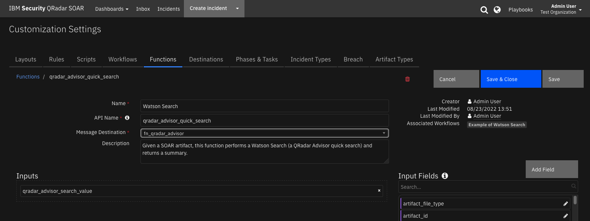

<details><summary>Inputs:</summary>
<p>

| Name | Type | Required | Example | Tooltip |
| ---- | :--: | :------: | ------- | ------- |
| `qradar_advisor_search_value` | `text` | No | `-` | indicator to search, types include Domain Name, IP Address, hashes, URL, or user name. |

</p>
</details>

<details><summary>Outputs:</summary>
<p>

> **NOTE:** This example might be in JSON format, but `results` is a Python Dictionary on the SOAR platform.

```python
results = {
  "search": {
    "is_toxic": true,
    "other_count": 3,
    "reference_count": 1,
    "search_results": {
      "other_observables": [
        {
          "label": "www.poloatmer.ru",
          "reference_count": 1,
          "timestamp": 1524258360,
          "type": "DomainName"
        },
        {
          "label": "gorinfotech.ru",
          "reference_count": 1,
          "timestamp": 1513402560,
          "type": "DomainName"
        },
        {
          "label": "forexpack.ru",
          "reference_count": 1,
          "timestamp": 1498685280,
          "type": "DomainName"
        }
      ],
      "suspicious_observables": [
        {
          "label": "Botnet Command and Control Server:Regional Internet Registry",
          "reference_count": 1,
          "timestamp": 1660857629,
          "type": "Reputation"
        },
        {
          "label": "89.223.26.52",
          "reference_count": 1,
          "timestamp": 1660857629,
          "type": "IpAddress"
        }
      ]
    },
    "search_value": "89.223.26.52",
    "search_value_type": "IpAddress",
    "suspicious_count": 2
  },
  "whois": {
    "contact_country": "Russia",
    "contact_email": "abuse@selectel.ru",
    "contact_name": null,
    "contact_org": "SELECTEL-NET",
    "contact_type": "registrant",
    "created_date": "2022-02-02T12:51:32.000Z",
    "registrar_name": "RIPE",
    "updated_date": "2022-02-02T12:51:32.000Z"
  }
}
```

</p>
</details>

<details><summary>Example Pre-Process Script:</summary>
<p>

```python
value = artifact.value
type = artifact.type

#
# Watson Search only supports 5 indicator types: IP Address, Hash, Domain, URL, Username. 
# The “user:” prefix needs to be added to a username search
#
mapping = {
  "User Account":"user:"       
}
prefix = ""
if type in mapping:
  prefix = mapping[type]

inputs.qradar_advisor_search_value = prefix + value
```

</p>
</details>

<details><summary>Example Post-Process Script:</summary>
<p>

```python
#
# Return data in this example
#   results.search_results.suspicious_observables:
#     Suspicious observables related to this indicator. Used in the post-process script to create artifacts,
#     if the type of the observable can be mapped to an default artifact type.
#
#  Note: results.return_search can have status code e.g. 422
#
return_search = results.search

status_set = True if "status_code" in return_search else False
if not status_set:
    api_version = 2 if "suspicious_observables" in return_search.search_results else 1

#
# Sample return json dict for v2.0
#
'''{
      "search": {
          "search_value_type": "DomainName", 
          "other_count": 1, 
          "search_results": {
          "suspicious_observables": [
                  {
                      "reference_count": 1, 
                      "timestamp": 1529421998, 
                      "type": "DomainName", 
                      "label": "mydomain.com"
                  }, 
                  {
                      "reference_count": 1, 
                      "timestamp": 1462407300, 
                      "type": "EmailContent", 
                      "label": "ccf2d5f4ab37650ccbb582f351aa6fdd:"
                  }, 
                  {
                      "reference_count": 1, 
                      "timestamp": 1462407300, 
                      "type": "File", 
                      "label": "ccf2d5f4ab37650ccbb582f351aa6fdd"
                  }, 
                  {
                      "reference_count": 1, 
                      "timestamp": 1463566500, 
                      "type": "IpAddress", 
                      "label": "190.104.198.116"
                  },
                  {
                      "reference_count": 1, 
                      "timestamp": 1463072400, 
                      "type": "Hash", 
                      "label": "51417677b5e7b17542d383f5b25e2b43"
                  }
          ], 
          "other_observables": [
              {
                  "reference_count": 1, 
                  "timestamp": 1529421998, 
                  "type": "DomainName", 
                  "label": "mydomain.com"
              }
          ]
      }, 
      "suspicious_count": 5, 
      "search_value": "mydomain.com", 
      "reference_count": 1, 
      "is_toxic": false}, 
      "whois": {
          "updated_date": "2015-09-15T23:25:25.000Z", 
          "contact_country": "Canada", 
          "registrar_name": "Domain.com, LLC", 
          "contact_email": "noreply@data-protected.net", 
          "created_date": "2000-06-22T04:00:00.000Z", 
          "contact_name": "Data Protected Data Protected", 
          "contact_type": "registrant", "contact_org": "Data Protected"
      }
      }
'''
#
# We ONLY create artifacts for those observables that can be mapped to
# default SOAR artifacts. If customer has custom artifacts, and wants
# to map them as well, please modify the following mapping dict.
#
mapping = {
    "DomainName": "DNS Name",
    "EmailContent": "Email Body",
    "File": "Malware MD5 Hash",  # File type is a hash value. So we map File to Malware MD5 Hash
    "IpAddress": "IP Address",
    "Hash": {
        32: "Malware MD5 Hash",
        40: "Malware SHA-1 Hash",
        64: "Malware SHA-256 Hash"
    }
}

#
# Note that in this example workflow, we only extract the suspicious_observables
#
if status_set:
    # Add an error status note.
    summary_string = 'The artifact returned an error.'
    status_string = "QRadar Advisor returned status code '{}'.".format(return_search["status_code"])
    if return_search["status_code"] == 422:
        summary_string = "This artifact has an unsupported value."

    note_string = "<h3>Watson Search Result Summary</h3><hr>"
    note_string += "<br><p><span style=\"font-weight:bold\">" + status_string + "</span></p>"
    note_string += "<p><span style=\"font-weight:bold\">" + summary_string + "</span></p><br>"
    note_string +=  "<p>Search Value: " + return_search.search_value + "</p>"
    note_string +=  "<p>Search Type:  <span style=\"color:white; border-bottom-left-radius: 2.96667px;background-color:#808080\">&nbsp " + artifact.type + "&nbsp</span></p>"
    html_note = helper.createRichText(note_string)
    incident.addNote(html_note)

elif api_version == 2:
    # v2.0
    suspicious_observables = return_search.search_results.suspicious_observables

    new_artifact_count = 0
    summary_string = "This artifact is not a suspicious observable"

    for observable in suspicious_observables:
        #
        # We support only those defined in mapping dict above
        #
        if observable.type in mapping:
            #
            # Note sometimes QRadar Advisor return the artifact itself as a suspicious observable. We don't want to
            # duplicate here.
            #
            if mapping[observable.type] != artifact.type or observable.label != artifact.value:
                new_artifact_count += 1
                if observable.type == "Hash":
                    if len(observable.label) in mapping[observable.type] and  observable.label.isalnum():
                        # Hash is likely MD5, SHA1 or SHA256.
                        incident.addArtifact(mapping[observable.type][len(observable.label)], observable.label,
                                             "Watson Search result")
                else:
                    incident.addArtifact(mapping[observable.type], observable.label, "Watson Search result")
            else:
                #
                # The artifact itself is a suspicious observable. We don't create new (duplicated) artifact. But we show this info
                #
                summary_string = "This artifact is a suspicious observable"

    # Add a note about number of suspicious_observables
    note_string = "<h3>Watson Search Result Summary</h3><hr>"
    note_string = note_string + "<br><p><span style=\"font-weight:bold\">" + summary_string + "</span></p><br>"
    note_string = note_string + "<p>Search Value: " + return_search.search_value + "</p>"
    note_string = note_string + "<p>Search Type:  <span style=\"color:white; border-bottom-left-radius: 2.96667px;background-color:#808080\">&nbsp " + return_search.search_value_type + "&nbsp</span></p>"
    note_string = note_string + "<p style=\"color:#FF00FF;\">Suspicious observables: " + str(
        return_search.suspicious_count) + "</p>"
    note_string = note_string + "<p style=\"color:red;\">New artifacts mapped from suspicious observables: " + str(
        new_artifact_count) + "</p>"
    note_string = note_string + "<p>Other observables: " + str(return_search.other_count) + "</p>"
    html_note = helper.createRichText(note_string)
    incident.addNote(html_note)

else:
    # v1.0?
    new_artifact_count = 0
    toxic_count = 0
    non_toxic_count = 0
    summary_string = "This artifact is not a suspicious observable"
    for result in return_search.search_results:
        value_type = result["type"]
        if value_type in mapping:
            #
            # We know what artifact type corresponds to this value type
            #
            for val in result["values"]:
                #
                # We care about the toxic ones only
                #
                if val["is_toxic"]:
                    toxic_count += 1
                    #
                    # Note sometimes QRadar Advisor return the artifact itself as a suspicious observable. We don't want to
                    # duplicate here.
                    #
                    if mapping[value_type] != artifact.type or val.label != artifact.value:
                        new_artifact_count += 1
                        if value_type == "Hash":
                            if len(val.label) in mapping[value_type] and  val.label.isalnum():
                                # Hash is likely MD5, SHA1 or SHA256.
                                incident.addArtifact(mapping[value_type][len(val.label)], val.label, "Watson Search result")
                        else:
                            incident.addArtifact(mapping[value_type], val.label, "Watson Search result")
                    else:
                        #
                        # The artifact itself is a suspicious observable. We don't create new (duplicated) artifact. But we show this info
                        #
                        summary_string = "This artifact is a suspicious observable"
                else:
                    non_toxic_count += 1

    # Add a note about number of suspicious_observables
    note_string = "<h3>Watson Search Result Summary</h3><hr>"
    note_string = note_string + "<br><p><span style=\"font-weight:bold\">" + summary_string + "</span></p><br>"
    note_string = note_string + "<p>Search Value: " + return_search.search_value + "</p>"
    note_string = note_string + "<p>Search Type:  <span style=\"color:white; border-bottom-left-radius: 2.96667px;background-color:#808080\">&nbsp " + return_search.search_value_type + "&nbsp</span></p>"
    note_string = note_string + "<p style=\"color:#FF00FF;\">Toxic observables: " + str(toxic_count) + "</p>"
    note_string = note_string + "<p style=\"color:red;\">New artifacts mapped from toxic observables: " + str(
        new_artifact_count) + "</p>"
    note_string = note_string + "<p>Non toxic observables: " + str(non_toxic_count) + "</p>"
    html_note = helper.createRichText(note_string)
    incident.addNote(html_note)


```

</p>
</details>

---
## Function - Watson Search with Local Context
Given a SOAR artifact, this function performs a Watson Search with Local Context (a QRadar Advisor full search) and returns Local, Watson enriched, or Expanded local context (default) results.

 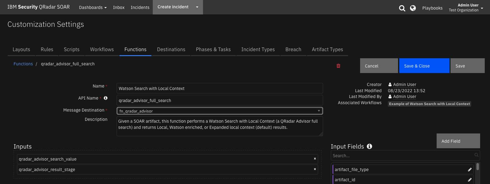

<details><summary>Inputs:</summary>
<p>

| Name | Type | Required | Example | Tooltip |
| ---- | :--: | :------: | ------- | ------- |
| `qradar_advisor_result_stage` | `select` | No | `-` | stage1(Local), stage2(Watson enriched), stage3(Expanded local context) |
| `qradar_advisor_search_value` | `text` | No | `-` | indicator to search, types include Domain Name, IP Address, hashes, URL, or user name. |

</p>
</details>

<details><summary>Outputs:</summary>
<p>

> **NOTE:** This example might be in JSON format, but `results` is a Python Dictionary on the SOAR platform.

```python
results = {
  "note": "\u003cul\u003e\u003cli\u003e\u003cimg src=\"https://raw.githubusercontent.com/freetaxii/stix2-graphics/master/icons/png/stix2-sco-network-address-icons-png/ipv4-addr-square-dark-300-dpi.png\" alt=\"ipv4-addr\" style=\"width:20px; height:20px\"/\u003e 89.223.26.52\u003c/li\u003e\u003c/ul\u003e\u003cp\u003eThere is 1 object and 0 link.\u003c/p\u003e",
  "observables": [
    {
      "description": "89.223.26.52",
      "relevance": "very-high",
      "toxicity": "very-low",
      "type": "ipv4-addr"
    }
  ],
  "stix": {
    "id": "bundle--610d4a69-eb55-4655-b6ee-2fa86473c517",
    "objects": [
      {
        "created": "2022-08-18T21:22:05.000Z",
        "id": "indicator--13f7fe84-2fc9-4f8e-ac1f-9ab6ae14bb10",
        "labels": [
          "benign"
        ],
        "modified": "2022-08-18T21:22:05.000Z",
        "name": "IpAddress",
        "pattern": "[ipv4-addr:value=\u002789.223.26.52\u0027]",
        "type": "indicator",
        "valid_from": "2022-08-18T21:22:05.000Z",
        "x_ibm_security_relevance": "very-high",
        "x_ibm_security_toxicity": "very-low"
      }
    ],
    "spec_version": "2.0",
    "type": "bundle"
  },
  "summary": "Watson Search with Local Context of indicator 89.223.26.52 returns 1 observable."
}
```

</p>
</details>

<details><summary>Example Pre-Process Script:</summary>
<p>

```python
value = artifact.value
type = artifact.type

#
# Watson Search with Local Context only supports 5 indicator types: IP Address, Hash, DomainName, URL, Username. 
# The “user:” prefix needs to be added to a username search.
#
mapping = {
  "User Account":"user:"       
}
prefix = ""
if type in mapping:
  prefix = mapping[type]

inputs.qradar_advisor_search_value = prefix + value
```

</p>
</details>

<details><summary>Example Post-Process Script:</summary>
<p>

```python
import java.util.Date as Date

# Return data of function Watson Search with Local Context:
#   * results.observables: observables and their details, used here to be output to Data table.
#   * results.note: html representation of STIX data, used here to generate a Note.
#   * results.summary: used here to create a Task.
#   * results.stix: raw stix data (not used here), for any customized parsing.

# Check that we didn't get a status of 404 (no observables) for insights.
if "status_code" in results["stix"] and results["stix"]["status_code"] == 404:
    add_task = False
else:
    add_task  = True
# We publish a data table according to the stix if obserables found.
date_str = str(Date())
for observable in results.observables:
  qradar_obs = incident.addRow("qradar_advisor_observable_for_artifact")
  qradar_obs.qradar_advisor_toxicity = observable.toxicity 
  qradar_obs.qradar_advisor_relevance = observable.relevance
  qradar_obs.qradar_advisor_type = observable.type 
  qradar_obs.qradar_advisor_description = observable.description 
  qradar_obs.artifact_related = artifact.value
  qradar_obs.full_search_time = date_str
# Our STIX tree or error message
html = helper.createRichText(results.note)
incident.addNote(html)

if add_task:
    # Create a task
    incident.addTask("Review Watson Search with Local Context of artifact: " + artifact.value, "Initial", results.summary)
```

</p>
</details>


<p>
This example workflow invokes the function “Watson Search with Local Context”. The function calls the QRadar Advisor REST API to perform a Watson Search with Local Context on an indicator.
<p>
To use this example workflow and rule included in the package for this function, the user needs to create an incident and add an artifact. For this function to work, the artifact type must correspond to one indicator type. QRadar Advisor supports searches on the following indicators:

*  IP addresses
*  Hashes
*  Domains
*  URLs
*  Persons
<p>
QRadar Advisor supports three return stages:

*  Stage1: feature hunt
*  Stage2: cognitive investigation added on top of the result of stage 1
*  Stage3: wider feature hunt added on top of the result of stage 2

<p>
The user can specify the desired return stage in the pre-process script of the example workflow.
<p>
The search REST API of QRadar Advisor returns CTI information in Structured Threat Information Expression (STIX 2.0) format. It is normally a STIX bundle with STIX objects. The function processes the STIX data and performs the following:

*  Generates a HTML representation of the STIX data
*  Extracts observables from the STIX objects
*  Generates a summary from the STIX data
<p>
The return data from this function includes the raw STIX data in json dictionary format.
<p>
In the post-process script, the HTML representation is used to create a note. The observables are used to populate the custom data table, "Watson Search with Local Context results", and the summary is used to create a task. Note that the raw STIX data is accessible from the post-process script as results.stix, and can be parsed to create custom code.
<p>
In the following example, an IP Address artifact was added to an incident with value “193.184.16.214”. The user can then select Watson Search with Local Context from the artifact menu to search QRadar Advisor for the observable.

Please note that both Watson Search and Watson Search with Local Context perform queries for information about an indicator. Therefore, only those artifacts that can be mapped into indicators are supported. The types of artifacts that can be searched include:
*	DNS Name
*	Malware SHA-256 Hash
*	Malware SHA-1 Hash
*	Malware MD5 Hash
*	IP Address
*	URL
*	User Account

Note that a full search like this could take up to 15 minutes. Once it is completed, the note created for this indicator can be viewed from the Notes tab of this incident.

 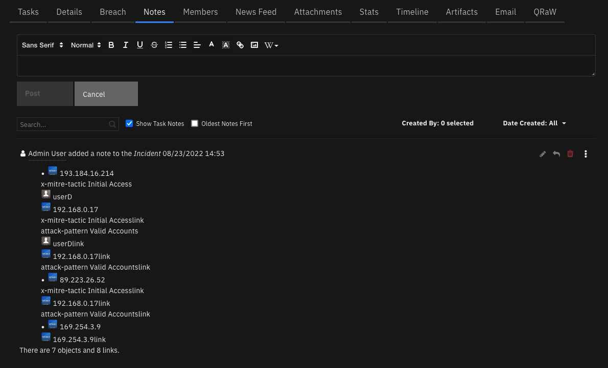

Please note that the icons shown in the above note use external URL referencing to the official site for STIX2 icons (https://raw.githubusercontent.com/freetaxii/stix2-graphics/master/icons/png_standard). Therefore, those icons are shown only if the QRadar SOAR platform can access the above website.
Also note that some indicators have a link icon at the end. These indicators are basically placeholders for the other (real) indicators with the same value. Think of them as symbolic links in a folder tree. 

---

## Script - Create Artifact for QRadar Advisor Analysis Observable
Create an artifact for the selected observable.

**Object:** qradar_advisor_observable

<details><summary>Script Text:</summary>
<p>

```python
#
# We create artifacts for those observables according to how they can be mapped to 
# SOAR default artifacts. If user has custom artifacts, and wants
# to map them as well, please modify the following mapping dict. 
#
# All the other observables without direct mapping, try to make decision depending
# on the qradar_advisor_description of them. If not decision can be made, then 
# a String type artifact will be created.
#
mapping = {
    "domain-name": "DNS Name",
    "domain": "DNS Name",
    "EmailContent": "Email Body",
    "ipv4-addr": "IP Address",
    "malware": "Malware Family/Variant",
    "url": "URL",
    "identity": "User Account"
}

artifact_description = "QRadar Advisor Analysis observable"
type = row.qradar_advisor_type
if type in mapping:
    incident.addArtifact(mapping[type], row.qradar_advisor_description, artifact_description)
else:
    artifact_type = "String"
    #
    # if the type is "file", the description could be MD5 hash, SHA-256 hash, SHA-1.
    # Distinguish them according to the length.
    #
    # Anything else is considered "File Name"
    #
    if type == "file":
        if len(row.qradar_advisor_description) == 32:
            artifact_type = "Malware MD5 Hash"
        elif len(row.qradar_advisor_description) == 64:
            artifact_type = "Malware SHA-256 Hash"
        elif len(row.qradar_advisor_description) == 40:
            artifact_type = "Malware SHA-1 Hash"
        else:
            artifact_type = "File Name"

    incident.addArtifact(artifact_type, row.qradar_advisor_description, artifact_description)
```

</p>
</details>

---
## Script - Create Artifact for Watson Search with Local Context
Create an artifact for the selected row

**Object:** qradar_advisor_observable_for_artifact

<details><summary>Script Text:</summary>
<p>

```python
#
# We create artifacts for those observables according to how they can be mapped to
# SOAR default artifacts. If user has custom artifacts, and wants
# to map them as well, please modify the following mapping dict.
#
# All the other observables without direct mapping, try to make decision depending
# on the qradar_advisor_description of them. If not decision can be made, then
# a String type artifact will be created.
#
mapping = {
    "domain-name": "DNS Name",
    "domain": "DNS Name",
    "EmailContent": "Email Body",
    "ipv4-addr": "IP Address",
    "malware": "Malware Family/Variant",
    "url": "URL",
    "identity": "User Account"
}

artifact_description = "Watson Search with Local Context observable"
type = row.qradar_advisor_type
if type in mapping:
    incident.addArtifact(mapping[type], row.qradar_advisor_description, artifact_description)
else:
    artifact_type = "String"
    #
    # if the type is "file", the description could be MD5 hash, SHA-256 hash, SHA-1.
    # Distinguish them according to the length.
    #
    # Anything else is considered "File Name"
    #
    if type == "file":
        if len(row.qradar_advisor_description) == 32:
            artifact_type = "Malware MD5 Hash"
        elif len(row.qradar_advisor_description) == 64:
            artifact_type = "Malware SHA-256 Hash"
        elif len(row.qradar_advisor_description) == 40:
            artifact_type = "Malware SHA-1 Hash"
        else:
            artifact_type = "File Name"

    incident.addArtifact(artifact_type, row.qradar_advisor_description, artifact_description)
```

</p>
</details>

---

## Data Table - QRadar Advisor analysis results

 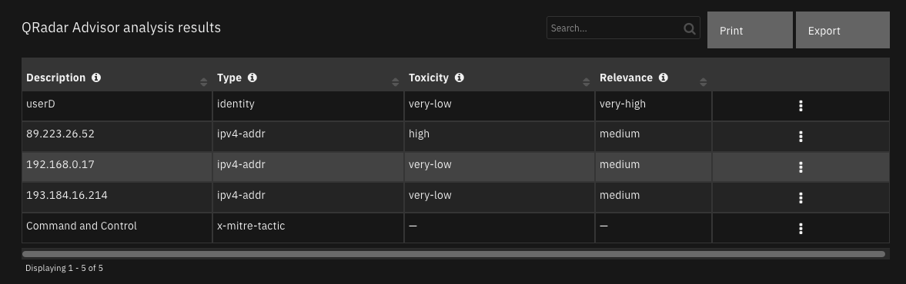

#### API Name:
qradar_advisor_observable

#### Columns:
| Column Name | API Access Name | Type | Tooltip |
| ----------- | --------------- | ---- | ------- |
| Description | `qradar_advisor_description` | `text` | observable description |
| Relevance | `qradar_advisor_relevance` | `text` | x_ibm_security_relevance from QRadar Advisor return |
| Toxicity | `qradar_advisor_toxicity` | `text` | x_ibm_security_toxicity from QRadar Advisor return |
| Type | `qradar_advisor_type` | `text` | observable type |

---
## Data Table - Watson Search with Local Context results

 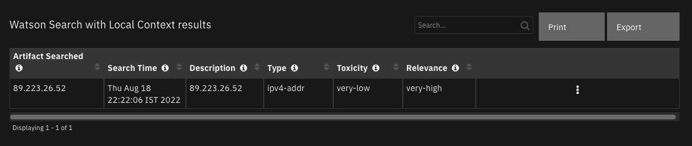

#### API Name:
qradar_advisor_observable_for_artifact

#### Columns:
| Column Name | API Access Name | Type | Tooltip |
| ----------- | --------------- | ---- | ------- |
| Artifact Searched | `artifact_related` | `text` | artifact used to perform the Watson Search with Local Context |
| Description | `qradar_advisor_description` | `text` | observerable description |
| Relevance | `qradar_advisor_relevance` | `text` | x_ibm_security_relevance from QRadar Advisor return |
| Search Time | `full_search_time` | `text` | time when search performed |
| Toxicity | `qradar_advisor_toxicity` | `text` | x_ibm_security_toxicity from QRadar Advisor return |
| Type | `qradar_advisor_type` | `text` | observable type |

---

## Custom Fields
| Label | API Access Name | Type | Prefix | Placeholder | Tooltip |
| ----- | --------------- | ---- | ------ | ----------- | ------- |
| MITRE ATT&CK Tactic name | `mitre_tactic_name` | `text` | `properties` | MITRE tactic name | MITRE ATT&CK Tactic name |
| qradar_id | `qradar_id` | `text` | `properties` | - | - |
| qradar_rule | `qradar_rule` | `text` | `properties` | - | Name of a QRadar rule |

---


## Rules
| Rule Name | Object | Workflow Triggered |
| --------- | ------ | ------------------ |
| Create Artifact (QRadar Advisor Analysis) | qradar_advisor_observable | `-` |
| Create Artifact (Watson Search with Local Context) | qradar_advisor_observable_for_artifact | `-` |
| QRadar Advisor: Map QRadar rule | incident | `qradar_advisor_map_rule` |
| QRadar Advisor: Offense Analysis | incident | `qradar_advisor_offense_analysis` |
| Watson Search | artifact | `qradar_advisor_quick_search` |
| Watson Search with Local Context | artifact | `qradar_advisor_full_search` |

---


## Troubleshooting & Support
Refer to the documentation listed in the Requirements section for troubleshooting information.

### For Support
This is an IBM supported app. Please search [ibm.com/mysupport](https://ibm.com/mysupport) for assistance.
