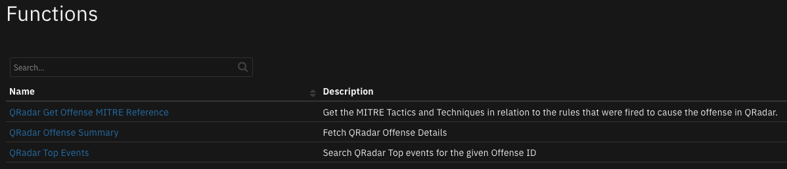
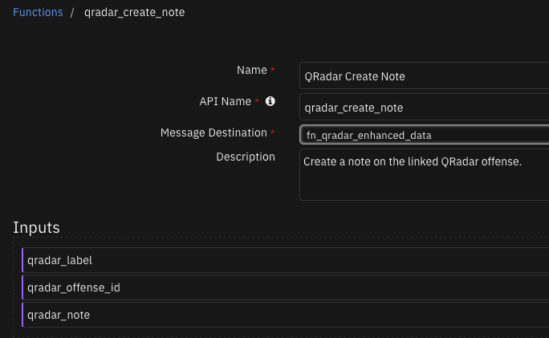
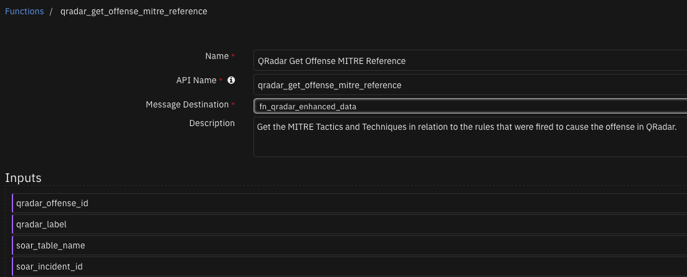
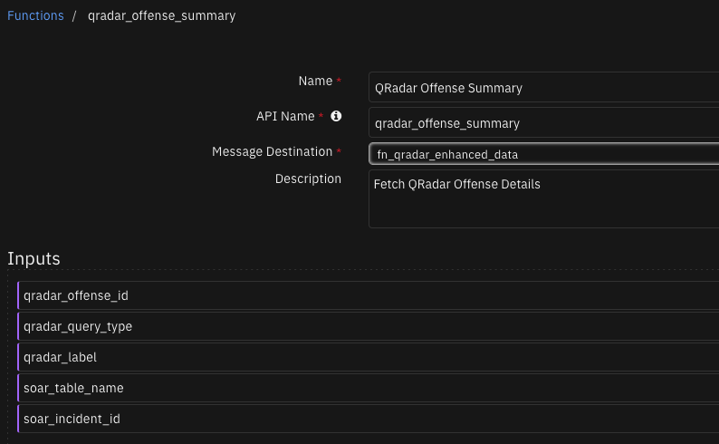
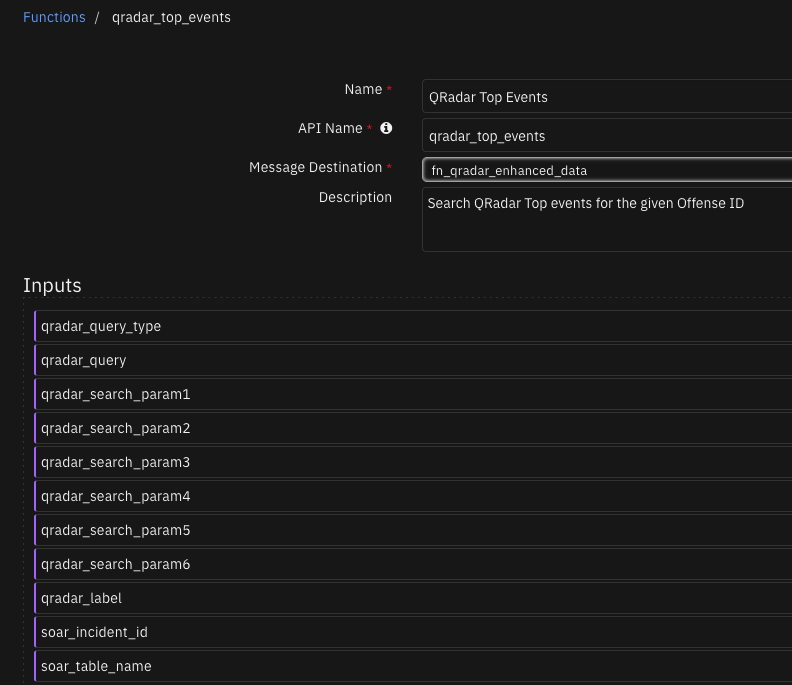
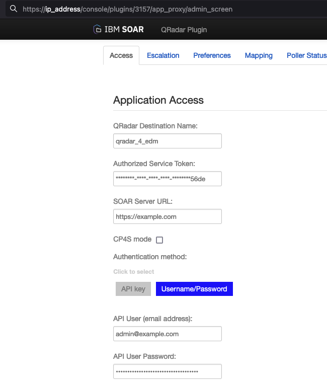
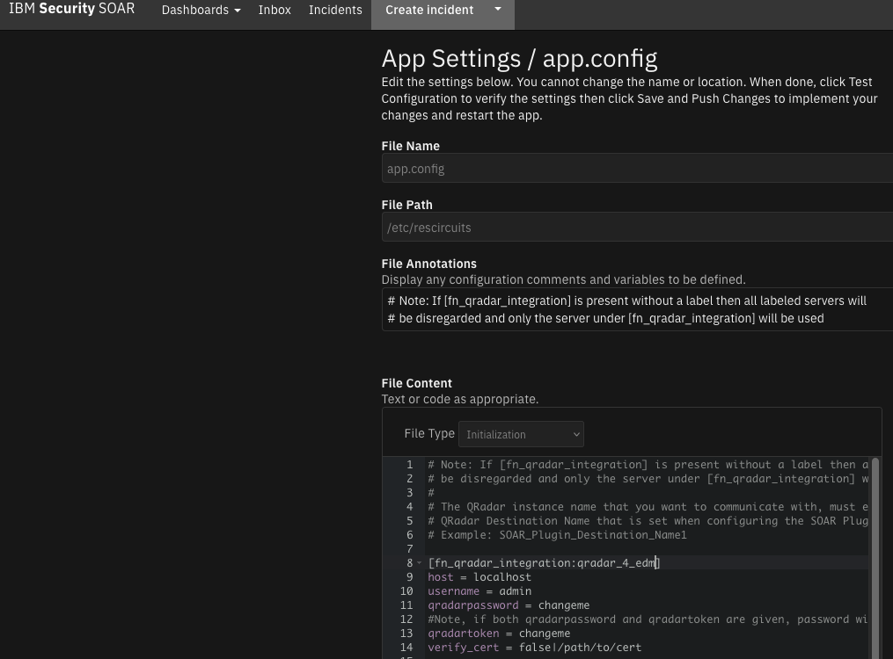
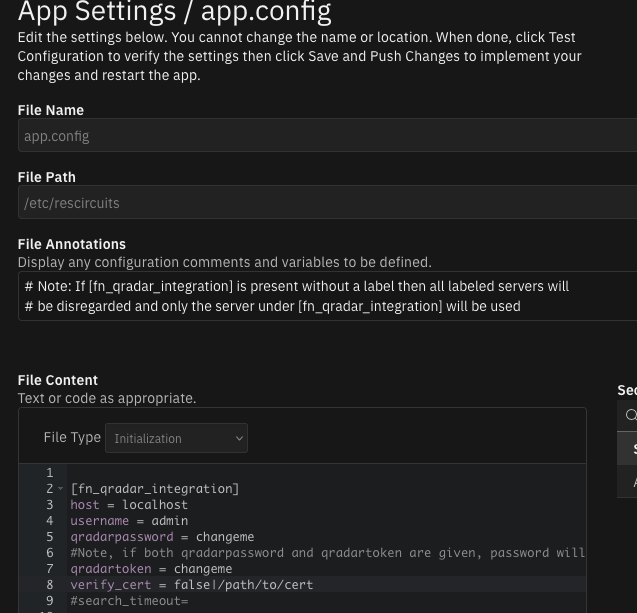
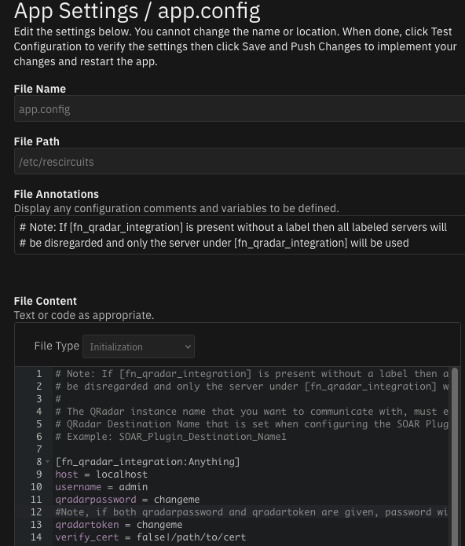

# QRadar Enhanced Data Migration

## Table of Contents
- [Release Notes](#release-notes)
- [Overview](#overview)
  - [Key Features](#key-features)
- [Requirements](#requirements)
  - [SOAR platform](#soar-platform)
  - [Cloud Pak for Security](#cloud-pak-for-security)
  - [Proxy Server](#proxy-server)
  - [Python Environment](#python-environment)
  - [QRadar Requirements](#qradar-requirements)
- [Installation](#installation)
  - [Install](#install)
  - [App Configuration](#app-configuration)
  - [MSSP Configuration](#mssp-configuration)
  - [Custom Layouts](#custom-layouts)
- [Function - QRadar Create Note](#function---qradar-create-note)
- [Function - QRadar Get Offense MITRE Reference](#function---qradar-get-offense-mitre-reference)
- [Function - QRadar Offense Summary](#function---qradar-offense-summary)
- [Function - QRadar Top Events](#function---qradar-top-events)
- [Script - Create Artifact from Assets info](#script---create-artifact-from-assets-info)
- [Script - Create Artifact from Destination IP info](#script---create-artifact-from-destination-ip-info)
- [Script - Create Artifact from Events info](#script---create-artifact-from-events-info)
- [Script - Create Artifact from Flows info](#script---create-artifact-from-flows-info)
- [Script - Create Artifact from Source IP info](#script---create-artifact-from-source-ip-info)
- [Script - Set Incident Last Updated Time](#script---set-incident-last-updated-time)
- [Data Table - QR Assets](#data-table---qr-assets)
- [Data Table - QR Categories](#data-table---qr-categories)
- [Data Table - QR Destination IPs (First 10)](#data-table---qr-destination-ips-first-10)
- [Data Table - QR Events (First 10 Events)](#data-table---qr-events-first-10-events)
- [Data Table - QR Flows](#data-table---qr-flows)
- [Data Table - QR Source IPs (First 10)](#data-table---qr-source-ips-first-10)
- [Data Table - QR Triggered Rules](#data-table---qr-triggered-rules)
- [Data Table - QRadar Rules and MITRE Tactics and Techniques](#data-table---qradar-rules-and-mitre-tactics-and-techniques)
- [Custom Fields](#custom-fields)
- [Rules](#rules)
- [Playbooks](#playbooks)
- [Version 2.0.0 Changes](#version-200-changes)
    - [QRadar API Searches](#qradar-api-searches)
    - [QRadar Enhanced Data Refresh Manual Rule](#qradar-enhanced-data-refresh-manual-rule)
    - [Configuring Real time update to Offenses](#configuring-real-time-update-to-offenses)
  - [For Customers who do not use the QRadar-Plugin](#for-customers-who-do-not-use-the-qradar-plugin)
  - [For Customers that are having performance issues related to the poller](#for-customers-that-are-having-performance-issues-related-to-the-poller)
- [Troubleshooting & Support](#troubleshooting--support)

---

## Release Notes
| Version | Date | Notes |
| ------- | ---- | ----- |
| 2.3.2 | 06/2023 | Bug fix for MITRE function |
| 2.3.1 | 05/2023 | Bug fix for MITRE playbook |
| 2.3.0 | 05/2023 | Support configurable settings to retry QRadar query |
| 2.2.0 | 02/2023 | Add notes & assigned sync |
| 2.1.0 | 10/2022 | Add Mitre Info from Offense to case |
| 2.0.1 | 08/2022 | Update documentation |
| 2.0.0 | 02/2022 | Real time update to the Offense Summary |
| 1.2.2 | 04/2022 | Delete search on time-out |
| 1.2.1 | 03/2022 | Bug fix |
| 1.2.0 | 01/2022 | Allow multiple QRadar instances |
| 1.1.3 | 01/2022 | Support for latest Analyst Workflow versions |
| 1.1.2 | 10/2021 | Update to use latest resilient-circuits |
| 1.1.1 | 07/2021 | Fixed selftest failing when using cafile |
| 1.1.0 | 07/2021 | Support for Flows and QRoc |
| 1.0.0 | 12/2020 | Initial Release |

* For customers upgrading from a previous release to 1.2.0 or greater, the app.config file must be manually edited to add new settings required to each server configuration. See [1.2.0 Changes](#1.2.0-changes)

---

## Overview

The QRadar Enhanced Offense Data Migration (EDM) app fetches a more complete view of data associated with a QRadar offense and provides live links within the SOAR case back to QRadar, thereby simplifying case management.

 

This app fetches the data associated with the QRadar Offense and provides live links back to QRadar, thereby simplifying case management.

### Key Features
* Offense data available in a SOAR incident or case "QR Offense Details" tab to simplify reviewing information in one central and consistent location.
* Access to detailed offense information by links in SOAR to the QRadar Analyst Workflow.
* Centralize QRadar Offense IoC's associated with Security Events in the SOAR Artifacts tab, where SOAR enabled integrations can enrich and remediate cases and provide visibility to the response team.
* Pulls Rules from QRadar and checks if there is a defined Mitre Tactic in relation to the Rule.
* Builds a Data Table displaying those relations, even if there is multiple!

---

## Requirements
This app supports the IBM Security QRadar SOAR Platform and the IBM Security QRadar SOAR for IBM Cloud Pak for Security.

### SOAR platform
The SOAR platform supports two app deployment mechanisms, Edge Gateway (formerly App Host) and integration server.

If deploying to a SOAR platform with an Edge Gateway, the requirements are:
* SOAR platform >= `45.0.7899`.
* The app is in a container-based format (available from the AppExchange as a `zip` file).

If deploying to a SOAR platform with an integration server, the requirements are:
* SOAR platform >= `45.0.7899`.
* The app is in the older integration format (available from the AppExchange as a `zip` file which contains a `tar.gz` file).
* Integration server is running `resilient_circuits>=45.0.0`.
* If using an API key account, make sure the account provides the following minimum permissions: 
  | Name | Permissions |
  | ---- | ----------- |
  | Org Data | Read |
  | Function | Read |
  | Layouts | Read, Edit |
  | Incident | Edit |

The following SOAR platform guides provide additional information: 
* _Edge Gateway Deployment Guide_ or _App Host Deployment Guide_: provides installation, configuration, and troubleshooting information, including proxy server settings. 
* _Integration Server Guide_: provides installation, configuration, and troubleshooting information, including proxy server settings.
* _System Administrator Guide_: provides the procedure to install, configure and deploy apps. 

The above guides are available on the IBM Documentation website at [ibm.biz/soar-docs](https://ibm.biz/soar-docs). On this web page, select your SOAR platform version. On the follow-on page, you can find the _Edge Gateway Deployment Guide_, _App Host Deployment Guide_, or _Integration Server Guide_ by expanding **Apps** in the Table of Contents pane. The System Administrator Guide is available by expanding **System Administrator**.

### Cloud Pak for Security
If you are deploying to IBM Cloud Pak for Security, the requirements are:
* IBM Cloud Pak for Security >= `1.8`.
* Cloud Pak is configured with an Edge Gateway.
* The app is in a container-based format (available from the AppExchange as a `zip` file).

The following Cloud Pak guides provide additional information: 
* _Edge Gateway Deployment Guide_ or _App Host Deployment Guide_: provides installation, configuration, and troubleshooting information, including proxy server settings. From the Table of Contents, select Case Management and Orchestration & Automation > **Orchestration and Automation Apps**.
* _System Administrator Guide_: provides information to install, configure, and deploy apps. From the IBM Cloud Pak for Security IBM Documentation table of contents, select Case Management and Orchestration & Automation > **System administrator**.

These guides are available on the IBM Documentation website at [ibm.biz/cp4s-docs](https://ibm.biz/cp4s-docs). From this web page, select your IBM Cloud Pak for Security version. From the version-specific IBM Documentation page, select Case Management and Orchestration & Automation.

### Proxy Server
The app **does** support a proxy server.

### Python Environment
Python 3.6 and Python 3.9 are supported.
Additional package dependencies may exist for each of these packages:
* resilient_circuits>=45.0.0

### QRadar Requirements
The app works with QRadar 7.4.0 or higher and requires the QRadar Analyst Workflow app 1.2 or higher to be installed on QRadar. The QRadar Analyst workflow app can be downloaded from the IBM App Exchange - https://exchange.xforce.ibmcloud.com/hub/extension/123f9ec5a53214cc6e35b1e4700b0806.
If the Mitre function is going to be used then the app, QRadar Use Case Manager is required to be installed on the QRadar server.

---

## Installation

### Install
* To install or uninstall an App or Integration on the _SOAR platform_, see the documentation at [ibm.biz/soar-docs](https://ibm.biz/soar-docs).
* To install or uninstall an App on _IBM Cloud Pak for Security_, see the documentation at [ibm.biz/cp4s-docs](https://ibm.biz/cp4s-docs) and follow the instructions above to navigate to Orchestration and Automation.

### App Configuration
The following table provides the settings you need to configure the app. These settings are made in the app.config file. See the documentation discussed in the Requirements section for the procedure.

| Config | Required | Example | Description |
| ------ | :------: | ------- | ----------- |
| **host** | Yes | `localhost` | *QRadar host* |
| **username** | Yes | `admin` | *QRadar account username.* |
| **qradarpassword** | Yes | `password` | *Password associated with the QRadar account username* |
| **qradartoken** | Yes | `cb971c75-b2f9-4445-aaae-xxxxxxxxxxxx` | *SEC Token generated in QRadar* |
| **verify_cert** | Yes | `/path/to/cert` | *Path to certificate or specify `false` if using self signed certificate* |
| **search_timeout** | No | `300` | *Timeout for the AQL search to be specified in seconds* |
| **polling_interval** | No | `600` | *Time in seconds to wait between each poller run* |
| **polling_lookback** | No | `60` | *Time in minutes to look back* |
| **clear_datatables** | No | `True` | *Boolean to clear or not clear content of data tables in incident when poller is run* |
| **sync_notes** | Yes | `True` | *Boolean if true then notes that are added to QRadar offenses will be added to their linked SOAR incidents*|
| **empty_query_max** | No | `5` | New to 2.3. Attempt the AQL queries up to the number of times specified. Default is no retries (1) |
| **empty_query_wait_secs** | No | `60` | New to 2.3. Number of seconds to pause before attempting the next AQL query. Default is 0 |
|**empty_query_skip_types** | No | `flows` | New to 2.3. Comma separated list of query types to skip retry: topevents, flows, sourceip, destinationip, categories |

#### 2.3.0 Changes
See new settings `empty_query_max` and `empty_query_wait_secs`. 
These settings can be added to the app.config `[fn_qradar_integration:edm_global_settings]` section.

#### 1.2.0 Changes
Starting in version 1.2.0, more than one QRadar instance can be configured for SOAR case data synchronization. For enterprises with only one QRadar instance, your app.config file will continue to define the QRadar instance under the `[fn_qradar_integration]` section header.

For enterprises with more than one QRadar instance, each instance will have it's own section header, such as `[fn_qradar_integration:qradar_instance_label]` where `qradar_instance_label` represents the message destination when QRadar Enhanced Data Migration (EDM) is paired with our QRadar Plugin for offense escalation. For instance the section header `[fn_qradar_integration:qradar_9_21_118_173_1110]` references the message destination `qradar_9_21_118_173_1110` created when the QRadar Plugin is configured for your IBM SOAR platform.

For other configurations, `qradar_instance_label` can represent any label helpful to define you QRadar environment. Be aware that modifications to the EDM workflows may be needed to correctly pass this label through the `qradar_label` function input field.

If you have existing custom workflows, see [Creating workflows when server/servers in app.config are labeled](#creating-workflows-when-serverservers-in-appconfig-are-labeled) for more information about changing them to reference the `qradar_label` function input field.

### MSSP Configuration

Make sure to follow the instructions in the Integration Server Guide to install the app on the Config org. The custom layout will have to be added manually, see [Custom Layouts](#custom-layouts). Afterwards, have your system administrator push the app to the appropriate child orgs.

### Custom Layouts
* Import the Data Tables and Custom Fields like the screenshot below:

  

---

## Function - QRadar Create Note
Create a note on the linked QRadar offense.

 

<details><summary>Inputs:</summary>
<p>

| Name | Type | Required | Example | Tooltip |
| ---- | :--: | :------: | ------- | ------- |
| `qradar_label` | `text` | No | `-` |  Name of QRadar server to use from the app.config. If empty, the standard `[fn_qradar_integration]` server definition is used. See [1.2.0 Changes](#1.2.0-changes). |
| `qradar_note` | `textarea` | Yes | `Note text` | - |
| `qradar_offense_id` | `text` | No | `-` | The ID of the given offense |

</p>
</details>

<details><summary>Outputs:</summary>
<p>

> **NOTE:** This example might be in JSON format, but `results` is a Python Dictionary on the SOAR platform.

```python
results = {
  "content": {
    "create_time": 1675879964337,
    "id": 69,
    "note_text": "hi something",
    "username": "API_token: SOAR"
  },
  "inputs": {
    "qradar_label": "qradar_label1",
    "qradar_note": "hi something",
    "qradar_offense_id": "21"
  },
  "metrics": {
    "execution_time_ms": 491,
    "host": "local",
    "package": "unknown",
    "package_version": "unknown",
    "timestamp": "2023-02-08 13:20:52",
    "version": "1.0"
  },
  "raw": null,
  "reason": null,
  "success": true,
  "version": 2.0
}
```

</p>
</details>

<details><summary>Example Pre-Process Script:</summary>
<p>

```python
inputs.qradar_label = incident.properties.qradar_destination
inputs.qradar_offense_id = incident.properties.qradar_id
inputs.qradar_note = note.text
```

</p>
</details>

<details><summary>Example Post-Process Script:</summary>
<p>

```python
None
```

</p>
</details>

---
## Function - QRadar Get Offense MITRE Reference
Get the MITRE Tactics and Techniques in relation to the rules that were fired to cause the offense in QRadar.
In order to use this function the connection to the QRadar server has to be with a qradartoken and not qradarpassword.
The QRadar token used to connect to the QRadar server has to be the same QRadar token used to configure the Use Case Manager app
installed on the QRadar server.

 

<details><summary>Inputs:</summary>
<p>

| Name | Type | Required | Example | Tooltip |
| ---- | :--: | :------: | ------- | ------- |
| `qradar_label` | `text` | No | `-` |  Name of QRadar server to use from the app.config. If empty, the standard `[fn_qradar_integration]` server definition is used. See [1.2.0 Changes](#1.2.0-changes). |
| `qradar_offense_id` | `text` | No | `-` | The ID of the given offense |
| `soar_incident_id` | `number` | No | `-` | ID of the SOAR incident the function is running in |
| `soar_table_name` | `text` | No | `-` | Name of the data table that the workflow updates, so that it can be cleared if specified in the app.config |

</p>
</details>

<details><summary>Outputs:</summary>
<p>

> **NOTE:** This example might be in JSON format, but `results` is a Python Dictionary on the SOAR platform.

```python
results = {
  "content": {
    "rules": [
      {
        "__typename": "Rule",
        "actions": {
          "__typename": "RuleActions",
          "credibility": {
            "__typename": "RuleAlterMetric",
            "metric": "setCredibility",
            "operation": "setCredibility",
            "value": 10
          },
          "drop": false,
          "ensureOffense": true,
          "eventAnnotation": null,
          "offenseAnnotation": null,
          "offenseMapping": {
            "__typename": "OffenseType",
            "id": "3",
            "name": "Username"
          },
          "relevance": {
            "__typename": "RuleAlterMetric",
            "metric": "setRelevance",
            "operation": "setRelevance",
            "value": 10
          },
          "severity": {
            "__typename": "RuleAlterMetric",
            "metric": "setSeverity",
            "operation": "setSeverity",
            "value": 10
          }
        },
        "creationDate": "1499798851420",
        "enabled": true,
        "groups": [
          {
            "__typename": "Group",
            "fullName": "Experience Center",
            "name": "Experience Center"
          },
          {
            "__typename": "Group",
            "fullName": "Amazon AWS",
            "name": "Amazon AWS"
          }
        ],
        "id": "102799",
        "identifier": "c0dfacf7-235e-416c-9b2b-c250ef8f3919",
        "mapping": {
          "Initial Access": {
            "confidence": "high",
            "enabled": true,
            "ibm_default": true,
            "id": "TA0001",
            "techniques": {
              "Valid Accounts": {
                "confidence": "high",
                "enabled": true,
                "id": "T1078"
              }
            },
            "user_override": false
          }
        },
        "modificationDate": "1664985063447",
        "name": "EC: AWS Cloud - Detected A Successful Login From Different Geographies For the Same Username",
        "notes": "Detects if the same username will login to Amazon AWS Management console from different source geographies, may indication shared or stolen credentials.",
        "origin": "USER",
        "owner": "admin",
        "responses": {
          "__typename": "RuleResponse",
          "addToReferenceData": null,
          "addToReferenceSet": null,
          "customAction": null,
          "email": null,
          "log": false,
          "newEvents": {
            "__typename": "RuleResponseEvent",
            "name": "Detected A Successful Login From Different Geographies For the Same Username - AWSCloud (Exp Center)"
          },
          "notify": false,
          "notifySeverityOverride": false,
          "removeFromReferenceData": null,
          "removeFromReferenceSet": null,
          "selectiveForwardingResponse": null
        },
        "tests": [
          {
            "__typename": "RuleTest",
            "group": "Log Source Tests",
            "negate": false,
            "text": "when the event(s) were detected by one or more of \u003ca href=\u0027javascript:editParameter(\"0\", \"1\")\u0027 class=\u0027dynamic\u0027\u003eExperience Center: AWS Syslog @ 1.0.0.0\u003c/a\u003e",
            "uid": "0"
          },
          {
            "__typename": "RuleTest",
            "group": "Event Property Tests",
            "negate": false,
            "text": "when the event QID is one of the following \u003ca href=\u0027javascript:editParameter(\"2\", \"1\")\u0027 class=\u0027dynamic\u0027\u003e(88750854) Console Login\u003c/a\u003e",
            "uid": "2"
          },
          {
            "__typename": "RuleTest",
            "group": "Functions - Counters",
            "negate": false,
            "text": "when at least \u003ca href=\u0027javascript:editParameter(\"1\", \"2\")\u0027 class=\u0027dynamic\u0027\u003e2\u003c/a\u003e events are seen with the same \u003ca href=\u0027javascript:editParameter(\"1\", \"3\")\u0027 class=\u0027dynamic\u0027\u003eUsername\u003c/a\u003e and different \u003ca href=\u0027javascript:editParameter(\"1\", \"4\")\u0027 class=\u0027dynamic\u0027\u003eSource Geographic Country/Region\u003c/a\u003e in \u003ca href=\u0027javascript:editParameter(\"1\", \"5\")\u0027 class=\u0027dynamic\u0027\u003e1\u003c/a\u003e \u003ca href=\u0027javascript:editParameter(\"1\", \"6\")\u0027 class=\u0027dynamic\u0027\u003ehour(s)\u003c/a\u003e",
            "uid": "1"
          },
          {
            "__typename": "RuleTest",
            "group": "Event Property Tests",
            "negate": false,
            "text": "when the event matches \u003ca href=\u0027javascript:editParameter(\"4\", \"1\")\u0027 class=\u0027dynamic\u0027\u003eExperience Center (custom) is any of AWSCloud\u003c/a\u003e",
            "uid": "4"
          }
        ],
        "type": "EVENT"
      },
      {
        "__typename": "Rule",
        "actions": {
          "__typename": "RuleActions",
          "credibility": {
            "__typename": "RuleAlterMetric",
            "metric": "setCredibility",
            "operation": "setCredibility",
            "value": 10
          },
          "drop": false,
          "ensureOffense": true,
          "eventAnnotation": null,
          "offenseAnnotation": null,
          "offenseMapping": {
            "__typename": "OffenseType",
            "id": "3",
            "name": "Username"
          },
          "relevance": {
            "__typename": "RuleAlterMetric",
            "metric": "setRelevance",
            "operation": "setRelevance",
            "value": 10
          },
          "severity": {
            "__typename": "RuleAlterMetric",
            "metric": "setSeverity",
            "operation": "setSeverity",
            "value": 10
          }
        },
        "creationDate": "1537351480070",
        "enabled": true,
        "groups": [
          {
            "__typename": "Group",
            "fullName": "Experience Center",
            "name": "Experience Center"
          },
          {
            "__typename": "Group",
            "fullName": "Amazon AWS",
            "name": "Amazon AWS"
          }
        ],
        "id": "102549",
        "identifier": "7f4db93a-62f3-4784-a5cd-d0778d158e1c",
        "mapping": {},
        "modificationDate": "1664985074580",
        "name": "EC: AWS Cloud - An AWS API Has Been Invoked From Kali",
        "notes": "",
        "origin": "USER",
        "owner": "admin",
        "responses": {
          "__typename": "RuleResponse",
          "addToReferenceData": null,
          "addToReferenceSet": null,
          "customAction": null,
          "email": null,
          "log": false,
          "newEvents": {
            "__typename": "RuleResponseEvent",
            "name": "An AWS API Has Been Invoked From Kali - AWSCloud (Exp Center)"
          },
          "notify": false,
          "notifySeverityOverride": false,
          "removeFromReferenceData": null,
          "removeFromReferenceSet": null,
          "selectiveForwardingResponse": null
        },
        "tests": [
          {
            "__typename": "RuleTest",
            "group": "Log Source Tests",
            "negate": false,
            "text": "when the event(s) were detected by one or more of \u003ca href=\u0027javascript:editParameter(\"0\", \"1\")\u0027 class=\u0027dynamic\u0027\u003eExperience Center: AWS Syslog @ 1.0.0.0\u003c/a\u003e",
            "uid": "0"
          },
          {
            "__typename": "RuleTest",
            "group": "Event Property Tests",
            "negate": false,
            "text": "when the event matches \u003ca href=\u0027javascript:editParameter(\"1\", \"1\")\u0027 class=\u0027dynamic\u0027\u003eEC User Agent (custom) contains any of kali\u003c/a\u003e",
            "uid": "1"
          },
          {
            "__typename": "RuleTest",
            "group": "Event Property Tests",
            "negate": false,
            "text": "when the event matches \u003ca href=\u0027javascript:editParameter(\"2\", \"1\")\u0027 class=\u0027dynamic\u0027\u003eExperience Center (custom) is any of AWSCloud\u003c/a\u003e",
            "uid": "2"
          }
        ],
        "type": "EVENT"
      },
      {
        "__typename": "Rule",
        "actions": {
          "__typename": "RuleActions",
          "credibility": {
            "__typename": "RuleAlterMetric",
            "metric": "setCredibility",
            "operation": "setCredibility",
            "value": 10
          },
          "drop": false,
          "ensureOffense": true,
          "eventAnnotation": null,
          "offenseAnnotation": null,
          "offenseMapping": {
            "__typename": "OffenseType",
            "id": "3",
            "name": "Username"
          },
          "relevance": {
            "__typename": "RuleAlterMetric",
            "metric": "setRelevance",
            "operation": "setRelevance",
            "value": 10
          },
          "severity": {
            "__typename": "RuleAlterMetric",
            "metric": "setSeverity",
            "operation": "setSeverity",
            "value": 10
          }
        },
        "creationDate": "1541014365790",
        "enabled": true,
        "groups": [
          {
            "__typename": "Group",
            "fullName": "Experience Center",
            "name": "Experience Center"
          },
          {
            "__typename": "Group",
            "fullName": "Amazon AWS",
            "name": "Amazon AWS"
          }
        ],
        "id": "102599",
        "identifier": "8c61d4bf-f605-49f7-adb9-06b86c3c9232",
        "mapping": {},
        "modificationDate": "1664985084816",
        "name": "EC: AWS Cloud - A Database backup Has Been Downloaded From S3 Bucket",
        "notes": "",
        "origin": "USER",
        "owner": "admin",
        "responses": {
          "__typename": "RuleResponse",
          "addToReferenceData": null,
          "addToReferenceSet": null,
          "customAction": null,
          "email": null,
          "log": false,
          "newEvents": {
            "__typename": "RuleResponseEvent",
            "name": "A Database backup Has Been Downloaded From S3 Bucket - AWSCloud (Exp Center)"
          },
          "notify": false,
          "notifySeverityOverride": false,
          "removeFromReferenceData": null,
          "removeFromReferenceSet": null,
          "selectiveForwardingResponse": null
        },
        "tests": [
          {
            "__typename": "RuleTest",
            "group": "Log Source Tests",
            "negate": false,
            "text": "when the event(s) were detected by one or more of \u003ca href=\u0027javascript:editParameter(\"0\", \"1\")\u0027 class=\u0027dynamic\u0027\u003eExperience Center: AWS Syslog @ 1.0.0.0\u003c/a\u003e",
            "uid": "0"
          },
          {
            "__typename": "RuleTest",
            "group": "Event Property Tests",
            "negate": false,
            "text": "when the event QID is one of the following \u003ca href=\u0027javascript:editParameter(\"1\", \"1\")\u0027 class=\u0027dynamic\u0027\u003e(88750545) Get Object\u003c/a\u003e",
            "uid": "1"
          },
          {
            "__typename": "RuleTest",
            "group": "Event Property Tests",
            "negate": false,
            "text": "when the event matches \u003ca href=\u0027javascript:editParameter(\"2\", \"1\")\u0027 class=\u0027dynamic\u0027\u003eEC Filename (custom) contains any of .dump\u003c/a\u003e",
            "uid": "2"
          },
          {
            "__typename": "RuleTest",
            "group": "Event Property Tests",
            "negate": false,
            "text": "when the event matches \u003ca href=\u0027javascript:editParameter(\"3\", \"1\")\u0027 class=\u0027dynamic\u0027\u003eExperience Center (custom) is any of AWSCloud\u003c/a\u003e",
            "uid": "3"
          }
        ],
        "type": "EVENT"
      },
      {
        "__typename": "Rule",
        "actions": {
          "__typename": "RuleActions",
          "credibility": {
            "__typename": "RuleAlterMetric",
            "metric": "setCredibility",
            "operation": "setCredibility",
            "value": 10
          },
          "drop": false,
          "ensureOffense": true,
          "eventAnnotation": null,
          "offenseAnnotation": null,
          "offenseMapping": {
            "__typename": "OffenseType",
            "id": "3",
            "name": "Username"
          },
          "relevance": {
            "__typename": "RuleAlterMetric",
            "metric": "setRelevance",
            "operation": "setRelevance",
            "value": 10
          },
          "severity": {
            "__typename": "RuleAlterMetric",
            "metric": "setSeverity",
            "operation": "setSeverity",
            "value": 10
          }
        },
        "creationDate": "1537273619880",
        "enabled": true,
        "groups": [
          {
            "__typename": "Group",
            "fullName": "Experience Center",
            "name": "Experience Center"
          },
          {
            "__typename": "Group",
            "fullName": "Amazon AWS",
            "name": "Amazon AWS"
          }
        ],
        "id": "102649",
        "identifier": "43bc4149-dcec-448e-ab66-12b230f33702",
        "mapping": {},
        "modificationDate": "1664985084945",
        "name": "EC: AWS Cloud - Detected a Massive Creation of EC2 Instances",
        "notes": "",
        "origin": "USER",
        "owner": "admin",
        "responses": {
          "__typename": "RuleResponse",
          "addToReferenceData": null,
          "addToReferenceSet": null,
          "customAction": null,
          "email": null,
          "log": false,
          "newEvents": {
            "__typename": "RuleResponseEvent",
            "name": "Detected a Massive Creation of EC2 Instances - AWSCloud (Exp Center)"
          },
          "notify": false,
          "notifySeverityOverride": false,
          "removeFromReferenceData": null,
          "removeFromReferenceSet": null,
          "selectiveForwardingResponse": null
        },
        "tests": [
          {
            "__typename": "RuleTest",
            "group": "Log Source Tests",
            "negate": false,
            "text": "when the event(s) were detected by one or more of \u003ca href=\u0027javascript:editParameter(\"0\", \"1\")\u0027 class=\u0027dynamic\u0027\u003eExperience Center: AWS Syslog @ 1.0.0.0\u003c/a\u003e",
            "uid": "0"
          },
          {
            "__typename": "RuleTest",
            "group": "Event Property Tests",
            "negate": false,
            "text": "when the event QID is one of the following \u003ca href=\u0027javascript:editParameter(\"1\", \"1\")\u0027 class=\u0027dynamic\u0027\u003e(88750037) Run Instances\u003c/a\u003e",
            "uid": "1"
          },
          {
            "__typename": "RuleTest",
            "group": "Functions - Counters",
            "negate": false,
            "text": "when at least \u003ca href=\u0027javascript:editParameter(\"2\", \"2\")\u0027 class=\u0027dynamic\u0027\u003e100\u003c/a\u003e events are seen with the same \u003ca href=\u0027javascript:editParameter(\"2\", \"3\")\u0027 class=\u0027dynamic\u0027\u003eLog Source\u003c/a\u003e in \u003ca href=\u0027javascript:editParameter(\"2\", \"5\")\u0027 class=\u0027dynamic\u0027\u003e2\u003c/a\u003e \u003ca href=\u0027javascript:editParameter(\"2\", \"6\")\u0027 class=\u0027dynamic\u0027\u003eminutes\u003c/a\u003e",
            "uid": "2"
          },
          {
            "__typename": "RuleTest",
            "group": "Event Property Tests",
            "negate": false,
            "text": "when the event matches \u003ca href=\u0027javascript:editParameter(\"3\", \"1\")\u0027 class=\u0027dynamic\u0027\u003eExperience Center (custom) is any of AWSCloud\u003c/a\u003e",
            "uid": "3"
          }
        ],
        "type": "EVENT"
      },
      {
        "__typename": "Rule",
        "actions": {
          "__typename": "RuleActions",
          "credibility": {
            "__typename": "RuleAlterMetric",
            "metric": "setCredibility",
            "operation": "setCredibility",
            "value": 10
          },
          "drop": false,
          "ensureOffense": true,
          "eventAnnotation": null,
          "offenseAnnotation": null,
          "offenseMapping": {
            "__typename": "OffenseType",
            "id": "3",
            "name": "Username"
          },
          "relevance": {
            "__typename": "RuleAlterMetric",
            "metric": "setRelevance",
            "operation": "setRelevance",
            "value": 10
          },
          "severity": {
            "__typename": "RuleAlterMetric",
            "metric": "setSeverity",
            "operation": "setSeverity",
            "value": 10
          }
        },
        "creationDate": "1538139961670",
        "enabled": true,
        "groups": [
          {
            "__typename": "Group",
            "fullName": "Experience Center",
            "name": "Experience Center"
          }
        ],
        "id": "102699",
        "identifier": "36c7d0f9-8f3f-42ef-ada7-1dcc300ae441",
        "mapping": {},
        "modificationDate": "1664985082192",
        "name": "EC: AWS Cloud - Detected An Email with An Attachment From a Spam Sender",
        "notes": "",
        "origin": "USER",
        "owner": "admin",
        "responses": {
          "__typename": "RuleResponse",
          "addToReferenceData": null,
          "addToReferenceSet": null,
          "customAction": null,
          "email": null,
          "log": false,
          "newEvents": {
            "__typename": "RuleResponseEvent",
            "name": "Detected An Email with An Attachment From a Spam Sender - AWSCloud (Exp Center)"
          },
          "notify": false,
          "notifySeverityOverride": false,
          "removeFromReferenceData": null,
          "removeFromReferenceSet": null,
          "selectiveForwardingResponse": null
        },
        "tests": [
          {
            "__typename": "RuleTest",
            "group": "Log Source Tests",
            "negate": false,
            "text": "when the event(s) were detected by one or more of \u003ca href=\u0027javascript:editParameter(\"0\", \"1\")\u0027 class=\u0027dynamic\u0027\u003eCisco IronPort\u003c/a\u003e",
            "uid": "0"
          },
          {
            "__typename": "RuleTest",
            "group": "Event Property Tests",
            "negate": false,
            "text": "when the event matches \u003ca href=\u0027javascript:editParameter(\"2\", \"1\")\u0027 class=\u0027dynamic\u0027\u003eEC Filename (custom) is not N/A\u003c/a\u003e",
            "uid": "2"
          },
          {
            "__typename": "RuleTest",
            "group": "Event Property Tests",
            "negate": false,
            "text": "when \u003ca href=\u0027javascript:editParameter(\"1\", \"1\")\u0027 class=\u0027dynamic\u0027\u003eany\u003c/a\u003e of \u003ca href=\u0027javascript:editParameter(\"1\", \"2\")\u0027 class=\u0027dynamic\u0027\u003eEC Sender Host (custom)\u003c/a\u003e are contained in \u003ca href=\u0027javascript:editParameter(\"1\", \"3\")\u0027 class=\u0027dynamic\u0027\u003eany\u003c/a\u003e of \u003ca href=\u0027javascript:editParameter(\"1\", \"4\")\u0027 class=\u0027dynamic\u0027\u003eEC Spam Sender Hosts - AlphaNumeric (Ignore Case)\u003c/a\u003e",
            "uid": "1"
          },
          {
            "__typename": "RuleTest",
            "group": "Event Property Tests",
            "negate": false,
            "text": "when the event matches \u003ca href=\u0027javascript:editParameter(\"4\", \"1\")\u0027 class=\u0027dynamic\u0027\u003eExperience Center (custom) is any of AWSCloud\u003c/a\u003e",
            "uid": "4"
          }
        ],
        "type": "EVENT"
      },
      {
        "__typename": "Rule",
        "actions": {
          "__typename": "RuleActions",
          "credibility": {
            "__typename": "RuleAlterMetric",
            "metric": "setCredibility",
            "operation": "setCredibility",
            "value": 10
          },
          "drop": false,
          "ensureOffense": true,
          "eventAnnotation": null,
          "offenseAnnotation": null,
          "offenseMapping": {
            "__typename": "OffenseType",
            "id": "3",
            "name": "Username"
          },
          "relevance": {
            "__typename": "RuleAlterMetric",
            "metric": "setRelevance",
            "operation": "setRelevance",
            "value": 10
          },
          "severity": {
            "__typename": "RuleAlterMetric",
            "metric": "setSeverity",
            "operation": "setSeverity",
            "value": 10
          }
        },
        "creationDate": "1541013307490",
        "enabled": true,
        "groups": [
          {
            "__typename": "Group",
            "fullName": "Experience Center",
            "name": "Experience Center"
          }
        ],
        "id": "102749",
        "identifier": "528b8e59-b491-4a15-b052-5123526f5b08",
        "mapping": {},
        "modificationDate": "1664985085853",
        "name": "EC: AWS Cloud - Microsoft Word Launched a Command Shell",
        "notes": "",
        "origin": "USER",
        "owner": "admin",
        "responses": {
          "__typename": "RuleResponse",
          "addToReferenceData": null,
          "addToReferenceSet": null,
          "customAction": null,
          "email": null,
          "log": false,
          "newEvents": {
            "__typename": "RuleResponseEvent",
            "name": "Microsoft Word Launched a Command Shell - AWSCloud (Exp Center)"
          },
          "notify": false,
          "notifySeverityOverride": false,
          "removeFromReferenceData": null,
          "removeFromReferenceSet": null,
          "selectiveForwardingResponse": null
        },
        "tests": [
          {
            "__typename": "RuleTest",
            "group": "Log Source Tests",
            "negate": false,
            "text": "when the event(s) were detected by one or more of \u003ca href=\u0027javascript:editParameter(\"0\", \"1\")\u0027 class=\u0027dynamic\u0027\u003eMicrosoft Windows Security Event Log\u003c/a\u003e",
            "uid": "0"
          },
          {
            "__typename": "RuleTest",
            "group": "Event Property Tests",
            "negate": false,
            "text": "when the event QID is one of the following \u003ca href=\u0027javascript:editParameter(\"1\", \"1\")\u0027 class=\u0027dynamic\u0027\u003e(5001828) Process Create\u003c/a\u003e",
            "uid": "1"
          },
          {
            "__typename": "RuleTest",
            "group": "Common Property Tests",
            "negate": false,
            "text": "when the event matches \u003ca href=\u0027javascript:editParameter(\"2\", \"1\")\u0027 class=\u0027dynamic\u0027\u003e\u0026quot;EC ImageName\u0026quot; = \u0027cmd.exe\u0027 AND \u0026quot;EC ParentImageName\u0026quot; = \u0027WINWORD.EXE\u0027\u003c/a\u003e AQL filter query",
            "uid": "2"
          },
          {
            "__typename": "RuleTest",
            "group": "Event Property Tests",
            "negate": false,
            "text": "when the event matches \u003ca href=\u0027javascript:editParameter(\"3\", \"1\")\u0027 class=\u0027dynamic\u0027\u003eExperience Center (custom) is any of AWSCloud\u003c/a\u003e",
            "uid": "3"
          }
        ],
        "type": "EVENT"
      }
    ]
  },
  "inputs": {
    "qradar_label": "qradar_label1",
    "qradar_offense_id": "13",
    "soar_incident_id": 2111,
    "soar_table_name": "qradar_rules_and_mitre_tactics_and_techniques"
  },
  "metrics": {
    "execution_time_ms": 8042,
    "host": "local",
    "package": "unknown",
    "package_version": "unknown",
    "timestamp": "2022-10-20 10:29:53",
    "version": "1.0"
  },
  "raw": null,
  "reason": null,
  "success": true,
  "version": 2.0
}
```

</p>
</details>

<details><summary>Example Pre-Process Script:</summary>
<p>

```python
inputs.qradar_offense_id = incident.properties.qradar_id
inputs.qradar_label = incident.properties.qradar_destination
inputs.soar_incident_id = incident.id
inputs.soar_table_name = "qradar_rules_and_mitre_tactics_and_techniques"
```

</p>
</details>

<details><summary>Example Post-Process Script:</summary>
<p>

```python
mitre_results = playbook.functions.results.mitre_results

for item in mitre_results.content.get('rules'):
  mapping = item.get('mapping')
  if mapping:
    for tactic in list(mapping):
      techniques = mapping.get(tactic).get('techniques')
      if techniques:
        for technique in list(techniques):
          new_row = incident.addRow('qradar_rules_and_mitre_tactics_and_techniques')
          new_row.rule_id = item.get('id')
          new_row.rule_identifier = item.get('identifier')
          new_row.rule_name = item.get('name')
          new_row.mitre_tactic = tactic
          new_row.mitre_tactic_id = mapping.get(tactic).get('id')
          new_row.tactic_confidence_level = mapping.get(tactic).get('confidence')
          new_row.mitre_technique = technique
          new_row.mitre_technique_id = techniques.get(technique).get('id')
          new_row.technique_confidence_level = techniques.get(technique).get('confidence')
      else:
        new_row = incident.addRow('qradar_rules_and_mitre_tactics_and_techniques')
        new_row.rule_id = item.get('id')
        new_row.rule_identifier = item.get('identifier')
        new_row.rule_name = item.get('name')
        new_row.mitre_tactic = tactic
        new_row.mitre_tactic_id = mapping.get(tactic).get('id')
        new_row.tactic_confidence_level = mapping.get(tactic).get('confidence')
  else:
    new_row = incident.addRow('qradar_rules_and_mitre_tactics_and_techniques')
    new_row.rule_id = item.get('id')
    new_row.rule_identifier = item.get('identifier')
    new_row.rule_name = item.get('name')
```

</p>
</details>

---
## Function - QRadar Offense Summary
Fetch QRadar Offense Details

 

<details><summary>Inputs:</summary>
<p>

| Name | Type | Required | Example | Tooltip |
| ---- | :--: | :------: | ------- | ------- |
| `qradar_label` | `text` | No | `-` |  Name of QRadar server to use from the app.config. If empty, the standard `[fn_qradar_integration]` server definition is used. See [1.2.0 Changes](#1.2.0-changes). |
| `qradar_offense_id` | `text` | No | `-` | The ID of the given offense |
| `qradar_query_type` | `text` | No | `-` | Can equal `flows`, `topevents`, `categories`, `destinationip`, or `sourceip` |
| `soar_incident_id` | `number` | No | `-` | ID of the SOAR incident the function is running in |
| `soar_table_name` | `text` | No | `-` | Name of the data table that the workflow updates, so that it can be cleared if specified in the app.config |

</p>
</details>

<details><summary>Outputs:</summary>
<p>

> **NOTE:** This example might be in JSON format, but `results` is a Python Dictionary on the SOAR platform.

```python
results = {
  "content": {
    "assets": [],
    "current_time": 1666275945000,
    "offenseid": "13",
    "qrhost": "1.1.1.0"
  },
  "inputs": {
    "qradar_label": "qradar_label1",
    "qradar_offense_id": "13",
    "qradar_query_type": "offenseassets",
    "soar_incident_id": 2111,
    "soar_table_name": "qr_assets"
  },
  "metrics": {
    "execution_time_ms": 5877,
    "host": "local",
    "package": "unknown",
    "package_version": "unknown",
    "timestamp": "2022-10-20 10:25:50",
    "version": "1.0"
  },
  "raw": null,
  "reason": null,
  "success": true,
  "version": 2.0
}
```

</p>
</details>

<details><summary>Example Pre-Process Script:</summary>
<p>

```python
inputs.qradar_offense_id = incident.properties.qradar_id
inputs.qradar_query_type = "offenserules"
inputs.qradar_label = incident.properties.qradar_destination
inputs.soar_table_name = "qr_triggered_rules"
inputs.soar_incident_id = incident.id
```

</p>
</details>

<details><summary>Example Post-Process Script:</summary>
<p>

```python
content = results.get("content")

if content:
  link = "<a href=\"https://" + content.get("qrhost") + "/console/ui/offenses?filter={0}%3B%3D%3B%3B{1}&page=1&pagesize=10\" target=\"_blank\">{2}</a>"

  for event in content.get("rules_data"):
    qradar_event = incident.addRow("qr_triggered_rules")
    qradar_event.rule_name = link.format("rules", event.get("id"), event.get("name"))
    qradar_event.rule_group = ", ".join(list(map(lambda x: x.get("name"), list(filter(lambda x: x.get("name") is not None, event.get("groups")))))) if len(event.get("groups")) > 0 else ""
    qradar_event.rule_type = event.get("type")
    qradar_event.enabled = "True" if event.get("enabled") else "False"
    qradar_event.response = "Yes" if event.get("responses").get("newEvents") or event.get("responses").get("email") or event.get("responses").get("log") or event.get("responses").get("addToReferenceData") or event.get("responses").get("addToReferenceSet") or event.get("responses").get("removeFromReferenceData") or event.get("responses").get("removeFromReferenceSet") or event.get("responses").get("notify") or event.get("responses").get("notifySeverityOverride") or event.get("responses").get("selectiveForwardingResponse") or event.get("responses").get("customAction") else "No"
    qradar_event.date_created = int(event.get("creationDate"))
    qradar_event.last_modified = int(event.get("modificationDate"))
    qradar_event.reported_time = content.get("current_time")
```

</p>
</details>

---
## Function - QRadar Top Events
Search QRadar Top events for the given Offense ID

 

<details><summary>Inputs:</summary>
<p>

| Name | Type | Required | Example | Tooltip |
| ---- | :--: | :------: | ------- | ------- |
| `qradar_label` | `text` | No | `-` |  Name of QRadar server to use from the app.config. If empty, the standard `[fn_qradar_integration]` server definition is used. See [1.2.0 Changes](#1.2.0-changes). |
| `qradar_query` | `textarea` | Yes | `-` | A QRadar query string with place holders for qradar_search_paramX such as %param1% |
| `qradar_query_type` | `text` | Yes | `-` | Can equal `flows`, `topevents`, `categories`, `destinationip`, or `sourceip` |
| `qradar_search_param1` | `text` | No | `APPLICATIONNAME(applicationid) as 'Application', sourceip, sourceport, destinationip, destinationport, PROTOCOLNAME(protocolid) as 'Protocol', firstpackettime AS 'FirstPacketTime', sourcebytes, sourcepackets, destinationbytes, destinationpackets` | These are the fields to return from the query |
| `qradar_search_param2` | `text` | No | `WHERE INOFFENSE(%param3%)` | Typically the `Where` clause for the query |
| `qradar_search_param3` | `text` | No | `6833` | Optional. Typically the qradar ID used in qradar_search_param2 |
| `qradar_search_param4` | `text` | No | `GROUP BY category,magnitude` | Optional clause such as `Group by` |
| `qradar_search_param5` | `text` | No | `ORDER BY starttime` | Optional clause such as `Order by` |
| `qradar_search_param6` | `text` | No | `LIMIT 10` | Optional clause such as `limit` |
| `soar_incident_id` | `number` | No | `-` | ID of the SOAR incident the function is running in |
| `soar_table_name` | `text` | No | `-` | Name of the data table that the workflow updates, so that it can be cleared if specified in the app.config |

Note: This function uses the qradar_search_paramX input fields twice. 
First, params 2 & 3 are used with `qradar_query` to build a temporary table of results. 
Then fields 1, 4-6 are combined to return the limited results requested.  
When reusing these input fields be aware of these purposes.
 
</p>
</details>

<details><summary>Outputs:</summary>
<p>

> **NOTE:** This example might be in JSON format, but `results` is a Python Dictionary on the SOAR platform.

```python
results = {
  "content": {
    "current_time": 1666275957000,
    "events": [
      {
        "MAX_starttime": "1666114282856.0",
        "categorycount": "6.0",
        "domain": "Default Domain",
        "domainid": 0,
        "eventcount": "728.0",
        "macAddress": "",
        "network": "",
        "sourceip": "2.2.2.2",
        "usernamecount": "1.0",
        "vulnerabilityCount": 0
      },
      {
        "MAX_starttime": "1666114280756.0",
        "categorycount": "1.0",
        "domain": "Default Domain",
        "domainid": 0,
        "eventcount": "7.0",
        "macAddress": "",
        "network": "",
        "sourceip": "3.3.3.3",
        "usernamecount": "1.0",
        "vulnerabilityCount": 0
      },
      {
        "MAX_starttime": "1666114279942.0",
        "categorycount": "2.0",
        "domain": "Default Domain",
        "domainid": 0,
        "eventcount": "14.0",
        "macAddress": "",
        "network": "",
        "sourceip": "4.4.4.4",
        "usernamecount": "1.0",
        "vulnerabilityCount": 0
      },
      {
        "MAX_starttime": "1666114279022.0",
        "categorycount": "2.0",
        "domain": "Default Domain",
        "domainid": 0,
        "eventcount": "14.0",
        "macAddress": "",
        "network": "",
        "sourceip": "5.5.5.5",
        "usernamecount": "1.0",
        "vulnerabilityCount": 0
      }
    ],
    "offenseid": "13",
    "qrhost": "1.1.1.0"
  },
  "inputs": {
    "qradar_label": "qradar_label1",
    "qradar_query": "SELECT %param1% FROM events %param2% %param4% %param5% %param6% TIMES OFFENSE_TIME(%param3%) PARAMETERS PROGRESSDETAILSRESOLUTION=60",
    "qradar_query_type": "sourceip",
    "qradar_search_param1": "sourceip as sourceip,SUM(eventcount) as eventcount,UNIQUECOUNT(category) as categorycount,UNIQUECOUNT(username) as usernamecount,max(starttime)",
    "qradar_search_param2": "WHERE INOFFENSE(%param3%)",
    "qradar_search_param3": "13",
    "qradar_search_param4": "GROUP BY sourceip",
    "qradar_search_param5": "ORDER BY max(starttime) DESC",
    "qradar_search_param6": "LIMIT 10",

    "soar_incident_id": 2111,
    "soar_table_name": "qr_top_source_ips"
  },
  "metrics": {
    "execution_time_ms": 13137,
    "host": "local",
    "package": "unknown",
    "package_version": "unknown",
    "timestamp": "2022-10-20 10:25:58",
    "version": "1.0"
  },
  "raw": null,
  "reason": null,
  "success": true,
  "version": 2.0
}
```

</p>
</details>

<details><summary>Example Pre-Process Script:</summary>
<p>

```python
inputs.qradar_search_param3 = incident.properties.qradar_id
inputs.qradar_query_type = "categories"
inputs.qradar_label = incident.properties.qradar_destination
inputs.soar_table_name = "qr_categories"
inputs.soar_incident_id = incident.id
```

</p>
</details>

<details><summary>Example Post-Process Script:</summary>
<p>

```python
content = results.get("content")

if content:
  link = "<a href=\"https://" + content.get("qrhost") + "/console/ui/offenses/{0}/events?filter={1}%3B%3D%3B%3B{2}&page=1&pagesize=10\" target=\"_blank\">{3}</a>"
  offenseid = content.get("offenseid")
  for event in content.get("events"):
    categoryname = event.get("categoryname")
    qradar_event = incident.addRow("qr_categories")
    qradar_event.category_name = link.format(offenseid, "category_name", categoryname, categoryname)
    qradar_event.magnitude = link.format(offenseid, "category_name", categoryname, event.get("magnitude"))
    qradar_event.event_count = link.format(offenseid, "category_name", categoryname, event.get("eventcount"))
    qradar_event.event_time = int(event.get("eventtime"))
    qradar_event.sourceip_count = link.format(offenseid, "category_name", categoryname, event.get("sourceipcount"))
    qradar_event.destinationip_count = link.format(offenseid, "category_name", categoryname, event.get("destinationipcount"))
    qradar_event.reported_time = content.get("current_time")
```

</p>
</details>

---

## Script - Create Artifact from Assets info
Create artifact from Assets info for the selected row

**Object:** qr_assets

<details><summary>Script Text:</summary>
<p>

```python
# We create artifacts according to how they can be mapped to
# SOAR default artifacts. If user has custom artifacts, and wants
# to map them as well, please modify the following mapping dict.

type_mapping = { "IP Address": "IP Address", "Name": "String" }

for artifact_type in rule.properties.select_to_create_artifact_from_asset_info:
  if artifact_type in type_mapping:
    incident.addArtifact(type_mapping.get(artifact_type),
      row.ip_address.get("content") if artifact_type == "IP Address" else row.asset_name.get("content"),
      "QRadar Offense {}".format(artifact_type)
    )
```

</p>
</details>

---
## Script - Create Artifact from Destination IP info
Create artifact from Destination IP info for the selected row

**Object:** qr_top_destination_ips

<details><summary>Script Text:</summary>
<p>

```python
# We create artifacts for those observables according to how they can be mapped to
# SOAR default artifacts. If user has custom artifacts, and wants
# to map them as well, please modify the following mapping dict.
import re

type_mapping = { "Destination IP": "IP Address", }

for artifact_type in rule.properties.select_to_create_artifact_from_destip:
  if artifact_type in type_mapping:
    incident.addArtifact(type_mapping.get(artifact_type),
      re.sub("<[^<>]+>", "", row.destination_ip.get("content")),
      "QRadar Offense {}".format(artifact_type)
    )
```

</p>
</details>

---
## Script - Create Artifact from Events info
Create artifact from the Events info of the selected row

**Object:** qr_offense_top_events

<details><summary>Script Text:</summary>
<p>

```python
# We create artifacts for those observables according to how they can be mapped to
# SOAR default artifacts. If user has custom artifacts, and wants
# to map them as well, please modify the following mapping dict.
import re

type_mapping = { "Source IP": "IP Address", "Destination IP": "IP Address", "Username": "User Account" }

for artifact_type in rule.properties.select_to_create_artifact:
  if artifact_type in type_mapping:
    if artifact_type in ["Source IP", "Destination IP"]:
      value = re.sub("<[^<>]+>", "", row.source_ip.get("content") if artifact_type == "Source IP" else row.destination_ip.get("content"))
    else:
      value = row.username

    incident.addArtifact(type_mapping.get(artifact_type), value, "QRadar Offense {}".format(artifact_type))
```

</p>
</details>

---
## Script - Create Artifact from Flows info
Create artifact from the Flows info of the selected row

**Object:** qr_flows

<details><summary>Script Text:</summary>
<p>

```python
# We create artifacts for those observables according to how they can be mapped to
# SOAR default artifacts. If user has custom artifacts, and wants
# to map them as well, please modify the following mapping dict.
import re

type_mapping = {
  "Source IP": "IP Address",
  "Destination IP": "IP Address",
  "Source Port": "Port",
  "Destination Port": "Port"
}

for artifact_type in rule.properties.select_to_create_artifact_from_flows_info:
  if artifact_type in type_mapping:
    incident.addArtifact(type_mapping.get(artifact_type),
      re.sub("<[^<>]+>", "", row.source_ip.get("content") if artifact_type in ["Source IP", "Source Port"] else row.destination_ip.get("content")),
      "QRadar Offense {}".format(artifact_type)
    )
```

</p>
</details>

---
## Script - Create Artifact from Source IP info
Create artifact from Source IP info for the selected row

**Object:** qr_top_source_ips

<details><summary>Script Text:</summary>
<p>

```python
# We create artifacts for those observables according to how they can be mapped to
# SOAR default artifacts. If user has custom artifacts, and wants
# to map them as well, please modify the following mapping dict.
import re

type_mapping = { "Source IP": "IP Address", "MAC": "MAC Address", }

for artifact_type in rule.properties.select_to_create_artifact_from_sourceip:
  if artifact_type in type_mapping:
    incident.addArtifact(type_mapping.get(artifact_type),
      row.mac if artifact_type == "MAC" else re.sub("<[^<>]+>", "", row.source_ip.get("content")),
      "QRadar Offense {}".format(artifact_type)
    )
```

</p>
</details>

---
## Script - Set Incident Last Updated Time
qr_last_updated_time will be set to equal create_date for the incident on incident creation. qr_last_updated_time will be set to equal current time when manual refresh rule is run.

**Object:** incident

<details><summary>Script Text:</summary>
<p>

```python
import datetime

# If qr_last_updated_time is empty (This will be true on incident creation)
if not incident.properties.qr_last_updated_time:
  incident.properties.qr_last_updated_time = incident.create_date
# If qr_last_updated_time is not empty (This will be true when Manual refresh rule is run)
else:
  incident.properties.qr_last_updated_time = datetime.datetime.now()
```

</p>
</details>

---

## Data Table - QR Assets

 

#### API Name:
qr_assets

#### Columns:
| Column Name | API Access Name | Type | Tooltip |
| ----------- | --------------- | ---- | ------- |
| Aggregated CVSS | `aggregated_cvss` | `textarea` | - |
| ID | `asset_id` | `textarea` | - |
| IP Address | `ip_address` | `textarea` | - |
| Last User | `last_user` | `textarea` | - |
| Last User Seen | `last_user_seen` | `datetimepicker` | - |
| Name | `asset_name` | `textarea` | - |
| OS ID | `operating_system` | `textarea` | - |
| Reported Time | `reported_time` | `datetimepicker` | - |
| Vulnerabilities | `vulnerabilities` | `textarea` | - |

---
## Data Table - QR Categories

 

#### API Name:
qr_categories

#### Columns:
| Column Name | API Access Name | Type | Tooltip |
| ----------- | --------------- | ---- | ------- |
| Category Name | `category_name` | `textarea` | - |
| Destination IP | `destinationip_count` | `textarea` | - |
| Event Count | `event_count` | `textarea` | - |
| Event Time | `event_time` | `datetimepicker` | - |
| Flow Count | `flow_count` | `textarea` | - |
| Last Packet Time | `last_packet_time` | `datetimepicker` | - |
| Magnitude | `magnitude` | `textarea` | - |
| Reported Time | `reported_time` | `datetimepicker` | - |
| Source IP | `sourceip_count` | `textarea` | - |

---
## Data Table - QR Destination IPs (First 10)

 

#### API Name:
qr_top_destination_ips

#### Columns:
| Column Name | API Access Name | Type | Tooltip |
| ----------- | --------------- | ---- | ------- |
| Category Count | `category_count` | `textarea` | - |
| Destination IP | `destination_ip` | `textarea` | - |
| Event Count | `event_count` | `textarea` | - |
| Flow Count | `flow_count` | `textarea` | - |
| Reported Time | `reported_time` | `datetimepicker` | - |

---
## Data Table - QR Events (First 10 Events)

 

#### API Name:
qr_offense_top_events

#### Columns:
| Column Name | API Access Name | Type | Tooltip |
| ----------- | --------------- | ---- | ------- |
| Category | `category` | `textarea` | - |
| Destination IP | `destination_ip` | `textarea` | - |
| Event Count | `event_count` | `textarea` | - |
| Event Name | `event_name` | `textarea` | - |
| Event Time | `event_time` | `datetimepicker` | - |
| Log Source | `log_source` | `textarea` | - |
| Magnitude | `magnitude` | `text` | - |
| Reported Time | `reported_time` | `datetimepicker` | - |
| Source IP | `source_ip` | `textarea` | - |
| Username | `username` | `text` | - |

---
## Data Table - QR Flows

 

#### API Name:
qr_flows

#### Columns:
| Column Name | API Access Name | Type | Tooltip |
| ----------- | --------------- | ---- | ------- |
| Application | `application` | `textarea` | - |
| Destination Bytes | `destination_bytes` | `number` | - |
| Destination IP | `destination_ip` | `textarea` | - |
| Destination Packets | `destination_packets` | `number` | - |
| Destination Port | `destination_port` | `textarea` | - |
| First Packet Time | `first_packet_time` | `datetimepicker` | - |
| Protocol | `protocol` | `textarea` | - |
| Reported Time | `reported_time` | `datetimepicker` | - |
| Source Bytes | `source_bytes` | `number` | - |
| Source IP | `source_ip` | `textarea` | - |
| Source Packets | `source_packets` | `number` | - |
| Source Port | `source_port` | `textarea` | - |

---
## Data Table - QR Source IPs (First 10)

 

#### API Name:
qr_top_source_ips

#### Columns:
| Column Name | API Access Name | Type | Tooltip |
| ----------- | --------------- | ---- | ------- |
| Category Count | `category_count` | `textarea` | - |
| Domain | `domain` | `text` | - |
| Event Count | `event_count` | `textarea` | - |
| Flow Count | `flow_count` | `textarea` | - |
| MAC | `mac` | `text` | - |
| Network | `network` | `text` | - |
| Reported Time | `reported_time` | `datetimepicker` | - |
| Source IP | `source_ip` | `textarea` | - |
| Usernames | `usernames` | `textarea` | - |
| Vulnerability Count | `vulnerability_count` | `number` | - |

---
## Data Table - QR Triggered Rules

 

#### API Name:
qr_triggered_rules

#### Columns:
| Column Name | API Access Name | Type | Tooltip |
| ----------- | --------------- | ---- | ------- |
| Date Created | `date_created` | `datetimepicker` | - |
| Enabled | `enabled` | `text` | - |
| Last Modified | `last_modified` | `datetimepicker` | - |
| Reported Time | `reported_time` | `datetimepicker` | - |
| Response | `response` | `text` | - |
| Rule Group | `rule_group` | `text` | - |
| Rule Name | `rule_name` | `textarea` | - |
| Rule Type | `rule_type` | `text` | - |

---
## Data Table - QRadar Rules and MITRE Tactics and Techniques

#### API Name:
qradar_rules_and_mitre_tactics_and_techniques

#### Columns:
| Column Name | API Access Name | Type | Tooltip |
| ----------- | --------------- | ---- | ------- |
| MITRE Tactic | `mitre_tactic` | `text` | - |
| MITRE Tactic ID | `mitre_tactic_id` | `text` | - |
| MITRE Technique | `mitre_technique` | `text` | - |
| MITRE Technique ID | `mitre_technique_id` | `text` | - |
| Rule ID | `rule_id` | `text` | - |
| Rule Identifier | `rule_identifier` | `text` | - |
| Rule Name | `rule_name` | `text` | - |
| Tactic Confidence Level | `tactic_confidence_level` | `text` | - |
| Technique Confidence Level | `technique_confidence_level` | `text` | - |

---

## Custom Fields
| Label | API Access Name | Type | Prefix | Placeholder | Tooltip |
| ----- | --------------- | ---- | ------ | ----------- | ------- |
| QR Assigned | `qr_assigned` | `textarea` | `properties` | - | The analyst to whom the QRadar Offense is assigned to. |
| QR Credibility | `qr_credibility` | `textarea` | `properties` | - | Indicates the integrity of the offense as determined by the credibility rating that is configured in the log source. |
| QR Destination IP Count | `qr_destination_ip_count` | `textarea` | `properties` | - | The no. of Destination IPs associated with the QRadar Offense |
| QR Event Count | `qr_event_count` | `textarea` | `properties` | - | The no. of events associated with the QRadar Offense |
| QR Flow Count | `qr_flow_count` | `textarea` | `properties` | - | The no. of flows associated with the QRadar Offense |
| QR Incident Last Updated Time | `qr_last_updated_time` | `datetimepicker` | `properties` | - | - |
| QR Magnitude | `qr_magnitude` | `textarea` | `properties` | - | Indicates the relative importance of the offense. This value is calculated based on the relevance, severity, and credibility ratings. |
| QR Offense Domain | `qr_offense_domain` | `text` | `properties` | - | - |
| QR Offense Index Type | `qr_offense_index_type` | `text` | `properties` | - | The type on which the QRadar Offense is indexed |
| QR Offense Index Value | `qr_offense_index_value` | `text` | `properties` | - | The value by which QRadar Offense is indexed |
| QR Offense Last Updated Time | `qr_offense_last_updated_time` | `datetimepicker` | `properties` | - | - |
| QR Offense Source  | `qr_offense_source` | `text` | `properties` | - | The source for the QRadar Offense |
| QR Offense Start Time | `qr_offense_start_time` | `datetimepicker` | `properties` | - | - |
| QR Offense Status | `qr_offense_status` | `text` | `properties` | - | - |
| QR Relevance | `qr_relevance` | `textarea` | `properties` | - | Indicates the importance of the destination. QRadar determines the relevance by the weight that the administrator assigned to the networks and assets. |
| QR Severity | `qr_severity` | `textarea` | `properties` | - | Indicates the threat that an attack poses in relation to how prepared the destination is for the attack. |
| QR Source IP Count | `qr_source_ip_count` | `textarea` | `properties` | - | The no. of Source IPs associated with the QRadar Offense |
| QRadar Destination | `qradar_destination` | `text` | `properties` | - | QRadar Destination to Sync With |
| QR Offense Id | `qradar_id` | `text` | `properties` | - | - |

---


## Rules
| Rule Name | Object | Workflow Triggered |
| --------- | ------ | ------------------ |
| Create Artifact from Assets info | qr_assets | `-` |
| Create artifact from Destination IP info | qr_top_destination_ips | `-` |
| Create Artifact from Events info | qr_offense_top_events | `-` |
| Create artifact from Source IP info | qr_top_source_ips | `-` |
| Create Artifacts from Flows Info  | qr_flows | `-` |
| QRadar Enhanced Data | incident | `qradar_triggered_rules` |
| QRadar Enhanced Data Poller | incident | `qradar_triggered_rules` |
| QRadar Enhanced Data Refresh | incident | `qradar_triggered_rules` |

The rule, QRadar Enhanced Data, is an automatic rule that triggers when a new incident with a qradar_id value and a qradar_destination value is created, or an existing incident whose qradar_id value is updated. This rule triggers workflows as listed above and populates the offense information in the custom fields and data tables. The rules for creating artifacts are menu item rules associated with the data tables. These rules can be executed at row level to generate artifacts from the column values. The workflows' input and post processing scripts can be customized for data retrieval and data presentation.

---

## Playbooks
| Playbook Name | Description | Object | Status |
| ------------- | ----------- | ------ | ------ |
| QRadar Create Note | Add a note from SOAR to its linked QRadar offense | note | `enabled` |
| QRadar Get MITRE Reference From Rules | Using the QRadar ID for the offense in question, this playbook will retrieve the related MITRE Tactics and Techniques from QRadar based on the defined rules. | incident | `enabled` |

---

## Version 2.0.0 Changes
### QRadar API Searches
When a case is first created the search will be set by default to look back 5 days.
When the manual refresh rule is run the search will look back 2 days unless the activity field, Number of Days to Search, is given a different number.
When the poller is running it will default to search back 2 days.

### QRadar Enhanced Data Refresh Manual Rule
When this manual rule is run it will run all of the workflows to update the incident. This will also set the case field, QR Incident Last Updated Time,
to the time this rule was run. If this rule is run while the poller is being used this will cause the poller to run all of the workflows. It is advised to either using the poller for automatic case refresh or use the manual refresh capability, but not both.

### Configuring Real time update to Offenses
Real time updates to offenses is disabled by default.
To enable this feature edit the polling_interval setting under [fn_qradar_integration:edm_global_settings] in the app.config for this package.
The value of the polling_interval setting should be an integer of the amount of time in seconds to wait between checking for updates to offenses.

## For Customers who do not use the QRadar-Plugin
Make sure at the time of escalation the field qradar_destination is mapped to have the appropriate value ( same as label in app.config).
If value not present at the time of case creation - have a rule on Incident creation that runs a script to populate the qradar_destination value.

## How to configure to use multiple QRadar servers that have the QRadar-Plugin installed
1. On the QRadar server, go to the configuration for the IBM QRadar SOAR Plugin.
2. Copy the string from QRadar Destination Name.

3. On SOAR, locate QRadar Enhanced Data Migration in the Apps tab and go to its app.config file in App Settings.
4. Locate [fn_qradar_enhanced_data:SOAR_Plugin_Destination_Name1] under File Content then replace `SOAR_Plugin_Destination_Name1` with the string copied in step 2.

5. Update the host, username, and other settings in this section with the correct data.

## How to configure to use a single QRadar Server
To use only a single server there are two ways this can be configured
1. Use the configuration used in QRadar Enhanced Data Migration versions prior to V1.2.0

2. Either keep the label, SOAR_Plugin_Destination_Name1, or change it (The label does not matter when only one server is configured)


## Incident fields that are required for the example automatic rule to run
The incident fields, qradar_id and qradar_destination are required to have values in order for the example automatic rule to be run.

## Creating workflows when server/servers in app.config are labeled
The function input field `qradar_label` is required when QRadar server/servers in the app.config are labeled. In the example workflows pre-process scripts the
input field `qradar_label` is defined the following way,
```python
inputs.qradar_label = incident.properties.qradar_destination
```

Example app.config server label: [fn_qradar_integration:qradar_4]
  `qradar_4` will be set to `inputs.qradar_label` in the above example.

## For Customers that are having performance issues related to the poller
To resolve some performance issues that relate to the poller, it is advised to increase the num_workers setting for the [resilient] section in the app.config file from the default value of 10.
The max value of num_workers is 500.

## Troubleshooting & Support
Refer to the documentation listed in the Requirements section for troubleshooting information.

### For Support
This is a IBM supported App. For assistance, see [https://ibm.com/mysupport](https://ibm.com/mysupport).