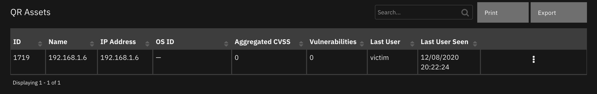

<!--
  This README.md is generated by running:
  "resilient-sdk docgen -p fn_qradar_enhanced_data"

  It is best edited using a Text Editor with a Markdown Previewer. VS Code
  is a good example. Checkout https://guides.github.com/features/mastering-markdown/
  for tips on writing with Markdown

  If you make manual edits and run docgen again, a .bak file will be created

  Store any screenshots in the "doc/screenshots" directory and reference them like:
  

  NOTE: If your app is available in the container-format only, there is no need to mention the integration server in this readme.
-->

# QRadar Enhanced Offense Data Migration

## Table of Contents
- [Release Notes](#release-notes)
- [Overview](#overview)
  - [Key Features](#key-features)
- [Requirements](#requirements)
  - [SOAR platform](#soar-platform)
  - [Cloud Pak for Security](#cloud-pak-for-security)
  - [Proxy Server](#proxy-server)
  - [QRadar Requirements](#qradar-requirements)
- [Installation](#installation)
  - [Install](#install)
  - [App Configuration](#app-configuration)
  - [MSSP Configuration](#mssp-configuration)
  - [Custom Layouts](#custom-layouts)
- [Function - QRadar Offense Summary](#function---qradar-offense-summary)
- [Function - QRadar Top Events](#function---qradar-top-events)
- [Script - Create Artifact from Destination IP info](#script---create-artifact-from-destination-ip-info)
- [Script - Create Artifact from Source IP info](#script---create-artifact-from-source-ip-info)
- [Script - Create Artifact from Events info](#script---create-artifact-from-events-info)
- [Script - Create Artifact from Assets info](#script---create-artifact-from-assets-info)
- [Script - Create Artifact from Flows info](#script---create-artifact-from-flows-info)
- [Data Table - QR Destination IPs (First 10 Events)](#data-table---qr-destination-ips-first-10-events)
- [Data Table - QR Triggered Rules](#data-table---qr-triggered-rules)
- [Data Table - QR Categories](#data-table---qr-categories)
- [Data Table - QR Assets](#data-table---qr-assets)
- [Data Table - QR Source IPs (First 10 Events)](#data-table---qr-source-ips-first-10-events)
- [Data Table - QR Events (First 10 Events)](#data-table---qr-events-first-10-events)
- [Data Table - QR Flows](#data-table---qr-flows)

- [Custom Fields](#custom-fields)
- [Rules](#rules)
- [Troubleshooting & Support](#troubleshooting--support)
---

## Release Notes
<!--
  Specify all changes in this release. Do not remove the release
  notes of a previous release
-->
| Version | Date | Notes |
| ------- | ---- | ----- |
| 1.2.3 | 04/2022 | Documentation updates and bug fix |
| 1.2.2 | 04/2022 | Delete search on time-out |
| 1.2.1 | 03/2022 | Bug fix |
| 1.2.0 | 01/2022 | Allow multiple QRadar instances |
| 1.1.3 | 01/2022 | Support for latest Analyst Workflow versions |
| 1.1.2 | 10/2021 | Update to use latest resilient-circuits |
| 1.1.1 | 07/2021 | Fixed selftest failing when using cafile |
| 1.1.0 | 07/2021 | Support for Flows and QRoc |
| 1.0.0 | 12/2020 | Initial Release |

* For customers upgrading from a previous release to 1.2.0 or greater, the app.config file must be manually edited to add new settings required to each server configuration. See [1.2.0 Changes](#1.2.0-changes)
---

## Overview
<!--
  Provide a high-level description of the function itself and its remote software or application.
  The text below is parsed from the "description" and "long_description" attributes in the setup.py file
-->

The QRadar Enhanced Offense Data Migration (EDM) app fetches a more complete view of data associated with a QRadar offense and provides live links within the SOAR case back to QRadar, thereby simplifying case management.

### Key Features
<!--
  List the Key Features of the Integration
-->
* Offense data available in a SOAR incident or case "QR Offense Details" tab to simplify reviewing information in one central and consistent location.
* Access to detailed offense information by links in SOAR to the QRadar Analyst Workflow.
* Centralize QRadar Offense IoC's associated with Security Events in the SOAR Artifacts tab, where SOAR enabled integrations can enrich and remediate cases and provide visibility to the response team.
---

## Requirements
<!--
  List any Requirements
-->
This app supports the IBM SOAR Platform and the IBM Cloud Pak for Security.

### SOAR platform
The SOAR platform supports two app deployment mechanisms, App Host and integration server.

If deploying to a SOAR platform with an App Host, the requirements are:
* SOAR platform >= `42.0.7058`.
* The app is in a container-based format (available from the AppExchange as a `zip` file).

If deploying to a SOAR platform with an integration server, the requirements are:
* SOAR platform >= `42.0.7058`.
* The app is in the older integration format (available from the AppExchange as a `zip` file which contains a `tar.gz` file).
* Integration server is running `resilient_circuits>=41.1.0`.
* If using an API key account, make sure the account provides the following minimum permissions:
  | Name | Permissions |
  | ---- | ----------- |
  | Org Data | Read |
  | Function | Read |
  | Layouts | Read , Edit |

The following SOAR platform guides provide additional information:
* _App Host Deployment Guide_: provides installation, configuration, and troubleshooting information, including proxy server settings.
* _Integration Server Guide_: provides installation, configuration, and troubleshooting information, including proxy server settings.
* _System Administrator Guide_: provides the procedure to install, configure and deploy apps.

The above guides are available on the IBM Knowledge Center at [ibm.biz/soar-docs](https://ibm.biz/soar-docs). On this web page, select your SOAR platform version. On the follow-on page, you can find the _App Host Deployment Guide_ or _Integration Server Guide_ by expanding **SOAR Apps** in the Table of Contents pane. The System Administrator Guide is available by expanding **System Administrator**.

### Cloud Pak for Security
If you are deploying to IBM Cloud Pak for Security, the requirements are:
* IBM Cloud Pak for Security >= 1.5.
* Cloud Pak is configured with an App Host.
* The app is in a container-based format (available from the AppExchange as a `zip` file).

The following Cloud Pak guides provide additional information:
* _App Host Deployment Guide_: provides installation, configuration, and troubleshooting information, including proxy server settings. From the Table of Contents, select Case Management and Orchestration & Automation > **Orchestration and Automation Apps**.
* _System Administrator Guide_: provides information to install, configure, and deploy apps. From the IBM Cloud Pak for Security Knowledge Center table of contents, select Case Management and Orchestration & Automation > **System administrator**.

These guides are available on the IBM Knowledge Center at [ibm.biz/cp4s-docs](https://ibm.biz/cp4s-docs). From this web page, select your IBM Cloud Pak for Security version. From the version-specific Knowledge Center page, select Case Management and Orchestration & Automation.

### Proxy Server
The app **does** support a proxy server.

### QRadar Requirements
The app works with QRadar 7.4.0 or higher and requires the QRadar Analayst Workflow app 1.2 or higher to be installed on QRadar. The QRadar Analyst workflow app can be downloaded from the IBM App Exchange - https://exchange.xforce.ibmcloud.com/hub/extension/123f9ec5a53214cc6e35b1e4700b0806

---

## Installation

### Install
* To install or uninstall an App or Integration on the _SOAR platform_, see the documentation at [ibm.biz/soar-docs](https://ibm.biz/soar-docs).
* To install or uninstall an App on _IBM Cloud Pak for Security_, see the documentation at [ibm.biz/cp4s-docs](https://ibm.biz/cp4s-docs) and follow the instructions above to navigate to Orchestration and Automation.

### App Configuration
The following table provides the settings you need to configure the app. These settings are made in the app.config file. See the documentation discussed in the Requirements section for the procedure.

| Config | Required | Example | Description |
| ------ | :------: | ------- | ----------- |
| **host** | Yes | `localhost` | *QRadar host* |
| **username** | Yes | `admin` | *QRadar account username.* |
| **qradarpassword** | Yes | `password` | *Password associated with the QRadar account username* |
| **qradartoken** | Yes | `cb971c75-b2f9-4445-aaae-xxxxxxxxxxxx` | *SEC Token generated in QRadar* |
| **verify_cert** | Yes | `/path/to/cert` | *Path to certificate or specify `false` if using self signed certificate* |
| **search_timeout** | No | `300` | *Timeout for the AQL search to be specified in seconds* |

#### 1.2.0 Changes
Starting in version 1.2.0, more than one QRadar instance can be configured for SOAR case data synchronization. For enterprises with only one QRadar instance, your app.config file will continue to define the QRadar instance under the `[fn_qradar_integration]` section header.

For enterprises with more than one QRadar instance, each instance will have it's own section header, such as `[fn_qradar_integration:qradar_instance_label]` where `qradar_instance_label` represents the message destination when QRadar Enhanced Data Migration (EDM) is paired with our QRadar Plugin for offense escalation. For instance the section header `[fn_qradar_integration:qradar_9_21_118_173_1110]` references the message destination `qradar_9_21_118_173_1110` created when the QRadar Plugin is configured for your IBM SOAR platform.

For other configurations, `qradar_instance_label` can represent any label helpful to define you QRadar environment. Be aware that modifications to the EDM workflows may be needed to correctly pass this label through the `qradar_label` function input field.

### MSSP Configuration

Make sure to follow the instructions in the Integration Server Guide to install the app on the Config org. Afterwards, have your system administrator push the app to the appropriate child orgs.

### Custom Layouts
<!--
  Use this section to provide guidance on where the user should add any custom fields and data tables.
  You may wish to recommend a new incident tab.
  You should save a screenshot "custom_layouts.png" in the doc/screenshots directory and reference it here
-->
Upon installation, this app adds a tab to those incidents or cases which are associated with a QRadar offense. The tab consists of custom fields and data tables with information associated with the offense. A few have links back to QRadar's Analyst Workflow. The data is populated during the initial escalation of an offense through this app.

All screenshots are examples of using the app with Cloud Pak.


---

## Function - QRadar Offense Summary
Fetch QRadar offense Details.


<details><summary>Inputs:</summary>
<p>

| Name | Type | Required | Example | Tooltip |
| ---- | :--: | :------: | ------- | ------- |
| `qradar_label` | `text` | No | `-` | Name of QRadar server to use from the app.config. See [1.2.0 Changes](#1.2.0-changes). |
| `qradar_offense_id` | `text` | No | `-` | The ID of the given offense |
| `qradar_query_type` | `text` | No | `-` | - |

</p>
</details>

<details><summary>Outputs:</summary>
<p>

```python
results = {
    {
   "qrhost":"192.xxx.xxx.xx",
   "offenseid":"331",
   "rules_data":[
      {
         "actions":{
            "eventAnnotation":"None",
            "offenseAnnotation":"None",
            "credibility":"None",
            "ensureOffense":True,
            "offenseMapping":{
               "id":"0",
               "name":"Source IP",
               "__typename":"OffenseType"
            },
            "relevance":"None",
            "severity":"None",
            "drop":False,
            "__typename":"RuleActions"
         },
         "creationDate":"1146812107068",
         "enabled":True,
         "groups":[
            {
               "fullName":"Recon",
               "name":"Recon",
               "__typename":"Group"
            }
         ],
         "id":"100289",
         "modificationDate":"1592840490372",
         "name":"Local L2L Database Scanner",
         "notes":"Reports a scan from a local host against other local targets. At least 30 hosts were scanned in 10 minutes. ",
         "owner":"admin",
         "origin":"SYSTEM",
         "responses":{
            "newEvents":{
               "name":"Local Database Scanner Detected",
               "__typename":"RuleResponseEvent"
            },
            "email":"None",
            "log":False,
            "addToReferenceData":"None",
            "addToReferenceSet":"None",
            "removeFromReferenceData":"None",
            "removeFromReferenceSet":"None",
            "notify":False,
            "notifySeverityOverride":False,
            "selectiveForwardingResponse":"None",
            "customAction":"None",
            "__typename":"RuleResponse"
         },
         "tests":[
            {
               "group":"Event Property Tests",
               "negate":False,
               "text":"when the event context is Local to Local, Local to Remote",
               "uid":"1",
               "__typename":"RuleTest"
            },
            {
               "group":"Functions",
               "negate":False,
               "text":"when an event matches any of the following <BB>BB:PortDefinition: Database Ports</BB>",
               "uid":"3",
               "__typename":"RuleTest"
            },
            {
               "group":"Functions",
               "negate":False,
               "text":"when any of these <BB>BB:CategoryDefinition: Recon Events</BB> <BB>BB:CategoryDefinition: Suspicious Events with the same source IP more than 5 times</BB> across more than 29 destination IP within 10 minutes",
               "uid":"4",
               "__typename":"RuleTest"
            }
         ],
         "type":"COMMON",
         "__typename":"Rule"
      }
   ]
}
}
```

</p>
</details>

<details><summary>Example Pre-Process Script:</summary>
<p>

```python
inputs.qradar_offense_id= incident.properties.qradar_id
inputs.qradar_query_type = "offenserules"
inputs.qradar_label = incident.properties.qradar_destination
```

</p>
</details>

<details><summary>Example Post-Process Script:</summary>
<p>

```python
link = "<a href=\"https://"+results.qrhost+"/console/ui/offenses?filter={0}%3B%3D%3B%3B{1}&page=1&pagesize=10\" target=\"_blank\">{2}</a>"

for event in results.rules_data:
  qradar_event = incident.addRow("qr_triggered_rules")
  qradar_event.rule_name = link.format("rules",event.id,event.name)
  qradar_event.rule_group = ", ".join(list(map(lambda x:x.name,list(filter(lambda x:x.name is not None,event.groups))))) if len(event.groups)>0 else ""
  qradar_event.rule_type = event.type
  qradar_event.enabled = "True" if event.enabled else "False"
  qradar_event.response = "Yes" if event.responses.newEvents or event.responses.email or event.responses.log or event.responses.addToReferenceData or event.responses.addToReferenceSet or event.responses.removeFromReferenceData or event.responses.removeFromReferenceSet or event.responses.notify or event.responses.notifySeverityOverride or event.responses.selectiveForwardingResponse or event.responses.customAction else "No"
  qradar_event.date_created = int(event.creationDate)
  qradar_event.last_modified = int(event.modificationDate)

```

</p>
</details>

---
## Function - QRadar Top Events
Search QRadar Top events for the given offense ID.


<details><summary>Inputs:</summary>
<p>

| Name | Type | Required | Example | Tooltip |
| ---- | :--: | :------: | ------- | ------- |
| `qradar_label` | `text` | No | `-` | Name of QRadar server to use from the app.config. See [1.2.0 Changes](#1.2.0-changes). |
| `qradar_query` | `textarea` | No | `-` | A QRadar query string with parameters |
| `qradar_query_type` | `text` | No | `-` | - |
| `qradar_search_param1` | `text` | No | `-` | - |
| `qradar_search_param2` | `text` | No | `-` | - |
| `qradar_search_param3` | `text` | No | `-` | - |
| `qradar_search_param4` | `text` | No | `-` | - |
| `qradar_search_param5` | `text` | No | `-` | - |
| `qradar_search_param6` | `text` | No | `-` | - |

</p>
</details>

<details><summary>Outputs:</summary>
<p>

```python
results = {
{
   "qrhost":"192.xxx.xxx.xx",
   "offenseid":"331",
   "events":[
      {
         "categoryname":"FTP Action Allowed",
         "magnitude":"9",
         "eventcount":"1",
         "eventtime":"1607458945836",
         "sourceipcount":"1",
         "destinationipcount":"1"
      },
      {
         "categoryname":"SFTP Login Succeeded",
         "magnitude":"6",
         "eventcount":"1",
         "eventtime":"1607458944884",
         "sourceipcount":"1",
         "destinationipcount":"1"
      },
      {
         "categoryname":"Firewall Deny",
         "magnitude":"8",
         "eventcount":"50",
         "eventtime":"1607458816101",
         "sourceipcount":"1",
         "destinationipcount":"50"
      },
      {
         "categoryname":"Network Sweep",
         "magnitude":"9",
         "eventcount":"1",
         "eventtime":"1607458807831",
         "sourceipcount":"1",
         "destinationipcount":"1"
      },
      {
         "categoryname":"Database Reconnaissance",
         "magnitude":"7",
         "eventcount":"1",
         "eventtime":"1607458796816",
         "sourceipcount":"1",
         "destinationipcount":"1"
      }
   ]
}
}
```

</p>
</details>

<details><summary>Example Pre-Process Script:</summary>
<p>

```python
inputs.qradar_search_param3 = incident.properties.qradar_id
inputs.qradar_query_type = "categories"
inputs.qradar_label = incident.properties.qradar_destination
```

</p>
</details>

<details><summary>Example Post-Process Script:</summary>
<p>

```python
link = "<a href=\"https://"+results.qrhost+"/console/ui/offenses/{0}/events?filter={1}%3B%3D%3B%3B{2}&page=1&pagesize=10\" target=\"_blank\">{3}</a>"

for event in results.events:
  qradar_event = incident.addRow("qr_categories")
  qradar_event.category_name = link.format(results.offenseid,"category_name",event.categoryname,event.categoryname)
  qradar_event.magnitude = link.format(results.offenseid,"category_name",event.categoryname,event.magnitude)
  qradar_event.event_count = link.format(results.offenseid,"category_name",event.categoryname,event.eventcount)
  qradar_event.event_time =  event.eventtime
  qradar_event.sourceip_count = link.format(results.offenseid,"category_name",event.categoryname,event.sourceipcount)
  qradar_event.destinationip_count =  link.format(results.offenseid,"category_name",event.categoryname,event.destinationipcount)

```

</p>
</details>

---

## Script - Create Artifact from Destination IP info
Create artifact from Destination IP information for the selected row.

**Object:** qr_top_destination_ips

<details><summary>Script Text:</summary>
<p>

```python
#
# We create artifacts according to how they can be mapped to
# SOAR default artifacts. If you have custom artifacts, and would like
# to map them as well, please modify the following mapping dict.
#

type_mapping = {
    "Destination IP": "IP Address",
}

import re


artifact_types = rule.properties.select_to_create_artifact_from_destip

for type in artifact_types:
  if type in type_mapping:
    artifact_description = "QRadar Offense {0}".format(type)
    if type=="Destination IP":
      incident.addArtifact(type_mapping[type], re.sub("<[^<>]+>","",row.destination_ip["content"]), artifact_description)


```

</p>
</details>

---
## Script - Create Artifact from Source IP info
Create artifact from Source IP information for the selected row.

**Object:** qr_top_source_ips

<details><summary>Script Text:</summary>
<p>

```python
#
# We create artifacts according to how they can be mapped to
# SOAR default artifacts. If you have custom artifacts, and would like
# to map them as well, please modify the following mapping dict.
#

type_mapping = {
    "Source IP": "IP Address",
    "MAC": "MAC Address",
}

import re

artifact_types = rule.properties.select_to_create_artifact_from_sourceip

for type in artifact_types:
  if type in type_mapping:
    artifact_description = "QRadar Offense {0}".format(type)
    if type=="Source IP":
      incident.addArtifact(type_mapping[type],re.sub("<[^<>]+>","",row.source_ip["content"]), artifact_description)
    elif type=="MAC":
      incident.addArtifact(type_mapping[type], row.mac, artifact_description)

```

</p>
</details>

---
## Script - Create Artifact from Events info
Create artifact from the Events information of the selected row.

**Object:** qr_offense_top_events

<details><summary>Script Text:</summary>
<p>

```python
#
# We create artifacts according to how they can be mapped to
# SOAR default artifacts. If you have custom artifacts, and would like
# to map them as well, please modify the following mapping dict.
#

type_mapping = {
    "Source IP": "IP Address",
    "Destination IP": "IP Address",
    "Username": "User Account"
}

import re


artifact_types = rule.properties.select_to_create_artifact

for type in artifact_types:
  if type in type_mapping:
    artifact_description = "QRadar Offense {0}".format(type)
    if type=="Source IP":
      incident.addArtifact(type_mapping[type],re.sub("<[^<>]+>","",row.source_ip["content"]), artifact_description)
    elif type=="Destination IP":
      incident.addArtifact(type_mapping[type], re.sub("<[^<>]+>","",row.destination_ip["content"]), artifact_description)
    elif type=="Username":
      incident.addArtifact(type_mapping[type], row.username, artifact_description)


```

</p>
</details>

---
## Script - Create Artifact from Assets info
Create artifact from Assets information for the selected row.

**Object:** qr_assets

<details><summary>Script Text:</summary>
<p>

```python
#
# We create artifacts according to how they can be mapped to
# SOAR default artifacts. If you have custom artifacts, and would like
# to map them as well, please modify the following mapping dict.
#

type_mapping = {
    "IP Address": "IP Address",
    "Name": "String",

}

import re


artifact_types = rule.properties.select_to_create_artifact_from_asset_info

for type in artifact_types:
  if type in type_mapping:
    artifact_description = "QRadar Offense {0}".format(type)
    if type=="IP Address":
     incident.addArtifact(type_mapping[type], row.ip_address["content"], artifact_description)
    elif type=="Name":
       incident.addArtifact(type_mapping[type], row.asset_name["content"], artifact_description)


```

</p>
</details>

---
## Script - Create Artifact from Flows info
Create artifact from the Flows info of the selected row.

**Object:** qr_flows

<details><summary>Script Text:</summary>
<p>

```python
#
# We create artifacts according to how they can be mapped to
# SOAR default artifacts. If you have custom artifacts, and would like
# to map them as well, please modify the following mapping dict.
#

type_mapping = {
    "Source IP": "IP Address",
    "Destination IP": "IP Address",
    "Source Port": "Port",
    "Destination Port": "Port"

}

import re


artifact_types = rule.properties.select_to_create_artifact_from_flows_info

for type in artifact_types:
  if type in type_mapping:
    artifact_description = "QRadar Offense {0}".format(type)
    if type=="Source IP":
      incident.addArtifact(type_mapping[type],row.source_ip["content"], artifact_description)
    elif type=="Destination IP":
      incident.addArtifact(type_mapping[type],row.destination_ip["content"], artifact_description)
    elif type=="Source Port":
      incident.addArtifact(type_mapping[type],row.source_ip["content"], artifact_description)
    elif type=="Destination Port":
      incident.addArtifact(type_mapping[type],row.destination_ip["content"], artifact_description)


```

</p>
</details>

---
## Data Table - QR Destination IPs (First 10)
The following is an example of QRadar Destination IP data table populated with the information related to Destination IPs associated with the offense.

 

#### API Name:
qr_top_destination_ips

#### Columns:
| Column Name | API Access Name | Type | Tooltip |
| ----------- | --------------- | ---- | ------- |
| Category Count | `category_count` | `textarea` | - |
| Destination IP | `destination_ip` | `textarea` | - |
| Event Count | `event_count` | `textarea` | - |
| Flow Count | `flow_count` | `textarea` | - |

---
## Data Table - QR Triggered Rules
The following is an example of QRadar Triggered Rules data table populated with the information related to Contributing Rules for the offense.

 

#### API Name:
qr_triggered_rules

#### Columns:
| Column Name | API Access Name | Type | Tooltip |
| ----------- | --------------- | ---- | ------- |
| Date Created | `date_created` | `datetimepicker` | - |
| Enabled | `enabled` | `text` | - |
| Last Modified | `last_modified` | `datetimepicker` | - |
| Response | `response` | `text` | - |
| Rule Group | `rule_group` | `text` | - |
| Rule Name | `rule_name` | `textarea` | - |
| Rule Type | `rule_type` | `text` | - |

---
## Data Table - QR Categories
The following is an example of QRadar Categories data table populated with the information related to Categories associated with the offense.

 

#### API Name:
qr_categories

#### Columns:
| Column Name | API Access Name | Type | Tooltip |
| ----------- | --------------- | ---- | ------- |
| Category Name | `category_name` | `textarea` | - |
| Destination IP | `destinationip_count` | `textarea` | - |
| Event Count | `event_count` | `textarea` | - |
| Event Time | `event_time` | `datetimepicker` | - |
| Flow Count | `flow_count` | `textarea` | - |
| Last Packet Time | `last_packet_time` | `datetimepicker` | - |
| Magnitude | `magnitude` | `textarea` | - |
| Source IP | `sourceip_count` | `textarea` | - |

---
## Data Table - QR Assets
The following is an example of QRadar Assets data table populated with the Assets information related to the offense.

 

#### API Name:
qr_assets

#### Columns:
| Column Name | API Access Name | Type | Tooltip |
| ----------- | --------------- | ---- | ------- |
| Aggregated CVSS | `aggregated_cvss` | `textarea` | - |
| ID | `asset_id` | `textarea` | - |
| Name | `asset_name` | `textarea` | - |
| IP Address | `ip_address` | `textarea` | - |
| Last User | `last_user` | `textarea` | - |
| Last User Seen | `last_user_seen` | `datetimepicker` | - |
| OS ID | `operating_system` | `textarea` | - |
| Vulnerabilities | `vulnerabilities` | `textarea` | - |

---
## Data Table - QR Source IPs (First 10 )
The following is an example of QRadar Source IP data table populated with the information related to Source IPs associated with the offense.

 

#### API Name:
qr_top_source_ips

#### Columns:
| Column Name | API Access Name | Type | Tooltip |
| ----------- | --------------- | ---- | ------- |
| Category Count | `category_count` | `textarea` | - |
| Domain | `domain` | `text` | - |
| Event Count | `event_count` | `textarea` | - |
| Flow Count | `flow_count` | `textarea` | - |
| MAC | `mac` | `text` | - |
| Network | `network` | `text` | - |
| Source IP | `source_ip` | `textarea` | - |
| Usernames | `usernames` | `textarea` | - |
| Vulnerability Count | `vulnerability_count` | `number` | - |

---
## Data Table - QR Events (First 10 Events)
The following is an example of QRadar Events data table populated with the information related to first 10 events associated with the offense.

 

#### API Name:
qr_offense_top_events

#### Columns:
| Column Name | API Access Name | Type | Tooltip |
| ----------- | --------------- | ---- | ------- |
| Category | `category` | `textarea` | - |
| Destination IP | `destination_ip` | `textarea` | - |
| Event Count | `event_count` | `textarea` | - |
| Event Name | `event_name` | `textarea` | - |
| Event Time | `event_time` | `datetimepicker` | - |
| Log Source | `log_source` | `textarea` | - |
| Magnitude | `magnitude` | `text` | - |
| Source IP | `source_ip` | `textarea` | - |
| Username | `username` | `text` | - |

---
## Data Table - QR Flows
The following is an example of QRadar Flows data table populated with the information related to flows associated with the offense.

 

#### API Name:
qr_flows

#### Columns:
| Column Name | API Access Name | Type | Tooltip |
| ----------- | --------------- | ---- | ------- |
| Application | `application` | `textarea` | - |
| Destination Bytes | `destination_bytes` | `number` | - |
| Destination IP | `destination_ip` | `textarea` | - |
| Destination Packets | `destination_packets` | `number` | - |
| Destination Port | `destination_port` | `textarea` | - |
| First Packet Time | `first_packet_time` | `datetimepicker` | - |
| Protocol | `protocol` | `textarea` | - |
| Source Bytes | `source_bytes` | `number` | - |
| Source IP | `source_ip` | `textarea` | - |
| Source Packets | `source_packets` | `number` | - |
| Source Port | `source_port` | `textarea` | - |

---
## Custom Fields
| Label | API Access Name | Type | Prefix | Placeholder | Tooltip |
| ----- | --------------- | ---- | ------ | ----------- | ------- |
| QR Assigned | `qr_assigned` | `textarea` | `properties` | - | The analyst to whom the QRadar offense is assigned to. |
| QR Credibility | `qr_credibility` | `textarea` | `properties` | - | Indicates the integrity of the offense as determined by the credibility rating that is configured in the log source. |
| QR Destination IP Count | `qr_destination_ip_count` | `textarea` | `properties` | - | The no. of Destination IPs associated with the QRadar offense |
| QR Event Count | `qr_event_count` | `textarea` | `properties` | - | The no. of events associated with the QRadar offense |
| QR Flow Count | `qr_flow_count` | `textarea` | `properties` | - | The no. of flows associated with the QRadar offense |
| QR Magnitude | `qr_magnitude` | `textarea` | `properties` | - | Indicates the relative importance of the offense. This value is calculated based on the relevance, severity, and credibility ratings. |
| QR Offense Index Type | `qr_offense_index_type` | `text` | `properties` | - | The type on which the QRadar offense is indexed |
| QR Offense Index Value | `qr_offense_index_value` | `text` | `properties` | - | The value by which QRadar offense is indexed |
| QR Offense Source  | `qr_offense_source` | `text` | `properties` | - | The source for the QRadar offense |
| QR Relevance | `qr_relevance` | `textarea` | `properties` | - | Indicates the importance of the destination.  QRadar determines the relevance by the weight that the administrator assigned to the networks and assets. |
| QR Severity | `qr_severity` | `textarea` | `properties` | - | Indicates the threat that an attack poses in relation to how prepared the destination is for the attack. |
| QR Source IP Count | `qr_source_ip_count` | `textarea` | `properties` | - | The no. of Source IPs associated with the QRadar offense |
| qradar_destination | `qradar_destination` | `text` | `properties` | - | QRadar Destination to Sync With |
| QR Offense Id | `qradar_id` | `text` | `properties` | - | - |

---

## Rules
| Rule Name | Object | Workflow Triggered |
| --------- | ------ | ------------------ |
| Create artifact from Source IP info | qr_top_source_ips | `-` |
| QRadar Enhanced Data | incident | `qradar_offense_summary, qradar_triggered_rules, qradar_destination_ips, qradar_source_ips, qradar_categories, qradar_assets_information,example_of_searching_qradar_top_events_using_offense_id ` |
| Create Artifact from Events info | qr_offense_top_events | `-` |
| Create Artifact from Assets info | qr_assets | `-` |
| Create artifact from Destination IP info | qr_top_destination_ips | `-` |

The rule, QRadar Enhanced Data, is an automatic rule that triggers when a new incident with a qradar_id value and a qradar_destination value is created, or an existing incident whose qradar_id value is updated. This rule triggers workflows as listed above and populates the offense information in the custom fields and data tables. The rules for creating artifacts are menu item rules associated with the data tables. These rules can be executed at row level to generate artifacts from the column values. The workflows' input and post processing scripts can be customized for data retrieval and data presentation.

---

## For Customers who do not use the QRadar-Plugin
Make sure at the time of escalation the field qradar_destination is mapped to have the appropriate value ( same as label in app.config).
If value not present at the time of case creation - have a rule on Incident creation that runs a script to populate the qradar_destination value.

## How to configure to use multiple QRadar servers that have the QRadar-Plugin installed
1. On the QRadar server, go to the configuration for the IBM QRadar SOAR Plugin.
2. Copy the string from QRadar Destination Name.

3. On SOAR, locate QRadar Enhanced Data Migration in the Apps tab and go to its app.config file in App Settings.
4. Locate [fn_qradar_enhanced_data:SOAR_Plugin_Destination_Name1] under File Content then replace `SOAR_Plugin_Destination_Name1` with the string copied in step 2.

5. Update the host, username, and other settings in this section with the correct data.

## How to configure to use a single QRadar Server
To use only a single server there are two ways this can be configured
1. Use the configuration used in QRadar Enhanced Data Migration versions prior to V1.2.0

2. Either keep the label, SOAR_Plugin_Destination_Name1, or change it (The label does not matter when only one server is configured)


## Incident fields that are required for the example automatic rule to run
The incident fields, qradar_id and qradar_destination are required to have values in order for the example automatic rule to be run.

## Creating workflows when server/servers in app.config are labeled
The function input field `qradar_label` is required when QRadar server/servers in the app.config are labeled. In the example workflows pre-process scripts the
input field `qradar_label` is defined the following way,
```python
inputs.qradar_label = incident.properties.qradar_destination
```

Example app.config server label: [fn_qradar_integration:qradar_4]
  `qradar_4` is the label in the above example

## Troubleshooting & Support
Refer to the documentation listed in the Requirements section for troubleshooting information.

### For Support
This is a IBM supported App. For assistance, see: https://ibm.com/mysupport.