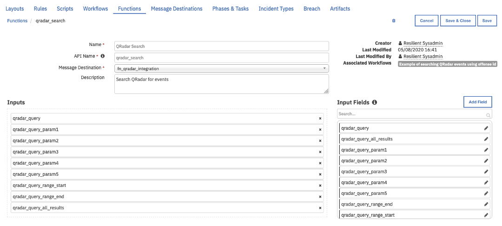
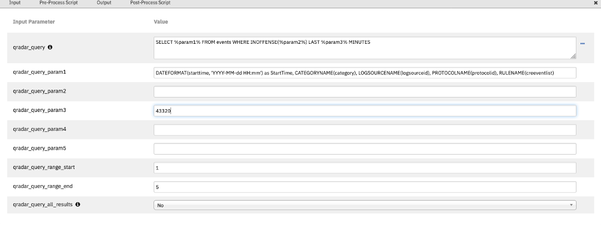
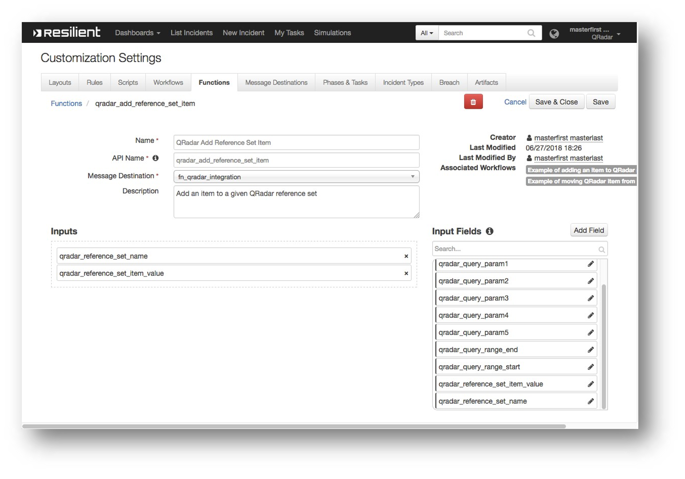
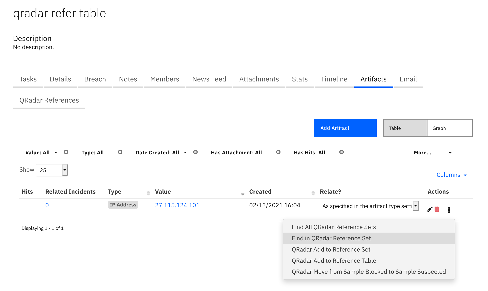
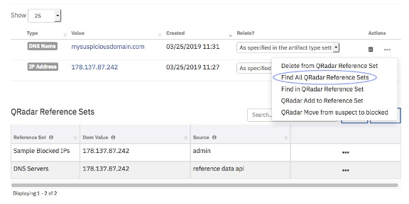
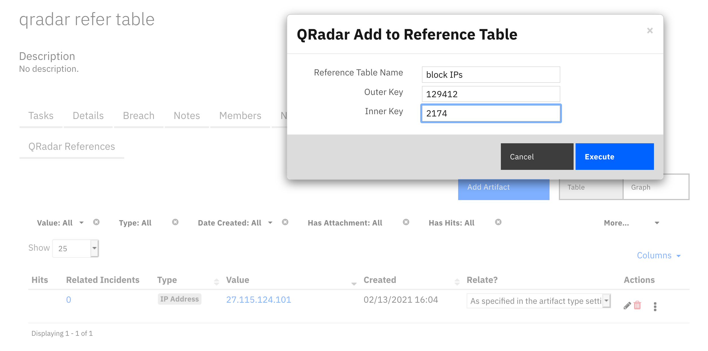

<!--
  This README.md is generated by running:
  "resilient-sdk docgen -p fn_qradar_integration"

  It is best edited using a Text Editor with a Markdown Previewer. VS Code
  is a good example. Checkout https://guides.github.com/features/mastering-markdown/
  for tips on writing with Markdown

  If you make manual edits and run docgen again, a .bak file will be created

  Store any screenshots in the "doc/screenshots" directory and reference them like:
  

  NOTE: If your app is available in the container-format only, there is no need to mention the integration server in this readme.
-->

# None

## Table of Contents
- [Release Notes](#release-notes)
- [Overview](#overview)
  - [Key Features](#key-features)
- [Requirements](#requirements)
  - [Resilient platform](#resilient-platform)
  - [Cloud Pak for Security](#cloud-pak-for-security)
  - [Proxy Server](#proxy-server)
- [Installation](#installation)
  - [Install](#install)
  - [App Configuration](#app-configuration)
  - [Custom Layouts](#custom-layouts)
- [Function - QRadar Search](#function---qradar-search)
- [Function - QRadar Add Reference Set Item](#function---qradar-add-reference-set-item)
- [Function - QRadar Find Reference Set Item](#function---qradar-find-reference-set-item)
- [Function - QRadar Delete Reference Set Item](#function---qradar-delete-reference-set-item)
- [Function - QRadar Find Reference Sets](#function---qradar-find-reference-sets)
- [Function - QRadar Reference Table Get All Tables](#function---qradar-reference-table-get-all-tables)
- [Function - QRadar Reference Table Get Table Data](#function---qradar-reference-table-get-table-data)
- [Function - QRadar Reference Table Add Item](#function---qradar-reference-table-add-item)
- [Function - QRadar Reference Table Update Item](#function---qradar-reference-table-update-item)
- [Function - QRadar Reference Table Delete Item](#function---qradar-reference-table-delete-item)
- [Data Table - QRadar Reference Sets](#data-table---qradar-reference-sets)
- [Data Table - QRadar Offense Events](#data-table---qradar-offense-events)
- [Data Table - QRadar Reference Tables](#data-table---qradar-reference-tables)
- [Data Table - QRadar Reference Table Queried Rows](#data-table---qradar-reference-table-queried-rows)
- [Custom Fields](#custom-fields)
- [Rules](#rules)
- [Troubleshooting & Support](#troubleshooting--support)
---

## Release Notes
<!--
  Specify all changes in this release. Do not remove the release 
  notes of a previous release
-->

| Version | Publication | Notes |
| ------- | ----------- | ----- |
| 2.1.1 | July. 2021 | Fixed selftest failing when using cafile |
| 2.1.0 | Feb. 2021 | Additional functions for reference table mapping. |
| 2.0.9 | Feb. 2021 | Bug fixes associated with require input field validation. |
| 2.0.8 | Nov. 2020 | Fixed a bug failing search function when used with token. | 
| 2.0.7 | July 2020 | Correct typos and describe optional Search activity field Update Resilient version. |
| 2.0.6 | May 2020 | Add option to return all results from Search. |
| 2.0.4 | April 2020 | Additional configuration notes. |
| 2.0 | March 2019 | Supports the 2.0 release. |
| 1.0 | July 2018 | Initial publication. |

---

## Overview
<!--
  Provide a high-level description of the function itself and its remote software or application.
  The text below is parsed from the "description" and "long_description" attributes in the setup.py file
-->
**Resilient Circuits Components for 'fn_qradar_integration'**

 

This guide describes the QRadar Function integrations.. 
The QRadar app with the Resilient platform package provides the following: 

* Search function to perform a QRadar Ariel query
* Search function to query an item in a QRadar reference set
* Search function to find all the reference sets that contain an item
* Add function to insert a new item in a QRadar reference set
* Delete function to remove an item from a QRadar reference set
* List all reference tables
* View all items associated with a given reference table
* Add/Update/Delete items to a QRadar reference table

With the above functions, this package includes example workflows that demonstrate how to call the functions, rules that start the example workflows, and custom data tables updated by the example workflows. 

---

## Requirements
<!--
  List any Requirements 
-->
This app supports the IBM Resilient SOAR Platform and the IBM Cloud Pak for Security.

### Resilient platform
The Resilient platform supports two app deployment mechanisms, App Host and integration server.

If deploying to a Resilient platform with an App Host, the requirements are:
* Resilient platform >= `37.0.5832`.
* The app is in a container-based format (available from the AppExchange as a `zip` file).

If deploying to a Resilient platform with an integration server, the requirements are:
* Resilient platform >= `37.0.5832`.
* The app is in the older integration format (available from the AppExchange as a `zip` file which contains a `tar.gz` file).
* Integration server is running `resilient_circuits>=30.0.0`.
* If using an API key account, make sure the account provides the following minimum permissions: 
  | Name | Permissions |
  | ---- | ----------- |
  | Org Data | Read |
  | Function | Read |

The following Resilient platform guides provide additional information: 
* _App Host Deployment Guide_: provides installation, configuration, and troubleshooting information, including proxy server settings. 
* _Integration Server Guide_: provides installation, configuration, and troubleshooting information, including proxy server settings.
* _System Administrator Guide_: provides the procedure to install, configure and deploy apps. 

The above guides are available on the IBM Knowledge Center at [ibm.biz/resilient-docs](https://ibm.biz/resilient-docs). On this web page, select your Resilient platform version. On the follow-on page, you can find the _App Host Deployment Guide_ or _Integration Server Guide_ by expanding **Resilient Apps** in the Table of Contents pane. The System Administrator Guide is available by expanding **System Administrator**.

### Cloud Pak for Security
If you are deploying to IBM Cloud Pak for Security, the requirements are:
* IBM Cloud Pak for Security >= 1.4.
* Cloud Pak is configured with an App Host.
* The app is in a container-based format (available from the AppExchange as a `zip` file).

The following Cloud Pak guides provide additional information: 
* _App Host Deployment Guide_: provides installation, configuration, and troubleshooting information, including proxy server settings. From the Table of Contents, select Case Management and Orchestration & Automation > **Orchestration and Automation Apps**.
* _System Administrator Guide_: provides information to install, configure, and deploy apps. From the IBM Cloud Pak for Security Knowledge Center table of contents, select Case Management and Orchestration & Automation > **System administrator**.

These guides are available on the IBM Knowledge Center at [ibm.biz/cp4s-docs](https://ibm.biz/cp4s-docs). From this web page, select your IBM Cloud Pak for Security version. From the version-specific Knowledge Center page, select Case Management and Orchestration & Automation.

### Proxy Server
The app **does/does not** support a proxy server.

---

## Package Dependencies
- resilient_circuits version 30 or later
- python version 2.7.10 or later, or 3.6 or later

## Installation

### Install
* To install or uninstall an App or Integration on the _Resilient platform_, see the documentation at [ibm.biz/resilient-docs](https://ibm.biz/resilient-docs).
* To install or uninstall an App on _IBM Cloud Pak for Security_, see the documentation at [ibm.biz/cp4s-docs](https://ibm.biz/cp4s-docs) and follow the instructions above to navigate to Orchestration and Automation.

### App Configuration
The following table provides the settings you need to configure the app. These settings are made in the app.config file. See the documentation discussed in the Requirements section for the procedure.

| Config | Required | Example | Description |
| ------ | :------: | ------- | ----------- |
| **host** | Yes | `localhost` | *QRadar host name or IP Address * |
| **username** | Yes | `admin` | *Username for QRadar authentication* |
| **qradarpassword** | Yes | `changeme` | *username password for QRadar authentication* |
| **qradartoken** | Yes | `changeme` | *QRadar token to use rather than password* |

### Custom Layouts
<!--
  Use this section to provide guidance on where the user should add any custom fields and data tables.
  You may wish to recommend a new incident tab.
  You should save a screenshot "custom_layouts.png" in the doc/screenshots directory and reference it here
-->
* Import the Data Tables and Custom Fields like the screenshot below, creating a new tab or using an
existing one for the datatables used:

  

---
## Function - QRadar Delete Reference Set Item
Delete an item from a given QRadar reference set


<details><summary>Inputs:</summary>
<p>

| Name | Type | Required | Example | Tooltip |
| ---- | :--: | :------: | ------- | ------- |
| `qradar_reference_set_item_value` | `text` | No | `-` | Value of a QRadar reference set item |
| `qradar_reference_set_name` | `text` | No | `-` | Name of a QRadar reference set |

</p>
</details>

<details><summary>Outputs:</summary>
<p>

```python
results = {
    # TODO: Copy and paste an example of the Function Output within this code block.
    # To view the output of a Function, run resilient-circuits in DEBUG mode and invoke the Function. 
    # The Function results will be printed in the logs: "resilient-circuits run --loglevel=DEBUG"
}
```

</p>
</details>

<details><summary>Example Pre-Process Script:</summary>
<p>

```python
inputs.qradar_reference_set_item_value = artifact.value
```

</p>
</details>

<details><summary>Example Post-Process Script:</summary>
<p>

```python
if results.status_code == 200:
  #Add a note
  incident.addNote("IP " + artifact.value + " removed successfully from Blocked list")
else:
  incident.addNote(u"Failed to remove {} from Blocked list, message: {}".format(artifact.value, results['content']['message']))
```

</p>
</details>


---
## Function - QRadar Search
Search QRadar for events

 

 

<details><summary>Inputs:</summary>
<p>

| Name | Type | Required | Example | Tooltip |
| ---- | :--: | :------: | ------- | ------- |
| `qradar_query` | `textarea` | No | `-` | A qradar query string with parameters |
| `qradar_query_all_results` | `select` | No | `-` | Display all results from search. By default, a range for the number of returned results is set. |
| `qradar_query_param1` | `text` | No | `-` | Additional dynamic parameters to use in the ariel query. |
| `qradar_query_param2` | `text` | No | `-` | - |
| `qradar_query_param3` | `text` | No | `-` | - |
| `qradar_query_param4` | `text` | No | `-` | - |
| `qradar_query_param5` | `text` | No | `-` | - |
| `qradar_query_range_end` | `number` | No | `-` | Epoch date for start of query |
| `qradar_query_range_start` | `number` | No | `-` | Epoch date for end of query |

</p>
</details>

<details><summary>Outputs:</summary>
<p>

```python
results = {
    # TODO: Copy and paste an example of the Function Output within this code block.
    # To view the output of a Function, run resilient-circuits in DEBUG mode and invoke the Function. 
    # The Function results will be printed in the logs: "resilient-circuits run --loglevel=DEBUG"
}
```

</p>
</details>

<details><summary>Example Pre-Process Script:</summary>
<p>

```python
inputs.qradar_query_param2 = incident.properties.qradar_id
if rule.properties.qradar_query_all_results:
  inputs.qradar_query_all_results = rule.properties.qradar_query_all_results
```

</p>
</details>

<details><summary>Example Post-Process Script:</summary>
<p>

```python
for event in results.events:
  qradar_event = incident.addRow("qradar_offense_event")
  qradar_event.start_time = event.StartTime
  qradar_event.category = event.categoryname_category
  qradar_event.log_source = event.logsourcename_logsourceid
  qradar_event.protocol = event.protocolname_protocolid
  qradar_event.rule = event.rulename_creeventlist
```

</p>
</details>


---
## Function - QRadar Add Reference Set Item
Add an item to a given QRadar reference set

 

<details><summary>Inputs:</summary>
<p>

| Name | Type | Required | Example | Tooltip |
| ---- | :--: | :------: | ------- | ------- |
| `qradar_reference_set_item_value` | `text` | No | `-` | Value of a QRadar reference set item |
| `qradar_reference_set_name` | `text` | No | `-` | Name of a QRadar reference set |

</p>
</details>

<details><summary>Outputs:</summary>
<p>

```python
results = {
    # TODO: Copy and paste an example of the Function Output within this code block.
    # To view the output of a Function, run resilient-circuits in DEBUG mode and invoke the Function. 
    # The Function results will be printed in the logs: "resilient-circuits run --loglevel=DEBUG"
}
```

</p>
</details>

<details><summary>Example Pre-Process Script:</summary>
<p>

```python
inputs.qradar_reference_set_item_value = artifact.value
```

</p>
</details>

<details><summary>Example Post-Process Script:</summary>
<p>

```python
if results.status_code == 200:
  incident.addNote(u"IP: {} added to blocked IPs reference set: {}".format(artifact.value, results['content']['name']))
else:
  incident.addNote(u"Failed to add IP: {} to reference set. Status Code: {}, message: {}".format(artifact.value, results.status_code, results['content']['message']))
```

</p>
</details>

---
## Function - QRadar Find Reference Set Item
Find an item in a given QRadar reference set

 

<details><summary>Inputs:</summary>
<p>

| Name | Type | Required | Example | Tooltip |
| ---- | :--: | :------: | ------- | ------- |
| `qradar_reference_set_item_value` | `text` | No | `-` | Value of a QRadar reference set item |
| `qradar_reference_set_name` | `text` | No | `-` | Name of a QRadar reference set |

</p>
</details>

<details><summary>Outputs:</summary>
<p>

```python
results = {
    # TODO: Copy and paste an example of the Function Output within this code block.
    # To view the output of a Function, run resilient-circuits in DEBUG mode and invoke the Function. 
    # The Function results will be printed in the logs: "resilient-circuits run --loglevel=DEBUG"
}
```

</p>
</details>

<details><summary>Example Pre-Process Script:</summary>
<p>

```python
inputs.qradar_reference_set_item_value = artifact.value
```

</p>
</details>

<details><summary>Example Post-Process Script:</summary>
<p>

```python
if results.found == "True":
  incident.addNote(u"Found IP: {} in list: {}.".format(artifact.value, results['content']['name']))
else:
  incident.addNote("IP:{} not found in list.".format(artifact.value))
  
"""
{
  'status_code': 200,
  'found': 'True',
  'content': {
    'time_to_live': '20 years 4 mons 22 days 0 hours 0 mins 0.00 secs',
    'timeout_type': 'FIRST_SEEN',
    'number_of_elements': 2,
    'data': [
      {
        'last_seen': 1594386447789,
        'first_seen': 1594386447789,
        'source': 'reference data api',
        'value': '169.254.3.2',
        'domain_id': None
      },
      {
        'last_seen': 1595364392956,
        'first_seen': 1595364392956,
        'source': 'reference data api',
        'value': '1.2.3.4',
        'domain_id': None
      }
    ],
    'creation_time': 1587585219697,
    'name': 'Sample Blocked IPs',
    'namespace': 'SHARED',
    'element_type': 'IP',
    'collection_id': 32
  }
}
"""
```

</p>
</details>

---
## Function - QRadar Find Reference Sets
Find reference sets that contain a given item value, together with information about this item in those reference sets. Information includes whether this item is added to the reference set manually or by a rule.

 

<details><summary>Inputs:</summary>
<p>

| Name | Type | Required | Example | Tooltip |
| ---- | :--: | :------: | ------- | ------- |
| `qradar_reference_set_item_value` | `text` | No | `-` | Value of a QRadar reference set item |

</p>
</details>

<details><summary>Outputs:</summary>
<p>

```python
results = {
    # TODO: Copy and paste an example of the Function Output within this code block.
    # To view the output of a Function, run resilient-circuits in DEBUG mode and invoke the Function. 
    # The Function results will be printed in the logs: "resilient-circuits run --loglevel=DEBUG"
}
```

</p>
</details>

<details><summary>Example Pre-Process Script:</summary>
<p>

```python
inputs.qradar_reference_set_item_value = artifact.value
```

</p>
</details>

<details><summary>Example Post-Process Script:</summary>
<p>

```python
items = results.reference_items
"""
  Sample data:
  [{u'name': u'RF Risklist', u'timeout_type': u'FIRST_SEEN', u'creation_time': 1549376859164, u'element_type': u'IP', u'number_of_elements': 5, u'data': [{u'source': u'admin', u'first_seen': 1549477737993, u'value': u'46.21.147.161', u'last_seen': 1549477737993}]}]

"""
if items:
  for item in items:
      item_row = incident.addRow("qradar_reference_set")
      item_row["reference_set"] = item["name"]
      item_row["item_value"] = item["data"][0]["value"]
      item_row["source"] = item["data"][0]["source"]
else:
  incident.addNote("No reference sets contain artifact: {}".format(artifact.value))
```

</p>
</details>

---
## Function - QRadar Reference Table Get All Tables
Get all reference tables from a QRadar instance

 

<details><summary>Inputs:</summary>
<p>

None

</p>
</details>

<details><summary>Outputs:</summary>
<p>

```python
results = {
    # TODO: Copy and paste an example of the Function Output within this code block.
    # To view the output of a Function, run resilient-circuits in DEBUG mode and invoke the Function. 
    # The Function results will be printed in the logs: "resilient-circuits run --loglevel=DEBUG"
}
```

</p>
</details>

<details><summary>Example Pre-Process Script:</summary>
<p>

```python
None
```

</p>
</details>

<details><summary>Example Post-Process Script:</summary>
<p>

```python
"""
  Sample data:
  [{u'creation_time': 1464119408489L, u'collection_id': 186, u'key_name_types': {u'First Seen Date': u'DATE', u'Confidence': u'NUM', u'Last Seen Date': u'DATE', u'Provider': u'ALN'}, u'timeout_type': u'LAST_SEEN', u'name': u'Phishing Senders Data', u'namespace': u'SHARED', u'element_type': u'ALNIC', u'number_of_elements': 0}, {u'creation_time': 1464119422432L, u'collection_id': 182, u'key_name_types': {u'First Seen Date': u'DATE', u'Confidence': u'NUM', u'Last Seen Date': u'DATE', u'Provider': u'ALN'}, u'timeout_type': u'LAST_SEEN', u'name': u'Rogue Process Names Data', u'namespace': u'SHARED', u'element_type': u'ALNIC', u'number_of_elements': 0}]
"""
if results.success:
  for item in results.content:
        item_row = incident.addRow("qradar_reference_table")
        item_row["reference_table"] = item["name"]
        item_row["collection_id"] = item["collection_id"]
        item_row["number_of_elements"] = item["number_of_elements"]
        item_row["namespace"] = item["namespace"]
  else:
    incident.addNote("No reference tables found")
else:
  incident.addNote("An error occurred getting the reference tables: {}".formt(results.reason))

```

</p>
</details>

---
## Function - QRadar Reference Table Get Table Data
Get all items associated with a QRadar Reference table

 

<details><summary>Inputs:</summary>
<p>

| Name | Type | Required | Example | Tooltip |
| ---- | :--: | :------: | ------- | ------- |
| `qradar_reference_table_name` | `text` | Yes | `-` | Value of a QRadar reference table item |

</p>
</details>

<details><summary>Outputs:</summary>
<p>

```python
results = {
    # TODO: Copy and paste an example of the Function Output within this code block.
    # To view the output of a Function, run resilient-circuits in DEBUG mode and invoke the Function. 
    # The Function results will be printed in the logs: "resilient-circuits run --loglevel=DEBUG"
}
```

</p>
</details>

<details><summary>Example Pre-Process Script:</summary>
<p>

```python
inputs.qradar_reference_table_name = row['reference_table']
```

</p>
</details>

<details><summary>Example Post-Process Script:</summary>
<p>

```python
if results.success:
  for outer_key, item in results.content.get('data',[]).items():
    for inner_key, inner_item in item.items():
      row = incident.addRow('qradar_reference_table_queried_rows')
      row['table'] = results.inputs.qradar_reference_table_name
      row['outer_key'] = outer_key
      row['inner_key'] = inner_key
      
      row['value'] = inner_item['value']
      row['status'] = 'active'
else:
  incident.addNote("An error occurred getting the reference table data: {}".format(results.reason))
```

</p>
</details>


---
## Function - QRadar Reference Table Add Item
Add an item to a given QRadar reference table

 

<details><summary>Inputs:</summary>
<p>

| Name | Type | Required | Example | Tooltip |
| ---- | :--: | :------: | ------- | ------- |
| `qradar_reference_table_item_inner_key` | `text` | No | `-` | The inner key for a QRadar Reference Table  |
| `qradar_reference_table_item_outer_key` | `text` | No | `-` | The outer key for a QRadar Reference Table  |
| `qradar_reference_table_item_value` | `text` | No | `-` | Value of a QRadar reference table item |
| `qradar_reference_table_name` | `text` | No | `-` | Value of a QRadar reference table item |

</p>
</details>

<details><summary>Outputs:</summary>
<p>

```python
results = {
    # TODO: Copy and paste an example of the Function Output within this code block.
    # To view the output of a Function, run resilient-circuits in DEBUG mode and invoke the Function. 
    # The Function results will be printed in the logs: "resilient-circuits run --loglevel=DEBUG"
}
```

</p>
</details>

<details><summary>Example Pre-Process Script:</summary>
<p>

```python

# Example inputs 
inputs.qradar_reference_table_name = row.reference_table
inputs.qradar_reference_table_item_outer_key = rule.properties.qradar_ref_table_outer_key or "1"
inputs.qradar_reference_table_item_inner_key = rule.properties.qradar_ref_table_inner_key or "city"
inputs.qradar_reference_table_item_value = rule.properties.qradar_ref_table_update
```

</p>
</details>

<details><summary>Example Post-Process Script:</summary>
<p>

```python
note = u"""Outer key: {}
Inner key: {}
Entry: {}
Reference table: {}""".format(results.inputs.qradar_reference_table_item_outer_key,
                              results.inputs.qradar_reference_table_item_inner_key,
                              results.inputs.qradar_reference_table_item_value, 
                              results.inputs.qradar_reference_table_name)
if results.success:
    incident.addNote(u"Successful add\n{}".format(note))
    row.number_of_elements = str(results["content"]["content"]["number_of_elements"])
else:
    incident.addNote(u"Failure to add item: {}\n{}".format(results['reason'], note))
```

</p>
</details>

---
## Function - QRadar Reference Table Update Item
Update an item in a given QRadar reference table


<details><summary>Inputs:</summary>
<p>

| Name | Type | Required | Example | Tooltip |
| ---- | :--: | :------: | ------- | ------- |
| `qradar_reference_table_item_inner_key` | `text` | No | `-` | The inner key for a QRadar Reference Table  |
| `qradar_reference_table_item_outer_key` | `text` | No | `-` | The outer key for a QRadar Reference Table  |
| `qradar_reference_table_item_value` | `text` | No | `-` | Value of a QRadar reference table item |
| `qradar_reference_table_name` | `text` | No | `-` | Value of a QRadar reference table item |

</p>
</details>

<details><summary>Outputs:</summary>
<p>

```python
results = {
    # TODO: Copy and paste an example of the Function Output within this code block.
    # To view the output of a Function, run resilient-circuits in DEBUG mode and invoke the Function. 
    # The Function results will be printed in the logs: "resilient-circuits run --loglevel=DEBUG"
}
```

</p>
</details>

<details><summary>Example Pre-Process Script:</summary>
<p>

```python

inputs.qradar_reference_table_name = row.table
inputs.qradar_reference_table_item_outer_key = row.outer_key
inputs.qradar_reference_table_item_inner_key = row.inner_key


if rule.properties.qradar_ref_table_update:
  inputs.qradar_reference_table_item_value = rule.properties.qradar_ref_table_update
else:
  inputs.qradar_reference_table_item_value = "This is an example"
```

</p>
</details>

<details><summary>Example Post-Process Script:</summary>
<p>

```python
note = u"""Outer key: {}
Inner key: {}
Entry: {}
Reference table: {}""".format(results.inputs.qradar_reference_table_item_outer_key,
                              results.inputs.qradar_reference_table_item_inner_key,
                              results.inputs.qradar_reference_table_item_value, 
                              results.inputs.qradar_reference_table_name)
if results.success:
    incident.addNote(u"Successful updated\n{}".format(note))
    row['status'] = 'updated'
else:
    incident.addNote(u"Failure to updated item: {}\n{}".format(results['reason'], note))
```

</p>
</details>

---

## Data Table - QRadar Reference Table Queried Rows

 

#### API Name:
qradar_reference_table_queried_rows

#### Columns:
| Column Name | API Access Name | Type | Tooltip |
| ----------- | --------------- | ---- | ------- |
| Inner Key | `inner_key` | `text` | - |
| Outer Key | `outer_key` | `text` | - |
| Table | `table` | `text` | - |
| Value | `value` | `text` | - |
| Status | `status` | `text` | - |

---

## Function - QRadar Reference Table Delete Item
Delete an item from a given QRadar reference table


<details><summary>Inputs:</summary>
<p>

| Name | Type | Required | Example | Tooltip |
| ---- | :--: | :------: | ------- | ------- |
| `qradar_reference_table_item_inner_key` | `text` | No | `-` | The inner key for a QRadar Reference Table  |
| `qradar_reference_table_item_outer_key` | `text` | No | `-` | The outer key for a QRadar Reference Table  |
| `qradar_reference_table_item_value` | `text` | No | `-` | Value of a QRadar reference table item |
| `qradar_reference_table_name` | `text` | No | `-` | Value of a QRadar reference table item |

</p>
</details>

<details><summary>Outputs:</summary>
<p>

```python
results = {
    # TODO: Copy and paste an example of the Function Output within this code block.
    # To view the output of a Function, run resilient-circuits in DEBUG mode and invoke the Function. 
    # The Function results will be printed in the logs: "resilient-circuits run --loglevel=DEBUG"
}
```

</p>
</details>

<details><summary>Example Pre-Process Script:</summary>
<p>

```python
inputs.qradar_reference_table_name = row.table
inputs.qradar_reference_table_item_outer_key = row.outer_key
inputs.qradar_reference_table_item_inner_key = row.inner_key
inputs.qradar_reference_table_item_value = row.value
```

</p>
</details>

<details><summary>Example Post-Process Script:</summary>
<p>

```python
note = u"""Outer key: {}
Inner key: {}
Entry: {}
Reference table: {}""".format(results.inputs.qradar_reference_table_item_outer_key,
                              results.inputs.qradar_reference_table_item_inner_key,
                              results.inputs.qradar_reference_table_item_value, 
                              results.inputs.qradar_reference_table_name)
if results.success:
    incident.addNote(u"Successful delete\n{}".format(note))
    row['status'] = "deleted"
else:
    incident.addNote(u"Failure to delete item: {}\n{}".format(results['reason'], note))
```

</p>
</details>

---
## Data Table - QRadar Offense Events

#### API Name:
qradar_offense_event

#### Columns:
| Column Name | API Access Name | Type | Tooltip |
| ----------- | --------------- | ---- | ------- |
| Category | `category` | `text` | category |
| Log Source | `log_source` | `text` | logsourceid |
| Protocol | `protocol` | `text` | protocolid |
| Rule | `rule` | `text` | creeventlist |
| Start Time | `start_time` | `text` | starttime |

---
## Data Table - QRadar Reference Tables

#### API Name:
qradar_reference_table

#### Columns:
| Column Name | API Access Name | Type | Tooltip |
| ----------- | --------------- | ---- | ------- |
| Reference Table | `reference_table` | `text` | - |
| Collection Id | `collection_id` | `text` | - |
| Namespace | `namespace` | `text` | - |
| Number Of Elements | `number_of_elements` | `text` | - |

---
## Data Table - QRadar Reference Sets

#### API Name:
qradar_reference_set

#### Columns:
| Column Name | API Access Name | Type | Tooltip |
| ----------- | --------------- | ---- | ------- |
| Item Value | `item_value` | `text` | Item value |
| Reference Set | `reference_set` | `text` | Name of reference set |
| Source | `source` | `text` | how this value is added to the reference set |

---

## Rules
| Rule Name | Object | Workflow Triggered |
| --------- | ------ | ------------------ |
| Find All QRadar Reference Sets | artifact | `qradar_find_reference_sets_artifact` |
| QRadar Add to Reference Set | artifact | `qradar_add_reference_set_item` |
| Search QRadar for offense id | incident | `qradar_search_event_offense` |
| Find in QRadar Reference Set | artifact | `qradar_find_reference_set_item` |
| QRadar Move from Sample Blocked to Sample Suspected | artifact | `qradar_move_item_to_different_ref_set` |
| Example: QRadar - Update this Reference Table Item | qradar_reference_table_queried_rows | `example_qradar__update_this_reference_table_item` |
| Example: QRadar - Gather Reference Table Data | qradar_reference_table | `qradar_get_reference_table_data` |
| Example: QRadar - Get all Reference Tables | incident | `example_qradar__get_all_reference_tables` |
| Add a reference table item | artifact | `add_a_reference_table_item` |
| Example: QRadar - Add Item to this Reference Table | qradar_reference_table | `example_qradar__add_reference_table_item_dt` |
| Example: QRadar - Delete this Reference Table Item | qradar_reference_table_queried_rows | `example_qradar__delete_reference_table_item_dt` |
---

## Troubleshooting & Support
Refer to the documentation listed in the Requirements section for troubleshooting information.

### For Support
This is a IBM Community provided App. Please search the Community https://ibm.biz/resilientcommunity for assistance.
