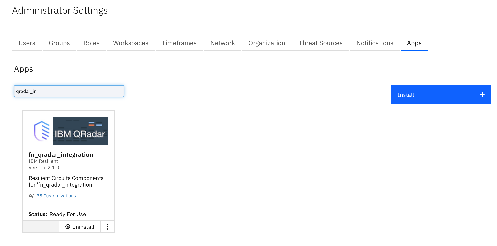
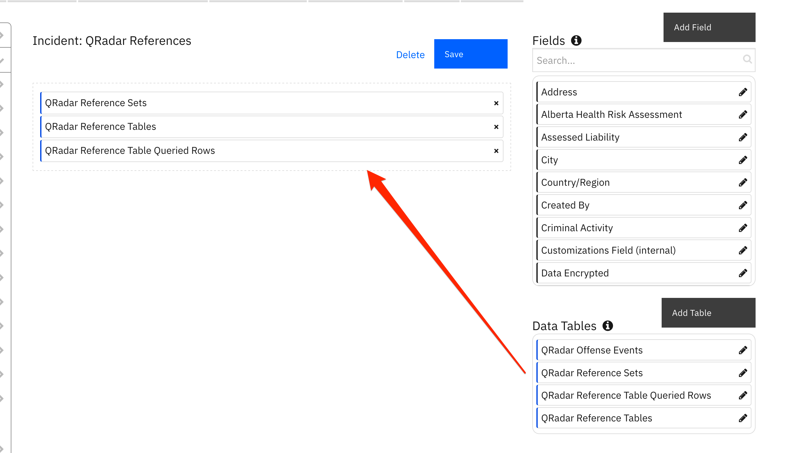
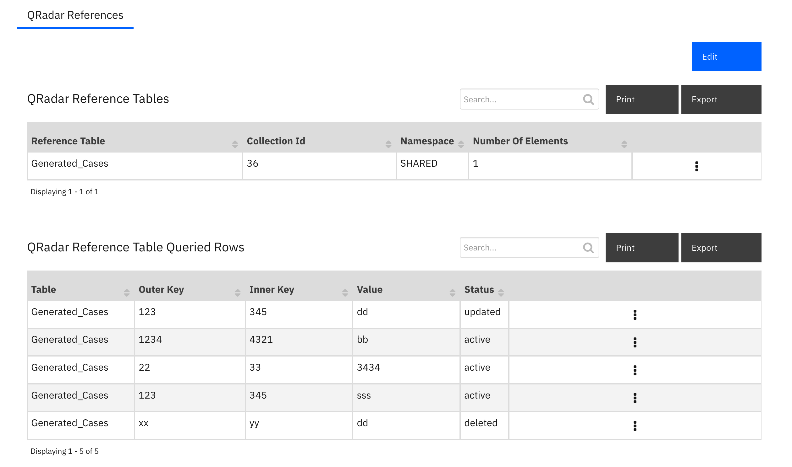
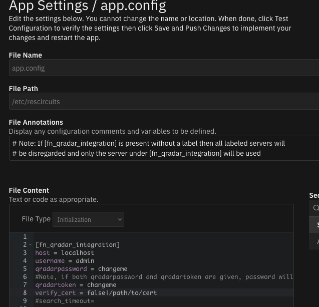
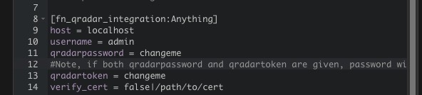

# QRadar Integration

## Table of Contents
- [Release Notes](#release-notes)
- [Overview](#overview)
  - [Key Features](#key-features)
- [Requirements](#requirements)
  - [SOAR platform](#SOAR-platform)
  - [Cloud Pak for Security](#cloud-pak-for-security)
  - [Proxy Server](#proxy-server)
- [Installation](#installation)
  - [Install](#install)
  - [App Configuration](#app-configuration)
  - [Custom Layouts](#custom-layouts)
- [Function - QRadar Search](#function---qradar-search)
- [Function - QRadar Add Reference Set Item](#function---qradar-add-reference-set-item)
- [Function - QRadar Find Reference Set Item](#function---qradar-find-reference-set-item)
- [Function - QRadar Delete Reference Set Item](#function---qradar-delete-reference-set-item)
- [Function - QRadar Find Reference Sets](#function---qradar-find-reference-sets)
- [Function - QRadar Reference Table Get All Tables](#function---qradar-reference-table-get-all-tables)
- [Function - QRadar Reference Table Get Table Data](#function---qradar-reference-table-get-table-data)
- [Function - QRadar Reference Table Add Item](#function---qradar-reference-table-add-item)
- [Function - QRadar Reference Table Update Item](#function---qradar-reference-table-update-item)
- [Function - QRadar Reference Table Delete Item](#function---qradar-reference-table-delete-item)
- [Data Table - QRadar Reference Sets](#data-table---qradar-reference-sets)
- [Data Table - QRadar Offense Events](#data-table---qradar-offense-events)
- [Data Table - QRadar Reference Tables](#data-table---qradar-reference-tables)
- [Data Table - QRadar Reference Table Queried Rows](#data-table---qradar-reference-table-queried-rows)
- [Custom Fields](#custom-fields)
- [Rules](#rules)
- [Troubleshooting & Support](#troubleshooting--support)
---

## Release Notes

| Version | Publication | Notes |
| ------- | ----------- | ----- |
| 2.2.5 | July. 2022 | Bug Fix for windows clients |
| 2.2.4 | July. 2022 | Update SOAR required version |
| 2.2.3 | June. 2022 | Bug fix for using with MSSP |
| 2.2.2 | May. 2022 | Add more documentation and bug fix |
| 2.2.1 | March 2022 | Cancel QRadar queries which have timed out |
| 2.2.0 | March 2022 | Allow multiple QRadar instances |
| 2.1.1 | July 2021 | Fixed selftest failing when using cafile |
| 2.1.0 | Feb. 2021 | Additional functions for reference table mapping. |
| 2.0.9 | Feb. 2021 | Bug fixes associated with require input field validation. |
| 2.0.8 | Nov. 2020 | Fixed a bug failing search function when used with token. |
| 2.0.7 | July 2020 | Correct typos and describe optional Search activity field Update SOAR version. |
| 2.0.6 | May 2020 | Add option to return all results from Search. |
| 2.0.4 | April 2020 | Additional configuration notes. |
| 2.0 | March 2019 | Supports the 2.0 release. |
| 1.0 | July 2018 | Initial publication. |

* For customers upgrading from a previous release to 2.2.0 or greater, the app.config file must be manually edited to add new settings required to each server configuration. See [2.2.0 Changes](#2.2.0-changes)

---

## Overview
<!--
  Provide a high-level description of the function itself and its remote software or application.
  The text below is parsed from the "description" and "long_description" attributes in the setup.py file
-->
**IBM QRadar SOAR Compnents for 'fn_qradar_integration'**

 

This guide describes the QRadar Function integrations..
The QRadar app with the SOAR platform package provides the following:

* Search function to perform a QRadar Ariel query
* Search function to query an item in a QRadar reference set
* Search function to find all the reference sets that contain an item
* Add function to insert a new item in a QRadar reference set
* Delete function to remove an item from a QRadar reference set
* List all reference tables
* View all items associated with a given reference table
* Add/Update/Delete items to a QRadar reference table

With the above functions, this package includes example workflows that demonstrate how to call the functions, rules that start the example workflows, and custom data tables updated by the example workflows.

---

## Requirements
<!--
  List any Requirements
-->
This app supports the IBM QRadar SOAR Platform and the IBM Cloud Pak for Security.

### SOAR platform
The SOAR platform supports two app deployment mechanisms, App Host and integration server.

If deploying to a SOAR platform with an App Host, the requirements are:
* SOAR platform >= `42.0.7058`.
* The app is in a container-based format (available from the AppExchange as a `zip` file).

If deploying to a SOAR platform with an integration server, the requirements are:
* SOAR platform >= `42.0.7058`.
* The app is in the older integration format (available from the AppExchange as a `zip` file which contains a `tar.gz` file).
* Integration server is running `resilient_circuits>=39.0.0`.
* If using an API key account, make sure the account provides the following minimum permissions:
  | Name | Permissions |
  | ---- | ----------- |
  | Org Data | Read, edit |
  | Function | Read |

The following SOAR platform guides provide additional information:
* _App Host Deployment Guide_: provides installation, configuration, and troubleshooting information, including proxy server settings.
* _Integration Server Guide_: provides installation, configuration, and troubleshooting information, including proxy server settings.
* _System Administrator Guide_: provides the procedure to install, configure and deploy apps.

The above guides are available on the IBM Knowledge Center at [ibm.biz/soar-docs](https://ibm.biz/soar-docs). On this web page, select your SOAR platform version. On the follow-on page, you can find the _App Host Deployment Guide_ or _Integration Server Guide_ by expanding **SOAR Apps** in the Table of Contents pane. The System Administrator Guide is available by expanding **System Administrator**.

### Cloud Pak for Security
If you are deploying to IBM Cloud Pak for Security, the requirements are:
* IBM Cloud Pak for Security >= 1.4.
* Cloud Pak is configured with an App Host.
* The app is in a container-based format (available from the AppExchange as a `zip` file).

The following Cloud Pak guides provide additional information:
* _App Host Deployment Guide_: provides installation, configuration, and troubleshooting information, including proxy server settings. From the Table of Contents, select Case Management and Orchestration & Automation > **Orchestration and Automation Apps**.
* _System Administrator Guide_: provides information to install, configure, and deploy apps. From the IBM Cloud Pak for Security Knowledge Center table of contents, select Case Management and Orchestration & Automation > **System administrator**.

These guides are available on the IBM Knowledge Center at [ibm.biz/cp4s-docs](https://ibm.biz/cp4s-docs). From this web page, select your IBM Cloud Pak for Security version. From the version-specific Knowledge Center page, select Case Management and Orchestration & Automation.

### Proxy Server
The app **does not** support a proxy server.

---

## Package Dependencies
- resilient_circuits version 42 or later
- python version 3.6 or later

## Installation

### Install
* To install or uninstall an App or Integration on the _SOAR platform_, see the documentation at [ibm.biz/soar-docs](https://ibm.biz/soar-docs).
* To install or uninstall an App on _IBM Cloud Pak for Security_, see the documentation at [ibm.biz/cp4s-docs](https://ibm.biz/cp4s-docs) and follow the instructions above to navigate to Orchestration and Automation.

### App Configuration
The following table provides the settings you need to configure the app. These settings are made in the app.config file. See the documentation discussed in the Requirements section for the procedure.

| Config | Required | Example | Description |
| ------ | :------: | ------- | ----------- |
| **host** | Yes | `localhost` | *QRadar host name or IP Address * |
| **username** | Yes | `admin` | *Username for QRadar authentication* |
| **qradarpassword** | Yes | `changeme` | *username password for QRadar authentication* |
| **qradartoken** | Yes | `changeme` | *QRadar token to use rather than password* |
| **verify_cert** | Yes | `false|/path/to/cert` | *false or path to the certificate file* |

#### 2.2.0 Changes
Starting in version 2.2.0, more than one QRadar instance can be configured for SOAR case data synchronization. For enterprises with only one QRadar instance, your app.config file will continue to define the QRadar instance under the `[fn_qradar_integration]` section header.

For enterprises with more than one QRadar instance, each instance will have it's own section header, such as `[fn_qradar_integration:qradar_instance_label]` where `qradar_instance_label` represents any label helpful to define you QRadar environment.

Be aware that modifications to the workflows will be needed to correctly pass this label through the `qradar_label` function input field if the QRadar server/servers in the app.config have labels.

If you have existing custom workflows, see [Creating workflows when server/servers in app.config are labeled](#creating-workflows-when-serverservers-in-appconfig-are-labeled) for more information about changing them to reference the `qradar_label` function input field.

### Custom Layouts
* Import the Data Tables and Custom Fields like the screenshot below, creating a new tab or using an
existing one for the datatables used:

  

---

## Function - QRadar Add Reference Set Item
Add an item to a given QRadar reference set

<details><summary>Inputs:</summary>
<p>

| Name | Type | Required | Example | Tooltip |
| ---- | :--: | :------: | ------- | ------- |
| `qradar_label` | `text` | No | `-` | Enter name of QRadar server to use from the app.config |
| `qradar_reference_set_item_value` | `text` | No | `-` | Value of a QRadar reference set item |
| `qradar_reference_set_name` | `text` | No | `-` | Name of a QRadar reference set |

</p>
</details>

<details><summary>Outputs:</summary>
<p>

> **NOTE:** This example might be in JSON format, but `results` is a Python Dictionary on the SOAR platform.

```python
results = {
  "content": {
    "collection_id": 13,
    "creation_time": 1440703748272,
    "element_type": "IP",
    "name": "FTP Servers",
    "namespace": "SHARED",
    "number_of_elements": 1,
    "timeout_type": "FIRST_SEEN"
  },
  "inputs": {
    "qradar_label": "SOAR_Plugin_Destination_Name",
    "qradar_reference_set_item_value": "1.1.1.1",
    "qradar_reference_set_name": "FTP Servers"
  },
  "status_code": 200
}
```

</p>
</details>

<details><summary>Example Pre-Process Script:</summary>
<p>

```python
inputs.qradar_reference_set_item_value = artifact.value
inputs.qradar_reference_set_name  = rule.properties.qradar_reference_set_name
inputs.qradar_label = rule.properties.qradar_server
```

</p>
</details>

<details><summary>Example Post-Process Script:</summary>
<p>

```python
if results["status_code"] == 200:
  incident.addNote(u"IP: {} added to reference set: {} on QRadar server: {}".format(artifact.value, results.inputs["qradar_reference_set_name"], results.inputs["qradar_label"]))
else:
  incident.addNote(u"Failed to add IP: {} to reference set on QRadar server: {}. Status Code: {}, message: {}".format(artifact.value, results.inputs["qradar_label"], str(results["status_code"]), results.inputs["qradar_reference_set_name"]))
```

</p>
</details>

---
## Function - QRadar Delete Reference Set Item
Delete an item from a given QRadar reference set

<details><summary>Inputs:</summary>
<p>

| Name | Type | Required | Example | Tooltip |
| ---- | :--: | :------: | ------- | ------- |
| `qradar_label` | `text` | No | `-` | Enter name of QRadar server to use from the app.config |
| `qradar_reference_set_item_value` | `text` | No | `-` | Value of a QRadar reference set item |
| `qradar_reference_set_name` | `text` | No | `-` | Name of a QRadar reference set |

</p>
</details>

<details><summary>Outputs:</summary>
<p>

> **NOTE:** This example might be in JSON format, but `results` is a Python Dictionary on the SOAR platform.

```python
results = {
  "content": {
    "content": {
      "collection_id": 17,
      "creation_time": 1440703811218,
      "element_type": "IP",
      "name": "SSH Servers",
      "namespace": "SHARED",
      "number_of_elements": 1,
      "timeout_type": "FIRST_SEEN"
    },
    "status_code": 200
  },
  "inputs": {
    "qradar_label": "SOAR_Plugin_Destination_Name",
    "qradar_reference_set_item_value": "1.1.1.1",
    "qradar_reference_set_name": "SSH Servers"
  },
  "metrics": {
    "execution_time_ms": 496,
    "package": "fn-qradar-integration",
    "package_version": "2.2.0",
    "timestamp": "2022-01-28 13:25:05",
    "version": "1.0"
  },
  "raw": "{\"status_code\": 200, \"content\": {\"timeout_type\": \"FIRST_SEEN\", \"number_of_elements\": 1, \"creation_time\": 1440703811218, \"name\": \"SSH Servers\", \"namespace\": \"SHARED\", \"element_type\": \"IP\", \"collection_id\": 17}}",
  "reason": null,
  "success": true,
  "version": "1.0"
}
```

</p>
</details>

<details><summary>Example Pre-Process Script:</summary>
<p>

```python
inputs.qradar_reference_set_item_value = artifact.value
inputs.qradar_reference_set_name = rule.properties.qradar_reference_set_name
inputs.qradar_label = rule.properties.qradar_server
```

</p>
</details>

<details><summary>Example Post-Process Script:</summary>
<p>

```python
if results.content.get("status_code") == 200:
  incident.addNote("IP {} removed successfully from {} on QRadar server: {}".format(artifact.value, rule.properties.qradar_reference_set_name, "test"))
else:
  incident.addNote(u"Failed to remove {} from {} on QRadar Server: {}, message: {}".format(artifact.value, rule.properties.qradar_reference_set_name, results.inputs["qradar_label"], results.content.get("message")))
```

</p>
</details>

---
## Function - QRadar Find Reference Set Item
Find an item in a given QRadar reference set

<details><summary>Inputs:</summary>
<p>

| Name | Type | Required | Example | Tooltip |
| ---- | :--: | :------: | ------- | ------- |
| `qradar_label` | `text` | No | `-` | Enter name of QRadar server to use from the app.config |
| `qradar_reference_set_item_value` | `text` | No | `-` | Value of a QRadar reference set item |
| `qradar_reference_set_name` | `text` | No | `-` | Name of a QRadar reference set |

</p>
</details>

<details><summary>Outputs:</summary>
<p>

> **NOTE:** This example might be in JSON format, but `results` is a Python Dictionary on the SOAR platform.

```python
results = {
  "content": {
    "collection_id": 17,
    "creation_time": 1440703811218,
    "data": [
      {
        "domain_id": null,
        "first_seen": 1643389092070,
        "last_seen": 1643389092070,
        "source": "reference data api",
        "value": "1.1.1.1"
      }
    ],
    "element_type": "IP",
    "name": "SSH Servers",
    "namespace": "SHARED",
    "number_of_elements": 1,
    "timeout_type": "FIRST_SEEN"
  },
  "found": "True",
  "inputs": {
    "qradar_label": "SOAR_Plugin_Destination_Name",
    "qradar_reference_set_item_value": "1.1.1.1",
    "qradar_reference_set_name": "SSH Servers"
  },
  "status_code": 200
}
```

</p>
</details>

<details><summary>Example Pre-Process Script:</summary>
<p>

```python
inputs.qradar_reference_set_item_value = artifact.value
inputs.qradar_reference_set_name = rule.properties.qradar_reference_set_name
inputs.qradar_label = rule.properties.qradar_server
```

</p>
</details>

<details><summary>Example Post-Process Script:</summary>
<p>

```python
if results.found == "True":
  incident.addNote(u"Found IP: {} in list: {} on QRadar server: {}.".format(artifact.value, results.inputs["qradar_reference_set_name"], results.inputs["qradar_label"]))
else:
  incident.addNote("IP:{} not found in list: {} on QRadar server: {}.".format(artifact.value, results.inputs["qradar_reference_set_name"], results.inputs["qradar_label"]))
```

</p>
</details>

---
## Function - QRadar Find Reference Sets
Find reference sets that contain a given item value, together with information about this item in those reference sets. Information includes whether this item is added to the reference set manually or by a rule.

<details><summary>Inputs:</summary>
<p>

| Name | Type | Required | Example | Tooltip |
| ---- | :--: | :------: | ------- | ------- |
| `qradar_label` | `text` | No | `-` | Enter name of QRadar server to use from the app.config |
| `qradar_reference_set_item_value` | `text` | No | `-` | Value of a QRadar reference set item |

</p>
</details>

<details><summary>Outputs:</summary>
<p>

> **NOTE:** This example might be in JSON format, but `results` is a Python Dictionary on the SOAR platform.

```python
results = {
  "inputs": {
    "qradar_label": "SOAR_Plugin_Destination_Name",
    "qradar_reference_set_item_value": "1.1.1.1"
  },
  "reference_items": [
    {
      "collection_id": 17,
      "creation_time": 1440703811218,
      "data": [
        {
          "domain_id": null,
          "first_seen": 1643389092070,
          "last_seen": 1643389092070,
          "source": "reference data api",
          "value": "1.1.1.1"
        }
      ],
      "element_type": "IP",
      "name": "SSH Servers",
      "namespace": "SHARED",
      "number_of_elements": 1,
      "timeout_type": "FIRST_SEEN"
    }
  ]
}
```

</p>
</details>

<details><summary>Example Pre-Process Script:</summary>
<p>

```python
inputs.qradar_reference_set_item_value = artifact.value
inputs.qradar_label = rule.properties.qradar_server
```

</p>
</details>

<details><summary>Example Post-Process Script:</summary>
<p>

```python
if results.reference_items:
  for item in results.reference_items:
    item_row = incident.addRow("qradar_reference_set")
    item_row["qradar_server"] = results.inputs["qradar_label"]
    item_row["reference_set"] = item["name"]
    item_row["item_value"] = item["data"][0]["value"]
    item_row["source"] = item["data"][0]["source"]
else:
  incident.addNote("No reference sets contain artifact: {} on QRadar server: {}".format(artifact.value, results.inputs["qradar_label"]))
```

</p>
</details>

---
## Function - QRadar Reference Table Add Item
Add an item to a given QRadar reference table

<details><summary>Inputs:</summary>
<p>

| Name | Type | Required | Example | Tooltip |
| ---- | :--: | :------: | ------- | ------- |
| `qradar_label` | `text` | No | `-` | Enter name of QRadar server to use from the app.config |
| `qradar_reference_table_item_inner_key` | `text` | No | `-` | The inner key for a QRadar Reference Table  |
| `qradar_reference_table_item_outer_key` | `text` | No | `-` | The outer key for a QRadar Reference Table  |
| `qradar_reference_table_item_value` | `text` | No | `-` | Value of a QRadar reference table item |
| `qradar_reference_table_name` | `text` | No | `-` | Value of a QRadar reference table item |

</p>
</details>

<details><summary>Outputs:</summary>
<p>

> **NOTE:** This example might be in JSON format, but `results` is a Python Dictionary on the SOAR platform.

```python
results = {
  "content": {
    "content": {
      "collection_id": 51,
      "creation_time": 1637336107774,
      "element_type": "ALN",
      "key_label": "offense_id",
      "name": "Generated_Cases",
      "namespace": "SHARED",
      "number_of_elements": 6,
      "time_to_live": "0 years 1 mons 0 days 0 hours 0 mins 0.0 secs",
      "timeout_type": "LAST_SEEN"
    },
    "status_code": 200
  },
  "inputs": {
    "qradar_label": "SOAR_Plugin_Destination_Name",
    "qradar_reference_table_item_inner_key": "09",
    "qradar_reference_table_item_outer_key": "785",
    "qradar_reference_table_item_value": "1.1.1.1",
    "qradar_reference_table_name": "Generated_Cases"
  },
  "metrics": {
    "execution_time_ms": 829,
    "package": "fn-qradar-integration",
    "package_version": "2.2.0",
    "timestamp": "2022-01-28 13:24:01",
    "version": "1.0"
  },
  "raw": "{\"status_code\": 200, \"content\": {\"time_to_live\": \"0 years 1 mons 0 days 0 hours 0 mins 0.0 secs\", \"timeout_type\": \"LAST_SEEN\", \"number_of_elements\": 6, \"creation_time\": 1637336107774, \"name\": \"Generated_Cases\", \"namespace\": \"SHARED\", \"element_type\": \"ALN\", \"collection_id\": 51, \"key_label\": \"offense_id\"}}",
  "reason": null,
  "success": true,
  "version": "1.0"
}
```

</p>
</details>

<details><summary>Example Pre-Process Script:</summary>
<p>

```python
inputs.qradar_reference_table_item_value = artifact.value
inputs.qradar_reference_table_item_inner_key = rule.properties.qradar_ref_table_inner_key
inputs.qradar_reference_table_item_outer_key = rule.properties.qradar_ref_table_outer_key
inputs.qradar_reference_table_name = rule.properties.qradar_reference_table_name
inputs.qradar_label = rule.properties.qradar_server
```

</p>
</details>

<details><summary>Example Post-Process Script:</summary>
<p>

```python
note = u"""Outer key: {}
Inner key: {}
Entry: {}
Reference table: {}
QRadar Server: {}""".format(results.inputs.qradar_reference_table_item_outer_key,
                              results.inputs.qradar_reference_table_item_inner_key,
                              results.inputs.qradar_reference_table_item_value,
                              results.inputs.qradar_reference_table_name,
                              results.inputs["qradar_label"])
if results.success:
    incident.addNote(u"Successful add\n{}".format(note))
else:
    incident.addNote(u"Failure to add item: {}\n{}".format(results['reason'], note))
```

</p>
</details>

---
## Function - QRadar Reference Table Delete Item
Delete an item from a given QRadar reference table

<details><summary>Inputs:</summary>
<p>

| Name | Type | Required | Example | Tooltip |
| ---- | :--: | :------: | ------- | ------- |
| `qradar_label` | `text` | No | `-` | Enter name of QRadar server to use from the app.config |
| `qradar_reference_table_item_inner_key` | `text` | No | `-` | The inner key for a QRadar Reference Table  |
| `qradar_reference_table_item_outer_key` | `text` | No | `-` | The outer key for a QRadar Reference Table  |
| `qradar_reference_table_item_value` | `text` | No | `-` | Value of a QRadar reference table item |
| `qradar_reference_table_name` | `text` | No | `-` | Value of a QRadar reference table item |

</p>
</details>

<details><summary>Outputs:</summary>
<p>

> **NOTE:** This example might be in JSON format, but `results` is a Python Dictionary on the SOAR platform.

```python
results = {
  "content": {
    "content": {
      "collection_id": 51,
      "creation_time": 1637336107774,
      "element_type": "ALN",
      "key_label": "offense_id",
      "name": "Generated_Cases",
      "namespace": "SHARED",
      "number_of_elements": 5,
      "time_to_live": "0 years 1 mons 0 days 0 hours 0 mins 0.0 secs",
      "timeout_type": "LAST_SEEN"
    },
    "status_code": 200
  },
  "inputs": {
    "qradar_label": "SOAR_Plugin_Destination_Name",
    "qradar_reference_table_item_inner_key": "457",
    "qradar_reference_table_item_outer_key": "463",
    "qradar_reference_table_item_value": "test4",
    "qradar_reference_table_name": "Generated_Cases"
  },
  "metrics": {
    "execution_time_ms": 425,

    "package": "fn-qradar-integration",
    "package_version": "2.2.0",
    "timestamp": "2022-01-28 13:19:18",
    "version": "1.0"
  },
  "raw": "{\"status_code\": 200, \"content\": {\"time_to_live\": \"0 years 1 mons 0 days 0 hours 0 mins 0.0 secs\", \"timeout_type\": \"LAST_SEEN\", \"number_of_elements\": 5, \"creation_time\": 1637336107774, \"name\": \"Generated_Cases\", \"namespace\": \"SHARED\", \"element_type\": \"ALN\", \"collection_id\": 51, \"key_label\": \"offense_id\"}}",
  "reason": null,
  "success": true,
  "version": "1.0"
}
```

</p>
</details>

<details><summary>Example Pre-Process Script:</summary>
<p>

```python
inputs.qradar_reference_table_name = row.table
inputs.qradar_reference_table_item_outer_key = row.outer_key
inputs.qradar_reference_table_item_inner_key = row.inner_key
inputs.qradar_reference_table_item_value = row.value
inputs.qradar_label = row["qradar_server"]
```

</p>
</details>

<details><summary>Example Post-Process Script:</summary>
<p>

```python
note = u"""Outer key: {}
Inner key: {}
Entry: {}
Reference table: {}
QRadar Server: {}""".format(results.inputs.qradar_reference_table_item_outer_key,
                              results.inputs.qradar_reference_table_item_inner_key,
                              results.inputs.qradar_reference_table_item_value,
                              results.inputs.qradar_reference_table_name,
                              row["qradar_server"])
if results.success:
    incident.addNote(u"Successful delete\n{}".format(note))
    row['status'] = "deleted"
else:
    incident.addNote(u"Failure to delete item: {}\n{}".format(results.reason, note))
```

</p>
</details>

---
## Function - QRadar Reference Table Get All Tables
Get all reference tables from a QRadar instance

<details><summary>Inputs:</summary>
<p>

| Name | Type | Required | Example | Tooltip |
| ---- | :--: | :------: | ------- | ------- |
| `qradar_label` | `text` | No | `-` | Enter name of QRadar server to use from the app.config |

</p>
</details>

<details><summary>Outputs:</summary>
<p>

> **NOTE:** This example might be in JSON format, but `results` is a Python Dictionary on the SOAR platform.

```python
results = {
  "content": [
    {
      "collection_id": 51,
      "creation_time": 1637336107774,
      "element_type": "ALN",
      "key_label": "offense_id",
      "name": "Generated_Cases",
      "namespace": "SHARED",
      "number_of_elements": 5,
      "time_to_live": "0 years 1 mons 0 days 0 hours 0 mins 0.0 secs",
      "timeout_type": "LAST_SEEN"
    },
    {
      "collection_id": 54,
      "creation_time": 1643227767230,
      "element_type": "ALN",
      "key_label": "Outer Key Label",
      "key_name_types": {
        "Inner Key 1": "ALN"
      },
      "name": "Server7",
      "namespace": "SHARED",
      "number_of_elements": 2,
      "timeout_type": "FIRST_SEEN"
    },
    {
      "collection_id": 52,
      "creation_time": 1607452116847,
      "element_type": "ALN",
      "name": "pulse_imports",
      "namespace": "SHARED",
      "number_of_elements": 6,
      "timeout_type": "UNKNOWN"
    },
    {
      "collection_id": 53,
      "creation_time": 1643055699440,
      "element_type": "ALN",
      "key_label": "Outer Key Label",
      "key_name_types": {
        "Inner Key 1": "ALN"
      },
      "name": "Test reftable",
      "namespace": "SHARED",
      "number_of_elements": 1,
      "timeout_type": "FIRST_SEEN"
    }
  ],
  "inputs": {
    "qradar_label": "SOAR_Plugin_Destination_Name"
  },
  "metrics": {
    "execution_time_ms": 397,

    "package": "fn-qradar-integration",
    "package_version": "2.2.0",
    "timestamp": "2022-01-28 13:18:23",
    "version": "1.0"
  },
  "raw": "[{\"time_to_live\": \"0 years 1 mons 0 days 0 hours 0 mins 0.0 secs\", \"timeout_type\": \"LAST_SEEN\", \"number_of_elements\": 5, \"creation_time\": 1637336107774, \"name\": \"Generated_Cases\", \"namespace\": \"SHARED\", \"element_type\": \"ALN\", \"collection_id\": 51, \"key_label\": \"offense_id\"}, {\"timeout_type\": \"FIRST_SEEN\", \"number_of_elements\": 2, \"creation_time\": 1643227767230, \"name\": \"Server7\", \"namespace\": \"SHARED\", \"key_name_types\": {\"Inner Key 1\": \"ALN\"}, \"element_type\": \"ALN\", \"collection_id\": 54, \"key_label\": \"Outer Key Label\"}, {\"timeout_type\": \"UNKNOWN\", \"number_of_elements\": 6, \"creation_time\": 1607452116847, \"name\": \"pulse_imports\", \"namespace\": \"SHARED\", \"element_type\": \"ALN\", \"collection_id\": 52}, {\"timeout_type\": \"FIRST_SEEN\", \"number_of_elements\": 1, \"creation_time\": 1643055699440, \"name\": \"Test reftable\", \"namespace\": \"SHARED\", \"key_name_types\": {\"Inner Key 1\": \"ALN\"}, \"element_type\": \"ALN\", \"collection_id\": 53, \"key_label\": \"Outer Key Label\"}]",
  "reason": null,
  "success": true,
  "version": "1.0"
}
```

</p>
</details>

<details><summary>Example Pre-Process Script:</summary>
<p>

```python
inputs.qradar_label = rule.properties.qradar_server
```

</p>
</details>

<details><summary>Example Post-Process Script:</summary>
<p>

```python
if results.success:
  if results.content:
    for item in results.content:
      item_row = incident.addRow("qradar_reference_table")
      item_row["qradar_server"] = results.inputs["qradar_label"]
      item_row["reference_table"] = item["name"]
      item_row["collection_id"] = item["collection_id"]
      item_row["number_of_elements"] = item["number_of_elements"]
      item_row["namespace"] = item["namespace"]
  else:
    incident.addNote("No reference tables found")
else:
  incident.addNote("An error occurred getting the reference tables: {} from QRadar server: {}".format(results.reason, rule.properties.qradar_label))

```

</p>
</details>

---
## Function - QRadar Reference Table Get Table Data
Get the elements in the reference table

<details><summary>Inputs:</summary>
<p>

| Name | Type | Required | Example | Tooltip |
| ---- | :--: | :------: | ------- | ------- |
| `qradar_label` | `text` | No | `-` | Enter name of QRadar server to use from the app.config |
| `qradar_reference_table_name` | `text` | No | `-` | Value of a QRadar reference table item |

</p>
</details>

<details><summary>Outputs:</summary>
<p>

> **NOTE:** This example might be in JSON format, but `results` is a Python Dictionary on the SOAR platform.

```python
results = {
  "content": {
    "collection_id": 51,
    "creation_time": 1637336107774,
    "data": {
      "123": {
        "234": {
          "domain_id": null,
          "first_seen": 1643387632118,
          "last_seen": 1643387701324,
          "source": "reference data api",
          "value": "test2"
        }
      },
      "463": {
        "457": {
          "domain_id": null,
          "first_seen": 1643393906668,
          "last_seen": 1643393906668,
          "source": "reference data api",
          "value": "test4"
        }
      },
      "9": {
        "case_id": {
          "domain_id": null,
          "first_seen": 1643140658221,
          "last_seen": 1643141897308,
          "source": "reference data api",
          "value": "3107"
        },
        "case_time": {
          "domain_id": null,
          "first_seen": 1643140658221,
          "last_seen": 1643141897308,
          "source": "reference data api",
          "value": "1643141900578"
        },
        "domain_id": {
          "domain_id": null,
          "first_seen": 1643140658221,
          "last_seen": 1643141897308,
          "source": "reference data api",
          "value": "0"
        },
        "org_id": {
          "domain_id": null,
          "first_seen": 1643140658221,
          "last_seen": 1643141897308,
          "source": "reference data api",
          "value": "202"
        }
      }
    },
    "element_type": "ALN",
    "key_label": "offense_id",
    "name": "Generated_Cases",
    "namespace": "SHARED",
    "number_of_elements": 6,
    "time_to_live": "0 years 1 mons 0 days 0 hours 0 mins 0.0 secs",
    "timeout_type": "LAST_SEEN"
  },
  "inputs": {
    "qradar_label": "SOAR_Plugin_Destination_Name",
    "qradar_reference_table_name": "Generated_Cases"
  },
  "metrics": {
    "execution_time_ms": 364,

    "package": "fn-qradar-integration",
    "package_version": "2.2.0",
    "timestamp": "2022-01-28 13:18:58",
    "version": "1.0"
  },
  "raw": "{\"time_to_live\": \"0 years 1 mons 0 days 0 hours 0 mins 0.0 secs\", \"timeout_type\": \"LAST_SEEN\", \"number_of_elements\": 6, \"data\": {\"9\": {\"case_id\": {\"last_seen\": 1643141897308, \"first_seen\": 1643140658221, \"source\": \"reference data api\", \"value\": \"3107\", \"domain_id\": null}, \"case_time\": {\"last_seen\": 1643141897308, \"first_seen\": 1643140658221, \"source\": \"reference data api\", \"value\": \"1643141900578\", \"domain_id\": null}, \"domain_id\": {\"last_seen\": 1643141897308, \"first_seen\": 1643140658221, \"source\": \"reference data api\", \"value\": \"0\", \"domain_id\": null}, \"org_id\": {\"last_seen\": 1643141897308, \"first_seen\": 1643140658221, \"source\": \"reference data api\", \"value\": \"202\", \"domain_id\": null}}, \"123\": {\"234\": {\"last_seen\": 1643387701324, \"first_seen\": 1643387632118, \"source\": \"reference data api\", \"value\": \"test2\", \"domain_id\": null}}, \"463\": {\"457\": {\"last_seen\": 1643393906668, \"first_seen\": 1643393906668, \"source\": \"reference data api\", \"value\": \"test4\", \"domain_id\": null}}}, \"creation_time\": 1637336107774, \"name\": \"Generated_Cases\", \"namespace\": \"SHARED\", \"element_type\": \"ALN\", \"collection_id\": 51, \"key_label\": \"offense_id\"}",
  "reason": null,
  "success": true,
  "version": "1.0"
}
```

</p>
</details>

<details><summary>Example Pre-Process Script:</summary>
<p>

```python
inputs.qradar_reference_table_name = row['reference_table']
inputs.qradar_label = row["qradar_server"]
```

</p>
</details>

<details><summary>Example Post-Process Script:</summary>
<p>

```python
if results.success:
  for outer_key, item in results.content.get('data',[]).items():
    for inner_key, inner_item in item.items():
      table_row = incident.addRow('qradar_reference_table_queried_rows')
      table_row['qradar_server'] = row["qradar_server"]
      table_row['table'] = results.inputs.qradar_reference_table_name
      table_row['outer_key'] = outer_key
      table_row['inner_key'] = inner_key

      table_row['value'] = inner_item['value']
      table_row['status'] = 'active'
else:
  incident.addNote("An error occurred getting the reference table data: {}".format(results.reason))
```

</p>
</details>

---
## Function - QRadar Reference Table Update Item
Update an item in a given QRadar reference table

<details><summary>Inputs:</summary>
<p>

| Name | Type | Required | Example | Tooltip |
| ---- | :--: | :------: | ------- | ------- |
| `qradar_label` | `text` | No | `-` | Enter name of QRadar server to use from the app.config |
| `qradar_reference_table_item_inner_key` | `text` | No | `-` | The inner key for a QRadar Reference Table  |
| `qradar_reference_table_item_outer_key` | `text` | No | `-` | The outer key for a QRadar Reference Table  |
| `qradar_reference_table_item_value` | `text` | No | `-` | Value of a QRadar reference table item |
| `qradar_reference_table_name` | `text` | No | `-` | Value of a QRadar reference table item |

</p>
</details>

<details><summary>Outputs:</summary>
<p>

> **NOTE:** This example might be in JSON format, but `results` is a Python Dictionary on the SOAR platform.

```python
results = {
  "content": {
    "content": {
      "collection_id": 51,
      "creation_time": 1637336107774,
      "element_type": "ALN",
      "key_label": "offense_id",
      "name": "Generated_Cases",
      "namespace": "SHARED",
      "number_of_elements": 5,
      "time_to_live": "0 years 1 mons 0 days 0 hours 0 mins 0.0 secs",
      "timeout_type": "LAST_SEEN"
    },
    "status_code": 200
  },
  "inputs": {
    "qradar_label": "SOAR_Plugin_Destination_Name",
    "qradar_reference_table_item_inner_key": "234",
    "qradar_reference_table_item_outer_key": "123",
    "qradar_reference_table_item_value": "test1",
    "qradar_reference_table_name": "Generated_Cases"
  },
  "metrics": {
    "execution_time_ms": 424,

    "package": "fn-qradar-integration",
    "package_version": "2.2.0",
    "timestamp": "2022-01-28 13:19:42",
    "version": "1.0"
  },
  "raw": "{\"status_code\": 200, \"content\": {\"time_to_live\": \"0 years 1 mons 0 days 0 hours 0 mins 0.0 secs\", \"timeout_type\": \"LAST_SEEN\", \"number_of_elements\": 5, \"creation_time\": 1637336107774, \"name\": \"Generated_Cases\", \"namespace\": \"SHARED\", \"element_type\": \"ALN\", \"collection_id\": 51, \"key_label\": \"offense_id\"}}",
  "reason": null,
  "success": true,
  "version": "1.0"
}
```

</p>
</details>

<details><summary>Example Pre-Process Script:</summary>
<p>

```python
inputs.qradar_label = row["qradar_server"]
inputs.qradar_reference_table_name = row.table
inputs.qradar_reference_table_item_outer_key = row.outer_key
inputs.qradar_reference_table_item_inner_key = row.inner_key

if rule.properties.qradar_ref_table_update:
  inputs.qradar_reference_table_item_value = rule.properties.qradar_ref_table_update
else:
  inputs.qradar_reference_table_item_value = "This is an example"
```

</p>
</details>

<details><summary>Example Post-Process Script:</summary>
<p>

```python
note = u"""Outer key: {}
Inner key: {}
Entry: {}
Reference table: {}
QRadar Server: {}""".format(results.inputs.qradar_reference_table_item_outer_key,
                              results.inputs.qradar_reference_table_item_inner_key,
                              results.inputs.qradar_reference_table_item_value,
                              results.inputs.qradar_reference_table_name,
                              row["qradar_server"])
if results.success:
    incident.addNote(u"Successful updated\n{}".format(note))
    row['status'] = 'updated'
    row['value'] = results.inputs.qradar_reference_table_item_value
else:
    incident.addNote(u"Failure to updated item: {}\n{}".format(results['reason'], note))
```

</p>
</details>

---
## Function - QRadar Search
Search QRadar for events

<details><summary>Inputs:</summary>
<p>

| Name | Type | Required | Example | Tooltip |
| ---- | :--: | :------: | ------- | ------- |
| `qradar_label` | `text` | No | `-` | Enter name of QRadar server to use from the app.config |
| `qradar_query` | `textarea` | No | `-` | A qradar query string with parameters |
| `qradar_query_all_results` | `select` | No | `-` | Display all results from search. By default, a range for the number of returned results is set. |
| `qradar_query_range_end` | `number` | No | `-` | - |
| `qradar_query_range_start` | `number` | No | `-` | - |
| `qradar_search_param1` | `text` | No | `-` | - |
| `qradar_search_param2` | `text` | No | `-` | - |
| `qradar_search_param3` | `text` | No | `-` | - |
| `qradar_search_param4` | `text` | No | `-` | - |
| `qradar_search_param5` | `text` | No | `-` | - |

</p>
</details>

<details><summary>Outputs:</summary>
<p>

> **NOTE:** This example might be in JSON format, but `results` is a Python Dictionary on the SOAR platform.

```python
results = {
  "events": [],
  "inputs": {
    "qradar_label": "SOAR_Plugin_Destination_Name",
    "qradar_query": "SELECT %param1% FROM events WHERE INOFFENSE(%param2%) LAST %param3% Days",
    "qradar_query_all_results": false,
    "qradar_search_param1": "DATEFORMAT(starttime, \u0027YYYY-MM-dd HH:mm\u0027) as StartTime, CATEGORYNAME(category), LOGSOURCENAME(logsourceid), PROTOCOLNAME(protocolid), RULENAME(creeventlist)",
    "qradar_search_param2": "8",
    "qradar_search_param3": "7",
    "qradar_search_param4": null,
    "qradar_search_param5": null
  }
}
```

</p>
</details>

<details><summary>Example Pre-Process Script:</summary>
<p>

```python
inputs.qradar_search_param2 = incident.properties.qradar_id

inputs.qradar_label = rule.properties.qradar_server

if rule.properties.qradar_query_all_results:
  inputs.qradar_query_all_results = rule.properties.qradar_query_all_results
```

</p>
</details>

<details><summary>Example Post-Process Script:</summary>
<p>

```python
for event in results["events"]:
  qradar_event = incident.addRow("qradar_offense_event")
  qradar_event.qradar_server = results.inputs.get("qradar_label")
  qradar_event.start_time = event["StartTime"]
  qradar_event.category = event["categoryname_category"]
  qradar_event.log_source = event["logsourcename_logsourceid"]
  qradar_event.protocol = event["protocolname_protocolid"]
  qradar_event.rule = event["rulename_creeventlist"]
```

</p>
</details>

---

## Data Table - QRadar Reference Table Queried Rows

 

#### API Name:
qradar_reference_table_queried_rows

#### Columns:
| Column Name | API Access Name | Type | Tooltip |
| ----------- | --------------- | ---- | ------- |
| Inner Key | `inner_key` | `text` | - |
| Outer Key | `outer_key` | `text` | - |
| Table | `table` | `text` | - |
| Value | `value` | `text` | - |
| Status | `status` | `text` | - |

---

## Function - QRadar Reference Table Delete Item
Delete an item from a given QRadar reference table


<details><summary>Inputs:</summary>
<p>

| Name | Type | Required | Example | Tooltip |
| ---- | :--: | :------: | ------- | ------- |
| `qradar_reference_table_item_inner_key` | `text` | No | `-` | The inner key for a QRadar Reference Table  |
| `qradar_reference_table_item_outer_key` | `text` | No | `-` | The outer key for a QRadar Reference Table  |
| `qradar_reference_table_item_value` | `text` | No | `-` | Value of a QRadar reference table item |
| `qradar_reference_table_name` | `text` | No | `-` | Value of a QRadar reference table item |

</p>
</details>

<details><summary>Outputs:</summary>
<p>

```python
results = {
    # TODO: Copy and paste an example of the Function Output within this code block.
    # To view the output of a Function, run resilient-circuits in DEBUG mode and invoke the Function.
    # The Function results will be printed in the logs: "resilient-circuits run --loglevel=DEBUG"
}
```

</p>
</details>

<details><summary>Example Pre-Process Script:</summary>
<p>

```python
inputs.qradar_reference_table_name = row.table
inputs.qradar_reference_table_item_outer_key = row.outer_key
inputs.qradar_reference_table_item_inner_key = row.inner_key
inputs.qradar_reference_table_item_value = row.value
```

</p>
</details>

<details><summary>Example Post-Process Script:</summary>
<p>

```python
note = u"""Outer key: {}
Inner key: {}
Entry: {}
Reference table: {}""".format(results.inputs.qradar_reference_table_item_outer_key,
                              results.inputs.qradar_reference_table_item_inner_key,
                              results.inputs.qradar_reference_table_item_value,
                              results.inputs.qradar_reference_table_name)
if results.success:
    incident.addNote(u"Successful delete\n{}".format(note))
    row['status'] = "deleted"
else:
    incident.addNote(u"Failure to delete item: {}\n{}".format(results['reason'], note))
```

</p>
</details>

---
## Data Table - QRadar Offense Events

#### API Name:
qradar_offense_event

#### Columns:
| Column Name | API Access Name | Type | Tooltip |
| ----------- | --------------- | ---- | ------- |
| Category | `category` | `text` | - |
| Log Source | `log_source` | `text` | logsourceid |
| Protocol | `protocol` | `text` | protocolid |
| QRadar Server | `qradar_server` | `text` | Label from app.config of thew QRadar server used |
| Rule | `rule` | `text` | creeventlist |
| Start Time | `start_time` | `text` | starttime |

---

## Data Table - QRadar Reference Sets

#### API Name:
qradar_reference_set

#### Columns:
| Column Name | API Access Name | Type | Tooltip |
| ----------- | --------------- | ---- | ------- |
| Item Value | `item_value` | `text` | Item value |
| QRadar Server | `qradar_server` | `text` | Label from app.config of thew QRadar server used |
| Reference Set | `reference_set` | `text` | Name of reference set |
| Source | `source` | `text` | how this value is added to the reference set |

---
## Data Table - QRadar Reference Table Queried Rows

#### API Name:
qradar_reference_table_queried_rows

#### Columns:
| Column Name | API Access Name | Type | Tooltip |
| ----------- | --------------- | ---- | ------- |
| Inner Key | `inner_key` | `text` | - |
| Outer Key | `outer_key` | `text` | - |
| QRadar Server | `qradar_server` | `text` | Label from app.config of thew QRadar server used |
| Status | `status` | `text` | - |
| Table | `table` | `text` | - |
| Value | `value` | `text` | - |

---
## Data Table - QRadar Reference Tables

#### API Name:
qradar_reference_table

#### Columns:
| Column Name | API Access Name | Type | Tooltip |
| ----------- | --------------- | ---- | ------- |
| Collection Id | `collection_id` | `text` | - |
| Namespace | `namespace` | `text` | - |
| Number Of Elements | `number_of_elements` | `text` | - |
| QRadar Server | `qradar_server` | `text` | Label from app.config of thew QRadar server used |
| Reference Table | `reference_table` | `text` | - |

---

## Rules
| Rule Name | Object | Workflow Triggered |
| --------- | ------ | ------------------ |
| Example: QRadar - Add Item to this Reference Table | qradar_reference_table | `example_qradar__add_reference_table_item_dt` |
| Example: QRadar - Delete this Reference Table Item | qradar_reference_table_queried_rows | `example_qradar__delete_reference_table_item_dt` |
| Example: QRadar - Gather Reference Table Data | qradar_reference_table | `qradar_get_reference_table_data` |
| Example: QRadar - Get all Reference Tables | incident | `example_qradar__get_all_reference_tables` |
| Example: QRadar - Update this Reference Table Item | qradar_reference_table_queried_rows | `example_qradar__update_this_reference_table_item` |
| Find All QRadar Reference Sets | artifact | `qradar_find_reference_sets_artifact` |
| Find in QRadar Reference Set | artifact | `qradar_find_reference_set_item` |
| QRadar Add to Reference Set | artifact | `qradar_add_reference_set_item` |
| QRadar Add to Reference Table | artifact | `add_a_reference_table_item` |
| QRadar Move from Sample Blocked to Sample Suspected | artifact | `qradar_move_item_to_different_ref_set` |
| Search QRadar for offense id | incident | `qradar_search_event_offense` |

---

## How to configure to use a single QRadar Server
To use only a single server there are two ways this can be configured
1. Use the configuration used in QRadar Integration versions prior to V2.2.0

2. Either keep the label, SOAR_Plugin_Destination_Name1, or change it (The label does not matter when only one server is configured)


## Creating workflows when server/servers in app.config are labeled
The function input field `qradar_label` is required when QRadar server/servers in the app.config are labeled. In the example workflows pre-process scripts the
input field `qradar_label` is defined the following way,
```python
inputs.qradar_label = incident.properties.qradar_destination
```

Example app.config server label: [fn_qradar_integration:qradar_4]
  `qradar_4` will be set to `inputs.qradar_label` in the above example.

## Troubleshooting & Support
Refer to the documentation listed in the Requirements section for troubleshooting information.

### For Support
This is a IBM Community provided App. Please search the Community https://ibm.biz/soarcommunity for assistance.
