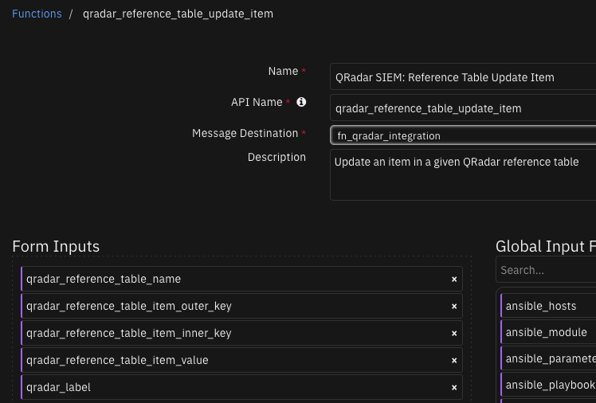

<!--
  This README.md is generated by running:
  "resilient-sdk docgen -p fn_qradar_integration"

  This file was generated with resilient-sdk v49.1.51

  It is best edited using a Text Editor with a Markdown Previewer. VS Code
  is a good example. Checkout https://guides.github.com/features/mastering-markdown/
  for tips on writing with Markdown

  All fields followed by "::CHANGE_ME::"" should be manually edited

  If you make manual edits and run docgen again, a .bak file will be created

  Store any screenshots in the "doc/screenshots" directory and reference them like:
  

  NOTE: If your app is available in the container-format only, there is no need to mention the integration server in this readme.
-->


# QRadar Integration

## Table of Contents
- [Release Notes](#release-notes)
- [Overview](#overview)
  - [Key Features](#key-features)
- [Requirements](#requirements)
  - [SOAR platform](#soar-platform)
  - [Cloud Pak for Security](#cloud-pak-for-security)
  - [Proxy Server](#proxy-server)
  - [Python Environment](#python-environment)
- [Installation](#installation)
  - [Install](#install)
  - [App Configuration](#app-configuration)
  - [Custom Layouts](#custom-layouts)
- [Function - QRadar SIEM: Add Reference Set Item ](#function---qradar-siem-add-reference-set-item)
- [Function - QRadar SIEM: Delete Reference Set Item ](#function---qradar-siem-delete-reference-set-item)
- [Function - QRadar SIEM: Find Reference Set Item ](#function---qradar-siem-find-reference-set-item)
- [Function - QRadar SIEM: Find Reference Sets ](#function---qradar-siem-find-reference-sets)
- [Function - QRadar SIEM: Reference Table Add Item ](#function---qradar-siem-reference-table-add-item)
- [Function - QRadar SIEM: Reference Table Delete Item ](#function---qradar-siem-reference-table-delete-item)
- [Function - QRadar SIEM: Reference Table Get All Tables ](#function---qradar-siem-reference-table-get-all-tables)
- [Function - QRadar SIEM: Reference Table Get Table Data ](#function---qradar-siem-reference-table-get-table-data)
- [Function - QRadar SIEM: Reference Table Update Item ](#function---qradar-siem-reference-table-update-item)
- [Function - QRadar SIEM: QRadar Search ](#function---qradar-siem-qradar-search)
- [Data Table - QRadar SIEM Offense Events](#data-table---qradar-siem-offense-events)
- [Data Table - QRadar SIEM Reference Sets](#data-table---qradar-siem-reference-sets)
- [Data Table - QRadar SIEM Reference Table Queried Rows](#data-table---qradar-siem-reference-table-queried-rows)
- [Data Table - QRadar SIEM Reference Tables](#data-table---qradar-siem-reference-tables)
- [Custom Fields](#custom-fields)
- [Playbooks](#playbooks)
- [Troubleshooting & Support](#troubleshooting--support)

---

## Release Notes
<!--
  Specify all changes in this release. Do not remove the release 
  notes of a previous release
-->
| Version | Publication | Notes |
| ------- | ----------- | ----- |
| 2.3.0 | September. 2023 | Python3 / Playbook Conversion |
| 2.2.6 | June. 2023 | Fix bug in qradar_search function |
| 2.2.5 | July. 2022 | Bug Fix for windows clients |
| 2.2.4 | July. 2022 | Update SOAR required version |
| 2.2.3 | June. 2022 | Bug fix for using with MSSP |
| 2.2.2 | May. 2022 | Add more documentation and bug fix |
| 2.2.1 | March 2022 | Cancel QRadar queries which have timed out |
| 2.2.0 | March 2022 | Allow multiple QRadar instances |
| 2.1.1 | July 2021 | Fixed selftest failing when using cafile |
| 2.1.0 | Feb. 2021 | Additional functions for reference table mapping. |
| 2.0.9 | Feb. 2021 | Bug fixes associated with require input field validation. |
| 2.0.8 | Nov. 2020 | Fixed a bug failing search function when used with token. |
| 2.0.7 | July 2020 | Correct typos and describe optional Search activity field Update SOAR version. |
| 2.0.6 | May 2020 | Add option to return all results from Search. |
| 2.0.4 | April 2020 | Additional configuration notes. |
| 2.0 | March 2019 | Supports the 2.0 release. |
| 1.0 | July 2018 | Initial publication. |

---

## Overview
<!--
  Provide a high-level description of the function itself and its remote software or application.
  The text below is parsed from the "description" and "long_description" attributes in the setup.py file
-->
**IBM QRadar SOAR Compnents for 'fn_qradar_integration'**

  <!-- ::CHANGE_ME:: -->

fn_qradar_integration supports performing ariel search to retrieve data from QRadar. It also provide functions to find/add/delete reference set items.

### Key Features
<!--
  List the Key Features of the Integration
-->
This guide describes the QRadar Function integrations..
The QRadar app with the SOAR platform package provides the following:

* Search function to perform a QRadar Ariel query
* Search function to query an item in a QRadar reference set
* Search function to find all the reference sets that contain an item
* Add function to insert a new item in a QRadar reference set
* Delete function to remove an item from a QRadar reference set
* List all reference tables
* View all items associated with a given reference table
* Add/Update/Delete items to a QRadar reference table

With the above functions, this package includes example workflows that demonstrate how to call the functions, rules that start the example workflows, and custom data tables updated by the example workflows.


---

## Requirements
<!--
  List any Requirements 
--> 

This app supports the IBM Security QRadar SOAR Platform and the IBM Security QRadar SOAR for IBM Cloud Pak for Security.

### SOAR platform
The SOAR platform supports two app deployment mechanisms, Edge Gateway (formerly App Host) and integration server.

If deploying to a SOAR platform with an Edge Gateway, the requirements are:
* SOAR platform >= `46.0.8131`.
* The app is in a container-based format (available from the AppExchange as a `zip` file).

If deploying to a SOAR platform with an integration server, the requirements are:
* SOAR platform >= `46.0.8131`.
* The app is in the older integration format (available from the AppExchange as a `zip` file which contains a `tar.gz` file).
* Integration server is running `resilient_circuits>=42.0.0`.
* If using an API key account, make sure the account provides the following minimum permissions: 
  | Name | Permissions |
  | ---- | ----------- |
  | Org Data | Read, edit |
  | Function | Read |


The following SOAR platform guides provide additional information: 
* _Edge Gateway Deployment Guide_ or _App Host Deployment Guide_: provides installation, configuration, and troubleshooting information, including proxy server settings. 
* _Integration Server Guide_: provides installation, configuration, and troubleshooting information, including proxy server settings.
* _System Administrator Guide_: provides the procedure to install, configure and deploy apps. 

The above guides are available on the IBM Documentation website at [ibm.biz/soar-docs](https://ibm.biz/soar-docs). On this web page, select your SOAR platform version. On the follow-on page, you can find the _Edge Gateway Deployment Guide_, _App Host Deployment Guide_, or _Integration Server Guide_ by expanding **Apps** in the Table of Contents pane. The System Administrator Guide is available by expanding **System Administrator**.

### Cloud Pak for Security
If you are deploying to IBM Cloud Pak for Security, the requirements are:
* IBM Cloud Pak for Security >= `1.8`.
* Cloud Pak is configured with an Edge Gateway.
* The app is in a container-based format (available from the AppExchange as a `zip` file).

The following Cloud Pak guides provide additional information: 
* _Edge Gateway Deployment Guide_ or _App Host Deployment Guide_: provides installation, configuration, and troubleshooting information, including proxy server settings. From the Table of Contents, select Case Management and Orchestration & Automation > **Orchestration and Automation Apps**.
* _System Administrator Guide_: provides information to install, configure, and deploy apps. From the IBM Cloud Pak for Security IBM Documentation table of contents, select Case Management and Orchestration & Automation > **System administrator**.

These guides are available on the IBM Documentation website at [ibm.biz/cp4s-docs](https://ibm.biz/cp4s-docs). From this web page, select your IBM Cloud Pak for Security version. From the version-specific IBM Documentation page, select Case Management and Orchestration & Automation.

### Proxy Server
The app does support a proxy server.

### Python Environment
Python 3.6 and Python 3.9 are supported.
Additional package dependencies may exist for each of these packages:
* resilient_circuits>=42.0.0


---

## Installation

### Install
* To install or uninstall an App or Integration on the _SOAR platform_, see the documentation at [ibm.biz/soar-docs](https://ibm.biz/soar-docs).
* To install or uninstall an App on _IBM Cloud Pak for Security_, see the documentation at [ibm.biz/cp4s-docs](https://ibm.biz/cp4s-docs) and follow the instructions above to navigate to Orchestration and Automation.

### App Configuration
The following table provides the settings you need to configure the app. These settings are made in the app.config file. See the documentation discussed in the Requirements section for the procedure.

| Config | Required | Example | Description |
| ------ | :------: | ------- | ----------- |
| **host** | Yes | `localhost` | *QRadar host name or IP Address * |
| **qradarpassword** | Yes | `changeme` |  *username password for QRadar authentication* |
| **qradartoken** | Yes | `changeme` | *QRadar token to use rather than password* |
| **username** | Yes | `admin` | *Username for QRadar authentication* |
| **verify_cert** | Yes | `false|/path/to/cert` | *false or path to the certificate file* |

#### 2.3.0 Changes
In v2.3.0, the existing rules and workflows have been replaced with playbooks. This change is made to support the ongoing, newer capabilities of playbooks. Each playbook has the same functionality as the previous, corresponding rule/workflow.

If upgrading from a previous release, you'll notice that the previous release's rules/workflows remain in place. Both sets of rules and playbooks are active. For manual actions, playbooks have the same name as it's corresponding rule, but with "(PB)" added at the end.

You can continue to use the rules/workflows. But migrating to playbooks provides greater functionality along with future app enhancements and bug fixes.

#### 2.2.0 Changes
Starting in version 2.2.0, more than one QRadar instance can be configured for SOAR case data synchronization. For enterprises with only one QRadar instance, your app.config file will continue to define the QRadar instance under the `[fn_qradar_integration]` section header.

For enterprises with more than one QRadar instance, each instance will have it's own section header, such as `[fn_qradar_integration:qradar_instance_label]` where `qradar_instance_label` represents any label helpful to define you QRadar environment.

Be aware that modifications to the workflows will be needed to correctly pass this label through the `qradar_label` function input field if the QRadar server/servers in the app.config have labels.

If you have existing custom workflows, see [Creating workflows when server/servers in app.config are labeled](#creating-workflows-when-serverservers-in-appconfig-are-labeled) for more information about changing them to reference the `qradar_label` function input field.

### Custom Layouts
<!--
  Use this section to provide guidance on where the user should add any custom fields and data tables.
  You may wish to recommend a new incident tab.
  You should save a screenshot "custom_layouts.png" in the doc/screenshots directory and reference it here
-->
* Import the Data Tables and Custom Fields like the screenshot below:

  


---

## Function - QRadar SIEM: Add Reference Set Item 
Add an item to a given QRadar reference set

  

<details><summary>Inputs:</summary>
<p>

| Name | Type | Required | Example | Tooltip |
| ---- | :--: | :------: | ------- | ------- |
| `qradar_label` | `text` | No | `-` | Enter name of QRadar server to use from the app.config |
| `qradar_reference_set_item_value` | `text` | No | `-` | Value of a QRadar reference set item |
| `qradar_reference_set_name` | `text` | No | `-` | Name of a QRadar reference set |

</p>
</details>

<details><summary>Outputs:</summary>
<p>

> **NOTE:** This example might be in JSON format, but `results` is a Python Dictionary on the SOAR platform.

```python
results = {
  "content": {
    "collection_id": 11,
    "creation_time": 1440703724417,
    "element_type": "IP",
    "name": "DHCP Servers",
    "namespace": "SHARED",
    "number_of_elements": 2,
    "timeout_type": "FIRST_SEEN"
  },
  "inputs": {
    "qradar_label": "1.1.1.1",
    "qradar_reference_set_item_value": "9.9.9.9",
    "qradar_reference_set_name": "DHCP Servers"
  },
  "status_code": 200
}
```

</p>
</details>

<details><summary>Example Pre-Process Script:</summary>
<p>

```python
inputs.qradar_reference_set_item_value = artifact.value
inputs.qradar_reference_set_name  = playbook.inputs.qradar_reference_set_name
inputs.qradar_label = playbook.inputs.qradar_server
```

</p>
</details>

<details><summary>Example Post-Process Script:</summary>
<p>

```python
results = playbook.functions.results.qradar_add_reference_set_item_result
if results["status_code"] == 200:
  incident.addNote(u"IP: {} added to reference set: {} on QRadar server: {}".format(artifact.value, results.inputs["qradar_reference_set_name"], results.inputs["qradar_label"]))
else:
  incident.addNote(u"Failed to add IP: {} to reference set on QRadar server: {}. Status Code: {}, message: {}".format(artifact.value, results.inputs["qradar_label"], str(results["status_code"]), results.inputs["qradar_reference_set_name"]))
```

</p>
</details>

---
## Function - QRadar SIEM: Delete Reference Set Item 
Delete an item from a given QRadar reference set

  

<details><summary>Inputs:</summary>
<p>

| Name | Type | Required | Example | Tooltip |
| ---- | :--: | :------: | ------- | ------- |
| `qradar_label` | `text` | No | `-` | Enter name of QRadar server to use from the app.config |
| `qradar_reference_set_item_value` | `text` | No | `-` | Value of a QRadar reference set item |
| `qradar_reference_set_name` | `text` | No | `-` | Name of a QRadar reference set |

</p>
</details>

<details><summary>Outputs:</summary>
<p>

> **NOTE:** This example might be in JSON format, but `results` is a Python Dictionary on the SOAR platform.

```python
results = {
  "content": {
    "content": {
      "collection_id": 12,
      "creation_time": 1440703735265,
      "element_type": "IP",
      "name": "DNS Servers",
      "namespace": "SHARED",
      "number_of_elements": 1,
      "timeout_type": "FIRST_SEEN"
    },
    "status_code": 200
  },
  "inputs": {
    "qradar_label": "1.1.1.1",
    "qradar_reference_set_item_value": "9.9.9.9",
    "qradar_reference_set_name": "DNS Servers"
  },
  "metrics": {
    "execution_time_ms": 1306,
    "host": "local",
    "package": "fn-qradar-integration",
    "package_version": "2.3.0",
    "timestamp": "2023-09-14 21:08:54",
    "version": "1.0"
  },
  "raw": "{\"status_code\": 200, \"content\": {\"timeout_type\": \"FIRST_SEEN\", \"number_of_elements\": 1, \"creation_time\": 1440703735265, \"name\": \"DNS Servers\", \"namespace\": \"SHARED\", \"element_type\": \"IP\", \"collection_id\": 12}}",
  "reason": null,
  "success": true,
  "version": "1.0"
}
```

</p>
</details>

<details><summary>Example Pre-Process Script:</summary>
<p>

```python
inputs.qradar_reference_set_item_value = artifact.value
inputs.qradar_reference_set_name = playbook.inputs.qradar_reference_set_name
inputs.qradar_label = playbook.inputs.qradar_server
```

</p>
</details>

<details><summary>Example Post-Process Script:</summary>
<p>

```python
results = playbook.functions.results.qradar_add_reference_set_item_result

if results.get("status_code") == 200:
  incident.addNote(u"Successfully added {} to {} on QRadar Server: {}".format(artifact.value, playbook.inputs.qradar_reference_set_name, results.inputs["qradar_label"]))
else:
  incident.addNote(u"Failed to add {} to {} on QRadar server: {}. Status code: {}, message: {}".format(artifact.value, playbook.inputs.qradar_reference_set_name, results.inputs["qradar_label"], results.get("status_code"), results['message']))
  
```

</p>
</details>

---
## Function - QRadar SIEM: Find Reference Set Item 
Find an item in a given QRadar reference set

  

<details><summary>Inputs:</summary>
<p>

| Name | Type | Required | Example | Tooltip |
| ---- | :--: | :------: | ------- | ------- |
| `qradar_label` | `text` | No | `-` | Enter name of QRadar server to use from the app.config |
| `qradar_reference_set_item_value` | `text` | No | `-` | Value of a QRadar reference set item |
| `qradar_reference_set_name` | `text` | No | `-` | Name of a QRadar reference set |

</p>
</details>

<details><summary>Outputs:</summary>
<p>

> **NOTE:** This example might be in JSON format, but `results` is a Python Dictionary on the SOAR platform.

```python
results = {
  "content": {
    "collection_id": 35,
    "creation_time": 1557250160405,
    "data": [
      {
        "domain_id": null,
        "first_seen": 1694498079793,
        "last_seen": 1694498079793,
        "source": "EC: Sysmon - Detected a Possible Credential Dumping Tool",
        "value": "192.168.107.107"
      }
    ],
    "element_type": "IP",
    "name": "EC Compromised Hosts",
    "namespace": "SHARED",
    "number_of_elements": 1,
    "timeout_type": "FIRST_SEEN"
  },
  "found": "True",
  "inputs": {
    "qradar_label": "1.1.1.1",
    "qradar_reference_set_item_value": "192.168.107.107",
    "qradar_reference_set_name": "EC Compromised Hosts"
  },
  "status_code": 200
}
```

</p>
</details>

<details><summary>Example Pre-Process Script:</summary>
<p>

```python
inputs.qradar_reference_set_item_value = artifact.value
inputs.qradar_reference_set_name = playbook.inputs.qradar_reference_set_name
inputs.qradar_label = playbook.inputs.qradar_server
```

</p>
</details>

<details><summary>Example Post-Process Script:</summary>
<p>

```python
results = playbook.functions.results.qradar_find_reference_set_item_result
if results.found == "True":
  incident.addNote(u"Found IP: {} in list: {} on QRadar server: {}.".format(artifact.value, results.inputs["qradar_reference_set_name"], results.inputs["qradar_label"]))
else:
  incident.addNote("IP:{} not found in list: {} on QRadar server: {}.".format(artifact.value, results.inputs["qradar_reference_set_name"], results.inputs["qradar_label"]))
```

</p>
</details>

---
## Function - QRadar SIEM: Find Reference Sets 
Find reference sets that contain a given item value, together with information about this item in those reference sets. Information includes whether this item is added to the reference set manually or by a rule.

  

<details><summary>Inputs:</summary>
<p>

| Name | Type | Required | Example | Tooltip |
| ---- | :--: | :------: | ------- | ------- |
| `qradar_label` | `text` | No | `-` | Enter name of QRadar server to use from the app.config |
| `qradar_reference_set_item_value` | `text` | No | `-` | Value of a QRadar reference set item |

</p>
</details>

<details><summary>Outputs:</summary>
<p>

> **NOTE:** This example might be in JSON format, but `results` is a Python Dictionary on the SOAR platform.

```python
results = {
  "inputs": {
    "qradar_label": "1.1.1.1",
    "qradar_reference_set_item_value": "192.168.107.107"
  },
  "reference_items": [
    {
      "collection_id": 35,
      "creation_time": 1557250160405,
      "data": [
        {
          "domain_id": null,
          "first_seen": 1694498079793,
          "last_seen": 1694498079793,
          "source": "EC: Sysmon - Detected a Possible Credential Dumping Tool",
          "value": "192.168.107.107"
        }
      ],
      "element_type": "IP",
      "name": "EC Compromised Hosts",
      "namespace": "SHARED",
      "number_of_elements": 1,
      "timeout_type": "FIRST_SEEN"
    }
  ]
}
```

</p>
</details>

<details><summary>Example Pre-Process Script:</summary>
<p>

```python
inputs.qradar_reference_set_item_value = artifact.value
inputs.qradar_label = playbook.inputs.qradar_server
```

</p>
</details>

<details><summary>Example Post-Process Script:</summary>
<p>

```python
results = playbook.functions.results.qradar_find_reference_sets_result
from datetime import datetime
current_time = datetime.now().strftime("%Y-%m-%d %H:%M:%S") 
if results.reference_items:
  for item in results.reference_items:
    item_row = incident.addRow("qradar_reference_set")
    item_row["query_time"] = current_time
    item_row["qradar_server"] = results.inputs["qradar_label"]
    item_row["reference_set"] = item["name"]
    item_row["item_value"] = item["data"][0]["value"]
    item_row["source"] = item["data"][0]["source"]
  incident.addNote("{} Reference sets found".format(len(results.reference_items)))
else:
  incident.addNote("No reference sets contain artifact: {} on QRadar server: {}".format(artifact.value, results.inputs["qradar_label"]))
```

</p>
</details>

---
## Function - QRadar SIEM: Reference Table Add Item 
Add an item to a given QRadar reference table

  

<details><summary>Inputs:</summary>
<p>

| Name | Type | Required | Example | Tooltip |
| ---- | :--: | :------: | ------- | ------- |
| `qradar_label` | `text` | No | `-` | Enter name of QRadar server to use from the app.config |
| `qradar_reference_table_item_inner_key` | `text` | No | `-` | The inner key for a QRadar Reference Table  |
| `qradar_reference_table_item_outer_key` | `text` | No | `-` | The outer key for a QRadar Reference Table  |
| `qradar_reference_table_item_value` | `text` | No | `-` | Value of a QRadar reference table item |
| `qradar_reference_table_name` | `text` | No | `-` | Value of a QRadar reference table item |

</p>
</details>

<details><summary>Outputs:</summary>
<p>

> **NOTE:** This example might be in JSON format, but `results` is a Python Dictionary on the SOAR platform.

```python
results = {
  "content": {
    "content": {
      "collection_id": 44,
      "creation_time": 1694502585199,
      "element_type": "ALN",
      "key_label": "Outer Key Label",
      "key_name_types": {
        "Inner Key 1": "ALN"
      },
      "name": "test_ref_tabe_1",
      "namespace": "SHARED",
      "number_of_elements": 1,
      "timeout_type": "FIRST_SEEN"
    },
    "status_code": 200
  },
  "inputs": {
    "qradar_label": "1.1.1.1",
    "qradar_reference_table_item_inner_key": null,
    "qradar_reference_table_item_outer_key": null,
    "qradar_reference_table_item_value": "192.168.107.107",
    "qradar_reference_table_name": "test_ref_tabe_1"
  },
  "metrics": {
    "execution_time_ms": 1659,
    "host": "local",
    "package": "fn-qradar-integration",
    "package_version": "2.3.0",
    "timestamp": "2023-09-12 15:10:39",
    "version": "1.0"
  },
  "raw": "{\"status_code\": 200, \"content\": {\"timeout_type\": \"FIRST_SEEN\", \"number_of_elements\": 1, \"creation_time\": 1694502585199, \"name\": \"test_ref_tabe_1\", \"namespace\": \"SHARED\", \"key_name_types\": {\"Inner Key 1\": \"ALN\"}, \"element_type\": \"ALN\", \"collection_id\": 44, \"key_label\": \"Outer Key Label\"}}",
  "reason": null,
  "success": true,
  "version": "1.0"
}
```

</p>
</details>

<details><summary>Example Pre-Process Script:</summary>
<p>

```python
inputs.qradar_reference_table_item_value = artifact.value
inputs.qradar_reference_table_item_inner_key = playbook.inputs.qradar_ref_table_inner_key
inputs.qradar_reference_table_item_outer_key = playbook.inputs.qradar_ref_table_outer_key
inputs.qradar_reference_table_name = playbook.inputs.qradar_reference_table_name
inputs.qradar_label = playbook.inputs.qradar_server
```

</p>
</details>

<details><summary>Example Post-Process Script:</summary>
<p>

```python
results = playbook.functions.results.qradar_reference_table_add_item_result
note = u"""Outer key: {}
Inner key: {}
Entry: {}
Reference table: {}
QRadar Server: {}""".format(results.inputs.qradar_reference_table_item_outer_key,
                              results.inputs.qradar_reference_table_item_inner_key,
                              results.inputs.qradar_reference_table_item_value, 
                              results.inputs.qradar_reference_table_name,
                              results.inputs["qradar_label"])
if results.success:
    incident.addNote(u"Successful add\n{}".format(note))
else:
    incident.addNote(u"Failure to add item: {}\n{}".format(results['reason'], note))
```

</p>
</details>

---
## Function - QRadar SIEM: Reference Table Delete Item 
Delete an item from a given QRadar reference table

  

<details><summary>Inputs:</summary>
<p>

| Name | Type | Required | Example | Tooltip |
| ---- | :--: | :------: | ------- | ------- |
| `qradar_label` | `text` | No | `-` | Enter name of QRadar server to use from the app.config |
| `qradar_reference_table_item_inner_key` | `text` | No | `-` | The inner key for a QRadar Reference Table  |
| `qradar_reference_table_item_outer_key` | `text` | No | `-` | The outer key for a QRadar Reference Table  |
| `qradar_reference_table_item_value` | `text` | No | `-` | Value of a QRadar reference table item |
| `qradar_reference_table_name` | `text` | No | `-` | Value of a QRadar reference table item |

</p>
</details>

<details><summary>Outputs:</summary>
<p>

> **NOTE:** This example might be in JSON format, but `results` is a Python Dictionary on the SOAR platform.

```python
results = {
  "content": {
    "content": {
      "collection_id": 28,
      "creation_time": 1607452116847,
      "element_type": "ALN",
      "name": "pulse_imports",
      "namespace": "SHARED",
      "number_of_elements": 5,
      "timeout_type": "UNKNOWN"
    },
    "status_code": 200
  },
  "inputs": {
    "qradar_label": "1.1.1.1",
    "qradar_reference_table_item_inner_key": "part-3",
    "qradar_reference_table_item_outer_key": "pulse-a142f062-f41b-4c2c-96b8-4ab4e3b7bde4",
    "qradar_reference_table_item_value": "test123",
    "qradar_reference_table_name": "pulse_imports"
  },
  "metrics": {
    "execution_time_ms": 1420,
    "host": "local",
    "package": "fn-qradar-integration",
    "package_version": "2.3.0",
    "timestamp": "2023-09-15 16:58:55",
    "version": "1.0"
  },
  "raw": "{\"status_code\": 200, \"content\": {\"timeout_type\": \"UNKNOWN\", \"number_of_elements\": 5, \"creation_time\": 1607452116847, \"name\": \"pulse_imports\", \"namespace\": \"SHARED\", \"element_type\": \"ALN\", \"collection_id\": 28}}",
  "reason": null,
  "success": true,
  "version": "1.0"
}
```

</p>
</details>

<details><summary>Example Pre-Process Script:</summary>
<p>

```python
inputs.qradar_reference_table_name = row.table
inputs.qradar_reference_table_item_outer_key = row.outer_key
inputs.qradar_reference_table_item_inner_key = row.inner_key
inputs.qradar_reference_table_item_value = row.value
inputs.qradar_label = row["qradar_server"]
```

</p>
</details>

<details><summary>Example Post-Process Script:</summary>
<p>

```python
results = playbook.functions.results.qradar_reference_table_delete_item_result
note = u"""Outer key: {}
Inner key: {}
Entry: {}
Reference table: {}
QRadar Server: {}""".format(results.inputs.qradar_reference_table_item_outer_key,
                              results.inputs.qradar_reference_table_item_inner_key,
                              results.inputs.qradar_reference_table_item_value, 
                              results.inputs.qradar_reference_table_name,
                              row["qradar_server"])
if results.success:
    incident.addNote(u"Successful delete\n{}".format(note))
    row['status'] = "deleted"
else:
    incident.addNote(u"Failure to delete item: {}\n{}".format(results.reason, note))
```

</p>
</details>

---
## Function - QRadar SIEM: Reference Table Get All Tables
Get all reference tables from a QRadar instance

  
<details><summary>Inputs:</summary>
<p>

| Name | Type | Required | Example | Tooltip |
| ---- | :--: | :------: | ------- | ------- |
| `qradar_label` | `text` | No | `-` | Enter name of QRadar server to use from the app.config |

</p>
</details>

<details><summary>Outputs:</summary>
<p>

> **NOTE:** This example might be in JSON format, but `results` is a Python Dictionary on the SOAR platform.

```python
results = {
  "content": [
    {
      "collection_id": 43,
      "creation_time": 1693550078786,
      "element_type": "ALN",
      "key_label": "offense_id",
      "name": "Generated_Cases",
      "namespace": "SHARED",
      "number_of_elements": 0,
      "time_to_live": "0 years 1 mons 0 days 0 hours 0 mins 0.0 secs",
      "timeout_type": "LAST_SEEN"
    },
    {
      "collection_id": 28,
      "creation_time": 1607452116847,
      "element_type": "ALN",
      "name": "pulse_imports",
      "namespace": "SHARED",
      "number_of_elements": 5,
      "timeout_type": "UNKNOWN"
    },
    {
      "collection_id": 44,
      "creation_time": 1694502585199,
      "element_type": "ALN",
      "key_label": "Outer Key Label",
      "key_name_types": {
        "Inner Key 1": "ALN"
      },
      "name": "test_ref_tabe_1",
      "namespace": "SHARED",
      "number_of_elements": 1,
      "timeout_type": "FIRST_SEEN"
    }
  ],
  "inputs": {
    "qradar_label": "1.1.1.1"
  },
  "metrics": {
    "execution_time_ms": 1442,
    "host": "local",
    "package": "fn-qradar-integration",
    "package_version": "2.3.0",
    "timestamp": "2023-09-15 18:47:24",
    "version": "1.0"
  },
  "raw": "[{\"time_to_live\": \"0 years 1 mons 0 days 0 hours 0 mins 0.0 secs\", \"timeout_type\": \"LAST_SEEN\", \"number_of_elements\": 0, \"creation_time\": 1693550078786, \"name\": \"Generated_Cases\", \"namespace\": \"SHARED\", \"element_type\": \"ALN\", \"collection_id\": 43, \"key_label\": \"offense_id\"}, {\"timeout_type\": \"UNKNOWN\", \"number_of_elements\": 5, \"creation_time\": 1607452116847, \"name\": \"pulse_imports\", \"namespace\": \"SHARED\", \"element_type\": \"ALN\", \"collection_id\": 28}, {\"timeout_type\": \"FIRST_SEEN\", \"number_of_elements\": 1, \"creation_time\": 1694502585199, \"name\": \"test_ref_tabe_1\", \"namespace\": \"SHARED\", \"key_name_types\": {\"Inner Key 1\": \"ALN\"}, \"element_type\": \"ALN\", \"collection_id\": 44, \"key_label\": \"Outer Key Label\"}]",
  "reason": null,
  "success": true,
  "version": "1.0"
}
```

</p>
</details>

<details><summary>Example Pre-Process Script:</summary>
<p>

```python
inputs.qradar_label = playbook.inputs.qradar_server
```

</p>
</details>

<details><summary>Example Post-Process Script:</summary>
<p>

```python
results = playbook.functions.results.qradar_reference_table_get_all_tables_result
from datetime import datetime
current_time = datetime.now().strftime("%Y-%m-%d %H:%M:%S") 
if results.success:
  if results.content:
    for item in results.content:
      item_row = incident.addRow("qradar_reference_table")
      item_row["query_time"] = current_time
      item_row["qradar_server"] = results.inputs["qradar_label"]
      item_row["reference_table"] = item["name"]
      item_row["collection_id"] = item["collection_id"]
      item_row["number_of_elements"] = item["number_of_elements"]
      item_row["namespace"] = item["namespace"]
    incident.addNote("{} Reference tables have successfully been queried".format(len(results.content)))
  else:
    incident.addNote("No reference tables found")
else:
  incident.addNote("An error occurred getting the reference tables: {} from QRadar server: {}".format(results.reason, rule.properties.qradar_label))
```

</p>
</details>

---
## Function - QRadar SIEM: Reference Table Get Table Data 
Get the elements in the reference table

 

<details><summary>Inputs:</summary>
<p>

| Name | Type | Required | Example | Tooltip |
| ---- | :--: | :------: | ------- | ------- |
| `qradar_label` | `text` | No | `-` | Enter name of QRadar server to use from the app.config |
| `qradar_reference_table_name` | `text` | No | `-` | Value of a QRadar reference table item |

</p>
</details>

<details><summary>Outputs:</summary>
<p>

> **NOTE:** This example might be in JSON format, but `results` is a Python Dictionary on the SOAR platform.

```python
results = {
  "content": {
    "collection_id": 44,
    "creation_time": 1694502585199,
    "data": {
      "None": {
        "None": {
          "domain_id": null,
          "first_seen": 1694502641647,
          "last_seen": 1694502641647,
          "source": "reference data api",
          "value": "192.168.107.107"
        }
      }
    },
    "element_type": "ALN",
    "key_label": "Outer Key Label",
    "key_name_types": {
      "Inner Key 1": "ALN"
    },
    "name": "test_ref_tabe_1",
    "namespace": "SHARED",
    "number_of_elements": 1,
    "timeout_type": "FIRST_SEEN"
  },
  "inputs": {
    "qradar_label": "1.1.1.1",
    "qradar_reference_table_name": "test_ref_tabe_1"
  },
  "metrics": {
    "execution_time_ms": 1392,
    "host": "local",
    "package": "fn-qradar-integration",
    "package_version": "2.3.0",
    "timestamp": "2023-09-15 19:00:19",
    "version": "1.0"
  },
  "raw": "{\"timeout_type\": \"FIRST_SEEN\", \"number_of_elements\": 1, \"data\": {\"None\": {\"None\": {\"last_seen\": 1694502641647, \"first_seen\": 1694502641647, \"source\": \"reference data api\", \"value\": \"192.168.107.107\", \"domain_id\": null}}}, \"creation_time\": 1694502585199, \"name\": \"test_ref_tabe_1\", \"namespace\": \"SHARED\", \"key_name_types\": {\"Inner Key 1\": \"ALN\"}, \"element_type\": \"ALN\", \"collection_id\": 44, \"key_label\": \"Outer Key Label\"}",
  "reason": null,
  "success": true,
  "version": "1.0"
}
```

</p>
</details>

<details><summary>Example Pre-Process Script:</summary>
<p>

```python
inputs.qradar_reference_table_name = row['reference_table']
inputs.qradar_label = row["qradar_server"]
```

</p>
</details>

<details><summary>Example Post-Process Script:</summary>
<p>

```python
results = playbook.functions.results.qradar_refrence_table_get_table_data_result
from datetime import datetime
current_time = datetime.now().strftime("%Y-%m-%d %H:%M:%S") 
if results.success:
  for outer_key, item in results.content.get('data',[]).items():
    for inner_key, inner_item in item.items():
      table_row = incident.addRow('qradar_reference_table_queried_rows')
      table_row['query_time'] = current_time
      table_row['qradar_server'] = row["qradar_server"]
      table_row['table'] = results.inputs.qradar_reference_table_name
      table_row['outer_key'] = outer_key
      table_row['inner_key'] = inner_key
      
      table_row['value'] = inner_item['value']
      table_row['status'] = 'active'
  num_data_gathered = len(results.content.get('data',[]).items()) * len(item.items())
  incident.addNote("{} Reference table data have been gathered".format(num_data_gathered))
else:
  incident.addNote("An error occurred getting the reference table data: {}".format(results.reason))
```

</p>
</details>

---
## Function - QRadar SIEM: Reference Table Update Item
Update an item in a given QRadar reference table

  

<details><summary>Inputs:</summary>
<p>

| Name | Type | Required | Example | Tooltip |
| ---- | :--: | :------: | ------- | ------- |
| `qradar_label` | `text` | No | `-` | Enter name of QRadar server to use from the app.config |
| `qradar_reference_table_item_inner_key` | `text` | No | `-` | The inner key for a QRadar Reference Table  |
| `qradar_reference_table_item_outer_key` | `text` | No | `-` | The outer key for a QRadar Reference Table  |
| `qradar_reference_table_item_value` | `text` | No | `-` | Value of a QRadar reference table item |
| `qradar_reference_table_name` | `text` | No | `-` | Value of a QRadar reference table item |

</p>
</details>

<details><summary>Outputs:</summary>
<p>

> **NOTE:** This example might be in JSON format, but `results` is a Python Dictionary on the SOAR platform.

```python
results = {
  "content": {
    "content": {
      "collection_id": 28,
      "creation_time": 1607452116847,
      "element_type": "ALN",
      "name": "pulse_imports",
      "namespace": "SHARED",
      "number_of_elements": 6,
      "timeout_type": "UNKNOWN"
    },
    "status_code": 200
  },
  "inputs": {
    "qradar_label": "1.1.1.1",
    "qradar_reference_table_item_inner_key": "part-3",
    "qradar_reference_table_item_outer_key": "pulse-a142f062-f41b-4c2c-96b8-4ab4e3b7bde4",
    "qradar_reference_table_item_value": "test123",
    "qradar_reference_table_name": "pulse_imports"
  },
  "metrics": {
    "execution_time_ms": 1365,
    "host": "local",
    "package": "fn-qradar-integration",
    "package_version": "2.3.0",
    "timestamp": "2023-09-15 16:57:43",
    "version": "1.0"
  },
  "raw": "{\"status_code\": 200, \"content\": {\"timeout_type\": \"UNKNOWN\", \"number_of_elements\": 6, \"creation_time\": 1607452116847, \"name\": \"pulse_imports\", \"namespace\": \"SHARED\", \"element_type\": \"ALN\", \"collection_id\": 28}}",
  "reason": null,
  "success": true,
  "version": "1.0"
}
```

</p>
</details>

<details><summary>Example Pre-Process Script:</summary>
<p>

```python
inputs.qradar_label = row["qradar_server"]
inputs.qradar_reference_table_name = row.table
inputs.qradar_reference_table_item_outer_key = row.outer_key
inputs.qradar_reference_table_item_inner_key = row.inner_key

if playbook.inputs.qradar_ref_table_update:
  inputs.qradar_reference_table_item_value = playbook.inputs.qradar_ref_table_update
else:
  inputs.qradar_reference_table_item_value = "This is an example"
```

</p>
</details>

<details><summary>Example Post-Process Script:</summary>
<p>

```python
results = playbook.functions.results.qradar_ference_table_update_result
note = u"""Outer key: {}
Inner key: {}
Entry: {}
Reference table: {}
QRadar Server: {}""".format(results.inputs.qradar_reference_table_item_outer_key,
                              results.inputs.qradar_reference_table_item_inner_key,
                              results.inputs.qradar_reference_table_item_value, 
                              results.inputs.qradar_reference_table_name,
                              row["qradar_server"])
if results.success:
    incident.addNote(u"Successful updated\n{}".format(note))
    row['status'] = 'updated'
    row['value'] = results.inputs.qradar_reference_table_item_value
else:
    incident.addNote(u"Failure to updated item: {}\n{}".format(results['reason'], note))
```

</p>
</details>

---
## Function - QRadar SIEM: QRadar Search
Search QRadar for events

 

<details><summary>Inputs:</summary>
<p>

| Name | Type | Required | Example | Tooltip |
| ---- | :--: | :------: | ------- | ------- |
| `qradar_label` | `text` | No | `-` | Enter name of QRadar server to use from the app.config |
| `qradar_query` | `textarea` | No | `-` | A qradar query string with parameters |
| `qradar_query_all_results` | `select` | No | `-` | Display all results from search. By default, a range for the number of returned results is set. |
| `qradar_query_range_end` | `number` | No | `-` | - |
| `qradar_query_range_start` | `number` | No | `-` | - |
| `qradar_search_param1` | `text` | No | `-` | - |
| `qradar_search_param2` | `text` | No | `-` | - |
| `qradar_search_param3` | `text` | No | `-` | - |
| `qradar_search_param4` | `text` | No | `-` | - |
| `qradar_search_param5` | `text` | No | `-` | - |

</p>
</details>

<details><summary>Outputs:</summary>
<p>

> **NOTE:** This example might be in JSON format, but `results` is a Python Dictionary on the SOAR platform.

```python
results = {
  "events": [
    {
      "StartTime": "2023-09-12 01:53",
      "categoryname_category": "Information",
      "logsourcename_logsourceid": "Experience Center: Cisco IronPort @ 192.168.0.15",
      "protocolname_protocolid": "Reserved",
      "rulename_creeventlist": "[\u0027Context is Local to Local\u0027, \u0027EC: AWS Cloud - Detected An Email with An Attachment From a Spam Sender\u0027, \u0027BB:CategoryDefinition: Medium Magnitude Events\u0027, \u0027BB:CategoryDefinition: High Magnitude Events\u0027, \u0027Source Asset Weight is Low\u0027, \u0027ECBB:CategoryDefinition: Destination IP is a Third Country/Region\u0027, \u0027Destination Asset Weight is Low\u0027, \u0027BB:DeviceDefinition: Mail\u0027, \u0027BB:DeviceDefinition: Proxy\u0027, \u0027Load Basic Building Blocks\u0027]"
    },
    {
      "StartTime": "2023-09-12 01:53",
      "categoryname_category": "Suspicious Activity",
      "logsourcename_logsourceid": "Custom Rule Engine-8 :: hychuang-4",
      "protocolname_protocolid": "Reserved",
      "rulename_creeventlist": "[\u0027EC: AWS Cloud - Detected An Email with An Attachment From a Spam Sender\u0027, \u0027BB:CategoryDefinition: Suspicious Event Categories\u0027, \u0027BB:CategoryDefinition: Suspicious Events\u0027, \u0027Context is Local to Local\u0027, \u0027BB:CategoryDefinition: Medium Magnitude Events\u0027, \u0027BB:CategoryDefinition: High Magnitude Events\u0027, \u0027Source Asset Weight is Low\u0027, \u0027ECBB:CategoryDefinition: Destination IP is a Third Country/Region\u0027, \u0027Destination Asset Weight is Low\u0027, \u0027Load Basic Building Blocks\u0027]"
    }
   
   
  ],
  "inputs": {
    "qradar_label": "1.1.1.1",
    "qradar_query": "SELECT %param1% FROM events WHERE INOFFENSE(%param2%) LAST %param3% Days",
    "qradar_query_all_results": true,
    "qradar_search_param1": "DATEFORMAT(starttime, \u0027YYYY-MM-dd HH:mm\u0027) as StartTime, CATEGORYNAME(category), LOGSOURCENAME(logsourceid), PROTOCOLNAME(protocolid), RULENAME(creeventlist)",
    "qradar_search_param2": "7",
    "qradar_search_param3": "7",
    "qradar_search_param4": "",
    "qradar_search_param5": ""
  }
}
```

</p>
</details>

<details><summary>Example Pre-Process Script:</summary>
<p>

```python
inputs.qradar_label = playbook.inputs.qradar_server


if playbook.inputs.qradar_query_all_results:
  inputs.qradar_query_all_results = playbook.inputs.qradar_query_all_results

  
inputs.qradar_query = "SELECT %param1% FROM events WHERE INOFFENSE(%param2%) LAST %param3% Days"
inputs.qradar_search_param1  = "DATEFORMAT(starttime, 'YYYY-MM-dd HH:mm') as StartTime, CATEGORYNAME(category), LOGSOURCENAME(logsourceid), PROTOCOLNAME(protocolid), RULENAME(creeventlist)"
inputs.qradar_search_param2 = incident.properties.qradar_id
if playbook.inputs.days_to_search_back: 
  inputs.qradar_search_param3 = playbook.inputs.days_to_search_back
else:
  inputs.qradar_search_param3 = '7'
inputs.qradar_query_range_start = '1'
inputs.qradar_query_range_end = '5'

```

</p>
</details>

<details><summary>Example Post-Process Script:</summary>
<p>

```python
results = playbook.functions.results.qradar_search_result
from datetime import datetime
current_time = datetime.now().strftime("%Y-%m-%d %H:%M:%S")

for event in results["events"]:
  qradar_event = incident.addRow("qradar_offense_event")
  qradar_event.query_time = current_time
  qradar_event.qradar_server = results.inputs.get("qradar_label")
  qradar_event.start_time = event["StartTime"]
  qradar_event.category = event["categoryname_category"]
  qradar_event.log_source = event["logsourcename_logsourceid"]
  qradar_event.protocol = event["protocolname_protocolid"]
  qradar_event.rule = event["rulename_creeventlist"]
incident.addNote("{} offenses have successfully been queried".format(len(results["events"])))


```

</p>
</details>

---


## Data Table - QRadar SIEM Offense Events

  

#### API Name:
qradar_offense_event

#### Columns:
| Column Name | API Access Name | Type | Tooltip |
| ----------- | --------------- | ---- | ------- |
| Category | `category` | `text` | - |
| Log Source | `log_source` | `text` | logsourceid |
| Protocol | `protocol` | `text` | protocolid |
| QRadar Server | `qradar_server` | `text` | Label from app.config of the QRadar server used |
| Rule | `rule` | `text` | creeventlist |
| Start Time | `start_time` | `text` | starttime |

---
## Data Table - QRadar SIEM Reference Sets

  

#### API Name:
qradar_reference_set

#### Columns:
| Column Name | API Access Name | Type | Tooltip |
| ----------- | --------------- | ---- | ------- |
| Item Value | `item_value` | `text` | Item value |
| QRadar Server | `qradar_server` | `text` | Label from app.config of the QRadar server used |
| Reference Set | `reference_set` | `text` | Name of reference set |
| Source | `source` | `text` | how this value is added to the reference set |

---
## Data Table - QRadar SIEM Reference Table Queried Rows

  


#### API Name:
qradar_reference_table_queried_rows

#### Columns:
| Column Name | API Access Name | Type | Tooltip |
| ----------- | --------------- | ---- | ------- |
| Inner Key | `inner_key` | `text` | - |
| Outer Key | `outer_key` | `text` | - |
| QRadar Server | `qradar_server` | `text` | Label from app.config of the QRadar server used |
| Status | `status` | `text` | - |
| Table | `table` | `text` | - |
| Value | `value` | `text` | - |

---
## Data Table - QRadar SIEM Reference Tables

  

#### API Name:
qradar_reference_table

#### Columns:
| Column Name | API Access Name | Type | Tooltip |
| ----------- | --------------- | ---- | ------- |
| Collection Id | `collection_id` | `text` | - |
| Namespace | `namespace` | `text` | - |
| Number Of Elements | `number_of_elements` | `text` | - |
| QRadar Server | `qradar_server` | `text` | Label from app.config of the QRadar server used |
| Reference Table | `reference_table` | `text` | - |

---

## Custom Fields
| Label | API Access Name | Type | Prefix | Placeholder | Tooltip |
| ----- | --------------- | ---- | ------ | ----------- | ------- |
| qradar_destination | `qradar_destination` | `text` | `properties` | - | QRadar Destination to Sync With |
| qradar_id | `qradar_id` | `text` | `properties` | - | ID number of the QRadar offense |

---


## Playbooks
| Playbook Name | Description | Object | Status |
| ------------- | ----------- | ------ | ------ |
| QRadar SIEM: Get All Reference Sets -Example (PB) | Find all the QRadar reference sets that contain the given artifact | artifact | `enabled` |
| QRadar SIEM: Find in Reference Set - Example (PB) | Look for an item in QRadar reference set and add a note to the Incident | artifact | `enabled` |
| QRadar SIEM: Add Item to this Reference Table - Example (PB) | Add a reference table item based on an existing named reference table | qradar_reference_table | `enabled` |
| QRadar SIEM: Delete this Reference Table Item - Example (PB) | An example workflow that takes in a Reference Table name, an inner key, an outer key and a value to delete for the table | qradar_reference_table_queried_rows | `enabled` |
| QRadar SIEM: Gather Reference Table Data - Example (PB)) | Make a query on a reference table and return its results into another datatable | qradar_reference_table | `enabled` |
| QRadar SIEM: Add to Reference Set -Example (PB) | Add an IP address artifact to QRadar reference set | artifact | `enabled` |
| QRadar SIEM: Add to Reference Table -Example (PB) | Add a reference table item based on an artifact value | artifact | `enabled` |
| QRadar SIEM: Get all Reference Tables - Example (PB)   | An example workflow that returns a list of all Reference Tables on the QRadar instance. | incident | `enabled` |
| QRadar SIEM: Move from Sample Blocked to Sample Suspected - Example (PB)) | Remove an item from QRadar reference set and add it to reference set. Add a note to the Incident after completing each step. | artifact | `enabled` |
| QRadar SIEM: Update this Reference Table Item - Example (PB) | Update an existing reference table item. If it does not exist, it will be added | qradar_reference_table_queried_rows | `enabled` |
| QRadar SIEM: Search QRadar for offense id -Example (PB) | Use the qradar_id field of the incident to search qradar events, and update the data table, qradar_offense_event, with the first 5 results. | incident | `enabled` |

---

## How to configure to use a single QRadar Server
To use only a single server there are two ways this can be configured
1. Use the configuration used in QRadar Integration versions prior to V2.2.0

2. Either keep the label, SOAR_Plugin_Destination_Name1, or change it (The label does not matter when only one server is configured)


## Creating Playbooks when server/servers in app.config are labeled
The function input field `qradar_label` is required when QRadar server/servers in the app.config are labeled. In the example playbook pre-process scripts the
input field `qradar_label` is defined the following way,
```python
inputs.qradar_label = incident.properties.qradar_destination
```

## Troubleshooting & Support
Refer to the documentation listed in the Requirements section for troubleshooting information.

### For Support
This is a IBM Community provided App. Please search the Community [ibm.biz/soarcommunity](https://ibm.biz/soarcommunity) for assistance.
