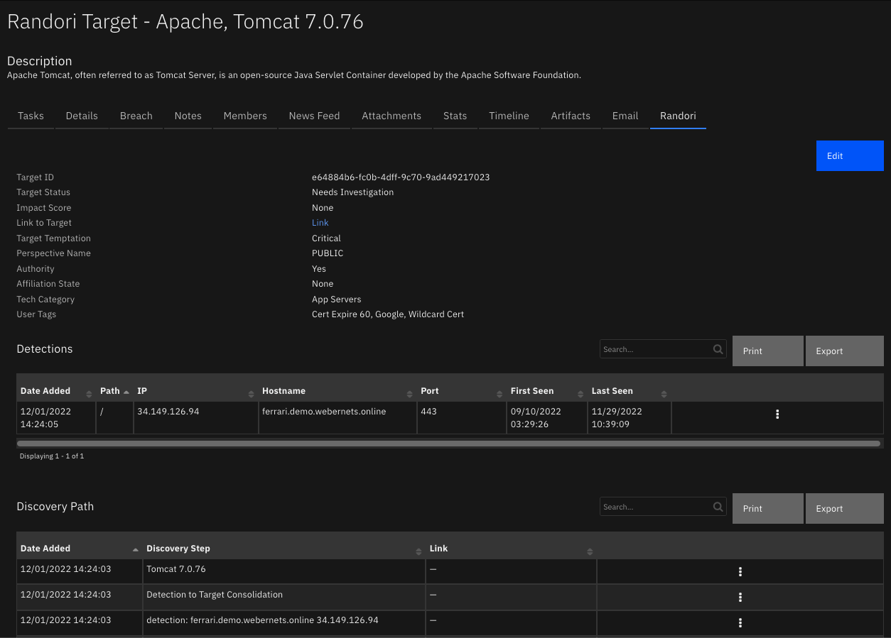
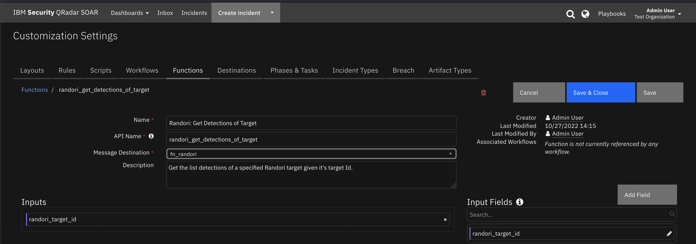
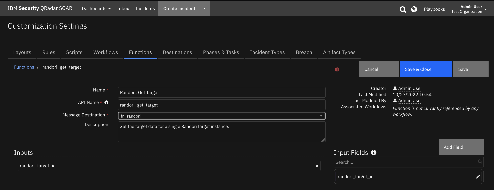

<!--
  This README.md is generated by running:
  "resilient-sdk docgen -p fn_randori"

  It is best edited using a Text Editor with a Markdown Previewer. VS Code
  is a good example. Checkout https://guides.github.com/features/mastering-markdown/
  for tips on writing with Markdown

  All fields followed by "::CHANGE_ME::"" should be manually edited

  If you make manual edits and run docgen again, a .bak file will be created

  Store any screenshots in the "doc/screenshots" directory and reference them like:
  

  NOTE: If your app is available in the container-format only, there is no need to mention the integration server in this readme.
-->

# Randori

## Table of Contents
- [Release Notes](#release-notes)
- [Overview](#overview)
  - [Key Features](#key-features)
- [Requirements](#requirements)
  - [SOAR platform](#soar-platform)
  - [Cloud Pak for Security](#cloud-pak-for-security)
  - [Proxy Server](#proxy-server)
  - [Python Environment](#python-environment)
- [Installation](#installation)
  - [Install](#install)
  - [App Configuration](#app-configuration)
- [Custom Fields](#custom-fields)
- [Troubleshooting & Support](#troubleshooting--support)
---

## Release Notes
<!--
  Specify all changes in this release. Do not remove the release 
  notes of a previous release
-->
| Version | Date | Notes |
| ------- | ---- | ----- |
| 1.0.0 | 10/2022 | Initial Release | 

---

## Overview
<!--
  Provide a high-level description of the function itself and its remote software or application.
  The text below is parsed from the "description" and "long_description" attributes in the setup.py file
-->
**IBM SOAR app bidirectional synchronization and functions for Randori**

  <!-- ::CHANGE_ME:: -->

Bidirectional synchronization of Randori Targets to IBM SOAR.

### Key Features
<!--
  List the Key Features of the Integration
-->
* Key Feature 1 <!-- ::CHANGE_ME:: -->
* Key Feature 2 <!-- ::CHANGE_ME:: -->
* Key Feature 3 <!-- ::CHANGE_ME:: -->

---

## Requirements
<!--
  List any Requirements 
--> 
<!-- ::CHANGE_ME:: -->
This app supports the IBM Security QRadar SOAR Platform and the IBM Security QRadar SOAR for IBM Cloud Pak for Security.

### SOAR platform
The SOAR platform supports two app deployment mechanisms, App Host and integration server.

If deploying to a SOAR platform with an App Host, the requirements are:
* SOAR platform >= `45.0.7899`.
* The app is in a container-based format (available from the AppExchange as a `zip` file).

If deploying to a SOAR platform with an integration server, the requirements are:
* SOAR platform >= `45.0.7899`.
* The app is in the older integration format (available from the AppExchange as a `zip` file which contains a `tar.gz` file).
* Integration server is running `resilient-circuits>=47.0.0`.
* If using an API key account, make sure the account provides the following minimum permissions: 
  | Name | Permissions |
  | ---- | ----------- |
  | Org Data | Read |
  | Function | Read |
  | Incidents | Create, Read, Edit, Edit Status |

The following SOAR platform guides provide additional information: 
* _App Host Deployment Guide_: provides installation, configuration, and troubleshooting information, including proxy server settings. 
* _Integration Server Guide_: provides installation, configuration, and troubleshooting information, including proxy server settings.
* _System Administrator Guide_: provides the procedure to install, configure and deploy apps. 

The above guides are available on the IBM Documentation website at [ibm.biz/soar-docs](https://ibm.biz/soar-docs). On this web page, select your SOAR platform version. On the follow-on page, you can find the _App Host Deployment Guide_ or _Integration Server Guide_ by expanding **Apps** in the Table of Contents pane. The System Administrator Guide is available by expanding **System Administrator**.

### Cloud Pak for Security
If you are deploying to IBM Cloud Pak for Security, the requirements are:
* IBM Cloud Pak for Security >= 1.4.
* Cloud Pak is configured with an App Host.
* The app is in a container-based format (available from the AppExchange as a `zip` file).

The following Cloud Pak guides provide additional information: 
* _App Host Deployment Guide_: provides installation, configuration, and troubleshooting information, including proxy server settings. From the Table of Contents, select Case Management and Orchestration & Automation > **Orchestration and Automation Apps**.
* _System Administrator Guide_: provides information to install, configure, and deploy apps. From the IBM Cloud Pak for Security IBM Documentation table of contents, select Case Management and Orchestration & Automation > **System administrator**.

These guides are available on the IBM Documentation website at [ibm.biz/cp4s-docs](https://ibm.biz/cp4s-docs). From this web page, select your IBM Cloud Pak for Security version. From the version-specific IBM Documentation page, select Case Management and Orchestration & Automation.

### Proxy Server
The app **does** support a proxy server.

### Python Environment
Both Python 2.7 and Python 3.6 are supported.
Additional package dependencies may exist for each of these packages:
* resilient-circuits>=47.0.0

### Randori Development Version

This app has been implemented using:
| Product Name | Product Version | API URL | API Version |
| ------------ | --------------- | ------- | ----------- |
| Randori| <!-- ::CHANGE_ME:: --> | https://app.randori.io | v1 |

#### Prerequisites
<!--
List any prerequisites that are needed to use with this endpoint solution. Remove any section that is unnecessary.
-->
* Prereq A <!-- ::CHANGE_ME:: -->
* Prereq B <!-- ::CHANGE_ME:: -->
* Prereq C <!-- ::CHANGE_ME:: -->

#### Configuration
<!--
List any steps that are needed to configure the endpoint to use this app.
-->
* Config A <!-- ::CHANGE_ME:: -->
* Config B <!-- ::CHANGE_ME:: -->
* Config C <!-- ::CHANGE_ME:: -->

#### Permissions
<!--
List any user permissions that are needed to use this endpoint. For example, list the API key permissions.
-->
* Permission A <!-- ::CHANGE_ME:: -->
* Permission B <!-- ::CHANGE_ME:: -->
* Permission C <!-- ::CHANGE_ME:: -->


---

## Installation

### Install
* To install or uninstall an App or Integration on the _SOAR platform_, see the documentation at [ibm.biz/soar-docs](https://ibm.biz/soar-docs).
* To install or uninstall an App on _IBM Cloud Pak for Security_, see the documentation at [ibm.biz/cp4s-docs](https://ibm.biz/cp4s-docs) and follow the instructions above to navigate to Orchestration and Automation.

### App Configuration
The following table provides the settings you need to configure the app. These settings are made in the app.config file. See the documentation discussed in the Requirements section for the procedure.

| Config | Required | Example | Description |
| ------ | :------: | ------- | ----------- |
| **api_token** | Yes | `xxx` | *Randori API token.* |
| **api_version** | Yes | `v1` | *Randori REST API version.* |
| **endpoint_url** | Yes | `https://app.randori.io` | *Randori endpoint URL.* |
| **polling_interval** | Yes | `60` | *Poller interval time in seconds. Value of zero to turn poller off.* |
| **polling_lookback** | Yes | `120` | *Number of minutes to look back for threat updates. Value is only used on the first time polling when the app starts.* |
| **tenant_name** | Yes | `webernets-companyname` | *Randori tenant name* |
| **verify** | Yes | `false` | `/path/to/cafile.crt` | *Path to client SSL certificate.* |
| **polling_filters** | No | ("target_temptation","greater_or_equal",40) | *Query filters: Comma separated tuples ("field","operator","value)* |
| **soar_create_case_template** | No | /path/soar_create_case_template.jinja | *Path to custom create case jinja template.* |
| **soar_close_case_template** | No | /path/soar_close_case_template.jinja | *Path to custom close case jinja template.* |
| **soar_update_case_template** | No | /path/soar_close_case_template.jinja | *Path to custom update case jinja template.* |

---
## Function - Randori: Get Detections of Target
Get the list detections of a specified Randori target given it's target Id.

 

<details><summary>Inputs:</summary>
<p>

| Name | Type | Required | Example | Tooltip |
| ---- | :--: | :------: | ------- | ------- |
| `randori_target_id` | `text` | Yes | `-` | - |

</p>
</details>

<details><summary>Outputs:</summary>
<p>

> **NOTE:** This example might be in JSON format, but `results` is a Python Dictionary on the SOAR platform.

```python
{
  "version": 2.0,
  "success": true,
  "reason": null,
  "content": {
    "detection_list": [
      {
        "affiliation_state": "None",
        "applicability": 3,
        "attack_note": "",
        "authority": true,
        "authority_distance": 0,
        "authority_override": false,
        "authorization_state": "None",
        "banners_uuid": null,
        "cert_uuid": "0caabe31-4ede-4e24-9507-f9ebc106951f",
        "characteristic_tags": [
          "DefaultPage"
        ],
        "characteristics_count": 1,
        "confidence": 75,
        "cpe": {
          "cpe_version": "2.3",
          "edition": null,
          "language": null,
          "other": null,
          "part": "a",
          "product": "tomcat",
          "str": "cpe:2.3:a:apache:tomcat:7.0.76:*:*:*:*:*:*:*",
          "sw_edition": null,
          "target_hw": null,
          "target_sw": null,
          "update": null,
          "vendor": "apache",
          "version": "7.0.76"
        },
        "criticality": 1,
        "deleted": false,
        "description": "Apache Tomcat, often referred to as Tomcat Server, is an open-source Java Servlet Container developed by the Apache Software Foundation.",
        "detection_criteria": {
          "http": {
            "host": "ferrari.demo.webernets.online",
            "method": "GET",
            "path": "/",
            "version": 1.1
          },
          "ip": {
            "address": "34.149.126.94",
            "version": 4
          },
          "tcp": {
            "port": 443
          },
          "tls": {
            "version": 3.3
          }
        },
        "detection_relevance": 1130,
        "enumerability": 3,
        "exploitability": 5,
        "first_seen": "2022-07-07T02:05:22.741389+00:00",
        "headers_uuid": "047cf2ed-c1ff-4bbf-9501-8e0b6b736093",
        "hostname": "ferrari.demo.webernets.online",
        "hostname_id": "82ca6db1-344b-4d12-a7db-5e229e3630d1",
        "id": "f814e5ef-76d9-41c1-b6e8-52b5c0daeb16,5dbcb688-8591-4574-ad18-6cbc27a1941c",
        "impact_score": "None",
        "ip": "34.149.126.94",
        "ip_id": "5b3beaa8-d24c-4861-97de-27dc3b5f9bf2",
        "ip_str": "34.149.126.94",
        "last_seen": "2022-10-25T05:31:43.150093+00:00",
        "lens_id": "08a90512-fb94-4766-9cc7-7a945e934638",
        "lens_view": "public",
        "name": "Tomcat",
        "org_id": "923af5dd-50ce-4d80-a55f-707dfe08411e",
        "path": "/",
        "perspective": "00000000-0000-0000-0000-000000000000",
        "perspective_name": "PUBLIC",
        "poc_email": null,
        "poc_id": null,
        "port": 443,
        "post_exploit": 3,
        "priority_impact_factor": 0.0,
        "priority_score": 81.0,
        "priority_status_factor": 0.1125,
        "priority_tags_factor": 0.0675,
        "private_weakness": 0,
        "protocol": "tcp",
        "public_weakness": 5,
        "randori_notes": "This version of Apache Tomcat has multiple medium and high risk vulnerabilities associated with it including potential remote code execution risks as described in CVE-2020-9484, CVE-2020-1938, and CVE-2019-0232. Apache Tomcat may be vulnerable to the Log4j 2 Remote Code Execution vulnerabilities - CVE-2021-44228 CVE-2021-45046 CVE-2021-45105 CVE-2021-44832 - https://logging.apache.org/log4j/2.x/security.html. Proof-of-Concept exploit code is available for these CVEs. Tomcat does not include Log4J 2 by default, but can be configured to optionally use Log4J 2. Users should check their Log4J 2 configuration and apply mitigations as described in either the above article or per their vendor guidance.",
        "reference": "http://tomcat.apache.org",
        "research": 3,
        "screenshot_uuid": "5afc7cfb-9ab8-4231-a296-909eb7d918e2",
        "service_id": "15d7435d-3469-450f-8ef9-f9e12dde6f68",
        "status": "Needs Resolution",
        "target_confidence": 75,
        "target_first_seen": "2022-07-07T07:18:22.029485+00:00",
        "target_id": "5dbcb688-8591-4574-ad18-6cbc27a1941c",
        "target_last_seen": "2022-10-24T06:16:04.127801+00:00",
        "target_num_detections": 1,
        "target_temptation": 45,
        "tech_category": [
          "App Servers"
        ],
        "temptation_last_modified": "2022-03-31T18:10:37.913851+00:00",
        "thumbnail_uuid": "50adc897-252f-4388-89bb-7ef034b68320",
        "user_tags": [
          "Google",
          "Unknown - By Qualys",
          "Unknown - By Tenable",
          "Wildcard Cert"
        ],
        "vendor": "Apache",
        "version": "7.0.76"
      }
    ]
  },
  "raw": null,
  "inputs": {
    "randori_target_id": "5dbcb688-8591-4574-ad18-6cbc27a1941c"
  },
  "metrics": {
    "version": "1.0",
    "package": "fn-randori",
    "package_version": "1.0.0",
    "host": "MacBook-Pro.local",
    "execution_time_ms": 315,
    "timestamp": "2022-10-27 16:37:20"
  }
}
```

</p>
</details>

<details><summary>Example Pre-Process Script:</summary>
<p>

```python
None
```

</p>
</details>

<details><summary>Example Post-Process Script:</summary>
<p>

```python
detection_data = playbook.functions.results.detection_data

incident.addNote("detection_data = {}".format(detection_data))

if not detection_data.success:
  incident.addNote("Randori: Get Target Data: Unable to get target data from Randori")
else:
  content = detection_data.get("content", {})
  detection_list = detection_data.content.get("detection_list", [])
  for detection in detection_list:
    
    # Add artifacts
    ip = detection.get("ip")
    if ip:
      incident.addArtifact("IP Address", ip, "Artifact from Randori")
      
    port = detection.get("port")
    if port:
      incident.addArtifact("Port", str(port), "Artifact from Randori")

    hostname = detection.get("hostname")
    if hostname:
      incident.addArtifact("DNS Name", hostname, "Artifact from Randori")
      
    path = detection.get("path")
    if path:
      incident.addArtifact("File Path", path, "Artifact from Randori")

    # Add Detection data to Detections data table
    detection_row = incident.addRow("randori_detections_dt")
    detection_row['randori_dt_path'] = path
    detection_row['randori_dt_port'] = port
    detection_row['randori_dt_ip'] = ip
    detection_row['randori_dt_hostname'] = hostname
    detection_row['randori_dt_first_seen'] = detection.get("first_seen")
    detection_row['randori_dt_last_seen'] = detection.get("last_seen")
```

</p>
</details>


## Function - Randori: Get Target
Get the Randori target data.

 

<details><summary>Inputs:</summary>
<p>

| Name | Type | Required | Example | Tooltip |
| ---- | :--: | :------: | ------- | ------- |
| `randori_target_id` | `text` | Yes | `-` | - |

</p>
</details>

<details><summary>Outputs:</summary>
<p>

> **NOTE:** This example might be in JSON format, but `results` is a Python Dictionary on the SOAR platform.

```python
results = {
  "version": 2.0,
  "success": true,
  "reason": null,
  "content": {
    "data": {
      "affiliation_state": "None",
      "applicability": 3,
      "attack_note": "",
      "authority": true,
      "authority_distance": 0,
      "authority_override": false,
      "authorization_state": "None",
      "characteristic_tags": [
        "DefaultPage"
      ],
      "confidence": 75,
      "cpe": {
        "cpe_version": "2.3",
        "edition": null,
        "language": null,
        "other": null,
        "part": "a",
        "product": "tomcat",
        "str": "cpe:2.3:a:apache:tomcat:7.0.76:*:*:*:*:*:*:*",
        "sw_edition": null,
        "target_hw": null,
        "target_sw": null,
        "update": null,
        "vendor": "apache",
        "version": "7.0.76"
      },
      "criticality": 1,
      "deleted": false,
      "description": "Apache Tomcat, often referred to as Tomcat Server, is an open-source Java Servlet Container developed by the Apache Software Foundation.",
      "enumerability": 3,
      "first_seen": "2022-07-07T07:18:22.029485+00:00",
      "id": "5dbcb688-8591-4574-ad18-6cbc27a1941c",
      "impact_score": "None",
      "last_seen": "2022-10-24T06:16:04.127801+00:00",
      "lens_id": "08a90512-fb94-4766-9cc7-7a945e934638",
      "lens_view": "public",
      "name": "Tomcat",
      "org_id": "923af5dd-50ce-4d80-a55f-707dfe08411e",
      "perspective": "00000000-0000-0000-0000-000000000000",
      "perspective_name": "PUBLIC",
      "post_exploit": 3,
      "priority_impact_factor": 0.0,
      "priority_score": 81.0,
      "priority_status_factor": 0.1125,
      "priority_tags_factor": 0.0675,
      "private_weakness": 0,
      "public_weakness": 5,
      "randori_notes": "This version of Apache Tomcat has multiple medium and high risk vulnerabilities associated with it including potential remote code execution risks as described in CVE-2020-9484, CVE-2020-1938, and CVE-2019-0232. Apache Tomcat may be vulnerable to the Log4j 2 Remote Code Execution vulnerabilities - CVE-2021-44228 CVE-2021-45046 CVE-2021-45105 CVE-2021-44832 - https://logging.apache.org/log4j/2.x/security.html. Proof-of-Concept exploit code is available for these CVEs. Tomcat does not include Log4J 2 by default, but can be configured to optionally use Log4J 2. Users should check their Log4J 2 configuration and apply mitigations as described in either the above article or per their vendor guidance.",
      "reference": "http://tomcat.apache.org",
      "research": 3,
      "service_id": "15d7435d-3469-450f-8ef9-f9e12dde6f68",
      "status": "Needs Resolution",
      "target_temptation": 45,
      "tech_category": [
        "App Servers"
      ],
      "temptation_last_modified": "2022-03-31T18:10:37.913851+00:00",
      "user_tags": [
        "Google",
        "Unknown - By Qualys",
        "Unknown - By Tenable",
        "Wildcard Cert"
      ],
      "vendor": "Apache",
      "version": "7.0.76"
    }
  },
  "raw": null,
  "inputs": {
    "randori_target_id": "5dbcb688-8591-4574-ad18-6cbc27a1941c"
  },
  "metrics": {
    "version": "1.0",
    "package": "fn-randori",
    "package_version": "1.0.0",
    "host": "MacBook-Pro.local",
    "execution_time_ms": 312,
    "timestamp": "2022-10-25 16:50:45"
  }
}
```

</p>
</details>

<details><summary>Example Pre-Process Script:</summary>
<p>

```python
None
```

</p>
</details>

<details><summary>Example Post-Process Script:</summary>
<p>

```python
target_data = playbook.functions.results.target_data

if not target_data.success:
  incident.addNote("Randori: Update custom fields: Unable to get target data to update custom fields.")
else:
  content = target_data.get("content", {})
  data = target_data.content.get("data", {})
  if data:
    # Update custom fileds with Randori target data
    incident.properties.randori_target_status = data.get("status")
    incident.properties.randori_target_impact_score = data.get("impact_score")
    incident.properties.randori_target_temptation = data.get("target_temptation")
    incident.properties.randori_target_authority = data.get("authority")
    incident.properties.randori_target_affiliation_state = data.get("affiliation_state")
    incident.properties.randori_target_perspective_name = data.get("perspective_name")
    incident.properties.randori_target_tech_category = ", ".join(data.get("tech_category", []))
    incident.properties.randori_target_tags = ", ".join(data.get("user_tags", []))
    
    incident.addNote("Randori: script updated custom fields in SOAR.")
    
    # Add Randori note
    randori_notes = data.get("randori_notes")
    if randori_notes:
        incident.addNote(helper.createRichText("<b>Note from Randori:</b><br> {}".format(randori_notes)))
```

</p>
</details>

---


## Custom Fields
| Label | API Access Name | Type | Prefix | Placeholder | Tooltip |
| ----- | --------------- | ---- | ------ | ----------- | ------- |
| Randori Target Affiliation State | `randori_target_affiliation_state` | `text` | `properties` | - | - |
| Randori Target ID | `randori_target_id` | `text` | `properties` | - | - |
| Randori Target Impact Score | `randori_target_impact_score` | `text` | `properties` | - | - |
| Randori Target Link | `randori_target_link` | `textarea` | `properties` | - | - |
| Randori Target Status | `randori_target_status` | `text` | `properties` | - | - |
| Randori Target Tags | `randori_target_tags` | `text` | `properties` | - | - |
| Randori Target Tech Category | `randori_target_tech_category` | `text` | `properties` | - | - |

---


## Playbooks
| Playbook Name | Description | Object | Status |
| ------------- | ----------- | ------ | ------ |
| Randori: Get Target Data | Update the Randori Target custom fields in SOAR. | incident | `enabled` |

---

## Troubleshooting & Support
Refer to the documentation listed in the Requirements section for troubleshooting information.

### For Support
This is an IBM supported app. Please search [ibm.com/mysupport](https://ibm.com/mysupport) for assistance.
