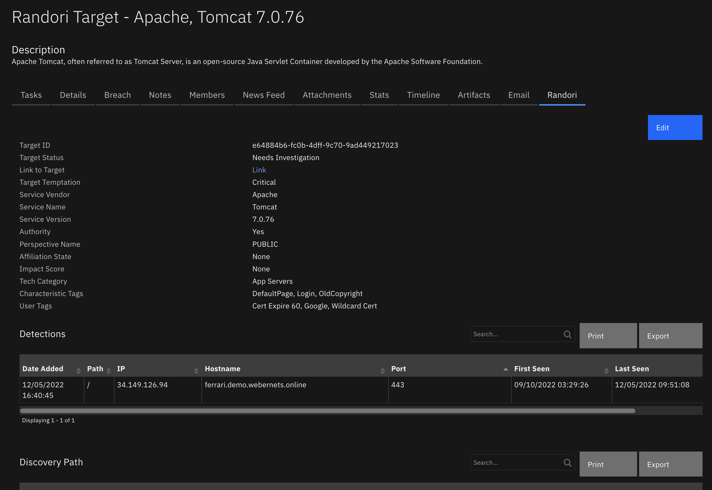

<!--
  This README.md is generated by running:
  "resilient-sdk docgen -p fn_randori"

  It is best edited using a Text Editor with a Markdown Previewer. VS Code
  is a good example. Checkout https://guides.github.com/features/mastering-markdown/
  for tips on writing with Markdown

  All fields followed by "::CHANGE_ME::"" should be manually edited

  If you make manual edits and run docgen again, a .bak file will be created

  Store any screenshots in the "doc/screenshots" directory and reference them like:
  

  NOTE: If your app is available in the container-format only, there is no need to mention the integration server in this readme.
-->

# Randori

## Table of Contents <!-- omit in toc -->
- [Randori](#randori)
  - [Release Notes](#release-notes)
  - [Overview](#overview)
    - [Key Features](#key-features)
  - [Requirements](#requirements)
    - [SOAR platform](#soar-platform)
    - [Cloud Pak for Security](#cloud-pak-for-security)
    - [Proxy Server](#proxy-server)
    - [Python Environment](#python-environment)
    - [Randori Development Version](#randori-development-version)
      - [Prerequisites](#prerequisites)
  - [Installation](#installation)
    - [Install](#install)
    - [App Configuration](#app-configuration)
    - [Custom Layouts](#custom-layouts)
  - [Poller Considerations](#poller-considerations)
    - [Target Filtering](#target-filtering)
  - [Function - Randori: Clear Data Table](#function---randori-clear-data-table)
  - [Function - Randori: Get Detections of Target](#function---randori-get-detections-of-target)
  - [Function - Randori: Get Paths](#function---randori-get-paths)
  - [Function - Randori: Get Target](#function---randori-get-target)
  - [Function - Randori: Send Note as Comment to Target](#function---randori-send-note-as-comment-to-target)
  - [Function - Randori: Update Notes from Randori Target](#function---randori-update-notes-from-randori-target)
  - [Function - Randori: Update Target Impact Score](#function---randori-update-target-impact-score)
  - [Function - Randori: Update Target Status](#function---randori-update-target-status)
  - [Data Table - Detections](#data-table---detections)
  - [Data Table - Discovery Path](#data-table---discovery-path)
      - [API Name:](#api-name)
      - [Columns:](#columns)
  - [Custom Fields](#custom-fields)
  - [Playbooks](#playbooks)
  - [Templates for SOAR Cases](#templates-for-soar-cases)
    - [soar\_create\_case.jinja](#soar_create_casejinja)
    - [soar\_close\_case.jinja](#soar_close_casejinja)
    - [soar\_update\_case.jinja](#soar_update_casejinja)
  - [Troubleshooting \& Support](#troubleshooting--support)
    - [For Support](#for-support)
---

## Release Notes
<!--
  Specify all changes in this release. Do not remove the release 
  notes of a previous release
-->
| Version | Date | Notes |
| ------- | ---- | ----- |
| 1.0.0 | 12/2022 | Initial Release | 

---

## Overview
<!--
  Provide a high-level description of the function itself and its remote software or application.
  The text below is parsed from the "description" and "long_description" attributes in the setup.py file
-->
**IBM SOAR app bidirectional synchronization and functions for Randori**

Randori Recon is an Attack Surface Management (ASM) solution which helps to identify externally-facing customer assets that could be targeted and lead to a breach.

 

Bidirectional app for Randori for IBM SOAR. Query Randori for targets based on user-defined query parameters and create and update cases in SOAR.  The app will poll Randori for Targets that meet one of the two criteria:

1. Net new Targets on the customer attack surface
2. Change in Target Temptation for existing Targets on the attack surface

 

### Key Features
<!--
  List the Key Features of the Integration
-->
* Randori SOAR cases contain Target details that require further investigation including Service information, location, discovery path and artifacts
* Randori Priority and Temptation scoring and link back to categorical Guidance to help with remediation and mitigation activities 
* Sync Randori Targets to SOAR cases via user defined filter criteria
* Sync Randori Target comments to notes in SOAR
* Set the Target Impact Score in Randori from SOAR
* Set the Target Status in Randori from SOAR
* List the Discovery Path of a Target with links back to Randori
* List the Detections of a Target in SOAR
* Add Detection data as artifacts in SOAR for the following types:
  * DNS Name
  * File Path
  * IP Address
  * Port
---

## Requirements
<!--
  List any Requirements 
--> 
This app supports the IBM Security QRadar SOAR Platform and the IBM Security QRadar SOAR for IBM Cloud Pak for Security.

### SOAR platform
The SOAR platform supports two app deployment mechanisms, App Host and integration server.

If deploying to a SOAR platform with an App Host, the requirements are:
* SOAR platform >= `45.0.7899`.
* The app is in a container-based format (available from the AppExchange as a `zip` file).

If deploying to a SOAR platform with an integration server, the requirements are:
* SOAR platform >= `45.0.7899`.
* The app is in the older integration format (available from the AppExchange as a `zip` file which contains a `tar.gz` file).
* Integration server is running `resilient-circuits>=47.0.0`.
* If using an API key account, make sure the account provides the following minimum permissions: 
  | Name | Permissions |
  | ---- | ----------- |
  | Org Data | Read |
  | Function | Read |
  | Incidents | Read, Create |
  | Edit Incidents | Fields, Status |
  | Layouts | Read, Edit |

The following SOAR platform guides provide additional information: 
* _App Host Deployment Guide_: provides installation, configuration, and troubleshooting information, including proxy server settings. 
* _Integration Server Guide_: provides installation, configuration, and troubleshooting information, including proxy server settings.
* _System Administrator Guide_: provides the procedure to install, configure and deploy apps. 

The above guides are available on the IBM Documentation website at [ibm.biz/soar-docs](https://ibm.biz/soar-docs). On this web page, select your SOAR platform version. On the follow-on page, you can find the _App Host Deployment Guide_ or _Integration Server Guide_ by expanding **Apps** in the Table of Contents pane. The System Administrator Guide is available by expanding **System Administrator**.

### Cloud Pak for Security
If you are deploying to IBM Cloud Pak for Security, the requirements are:
* IBM Cloud Pak for Security >= 1.4.
* Cloud Pak is configured with an App Host.
* The app is in a container-based format (available from the AppExchange as a `zip` file).

The following Cloud Pak guides provide additional information: 
* _App Host Deployment Guide_: provides installation, configuration, and troubleshooting information, including proxy server settings. From the Table of Contents, select Case Management and Orchestration & Automation > **Orchestration and Automation Apps**.
* _System Administrator Guide_: provides information to install, configure, and deploy apps. From the IBM Cloud Pak for Security IBM Documentation table of contents, select Case Management and Orchestration & Automation > **System administrator**.

These guides are available on the IBM Documentation website at [ibm.biz/cp4s-docs](https://ibm.biz/cp4s-docs). From this web page, select your IBM Cloud Pak for Security version. From the version-specific IBM Documentation page, select Case Management and Orchestration & Automation.

### Proxy Server
The app **does** support a proxy server.

### Python Environment
Python 3.6 and 3.9 are supported.
Additional package dependencies may exist for each of these packages:
* resilient-circuits>=47.0.0

### Randori Development Version

This app has been implemented using:
| Product Name | API URL | API Version |
| ------------ | --------------- | ------- |
| Randori | https://app.randori.io | v1 |

#### Prerequisites
<!--
List any prerequisites that are needed to use with this endpoint solution. Remove any section that is unnecessary.
-->
* Randori account 
* Randori API Token

---

## Installation

### Install
* To install or uninstall an App or Integration on the _SOAR platform_, see the documentation at [ibm.biz/soar-docs](https://ibm.biz/soar-docs).
* To install or uninstall an App on _IBM Cloud Pak for Security_, see the documentation at [ibm.biz/cp4s-docs](https://ibm.biz/cp4s-docs) and follow the instructions above to navigate to Orchestration and Automation.

### App Configuration
The following table provides the settings you need to configure the app. These settings are made in the app.config file. See the documentation discussed in the Requirements section for the procedure.

| Config | Required | Example | Description |
| ------ | :------: | ------- | ----------- |
| **api_token** | Yes | `xxx` | *Randori API token.* |
| **api_version** | Yes | `v1` | *Randori REST API version.* |
| **endpoint_url** | Yes | `https://app.randori.io` | *Randori endpoint URL.* |
| **polling_interval** | Yes | `600` | *Poller interval time in seconds. Value of zero to turn poller off.* |
| **polling_lookback** | Yes | `1200` | *Number of minutes to look back for target updates. Value is only used on the first time polling when the app starts.* |
| **organization_name** | Yes | `organization-name` | *Your organization name in Randori.* |
| **verify** | Yes | `True` | *Boolean indicating whether to verify the Randori client certificate.* |
| **polling_filters** | No | ("target_temptation","greater_or_equal",40) | *Query filters: Comma separated tuples ("field","operator","value)* |
| **soar_create_case_template** | No | /path/soar_create_case_template.jinja | *Path to custom create case jinja template.* |
| **soar_close_case_template** | No | /path/soar_close_case_template.jinja | *Path to custom close case jinja template.* |
| **soar_update_case_template** | No | /path/soar_close_case_template.jinja | *Path to custom update case jinja template.* 

### Custom Layouts
<!--
  Use this section to provide guidance on where the user should add any custom fields and data tables.
  You may wish to recommend a new incident tab.
  You should save a screenshot "custom_layouts.png" in the doc/screenshots directory and reference it here
-->
The following Randori Tab custom layout is included in the app:

   

## Poller Considerations

The poller is just one way to escalate Randori Targets to SOAR cases. It's also possible to send target information to a SIEM, such as IBM QRadar, which would then coorelate Targets into Offenses. With the QRadar Plugin for SOAR, offenses can then be escalated to SOAR cases. As long as the Randori Target ID is preserved in the custom case field `randori_target_id`, then all the remaining details about the target will synchronize to the SOAR case. In the case of the QRadar Plugin for SOAR, you would modify the escalation templates to reference this custom field with the Randori Target ID.
<p>
When using another source of Randori Target escalation to IBM SOAR, disable the poller by changing the app.config setting to `polling_interval=0`.
<p>

### Target Filtering 
To limit the number of Targets escalated to SOAR, consider using the optional `polling_filter` parameter in the app configuration file. Each filter is a tuple in the following format: ("field","operator","value"),
Where:
  * "field" is the Randori Target field to be queried
  * "operator" is a string operator performed in query 
  * "value" is the value to be compared against in the query
<p>
If more than one filter is needed, separate each tuple with a comma. Enclose string values in quotes.
<p>
Here is an polling filter example that adds or updates targets that have a "target_temptation" greater or equal to 50 AND whose status is "Needs Investigation", "Needs Resolution", "Needs Review", or "None":

    polling_filters=("target_temptation","greater_or_equal",50),("status","equal",["Needs Investigation","Needs Resolution","Needs Review","None"])

The list of Randori supported JQuery `operators`:

  * begins_with
  * between
  * contains
  * ends_with
  * equal
  * greater
  * greater_or_equal
  * greater_or_equal_utc_seconds_ago
  * greater_utc_seconds_ago
  * icontains
  * in
  * is_empty
  * is_not_empty
  * is_not_null
  * is_null
  * less
  * less_or_equal
  * less_or_equal_utc_seconds_ago
  * less_utc_seconds_ago
  * not_begins_with
  * not_contains
  * not_ends_with
  * not_equal
  * not_icontains
  * not_in
  * contained_by
  * contains
  * equal
  * has_key
  * is_empty
  * is_not_empty
  * is_not_null
  * is_null
  * not_contained_by
  * not_contains
  * not_equal
  * not_has_key

---

## Function - Randori: Clear Data Table
Clear the specified Randori data table.

 

<details><summary>Inputs:</summary>
<p>

| Name | Type | Required | Example | Tooltip |
| ---- | :--: | :------: | ------- | ------- |
| `incident_id` | `number` | Yes | `-` | - |
| `randori_data_table_name` | `text` | Yes | `-` | - |

</p>
</details>

<details><summary>Outputs:</summary>
<p>

> **NOTE:** This example might be in JSON format, but `results` is a Python Dictionary on the SOAR platform.

```python
results = {
  "content": {
    "hints": [],
    "message": null,
    "success": true,
    "title": null
  },
  "inputs": {
    "incident_id": 2640,
    "randori_data_table_name": "randori_detections_dt"
  },
  "metrics": {
    "execution_time_ms": 10072,
    "host": "MacBook-Pro.local",
    "package": "fn-randori",
    "package_version": "1.0.0",
    "timestamp": "2022-11-07 08:18:51",
    "version": "1.0"
  },
  "raw": null,
  "reason": null,
  "success": true,
  "version": 2.0
}
```

</p>
</details>

<details><summary>Example Pre-Process Script:</summary>
<p>

```python
inputs.incident_id = incident.id
inputs.randori_data_table_name = "randori_detections_dt"
```

</p>
</details>

<details><summary>Example Post-Process Script to Fill the Data Table:</summary>
<p>

```python
from datetime import datetime
import time
import calendar

def soar_datetimeformat(value, date_format="%Y-%m-%dT%H:%M:%S", split_at=None):
    """Custom jinja filter to convert UTC dates to epoch format

    Args:
        value ([str]): [jinja provided field value]
        date_format (str, optional): [conversion format]. Defaults to "%Y-%m-%dT%H:%M:%S".
        split_at (str, optional): [character to split the date field to scope the date field.]
            examples: split_at='.' to remove milliseconds for "2021-10-22T20:53:53.913Z",
                      split_at='+' tp remove tz information "2021-10-22T20:53:53+00:00",
    Returns:
        [int]: [epoch value of datetime, in milliseconds]
    """
    if not value:
        return value

    if split_at:
        utc_time = time.strptime(value[:value.rfind(split_at)], date_format)
    else:
        utc_time = time.strptime(value, date_format)
    return calendar.timegm(utc_time)*1000
############################################################################################   

detection_data = playbook.functions.results.detection_data

if not detection_data.success:
  incident.addNote("Randori: Unable to update Detections data table - error getting detections data.")
else:
  clear_table_output = playbook.functions.results.clear_table_output
  if not clear_table_output.success:
    incident.addNote("Randori: ERROR - Unable to clear the Detections data table before updating it.")
  content = detection_data.get("content", {})
  detection_list = detection_data.content.get("detection_list", [])
  for detection in detection_list:
    detection_row = incident.addRow("randori_detections_dt")
    detection_row['randori_dt_date_added'] = datetime.now()
    detection_row['randori_dt_path'] = detection.get("path")
    detection_row['randori_dt_port'] = detection.get("port")
    detection_row['randori_dt_ip'] = detection.get("ip")
    detection_row['randori_dt_hostname'] = detection.get("hostname")
    detection_row['randori_dt_first_seen'] = soar_datetimeformat(detection.get("first_seen"), split_at='.')
    detection_row['randori_dt_last_seen'] = soar_datetimeformat(detection.get("last_seen"), split_at='.')
  incident.addNote("Randori: manual playbook updated Detections data table with {} detections".format(len(detection_list)))
```

</p>
</details>

---
## Function - Randori: Get Detections of Target
Get the list detections of a specified Randori target given it's target Id.

 

<details><summary>Inputs:</summary>
<p>

| Name | Type | Required | Example | Tooltip |
| ---- | :--: | :------: | ------- | ------- |
| `randori_target_id` | `text` | Yes | `-` | - |

</p>
</details>

<details><summary>Outputs:</summary>
<p>

> **NOTE:** This example might be in JSON format, but `results` is a Python Dictionary on the SOAR platform.

```python
results = {
  "content": {
    "detection_list": [
      {
        "affiliation_state": "None",
        "applicability": 3,
        "attack_note": "",
        "authority": true,
        "authority_distance": 0,
        "authority_override": false,
        "authorization_state": "None",
        "banners_uuid": null,
        "cert_uuid": "0caabe31-4ede-4e24-9507-f9ebc106951f",
        "characteristic_tags": [
          "DefaultPage",
          "NoCSS",
          "OldCopyright"
        ],
        "characteristics_count": 3,
        "confidence": 75,
        "cpe": {
          "cpe_version": "2.3",
          "edition": null,
          "language": null,
          "other": null,
          "part": "a",
          "product": "tomcat",
          "str": "cpe:2.3:a:apache:tomcat:7.0.76:*:*:*:*:*:*:*",
          "sw_edition": null,
          "target_hw": null,
          "target_sw": null,
          "update": null,
          "vendor": "apache",
          "version": "7.0.76"
        },
        "criticality": 1,
        "deleted": false,
        "description": "Apache Tomcat, often referred to as Tomcat Server, is an open-source Java Servlet Container developed by the Apache Software Foundation.",
        "detection_criteria": {
          "http": {
            "host": "ferrari.demo.webernets.online",
            "method": "GET",
            "path": "/",
            "version": 1.1
          },
          "ip": {
            "address": "34.149.126.94",
            "version": 4
          },
          "tcp": {
            "port": 443
          },
          "tls": {
            "version": 3.3
          }
        },
        "detection_relevance": 1130,
        "enumerability": 3,
        "exploitability": 5,
        "first_seen": "2022-07-07T02:05:22.741389+00:00",
        "headers_uuid": "047cf2ed-c1ff-4bbf-9501-8e0b6b736093",
        "hostname": "ferrari.demo.webernets.online",
        "hostname_id": "82ca6db1-344b-4d12-a7db-5e229e3630d1",
        "id": "f814e5ef-76d9-41c1-b6e8-52b5c0daeb16,5dbcb688-8591-4574-ad18-6cbc27a1941c",
        "impact_score": "Medium",
        "ip": "34.149.126.94",
        "ip_id": "5b3beaa8-d24c-4861-97de-27dc3b5f9bf2",
        "ip_str": "34.149.126.94",
        "last_seen": "2022-10-31T11:22:49.122136+00:00",
        "lens_id": "08a90512-fb94-4766-9cc7-7a945e934638",
        "lens_view": "public",
        "name": "Tomcat",
        "org_id": "923af5dd-50ce-4d80-a55f-707dfe08411e",
        "path": "/",
        "perspective": "00000000-0000-0000-0000-000000000000",
        "perspective_name": "PUBLIC",
        "poc_email": null,
        "poc_id": null,
        "port": 443,
        "post_exploit": 3,
        "priority_impact_factor": 0.084375,
        "priority_score": 135.0,
        "priority_status_factor": 0.1125,
        "priority_tags_factor": 0.253125,
        "private_weakness": 0,
        "protocol": "tcp",
        "public_weakness": 5,
        "randori_notes": "This version of Apache Tomcat has multiple medium and high risk vulnerabilities associated with it including potential remote code execution risks as described in CVE-2020-9484, CVE-2020-1938, and CVE-2019-0232. Apache Tomcat may be vulnerable to the Log4j 2 Remote Code Execution vulnerabilities - CVE-2021-44228 CVE-2021-45046 CVE-2021-45105 CVE-2021-44832 - https://logging.apache.org/log4j/2.x/security.html. Proof-of-Concept exploit code is available for these CVEs. Tomcat does not include Log4J 2 by default, but can be configured to optionally use Log4J 2. Users should check their Log4J 2 configuration and apply mitigations as described in either the above article or per their vendor guidance.",
        "reference": "http://tomcat.apache.org",
        "research": 3,
        "screenshot_uuid": "5afc7cfb-9ab8-4231-a296-909eb7d918e2",
        "service_id": "15d7435d-3469-450f-8ef9-f9e12dde6f68",
        "status": "Needs Investigation",
        "target_confidence": 75,
        "target_first_seen": "2022-07-07T07:18:22.029485+00:00",
        "target_id": "5dbcb688-8591-4574-ad18-6cbc27a1941c",
        "target_last_seen": "2022-10-31T11:32:10.769721+00:00",
        "target_num_detections": 1,
        "target_temptation": 45,
        "tech_category": [
          "App Servers"
        ],
        "temptation_last_modified": "2022-03-31T18:10:37.913851+00:00",
        "thumbnail_uuid": "50adc897-252f-4388-89bb-7ef034b68320",
        "user_tags": [
          "Google",
          "Unknown - By Qualys",
          "Unknown - By Tenable",
          "Wildcard Cert"
        ],
        "vendor": "Apache",
        "version": "7.0.76"
      }
    ]
  },
  "inputs": {
    "randori_target_id": "5dbcb688-8591-4574-ad18-6cbc27a1941c"
  },
  "metrics": {
    "execution_time_ms": 167,
    "host": "MacBook-Pro.local",
    "package": "fn-randori",
    "package_version": "1.0.0",
    "timestamp": "2022-11-02 16:57:13",
    "version": "1.0"
  },
  "raw": null,
  "reason": null,
  "success": true,
  "version": 2.0
}
```

</p>
</details>

<details><summary>Example Pre-Process Script:</summary>
<p>

```python
inputs.randori_target_id = incident.properties.randori_target_id
```

</p>
</details>

<details><summary>Example Post-Process Script to Fill Detections Data Table:</summary>
<p>

```python
from datetime import datetime
import time
import calendar

def soar_datetimeformat(value, date_format="%Y-%m-%dT%H:%M:%S", split_at=None):
    """Custom jinja filter to convert UTC dates to epoch format

    Args:
        value ([str]): [jinja provided field value]
        date_format (str, optional): [conversion format]. Defaults to "%Y-%m-%dT%H:%M:%S".
        split_at (str, optional): [character to split the date field to scope the date field.]
            examples: split_at='.' to remove milliseconds for "2021-10-22T20:53:53.913Z",
                      split_at='+' tp remove tz information "2021-10-22T20:53:53+00:00",
    Returns:
        [int]: [epoch value of datetime, in milliseconds]
    """
    if not value:
        return value

    if split_at:
        utc_time = time.strptime(value[:value.rfind(split_at)], date_format)
    else:
        utc_time = time.strptime(value, date_format)
    return calendar.timegm(utc_time)*1000
############################################################################################   

detection_data = playbook.functions.results.detection_data

if not detection_data.success:
  incident.addNote("Randori: Get Target Data: Unable to get target data from Randori")
else:
  content = detection_data.get("content", {})
  detection_list = detection_data.content.get("detection_list", [])
  for detection in detection_list:
    detection_row = incident.addRow("randori_detections_dt")
    detection_row['randori_dt_date_added'] = datetime.now()
    detection_row['randori_dt_path'] = detection.get("path")
    detection_row['randori_dt_port'] = detection.get("port")
    detection_row['randori_dt_ip'] = detection.get("ip")
    detection_row['randori_dt_hostname'] = detection.get("hostname")
    detection_row['randori_dt_first_seen'] = soar_datetimeformat(detection.get("first_seen"), split_at='.')
    detection_row['randori_dt_last_seen'] = soar_datetimeformat(detection.get("last_seen"), split_at='.')
  incident.addNote("Randori: automatic playbook updated Detections data table with {} detections".format(len(detection_list)))
```

</p>
</details>

---
## Function - Randori: Get Paths
Get the paths data for a Randori target.

 

<details><summary>Inputs:</summary>
<p>

| Name | Type | Required | Example | Tooltip |
| ---- | :--: | :------: | ------- | ------- |
| `randori_target_id` | `text` | Yes | `-` | - |

</p>
</details>

<details><summary>Outputs:</summary>
<p>

> **NOTE:** This example might be in JSON format, but `results` is a Python Dictionary on the SOAR platform.

```python
results = {
  "version": 2.0,
  "success": true,
  "reason": null,
  "content": {
    "data": {
      "edges": {
        "329a6ff4-4e2a-4932-b39c-32c5d847e3c0": {
          "content": {},
          "dst": "b4a3b681-c96b-49ba-a0d5-7a576996e703",
          "id": "329a6ff4-4e2a-4932-b39c-32c5d847e3c0",
          "src": "f62ab0f7-954c-4205-a39d-5f170f6131b7",
          "type": "Passive DNS Records"
        },
        "4be17e67-cc0f-4e28-b39f-3844edb09b68": {
          "content": {},
          "dst": "afd6c37d-1280-48ac-bf2d-46ae4286c54b",
          "id": "4be17e67-cc0f-4e28-b39f-3844edb09b68",
          "src": "4be17e67-cc0f-4e28-b39f-3844edb09b68",
          "type": "Detection-Target connection"
        },
        "7d52abd6-f390-4f7b-8312-6367011b1d93": {
          "content": {},
          "dst": "a5f818c5-68c4-40ec-a574-60bfae787651",
          "id": "7d52abd6-f390-4f7b-8312-6367011b1d93",
          "src": "b4a3b681-c96b-49ba-a0d5-7a576996e703",
          "type": "DNS Record"
        },
        "be5f636f-1189-49ee-906c-2a5aff984283": {
          "content": {},
          "dst": "4be17e67-cc0f-4e28-b39f-3844edb09b68",
          "id": "be5f636f-1189-49ee-906c-2a5aff984283",
          "src": "a5f818c5-68c4-40ec-a574-60bfae787651",
          "type": "Port Scan"
        }
      },
      "nodes": {
        "4be17e67-cc0f-4e28-b39f-3844edb09b68": {
          "content": {
            "hostname": "",
            "ip_str": "52.90.36.58",
            "path": "",
            "port": 23,
            "protocol": "tcp"
          },
          "id": "4be17e67-cc0f-4e28-b39f-3844edb09b68",
          "type": "detection"
        },
        "a5f818c5-68c4-40ec-a574-60bfae787651": {
          "content": {
            "ip_str": "52.90.36.58"
          },
          "id": "a5f818c5-68c4-40ec-a574-60bfae787651",
          "type": "ip"
        },
        "afd6c37d-1280-48ac-bf2d-46ae4286c54b": {
          "content": {
            "name": "telnetd",
            "vendor": "Linux",
            "version": ""
          },
          "id": "afd6c37d-1280-48ac-bf2d-46ae4286c54b",
          "type": "target"
        },
        "b4a3b681-c96b-49ba-a0d5-7a576996e703": {
          "content": {
            "hostname": "telnet.webernets.online"
          },
          "id": "b4a3b681-c96b-49ba-a0d5-7a576996e703",
          "type": "hostname"
        },
        "f62ab0f7-954c-4205-a39d-5f170f6131b7": {
          "content": {
            "hostname": "webernets.online"
          },
          "id": "f62ab0f7-954c-4205-a39d-5f170f6131b7",
          "type": "hostname"
        }
      },
      "paths": [
        [
          "4be17e67-cc0f-4e28-b39f-3844edb09b68",
          "be5f636f-1189-49ee-906c-2a5aff984283",
          "7d52abd6-f390-4f7b-8312-6367011b1d93",
          "329a6ff4-4e2a-4932-b39c-32c5d847e3c0"
        ]
      ]
    },
    "base_url": "https://app.randori.io/myorg"
  },
  "raw": null,
  "inputs": {
    "randori_target_id": "afd6c37d-1280-48ac-bf2d-46ae4286c54b"
  },
  "metrics": {
    "version": "1.0",
    "package": "fn-randori",
    "package_version": "1.0.0",
    "host": "MacBook-Pro.local",
    "execution_time_ms": 6479,
    "timestamp": "2022-11-09 18:42:30"
  }
}
```

</p>
</details>

<details><summary>Example Pre-Process Script:</summary>
<p>

```python
inputs.randori_target_id = incident.properties.randori_target_id
```

</p>
</details>

<details><summary>Example Post-Process Script to Fill Data Table:</summary>
<p>

```python

from datetime import datetime

def add_node_to_dt(node, randori_base_url):
  
  content = node.get("content")

  row = incident.addRow("randori_discovery_path_dt")
  row["randori_dt_date_added"] = int(datetime.now().timestamp()*1000) 
  
  # For each node type formatting is different.
  if node.get("type") == "target":
    target_name = content.get("name")
    target_version = content.get("version")
    row["randori_dt_discovery_step"] = "{} {}".format(target_name, target_version)
  elif node.get("type") == "hostname":
    hostname = content.get("hostname")
    row["randori_dt_discovery_step"] = "{}".format(hostname)
    link = "{0}/hostnames/{1}".format(randori_base_url, node.get("id"))
    ref_html = u"""<a href='{0}'>View Details</a>""".format(link)
    row["randori_dt_link"] = helper.createRichText(ref_html)
  elif node.get("type") == "ip":
    ip = content.get("ip_str")
    row["randori_dt_discovery_step"] = "{}".format(ip)
    link = "{0}/ips/{1}".format(randori_base_url, node.get("id"))
    ref_html = u"""<a href='{0}'>View Details</a>""".format(link)
    row["randori_dt_link"] = helper.createRichText(ref_html)
  elif node.get("type") == "detection":
    hostname = content.get("hostname")
    ip = content.get("ip_str")
    row["randori_dt_discovery_step"] = "detection: {} {}".format(hostname, ip)

    
#########################################################################################
paths_data = playbook.functions.results.paths_data

if not paths_data.success:
  incident.addNote("Randori: Unable to get paths data to populate Discovery Path data table.")
else:

  paths_data_content = paths_data.get("content")
  randori_base_url = paths_data_content.get("base_url")
  data = paths_data_content.get('data')
  edges = data.get("edges")
  nodes = data.get("nodes")
  paths_list_list = data.get("paths")

  for path_list in paths_list_list:
    edge = None
    for path in path_list:
      edge = edges.get(path)
      dst = edge.get("dst")
      node = nodes.get(dst)
      
      # Add node to the data table
      add_node_to_dt(node, randori_base_url)
  
      # Add edge type to the data table
      row = incident.addRow("randori_discovery_path_dt")
      row["randori_dt_date_added"] = int(datetime.now().timestamp()*1000) 
      row["randori_dt_discovery_step"] = "{}".format(edge.get("type"))
      
    if edge is not None:
      # Last node is the src
      src = edge.get("src")
      node = nodes.get(src)
      add_node_to_dt(node, randori_base_url)
  
  incident.addNote("Randori: Discovery Path table refreshed.")
```

</p>
</details>

---
## Function - Randori: Get Target
Get the target data for a single Randori target instance.

 

<details><summary>Inputs:</summary>
<p>

| Name | Type | Required | Example | Tooltip |
| ---- | :--: | :------: | ------- | ------- |
| `randori_target_id` | `text` | Yes | `-` | - |

</p>
</details>

<details><summary>Outputs:</summary>
<p>

> **NOTE:** This example might be in JSON format, but `results` is a Python Dictionary on the SOAR platform.

```python
results = {
  "version": 2.0,
  "success": true,
  "reason": null,
  "content": {
    "data": {
      "affiliation_state": "None",
      "applicability": 4,
      "attack_note": "",
      "authority": true,
      "authority_distance": 0,
      "authority_override": false,
      "authorization_state": "None",
      "characteristic_tags": [],
      "confidence": 75,
      "cpe": {
        "cpe_version": "2.3",
        "edition": null,
        "language": null,
        "other": null,
        "part": "a",
        "product": "vcenter_server",
        "str": "cpe:2.3:a:vmware:vcenter_server:*:*:*:*:*:*:*:*",
        "sw_edition": null,
        "target_hw": null,
        "target_sw": null,
        "update": null,
        "vendor": "vmware",
        "version": null
      },
      "criticality": 3,
      "deleted": false,
      "description": "VMware vCenter is the management component of VMware vSphere",
      "enumerability": 1,
      "first_seen": "2022-09-10T07:49:26.858689+00:00",
      "id": "2755b843-9d38-457e-b4a3-3a8d27c47a9c",
      "impact_score": "Medium",
      "last_seen": "2022-11-29T20:13:48.701719+00:00",
      "lens_id": "6e8476e5-ead9-4ca2-914c-3bc1732ca0fb",
      "lens_view": "public",
      "name": "vCenter",
      "org_id": "e0c553a8-88f1-4991-8970-f058a82542e8",
      "perspective": "00000000-0000-0000-0000-000000000000",
      "perspective_name": "PUBLIC",
      "post_exploit": 3,
      "priority_impact_factor": 0.02625,
      "priority_score": 39.375,
      "priority_status_factor": 0.065625,
      "priority_tags_factor": 0.0,
      "private_weakness": 0,
      "public_weakness": 2,
      "randori_notes": "VMware vSphere (and associated services - vCenter) may be vulnerable to the Log4j 2 Remote Code Execution vulnerabilities - CVE-2021-44228 CVE-2021-45046 CVE-2021-45105 CVE-2021-44832 - https://logging.apache.org/log4j/2.x/security.html.  Proof-of-Concept exploit code is available for these CVEs. Users should check their Log4J 2 configuration and apply mitigations as described in either the above article or per their vendor guidance https://www.vmware.com/security/advisories/VMSA-2021-0028.html",
      "reference": "",
      "research": 3,
      "service_id": "44096166-3213-43c9-8c0e-27945a7fd8ce",
      "status": "Needs Investigation",
      "target_temptation": 21,
      "tech_category": [
        "Network Services"
      ],
      "temptation_last_modified": "2022-04-07T20:59:44.451528+00:00",
      "user_tags": [
        "Cert Expire 60",
        "Google",
        "Wildcard Cert"
      ],
      "vendor": "VMware",
      "version": ""
    },
    "entity_url": "https://app.randori.io/xxxx/targets/2755b843-9d38-457e-b4a3-3a8d27c47a9c"
  },
  "raw": null,
  "inputs": {
    "randori_target_id": "2755b843-9d38-457e-b4a3-3a8d27c47a9c"
  },
  "metrics": {
    "version": "1.0",
    "package": "fn-randori",
    "package_version": "1.0.0",
    "host": "MacBook-Pro.local",
    "execution_time_ms": 29154,
    "timestamp": "2022-12-01 10:05:54"
  }
}
```

</p>
</details>

<details><summary>Example Pre-Process Script:</summary>
<p>

```python
inputs.randori_target_id = incident.properties.randori_target_id
```

</p>
</details>

<details><summary>Example Post-Process Script to Update Custom Fields:</summary>
<p>

```python
def map_temptation(temptation_score):
  if not isinstance(temptation_score, int):
    return "In Review"

  if temptation_score <= 14:
    return "Low"
  elif temptation_score >= 15 and temptation_score <= 29:
    return "Medium"
  elif temptation_score >= 30 and temptation_score <= 39:
    return "High"
  elif temptation_score >= 40:
    return "Critical"

target_data = playbook.functions.results.target_data

if not target_data.success:
  incident.addNote("Randori: Update custom fields: Unable to get target data to update custom fields.")
else:
  content = target_data.get("content", {})
  data = target_data.content.get("data", {})
  if data:
    # Update custom fields with Randori target data
    incident.properties.randori_target_status = data.get("status")
    incident.properties.randori_target_impact_score = data.get("impact_score")
    incident.properties.randori_target_temptation = map_temptation(data.get("target_temptation"))
    incident.properties.randori_target_name = data.get("name")
    incident.properties.randori_target_vendor = data.get("vendor")
    incident.properties.randori_target_version = data.get("version")
    incident.properties.randori_target_authority = data.get("authority")
    incident.properties.randori_target_affiliation_state = data.get("affiliation_state")
    incident.properties.randori_target_perspective_name = data.get("perspective_name")
    entity_url = content.get("entity_url")
    if entity_url:
      incident.properties.randori_target_link = "<a target='_blank' href='{0}'>Link</a>".format(entity_url)

    tech_category = data.get("tech_category", [])
    if tech_category:
      incident.properties.randori_target_tech_category = ", ".join(tech_category)

    user_tags = data.get("user_tags", [])
    if user_tags:
      incident.properties.randori_target_user_tags = ", ".join(user_tags)
        
    characteristic_tags = data.get("characteristic_tags", [])
    if user_tags:
      incident.properties.randori_target_characteristic_tags = ", ".join(characteristic_tags)
    
    incident.addNote("Randori: Update Target Data in SOAR script updated custom fields in SOAR.")
    
    # Add Randori note
    randori_notes = data.get("randori_notes")
    if randori_notes:
        incident.addNote(helper.createRichText("<b>Created by Randori:</b><br> {}".format(randori_notes)))
```

</p>
</details>

---
## Function - Randori: Send Note as Comment to Target
Post a SOAR note as a comment in the corresponding Randori target.

 

<details><summary>Inputs:</summary>
<p>

| Name | Type | Required | Example | Tooltip |
| ---- | :--: | :------: | ------- | ------- |
| `randori_comment_text` | `text` | No | `-` | - |
| `randori_target_id` | `text` | Yes | `-` | - |

</p>
</details>

<details><summary>Outputs:</summary>
<p>

> **NOTE:** This example might be in JSON format, but `results` is a Python Dictionary on the SOAR platform.

```python
results = {
  "content": {
    "action": null,
    "comment": "Added note from Randori Target",
    "created_at": "2022-11-02T17:37:25.576771+00:00",
    "id": "af217af0-b6d6-4659-86b0-5fc876eac7e8",
    "is_author": true,
    "is_bulk_applied": false,
    "name": "QRadar SOAR Development",
    "rel_id": "16543836-9b71-4614-8c73-4a5b440a8c62",
    "status": "ACTIVE"
  },
  "inputs": {
    "randori_comment_text": "Added note from Randori Target",
    "randori_target_id": "5dbcb688-8591-4574-ad18-6cbc27a1941c"
  },
  "metrics": {
    "execution_time_ms": 10124,
    "host": "MacBook-Pro.local",
    "package": "fn-randori",
    "package_version": "1.0.0",
    "timestamp": "2022-11-02 13:37:29",
    "version": "1.0"
  },
  "raw": null,
  "reason": null,
  "success": true,
  "version": 2.0
}
```

</p>
</details>

<details><summary>Example Pre-Process Script:</summary>
<p>

```python
None
```

</p>
</details>

<details><summary>Example Post-Process Script:</summary>
<p>

```python
None
```

</p>
</details>

---
## Function - Randori: Update Notes from Randori Target
Query Randori target and add any new notes to the SOAR case.

 

<details><summary>Inputs:</summary>
<p>

| Name | Type | Required | Example | Tooltip |
| ---- | :--: | :------: | ------- | ------- |
| `incident_id` | `number` | Yes | `-` | - |
| `randori_target_id` | `text` | Yes | `-` | - |

</p>
</details>

<details><summary>Outputs:</summary>
<p>

> **NOTE:** This example might be in JSON format, but `results` is a Python Dictionary on the SOAR platform.

```python
results = {
  "content": {
    "count": 0
  },
  "inputs": {
    "incident_id": 2675,
    "randori_target_id": "80c039c4-625b-42fb-a8f1-3888db45d29e"
  },
  "metrics": {
    "execution_time_ms": 262,
    "host": "MacBook-Pro.local",
    "package": "fn-randori",
    "package_version": "1.0.0",
    "timestamp": "2022-11-07 11:28:54",
    "version": "1.0"
  },
  "raw": null,
  "reason": null,
  "success": true,
  "version": 2.0
}
```

</p>
</details>

<details><summary>Example Pre-Process Script:</summary>
<p>

```python
inputs.incident_id = incident.id
inputs.randori_target_id = incident.properties.randori_target_id
```

</p>
</details>

<details><summary>Example Post-Process Script:</summary>
<p>

```python
from datetime import datetime

note_data = playbook.functions.results.note_data

# Edit note in SOAR to indicate it was sent to Randori
if note_data.success:
  # Get the current time
  now = datetime.now()
  note.text = u"<b>Sent to Randori at {0}</b><br>{1}".format(now, note.text.content)
```

</p>
</details>

---
## Function - Randori: Update Target Impact Score
Update the specified target in Randori with the specified target impact score.

 

The following activation pop-up dialog box prompts the user for input for updating the target impact score in Randori and allows for input of an optional note to be post to Randori as a target comment.

 

<details><summary>Inputs:</summary>
<p>

| Name | Type | Required | Example | Tooltip |
| ---- | :--: | :------: | ------- | ------- |
| `randori_note` | `text` | No | `-` | - |
| `randori_target_id` | `text` | Yes | `-` | - |
| `randori_target_impact_score` | `text` | Yes | `-` | - |

</p>
</details>

<details><summary>Outputs:</summary>
<p>

> **NOTE:** This example might be in JSON format, but `results` is a Python Dictionary on the SOAR platform.

```python
results = {
  "content": {
    "count": 1
  },
  "inputs": {
    "randori_note": "from SOAR",
    "randori_target_id": "5dbcb688-8591-4574-ad18-6cbc27a1941c",
    "randori_target_impact_score": "Low"
  },
  "metrics": {
    "execution_time_ms": 626,
    "host": "MacBook-Pro.local",
    "package": "fn-randori",
    "package_version": "1.0.0",
    "timestamp": "2022-11-07 13:08:40",
    "version": "1.0"
  },
  "raw": null,
  "reason": null,
  "success": true,
  "version": 2.0
}
```

</p>
</details>

<details><summary>Example Pre-Process Script:</summary>
<p>

```python
inputs.randori_target_id = incident.properties.randori_target_id
inputs.randori_target_impact_score = playbook.inputs.randori_target_impact_score
inputs.randori_note = playbook.inputs.randori_note.content
```

</p>
</details>

<details><summary>Example Post-Process Script:</summary>
<p>

```python
target_impact_score = playbook.functions.results.target_impact_score

if not target_impact_score.success:
  incident.addNote("Randori: ERROR: Unable to Update Target Impact Score to <b>{}</b>".format(target_impact_score.inputs.randori_target_impact_score))
else:
  incident.properties.randori_target_impact_score = target_impact_score.inputs.randori_target_impact_score
  incident.addNote("Randori: Updated Target Impact Score to <b>{}</b> in Randori".format(incident.properties.randori_target_impact_score))
```

</p>
</details>

---
## Function - Randori: Update Target Status
Update the specified target in Randori with the specified target status and /or impact score.

 


The following activation pop-up dialog box prompts the user for input for updating the target status in Randori and allows for input of an optional note to be post in Randori as a target comment.

  
<details><summary>Inputs:</summary>
<p>

| Name | Type | Required | Example | Tooltip |
| ---- | :--: | :------: | ------- | ------- |
| `randori_note` | `text` | No | `-` | - |
| `randori_target_id` | `text` | Yes | `-` | - |
| `randori_target_status` | `select` | Yes | `-` | - |

</p>
</details>

<details><summary>Outputs:</summary>
<p>

> **NOTE:** This example might be in JSON format, but `results` is a Python Dictionary on the SOAR platform.

```python
results = {
  "content": {
    "count": 1
  },
  "inputs": {
    "randori_note": "\u003cdiv class=\"rte\"\u003e\u003cdiv\u003emarking as resolved from SOAR\u003c/div\u003e\u003c/div\u003e",
    "randori_target_id": "5dbcb688-8591-4574-ad18-6cbc27a1941c",
    "randori_target_status": "Accepted"
  },
  "metrics": {
    "execution_time_ms": 704,
    "host": "MacBook-Pro.local",
    "package": "fn-randori",
    "package_version": "1.0.0",
    "timestamp": "2022-11-07 13:14:30",
    "version": "1.0"
  },
  "raw": null,
  "reason": null,
  "success": true,
  "version": 2.0
}
```

</p>
</details>

<details><summary>Example Pre-Process Script:</summary>
<p>

```python
inputs.randori_target_id = incident.properties.randori_target_id
inputs.randori_target_status = playbook.inputs.randori_target_status
inputs.randori_note = playbook.inputs.randori_note.content
```

</p>
</details>

<details><summary>Example Post-Process Script:</summary>
<p>

```python
target_status = playbook.functions.results.target_status

if not target_status.success:
  incident.addNote("Randori: ERROR: Unable to Update Target Status to <b>{}</b>".format(target_status.inputs.randori_target_status))
else:
  incident.properties.randori_target_status = target_status.inputs.randori_target_status
  incident.addNote("Randori: Updated Target Status to <b>{}</b> in Randori".format(incident.properties.randori_target_status))
```

</p>
</details>

---


## Data Table - Detections

The Detections data table displays the detections found for a target.  A Detection describes one of possibly many ways an attacker could navigate to a specific Target.

 

 ## Data Table - Discovery Path

 The Discovery Path data table replicates the Discovery Path table found in Randori.  The discovery path shows exact research steps taken by Randori, or an attacker, to find an entity.  The **View Details** link takes you to Randori for more information on that entity.


#### API Name:
randori_detections_dt

#### Columns:
| Column Name | API Access Name | Type | Tooltip |
| ----------- | --------------- | ---- | ------- |
| Date Added | `randori_dt_date_added` | `datetimepicker` | - |
| First Seen | `randori_dt_first_seen` | `datetimepicker` | - |
| Hostname | `randori_dt_hostname` | `text` | - |
| IP | `randori_dt_ip` | `text` | - |
| Last Seen | `randori_dt_last_seen` | `datetimepicker` | - |
| Path | `randori_dt_path` | `text` | - |
| Port | `randori_dt_port` | `text` | - |

---

## Custom Fields
| Label | API Access Name | Type | Prefix | Placeholder | Tooltip |
| ----- | --------------- | ---- | ------ | ----------- | ------- |
| Affiliation State | `randori_target_affiliation_state` | `text` | `properties` | - | - |
| Authority | `randori_target_authority` | `boolean` | `properties` | - | - |
| Characteristic Tags | `randori_target_characteristic_tags` | `text` | `properties` | - | - |
| Target ID | `randori_target_id` | `text` | `properties` | - | - |
| Impact Score | `randori_target_impact_score` | `select` | `properties` | - | - |
| Link to Target | `randori_target_link` | `textarea` | `properties` | - | - |
| Perspective Name | `randori_target_perspective_name` | `text` | `properties` | - | - |
| Service Name | `randori_target_name` | `text` | `properties` | - | - |
| Service Vendor | `randori_target_vendor` | `text` | `properties` | - | - |
| Service Version | `randori_target_version` | `text` | `properties` | - | - |
| Target Status | `randori_target_status` | `select` | `properties` | - | - |
| User Tags | `randori_target_user_tags` | `text` | `properties` | - | - |
| Tech Category | `randori_target_tech_category` | `text` | `properties` | - | - |
| Target Temptation | `randori_target_temptation` | `text` | `properties` | - | - |

---


## Playbooks
| Playbook Name | Description | Object | Status |
| ------------- | ----------- | ------ | ------ |
| Randori: Automatic Add Artifacts of Detections | Automatic playbook to add artifacts of a detection as artifacts in SOAR. | incident | `enabled` |
| Randori: Automatic Add Detections to Detections Data Table | Automatic playbook to add detections to Detections data tables. | incident | `enabled` |
| Randori: Automatic Add Target Notes | Automatic playbook to add Randori notes to the case on case creation. | incident | `enabled` |
| Randori: Automatic Close Target | Close a target in Randori if the Case is closed in SOAR. | incident | `enabled` |
| Randori: Create Artifacts from Detection | Add the column values of the Detections data table row as artifacts in SOAR. Types created are File Path, IP Address, Port and DNS Name.  | randori_detections_dt | `enabled` |
| Randori: Send SOAR Note to Randori Target | Send a SOAR note to the corresponding target as a comment in Randori. Edit the note in SOAR to incident was sent to Randori so the note is not sent more than once. | note | `enabled` |
| Randori: Update Detections Data Table | Update the Detections data table. Get the detections data from Randori, clear the data table and then update with the data.  | incident | `enabled` |
| Randori: Automatic Update Target Data in SOAR | Automatic playbook to update the Randori target custom field data in SOAR. | incident | `enabled` |
| Randori: Update Target Impact Score in Randori | Update the Impact Score of the target in Randori.  If an optional note is specified post that as a comment in the Randori target. | incident | `enabled` |
| Randori: Update Target in SOAR | Manual Playbook to update the Randori target custom field data in SOAR. | incident | `enabled` |
| Randori: Update Target Notes | Update notes in SOAR with comments from the corresponding target in Randori. | incident | `enabled` |
| Randori: Update Target Status in Randori | Update the status of the specified Randori target in Randori.  Add optional note as a comment in Randori. | incident | `enabled` |

---

## Templates for SOAR Cases
It may necessary to modify the templates used to create or close SOAR cases based on a customer's required custom fields. Below are the default templates used which can be copied, modified and used with app_config's
`soar_create_case_template` and `soar_close_case_template` settings to override the default templates.

### soar_create_case.jinja
When overriding the template in App Host, specify the file path as `/var/rescircuits`.

```
{
  {# JINJA template for creating a new SOAR case from an endpoint #}
  {# See https://ibmresilient.github.io/resilient-python-api/pages/resilient-lib/resilient-lib.html#module-resilient_lib.components.templates_common
     for details on available jinja methods. Examples for `soar_substitute` and more are included below.
  #}
  "name": "Randori Target - {{ vendor }}, {{ name }} {{ version }}",
  "description": "{{ description | replace('"', '\\"') }}",
  {# start_date cannot be after discovered_date #}
  
  "discovered_date": {{ target_first_seen | soar_datetimeformat(split_at='.') }},
  "start_date": {{ start_date| soar_datetimeformat(split_at='.') }},
  {# if alert users are different than SOAR users, consider using a mapping table using soar_substitute: #}
  "plan_status": "A",
  
    "severity_code": "Low",
  
    "severity_code": "Medium",
  
    "severity_code": "High",
  
  {# specify your custom fields for your endpoint solution #}
  "properties": {
    "randori_target_id": "{{ target_id }}",
    
        
          "randori_target_temptation": "Low",
        
          "randori_target_temptation": "Medium",
        
          "randori_target_temptation": "High",
        
          "randori_target_temptation": "Critical",
        
    
        "randori_target_temptation": "In Review",
    

    "randori_target_status": "{{ status }}",
    "randori_target_link": "<a target='_blank' href='{{ entity_url }}'>Link</a>"
  }
}
```

### soar_close_case.jinja
When overriding the template in App Host, specify the file path as `/var/rescircuits`.
```
{
  {# JINJA template for closing a SOAR case using endpoint data #}
  "plan_status": "C",
  "resolution_id": "{{ status | soar_substitute('{"Accepted": "Not an Issue", "Mitigated": "Resolved"}') }}",
  "resolution_summary": "Closed by Randori, Target Status: {{ status }}"
  {# add additional fields based on your 'on close' field requirements #}
  {#
  ,"properties": {
      "randori_target_status": "{{ status }}"
  }
  #}
}
```

### soar_update_case.jinja
When overriding the template in App Host, specify the file path as `/var/rescircuits`.
```
{
  {# JINJA template for updating a new SOAR case from an endpoint #}
  
    "severity_code": "Low",
  
    "severity_code": "Medium",
  
    "severity_code": "High",
  
  "properties": {
    "randori_target_affiliation_state": "{{ affiliation_state }}",
    "randori_target_authority": {{ authority | lower }},

    
        
          "randori_target_temptation": "Low",
        
          "randori_target_temptation": "Medium",
        
          "randori_target_temptation": "High",
        
          "randori_target_temptation": "Critical",
        
    
          "randori_target_temptation": "In Review",
    

    "randori_target_status": "{{ status }}",
    "randori_target_impact_score": "{{ impact_score }}",

    
    "randori_target_tech_category": "{{ tech_category | join(', ') }}",
    

    
    "randori_target_user_tags": "{{ user_tags | join(', ') }}",
    

    
    "randori_target_characteristic_tags": "{{ characteristic_tags | join(', ') }}",
    

    "randori_target_perspective_name": "{{ perspective_name }}"
    }
}
```
---
## Troubleshooting & Support
Refer to the documentation listed in the Requirements section for troubleshooting information.

### For Support
This is an IBM supported app. Please search [ibm.com/mysupport](https://ibm.com/mysupport) for assistance.
